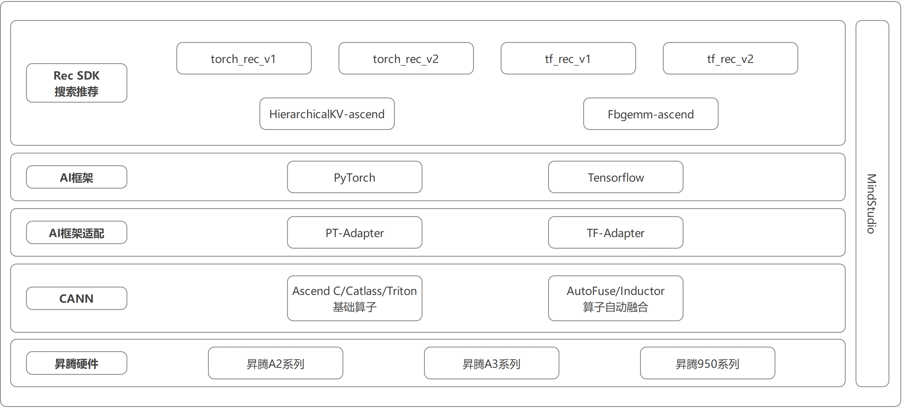

<h1 align="center">Rec SDK</h1>

 
 
 [![Zread](https://img.shields.io/badge/Zread-Ask_AI-_.svg?style=flat&color=0052D9&labelColor=000000&logo=data%3Aimage%2Fsvg%2Bxml%3Bbase64%2CPHN2ZyB3aWR0aD0iMTYiIGhlaWdodD0iMTYiIHZpZXdCb3g9IjAgMCAxNiAxNiIgZmlsbD0ibm9uZSIgeG1sbnM9Imh0dHA6Ly93d3cudzMub3JnLzIwMDAvc3ZnIj4KPHBhdGggZD0iTTQuOTYxNTYgMS42MDAxSDIuMjQxNTZDMS44ODgxIDEuNjAwMSAxLjYwMTU2IDEuODg2NjQgMS42MDE1NiAyLjI0MDFWNC45NjAxQzEuNjAxNTYgNS4zMTM1NiAxLjg4ODEgNS42MDAxIDIuMjQxNTYgNS42MDAxSDQuOTYxNTZDNS4zMTUwMiA1LjYwMDEgNS42MDE1NiA1LjMxMzU2IDUuNjAxNTYgNC45NjAxVjIuMjQwMUM1LjYwMTU2IDEuODg2NjQgNS4zMTUwMiAxLjYwMDEgNC45NjE1NiAxLjYwMDFaIiBmaWxsPSIjZmZmIi8%2BCjxwYXRoIGQ9Ik00Ljk2MTU2IDEwLjM5OTlIMi4yNDE1NkMxLjg4ODEgMTAuMzk5OSAxLjYwMTU2IDEwLjY4NjQgMS42MDE1NiAxMS4wMzk5VjEzLjc1OTlDMS42MDE1NiAxNC4xMTM0IDEuODg4MSAxNC4zOTk5IDIuMjQxNTYgMTQuMzk5OUg0Ljk2MTU2QzUuMzE1MDIgMTQuMzk5OSA1LjYwMTU2IDE0LjExMzQgNS42MDE1NiAxMy43NTk5VjExLjAzOTlDNS42MDE1NiAxMC42ODY0IDUuMzE1MDIgMTAuMzk5OSA0Ljk2MTU2IDEwLjM5OTlaIiBmaWxsPSIjZmZmIi8%2BCjxwYXRoIGQ9Ik0xMy43NTg0IDEuNjAwMUgxMS4wMzg0QzEwLjY4NSAxLjYwMDEgMTAuMzk4NCAxLjg4NjY0IDEwLjM5ODQgMi4yNDAxVjQuOTYwMUMxMC4zOTg0IDUuMzEzNTYgMTAuNjg1IDUuNjAwMSAxMS4wMzg0IDUuNjAwMUgxMy43NTg0QzE0LjExMTkgNS42MDAxIDE0LjM5ODQgNS4zMTM1NiAxNC4zOTg0IDQuOTYwMVYyLjI0MDFDMTQuMzk4NCAxLjg4NjY0IDE0LjExMTkgMS42MDAxIDEzLjc1ODQgMS42MDAxWiIgZmlsbD0iI2ZmZiIvPgo8cGF0aCBkPSJNNCAxMkwxMiA0TDQgMTJaIiBmaWxsPSIjZmZmIi8%2BCjxwYXRoIGQ9Ik00IDEyTDEyIDQiIHN0cm9rZT0iI2ZmZiIgc3Ryb2tlLXdpZHRoPSIxLjUiIHN0cm9rZS1saW5lY2FwPSJyb3VuZCIvPgo8L3N2Zz4K&logoColor=ffffff)](https://zread.ai/Ascend/RecSDK)
 [![DeepWiki](https://img.shields.io/badge/DeepWiki-Ask_AI-_.svg?style=flat&color=0052D9&labelColor=000000&logo=data:image/png;base64,iVBORw0KGgoAAAANSUhEUgAAACwAAAAyCAYAAAAnWDnqAAAAAXNSR0IArs4c6QAAA05JREFUaEPtmUtyEzEQhtWTQyQLHNak2AB7ZnyXZMEjXMGeK/AIi+QuHrMnbChYY7MIh8g01fJoopFb0uhhEqqcbWTp06/uv1saEDv4O3n3dV60RfP947Mm9/SQc0ICFQgzfc4CYZoTPAswgSJCCUJUnAAoRHOAUOcATwbmVLWdGoH//PB8mnKqScAhsD0kYP3j/Yt5LPQe2KvcXmGvRHcDnpxfL2zOYJ1mFwrryWTz0advv1Ut4CJgf5uhDuDj5eUcAUoahrdY/56ebRWeraTjMt/00Sh3UDtjgHtQNHwcRGOC98BJEAEymycmYcWwOprTgcB6VZ5JK5TAJ+fXGLBm3FDAmn6oPPjR4rKCAoJCal2eAiQp2x0vxTPB3ALO2CRkwmDy5WohzBDwSEFKRwPbknEggCPB/imwrycgxX2NzoMCHhPkDwqYMr9tRcP5qNrMZHkVnOjRMWwLCcr8ohBVb1OMjxLwGCvjTikrsBOiA6fNyCrm8V1rP93iVPpwaE+gO0SsWmPiXB+jikdf6SizrT5qKasx5j8ABbHpFTx+vFXp9EnYQmLx02h1QTTrl6eDqxLnGjporxl3NL3agEvXdT0WmEost648sQOYAeJS9Q7bfUVoMGnjo4AZdUMQku50McDcMWcBPvr0SzbTAFDfvJqwLzgxwATnCgnp4wDl6Aa+Ax283gghmj+vj7feE2KBBRMW3FzOpLOADl0Isb5587h/U4gGvkt5v60Z1VLG8BhYjbzRwyQZemwAd6cCR5/XFWLYZRIMpX39AR0tjaGGiGzLVyhse5C9RKC6ai42ppWPKiBagOvaYk8lO7DajerabOZP46Lby5wKjw1HCRx7p9sVMOWGzb/vA1hwiWc6jm3MvQDTogQkiqIhJV0nBQBTU+3okKCFDy9WwferkHjtxib7t3xIUQtHxnIwtx4mpg26/HfwVNVDb4oI9RHmx5WGelRVlrtiw43zboCLaxv46AZeB3IlTkwouebTr1y2NjSpHz68WNFjHvupy3q8TFn3Hos2IAk4Ju5dCo8B3wP7VPr/FGaKiG+T+v+TQqIrOqMTL1VdWV1DdmcbO8KXBz6esmYWYKPwDL5b5FA1a0hwapHiom0r/cKaoqr+27/XcrS5UwSMbQAAAABJRU5ErkJggg==)](https://deepwiki.com/Ascend/RecSDK)

## ✨ 最新消息

🔹 **[2026.04.25]**：[Rec SDK 26.0.0 Release 版本发布](https://gitcode.com/Ascend/RecSDK/releases/v26.0.0) 
🔹 **[2026.02.24]**：资料结构整改，更新Roadmap（2026Q1） 

## Roadmap

[Roadmap（2026Q1）](https://gitcode.com/Ascend/RecSDK/issues/1075)

## ℹ️ 简介

Rec SDK作为面向互联网市场搜索推荐广告的应用使能SDK产品，对于搜索推荐广告模型训练的应用场景需求，提供基于昇腾平台的搜索推荐广告框架，支撑大规模搜推广场景，助力完成搜推广模型的高效训练。

Rec SDK的功能涉及：

1. 模型训练基础功能。支持单机单卡训练、多机多卡分布式训练。
2. 推荐场景特有功能。基于Rec SDK的稀疏表方案，Rec SDK提供必备功能，如特征保存和加载、特征准入、特征淘汰等。
3. 大规模稀疏表特有功能。支持加速卡内存、主机内存、主机磁盘多级存储、支持多机存储、支持动态扩容。规模可超10TB。

## ⚙️ 功能介绍

| 组件名称 | 功能概要 | 文档链接 |
| --- | --- | --- |
| tf_rec_v1 | 支持单机单卡、多机多卡分布式训练；提供特征保存和加载、特征准入与淘汰、动态扩容、动态shape、自动改图、Hot_Embedding、定制WarmStart、增量模型保存与加载、一表多查、PCIE through等推荐场景特有功能；支持加速卡内存、主机内存、主机磁盘多级存储，规模可超10TB；提供性能和精度检测工具 | [详细介绍](./docs/zh/tensorflow/tf_rec_v1/introduction.md) |
| tf_rec_v2 | 支持单机单卡、多机多卡分布式训练；提供稀疏表创建、查询、保存与加载、特征准入与淘汰等推荐场景特有功能；支持大规模稀疏表存储 | [详细介绍](./docs/zh/tensorflow/tf_rec_v2/introduction.md) |
| torch_rec_v1 | 支持单机单卡、多机多卡分布式训练；提供哈希映射、EBC查表、Row-wise分表、流水查表、查表融合算子等推荐场景特有功能；支持按照Row-wise的分布式稀疏表切分方式 | [详细介绍](./docs/zh/torch/torch_rec_v1/introduction.md) |
| torch_rec_v2 | 支持单机单卡、多机多卡分布式训练；提供哈希映射、Row-wise分表、稀疏表动态扩容与淘汰、动态稀疏表算子等推荐场景特有功能；基于HKV高性能key-value存储加速库实现动态稀疏表算子 | [详细介绍](./docs/zh/torch/torch_rec_v2/introduction.md) |

## 🚀 快速入门

| 组件名称 | 基础框架 | 适配状态 | 框架类型 | 功能描述 | 文档链接 |
| --- | --- | --- | --- | --- | --- |
| tf_rec_v1 | TensorFlow | 非全下沉 | 稀疏推荐框架 | 基于TensorFlow，适配NPU设备的非全下沉稀疏推荐框架 | [快速入门](./docs/zh/tensorflow/tf_rec_v1/quick_start.md) |
| tf_rec_v2 | TensorFlow | 全下沉 | 稀疏推荐框架 | 基于TensorFlow，适配NPU设备的全下沉稀疏推荐框架（POC状态） | [快速入门](./docs/zh/tensorflow/tf_rec_v2/quick_start.md) |
| torch_rec_v1 | PyTorch + TorchRec | 非全下沉 | 稀疏推荐框架 | 基于PyTorch、TorchRec开源软件，适配NPU设备的非全下沉稀疏推荐框架 | [快速入门](./docs/zh/torch/torch_rec_v1/quick_start.md) |
| torch_rec_v2 | PyTorch + TorchRec | 全下沉 | 稀疏推荐框架 | 基于PyTorch、TorchRec开源软件，适配NPU设备的全下沉稀疏推荐框架（POC状态） | [快速入门](./docs/zh/torch/torch_rec_v2/quick_start.md) |

关键术语说明

- **非全下沉**：指部分计算任务在NPU上执行，部分在CPU上执行的混合模式
- **全下沉**：指所有计算任务都下沉到NPU上执行，以获得更好的性能
- **POC状态**：Proof of Concept（概念验证）状态，表示该组件仍处于试验验证阶段，功能可能不完整或不稳定

## 📦 环境部署

Rec SDK支持的产品型号如下：

- Atlas 200T A2 Box16
- Atlas 800T A2 训练服务器
- Atlas 900 A3 SuperPoD 超节点

| 组件名称 | 安装指南 |
| --- | --- |
| tf_rec_v1 | [安装指南](./docs/zh/tensorflow/tf_rec_v1/recsdk_tf_installation_guide.md) |
| tf_rec_v2 | [安装指南](./docs/zh/tensorflow/tf_rec_v2/recsdk_tf_installation_guide.md) |
| torch_rec_v1 | [安装指南](./docs/zh/torch/torch_rec_v1/recsdk_torch_installation_guide.md) |
| torch_rec_v2 | [安装指南](./docs/zh/torch/torch_rec_v2/recsdk_torch_installation_guide.md) |

## 📊 模型适配样例

| 模型名称 | 适配框架 | 组件名称 | 代码链接 |
| --- | --- | --- | --- |
| DIN | PyTorch | torch_rec_v1 | [代码链接](https://gitcode.com/Ascend/RecSDK/tree/develop_torch_benchmark/torch2.6.0_examples_benchmark/develop/din) |
| DLRM(DCNv2) | PyTorch | torch_rec_v1 | [代码链接](https://gitcode.com/Ascend/RecSDK/tree/develop_examples_and_tools/torch_examples/dlrm) |
| GR | PyTorch | torch_rec_v1 | [代码链接](https://gitcode.com/Ascend/RecSDK/tree/develop_torch_benchmark/torch2.6.0_examples_benchmark/develop/gr/gr_meta) |
| GR | PyTorch | torch_rec_v1 | [代码链接](https://gitcode.com/Ascend/RecSDK/tree/develop_torch_benchmark/torch2.6.0_examples_benchmark/develop/gr_nv) |
| mmoe、eta | PyTorch | torch_rec_v1 | [代码链接](https://gitcode.com/Ascend/RecSDK/blob/develop_torch_benchmark/torch2.6.0_examples_benchmark/develop/model_zoo/README.md) |
| GR | PyTorch | torch_rec_v2 | [代码链接](https://gitcode.com/Ascend/RecSDK/tree/develop_examples_and_tools/torch_rec_v2_examples/gr) |

## 分支维护策略

RecSDK版本分支的维护阶段如下：

| **状态**            | **时间** | **说明**                                         |
| ------------------- | -------- | ------------------------------------------------ |
| 计划                | 1—3 个月 | 计划特性                                         |
| 开发                | 6—12 个月   | 开发新特性并修复问题，定期发布新版本。针对不同的PyTorch版本采取不同的策略，常规分支的开发周期分别为6个月，长期支持分支的开发周期为12个月 |
| 维护                |  1年/3.5年 | 常规分支维护1年,长期支持分支维护3.5年。对重大BUG进行修复，不合入新特性，并视BUG的影响发布补丁版本 |
| 生命周期终止（EOL） | N/A      | 分支不再接受任何修改                             |

## torch_rec_v1 框架维护策略

torch_rec_v1 各版本维护状态如下：

| **torch_rec_v1版本** | **维护策略** | **当前状态** | **发布时间**   | **后续状态**             | **EOL日期** |
| --- | --- | --- | --- | --- | --- |
| 1.1.0 |常规分支 | 维护态 | 2025年7月23日 | 预计 2026年9月30日后进入无维护状态 | 2026年9月30日 |
| 1.2.0 |常规分支 | 维护态 | 2026年1月04日 | 维护中 |  |

## 🛠️ 贡献指南

欢迎参与项目贡献，贡献流程和规范请参见《[贡献指南](./contributing.md)》。
贡献代码前，请先签署[开放项目贡献者许可协议（CLA）](https://clasign.osinfra.cn/sign/690ca9ddf91c03dee6082ab1)。

1. 如果您遇到bug，请[提交issue](https://gitcode.com/Ascend/RecSDK/issues)。
2. 如果您计划贡献bug-fixes，请提交Pull Requests，参见[具体要求](./contributing.md#pullrequest)。
3. 如果您计划贡献新特性、功能，请先创建issue与我们讨论。写明需求背景/目的，如何设计，对现有API等的影响。未经讨论提交PR可能会导致请求被拒绝，因为项目演进方向可能与您的想法存在偏差。

## ⚖️ 相关说明

🔹 《[版本说明](https://gitcode.com/Ascend/RecSDK/releases)》 
🔹 《[许可证声明](LICENSE)》 
🔹 《[文档许可证声明](./docs/LICENSE)》 
🔹 《[免责声明](docs/zh/disclaimer.md)》 
🔹 组件相关说明

| 组件名称 | FAQ | 安全加固 |
| --- | --- | --- |
| tf_rec_v1 | [FAQ](./docs/zh/tensorflow/tf_rec_v1/faq.md) | [安全加固](./docs/zh/tensorflow/tf_rec_v1/security_hardening.md) |
| tf_rec_v2 | [FAQ](./docs/zh/tensorflow/tf_rec_v2/faq.md) | [安全加固](./docs/zh/tensorflow/tf_rec_v2/security_hardening.md) |
| torch_rec_v1 | / | [安全加固](./docs/zh/torch/torch_rec_v1/security_hardening.md) |
| torch_rec_v2 | / | [安全加固](./docs/zh/torch/torch_rec_v2/security_hardening.md) |

## 🤝 建议与交流

欢迎大家通过以下方式提出问题、交流讨论。

| 资源 | 说明 |
| --- | --- |
| [创建Issue](https://gitcode.com/Ascend/RecSDK/issues/new) | 提交 Bug、需求或建议 |
| [社区任务](https://gitcode.com/Ascend/RecSDK/issues/1096) | 查看和认领社区任务 |

## 🙏 致谢

Rec SDK由华为公司的下列部门联合贡献：

- 昇腾计算应用使能开发部
- 计算软件平台部
- 灵衢算力集群开发部
- 计算技术开发部
- 泊松实验室

感谢来自社区的每一个PR，欢迎贡献Rec SDK！
