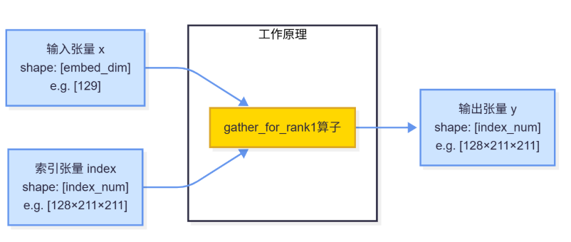

**说明**

本算子仅支持NPU调用。

# 产品支持情况
| 硬件型号              | 是否支持                  |
| -------------------- | ------------------------ |
| Atlas A2训练系列产品  | 是  |
| Atlas A3训练系列产品  | 是  |
| Atlas 推理系列产品    | 是  |

# gather_for_rank1算子目录层级
```shell
-- gather_for_rank1
   |-- v220
      |-- op_host                 # 算子host侧实现
      |-- op_kernel               # 算子kernel侧实现
      |-- gather_for_rank1.json   # 算子原型配置
      |-- gather_for_rank1.png    # 算子实现原理图
      |-- README.md               # 算子说明文档
      |-- run.sh                  # 算子编译部署脚本
```

# 功能

实现x的shape为1的index_select操作，用于从一维张量中根据索引选择元素。

# 算子实现原理



算子工作原理说明：
1. 输入张量x是一个一维张量，包含embed_dim个元素
2. 输入张量index是一个一维索引张量，包含index_num个索引值
3. 算子根据index中的索引值，从x中选择对应的元素
4. 输出张量y的每个元素y[i] = x[index[i]]

例如：
```python
x = [x0, x1, x2, ..., x128]  # shape: [129]
index = [3, 1, 4, 1, 5, ...]  # shape: [128*211*211]
y = [x[3], x[1], x[4], x[1], x[5], ...]  # shape: [128*211*211]
```

输入:
```python
xDim0 = 129
indexDim0 = 128*211*211
x = torch.randn(xDim0).to(torch.float32)
index = torch.randint(0, xDim0, (indexDim0, )).to(torch.int64)
```

输出：
```python
y = torch.index_select(x, dim=0, index=index)
```

# 算子输入与输出
|  名称  |  输入/输出  |  数据类型  |  数据格式  |  范围  |  说明  |
|  ---- |  ---- |  ----  |  ----  |  ----  |  ----  |
|  x | 输入 | float16/float32 | [embed_dim] | 0 < embed_dim <= 20480 | 仅支持一维 |
|  index | 输入 | int32/int64 | [index_num] | 0 < index_num | 仅支持一维<br>index内元素值不得超过x的长度，否则可能导致算子执行失败 |
|  y | 输出 | float16/float32 | [index_num] | NA | NA |

# 算子编译部署

算子编译请参考[RecSDK\cust_op\README.md](../../../../README.md)中"单算子使用说明"-"1.算子编译"章节。

注：详细算子调用示例参考Pytorch框架下[README.md](../../../../framework/torch_plugin/torch_library/2.6.0/gather_for_rank1/README.md)