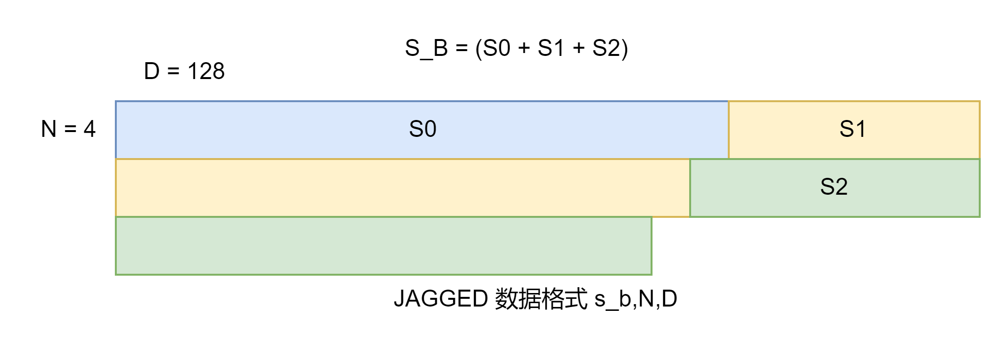

**说明**

本算子仅支持NPU调用

## 支持产品型号

| 硬件型号              | 是否支持                  |
| -------------------- | ------------------------ |
| Atlas A2训练系列产品  | 是  |
| Atlas A3训练系列产品  | 是  |


## hstu_dense_backward_fuxi算子文件结构

 ```shell
hstu_dense_backward_fuxi
└── v220
    ├── op_host    # 算子Host端代码
    ├── op_kernel  # 算子Kernel端代码
    ├── README.md  # 算子说明文档
    └── run.sh     # 算子编译、安装脚本
 ```

## 功能

 算子功能：推荐场景下，使用Hstu-fuxi融合算子实现推荐场景中的注意力机制

 ## 算子实现原理

1. 计算公式：
    $$
    qk=matmul(Q,K_{}^{T})
    $$
    $$
    score=Mask(Silu(qk))/S
    $$
    $$
    vGrad=matmul(score_{}^{T},G_{attn}) + matmul(Mask(biasTs)_{}^{T}, G_{biasTs}) + matmul(Mask(biasPos)_{}^{T}, G_{biasPos})
    $$
    $$
    qGrad=matmul(biasGrad,k)
    $$
    $$
    kGrad=matmul(biasGrad_{}^{T},q)
    $$
    $$
    tsGrad=Mask(matmul(G_{biasTs}, V_{}^{T}))
    $$
    $$
    posGrad=Mask(matmul(G_{biasPos}, V_{}^{T}))
    $$

2. 数据格式

其中Q,K,V是jagged格式

* jagged格式：s_b,N,D 3维数据格式 (稠密格式 为了节省显存)

jagged格式如下图所示：


3. 计算原理

* 输入Q，K，V，Grad是jagged格式, 首先分别进行matmul计算
* mask和timestampBias/positionBias按照参数决定是否加入计算
* score和biasGrad的计算中，会除以序列长度S，jagged模式根据不同batch切换
* 最后score，biasGrad分别和Q/K/V做矩阵乘法得到输出梯度

4. 计算逻辑

```python
def jagged_to_dense(self, jagged_tensor, seq_lens, max_seq_len, head_num, head_dim):
    batch_size = len(seq_lens)
    dense_tensor = torch.zeros(batch_size, max_seq_len, head_num, head_dim, dtype=jagged_tensor.dtype)

    offset = 0
    for batch_id, seq_len in enumerate(seq_lens):
        dense_tensor[batch_id, :seq_len, :, :] = jagged_tensor[offset: offset + seq_len, :, :]
        offset = offset + seq_len

    return dense_tensor


def dense_to_jagged(self, jagged_tensor, dense_tensor, seq_lens):
    tensor = torch.zeros_like(jagged_tensor)

    offset = 0
    for batch_id, seq_len in enumerate(seq_lens):
        tensor[offset: offset + seq_len, :, :] = dense_tensor[batch_id, 0: seq_len, :, :]
        offset = offset + seq_len

        return tensor


def golden_op_exec(grad, q, k, v, bpos, bts, grad_pos, grad_ts, mask, max_seq_len, seq_offset, 
                   mask_type, silu_scale, enable_bias, data_type):
    head_nums = grad.shape[1]
    head_dim = grad.shape[2]
    batch_size = bts.shape[0] # maybe get from mask

    seq_lens = np.zeros((batch_size,)).astype(np.int64)
    for batch_id in range(batch_size):
        seq_lens[batch_id] = seq_offset[batch_id + 1] - seq_offset[batch_id]

    grad_dens = self.jagged_to_dense(grad, seq_lens, max_seq_len, head_nums, head_dim).to("npu")
    q_dens = self.jagged_to_dense(q, seq_lens, max_seq_len, head_nums, head_dim).to("npu")
    k_dens = self.jagged_to_dense(k, seq_lens, max_seq_len, head_nums, head_dim).to("npu")
    v_dens = self.jagged_to_dense(v, seq_lens, max_seq_len, head_nums, head_dim).to("npu")

    qk = torch.matmul(q_dens.permute(0, 2, 1, 3), k_dens.permute(0, 2, 3, 1))
    gv = torch.matmul(grad_dens.permute(0, 2, 1, 3), v_dens.permute(0, 2, 3, 1))

    qk = qk.float()
    gv = gv.float()

    if mask_type == 0 or mask_type == 3:
        mask = mask.to("npu")
        mask = mask.float()

    bts_grad = None
    bpos_grad = None
    if enable_bias:
        bts = bts.to("npu").float()
        bpos = bpos.to("npu").float()

        bts_b = bts.reshape(batch_size, 1, max_seq_len, max_seq_len)\
            .expand(batch_size, head_nums, max_seq_len, max_seq_len)
        bpos_b = bpos.reshape(1, 1, max_seq_len, max_seq_len)\
            .expand(batch_size, head_nums, max_seq_len, max_seq_len)
        if mask_type == mask_tril or mask_type == mask_custom:
            bts_b = bts_b * mask
            bpos_b = bpos_b * mask

        # b Smax n d
        grad_pos_dens = self.jagged_to_dense(grad_pos, seq_lens, max_seq_len, head_nums, head_dim).to("npu")
        grad_ts_dens = self.jagged_to_dense(grad_ts, seq_lens, max_seq_len, head_nums, head_dim).to("npu")

        # b n Smax d x b n d Smax -> b n Smax Smax
        gpos_v = torch.matmul(grad_pos_dens.permute(0, 2, 1, 3), v_dens.permute(0, 2, 3, 1))
        gts_v = torch.matmul(grad_ts_dens.permute(0, 2, 1, 3), v_dens.permute(0, 2, 3, 1))
        if mask_type == mask_tril or mask_type == mask_custom:
            gpos_v = gpos_v * mask.to(data_type)
            gts_v = gts_v * mask.to(data_type)
        bpos_grad = gpos_v.sum(dim=1).sum(dim=0, keepdim=True)
        bts_grad = gts_v.sum(dim=1)

        qkb = qk

    else:
        qkb = qk

    real_silu_scale = 1 / max_seq_len if silu_scale == 0.0 else silu_scale
    
    if mask_type == mask_tril or mask_type == mask_custom:
        score = F.silu(qkb) * real_silu_scale * mask
    else:
        score = F.silu(qkb) * real_silu_scale

    score = score.to(data_type)
    v_grad_dens = torch.matmul(score.permute(0, 1, 3, 2), grad_dens.permute(0, 2, 1, 3)).permute(0, 2, 1, 3)
    if enable_bias:
        bts_m = bts_b.to(data_type)
        bpos_m = bpos_b.to(data_type)
        bts_gts = torch.matmul(bts_m.permute(0, 1, 3, 2), grad_ts_dens.permute(0, 2, 1, 3)).permute(0, 2, 1, 3)
        bpos_gpos = torch.matmul(bpos_m.permute(0, 1, 3, 2), grad_pos_dens.permute(0, 2, 1, 3)).permute(0, 2, 1, 3)
        v_grad_dens = v_grad_dens + bpos_gpos + bts_gts

    if mask_type == mask_tril or mask_type == mask_custom:
        bias_grad = gv * real_silu_scale * mask * F.sigmoid(qkb) * (1 + qkb * (1 - F.sigmoid(qkb)))
    else:
        bias_grad = gv * real_silu_scale * F.sigmoid(qkb) * (1 + qkb * (1 - F.sigmoid(qkb)))

    bias_grad = bias_grad.to(data_type)
    k_grad_dens = torch.matmul(bias_grad.permute(0, 1, 3, 2), q_dens.permute(0, 2, 1, 3)).permute(0, 2, 1, 3)
    q_grad_dens = torch.matmul(bias_grad, k_dens.permute(0, 2, 1, 3)).permute(0, 2, 1, 3)

    bias_grad = bias_grad.cpu()
    q_grad_dens = q_grad_dens.cpu()
    q_grad = self.dense_to_jagged(q, q_grad_dens, seq_lens)
    k_grad_dens = k_grad_dens.cpu()
    k_grad = self.dense_to_jagged(k, k_grad_dens, seq_lens)
    v_grad_dens = v_grad_dens.cpu()
    v_grad = self.dense_to_jagged(v, v_grad_dens, seq_lens)

    if enable_bias:
        bpos_grad = bpos_grad.to(data_type)
        bts_grad = bts_grad.to(data_type)
        bpos_grad = bpos_grad.cpu() if bpos_grad is not None else None
        bts_grad = bts_grad.cpu() if bts_grad is not None else None

    torch.npu.synchronize()

    return q_grad, k_grad, v_grad, bpos_grad, bts_grad
```

## 算子输入与输出

| 名称 | 输入/输出 | 数据类型 | 数据格式 | 备注 |
|----|----|----|----|----|
| grad | 输入| float32/float16/bfloat16 | [s_b, N, D] |
| q | 输入| float32/float16/bfloat16 | [s_b, N, D] |
| k | 输入| float32/float16/bfloat16 | [s_b, N, D] |
| v | 输入| float32/float16/bfloat16 | [s_b, N, D] |
| mask | 可选输入 | float32/float16/bfloat16 | B,N,S,S | S为模型最大的序列长度max_seq_len |
| bias_position | 可选输入 | float32/float16/bfloat16 | 1,S,S | S为模型最大的序列长度max_seq_len |
| bias_timestamp | 可选输入 | float32/float16/bfloat16 | B,S,S | S为模型最大的序列长度max_seq_len |
| grad_bias_position | 输入| float32/float16/bfloat16 | [s_b, N, D] |
| grad_bias_timestamp | 输入| float32/float16/bfloat16 | [s_b, N, D] |
| layout | 属性 | string | N/A | 当前仅支持"jagged"，“jagged”代表Q,K,V数据格式为s_b,N,D格式 |
| mask_type | 属性 | int | N/A | 0:使用内置下三角掩码 1:使用内置上三角掩码(未支持) 2:不使用mask(即使mask传值) 3:使用自定义mask(需要输入mask) |
| max_seq_len | 属性 | int | N/A | 表示模型最大序列长度 |
| silu_scale | 属性 | float | N/A | 支持用户传入自定义silu_scale, 不传入时默认值为1/max_seq_len|
| seq_offsets | 可选属性 | list[int64] | N/A | 表示每个序列的偏移，其中第一个序列的偏移一定是0，此选项只对jagged格式下生效，normal格式不生效。|
| q_grad | 输出 | float32/float16/bfloat16 | [s_b, N, D] |
| k_grad | 输出 | float32/float16/bfloat16 | [s_b, N, D] |
| v_grad | 输出 | float32/float16/bfloat16 | [s_b, N, D] |
| position_bias_grad | 输出 | float32/float16/bfloat16 | 1,S,S | S为变长序列中最大的序列长度 |
| timestamp_bias_grad | 输出 | float32/float16/bfloat16 | B,S,S | S为变长序列中最大的序列长度 |
| vbpos_grad | 输出 | float32/float16/bfloat16 | [s_b, N, N] | S为变长序列中最大的序列长度 |
| vbts_grad | 输出 | float32/float16/bfloat16 | [s_b, N, N] | S为变长序列中最大的序列长度 |

参数范围说明：
* s_b：为jagged格式下各batch的实际序列长度之和
* B: batch_size 表征批处理的大小，当前取值范围[1, 512]。
* S: seq_lens 表征序列长度，当前取值范围[1, 20480]。
* N：head_num 表征头个数，当前取值为[2,4,6,8]。
* D: head_dim 表征维度，当前取值范围范围[16, 512]，并且需要满足是16的倍数。
* 以上四个维度数值均不能为0，为0时算子输入为空数据，不会执行算子计算;并且其中B、N、S参数影响bias、mask占用显存大小，请根据实际内存合理设置参数大小。
* jagged模式下 S为所有序列中最大的序列长度，比如此时有两个序列，一个序列长度为256，另一个序列长度为512，则S为512。
* jagged模式，需要传递可选属性seq_offsets，比如当前有两个序列，一个序列长度为256,另一个序列长度为512，则seqp_offsets = [0, 256, 768]，伪代码如下:

```python
max_seq_len = 512
batch_size = 2
seq_lens = np.random.randint(1, max_seq_len + 1, (batch_size)).astype(np.int64)

seq_offset = torch.concat((torch.zeros((1, ), dtype=torch.int64), \
        torch.cumsum(torch.from_numpy(seq_lens), axis=0))).to(torch.int64).numpy()
```

## 算子约束

* 支持的CANN版本：8.2.RC1.alpha001及之后版本；

# 算子编译部署

算子编译请参考[RecSDK\cust_op\README.md](../../../../README.md)中"单算子使用说明"-"1.算子编译"章节。

注：详细算子调用示例参考Pytorch框架下[README.md](../../../../framework/torch_plugin/torch_library/hstu_dense_forward_fuxi/README.md)
