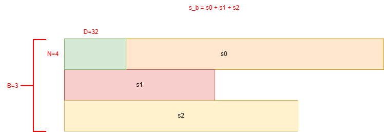
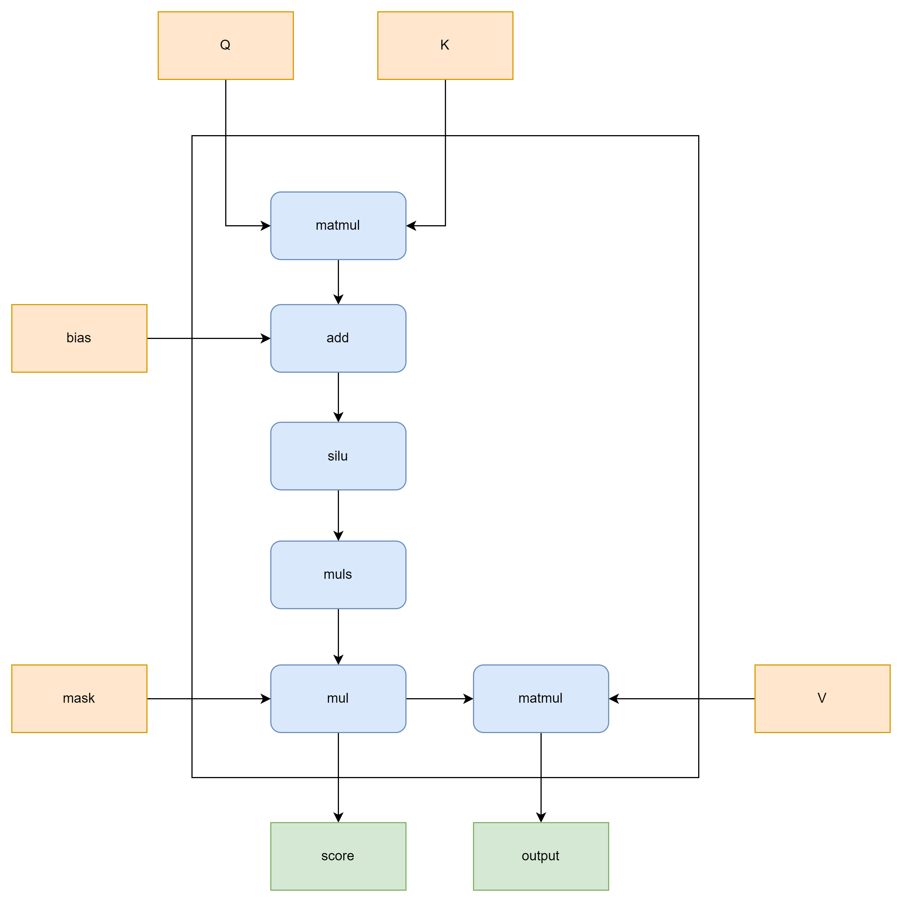

**说明**

本算子仅支持NPU调用

# 产品支持情况
| 硬件型号              | 是否支持                  |
| -------------------- | ------------------------ |
| Atlas A2训练系列产品  | 是  |
| Atlas A3训练系列产品  | 是  |
| Atlas 推理系列产品    | 是  |

# hstu_dense_forward算子文件结构

```shell
-- hstu_dense_forward
   |-- c310   
      |-- run.sh    # hstu_dense_forward算子A5安装脚本
   |-- onnx_plugin   # hstu_dense_forward支持onnx模型转换
   |-- v220
      |-- op_host    # hstu_dense_forward算子Host侧实现
      |-- op_kernel  # hstu_dense_forward算子Kernel侧实现
      |-- pic        # 算子实现原理图
      |-- hstu_dense_forward.json    # 算子原型配置
      |-- README.md  # hstu_dense_forward算子说明文档
      |-- run.sh     # hstu_dense_forward算子A2安装脚本
```

# 功能

推荐场景下，使用Hstu融合算子实现推荐场景中注意力机制。

**GQA支持**：本算子支持Grouped Query Attention (GQA)，允许K/V的头数小于Q的头数，多个Q头可以共享同一个K/V头，从而减少KV缓存内存占用并提升推理性能。

# 算子实现原理

1. 计算公式

$$
HSTU(q, k, v, mask, bias, siluScale) = (Silu(qk_{}^{T} + bias) \times siluScale \times mask)v
$$

2. 数据格式

输入参数q, k, v数据格式为normal或者jagged。
* normal格式：shape为[B, S, N, D]的4维数据格式，排布如下图所示：


* jagged格式：shape为[s_b, N, D]的3维数据格式，排布如下图所示：



3. 计算原理



4. 计算逻辑

```python
def hstu_dense_forward(q_np, k_np, v_np, rel_attn_bias_np, invalid_attn_mask_np):
    q = torch.nn.Parameter(torch.Tensor(q_np).reshape(batch_size, max_seq_len, num_heads, attention_dim).to(dataType).npu(), 
        requires_grad=True)
    k = torch.nn.Parameter(torch.Tensor(k_np).reshape(batch_size, max_seq_len, num_heads, attention_dim).to(dataType).npu(), 
        requires_grad=True)
    v = torch.nn.Parameter(torch.Tensor(v_np).reshape(batch_size, max_seq_len, num_heads, attention_dim).to(dataType).npu(), 
        requires_grad=True)
    real_attn_bias = torch.nn.Parameter(torch.Tensor(rel_attn_bias_np).to(dataType).npu(), requires_grad=True)   
    invalid_attn_mask = torch.Tensor(invalid_attn_mask_np).to(dataType).npu()
     
    qk_attn = torch.einsum(
        "bnhd,bmhd->bhnm",
        q,
        k,
    )
    qk_attn = qk_attn + rel_attn_bias

    qk_attn = F.silu(qk_attn) / max_seq_len
    qk_attn = qk_attn * invalid_attn_mask.unsqueeze(0).unsqueeze(0)
    attn_output = torch.einsum(
            "bhnm,bmhd->bnhd",
            qk_attn,
            v
        ).reshape(batch_size, seq_len, num_heads * attention_dim)

    return npu2cpu(attn_output)

```

# 算子输入与输出

## Atlas A2/A3训练产品

| 名称                | 输入/输出 | 数据类型                             | 数据格式                            | 范围                                                                                                     | 说明                                                                                                              |
|-------------------|-------|----------------------------------|---------------------------------|--------------------------------------------------------------------------------------------------------|-----------------------------------------------------------------------------------------------------------------|
| q                 | 输入    | Tensor[float32/float16/bfloat16] | [B, S, N_q, D]/<br>[s_b, N, D]  | B∈[1, 2048]<br>S∈[1, 20480]<br>N_q∈[1, 16]<br>D∈[16, 512]且是16的倍数                                       | B:batch_size,表征批处理大小<br>S:seq_len,表征序列长度<br>N:head_num,表征头个数<br>D:head_dim,表征维度<br>s_b为jagged格式下各batch的实际序列长度之和 |
| k                 | 输入    | Tensor[float32/float16/bfloat16] | [B, S, N_k, D]/<br>[s_b, N, D]  | 同q                                                                                                     | **GQA支持**：K的头数可以小于Q的头数，但必须满足N_q能被N_k整除                                                                          |
| v                 | 输入    | Tensor[float32/float16/bfloat16] | [B, S, N_k, D]/<br>[s_b, N, D]  | 同q                                                                                                     | 同k                                                                                                              |
| mask              | 输入    | Tensor[float32/float16/bfloat16] | [B, N, S, S]                    | NA                                                                                                     | S为模型最大序列长度max_seq_len<br>不使用mask时传入None，类型需与q一致<br>N与q保持一致                                                      |
| attn_bias         | 输入    | Tensor[float32/float16/bfloat16] | [B, N, S, S]                    | NA                                                                                                     | S为模型最大序列长度max_seq_len<br>不使用attn_bias时传入None，类型需与q一致 <br>N与q保持一致                                                |
| seq_offsets_q     | 输入    | Tensor[int32_t/int64_t]                  | [B + 1]                         | NA                                                                                                     | 表示每个batch的实际Q序列长度偏移，从0开始递增，需用户自行保证合法性，仅在jagged格式下生效                                                             |
| seq_offsets_k     | 输入    | Tensor[int32_t/int64_t]                  | [B + 1]                         | NA                                                                                                     | 表示每个batch的实际K序列长度偏移，从0开始递增，需用户自行保证合法性，仅在jagged格式下生效                                                             |
| seq_offsets_t     | 输入    | Tensor[int32_t/int64_t]                  | [B + 1]                         | NA                                                                                                     | 目标序列偏移量张量                                                                                                       |
| kv_cache          | 输入    | Tensor[float32/float16/bfloat16] | [num_pages, 2, page_size, N, D] | NA                                                                                                     | KV缓存张量，用于存储历史Key-Value对                                                                                         |
| page_offsets      | 输入    | Tensor[int32_t/int64_t]                  | [B + 1]                         | NA                                                                                                     | 页面偏移量张量                                                                                                         |
| page_ids          | 输入    | Tensor[int32_t/int64_t]                  | [page_offsets[-1]]              | NA                                                                                                     | 页面ID张量                                                                                                          |
| last_page_len     | 输入    | Tensor[int32_t/int64_t]                  | [B]                             | NA                                                                                                     | 最后一页长度张量                                                                                                        |
| num_context       | 输入    | Tensor[int32_t/int64_t]                  | [B]                             | 取值范围[0, 256]，其余数值未约束、未看护                                                                               | 上下文数量张量                                                                                                         |
| num_target        | 输入    | Tensor[int32_t/int64_t]                  | [B]                             | 取值范围[0, 512]，其余数值未约束、未看护                                                                               | 目标数量张量                                                                                                          |
| mask_type         | 输入    | int                              | NA                              | 0：使用内置下三角mask，不需要传入mask<br>1：使用内置上三角mask，不需要传入mask(当前暂不支持)<br>2：不使用mask<br>3：使用自定义mask，此时mask需要用户定义并传入 | NA                                                                                                              |
| max_seq_len_q     | 输入    | int                              | NA                              | [1, 20480]                                                                                             | 表示模型Q序列最大长度                                                                                                     |
| max_seq_len_k     | 输入    | int                              | NA                              | [1, 20480]                                                                                             | 表示模型K序列最大长度                                                                                                     |
| silu_scale        | 输入    | float                            | NA                              | NA                                                                                                     | 支持用户传入自定义，不传入时默认为1/max_seq_len                                                                                  |
| layout            | 输入    | string                           | NA                              | "normal":代表q,k,v数据格式为[B, S, N, D]<br>"jagged":代表q,k,v数据格式为[s_b, N, D]                                  | NA                                                                                                              |
| target_group_size | 输入    | int                              | NA                              | 目前仅看护{0, 1, 3}，其余数值未约束、未看护                                                                             | 创建内置target mask时使用，target_group_size为0时不创建target mask                                                           |
| is_delta_qk       | 输入    | int                              | NA                              | NA                                                                                                     | QK序列是否等长：0=等长，1=不等长                                                                                             |
| alpha             | 输入    | float                            | NA                              | NA                                                                                                     | Alpha缩放参数                                                                                                       |
| attn_output       | 输出    | Tensor[float32/float16/bfloat16] | [B, S, N, D]/<br>[s_b, N, D]    | 同q                                                                                                     | 同q                                                                                                              |

## Atlas 推理系列产品

| 名称                | 输入/输出 | 数据类型                             | 数据格式                            | 范围                                                                                                     | 说明                                                                                                              |
|-------------------|-------|----------------------------------|---------------------------------|--------------------------------------------------------------------------------------------------------|-----------------------------------------------------------------------------------------------------------------|
| q                 | 输入    | Tensor[float32/float16/bfloat16] | [B, S, N_q, D]/<br>[s_b, N, D]  | B∈[1, 2048]<br>S∈[1, 20480]<br>N_q∈[1, 16]<br>D∈[16, 512]且是16的倍数                                       | B:batch_size,表征批处理大小<br>S:seq_len,表征序列长度<br>N:head_num,表征头个数<br>D:head_dim,表征维度<br>s_b为jagged格式下各batch的实际序列长度之和 |
| k                 | 输入    | Tensor[float32/float16/bfloat16] | [B, S, N_k, D]/<br>[s_b, N, D]  | 同q                                                                                                     | **GQA支持**：K的头数可以小于Q的头数，但必须满足N_q能被N_k整除                                                                          |
| v                 | 输入    | Tensor[float32/float16/bfloat16] | [B, S, N_k, D]/<br>[s_b, N, D]  | 同q                                                                                                     | 同k                                                                                                              |
| mask              | 输入    | Tensor[float32/float16/bfloat16] | [B, N, S, S]                    | NA                                                                                                     | S为模型最大序列长度max_seq_len<br>不使用mask时传入None，类型需与q一致<br>N与q保持一致                                                      |
| attn_bias         | 输入    | Tensor[float32/float16/bfloat16] | [B, N, S, S]                    | NA                                                                                                     | S为模型最大序列长度max_seq_len<br>不使用attn_bias时传入None，类型需与q一致 <br>N与q保持一致                                                |
| seq_offsets_q     | 输入    | Tensor[int32_t/int64_t]                  | [B + 1]                         | NA                                                                                                     | 表示每个batch的实际Q序列长度偏移，从0开始递增，需用户自行保证合法性，仅在jagged格式下生效                                                             |
| seq_offsets_k     | 输入    | Tensor[int32_t/int64_t]                  | [B + 1]                         | NA                                                                                                     | 表示每个batch的实际K序列长度偏移，从0开始递增，需用户自行保证合法性，仅在jagged格式下生效                                                             |
| seq_offsets_t     | 输入    | Tensor[int32_t/int64_t]                  | [B + 1]                         | NA                                                                                                     | 目标序列偏移量张量                                                                                                       |
| kv_cache          | 输入    | Tensor[float32/float16/bfloat16] | [num_pages, 2, page_size, N, D] | page_size∈{32, 128, 256}                                                                               | KV缓存张量，用于存储历史Key-Value对                                                                                         |
| page_offsets      | 输入    | Tensor[int32_t/int64_t]                  | [B + 1]                         | NA                                                                                                     | 页面偏移量张量                                                                                                         |
| page_ids          | 输入    | Tensor[int32_t/int64_t]                  | [page_offsets[-1]]              | NA                                                                                                     | 页面ID张量                                                                                                          |
| last_page_len     | 输入    | Tensor[int32_t/int64_t]                  | [B]                             | NA                                                                                                     | 最后一页长度张量                                                                                                        |
| num_context       | 输入    | Tensor[int32_t/int64_t]                  | [B]                             | 取值范围[0, 256]，其余数值未约束、未看护                                                                               | 上下文数量张量                                                                                                         |
| num_target        | 输入    | Tensor[int32_t/int64_t]                  | [B]                             | 取值范围[0, 512]，其余数值未约束、未看护                                                                               | 目标数量张量                                                                                                          |
| mask_type         | 输入    | int                              | NA                              | 0：使用内置下三角mask，不需要传入mask<br>1：使用内置上三角mask，不需要传入mask(当前暂不支持)<br>2：不使用mask<br>3：使用自定义mask，此时mask需要用户定义并传入 | NA                                                                                                              |
| max_seq_len_q     | 输入    | int                              | NA                              | [1, 20480]                                                                                             | 表示模型Q序列最大长度                                                                                                     |
| max_seq_len_k     | 输入    | int                              | NA                              | [1, 20480]                                                                                             | 表示模型K序列最大长度                                                                                                     |
| silu_scale        | 输入    | float                            | NA                              | NA                                                                                                     | 支持用户传入自定义，不传入时默认为1/max_seq_len                                                                                  |
| layout            | 输入    | string                           | NA                              | "normal":代表q,k,v数据格式为[B, S, N, D]<br>"jagged":代表q,k,v数据格式为[s_b, N, D]                                  | NA                                                                                                              |
| target_group_size | 输入    | int                              | NA                              | 目前仅看护{0, 1, 3}，其余数值未约束、未看护                                                                             | 创建内置target mask时使用，target_group_size为0时不创建target mask                                                           |
| is_delta_qk       | 输入    | int                              | NA                              | NA                                                                                                     | QK序列是否等长：0=等长，1=不等长                                                                                             |
| alpha             | 输入    | float                            | NA                              | NA                                                                                                     | Alpha缩放参数                                                                                                       |
| attn_output       | 输出    | Tensor[float32/float16/bfloat16] | [B, S, N, D]/<br>[s_b, N, D]    | 同q                                                                                                     | 同q                                                                                                              |

注：
* B,S,N,D四个维度数据均不能为0，为0时算子输入为空数据，不会执行算子计算。
* 其中B,S,N参数影响bias、mask占用显存大小，请根据实际内存合理设置参数大小。

# 算子编译部署

算子编译请参考[RecSDK\cust_op\README.md](../../../../README.md)中"单算子使用说明"-"1.算子编译"章节。

注：详细算子调用示例参考Pytorch框架下[README.md](../../../../framework/torch_plugin/torch_library/hstu/README.md)

# GQA (Grouped Query Attention) 支持说明

## GQA概述

Grouped Query Attention (GQA) 是一种注意力机制优化技术，允许K/V的头数小于Q的头数，多个Q头共享同一个K/V头，从而在保持模型质量的同时，显著减少KV缓存内存占用并提升推理性能。

## GQA配置示例

| 配置名称 | N_q | N_k | h_h_k_ratio | 说明 |
|---------|-----|-----|-------------|------|
| **标准MHA** | 8 | 8 | 1 | 每个Q头有独立的K/V头 |
| **GQA-4** | 8 | 2 | 4 | 每4个Q头共享1个K/V头 |
| **GQA-2** | 8 | 4 | 2 | 每2个Q头共享1个K/V头 |
| **MQA** | 8 | 1 | 8 | 所有Q头共享1个K/V头 |

## GQA使用示例

```python
import torch
import torch_npu

# GQA配置：8个Q头，2个K/V头
batch_size = 2
seq_len = 256
num_heads_q = 8    # Q的头数
num_heads_k = 2    # K/V的头数（GQA模式）
head_dim = 64

# 生成数据
q = torch.randn(batch_size * seq_len, num_heads_q, head_dim, dtype=torch.float16).npu()
k = torch.randn(batch_size * seq_len, num_heads_k, head_dim, dtype=torch.float16).npu()  # K头数小于Q
v = torch.randn(batch_size * seq_len, num_heads_k, head_dim, dtype=torch.float16).npu()  # V头数等于K

# 调用算子（jagged格式）
seq_offsets_q = torch.tensor([0, 128, 256], dtype=torch.int64).npu()
seq_offsets_k = torch.tensor([0, 128, 256], dtype=torch.int64).npu()

output = torch.ops.mxrec.hstu_jagged(
    q=q,
    k=k,
    v=v,
    mask=None,
    bias=None,
    mask_type=0,  # 下三角mask
    max_seq_len=256,
    max_seq_len_k=256,
    silu_scale=1.0/256,
    seq_offset=seq_offsets_q,
    seq_offset_k=seq_offsets_k
)

# 输出形状：[batch_size * seq_len, num_heads_q, head_dim]
print(output.shape)  # torch.Size([512, 8, 64])
```

## GQA约束条件

1. **整除约束**：`N_q % N_k == 0`（Q头数必须能被K/V头数整除）
2. **头数约束**：`N_k = N_v`（K和V的头数必须相同）
3. **头数范围**：`N_k >= 1, N_q >= N_k`（K/V头数至少为1，Q头数不小于K/V头数）