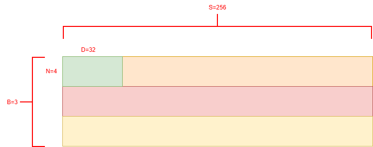
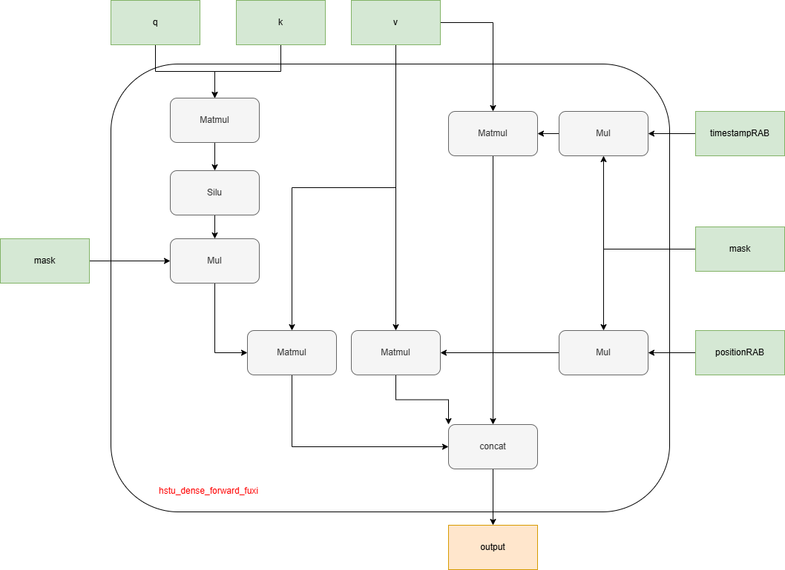

**说明**

本算子仅支持NPU调用

## 支持产品型号

| 硬件型号              | 是否支持                  |
| -------------------- | ------------------------ |
| Atlas A2训练系列产品  | 是  |
| Atlas A3训练系列产品  | 是  |
| Atlas 推理系列产品    | 是  |

## hstu_dense_forward_fuxi算子文件结构
```shell
-- hstu_dense_forward_fuxi
   |-- onnx_plugin   # hstu_dense_forward_fuxi算子支持onnx模型转换
   |-- v220
      |-- op_host    # hstu_dense_forward_fuxi算子Host侧实现
      |-- op_kernel  # hstu_dense_forward_fuxi算子Kernel侧实现
      |-- pic        # 算子实现原理图
      |-- hstu_dense_forward_fuxi.json    # 算子原型配置
      |-- README.md  # hstu_dense_forward_fuxi算子说明文档
      |-- run.sh     # hstu_dense_forward_fuxi算子安装脚本
```

## 功能

算子功能: 推荐场景下，基于Hstu融合算子实现推荐场景Alpha-Fuxi模型中注意力机制

## 算子实现原理

1. 计算公式:
    $$
    HSTU\_FUXI(q, k, v, timestampBias, positionBias, mask, siluScale) =
    $$
    $$
        cat([(Silu(qk_{}^{T} + bias) \times siluScale \times mask)v, (timestampBias \times mask)v, (positionBias \times mask)v], -1)
    $$

2. 数据格式

输入参数q, k, v数据格式在推理服务器上为normal，在训练服务器上jagged。
* normal格式：shape为[B, S, N, D]的4维数据格式，排布如下图所示：



* jagged格式：shape为[s_b, N, D]的3维数据格式，排布如下图所示：


3. 计算原理



4. 计算逻辑

```python
def hstu_fuxi(q, k, v, ts_bias, pos_bias, mask, mask_type, max_seq_len, silu_scale, enable_bias, data_type):
    batch, seq_len, num_head, dim = q.shape

    q = q.permute(0, 2, 1, 3)
    k = k.permute(0, 2, 3, 1)
    qk_attn = torch.matmul(q, k)

    qk_attn = qk_attn.to(torch.float32)
    mask = mask.to(torch.float32)

    real_silu_scale = 1 / max_seq_len if silu_scale == 0 else silu_scale
    qk_attn = F.silu(qk_attn) * real_silu_scale

    mask = mask.repeat(1, num_head, 1, 1)
    qk_attn = qk_attn * mask

    v = v.permute(0, 2, 1, 3)

    qk_attn = qk_attn.to(data_type)
    atten_output = torch.matmul(qk_attn, v)
    atten_output = atten_output.permute(0, 2, 1, 3)
    atten_output = atten_output.reshape(batch, seq_len, -1)
    torch.npu.synchronize()

    if enable_bias:
        ts_bias = ts_bias.to(torch.float32)
        ts_bias = ts_bias.unsqueeze(1)
        ts_bias = ts_bias.repeat(1, num_head, 1, 1)
        ts_tmp = ts_bias * mask
        ts_tmp = ts_tmp.to(data_type)
        ts_out = torch.matmul(ts_tmp, v)
        ts_out = ts_out.permute(0, 2, 1, 3)
        ts_out = ts_out.reshape(batch, seq_len, -1)

        pos_bias = pos_bias.to(torch.float32)
        pos_bias = pos_bias.unsqueeze(1)
        pos_bias = pos_bias.repeat(1, num_head, 1, 1)
        pos_tmp = pos_bias * mask
        pos_tmp = pos_tmp.to(data_type)
        pos_out = torch.matmul(pos_tmp, v)
        pos_out = pos_out.permute(0, 2, 1, 3)
        pos_out = pos_out.reshape(batch, seq_len, -1)

        atten_output = torch.cat([atten_output, ts_out, pos_out], -1)

    return atten_output.cpu().to(data_type)
```

## 算子输入与输出

### Atlas A2/A3 训练系列产品

| 名称 | 输入/输出 | 数据类型 | 数据格式 | 范围 | 备注 |
|----|----|----|----|----| ---- |
| q | 输入| float32/float16/bfloat16 | [s_b, N, D] | B∈[1, 512]<br>S∈[1, 20480]<br>N∈[2, 8]且为2的倍数<br>D∈[16, 512]且是16的倍数 | B:batch_size,表征批处理大小<br>S:seq_len,表征序列长度<br>N:head_num,表征头个数<br>D:head_dim,表征维度<br>s_b为jagged格式下各batch的实际序列长度之和 |
| k | 输入| float32/float16/bfloat16 | [s_b, N, D] | 同q | 同q |
| v | 输入| float32/float16/bfloat16 | [s_b, N, D] | 同q | 同q |
| timestamp_bias | 输入(可选) | float32/float16/bfloat16 | B,S,S | 同q | S为模型最大的序列长度max_seq_len，不使用时传入None |
| position_bias | 输入(可选) | float32/float16/bfloat16 | 1,S,S | 同q | S为模型最大的序列长度max_seq_len，不使用时传入None |
| mask | 输入(可选) | float32/float16/bfloat16 | B,N,S,S | 同q | S为模型最大的序列长度max_seq_len，不使用时传入None |
| maskType | 输入(属性) | int | N/A | 0:使用内置下三角mask，不需要传递mask输入<br>1:使用内置上三角mask，不需要传递mask输入，当前暂不支持<br>2:不使用mask<br>3:使用用户自定义mask，此时mask输入需要用户定义并传入 | NA |
| max_seq_len | 输入(属性) | int | N/A | [1, 20480] | 表示模型最大序列长度 |
| siluScale | 输入(属性) | float | N/A | NA | 支持用户传入自定义siluScale, 不传入时默认值为1/max_seq_len|
| layout | 输入(属性) | string | N/A | 当前仅支持"jagged"，"jagged"代表Q,K,V数据格式为s_b,N,D格式 |  |
| seq_offsets | 输入(可选属性) | list[int64] | N/A | 表示每个序列的偏移，其中第一个序列的偏移一定是0 |  |
| output | 输出 | float32/float16/bfloat16 | [s_b, N, x * D] | 同q | 当输入RAB为空时，x=1，此时结果为qkv计算结果<br>当输入RAB不为空时，x=3，此时结果为qkv结果与两个rab结果cat，将最后一维整合所得 |

### Atlas 推理系列产品

| 名称 | 输入/输出 | 数据类型 | 数据格式 | 范围 | 备注 |
|----|----|----|----|----|----|
| q | 输入| float16 | [B, S, N, D] | B∈[1, 10]<br>S∈[64, 20480]且是64的倍数<br>N∈[2, 8]且为2的倍数<br>D∈[16, 128]且是16的倍数 | B:batch_size,表征批处理大小<br>S:seq_len,表征序列长度<br>N:head_num,表征头个数<br>D:head_dim,表征维度 |
| k | 输入| float16 | [B, S, N, D] | 同q | 同q |
| v | 输入| float16 | [B, S, N, D] | 同q | 同q |
| timestamp_bias | 输入(可选) | float16 | B,S,S | 同q | S为模型最大的序列长度max_seq_len，不使用时传入None |
| position_bias | 可选输入 | float16 | B,S,S | 同q | S为模型最大的序列长度max_seq_len，不使用时传入None |
| mask | 输入 | float16 | B,1,S,S | 同q | 掩码，当前仅支持normal格式，S为模型最大的序列长度max_seq_len，mask为基于下三角的自定义，需要用户基于下三角自定义传入 |
| maskType | 输入(属性) | int | N/A | 3:使用用户自定义mask，此时mask输入需要用户定义并传入 |  |
| max_seq_len | 输入(属性) | int | N/A | 表示模型最大序列长度 |
| siluScale | 输入(属性) | float | N/A | 支持用户传入自定义siluScale，不传入时默认值为1/S， S为等长的序列长度|
| layout | 输入(可选属性) | string | N/A |  当前仅支持"normal"，Q,K,V数据格式为B,S,N,D格式 |  |
| output | 输出 | float16 | [B, S, N, x * D] | 同q | 当输入RAB为空时，x=1，此时结果为qkv计算结果<br>当输入RAB不为空时，x=3，此时结果为qkv结果与两个rab结果cat，将最后一维整合所得 |


注：
* B,S,N,D四个维度数据均不能为0，为0时算子输入为空数据，不会执行算子计算。
* 其中B,S,N参数影响bias、mask占用显存大小，请根据实际内存合理设置参数大小。

# 算子编译部署

算子编译请参考[RecSDK\cust_op\README.md](../../../../README.md)中"单算子使用说明"-"1.算子编译"章节。

注：详细算子调用示例参考Pytorch框架下[README.md](../../../../framework/torch_plugin/torch_library/hstu_dense_forward_fuxi/CMakeLists.txt)