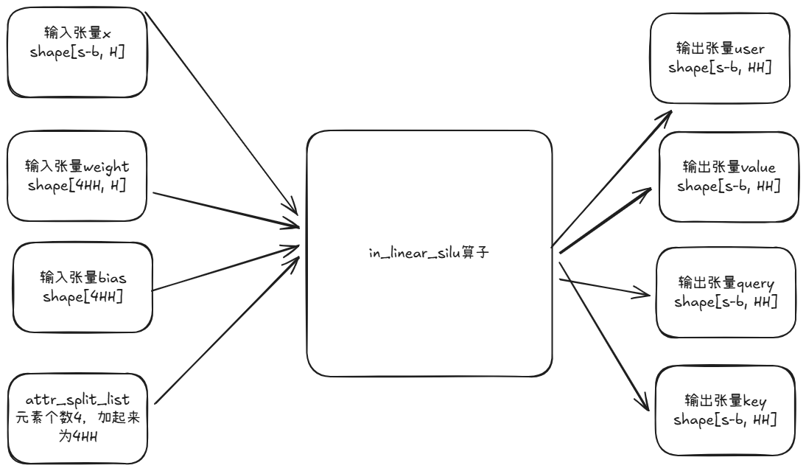

**说明**

本算子仅支持NPU调用。

# 产品支持情况
| 硬件型号              | 是否支持                  |
| -------------------- | ------------------------ |
| Atlas A2训练系列产品  | 是  |
| Atlas A5训练系列产品    | 是  |

# in_linear_silu算子目录层级
```shell
-- in_linear_silu
   |-- v220
      |-- op_host                 # 算子host侧实现
      |-- op_kernel               # 算子kernel侧实现
      |-- in_linear_silu.json   # 算子原型配置
      |-- README.md               # 算子说明文档
      |-- run.sh                  # 算子编译部署脚本
```

# 功能

用于HSTU Attention前将合并并归一化后得UVQK进行Linear、Silu操作后拆分成User、Value、Query、Key 4个Tensor

# 算子实现原理



算子工作原理说明：
1. 输入张量x ND格式，支持FLOAT16、FLOAT、BFLOAT16类型，shape = (m, k) 不可为空
2. 输入张量weight ND格式，支持FLOAT16、FLOAT、BFLOAT16类型，shape = (n, k), 如果为(k, n)需要转置后传入 不可为空
3. 输入张量bias ND格式，支持FLOAT类型，shape = (n,) 不可为空
4. attr属性 splitArgList(List[int], 计算输入)： User、Value、Query、Key的长度， 4个int类型的List,如果x为FLOAT类型，则成员必须为8的倍数；如果x为FLOAT16,BFLOAT16，则成员必须为16的倍数，4个数总和为n,不可为空
5. 输出张量 user, value, query, key,计算输出结果
6. 输出张量 linearOutputOut中间数据用于反向计算或者workspace使用。需要传入。类型同x。shape = (m, n) 不可为空
7. x weight bias做mmad得到的结果做silu最后根据splitArgList将结果分为user, value, query, key。

# 依赖

算子依赖CATLASS源码， 验证过的版本是[catlass v1.3.0](https://raw.gitcode.com/cann/catlass/archive/refs/heads/v1.3.0.zip)

设置如下环境变量
```shell
export CATLASS_HOME=<catlass_home>
```

例如：
```python
x = [m, k]  # shape: [m, k]
weight = [n, k]  # shape: [n, k]
bias = [n, ]
attr_split_list = [tmp1, tmp2, tmp3, tmp4]  # tmp1 + tmp2 + tmp3 + tmp4 = n

def init_linear_golden(m: torch.nn.Module):
    m.weight.data = weight
    m.bias.data = bias
linear_uvqk_golden = torch.nn.Linear(128, weight.shape[0], bias=True, devie="cpu", dtype=x.dtype)
mixed_uvqk = linear_uvqk_golden(x)
mixed_uvqk = torch.nn.functional.silu(mixed_uvqk)
(user, value, query, key) = torch.split(mixed_uvqk, split_arg_list, dim=-1,)
```

输入:
```python
seg_len = int(n / 4)
split_arg_list = [seg_len, seg_len, seg_len, seg_len]
x = torch.rand((m, k))
weight = torch.rand((n, k))
bias = torch.rand((n,))
```

输出：
```python
def init_linear_golden(m: torch.nn.Module):
    m.weight.data = weight
    m.bias.data = bias
linear_uvqk_golden = torch.nn.Linear(128, weight.shape[0], bias=True, devie="cpu", dtype=x.dtype)
mixed_uvqk = linear_uvqk_golden(x)
mixed_uvqk = torch.nn.functional.silu(mixed_uvqk)
(user, value, query, key) = torch.split(mixed_uvqk, split_arg_list, dim=-1,)
```

# 算子输入与输出
| 名称      | 输入/输出 | 参数类型 | 数据类型         | 数据格式       | 范围         | 说明                                  |
|---------|------------|------|--------------|------------|------------|----------------------------------------|
| x       | 输入       | Tensor | float32/float16/bfloat16 | [b-s, H] | `[]` |                 |
| weight   | 输入       | Tensor | float32/float16/bfloat16 | [4HH, H] | `[]` |               |
| bias    | 输入       | Tensor | float32 | [H, ] | `[]` |               |
| splitArgList | 输入(属性)  | ListInt | int   |           |          |     |
| user (返回值) | 输出     | Tensor | float32/float16/bfloat16 | [b-s, H] | NA         |            |
| value (返回值) | 输出     | Tensor | float32/float16/bfloat16 | [b-s, H] | NA         |            |
| query (返回值) | 输出     | Tensor | float32/float16/bfloat16 | [b-s, H] | NA         |            |
| key (返回值) | 输出     | Tensor | float32/float16/bfloat16 | [b-s, H] | NA         |            |
| linear_output (返回值) | 输出     | Tensor | float32/float16/bfloat16 | [b-s, H] | NA         |            |

# 算子编译部署

算子编译请参考[RecSDK\cust_op\README.md](../../../../README.md)中"单算子使用说明"-"1.算子编译"章节。

注：详细算子调用示例参考Pytorch框架下[README.md](../../../../framework/torch_plugin/torch_library/in_linear_silu/README.md)