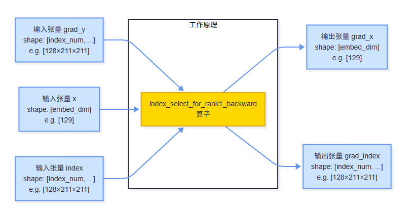

**说明**

本算子仅支持NPU调用。

# 产品支持情况
| 硬件型号              | 是否支持                  |
| -------------------- | ------------------------ |
| Atlas A2训练系列产品  | 是  |
| Atlas A3训练系列产品  | 是  |

# index_select_for_rank1_backward算子目录层级
```shell
-- index_select_for_rank1_backward
   |-- v220
      |-- op_host                           # 算子host侧实现
      |-- op_kernel                         # 算子kernel侧实现
      |-- index_select_for_rank1_backward.json   # 算子原型配置
      |-- index_select_for_rank1_backward.png    # 算子实现原理图
      |-- README.md                         # 算子说明文档
      |-- run.sh                            # 算子编译部署脚本
```

# 功能

实现index_select的反向函数，聚合所有的grad，用于计算梯度。

# 算子实现原理


算子工作原理说明：
1. 输入张量grad_y是前向传播中index_select操作的梯度
2. 输入张量x是前向传播中的原始输入张量
3. 输入张量index是前向传播中使用的索引张量
4. 算子根据index中的索引值，将grad_y中的梯度聚合到grad_x中
5. 对于x中的每个元素i，grad_x[i]是所有满足index[j] == i的grad_y[j]的和

例如：
```python
grad_y = [g0, g1, g2, ..., g_{N-1}]  # shape: [N] where N = 128*211*211
index =  [3,  1,  4,  1,  5,   ...]  # shape: [N]
grad_x = [0,  g1+g3,  0,  g0,  g2,  ...]  # shape: [129]
```

输入:
```python
import numpy as np

def index_select_for_rank1_backward(grad, x, index):
    grad_x = np.zeros(x.shape).astype(np.float32)
    grad_index = np.zeros(index.shape)
    for i in range(x.shape[0]):
        out = grad[index == i]
        out = out.sum()
        grad_x[i] = out
    return grad_x.astype(np.float32), grad_index

grad = np.ones([128, 211, 211]).astype(np.float32)
x = np.ones([129]).astype(np.float32)
index = np.arange(128)[:, np.newaxis, np.newaxis].repeat(211, axis=1).repeat(211, axis=2) 

grad_x, grad_index = index_select_for_rank1_backward(grad, x, index)
```

输出：
```python
grad_x, grad_index
```

# 算子输入与输出
|  名称  |  输入/输出  |  数据类型  |  数据格式  |  范围  |  说明  |
|  ---- |  ---- |  ----  |  ----  |  ----  |  ----  |
|  grad_y | 输入 | float32 | [index_num, ...] | NA | index select的反向grad |
|  x | 输入 | float32 | [embed_dim] | NA | index select查询的tensor |
|  index | 输入 | int32/int64 | [index_num, ...] | NA | index select查询的index<br>index内的值不得超过x第0维长度 |
|  grad_x | 输出 | float32 | [embed_dim] | NA | x的梯度 |
|  grad_index | 输出 | int32/int64 | [index_num, ...] | NA | index的梯度 |

# 算子编译部署

算子编译请参考[RecSDK\cust_op\README.md](../../../../README.md)中"单算子使用说明"-"1.算子编译"章节。

注：详细算子调用示例参考Pytorch框架下[README.md](../../../../framework/torch_plugin/torch_library/index_select_for_rank1_backward/README.md)