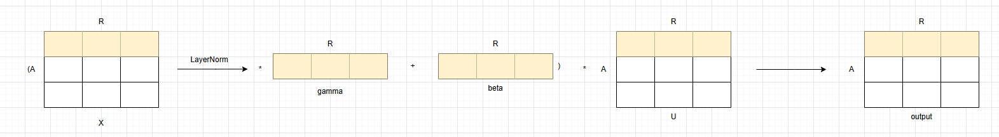

**说明**

本算子仅支持NPU调用。

# 产品支持情况

| 硬件型号           | 是否支持 |
|----------------|------|
| Atlas A2训练系列产品 | 是    |
| Atlas A3训练系列产品 | 是    |
| Atlas 推理系列产品   | 是    |

# ln_mul算子目录层级

```shell
ln_mul
|-- v220
   |-- op_host        # 算子host侧实现
   |-- op_kernel      # 算子kernel侧实现
   |-- ln_mul.json    # 算子原型配置
   |-- README.md      # 算子说明文档
   |-- run.sh         # 算子编译部署脚本
```

# 功能


实现上述图中计算的功能，对输入X进行LayerNorm，在将其结果分别于gamma和beta进行计算，最后在和输入U做乘法得到最后的结果，
对应开源API: torch.ops.mxrec.ln_mul

# 算子实现原理

算子采用AscendC进行开发，其中LayerNorm部分使用基础Api实现，具体计算步骤如下所示：
```shell
1. 计算输入x每一行元素的和
2. 计算上述结果的均值mean
3. 计算输入x和mean的差值x-mean
4. 计算(x - mean) * (x - mean)
5. 计算上述结果每一行的均值即方差var
6. 计算标准差的倒数rstd=1.0/sqrt(var+epsilon)
7. 计算layernorm的结果rstd * (x - mean) * gamma + beta
8. 最后layernorm的结果与输入u相乘output=layernorm * u
```

# 算子输入与输出

| 名称     | 输入/输出 | 参数类型    | 数据类型          | 数据格式                                  | 范围           | 说明                                                                     |
|--------|-------|---------|---------------|---------------------------------------|--------------|------------------------------------------------------------------------|
| x      | 输入    | Tensor  | float32 | [A, R]                          |              |                                                                        |
| u      | 输入    | Tensor  | float32   |    [A, R]                                 |  |
| gamma  | 输入    | Tensor | float32           |      [R]                                 |              |                                        |
| beta   | 输入    | Tensor   | float32         |       [R]                                |              |
| output | 输出    | Tensor   | float32         |       [A, R]                              |              |

# 算子编译部署

算子编译请参考[RecSDK\cust_op\README.md](../../../../README.md)中"单算子使用说明"-"算子编译"章节。

注：详细算子调用示例参考Pytorch框架下[README.md](../../../../framework/torch_plugin/torch_library/ln_mul/README.md)