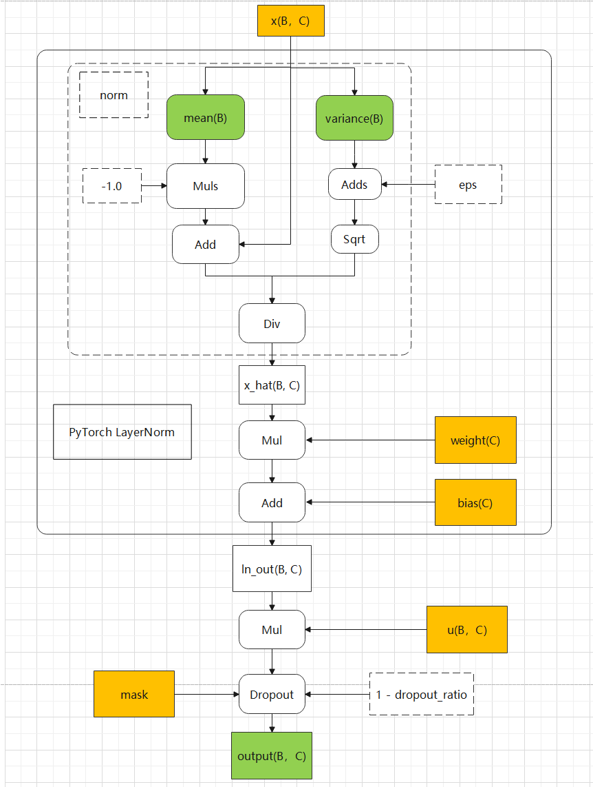

# 说明

本算子仅支持NPU调用。

# 产品支持情况

| 硬件型号           | 是否支持 |
|----------------|------|
| Atlas A2训练系列产品 | 是    |
| Atlas A3训练系列产品 | 是    |
| Atlas A5训练系列产品 | 是    |

# norm_multiply_dropout算子目录层级

```shell
norm_multiply_dropout
└── v220
    ├── op_host                        # 算子host侧实现
    ├── op_kernel                      # 算子kernel侧实现
    ├── norm_multiply_dropout.json     # 算子原型配置
    ├── norm_multiply_dropout.png      # 算子实现原理图
    ├── README.md                      # 算子说明文档
    └── run.sh                         # 算子编译部署脚本
```

# 功能

实现layer_norm + multiply + dropout计算逻辑对应的融合算子功能。

此处归一化操作对应PyTorch的LayerNorm，包含标准归一化 + 仿射变换。

当前算子为前向实现，反向实现参考反向算子[README](../../norm_multiply_dropout_backward/v220/README.md)。

该算子输入依赖算子pta层创建的mask，仅支持通过算子pta层提供的对外接口进行调用。

# 算子实现原理

算子实现逻辑如下：



算子逻辑伪代码如下：

```python
import numpy as np
import torch
import torch.nn.functional as F


def norm_multiply_dropout_pt(x, u, weight, bias, eps, dropout_ratio):
    ori_dtype = x.dtype
    x = x.to(torch.float32)
    u = u.to(torch.float32)
    weight = weight.to(torch.float32)
    bias = bias.to(torch.float32)

    ln_ret = F.layer_norm(x, normalized_shape=[x.shape[-1]], weight=weight, bias=bias, eps=eps)
    ln_out = u * ln_ret
    ln_out = F.dropout(
        ln_out,
        p=dropout_ratio,
        training=True,
    )
    ln_out = ln_out.to(ori_dtype)

    return ln_out


eps = 1e-5
dropout_ratio = 0.0
low = -1.0
high = 1.0
B = 262144
C = 512
# 生成数据
x_np = np.random.uniform(low=low, high=high, size=(B, C))
u_np = np.random.uniform(low=low, high=high, size=(B, C))
w_np = np.random.uniform(low=low, high=high, size=(C,))
b_np = np.random.uniform(low=low, high=high, size=(C,))

golden_device = torch.device("cpu")
dtype = torch.bfloat16
x_pt = torch.tensor(x_np, dtype=dtype, device=golden_device).contiguous().requires_grad_(True)
u_pt = torch.tensor(u_np, dtype=dtype, device=golden_device).contiguous().requires_grad_(True)
w_pt = torch.tensor(w_np, dtype=dtype, device=golden_device).contiguous().requires_grad_(True)
b_pt = torch.tensor(b_np, dtype=dtype, device=golden_device).contiguous().requires_grad_(True)
y = norm_multiply_dropout_pt(x_pt, u_pt, w_pt, b_pt, eps, dropout_ratio)
```

# 算子输入与输出

| 名称            | 输入/输出  | 参数类型   | 数据类型                     | 数据格式                                      | 范围                            | 说明                                                     |
|---------------|--------|--------|--------------------------|-------------------------------------------|-------------------------------|--------------------------------------------------------|
| x             | 输入     | Tensor | float32/float16/bfloat16 | [B, C]                                    | B∈[1, 1000000]，C仅支持值为512、1024。 |                                                        |
| u             | 输入     | Tensor | float32/float16/bfloat16 | [B, C]                                    | B∈[1, 1000000]，C仅支持值为512、1024。 | 数据类型需与输入x数据类型保持一致。                                     |
| weight        | 输入     | Tensor | float32/float16/bfloat16 | [C]                                       | C仅支持值为512、1024。               | 数据类型需与输入x数据类型保持一致。                                     |
| bias          | 输入     | Tensor | float32/float16/bfloat16 | [C]                                       | C仅支持值为512、1024。               | 数据类型需与输入x数据类型保持一致。                                     |
| mask          | 输入     | Tensor | uint8                    | 在dropout_ratio大于1e-10时，shape约为x中元素个数的8分之一。 |                               | mask参数为dropout操作使用，该参数无需用户手动传入，算子pta层会根据输入信息自动生成mask。   |
| eps           | 输入(属性) | float  | float                    |                                           | 数值范围:[1e-10, 1e-4]。            | 极小值，防止除0。                                               |
| dropout_ratio | 输入(属性) | float  | float                    |                                           | 数值范围:[0.0, 1.0]。               | 当dropout_ratio值 <= 1e-10时，会当做dropout概率为0而不进行dropout处理。 |
| output        | 输出     | Tensor | float32/float16/bfloat16 | [B, C]                                    | B∈[1, 1000000]，C仅支持值为512、1024。 | 前向计算结果，输出数据类型与输入x数据类型一致。                               |
| mean          | 输出     | Tensor | float                    | [B]                                       | B∈[1, 1000000]                 | 归一化操作中计算过程中的均值。由于计算过程中会转为float计算，因此数据类型为float。         |
| var           | 输出     | Tensor | float                    | [B]                                       | B∈[1, 1000000]                 | 归一化操作中计算过程中的方差。由于计算过程中会转为float计算，因此数据类型为float。         |

>[!NOTE]
>
> 1 输入tensor值域：[-1, 1)，且tensor数据需要是连续的（contiguous）。
>
> 2 **Atlas A5训练系列产品不支持输入x的float32数据类型。**

# 算子编译部署

算子编译请参考[RecSDK/cust_op/README.md](../../../../README.md)中"单算子使用说明"-"算子编译"章节。

注：详细算子调用示例参考PyTorch框架下[README.md](../../../../framework/torch_plugin/torch_library/norm_multiply_dropout/README.md)
