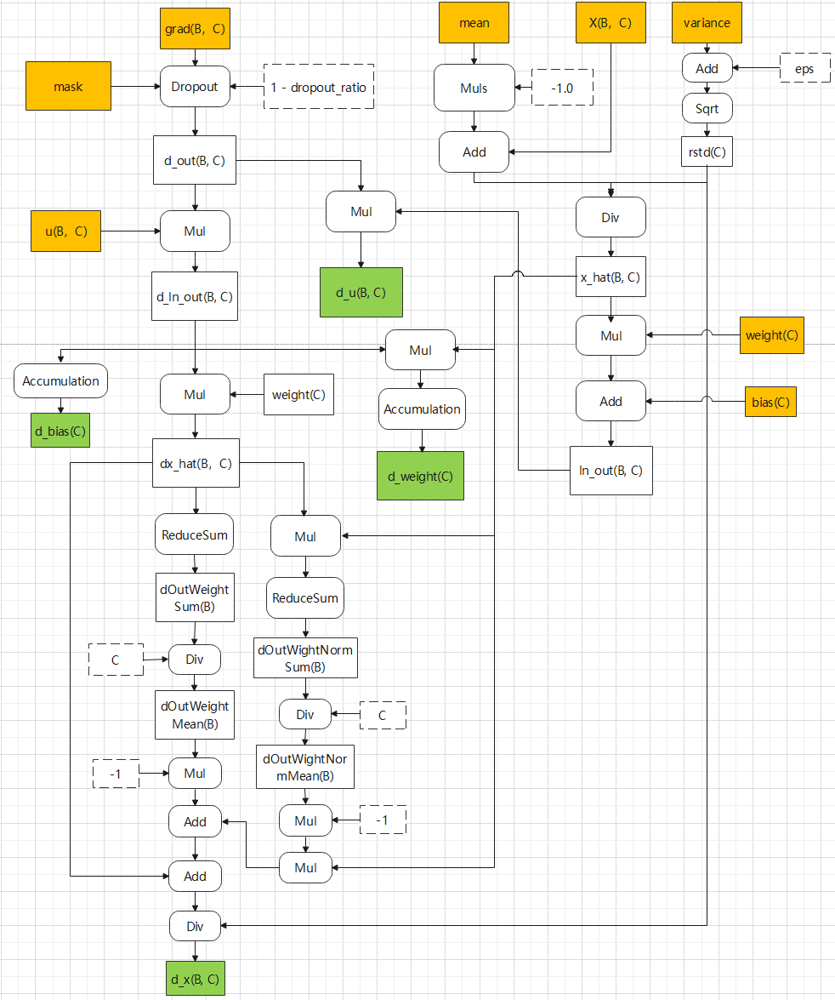

# 说明

本算子仅支持NPU调用。

# 产品支持情况

| 硬件型号           | 是否支持 |
|----------------|------|
| Atlas A2训练系列产品 | 是    |
| Atlas A3训练系列产品 | 是    |
| Atlas A5训练系列产品 | 是    |

# norm_multiply_dropout_backward算子目录层级

```shell
norm_multiply_dropout_backward
|-- v220
   |-- op_host                          # 算子host侧实现
   |-- op_kernel                        # 算子kernel侧实现
   |-- norm_multiply_dropout_backward.json  # 算子原型配置
   |-- norm_multiply_dropout_backward.png   # 算子实现原理图
   |-- README.md                        # 算子说明文档
   |-- run.sh                           # 算子编译部署脚本
```

# 功能

实现layer_norm + multiply + dropout计算的反向求导逻辑对应的融合算子功能。

当前算子为反向实现，对应前向算子实现参考[README](../../norm_multiply_dropout/v220/README.md)。

该反向算子不建议单独调用，建议通过PyTorch的自动求导框架调用。详情参考本文末尾的Pytorch框架下[README.md](../../../../framework/torch_plugin/torch_library/norm_multiply_dropout/README.md)

该算子输入依赖算子pta层创建的mask，仅支持通过算子pta层提供的对外接口进行调用。

# 算子实现原理

算子实现逻辑如下：



# 算子输入与输出

| 名称            | 输入/输出  | 参数类型   | 数据类型                     | 数据格式               | 范围                            | 说明                                                     |
|---------------|--------|--------|--------------------------|--------------------|-------------------------------|--------------------------------------------------------|
| d_out         | 输入     | Tensor | float32/float16/bfloat16 | [B, C]             | B∈[1, 1000000]，C仅支持值为512、1024。 | 数据类型需与输入x数据类型保持一致。                                     |
| x             | 输入     | Tensor | float32/float16/bfloat16 | [B, C]             | B∈[1, 1000000]，C仅支持值为512、1024。 |                                                        |
| u             | 输入     | Tensor | float32/float16/bfloat16 | [B, C]             | B∈[1, 1000000]，C仅支持值为512、1024。 | 数据类型需与输入x数据类型保持一致。                                     |
| weight        | 输入     | Tensor | float32/float16/bfloat16 | [C]                | C仅支持值为512、1024。               | 数据类型需与输入x数据类型保持一致。                                     |
| bias          | 输入     | Tensor | float32/float16/bfloat16 | [C]                | C仅支持值为512、1024。               | 数据类型需与输入x数据类型保持一致。                                     |
| mean          | 输入     | Tensor | float32                  | [B]                | B∈[1, 1000000]                 | 前向计算时归一化操作中计算得出的均值。                                     |
| var           | 输入     | Tensor | float32                  | [B]                | B∈[1, 1000000]                 | 前向计算时归一化操作中计算得出的方差。                                     |
| mask          | 输入     | Tensor | uint8                    | shape约为x中元素个数的8分之一。 |                               | mask参数为dropout操作使用，算子pta层前向计算时生成的mask信息。                |
| eps           | 输入(属性) | float  | float                    |                    | 数值范围:[1e-10, 1e-4]。            | 极小值，防止除0。                                               |
| dropout_ratio | 输入(属性) | float  | float                    |                    | 数值范围:[0.0, 1.0]。               | 当dropout_ratio值 <= 1e-10时，会当做dropout概率为0而不进行dropout处理。 |
| d_u           | 输出     | Tensor | float32/float16/bfloat16 | [B, C]             | B∈[1, 1000000]，C仅支持值为512、1024。 | u的梯度，数据类型与输入x数据类型一致。                                   |
| d_x           | 输出     | Tensor | float32/float16/bfloat16 | [B, C]             | B∈[1, 1000000]，C仅支持值为512、1024。 | x的梯度，数据类型与输入x数据类型一致。                                   |
| d_weight      | 输出     | Tensor | float32                  | [C]                | C仅支持值为512、1024。               | weight的梯度。由于需要保持累加精度，因此输出类型固定为float32                  |
| d_bias        | 输出     | Tensor | float32                  | [C]                | C仅支持值为512、1024。               | bias的梯度。由于需要保持累加精度，因此输出类型固定为float32。                    |

>[!NOTE]
>
> 1 输入tensor值域：[-1, 1)，且tensor数据需要是连续的（contiguous）。
>
> 2 **Atlas A5训练系列产品不支持输入x的float32数据类型。**
>
> 3 入参中除d_out外，其他参数均为前向计算时的入参/输出，基于PyTorch自动求导框架保存给反向计算使用。

# 算子编译部署

算子编译请参考[RecSDK\cust_op\README.md](../../../../README.md)中"单算子使用说明"-"算子编译"章节。

注：详细算子调用示例参考Pytorch框架下[README.md](../../../../framework/torch_plugin/torch_library/norm_multiply_dropout/README.md)
