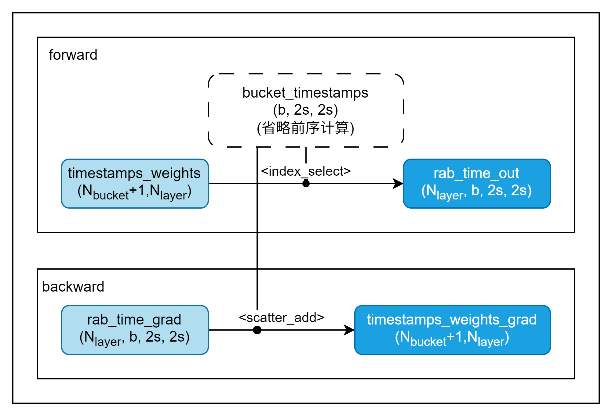

# 说明
本算子仅支持NPU调用

# 产品支持情况
| 硬件型号           | 是否支持 |
|----------------|------|
| Atlas A2训练系列产品 | ✓    |
| Atlas A3训练系列产品 | ✓    |

# relative_attn_bias_backward算子目录层级
```shell
-- relative_attn_bias_backward
   |-- v220
      |-- op_host                 # 算子host侧实现
      |-- op_kernel               # 算子kernel侧实现
      |-- rab_time_bwd.png        # 算子实现原理图
      |-- relative_attn_bias_backward.json    # 算子原型配置
      |-- README.md               # 算子说明文档
      |-- run.sh                  # 算子编译部署脚本
```

# 功能

针对hstu模型rab的time部分，计算时间戳参数反向传播中的梯度值。

# 算子实现原理



仿真代码：

```python
import torch


def rab_time_backward(timestamps_weights_grad: torch.Tensor,
                      rab_time_grad: torch.Tensor,
                      bucket_timestamps: torch.Tensor,
                      num_buckets: int):
    for i, layer_grad in enumerate(rab_time_grad):
        layer_grad_out = torch.zeros(num_buckets + 1)
        for (index, grad) in zip(bucket_timestamps.view(-1), layer_grad.view(-1)):
            layer_grad_out[index] += grad
        timestamps_weights_grad[i].copy_(layer_grad_out)
```

# 算子输入与输出

| 算子参数                    | 输入/输出  | 数据类型      | 数据格式                 | 范围                                             | 说明 |
|-------------------------|--------|-----------|----------------------|------------------------------------------------|----|
| rab_time_grad           | 输入     | FP16,FP32 | (n, b, 2s, 2s)       | 0 < n <= 20<br/>0 < b <= 512<br/>0 < s <= 4300 |    |
| bucket_timestamps       | 输入     | int32     | (b, 2s, 2s)          |                                                |    |
| num_buckets             | 输入(属性) | int       |                      | 0 < num_buckets <= 128                         |    |
| timestamps_weights_grad | 输出     | FP16,FP32 | (n, num_buckets + 1) |                                                |    |

# 算子编译部署

算子编译请参考[RecSDK\cust_op\README.md](../../../../README.md)中"单算子使用说明"-"1.算子编译"章节。

注：详细算子调用示例参考Pytorch框架下[README.md](../../../../framework/torch_plugin/torch_library/2.6.0/dense_to_jagged/README.md)
