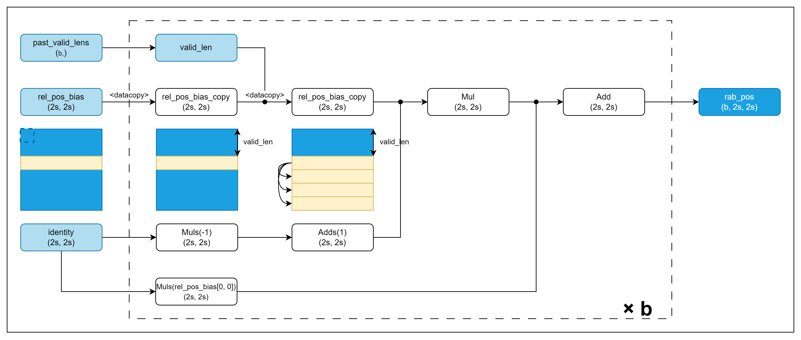

# 说明
本算子仅支持NPU调用

# 产品支持情况
| 硬件型号           | 是否支持 |
|----------------|------|
| Atlas A2训练系列产品 | 是    |
| Atlas A3训练系列产品 | 是    |

# relative_attn_bias_pos算子目录层级

```shell
-- relative_attn_bias_pos
   |-- v220
      |-- op_host                 # 算子host侧实现
      |-- op_kernel               # 算子kernel侧实现
      |-- rab_pos_fwd.png         # 算子实现原理图
      |-- relative_attn_bias_pos.json    # 算子原型配置
      |-- README.md               # 算子说明文档
      |-- run.sh                  # 算子编译部署脚本
```

# 功能

针对hstu模型rab的pos部分计算。

# 算子实现原理



仿真代码：

```python
import torch


def rab_pos_golden(rel_pos_bias: torch.Tensor, identity: torch.Tensor, past_valid_lens: torch.Tensor) -> torch.Tensor:
    """
    past_len = 1 ~ 4000
    candidate_len = 256 ~ 600
    bs = 1 ~ 10

    :param rel_pos_bias: [past_len * 2 + candidate_len][past_len * 2 + candidate_len]
    :param identity: [past_len * 2 + candidate_len][past_len * 2 + candidate_len]
    :param past_valid_lens: [bs]
    :return: [bs][1][past_len * 2 + candidate_len + 2][past_len * 2 + candidate_len + 2]
    """
    bs = past_valid_lens.shape[0]
    rel_pos_bias_list = rel_pos_bias[:].unsqueeze(0).repeat(bs, 1, 1)
    for i, valid_len in enumerate(past_valid_lens):
        rel_pos_bias_list[i, valid_len:, :] = rel_pos_bias[valid_len, :]

    rel_pos_bias_list = rel_pos_bias_list * (1 - identity) + identity * rel_pos_bias_list[0, 0, 0]
    rel_pos_bias_list = rel_pos_bias_list[:, :identity.shape[0], :identity.shape[0]]
    return rel_pos_bias_list
```

# 算子输入与输出

| 算子参数            | 输入/输出  | 数据类型      | 数据格式        | 范围            | 说明 |
|-----------------|--------|-----------|-------------|---------------|----|
| rel_pos_bias    | 输入     | FP16,FP32 | (2s, 2s)    | 0 < s <= 4300 |    |
| identity        | 输入     | FP16,FP32 | (2s, 2s)    |               |    |
| past_valid_lens | 输入(属性) | List[int] | (b,)        | 0 < b <= 512  |    |
| rab_pos         | 输出     | FP16,FP32 | (b, 2s, 2s) |               |    |

# 算子编译部署

算子编译请参考[RecSDK\cust_op\README.md](../../../../README.md)中"单算子使用说明"-"1.算子编译"章节。

注：详细算子调用示例参考Pytorch框架下[README.md](../../../../framework/torch_plugin/torch_library/dense_to_jagged/README.md)