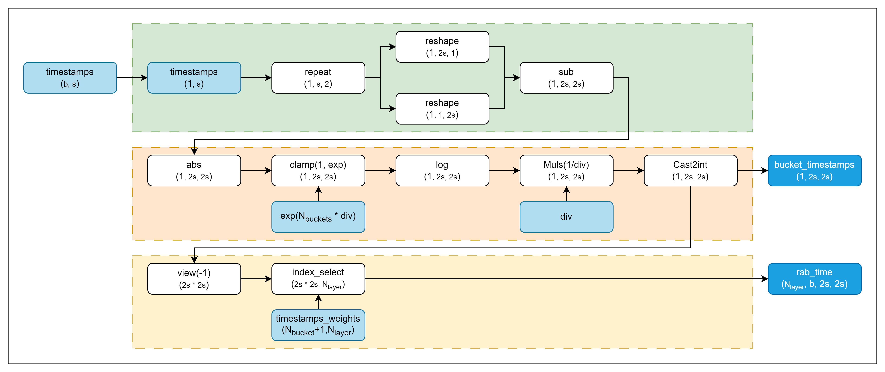

# 说明
本算子仅支持NPU调用

# 产品支持情况
| 硬件型号           | 是否支持 |
|----------------|------|
| Atlas A2训练系列产品 | ✓    |
| Atlas A3训练系列产品 | ✓    |
| Atlas 推理系列产品   | ✓    |

## relative_attn_bias_time融合算子文件结构

```shell
-- relative_attn_bias_time
   |-- v220
      |-- op_host                 # 算子host侧实现
      |-- op_kernel               # 算子kernel侧实现
      |-- rab_time_fwd.png        # 算子实现原理图
      |-- relative_attn_bias_time.json    # 算子原型配置
      |-- README.md               # 算子说明文档
      |-- run.sh                  # 算子编译部署脚本
```

# 功能

针对hstu模型rab的time部分计算。

# 算子实现原理



仿真代码：

```python
import torch
NUM_BUCKETS = 128 + 1
BUCKET_DIVISOR = 0.301

def rab_time_golden(timestamps_weights: torch.Tensor,
                    timestamps: torch.Tensor,
                    bucket_divisor: float) -> (torch.Tensor, torch.Tensor):
    """
    rab time 正向仿真
    num_buckets = 128
    num_layers = 1 - 20
    past_len = 1 - 4000
    candidate_len = 256 - 600

    :param timestamps_weights: [num_buckets + 1][num_layers]
    :param timestamps: [bs][past_len + candidate_len // 2]
    :param bucket_divisor: float
    :return: [num_layers][bs][1][2 * past_len + candidate_len + 1][2 * past_len + candidate_len + 2]
    """

    infer_len = timestamps.shape[1] * 2
    bs = timestamps.shape[0]
    num_layers = timestamps_weights.shape[1]

    timestamps = timestamps.unsqueeze(-1).repeat(1, 1, 2)
    diff_timestamps = timestamps.reshape(bs, infer_len, 1) - timestamps.reshape(bs, 1, infer_len)

    clamp_max = torch.exp(torch.tensor(NUM_BUCKETS * BUCKET_DIVISOR))
    diff_timestamps = torch.log(torch.abs(diff_timestamps).clamp(1, clamp_max)) / bucket_divisor

    bucket_timestamps = diff_timestamps.long().view(-1)
    rab_time_out = torch.index_select(timestamps_weights, dim=0, index=bucket_timestamps)
    rab_time_out = rab_time_out.t().view(num_layers, bs, infer_len, infer_len)

    return rab_time_out, bucket_timestamps
```

# 算子输入与输出

| 算子参数               | 输入/输出 | 数据类型      | 数据格式                        | 范围                                              | 说明 |
|--------------------|-------|-----------|-----------------------------|-------------------------------------------------|----|
| timestamps         | 输入    | int32     | (b, s)                      | 0 < b <= 512<br/>0 < s <= 4300                  |    |
| timestamps_weights | 输入    | FP16,FP32 | (num_layers, num_buckets+1) | 0 < num_layers <= 20<br/>0 < num_buckets <= 128 |    |
| bucket_divisor     | 输入    | float     |                             |                                                 |    |
| rab_time           | 输出    | FP16,FP32 | (num_layers, b, s, 1, s, 1) |                                                 |    |
| bucket_timestamps  | 输出    | int32     | (b, s, s)                   |                                                 |    |
> 注：rab_time期望返回为(num_layers, b, 2s, 2s)  
> ONNX调用时需进行rab_time.repeat(1, 1, 1, 2, 1, 2).reshape(num_layers, b, 2s, 2s)操作。  
> pytorch调用无需额外操作，已经在pytorch适配层完成该操作。

# 算子编译部署

算子编译请参考[RecSDK\cust_op\README.md](../../../../README.md)中"单算子使用说明"-"1.算子编译"章节。

注：详细算子调用示例参考Pytorch框架下[README.md](../../../../framework/torch_plugin/torch_library/2.6.0/dense_to_jagged/README.md)
