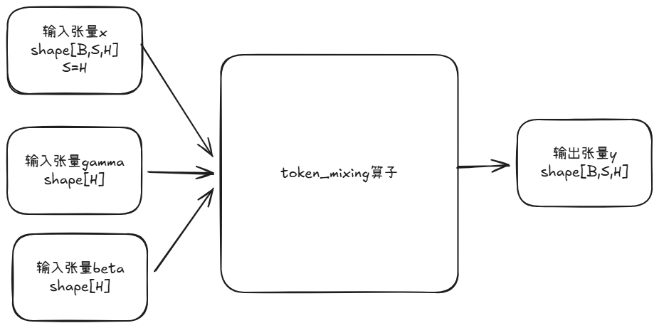

**说明**

本算子仅支持NPU调用。

# 产品支持情况
| 硬件型号              | 是否支持                  |
| -------------------- | ------------------------ |
| Atlas A2训练系列产品  | 是  |
| Atlas A3训练系列产品  | 是  |
| Atlas 推理系列产品    | 是  |

# token_mixing算子目录层级
```shell
-- token_mixing
   |-- v220
      |-- op_host                 # 算子host侧实现
      |-- op_kernel               # 算子kernel侧实现
      |-- token_mixing.json   # 算子原型配置
      |-- README.md               # 算子说明文档
      |-- run.sh                  # 算子编译部署脚本
```

# 功能

实现x与其转置x_t相加后的归一化操作。

# 算子实现原理



算子工作原理说明：
1. 输入张量x是一个三维张量(B,S,H)其中S与H相同
2. 输入张量x_t为x后两维转置的转置矩阵
3. 算子将x与x_t相加得到tmp
4. 输出张量y为对tmp最后一维归一化的结果(layernorm)

例如：
```python
x = [B,S,H]  # shape: [B,S,H]
x_t = [B, H, S]  # shape: [B,H,S]
y = layernorm(x+x_t, gamma, beta, epsilon=1e-7)  # shape: [128*211*211]
```

输入:
```python
x = torch.randn(4,32,32).to(torch.float32)
x_t = x.permute({0,2,1})
gamma = torch.ones(32)
beta = torch.zeros(32)
```

输出：
```python
add = x + x_t
layer_norm = torch.nn.LayerNorm(add.size()[2:], eps=1e-7)
y = layer_norm(add)
```

# 算子输入与输出
| 名称      | 输入/输出 | 参数类型 | 数据类型         | 数据格式       | 范围         | 说明                                  |
|---------|------------|------|--------------|------------|------------|----------------------------------------|
| x       | 输入       | Tensor | float32 | [B, S, H] | `[]` | 仅支持三维张量S,H维度一致                |
| gamma   | 输入       | Tensor | float32 | [H] | `[]` | 仅支持一维张量              |
| beta    | 输入       | Tensor | float32 | [H] | `[]` | 仅支持一维张量              |
| epsilon | 输入(属性)  | float | float   |           |          | 极小数，防止除零，默认值为1e-7    |
| y (返回值) | 输出     | Tensor | float32 | [B, S, H] | NA         | 返回融合算子归一化结果张量           |

# 算子编译部署

算子编译请参考[RecSDK\cust_op\README.md](../../../../README.md)中"单算子使用说明"-"1.算子编译"章节。

注：详细算子调用示例参考Pytorch框架下[README.md](../../../../framework/torch_plugin/torch_library/token_mixing/README.md)