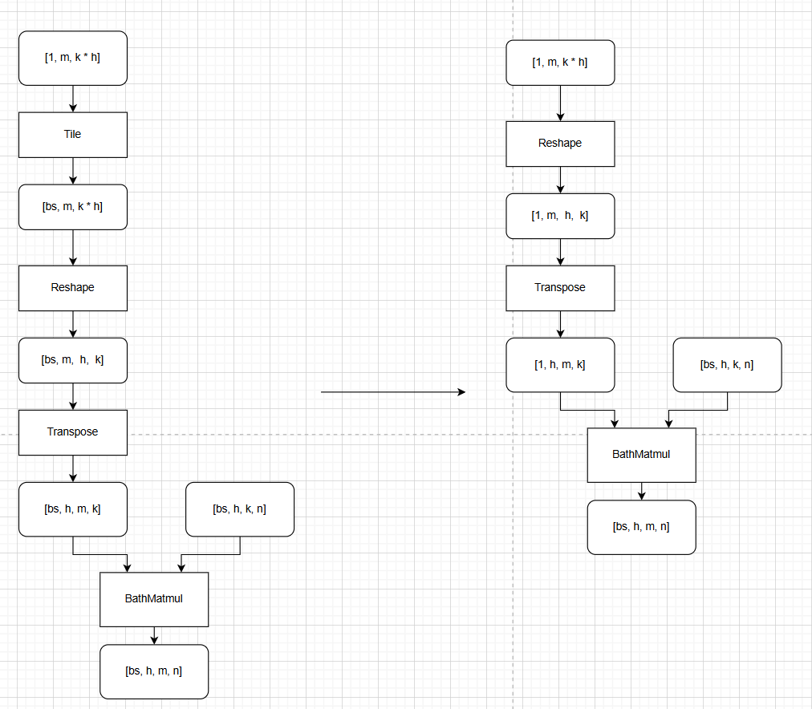
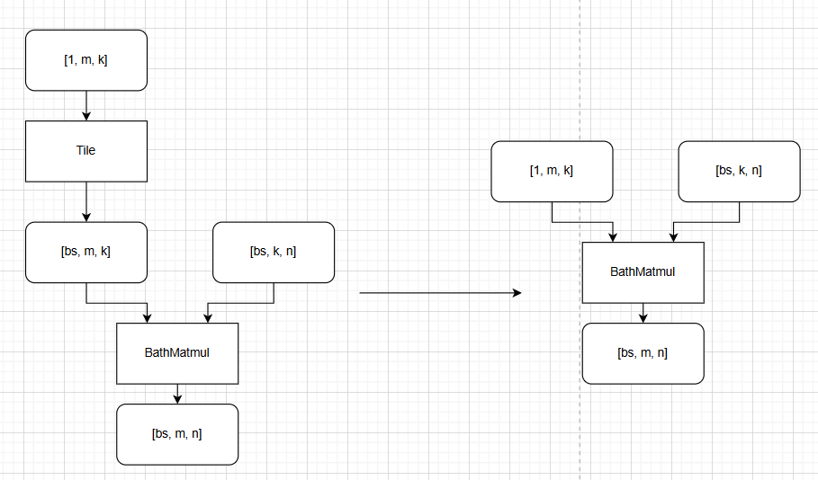

bmm_tile_pass README
一、Pass 概述
1. 功能描述
该 Pass 针对计算图中常见的 “共享权重 + 批量输入” 场景进行图融合优化，识别并替换以下两类等价计算模式：
Pattern 1： batch轴广播 Tile → BatchMatmul
Pattern 2： batch轴广播 Tile → Reshape → Transpose → BatchMatmul
通过将消减Tile算子并且减少Reshape/Transpose/BatchMatmul算子的数据搬运量，以提升推理性能。
2. 核心价值
消除冗余操作： 移除显式的 Tile 和重复的 Reshape/Transpose，减少内存拷贝与计算开销。
提升硬件利用率： 直接利用 BatchMatmul 的广播能力，避免中间张量在小维度上进行低效扩展。
简化图结构： 减少节点数量，降低调度复杂度，便于后续优化器进行融合与内存复用。
通用性强： 广泛适用于 Transformer 中的 Multi-Head Attention 等场景，尤其当权重矩阵是共享的（如 Query, Key, Value 的线性投影层）。
3. 适用场景
网络结构： 通用优化，适用于包含多头注意力机制（MHA）、序列建模、编码器-解码器架构等；
算子约束：
Pattern 1：Tile -> BatchMatmul
1) BatchMatmul左右输入有且只有一侧为Tile
2) Tile节点的输出只有BatchMatmul使用
3) Tile只存在0轴从1->batch的广播
Pattern 2: Tile -> Reshape -> Transpose -> BatchMatmul
1) 如果BatchMatmul左右输入均为Transpose则只针对左输入做判断
2) Transpose 保持0轴不变
3) Tile保证只有0维广播，且Reshape不修改0维的值
4) Tile/Transpose/Reshape节点均只有一条输出边
✅ 典型应用： 在 Transformer 的前向传播中，对 Q, K, V 的线性变换过程，常出现此类模式。
二、核心原理
1. 整体流程
图遍历与模式匹配：
遍历计算图中的所有 BatchMatmul 节点，检查其输入路径是否满足以下任一模式：
Pattern 1：Tile->BatchMatmul
Pattern 2：Tile -> Reshape -> Transpose -> BatchMatmul
基于上述算子约束做校验
算子替换：
删除原有 Tile、修改Reshape axis节点的首轴值为0、修改Reshape，Transpose，BatchMatmul 节点的输入输出TensorDesc。

2. 示意图（简化版）

三、使用方法
1. 代码编译
1). mkdir build
2). cd build
3). cmake ..
4). make
编译完成后生成动态库文件：libbmm_tile_pass.so

2. 使能PASS
参考https://www.hiascend.com/官网中 “使用自定义Pass修改Graph” 部分内容将编译后的so放到CANN目录下的opp/vendors/xxx/custom_fusion_passes/后在GE启动时就会自动load相关so并完成pass注册。

3. 测试demo
可以在是否开启pass场景，分别执行python3 ./demo.py, 回显输出其1000次迭代的端到端耗时及与cpu的精度对比，具体的代码片段耗时需要手动采集profiling，以profiling数据为准。