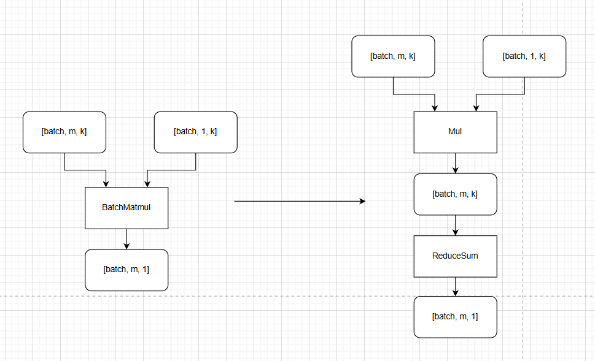

batchmatmul_to_mul_reduce_pass README
一、Pass 概述
1. 功能描述
该 Pass 针对 BatchMatmul算子进行优化，针对n=1，且k < 16的shape，将其转换为mul + reduce进行计算。
2. 核心价值
性能优化：对于n = 1, 且k < 16的shape，从算力上讲cube单元进行运算会有大量算力浪费， 其实际算力可能不及vector单元算力。 同时该类算子因为小k且非对齐，mte效率也较低。 故针对该类shape将其替换为mul + reduce可以提升性能。
3. 适用场景
网络结构：通用优化；
算子约束：BatchMatmul算子满足n = 1 && k < 16 && transpose_a = false && (transpose_b = true || 通过transpose算子进行显示转至输入）；
二、核心原理
1. 整体流程
节点遍历与筛选：遍历图中所有BatchMatmul节点，基于单个BatchMatmul节点进行shape校验。
算子替换：删除对应 BatchMatMul 算子，替换为Mul + ReduceSum算子；
计算图更新：更新网络计算图的节点依赖关系，将原后续算子的输入指向 ReduceSum 算子的对应输出端口，完成 Pass 优化。
2. 示意图（简化版）

三、使用方法
1. 代码编译
通过以下命令编译：
  1). mkdir build
  2). cd build
  3). cmake ..
  4). make

2. 使能PASS
参考https://www.hiascend.com/官网中 “使用自定义Pass修改Graph” 部分内容将编译后的so放到CANN目录下的opp/vendors/xxx/custom_fusion_passes/后在GE启动时就会自动load相关so并完成pass注册。

3. 测试demo
可以在是否开启pass场景，分别执行python3 ./demo.py, 回显输出其1000次迭代的端到端耗时及与cpu的精度对比，具体的代码片段耗时需要手动采集profiling，以profiling数据为准。