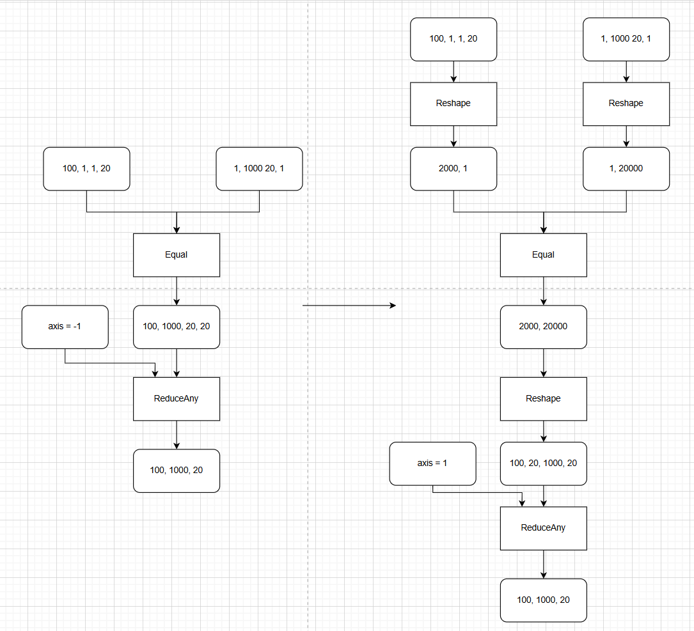

broadcat_equal_pass README
一、Pass 概述
1. 功能描述
该 Pass 针对计算图中特征处理时使用的多维广播 + ReduceAny的结构，识别并替换低维广播的方式提升该结构性能。
2. 核心价值
减少内存搬运：消除高维广播带来的非连续内存访问，提升缓存利用率。
提升计算效率：将4维广播降为2维广播，降低广播操作的复杂度。
3. 适用场景
网络结构： 传统推荐场景， 在历史序列和候选商品做label对比时使用该结构；
算子约束：
1) Equal输入为int64类型
2) Equal算子为单输出接向ReduceAny算子
3) Reduce Axis为int32类型且源于Const节点
4) Reduce Axis在Equal中为广播轴
5) Reduce Axis非广播输入左右有至少一个其他的相同方向的广播轴可以合并，且这两轴中只包含对向的广播轴或两侧均为1的轴。
二、核心原理
1. 整体流程
图遍历与模式匹配：
遍历计算图中的所有 Equal --> ReduceAny结构：
1) 基于Reduce轴向左向右遍历，找到一个同向广播轴，且这两轴中只包含对向的广播轴或两侧均为1的轴。
2) 基于轴交换后的新轴进行合并，多个相同方向的广播轴合并为1根轴。
3) 基于新生成的shape，添加reshape算子并修改Reduce轴。

2. 示意图（简化版）

三、使用方法
1. 代码编译
1). mkdir build
2). cd build
3). cmake ..
4). make
编译完成后生成动态库文件：libbroadcast_equal_pass.so

2. 使能PASS
参考https://www.hiascend.com/官网中 “使用自定义Pass修改Graph” 部分内容将编译后的so放到CANN目录下的opp/vendors/xxx/custom_fusion_passes/后在GE启动时就会自动load相关so并完成pass注册。

3. 测试demo
可以在是否开启pass场景，分别执行python3 ./demo.py, 回显输出其1000次迭代的端到端耗时及与cpu的精度对比，具体的代码片段耗时需要手动采集profiling，以profiling数据为准。