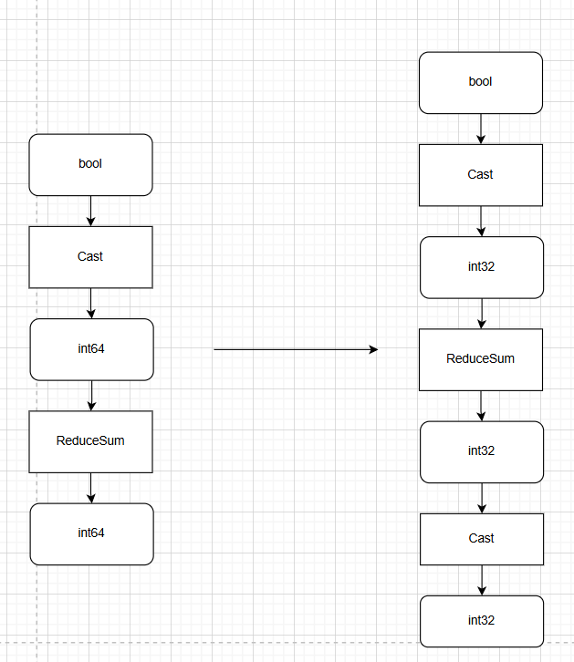

cast_int64_reduce_pass README
一、Pass 概述
1. 功能描述
该 Pass 针对计算图中Cast->ReduceSum的结构，如果Cast为bool->int64，则在Reduce轴积 < max_int32时，将Cast类型改为int32，提升ReduceSum算子性能 。
2. 核心价值
减少内存搬运：Cast至ReduceSum的中间数据dtype从int64降到int32，减少其数据搬运量。
提升计算效率：ReduceSum从int64改为int32输入以提升效率。
3. 算子约束：
1) Reduce轴来源于Const输入且所有Reduce轴的积 < max_int32。
2) Cast 为bool -> int64。
3) Cast 算子只有单输出。
二、核心原理
1. 整体流程
图遍历与模式匹配：
遍历计算图中的所有 Cast --> ReduceSum结构：
1) 校验Cast算子为bool -> int64 且只有单输出。
2) 校验Reduce轴来源于Const输入且所有Reduce轴的积 < max_int32。
3) 将该结构替换为int32的ReduceSum

2. 示意图（简化版）

三、使用方法
1. 代码编译
1). mkdir build
2). cd build
3). cmake ..
4). make
编译完成后生成动态库文件：libcast_int64_reduce_pass.so

2. 使能PASS
参考https://www.hiascend.com/官网中 “使用自定义Pass修改Graph” 部分内容将编译后的so放到CANN目录下的opp/vendors/xxx/custom_fusion_passes/后在GE启动时就会自动load相关so并完成pass注册。

3. 测试demo
可以在是否开启pass场景，分别执行python3 ./demo.py, 回显输出其1000次迭代的端到端耗时及与cpu的精度对比，具体的代码片段耗时需要手动采集profiling，以profiling数据为准。
