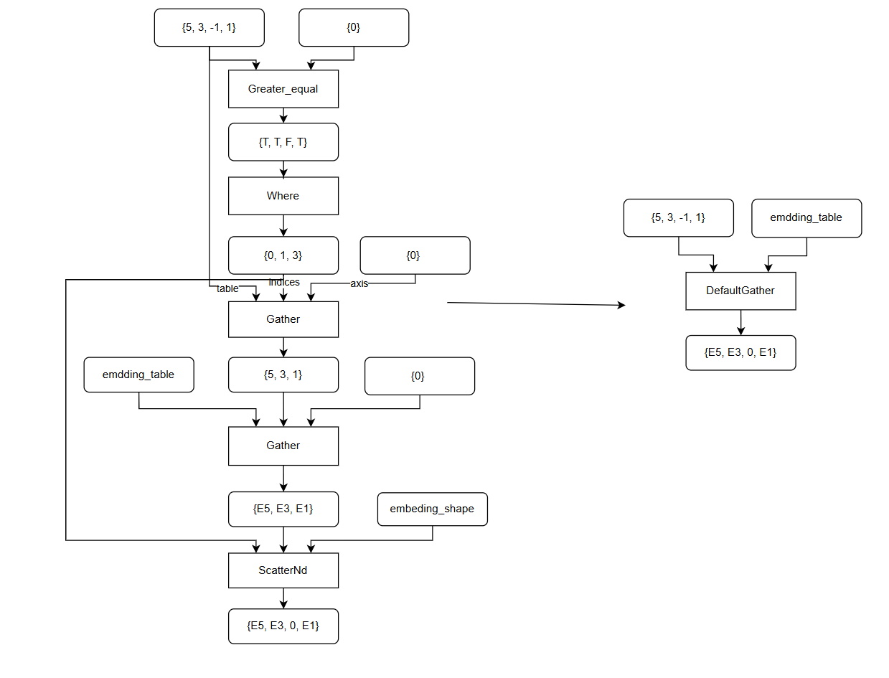

default_gather README
一、Pass 概述
1. 功能描述
该PASS为default_gather配套的入图pass，当前是以pattern模式强匹配，将特定pattern替换为default_gather算子。
2. 核心价值
将指定pattern替换为融合算子提升性能。该pattern下，由于Where算子输出shape不固定，故Where至ScatterNd这段结构会被当做动态图处理，且必须等Where算子执行完，才能开始推导后续算子的shape，性能极差，通过自定义算子替换会有很大性能提升。

二、核心原理
1. 整体流程
遍历计算图中的所有 ScatterND算子，向上进行pattern校验。

2. 示意图（简化版）

三、使用方法
1. 代码编译
1). 参考https://www.hiascend.com/官网中资料配置ASCEND_CUSTOM_OPP_PATH环境变量
2). mkdir build
3). cd build
4). cmake ..
5). make
编译完成后生成动态库文件：libdefualt_gather_pattern1.so

2. 使能PASS
1) 参考default_gather 算子的README安装算子
2) 参考https://www.hiascend.com/官网中 “使用自定义Pass修改Graph” 部分内容将编译后的so放到CANN目录下的opp/vendors/xxx/custom_fusion_passes/后在GE启动时就会自动load相关so并完成pass注册。

3. 测试demo
可以在是否开启pass场景，分别执行python3 ./demo.py, 回显输出其1000次迭代的端到端耗时及与cpu的精度对比，及端到端时延对比。
