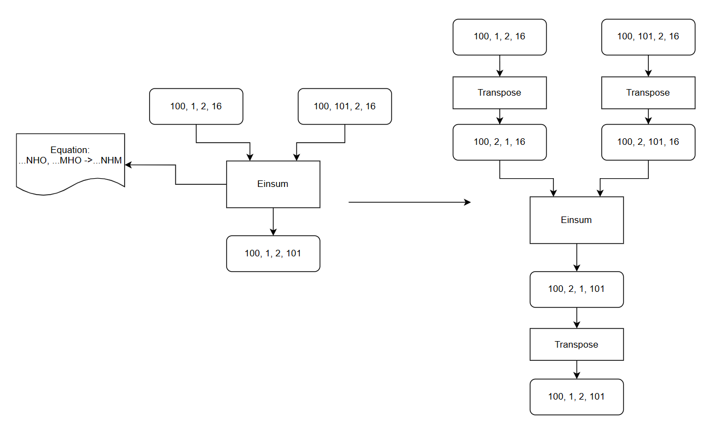

einsum_pass README
一、Pass 概述
1. 功能描述
在GE正常流程中，EinSum算子是通过pass进行拆分为小算子进行处理。但该pass位于原图优化阶段，在kAfterInferShape之后，会导致其余该阶段自定义pass无法对Einsum算子拆分后的结构进行优化，故在kAfterInferShape阶段实现一个einsum_pass，针对常见网络中的一些EinSum结构进行提前拆分，使其余pass能对拆分后的结构生效。
2. 核心价值
提前拆分Einsum算子，使得自定义pass可以对拆分后的Einsum算子生效。
3. 算子约束：
1) 只支持2个input oprands + 1个output oprands的场景。
2) 不支持oprands中出现相同subcript的Diag算子场景, 如ii, j -> ij。
3) 不支持矩阵运算中多根k轴, 如ijk, jkl -> il。
4) 不支持矩阵运算中k轴带广播，如ij, jk -> ik(i=1)。
5) 不支持矩阵运算中mn轴，带多跟非1的轴，如ijk，kl -> ijl (i != 1 && j != 1)
6) 不支持Reduce操作，如mik，kn -> mn(i != 1)。

二、核心原理
1. 整体流程
遍历计算图中的所有 Einsum 算子：
1) 将Equation拆分为input oprands 和 output oprands。
2) 处理其中的..., 将其对应维度替换为新的subcript。
3) 将所有subcripts label化，按Reduce（需要额外Reduce的轴），Free（矩阵乘的mn轴）, Sum_k（矩阵乘的k轴）, Batch（矩阵乘的batch轴）, Only_output（非法场景） 5种类型进行分类。
4) 对于Free轴，如果左右oprands中不包含，则添加一个1维新subcript，如果有多个，则只处理有1跟非1轴的场景，将其他dim为1的轴删除。
5) 对于Free轴，如果output oprand中从左向右优先找到右输入的free subcript，则交换左右输入 
6) 对于Batch轴，对于带广播的场景，将其退化为FREE + Reduce轴处理，如果有多个batch则将依次transpose到最左侧
7) 对于Reduce轴，只处理dim为1的场景，直接删除。
8) 对于Sum_K轴，校验只存在一根k轴且不包含广播
9) 基于新生成的subcript，输入输出依次添加reshape/transpose节点
10） 新增BatchMatmul/Matmul节点

2. 示意图（简化版）

三、使用方法
1. 代码编译
1). mkdir build
2). cd build
3). cmake ..
4). make
编译完成后生成动态库文件：libaa_einsum_pass.so

2. 使能PASS
参考https://www.hiascend.com/官网中 “使用自定义Pass修改Graph” 部分内容将编译后的so放到CANN目录下的opp/vendors/xxx/custom_fusion_passes/后在GE启动时就会自动load相关so并完成pass注册。

3. 测试demo
可以在是否开启pass场景，分别执行python3 ./demo.py, 回显输出其1及与cpu的精度对比，该Pass本身不提供性能优化，故不作性能对比。