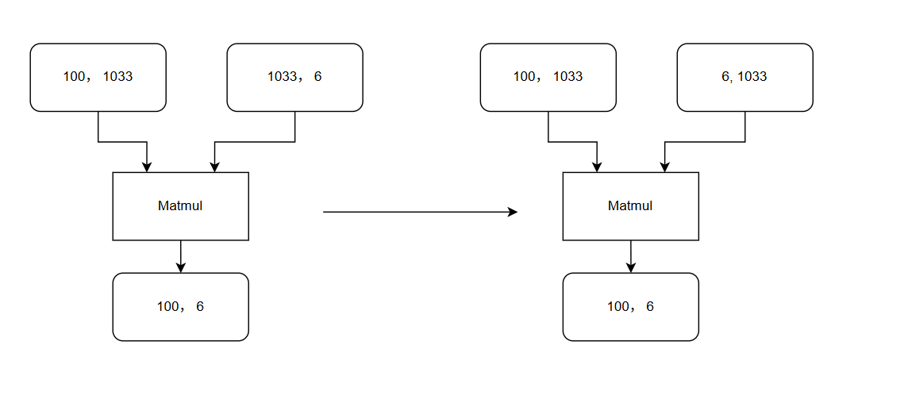

matmul_transpose_const_pass README
一、Pass 概述
1. 功能描述
该 Pass 针对计算图中Matmul算子进行优化，针对由矩阵为const的场景，在某些条件下通过转置const矩阵以提升算子性能。
2. 核心价值
提升搬运效率：通过针对小尾轴或尾轴非对齐的场景，通过转置较大的k轴到尾轴将非对齐搬运转为大部分对齐搬运，以提升搬运性能。
3. 算子约束：
1) Matmul算子右矩阵为const且transpose_x2为false。
2) 1 < n < 32 且非32位对齐时，k轴>=1000 或 基于部分经验shape划出的n对齐的场景
二、核心原理
1. 整体流程
图遍历与模式匹配：
遍历计算图中的所有 Matmul 算子：
1) 基于约束中的shape进行校验后，通过转置const矩阵重新连接Matmul算子，同时修改Matmul算子的transpose_x2属性为True

2. 示意图（简化版）

三、使用方法
1. 代码编译
1). mkdir build
2). cd build
3). cmake ..
4). make
编译完成后生成动态库文件：libzzmatmul_transpose_const_pass.so

2. 使能PASS
参考https://www.hiascend.com/官网中 “使用自定义Pass修改Graph” 部分内容将编译后的so放到CANN目录下的opp/vendors/xxx/custom_fusion_passes/后在GE启动时就会自动load相关so并完成pass注册。

3. 测试demo
可以在是否开启pass场景，分别执行python3 ./demo.py, 回显输出其1000次迭代的端到端耗时及与cpu的精度对比，具体的代码片段耗时需要手动采集profiling，以profiling数据为准。
