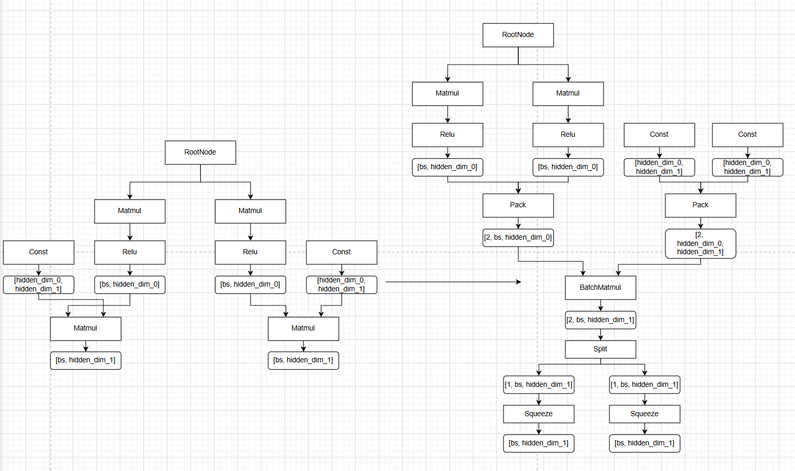

mmoe_matmul_pass README
一、Pass 概述
1. 功能描述
该 Pass 针对 MMOE（Multi-gate Mixture-of-Experts）网络结构，实现非首层同源 MatMul 算子的批量合并优化：遍历 MMOE 非首层网络节点，筛选出满足 “同源特征输入、相同权重参数、一致算子配置” 的 MatMul 算子集合，将其输入通过Pack算子合并为[head, bs, hidden_size]的shape，并后续通过BatchMatMul 算子执行矩阵乘法计算，再通过 Split 算子按原算子首轴输出维度拆分计算结果，还原为原多个 MatMul 算子的输出形态。

2. 核心价值
性能优化：减少 MatMul 算子调用次数，规避多次小批量矩阵乘法的冗余开销（如核函数启动等），提升 MMOE 网络首层计算吞吐量，这里新增的首轴Pack和Split都可以通过no task 优化使其不实际在device上执行；
部署友好：简化 MMOE 非首层计算图结构，提升后续模型编译、优化的效率，适配各类推理框架部署需求。

3. 适用场景
网络结构：MMOE 结构；
算子约束：待合并的 MatMul 算子需满足 “同源输入特征且中间所有算子均只有单非const输入、相同shape权重、相同数据类型、一致矩阵维度（仅输出维度可拆分）”；
部署环境：tensorflow, torchair, GE构图能能使能GE执行器的方案。

二、核心原理
1. 整体流程
节点遍历与筛选：遍历图中所有Matmul节点，基于单个Matmul节点，往上递归找到第一个有多非const输入或Data输入标记为root节点，并基于其中穿越的Matmul节点数量做key将所有Matmul节点分类，基于同root节点，同层的Matmul节点，会进行shape，attrs判断，如果所有信息均相同，则将其修改为Pack-->BatchMatmul-->Split-->Squeeze的结构
维度校验与规划： 
  1). 当前层级所有Matmul节点的data输入shape，const输入shape及transpose_x1/transpose_x2 attrs均相同。
算子替换：删除原多个小 MatMul 算子，构建Pack-->BatchMatmul-->Split-->Squeeze替换；
计算图更新：更新网络计算图的节点依赖关系，将原后续算子的输入指向 Squeeze 算子的对应输出端口，完成 Pass 优化。

2. 示意图（简化版）

三、使用方法
1. 代码编译
通过以下命令编译：
  1). mkdir build
  2). cd build
  3). cmake ..
  4). make

2. 使能PASS
参考https://www.hiascend.com/官网中 “使用自定义Pass修改Graph” 部分内容将编译后的so放到CANN目录下的opp/vendors/xxx/custom_fusion_passes/后在GE启动时就会自动load相关so并完成pass注册。

3. 测试demo
可以在是否开启pass场景，分别执行python3 ./demo.py, 回显输出其1000次迭代的端到端耗时及与cpu的精度对比，具体的代码片段耗时需要手动采集profiling，以profiling数据为准。
