# Performance Tuning

## Performance Tuning Process

With the growing significance of computing, parallel computing devices such as graphics processing units (GPUs) and neural network processing units (NPUs) play an increasingly important role in artificial intelligence and other industries. Computing efficiency, also called computing performance, has attracted increasing attention.

This document introduces the concepts of performance, performance tools, and methods for tuning the performance of training models on Ascend devices. [Figure 1](#fig87871647115415) shows the performance tuning process.

**Figure 1** Performance tuning process<a id="fig87871647115415"></a>
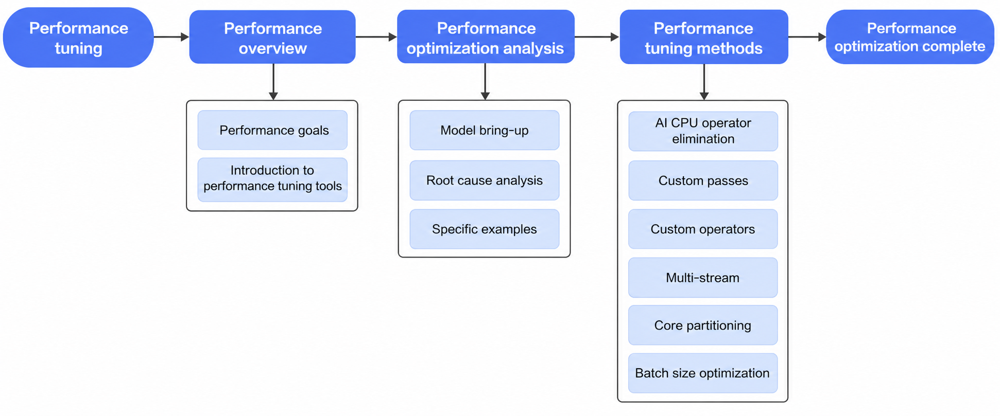

## Performance Metrics

Align the following key metrics:

- Single-card and multi-card scenarios: In single-card scenario verification, partition CPU resources in Docker according to the customer configuration for verification. In multi-card scenarios, CPU-bound issues may occur. During early debugging, confirm that CPU resources meet requirements.
- Latency requirements: Confirm whether a fixed or variable value is required, and confirm the requirement standards for low-load and high-load scenarios.
- Batch size distribution: Confirm whether a fixed or dynamic value is required and the batch size distribution.
- Queries per second (QPS): The number of requests is the total number of requests within an interval. QPS = requests per second (req/sec).
- Throughput: It is the maximum amount of sample data that the network model can process per unit time, for example, 1 s. Throughput = QPS × batch size.
- Data types: float16, float32, and other types.

### Introduction to Performance Tuning Tools

#### msProf

##### PyTorch-Specific Performance Profiling

For PyTorch, you are advised to use the profiling interface. After profiling, the tool automatically parses the performance data. For details, see **msprof common profiling commands** in the *CANN Performance Tuning Tool User Guide*.

The following is a complete example:

```python
import torch
import torch_npu
device = torch.device("npu")
class DemoModel(torch.nn.Module):
    def forward(self, in0, in1):
        mul0 = in0 * in1
        sub0 = mul0 ** 2 - in0
        sub1 = mul0 ** 2 - in1
        slice0 = sub0[:, :2]
        slice1 = sub1[:, 2:]
        cat0 = torch.cat([slice0, slice1], dim=1)
        return cat0
def main():
    torch.manual_seed(2025)
    in0 = torch.randn(3,5).to(device)
    in1 = torch.randn(3,5).to(device)
    model = DemoModel().to(device)
    output = model(in0, in1)
    print(output.shape)
    print(output.device)
    print(output)
    # perf code
    experimental_config = torch_npu.profiler._ExperimentalConfig(
        export_type=[
            torch_npu.profiler.ExportType.Text,
            torch_npu.profiler.ExportType.Db
            ],
        profiler_level=torch_npu.profiler.ProfilerLevel.Level1,
        msprof_tx=False,
        aic_metrics=torch_npu.profiler.AiCMetrics.AiCoreNone,
        l2_cache=False,
        op_attr=False,
        data_simplification=False,
        record_op_args=False,
        gc_detect_threshold=None
    )
    steps = 10
    with torch_npu.profiler.profile(
        activities=[
            torch_npu.profiler.ProfilerActivity.CPU,
            torch_npu.profiler.ProfilerActivity.NPU
            ],
        schedule=torch_npu.profiler.schedule(wait=3, warmup=0, active=1, repeat=1, skip_first=1),
        on_trace_ready=torch_npu.profiler.tensorboard_trace_handler("./result"),
        record_shapes=False,
        profile_memory=False,
        with_stack=False,
        with_modules=False,
        with_flops=False,
        experimental_config=experimental_config) as prof:
        print("profiling start...")
        for step in range(steps):
            output = model(in0, in1)
            prof.step()
if __name__ == "__main__":
    main()
```

##### Performance profiling for TensorFlow and PyTorch

In TensorFlow, no interface can be called directly. You must use the `msprof` command for profiling. Use dynamic profiling to control the volume of collected data. For details, see **Dynamic Profiling of Performance Data** in the *CANN Performance Tuning Tool User Guide*.

The sample code is as follows:

```python
import npu_device
from npu_device.compat.v1.npu_init import *
import numpy as np
import tensorflow as tf
tf.compat.v1.disable_eager_execution()
session_config = tf.compat.v1.ConfigProto()
custom_op = session_config.graph_options.rewrite_options.custom_optimizers.add()
custom_op.name = "NpuOptimizer"
custom_op.parameter_map["graph_max_parallel_model_num"].i = 1
custom_op.parameter_map["aicore_num"].s = tf.compat.as_bytes("7|10")
session_config.graph_options.rewrite_options.remapping = RewriterConfig.OFF
left_shape = [1, 8000]
right_shape = [800, 1]
x = tf.compat.v1.placeholder(tf.int64, shape=left_shape)
y = tf.compat.v1.placeholder(tf.int64, shape=right_shape)
equal_ret = tf.math.equal(x, y)
inputs_x = np.random.rand(*left_shape)
inputs_x = inputs_x.astype(np.int64)
inputs_y = np.random.rand(*right_shape)
inputs_y = inputs_y.astype(np.int64)
with tf.compat.v1.Session(config=session_config) as sess:
  for i in range(100000):
    result = sess.run(equal_ret, feed_dict={x:inputs_x, y:inputs_y})

print(result)
```

1. Run inference in a loop. Shortly after the model starts inference, manually obtain the PID of the running program. For example, if the PID is 9527, run the following dynamic profiling command to collect data:

    ```bash
    msprof --dynamic=on --pid=9527 --output=/home/projects/output --model-execution=on --runtime-api=on --aicpu=on
    > start

    ...
    > stop

    ...
    > quit
    ```

    The period after the `start` command is the dynamic profiling time window, which ends when you enter the `stop` command.

2. After the data is collected, parse it manually. Enter the directory collected in the preceding step (usually a directory with a timestamp) and run the following commands to parse the data:

    ```cpp
    // Enable parsing and output profiling to the current directory.
    msprof --parse=on --output=./
    // Enable export and save the results in CSV format to the current directory.
    msprof --export=on --output=. --summary-format=csv
    ```

    >[!NOTE]
    >Excessive profiling time will lead to long parsing time. Properly control the profiling time. Generally, you can perform data analysis with 5 seconds of profiling.

#### Graph Engine Dump

Execution graph analysis must be based on the graph optimized by the graph engine (GE), so you must dump it by configuring the relevant environment variables.

The environment variables involved are `DUMP_GE_GRAPH`, `DUMP_GRAPH_LEVEL`, and `DUMP_GRAPH_PATH`. For details, see **Graph Compilation** in the *CANN Environment Variable Reference*.

Common configurations are `DUMP_GE_GRAPH=2` and `DUMP_GRAPH_LEVEL=2`.

In the dumped graph folder, several `.pbtxt` and `.pb` files are generated in sequence after each stage of the graph optimization process completes. For example, in `ge_onnx_00000101_graph_0_Build.pbtxt`, `00000101` is the sequence number. The `0` in `graph_0` represents the rank ID, which is always 0 in recommendation inference scenarios. The build graph here corresponds to the graph in the execution stage. Analyze the optimization space through profiling and the network structure corresponding to this graph.

[msIT Tool](https://gitcode.com/Ascend/msit/blob/master/msit/docs/graph/README.md): Dump the GE graph, and use the msit graph function of the tool to scan for repeated structures. For substructures that appear many times and account for a large proportion, consider manually writing fused passes and fused operators for optimization. The tool also has a subgraph extraction function. For example, in scenarios where the graph is too large to open, you can extract a subgraph for analysis. A third-party network visualization tool is recommended: [netron.app](https://netron.app/).

## Performance Optimization Analysis

The software stack involved is primarily PyTorch and TensorFlow. In these two scenarios, different frameworks may be derived according to the actual application scenarios. This section introduces the basic flow of this software stack.

### PyTorch Technology Stack

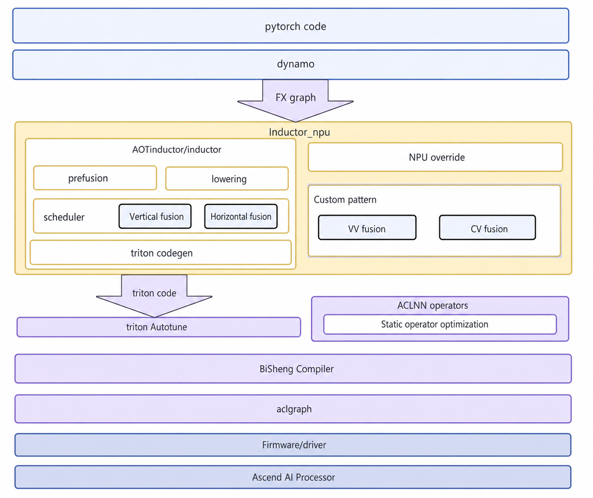

### TensorFlow Technology Stack

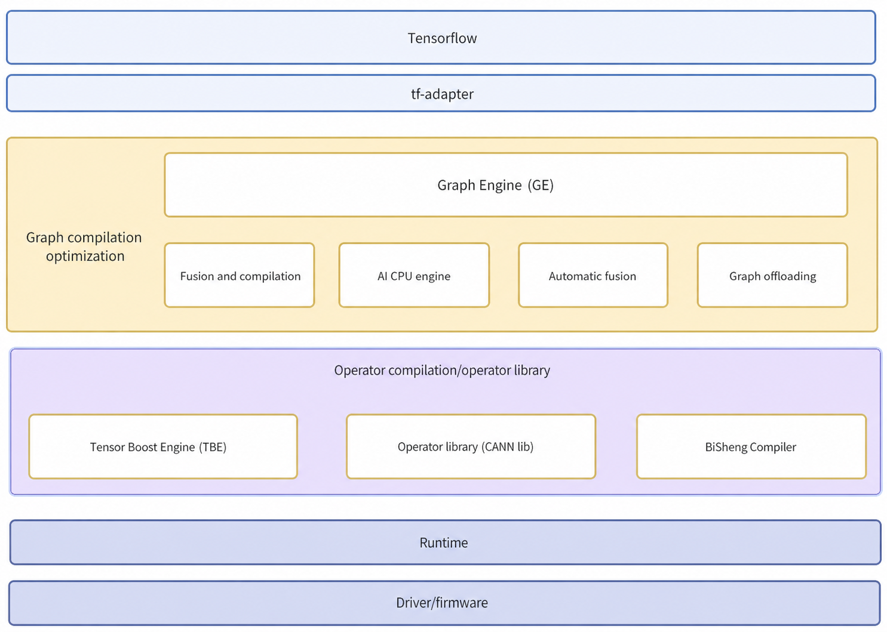

### Bring-up

When a customer model is started, the specific use of the TensorFlow or PyTorch technology stack usually depends on the customer's needs. The choice of the bring-up software stack should be based on the customer's inference framework process.

- For the TensorFlow framework, the customer usually provides a .pb file. The model can be run according to the customer's software stack. You can refer to the community demo ([TF Inference Sample Reference](https://www.hiascend.com/document/detail/zh/TensorFlowCommunity/82RC1alpha002/migration/tfmigr1/atlastfserv_26_0006.html)).
- For the PyTorch route, you can use the TorchAir suite for inference. Refer to the community demo ([TorchAir Inference Sample](https://www.hiascend.com/document/detail/zh/Pytorch/710/modthirdparty/torchairuseguide/torchair_00005.html)).
- For the ecosystem route, use the Inductor + Triton process. After completing the bring-up, you can initially observe the performance baseline and compare it with the target, while referring to the profiling methods in previous sections for subsequent analysis.

### Different Bottlenecks

Several ideal scenarios are listed below for analysis. In reality, most cases involve solving one bound only for another to appear, or scenarios where they are mixed. If no bound appears, NPU utilization may not be saturated. You can first construct a high-load scenario (such as a local pressure test script, running the model with multiple streams and high load) and then analyze the bottlenecks.

#### Cube/Vector

Program performance is dominated by the execution time of the computing cores (kernels). You can check whether the program is bound through the following points:

1. Use `npu-smi info` to check utilization. If utilization is very high, the program is likely bound. Utilization may be relatively low during single inference but exceed 80% (generally considered very high) during parallel inferences. This value is the ratio of cycles on the Cube core converted from the clock frequency and does not include the proportion of Vector cores. This is a preliminary check and specifics must be calculated from the profiling cycles.

    Calculate utilization through profiling, as shown in the following figure.

    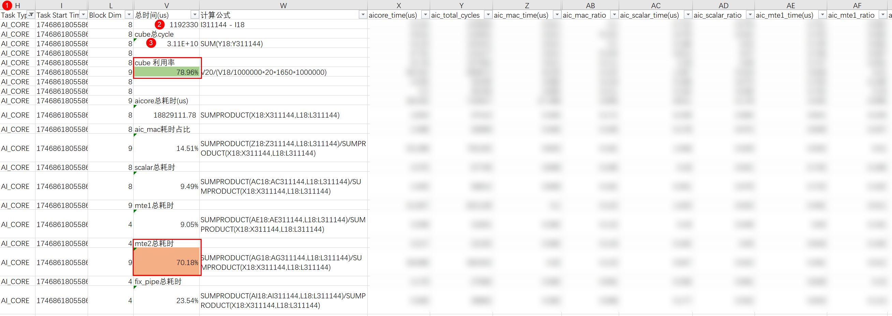

2. For example, filtering `AI_CORE` here calculates the utilization of `CUBE`.
3. Sort by start time. Calculating the difference between the first and last timestamps gives the total time for the entire segment.
4. The total number of `CUBE` cycles is the sum of `aic_total_cycles`.
5. Utilization = ③/(②/1,000,000 × 20 × 1,650 × 1,000,000). The unit of ② is µs, so it is divided by 1,000,000 to convert to s. 20 is the number of AI Cores on the specific chip. 1,650 is the frequency of the current chip in MHz/s, so it is multiplied by 1,000,000.

    The utilization calculated here is 78.9% of the overall Cube utilization.

6. The proportion of each process in the calculation can be calculated directly using time. For example, if `mte2` time accounts for 70.18% of the total AI Core time, memory input during the AI Core execution accounts for the majority.

Optimization methods in Cube/Vector-bound scenarios:

- Graph optimization, such as `torch.compile` or TensorFlow XLA.
- Operator fusion to reduce operator launch overhead and intermediate reading/writing.
- Data types, such as reducing from float32 to HF32. For the same data, the computing workload decreases (this may affect accuracy, so perform accuracy testing). Note that the HF32 data type only takes effect for Conv and Matmul operators.

#### Host

**Analysis process**

When opening the profiling timeline file through the `chrome://tracing/` page, you can see operator dispatch similar to the following.


As shown in the figure, there are many "bubbles" on the device, and the computing power is not fully utilized.

This situation is generally seen in dynamic graph scenarios or single-operator dispatch scenarios, where processing must complete on the host before a single operator is dispatched, and the operator execution time is less than the host-side processing time.

For host-side computational workload, export data through the native TensorFlow Profiler to check the proportion of host and device time and judge by CPU utilization. After hybrid computing is enabled (refer to: [www.hiascend.com](https://www.hiascend.com/document/detail/zh/TensorFlowCommunity/82RC1alpha003/migration/tfmigr1/tfmigr1_000074.html)), the system automatically keeps operators that cannot be executed on the device to be executed on the host. You can also specify certain operators not to offload to the device, leading to higher host calculation volume. Use the native TensorFlow Profiler to capture the performance of the entire session run (refer to [www.tensorflow.org](https://www.tensorflow.org/guide/profiler#overview_page)) and analyze the proportion of host-side and device-side time.

**Solutions**

- Replace single-operator dispatch schemes with full-graph offloading.
- Convert dynamic graphs to static graphs.
- Increase the batch size to increase operator execution time and reduce the proportion of free gaps.
- Improve host-side performance. If CPU utilization is too high, consider CPU-side optimizations.
- Deploy in a cluster to ensure sufficient host-side resources.
- For single-machine deployment, consider mixed deployment of non-host-bound models and host-bound models.

#### PCIe

The simplest way to analyze this is to increase the load. PCIe time becomes significantly longer while other times do not change much.

The time consumed by PCIe in the timeline file is shown as `model@inputcopy` in the figure.


Actual rate indicators are summarized in the `pcie_*.csv` file through summary information. For details, see [www.hiascend.com](https://www.hiascend.com/document/detail/zh/canncommercial/82RC1/devaids/Profiling/atlasprofiling_16_0012.html). The relevant variable is `--sys-interconnection-profiling`. For example, `Tx_p_avg` in the figure is the input data, with an average rate of 99.628 MB/s.

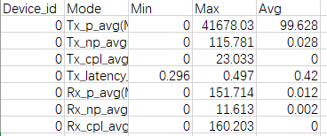

Theoretical data calculation: Assuming PCIe 5.0, the bidirectional transmission rate of each PCIe lane is close to 8 GB/s. A card typically has an x4 interface, so the theoretical maximum rate is close to 32 GB/s. The actual rate varies according to the size of the transmitted file. Generally, a maximum of 80% of the theoretical bandwidth can be reached. The actual bandwidth is strongly related to the shape and size of the sent data.

**Analysis direction**

1. Determine how many cards correspond to one CPU and whether time consumption caused by PCIe contention can be reduced through operations such as NUMA node binding.
2. Increase the batch size to reduce the proportion of PCIe transmission header overhead.
3. Data format: Reducing from float32 to float16 can also effectively solve the issue. Ensure that accuracy meets the requirement or is acceptable to the customer.
4. Accumulate data on the host first, converting small data transmissions into large ones. The GE framework has this function. If the customer calls the `aclrt` interface, they must implement it themselves.

#### Memory Access

This section mainly targets memory input and output of Vector or Cube operators, where memory access becomes a bottleneck.

1. Generally, the memory access rate can be calculated through the profiling file according to the data transfer volume of each operator and its transfer time to judge whether a memory access bound exists.

    

    As shown in the preceding figure, the input data volume is 20,000/48 × 2 × 8 = 6.5 KB. 48 indicates that data is distributed to 48 cores, 2 indicates two shapes of 20,000, 8 indicates `int64`, and `mte2` time is 1051 µs, so the calculated bandwidth is 0.005 GB/s. This bandwidth is far below the theoretical bandwidth and is problematic.

2. Directly judge whether the `aiv_mte2_ratio` field in the profiling file exceeds 0.8. If many operators exceed 0.8, this part must be optimized, as shown in the figure.

    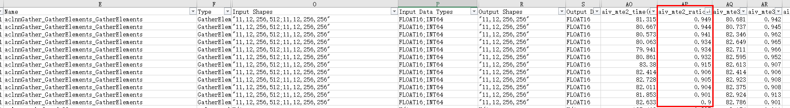

**Analysis direction**

1. Analyze whether the time consumption is reasonable.
2. Vector operator fusion can effectively reduce the amount of data to be copied, releasing memory access pressure.
3. Check whether the amount of data transferred is 32-byte aligned. Non-aligned scenarios lead to low bandwidth and require special processing within the operator.

### Case Sharing 1

**Background**

A customer allocates a fixed percentage of traffic from a large pool to a cluster. A certain number of NPUs in this cluster handle these requests. The goal is to reduce the number of NPUs in the cluster while ensuring that request latency does not exceed the threshold.

**Analysis process**

Local test data -> step 1:

1. **Batching strategy** is implemented in the customer's server-side framework. Batching time and levels can be modified through parameters.
2. **Maximum BS level** means that each batch size from 1 to this maximum level is configured as a level.
3. **Number of streams** represents the number of instances on one NPU, that is, the maximum number of inference tasks that can run in parallel.
4. For core partitioning, the first number is the number of Cube cores, and the second is the number of Vector cores.
5. Performance in the last three columns is the QPS value (1,000/average time × number of streams).

    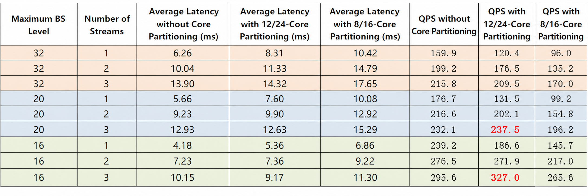

    The table shows that QPS is highest when the maximum batch size level is 16 and the number of streams is 3. Note that this data is from a local uniform pressure test, and the batch size distribution does not represent real online conditions. It serves only as a directional analysis method.

Online batch size distribution -> step 2:

Batch size data captured from the online environment is shown in the figure. Most batch sizes are small: 90% are below 20, and 86% are below 16.

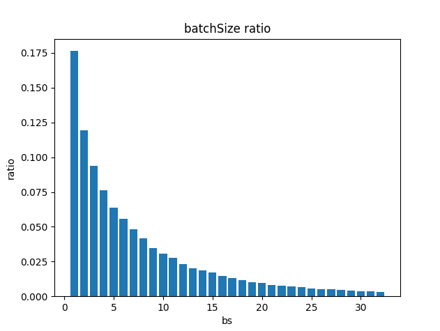

Based on local test performance, we can choose a maximum batch size level of 16 and 3 streams.

Online batch size performance tuning -> step 3:

Actual data shows that during peak traffic, NPU latency deteriorates severely. Latency increases as traffic increases, so utilization is suspected.

Comparing local test data in the 12/24 core partitioning scenario, NPU processing for a request with a batch size of 20 is as follows.

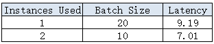

- If the maximum batch size is 20, the request completes in 9.19 ms, occupying 12/24 cores.
- If the maximum batch size is 16, the request is split into two tasks of batch size 10. They complete in parallel in 7.01 ms. The time is shorter than batch size 20, but the occupied hardware resources are 24/48 cores, which is double that of batch size 20, leading to excessively high NPU utilization.

After the maximum batch size is changed, actual average online latency showed no obvious change, but NPU utilization dropped by 5% on average, and latency deterioration during peak traffic improved significantly.

### Case Sharing 2

**Background**

For a coarse ranking model, TP99 latency under low load must be reduced to within 5 ms while maintaining core limits (Cube: 7 cores, Vector: 10 cores) to ensure performance in high-load scenarios.

**Analysis process**

Profiling:

Since the goal is to optimize low-pressure latency, profiling is performed serially. Run the model for inference, then use `msprof --dynamic=on --pid=9527 --output=/home/projects/output --model-execution=on --runtime-api=on --aicpu=on` for dynamic profiling. For details, see [msProf](#msprof).

Bring-up: In the scenario without optimization (only operator mode configuration, `GatherV2` high performance, Cube HF32 enabled), a single `modelExecute` takes 51 ms, which is 10 times the target.


1. Due to serial execution, operator time consumption is stable. For profiling, analyze the performance of a single inference after deduplication based on `op_name`.

    

2. Sorting by `task_duration` shows that each inference takes around 44 ms. Due to many dynamic operators, a `task_wait` time of around 7 ms (waiting for host scheduling) is introduced.

    Analyzing the `Gather` operator shape and structure: the dynamic `Gather` operator uses logical cores and is not limited by the core limiting function of GE. This violates the prerequisite for high-load performance. The index number of the `Gather` operator is at most 20,000. Theoretical analysis suggests it should not take ms-level time (high data redundancy causes large inter-core conflicts).

    Structure analysis shows that this `Gather` comes from the first `Gather` in the following structure.

    

    This substructure introduces the `Where` operator, so subsequent operator shapes are not fixed, introducing dynamic subgraphs. Since `Where` is a type-3 operator (the output shape is not fixed), the dynamic graph must return shape information to the host after `Where` execution before subsequent shape derivation. This leads to high `task_wait` time.

    Execution logic analysis shows that this substructure extends the `Gather` logic to return an all-zero vector for index < 0. Based on repeated data analysis, the input carries long segments of padded zeros. Implementing a custom `Gather` operator and loading part of the table into UB solves the dynamic subgraph, core limiting, and performance issues.

Profiling analysis --> step 2:

After solving these issues through custom operators, collect profiling data again. The serial execution time dropped to around 9 ms, and the performance of `default_gather` improved significantly.


Operators not replaced by `DefaultGather` are not in that dynamic structure. However, for a `Gather` operator with a sequence length of 4,000, theoretical analysis shows that it should not take more than 180 µs. The actual issue is caused by the `GatherV2` high-performance mode in the full-load scenario. For a table shape of 400 x 50, performance improves greatly after full loading.

A custom `Gather` operator is used here to cover this scenario (synchronous operator optimization requirement).

Profiling analysis --> step 3:

After the remaining `Gather` operators are replaced with `CustomGather` (full-load logic), the serial time reached around 6.1 ms. You can now scan the model for optimization points comprehensively.


Analyzing bottlenecks: the top ones are `TopK` and `Equal`. The underlying `TopK` operator does not support SIMT and is implemented through complex algorithms on Vector, leading to long latency. There is no optimization space in the operator itself. However, the `TopK` input contains padded zeros. If effective length is passed to `TopK`, average execution time can be significantly reduced (little impact on TP99 but affects maximum QPS). This depends on upper-layer framework changes and is not implemented here.

For the `Equal` operator, with shapes (1 x 4000) and (400 x 1), execution takes over 230 µs, far from the theoretical performance of Vector operators. This is caused by the Int64 implementation. Testing shows that an Int32 `Equal` with the same shapes takes less than 30 µs. Int64 should not take an order of magnitude more time. For this dual-broadcast scenario, an Int64 implementation of `Equal` was designed, reducing latency to around 75 µs.

AICPU operators such as `Unique` and `Where` were also found.

Operators depend on upper-layer graph splitting, which is controlled by the user. The `Where` operator comes from the following structure. The dynamic structure it introduces can be eliminated through a custom pass.

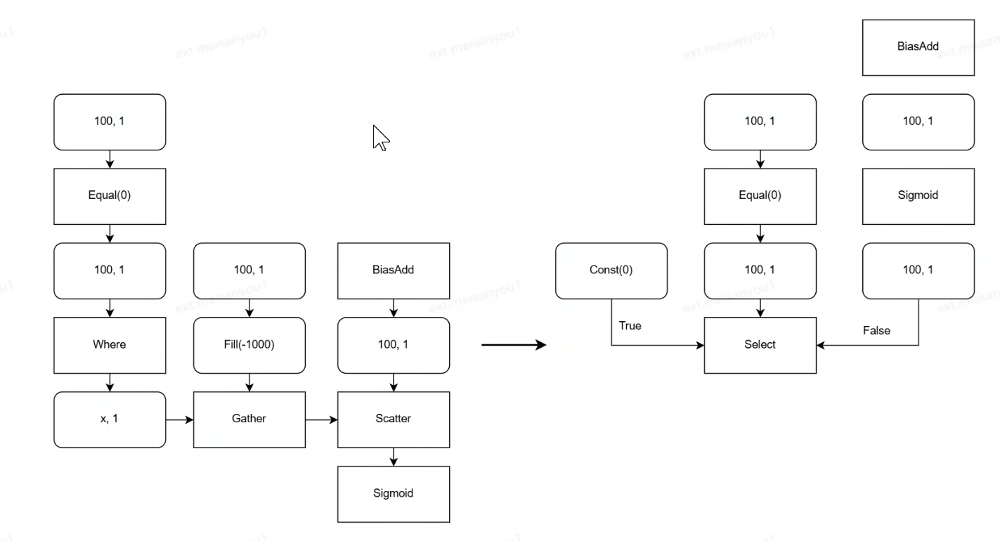

For this kind of `BatchMatMul`, replacing the calculation logic with `2, 400, 300 * 2, 300, 16` also improves performance.


After using custom `Equal`, eliminating `Where`, and replacing `BatchMatMul`, the serial latency reached 4.6 ms, meeting requirements.


## Performance Tuning Methods

### AICPU Operator Elimination

**Background**

Due to SIMD, the performance of AICPU operators on the NPU is generally poor. These operators must be eliminated or offloaded to the CPU.

**Constraints**

Currently, these are implemented through manual identification and modification of customer model code, requiring customer cooperation.

**Specific cases**

**Case 1:**

For `TopK`, int32/int64 values can only be executed on AICPU. If the type is fp32, there is an AI Vector implementation. If int32/int64-to-fp32 conversion is possible without significant precision loss (loss value < 2^24), `TopK` with integer indexes can be converted to `cast(int32->fp32/int64)` + `TopK(fp32)` + `cast(fp32->int32/int64)` through a custom pass.

**Case 2:**

For AICPU operators on the NPU without Vector implementations, if upper-layer operators are hard to offload to the CPU, consider graph modification so AICPU operators do not depend on NPU operators. As shown in the figure, the `Gather` operator that `Bucketize` depends on has indexes from a large NPU subgraph. This subgraph cannot be entirely offloaded. To offload `Bucketize` to the CPU, analyze that it only directly depends on `Gather`. As an index-type operator, `Gather` can have `Bucketize` performed on its table rather than its results (assuming table size is not much greater than output size). Moving `Bucketize` above the table branch of `Gather` shows that the `Squeeze` operator has no sequential dependency with `Bucketize`, so `Bucketize` can be moved above the input to be executed on the CPU.

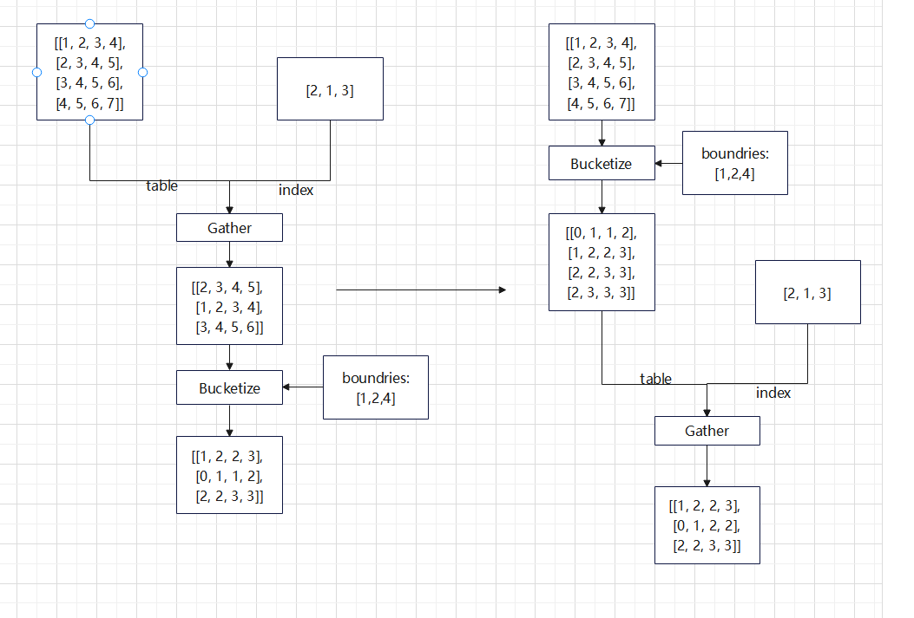

### Custom Passes

**Specific cases**

**Case 1: `BatchMatMul` + `Tile`**

The `BatchMatMul` operator has broadcast logic. If surrounding operators implement the same logic, they can be eliminated to improve performance. Deleting the `Tile` operator provides:

1. Time saved from the `Tile` operator itself.
2. Saved memory access (128 × 8 × 300 × 32 × 4 B= 37.5 MB) introduced by `Tile`, which affects cache hit rates of other instances.
3. Faster `mte` speed for the `BatchMatMul` operator as broadcasting is more efficient.

    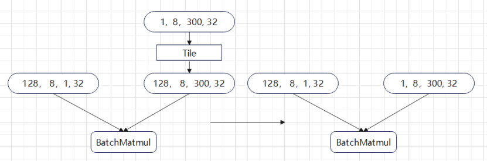

**Case 2: homogeneous `concat`**

In this scenario, using `concat` during graph construction implements the same function as `Tile`. However, the data input volume for `Tile` is only 1/240 of `concat`. If the tail axis is not aligned, `concat` also suffers performance loss.


**Case 3: Broadcast `BatchMatMul` Operator**

The original `BatchMatMul` operator performs matrix multiplication on (1, 32) and (300, 32). On NPU hardware, it only utilizes 1/16 of the Cube matrix unit. Since the first axis has broadcasting, shrinking it onto the k-axis replaces 128 separate (1, 32) × (300, 32) matrix multiplications with 8 larger (128, 32) × (300, 32) operations, improving Cube utilization. The introduced `Reshape` operator is not executed on the NPU, and the impact of the `Transpose` operator is outweighed by the improvement in calculation efficiency.

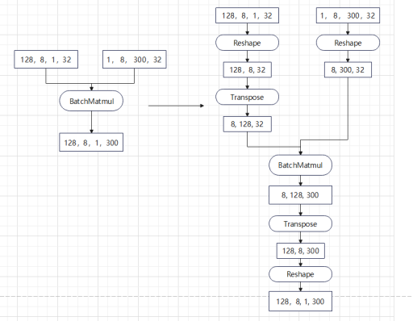

**Case 4: `Tile` + `concat`**

Swapping the execution order of `Tile` and `concat` reduces read memory access from 1 × 32 × 3 + 128 × 32 × 3 to 1 × 32 × 3 + 1 × 96 (98.5% decrease). Write memory access is reduced from 128 × 32 × 3 + 128 × 96 to 1 × 96 + 128 × 96 (50% decrease).


### Custom Operators

**Background**

If performance issues cannot be avoided by optimizing structures through passes, manual optimization of operators is required. To ensure generalization, hand-written operators often require different tiling branches for different shapes, which involves large amounts of code. When optimizing models, excessive time spent may not meet user needs. Therefore, implementing optimization branches for specific network structures based on prior model knowledge is the optimal strategy.

**Specific cases**

**Case 1: `TopK` with effective data length**

`TopK` is used in recommendation inference (for example, the TWINS model). Even if `TopK` is optimized to the Vector core (the `cast` scheme), performance is poor for very long sequence lengths. In addition, due to hardware reasons, `TopK` algorithm performance on NPUs struggles to match that on GPUs. Therefore, optimization of the custom `TopK` operator needs to be analyzed at the model level. From the model perspective, `TopK` input parameters come from a padded sequence. Not all data participates in `TopK`. Effective data is only about 10% on average. Based on this prior condition, implementing a custom `TopK` operator with an effective length input parameter can reduce operator time by 90% on average.

**Case 2: Custom `FloorMod` operator**

In the model, certain features are bucketed through `FloorMod`. The logic is that index 0 is mapped directly to 0, while other indexes are bucketed by computing their modulo value plus 1, which is then passed to the `Gather` operator. Since NPU hardware lacks native support for int64 operations, the `FloorMod` operator resorts to scalar instructions when handling int64 types, causing significant performance degradation with large input volumes. While converting int64 to dual int32 operations is theoretically possible, it introduces substantial complexity in computation logic and sign bit manipulation. However, leveraging the structural constraints of this design, specifically the requirement that indexes be positive for `Gather` to function, a key optimization can be made. Since `FloorMod` is only used for indexing in `Gather` operations, the divisor, or number of buckets, does not need to be stored as int64. The underlying `fmod` and division instructions natively support only fp32 and fp16. Analysis shows that converting the divisor to fp32 incurs no precision loss for values up to 2^24-1, approximately 16.77 million, which exceeds practical requirements. Algorithm constraints typically limit bucket counts to 2^21-1 for performance optimization, a threshold sufficient for most real-world applications. Therefore, the operator can be designed to support int64/fp32 operations, leveraging existing vectorized implementations that circumvent the scalar instruction bottleneck.


**Case 3: Custom `Gather` operator**

For features with default values, a structure converts indexes < 0 to zero vectors and indexes > 0 to embeddings. The `Where` operator acts as an AICPU operator, and the structure executes it as a dynamic subgraph, resulting in poor performance. Integrating this logic into the `Gather` operator, judging index values inside the operator and moving zero vectors or embedding values, reduces overall time by 3 orders of magnitude.


### Multi-stream

**Background**

Recommendation inference models often feature many operators with small shapes. They require high throughput within reasonable single inference time (data volume of a single inference task × number of inference tasks per unit time). Small shapes lead to low computing power utilization. Enabling multi-stream parallel inference improves utilization and throughput.

**Constraints**

1. Multi-stream parallel scenarios introduce resource contention involving bandwidth and compute resources. This causes individual inference latency to increase compared to single-stream execution. For latency-sensitive applications, appropriate latency control is required.
2. Without core partitioning, multi-stream processing may suffer from severe compute resource queuing. Whether to combine multi-stream with core partitioning should be determined based on actual data.
3. The number of streams should be tuned according to actual throughput characteristics of the model. While more streams increase NPU utilization and boost overall throughput, exceeding an optimal threshold introduces cross-stream cache invalidation effects, which can reduce overall throughput performance.

**Specific cases**

- TensorFlow demo: Refer to [GitCode.com](https://gitcode.com/Ascend/RecSDK/blob/develop_examples_and_tools/examples/rec_infer/README.md) for enabling multi-stream functionality.
- PyTorch demo: Since the PyTorch community lacks direct multi-stream support, use multi-processing for inference.

### Core Partitioning

**Background**

Take the NPUs on the A2 server as an example. One NPU contains 24 AI Cube cores and 48 AI Vector cores. When an operator is executed, the number of cores required is calculated based on the shape. Generally, all cores are used. Using more cores reduces workload per core and operator time.

For CTR inference with multi-instance concurrency, consider the total resources occupied (number of cores) of operators in addition to the time consumed. If a Cube operator takes 100 µs and occupies 24 cores, the NPU can only execute that one operator. If the operator is limited to 12 cores, it takes 150 µs. This allows executing two such operators in 150 µs (average 75 µs), which is better.

The benefits of core limiting are as follows:

1. For microsecond-level small operators, much of the time is launch overhead. More cores increase this overhead.
2. In CTR scenarios, shapes are small. After core partitioning, mini-tiling within a core may be reduced, minimizing computing power waste in tail blocks.
3. Accessing the same address between NPU cores causes memory access conflicts. For index-type operators like `Gather`, more cores exacerbate inter-core conflicts if data distribution is concentrated.

    The number of cores should not be limited too low. Generally, Vector/Cube limits should be within 6 to 12 cores. (Because Vector and Cube are different resources in the model, the 1:2 ratio introduced by hardware does not need to be ensured.)

**Constraints**

In single-stream scenarios, inference latency following core partitioning typically shows degradation compared to cases without core partitioning. For latency-sensitive applications, carefully control the extent of latency degradation based on latency requirements.

**Specific cases**

- TensorFlow demo: For modification instructions, see [Session Configuration Parameters](https://www.hiascend.com/document/detail/zh/TensorFlowCommercial/800/API/tfadapter1x/tfmigr1_tfadapi_0020.html) in the TensorFlow Adapter Interface (1.x) documentation to configure the `aicore_num` parameter.
- PyTorch demo: This feature is not supported currently.

### Batch size Optimization

**Background**

For certain small operators, increasing batch size can reduce the proportion of overhead. It may also increase the number of cores utilized by these operators, thereby enhancing overall performance. This enables more efficient utilization of NPU core resources and reduces redundant weight transfers.

**Constraints**

1. Increasing the batch size requires more cores for operator computation. When combined with core partitioning, this can result in significant latency degradation. Conduct thorough latency testing to determine the optimal batch size.
2. The cache hit rate will decline.
3. The batch size is typically dictated by the customer's service requirements. While you can test performance improvements with larger batch sizes in local benchmarking scripts, production performance may differ. Since batch size can vary and padding may be necessary in production environments, real-world optimal performance may not match local test results.

**Specific cases**

The table shows real model data where throughput increases with the batch size.

**Table 1** Model data

|batchsize|Inference Time (ms)|Throughput|
|--|--|--|
|86|8.5|10117|
|128|10.4|12258|
|256|14.9|17231|
|512|26.7|19195|

## Performance Tuning Cases

### Host Side

**Background**

Using the Recsys-gr generative recommendation model as an example, end-to-end training performance differs significantly across CPU environments with different architectures (x86/Arm) and clock frequencies. After comparing the two hardware environments, we found that the device-side specifications are the same. After collecting profiling files, device-side time consumption shows no obvious difference.

The core difference between the two runtime environments lies in the CPU architecture specifications and clock frequency. End-to-end performance degrades severely in the low-frequency Arm environment. Therefore, a host-bound bottleneck is initially identified.

**Optimization methods**

Host-bound issues are mainly caused by two factors: operator dispatch latency and excessive CPU compute load. You can tune performance through the following methods:

#### Core Pinning (Process Affinity Binding)

Bind the training main process and data loading process to specific CPU cores to avoid frequent cross-core migration and context switching. This greatly reduces system scheduling overhead, accelerates host-side operator scheduling and task dispatch, and reduces NPU idle waiting time.

#### Enable Huge Pages

Enable the system huge page mechanism to reduce memory page table address translation overhead and page fault interruption overhead. This improves host memory access bandwidth, accelerates CPU memory allocation and data copy speed between the host and the NPU, and reduces host-side memory and communication time.

#### BIOS Tuning

Disable CPU power-saving frequency scaling policies, lock the CPU at a high clock frequency, and enable performance scheduling mode. This improves single-core CPU performance and speeds up host tasks such as serial operator scheduling and logical preprocessing, allowing CPU task dispatch to keep pace with NPU computation.

For detailed analysis, optimization methods, and cases for host-bound issues, see [How to Locate and Resolve Host Bound Issues](https://www.hiascend.com/document/detail/zh/mindstudio/2600/practicalcases/GeneralPerformanceIssue/MindStudio/26.0.0/cases/general_performance_issue_troubleshooting_guide/solution_to_top3.md?framework=mindspore).

For performance tuning based on the Recsys-gr model, see the [Recsys-gr Performance Tuning Example](./torch/torch_rec_v2/migration_and_training.md) section.

### Device Side

**Background**

In training and inference scenarios, the host can quickly complete task dispatch, while the NPU, or device side, handles core execution work such as operator computation and tensor operations. If device-side computation time is far greater than host-side task dispatch time, NPU compute resources remain fully loaded, the computation chain becomes blocked, and device-side bottlenecks become the core performance issue.

**Optimization methods**

Operator performance issues require specialized analysis tools and code optimization techniques. Collect profiling data for the model and compare metrics such as computation time and memory usage for different operators. You can optimize device-side operators through the following methods:

#### Affinity Operator Replacement

Replace PyTorch native general-purpose operators with NPU-specific affinity operators. These operators are deeply adapted to the NPU hardware architecture and compute cores, eliminate operator adaptation overhead, and greatly improve single-operator execution efficiency.

#### Fused Operators

Merge multiple consecutive fine-grained operators into one fused operator to reduce NPU kernel invocation overhead and memory read/write overhead for intermediate tensors. This simplifies the computation flow and avoids wasting NPU compute resources.

For detailed operator optimization strategies and cases, see [NPU Affinity Adaptation Optimization](https://www.hiascend.com/document/detail/zh/Pytorch/2600/ptmoddevg/trainingmigrguide/FrameworkPTAdapter/26.0.0/zh/pytorch_model_migration_fine_tuning/overall_optimization_strategy.md) and [Operator Performance Issue Optimization Solution](https://www.hiascend.com/document/detail/zh/mindstudio/2600/practicalcases/GeneralPerformanceIssue/MindStudio/26.0.0/cases/general_performance_issue_troubleshooting_guide/solution_to_top2.md).

### Communication

**Background**

In multi-card distributed training scenarios, the collective communication time spent on gradient aggregation, parameter synchronization, and data exchange between NPU cards accounts for too much of the total time and far exceeds the compute time of a single card. All cards end up waiting for communication to complete, and overall training throughput is dragged down by the communication stage. This is a communication bottleneck.

**Optimization methods**

Communication bottlenecks must be solved through distributed scheduling, HCCL communication library tuning, and load balancing. By adjusting execution logic and communication strategies, you can eliminate synchronization waiting time. The main optimization methods are as follows:

#### Computation-Communication Fusion

Break the serial execution model of computation and communication. Through gradient accumulation, pipeline parallelism, and gradient shard synchronization, the NPU can perform communication in the background while executing computation tasks, completely hiding communication time in computation gaps and offsetting communication wait overhead.

#### HCCL Communication Library Tuning

Tune parameters of the HCCL communication library and adjust features such as link and NIC configuration and buffer size to improve data transfer bandwidth and synchronization efficiency across multiple machines and cards, reducing collective communication latency.

#### Fast and Slow Card Issue Resolution

A fast card is a card that finishes its computation task first in the cluster. A slow card finishes its computation task more slowly in the cluster. Different cards finish tasks at different times, which causes fast cards to wait for slow cards and degrades the performance of the entire cluster.

For fast and slow card issues caused by NPU card performance differences and uneven node load in the cluster, use hardware resource isolation, load-balanced data sharding, and unified scheduling of cards with the same specifications to equalize iteration time across cards. This removes synchronization blocking caused by fast cards waiting for slow cards and avoids the barrel effect.

For detailed communication optimization issues and cases, see [Communication Issue Optimization Solution](https://www.hiascend.com/document/detail/zh/mindstudio/2600/practicalcases/GeneralPerformanceIssue/MindStudio/26.0.0/cases/general_performance_issue_troubleshooting_guide/solution_to_top1.md) and [Communication Optimization](https://www.hiascend.com/document/detail/zh/Pytorch/2600/ptmoddevg/trainingmigrguide/FrameworkPTAdapter/26.0.0/zh/pytorch_model_migration_fine_tuning/communication_basics_overview.md).

### Throughput

**Background**

In recommendation inference scenarios, model inference efficiency is limited by instance resource contention and insufficient scheduling density. The number of inference tasks that can be processed per unit time, or throughput, is low. Overall inference performance cannot be fully unleashed, making this a key bottleneck for efficient inference services.

**Optimization methods**

Throughput bottlenecks must be solved through resource scheduling, hardware core limiting, and batch scheduling strategies. By allocating resources properly and improving scheduling density, you can maximize throughput. The main optimization methods are as follows:

#### Multi-Instance Parallelism

Deploy multiple inference instances to make full use of idle hardware resources, improve the parallel processing capability of inference tasks, break through the processing limit of a single instance, directly expand the number of inference tasks that can be handled per unit time, and improve overall throughput.

#### AI Core Core Limiting (Core Partitioning)

For hardware resource contention that often occurs during multi-instance parallelism, control the allocation of AI Core resources to avoid resource preemption conflicts between instances. This ensures stable operation of each inference instance, effectively improves throughput, and reduces inference latency.

#### Optimize Scheduling Density

Increase the inference batch size appropriately to improve task scheduling density, reduce scheduling gap overhead, fully leverage hardware compute power, and improve throughput while balancing throughput and latency within a controllable range.

For detailed throughput optimization issues and cases, see [Inference Tuning Cases](https://www.hiascend.com/document/detail/zh/CANNCommunityEdition/900/programug/graphdevg/atlasag_25_0101.html).
