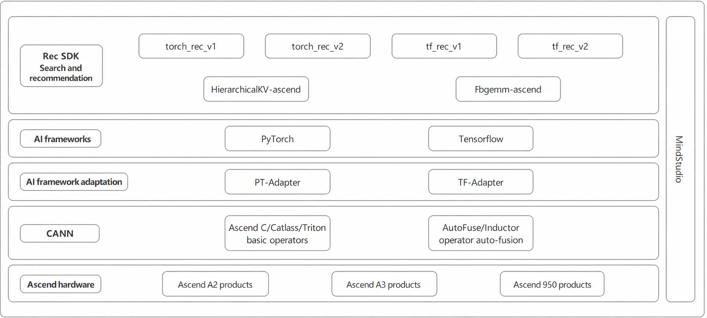

# Introduction to the Recommendation Full Stack

## Introduction

### Background

As AI technologies continue to evolve, sectors such as e-commerce, video production, and social media are placing increased demands on search, recommendation, and advertising systems. The rapid growth of the Internet has led to a massive increase in user data, product information, and video content, underscoring the importance of effective SRA systems. The growing need for these systems inevitably leads to a high demand for computing power. Consequently, the deployment and optimal utilization of larger computing power have become significant concerns for practitioners.

### Product Definition

Rec SDK is an application enablement SDK for search, recommendation, and advertising scenarios in the Internet market. Built on the Ascend platform, it provides a complete recommendation system framework. Together with fbgemm-ascend, a high-performance PyTorch NPU operator library on the Ascend platform, and HierarchicalKV-ascend, a high-performance key-value (KV) storage acceleration library on the Ascend platform, it delivers an end-to-end solution that spans the upper-layer framework, high-performance operator computing, and large-scale sparse feature storage. It supports ultra-large-scale recommendation scenarios and helps users train and deploy recommendation models efficiently on the Ascend platform. Figure 1 shows the product architecture.

Figure 1 Product architecture

### Product Value

Table 1 Product value

| Feature| Product Value                                          |
| -------- | -------------------------------------------------- |
| Ease of use    | Build algorithm models quickly using minimalist APIs.                   |
| Accuracy    | Achieve less than 0.01% validation error on standard models.              |
| Performance    | Maximize performance with efficient multi-level pipeline acceleration, high-speed collective communication, and extreme optimization.|

## Components

### Component Overview

The recommendation solution consists of the following three core components. See Figure 1 for the product architecture.

Table 2 Core components of the recommendation solution

| Component                     | Positioning        | Core Responsibilities                               |
| :------------------------ | :----------- | :-------------------------------------- |
| Rec SDK               | Recommendation framework    | Model development, TB-scale embedding storage, and end-to-end scheduling|
| fbgemm-ascend         | High-performance operator library| Embedding table queries, fused operators, and computing acceleration         |
| HierarchicalKV-ascend | KV storage acceleration library| Large-scale sparse feature storage and low-latency access         |

#### Rec SDK

[Rec SDK](https://gitcode.com/Ascend/RecSDK) offers an SDK for search, recommendation, and advertising services in the Internet market. It offers a framework for these services based on the Ascend platform to meet related model training requirements, thus supporting large-scale SRA scenarios and facilitating efficient training of models for such scenarios.

Rec SDK provides the following features:

- Basic model training functions: Rec SDK supports single-node, single-device training and multi-node, multi-device distributed training.

- Recommendation-specific functions: Based on the sparse table solution, Rec SDK provides essential functions such as feature saving and loading, feature admission, and feature eviction.

- Large-scale sparse table functions: Rec SDK supports multi-level storage across accelerator device memory, host memory, and host drive. It also supports multi-node storage and dynamic scaling, with capacities exceeding 10 TB.

Rec SDK consists of multiple components, including internal components such as `tf_rec_v1`, `tf_rec_v2`, `torch_rec_v1`, `torch_rec_v2`, and `rec_ops`, as shown in Table 3.

Table 3 Rec SDK components

| Component    | Base Framework          | Adaptation Status| Framework Type    | Description                                                    |
| ------------ | ------------------ | -------- | ------------ | ------------------------------------------------------------ |
| tf_rec_v1    | TensorFlow         | Non-fully-offloaded| Sparse recommendation framework| Non-fully-offloaded sparse recommendation framework based on TensorFlow, adapted for NPU devices, supporting Atlas A2/A3/A5 devices.|
| tf_rec_v2    | TensorFlow         | Fully-offloaded  | Sparse recommendation framework| Fully-offloaded sparse recommendation framework based on TensorFlow, adapted for NPU devices, supporting only Atlas A5 devices.|
| torch_rec_v1 | PyTorch + TorchRec | Non-fully-offloaded| Sparse recommendation framework| Open-source sparse recommendation framework based on PyTorch and [TorchRec](https://github.com/meta-pytorch/torchrec/tree/release/v1.2.0) to NPU devices with partial offloading, supporting Atlas A2/A3/A5 devices.|
| torch_rec_v2 | PyTorch + TorchRec | Fully-offloaded  | Sparse recommendation framework| Open-source sparse recommendation framework based on PyTorch, [DynamicEmb](https://github.com/NVIDIA/recsys-examples/tree/v25.09), and [TorchRec](https://github.com/meta-pytorch/torchrec/tree/release/v1.2.0) for to NPU devices with full offloading, supporting only Atlas A5 devices.|
| rec_ops      | -                  | -        | Operators        | Custom operator set developed based on Ascend C for recommendation scenarios, supporting Atlas A2/A3/A5 devices.|

Key Terminology

- Non-fully-offloaded: A hybrid mode in which sparse table hash mapping, deduplication, and bucketization operations run on the CPU, while the remaining computing tasks run on the NPU

- Fully-offloaded: A mode where all computing tasks are offloaded to the NPU for better compatibility

#### fbgemm-ascend

[fbgemm-ascend](https://gitcode.com/Ascend/fbgemm-ascend) is the operator implementation of FBGEMM operators on the Ascend NPU platform. It provides high-performance sparse and dense operators through `torch.ops.fbgemm.*`, helping recommendation, search, and other scenarios achieve a training experience on Ascend devices that matches GPUs. Its goal is to incorporate new capabilities from the [FBGEMM](https://link.gitcode.com/?target=https%3A%2F%2Fgithub.com%2Fpytorch%2FFBGEMM&from=https%3A%2F%2Fgitcode.com%2FAscend%2Ffbgemm-ascend&lang=zh&theme=white) community and perform deep optimization for Ascend AI Core.

Core features:

- Ascend-customized operators: Provide core recommendation operators implemented in Ascend C and expose Python bindings.

- Seamless integration with the PyTorch ecosystem: Works with Torch, TorchRec, and other components and directly reuses the `torch.ops.fbgemm.*` API.

- Multi-chip adaptation: Automatically detects Atlas A2/A3/A5 training chips and distinguishes compilation targets.

#### HierarchicalKV-ascend

[HierarchicalKV-ascend](https://gitcode.com/Ascend/HierarchicalKV-ascend) (HKV) is the operator implementation of [HierarchicalKV](https://github.com/NVIDIA-Merlin/HierarchicalKV/commit/bbe2ee1858b6e54bccf9106e9f3c2d8c1c5d248c) on the Ascend NPU platform. It is a high-performance KV storage acceleration library for recommendation systems. In recommendation systems, HKV provides large-capacity, high-performance create, read, update, and delete capabilities for dynamic embedding tables.

Core features:

- Hierarchical storage

- Customizable eviction policies

- Separated key and value storage, with keys stored only in on-chip memory

#### Component Synergy

Internal collaboration

- Rec SDK internal components: The four framework components `tf_rec_v1`, `tf_rec_v2`, `torch_rec_v1`, and `torch_rec_v2` are independent of one another. They adapt separately to the TensorFlow and PyTorch ecosystems and satisfy different algorithm framework requirements. `rec_ops`, as a shared operator set, provides basic operator capabilities for each framework component.

- Synergy between fbgemm-ascend and Rec SDK: `torch_rec_v1` and `torch_rec_v2` are based on the open-source [TorchRec](https://github.com/meta-pytorch/torchrec/tree/release/v1.2.0) framework, and the embedding operator implementation of TorchRec reuses FBGEMM. Therefore, `fbgemm-ascend`, as the operator implementation on the Ascend platform, provides the two PyTorch framework components with high-performance embedding queries, fused operators, and other core computing capabilities through the `torch.ops.fbgemm.*` API.

- Synergy between HierarchicalKV-ascend and Rec SDK: `torch_rec_v2` is based on the open-source [TorchRec](https://github.com/meta-pytorch/torchrec/tree/release/v1.2.0) and [DynamicEmb](https://github.com/NVIDIA/recsys-examples/tree/v25.09) frameworks. `HierarchicalKV-ascend`, as the underlying KV storage engine of DynamicEmb, provides high-performance create, read, update, and delete capabilities for large-scale sparse features and supports dynamic expansion within on-chip memory and customizable eviction policies.

Synergy diagram

Table 4. Component synergy

| Component                   | Application Location                      | Synergy Method                                                    |
| ----------------------- | ------------------------------ | ------------------------------------------------------------ |
| `fbgemm-ascend`         | `torch_rec_v1`, `torch_rec_v2`| As the underlying operator library, it provides embedding computation capabilities through the `torch.ops.fbgemm.*` API.|
| `HierarchicalKV-ascend` | `torch_rec_v2`                 | As the underlying KV storage layer of DynamicEmb, it provides large-capacity embedding storage and access capabilities.|

Independent use capability

In addition to integration with Rec SDK, fbgemm-ascend and HierarchicalKV-ascend can be used independently.

- fbgemm-ascend: You can call the `torch.ops.fbgemm.*` operators directly in a native PyTorch environment and seamlessly reuse existing FBGEMM ecosystem code.

- HierarchicalKV-ascend: It can serve as an independent KV storage acceleration library and be integrated into custom training frameworks or inference services.

### Peripheral Components

In addition to the three core components, Rec SDK, fbgemm-ascend, and HierarchicalKV-ascend, the recommendation solution also relies on peripheral components from the Ascend ecosystem to provide end-to-end capabilities from operator development and model migration to performance tuning and accuracy analysis.

#### Peripheral Component Overview

Table 5 Peripheral components

| Category        | Component                                                                                                                             | Function                                                                                                                                                  | Role in the Recommendation Solution                                          |
| :----------- |:--------------------------------------------------------------------------------------------------------------------------------|:-------------------------------------------------------------------------------------------------------------------------------------------------------| :----------------------------------------------------------- |
| Operator development| [Ascend C](https://www.hiascend.com/document-scene/zh/devScene/operatordev/index.html)                                          | A programming language for operators on Ascend AI Processors. It supports the C/C++ standard specifications and provides multi-layer interface abstraction and automatic parallel computing.                                                                                                          | Supports efficient development of `rec_ops` and custom operators.                         |
|              | [CATLASS](https://gitcode.com/cann/catlass)                   | A high-performance template library for matrix multiplication operators. It provides templated implementations and performance optimization modules for GEMM operators. In addition, when Inductor-Ascend encounters matrix multiplication operators, CATLASS can generate high-performance kernels through templates and use an autotuning mechanism to automatically select the optimal tiling configuration.                              | Accelerates the large volume of matrix computations in recommendation models and provides benchmark performance templates for matrix multiplication operators.|
|              | [Triton-Ascend](https://gitcode.com/Ascend/triton-ascend)                                                                       | A Triton compilation framework based on the Ascend platform. It supports compiling operators written in Python into efficient NPU kernels. In addition, Triton-Ascend is a key backend in the PyTorch backend compilation chain on the Ascend platform. It receives Triton DSL code generated by Inductor-Ascend and ultimately compiles and optimizes machine code that runs efficiently on Ascend hardware.| Supports operator compilation optimization in dynamic shape scenarios and expands the flexibility of recommendation models.     |
| Operator fusion| [AutoFuse](https://www.hiascend.com/document/detail/zh/canncommercial/850/graph/autofuse/autofuse_1_0001.html)                  | An automatic fusion framework based on Ascend C. It automatically identifies fusion ranges and generates fused operator code.                                                                                                                   | Reduces memory movement between vector computations in recommendation networks, alleviates memory-bound issues, and improves execution performance.|
|              | [Inductor-Ascend](https://gitcode.com/Ascend/pytorch/blob/v2.7.1/torch_npu/_inductor/docs/overview/overview.md)                 | Building on the capabilities of the community PyTorch Inductor, Inductor-Ascend provides affinity improvements and optimizations for Ascend hardware. It aims to provide an Ascend-friendly `torch.compile` graph-mode backend, generate Ascend-friendly Triton DSL, support Triton-based operator fusion, and support dynamic shapes.       | Works with `torch_rec_v1` or `torch_rec_v2` to support automatic compilation and optimization of PyTorch models.      |
| Framework adaptation| [PyTorch-Adapter](https://www.hiascend.com/document/detail/zh/Pytorch/730/productoverview/docs/zh/overview/product_overview.md) | The Ascend adaptation layer for the PyTorch framework, which enables PyTorch models to run on Ascend devices.                                                                                                                   | Supports `torch_rec_v1`/`torch_rec_v2` running on NPUs.                          |
|              | [TensorFlow-Adapter](https://www.hiascend.com/document/detail/zh/TensorFlowCommunity/850/index/index.html)                      | The Ascend adaptation layer for the TensorFlow framework, which enables TensorFlow models to run on Ascend devices.                                                                                                             | Supports `tf_rec_v1`/`tf_rec_v2` running on NPUs.                             |
| Hardware enablement| [CANN](https://www.hiascend.com/cann)                                                                                           | The Ascend heterogeneous compute architecture, which provides foundational capabilities for model inference and training.                                                                                                                               | The base software stack for all upper-layer components, providing core capabilities such as chip enablement, operator libraries, and graph compilation.|

#### Peripheral Component Capabilities

With the support of the preceding components, the recommendation solution provides the following key capabilities:

- Operator development: Based on [Ascend C](https://www.hiascend.com/document-scene/zh/devScene/operatordev/index.html), [CATLASS](https://gitcode.com/cann/catlass), and [Triton-Ascend](https://gitcode.com/Ascend/triton-ascend), it supports flexible development and customization from standard operators to high-performance matrix multiplication operators.

- Automatic operator fusion: Through [AutoFuse](https://www.hiascend.com/document/detail/zh/canncommercial/850/graph/autofuse/autofuse_1_0001.html) and [Inductor-Ascend](https://www.hiascend.com/document/detail/zh/Pytorch/730/ptmoddevg/Frameworkfeatures/docs/zh/framework_feature_guide_pytorch/pytorch_compilation_mode.md), it automatically identifies fusion opportunities and generates fused operators, reduces memory movement, and unlocks Ascend computing power.

- Sample demonstrations: Complete examples of operator development and model migration are provided to help users get started quickly.

- Model migration: With [PyTorch-Adapter](https://www.hiascend.com/document/detail/zh/Pytorch/730/productoverview/docs/zh/overview/product_overview.md) and [TensorFlow-Adapter](https://www.hiascend.com/document/detail/zh/TensorFlowCommunity/850/index/index.html), it quickly migrates existing TensorFlow and PyTorch models to the Ascend platform.

- Model development: You can use the high-level APIs of [Rec SDK](https://gitcode.com/Ascend/RecSDK) to quickly build recommendation model training tasks.

- Performance analysis and tuning: Based on CANN [performance analysis tools](https://www.hiascend.com/document/detail/zh/CANNCommunityEdition/900beta2/devaids/Profiling/atlasprofiling_16_0144.html), such as msProf, it identifies model execution bottlenecks and guides performance tuning.

- Accuracy analysis: You can use the CANN [accuracy debugging tool](https://www.hiascend.com/document/detail/zh/CANNCommunityEdition/900beta2/devaids/ModelAccuracyAnalyzer/atlasaccuracy_16_1000.html) to verify accuracy consistency before and after model migration.

#### Dependency Description

The relationship between the peripheral components and the core components (Rec SDK, fbgemm-ascend, and HierarchicalKV-ascend) is as follows:

- CANN, as the base software stack, provides underlying computing support and the runtime environment for all components.

- PyTorch-Adapter and TensorFlow-Adapter support torch_rec_v1/torch_rec_v2 and tf_rec_v1/tf_rec_v2, respectively, running on Ascend devices.

- Inductor-Ascend works with torch_rec_v1/torch_rec_v2 to implement automatic compilation and performance optimization for PyTorch models.

- AutoFuse performs automatic fusion optimization for recommendation networks during graph compilation, and users do not need to know the fusion details.

- Ascend C, CATLASS, and Triton-Ascend provide a programming framework and template library for the custom operator development of rec_ops.
