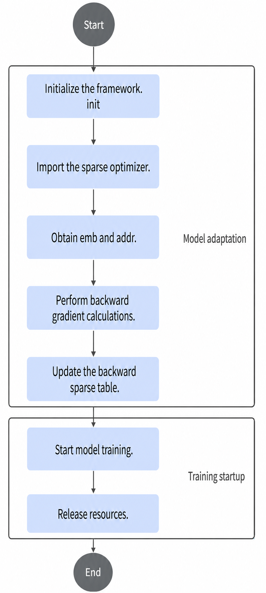
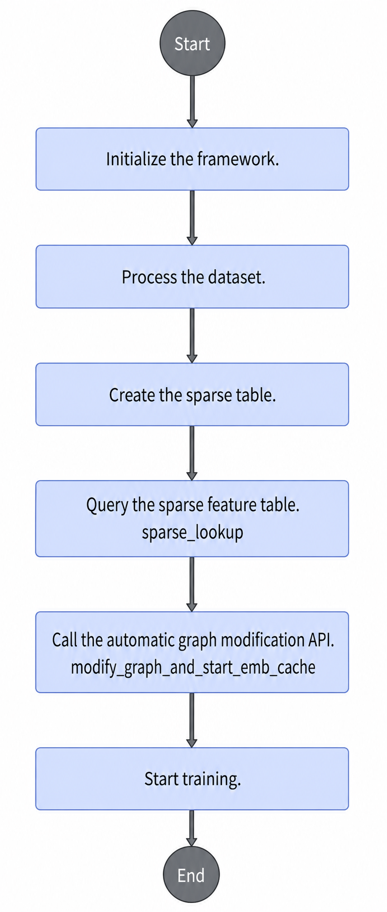
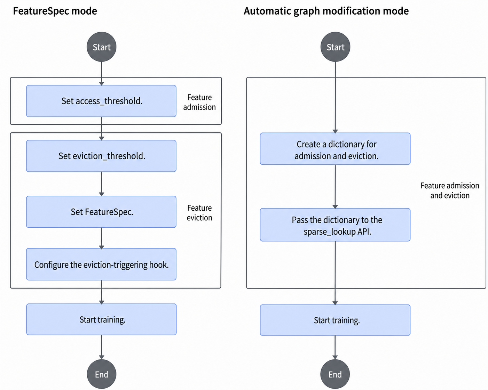

# Appendix

## Training Feature Process

### On-Chip Memory Dynamic Expansion Mode

TensorFlow accommodates embeddings through variables. You need to estimate the size of each table and then create variables through the [`create_table`](./api/model_apis.md#create_table) API. The size of the embedding table, once set, cannot be increased or reduced later. This may cause either a waste of NPU memory or insufficient space. In recommendation scenarios, the size of multiple sparse tables is difficult to estimate. To better adapt to user scenarios and requirements, this feature adds automatic expansion for sparse tables in on-chip memory. In other words, memory usage grows as model training progresses.

Feature eviction is not supported in on-chip memory dynamic expansion mode.

**Training Process Introduction**

This section describes how to train in dynamic expansion mode. For the overall process, see [Figure 1](#fig20224232242).

**Figure 1** Training process for on-chip memory dynamic expansion<a id="fig20224232242"></a>


The training process includes the following parts. For sample code for the full process, see [Sample Code](#section161606482568).

- [Adapting the Model](#section16648142213811)
- [Starting Training](#section198289221281)

**Adapting the Model<a id="section16648142213811"></a>**

The key steps are as follows:

1. Initialize the framework.

    Call the [`init`](./api/initialization_and_deinitialization_of_the_training_framework.md#init) API and set `use_dynamic_expansion = True` to enable dynamic expansion. The default value is `False`.

2. <a id="li91811185710"></a>Import the sparse optimizer.

    Call the `create_hash_optimizer_by_address` API of the corresponding optimizer in the `mx_rec.optimizers` package to create the sparse optimizer `sparse_optimizer`. The available optimizers are as follows:

    - [SGDByAddr](./api/optimizers_apis.md#sgdbyaddr)
    - [LazyAdamByAddress](./api/optimizers_apis.md#lazyadambyaddress)

3. <a id="li16991598571"></a>Obtain the embedding result (`emb`) and mapped address (`addr`).

    Use `tf.get_collection("ASCEND_SPARSE_LOOKUP_LOCAL_EMB")` to obtain the embedding result for training, and use `tf.get_collection("ASCEND_SPARSE_LOOKUP_ID_OFFSET")` to obtain the mapped address for training.

4. Perform backward gradient calculations.

    Use the `tf.gradients(loss, emb)` API to calculate the derivative of the embedding result obtained in [3](#li16991598571) to get the gradient (`grad`).

5. Update the backward sparse table.

    Use the sparse optimizer and import the `sparse_optimizer.apply_gradients([grad, addr])` API created in [Import the sparse optimizer](#li91811185710) to update the sparse table at the location corresponding to the mapping address.

**Starting Training<a id="section198289221281"></a>**

1. Start model training.
2. After model training finishes, call [`terminate_config_initializer`](./api/initialization_and_deinitialization_of_the_training_framework.md#terminate_config_initializer) to release resources.

**Sample Code<a id="section161606482568"></a>**

1. Initialize the framework.

    ```python
    use_dynamic_expansion = bool(int(os.getenv("USE_DYNAMIC_EXPANSION", 0)))
    init(use_mpi, train_steps=args.train_steps, eval_steps=args.eval_steps,
    use_dynamic_expansion=use_dynamic_expansion)
    ```

2. <a id="li91811185710"></a>Import the sparse optimizer.

    ```python
    def get_dense_and_sparse_optimizer(cfg):
        dense_optimizer = tf.compat.v1.train.AdamOptimizer(learning_rate=cfg.learning_rate)
        use_dynamic_expansion = get_use_dynamic_expansion()
        if use_dynamic_expansion:
            sparse_optimizer = create_hash_optimizer_by_address(learning_rate=cfg.learning_rate)
            logging.info("optimizer lazy_adam_by_addr")
        else:
            sparse_optimizer = create_hash_optimizer(learning_rate=cfg.learning_rate)
            logging.info("optimizer lazy_adam")
        return dense_optimizer, sparse_optimizer
    ```

3. Obtain the embedding result and mapped address.

    ```python
    train_emb_list = tf.compat.v1.get_collection(ASCEND_SPARSE_LOOKUP_LOCAL_EMB)
    train_address_list = tf.compat.v1.get_collection(ASCEND_SPARSE_LOOKUP_ID_OFFSET)
    ```

4. Perform backward gradient calculations.

    ```python
    local_grads = tf.gradients(loss, train_emb_list)  # local_embedding
    ```

5. Update the backward sparse table.

    ```python
    grads_and_vars = [(grad, address) for grad, address in zip(local_grads, train_address_list)]
    train_ops.append(sparse_optimizer.apply_gradients(grads_and_vars))
    ```

    >[!NOTE]
    >- When you call `sparse_optimizer.apply_gradients(grads_and_vars)` to apply gradients, if the `vars` values, such as `address`, are tensors rather than variables, make sure the dimension of `vars` matches the first dimension of `grads`.
    >- The `train_address_list` address list must be valid. Obtain it through [3. Obtain the mapped address](#li16991598571). If you use an invalid address, the runtime throws an AICore Error or a similar error.

### Dynamic Shapes

The Rec SDK TensorFlow training framework supports dynamic shapes. You can enable dynamic shapes by following the process below.

Before enabling the dynamic shape function, install the ops operator package. For details, see "Installing ops" in "Installing CANN" of the *CANN Software Installation Guide*.

**Process Introduction**

If you want to use dynamic shapes in the Rec SDK TensorFlow training framework, set the "use_dynamic" parameter of the [`init`](./api/initialization_and_deinitialization_of_the_training_framework.md#init) API to `True` when you initialize the framework.

**Sample Code**

```python
init(use_mpi, rank_id=rank_id, rank_size=rank_size, train_steps=train_steps, eval_steps=eval_steps, prefetch_batch_number=1, use_dynamic=True)
```

### Automatic Graph Modification

**Process Introduction**

This section describes how to train in automatic graph modification mode. For the overall process, see [Figure 1](#fig1066992151914).

**Figure 1** Process for automatic graph modification
<a id="fig1066992151914"></a>


The normal training process usually includes data processing, sparse table creation, lookup, and training startup. Automatic graph modification follows the same process, except that you only need to set the `modify_graph` parameter to `True` in the lookup API, and you must call the automatic graph modification API before training starts. The key steps are the lookup operation and the call to the automatic graph modification API.

**Key Steps**

1. Query the sparse feature table.

    Call the [`sparse_lookup`](./api/model_apis.md#sparse_lookup) API and set `modify_graph=True` to use the automatic graph modification mode during table lookup. The default value of this parameter is `False`.

2. Call the automatic graph modification API.

    The automatic graph modification API is [`modify_graph_and_start_emb_cache`](./api/data_apis.md#modify_graph_and_start_emb_cache), but the procedure differs between [Training with `tf.Session`](migration_and_training.md#training-with-tfsession) and [Training with Estimator](migration_and_training.md#training-with-estimator).

    1. Training with `tf.Session`

        In `tf.Session` training mode, you must explicitly call [modify_graph_and_start_emb_cache](./api/data_apis.md#modify_graph_and_start_emb_cache). You also need to change `sess.run(iterator.initializer)` to the dataset initialization interface for automatic graph modification, which is `sess.run(get_initializer(True))` (see [`get_initializer`](./api/automatic_graph_modification.md#get_initializer)) or `sess.run(get_initializer(False))`. The former is for training, and the latter is for evaluation.

    2. Training with NPUEstimator

        In the NPUEstimator mode, add [`GraphModifierHook`](./api/class_reference.md#graphmodifierhook) for automatic graph modification to multiple modes (`train`, `predict`, and `train_and_evaluate`) of NPUEstimator. For example, if the current mode is `train`, add `GraphModifierHook` to the training hook to complete training in automatic graph modification mode.

**Sample Code**

1. Query the sparse feature table.

    ```python
    from mx_rec.core.embedding import sparse_lookup

    embedding = sparse_lookup(hash_table, feature, send_count, dim=None, is_train=is_train,
                              access_and_evict_config=access_and_evict_config,
                              name=hash_table.table_name + "_lookup", modify_graph=True, batch=batch)
    ```

2. Call the graph modification API.
    1. Training with `tf.Session`

        ```python
        from mx_rec.util.initialize import get_initializer
        from mx_rec.graph.modifier import modify_graph_and_start_emb_cache

        if MODIFY_GRAPH_FLAG:
            logging.info("start to modifying graph")
            modify_graph_and_start_emb_cache(dump_graph=True)
        else:
            start_asc_pipeline()

        # train
        with tf.compat.v1.Session(config=sess_config()) as sess:
            if MODIFY_GRAPH_FLAG:
                sess.run(get_initializer(True))
            else:
                sess.run(train_iterator.initializer)

        # eval
        def evaluate():
            if MODIFY_GRAPH_FLAG:
                sess.run(get_initializer(False))
            else:
                sess.run(eval_iterator.initializer)
        ```

    2. Training with NPUEstimator

        ```python
        from mx_rec.graph.modifier import GraphModifierHook

        est.train(input_fn=lambda: input_fn(), hooks=[GraphModifierHook()])   # est is the created NPUEstimator object.
        ```

### Feature Admission and Eviction

**Process Introduction**

This section describes how to use feature admission and eviction for training. It covers FeatureSpec mode and automatic graph modification mode.

>[!NOTE]
>After you enable eviction, on-chip memory dynamic expansion is not supported.

**Figure 1** Process for feature admission and eviction


**Key Steps**

- In FeatureSpec mode, see [FeatureSpec](./api/class_reference.md#featurespec) for configuration.
- In automatic graph modification mode, see [Automatic Graph Modification](#Automatic Graph Modification) for configuration.
- The `USE_COMBINE_FAAE` environment variable controls whether merged-table statistics are counted.
- A CPU operator, [`set_threshold`](./api/other_apis.md#import_host_pipeline_ops), lets you change the admission threshold during training.

    >[!NOTE]
    >If the first input argument of `set_threshold` is 0, the corresponding embedding table switches to non-accumulation mode for features. In this mode, the admission threshold stays unchanged, but feature counts stop accumulating and use the historical value.

**Sample Code**

1. FeatureSpec mode.

    ```python
    feature_spec_list = [FeatureSpec("user_ids", feat_count=cfg.user_feat_cnt, table_name="user_table",
                                     access_threshold=access_threshold,
                                     eviction_threshold=eviction_threshold,
                                     faae_coefficient=1),
                         FeatureSpec("item_ids", feat_count=cfg.item_feat_cnt, table_name="item_table",
                                     access_threshold=access_threshold,
                                     eviction_threshold=eviction_threshold,
                                     faae_coefficient=4),
                         FeatureSpec("timestamp", is_timestamp=True)]
    ```

    ```python
    hook_evict = EvictHook(evict_enable=True, evict_time_interval=24*60*60, evict_step_interval=10000)
    ```

2. Automatic graph modification mode.

    ```python
    config_for_user_table = dict(access_threshold=cfg.access_threshold, eviction_threshold=cfg.eviction_threshold,
                                faae_coefficient=1)
    ```

    ```python
    embedding = sparse_lookup(hash_table, feature, send_count, dim=None, is_train=is_train,
                              access_and_evict_config=config_for_user_table ,
                              name=hash_table.table_name + "_lookup", modify_graph=modify_graph)
    hook_evict = EvictHook(evict_enable=True, evict_time_interval=24*60*60, evict_step_interval=10000)
    ```

3. Change the admission threshold.

    ```python
    from mx_rec.util.ops import import_host_pipeline_ops
    thres_tensor = tf.constant(60, dtype=tf.int32)
    set_threshold_op = import_host_pipeline_ops().set_threshold(thres_tensor,
                                            emb_name=self.table_list[0].table_name,
                                            ids_name=self.table_list[0].table_name + "_lookup")
    with tf.Session() as sess:
        sess.run(set_threshold_op)
    ```

### `Hot\_Embedding`

Hot_Embedding is enabled by default and does not require configuration.

**Sample Code**

This feature is enabled automatically and does not require configuration. To make sure it is enabled successfully, you need to enable the high-performance mode for the GatherV2 operator. Use the following method:

1. Pass the `op_impl_mode.ini` configuration item to `Session`. The code is as follows:

    ```python
    import tensorflow as tf
    session_config = tf.compat.v1.ConfigProto(allow_soft_placement=False, log_device_placement=False)
    session_config.gpu_options.allow_growth = True
    custom_op = session_config.graph_options.rewrite_options.custom_optimizers.add()
    # 1. Pass the operator configuration file path to the configuration item.
    custom_op.parameter_map["op_precision_mode"].s = tf.compat.as_bytes("op_impl_mode.ini")
    # 2. Build the graph.
    # 3. Pass the config to sess initialization.
    with tf.compat.v1.Session(config=sess_config) as sess:
    # 4. Train.
    ```

2. Create the `op_impl_mode.ini` file in the model path with the following content:

    ```bash
    GatherV2=high_performance
    ```

### Custom WarmStart

**Introduction**

If you want to use the custom WarmStart feature in the Rec SDK TensorFlow training framework, create a WarmStart configuration, `tf.estimator.WarmStartSettings`, before you create the NPUEstimator object in the model code. Then, pass that configuration to the `warm_start_from` parameter of NPUEstimator.

>[!NOTE]
>Customized WarmStart is only supported in on-chip memory and DDR modes under TensorFlow 1.15.0.

**Sample Code**

The following example shows how to use custom WarmStart:

Example 1: The model loads the sparse table `user_table` from the `warm_start` path.

```python
import tensorflow as tf
from tf_adapter import NPUEstimator

warm_settings=tf.estimator.WarmStartSettings(ckpt_to_initialize_from="./warm_start",vars_to_warm_start ="user_table", var_name_to_vocab_info=None, var_name_to_prev_var_name=None)
est = NPUEstimator(
        model_fn=get_model_fn(create_fs_params, cfg, access_and_evict),
        params=params,
        model_dir=params.model_dir,
        config=run_config,
        warm_start_from=warm_settings
)
```

**Table 1** Parameters for tf.estimator.WarmStartSettings

|Parameter|Type|Description|
|--|--|--|
|ckpt_to_initialize_from|str(path)|Specifies the checkpoint from which initialization starts.|
|vars_to_warm_start|str/regular expression/list[str]/list[variables]|Specifies the variables from which initialization starts. Dense-layer variables follow native TensorFlow behavior. Embedding parameters support regular expressions, a string of table name, and a list of table names.|
|var_name_to_vocab_info|dict|Specifies vocabulary information for restoring the embedding matrix.|
|var_name_to_prev_var_name|dict|Stores the mapping between variable names and the variable names in the WarmStart path. <div class="note"><span class="notetitle">Note</span><div class="notebody">Embedding table names do not currently support name mapping.</div></div>|

Example 2: The model loads all parameters from the `warm_start_1` path, then loads the Embedding tables `user_table` and `item_table` from the `warm_start_2` path and replaces the sparse table results that were already loaded from the `warm_start_1` path. The model loads the `mlp_layer_w` parameter from the `warm_start_3` path and replaces the result loaded from `warm_start_1`.

```python
import tensorflow as tf
from tf_adapter import NPUEstimator

ckpt_to_initialize_from_list = ["./warm_start_1", "./warm_start_2", "./warm_start_3"]
vars_to_warm_start_list=[".*",  ["user_table", "item_table"], "mlp_layer_w" ]
var_name_to_prev_var_name_list = [{}, {}, {}]
warm_settings=tf.estimator.WarmStartSettings(
        ckpt_to_initialize_from=ckpt_to_initialize_from_list,
        vars_to_warm_start = vars_to_warm_start_list,
        var_name_to_vocab_info=None,
        var_name_to_prev_var_name=var_name_to_prev_var_name_list )

 est = NPUEstimator(
        model_fn=get_model_fn(create_fs_params, cfg, access_and_evict),
        params=params,
        model_dir=params.model_dir,
        config=run_config,
        warm_start_from=warm_settings
    )
```

**Table 2** Parameters for tf.estimator.WarmStartSettings in the multi-path WarmStart feature

|Parameter|Type|Description|
|--|--|--|
|ckpt_to_initialize_from|List(str(path))|Type|
|vars_to_warm_start|List(str/regular expression/list[str]/list[variables])|Specifies the variables from which initialization starts.<br>Dense-layer variables follow native TensorFlow behavior. Embedding parameters support regular expressions, a string of table name, and a list of table names.|
|var_name_to_vocab_info|List(dict)|Specifies vocabulary information for restoring the embedding matrix.|
|var_name_to_prev_var_name|List(dict)|Stores the mapping between variable names and the variable names in the WarmStart path.<br>Name mapping for embedding tables is currently not supported.|

### Incremental Model Saving and Loading

**Introduction**

If you want to use the incremental model saving and loading feature in the Rec SDK TensorFlow training framework, set the following parameters when you initialize the framework with the [`init` API](./api/initialization_and_deinitialization_of_the_training_framework.md#init):

- `is_incremental_checkpoint=True`: enables incremental model saving and loading.
- `save_checkpoint_due_time=xx`: saves the full model every *xx* seconds.
- `save_delta_checkpoints_secs=xx`: saves the incremental model every *xx* seconds.
- `restore_model_version=xx`: specifies the model at the xx step to load. If you do not pass this parameter, the latest model is loaded. If you do not need to load a model, you can leave this parameter unset.

**Sample Code**

The following is an example:

```python
from mx_rec.util.initialize import init
# set init
init(train_steps=args.train_steps,
     eval_steps=args.eval_steps,
      save_steps=args.save_checkpoints_steps,
      max_steps=args.max_steps,
      use_dynamic=use_dynamic,
      use_dynamic_expansion=use_dynamic_expansion,
      save_checkpoint_due_time=4,
      save_delta_checkpoints_secs=2,
      is_incremental_checkpoint=True,
      restore_model_version=3)
```

## User Information List

Periodically update user passwords to avoid the risks caused by using the same password for a long time.

**Table 1** User list

|User|Description|Initial Password|Password Change Method|
|--|--|--|--|
|root|Used for deploying Rec SDK TensorFlow.|User-defined|Run the `passwd` command to change it.|
|HwHiAiUser|User for installing drivers and running the demo.|User-defined|Run the `passwd` command to change it.|

**Base Image Users in the Example Dockerfile on CentOS**

|User|Initial Password|Password Change Method|
|--|--|--|
|root|None|-|
|bin|None|-|
|daemon|None|-|
|adm|None|-|
|lp|None|-|
|sync|None|-|
|shutdown|None|-|
|halt|None|-|
|mail|None|-|
|operator|None|-|
|games|None|-|
|ftp|None|-|
|nobody|None|-|
|systemd-network|None|-|
|dbus|None|-|

**Users in the RecSDK-TensorFlow Component Container on CentOS**

|User|Description|Initial Password|Password Change Method|
|--|--|--|--|
|sshd|-|None|-|
