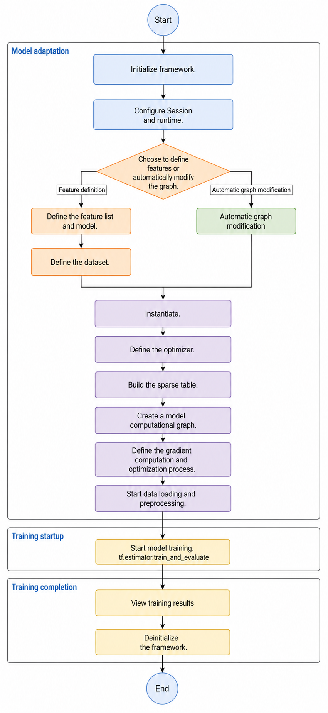
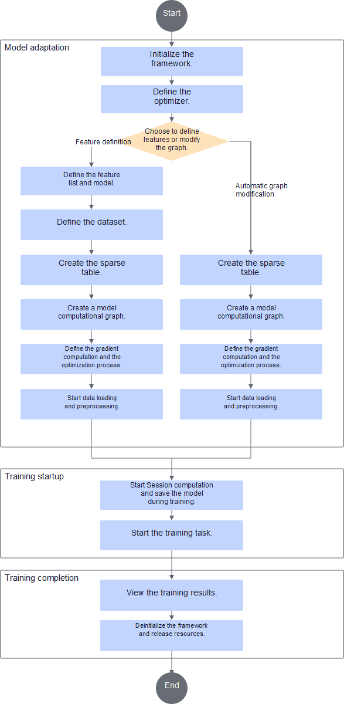

# Migration and Training

## Training Scenarios

**Introduction to Training Scenarios**

Rec SDK TensorFlow provides two training scenarios: `tf.Session` and NPUEstimator.

- `tf.Session` training scenario: Start model running by creating a new `Session` instance, which returns tensor examples for customized model training.
- NPUEstimator training scenario: Based on the encapsulation of control over different stages of machine learning, you do not need to repeatedly write training, evaluation, and prediction code for new machine learning tasks. You can focus on the control of the network structure.

> [!NOTE]
>
> - Rec SDK TensorFlow does not support Keras currently.
> - Rec SDK TensorFlow currently supports only the migration of model training scripts using TensorFlow native APIs. It does not support third-party frameworks (such as tf_adapter, HugeCTR, and DeepRec).
> - Rec SDK TensorFlow currently supports only the tf.data.Dataset format for model input data.
> - When large and small loops are enabled, the total number of training iterations must be an integer multiple of the small loop (that is, `iterations_per_loop`).

**Mapping Between TensorFlow and Rec SDK TensorFlow APIs**

During model migration, determine whether the sparse table APIs are used based on the actual model code and context. If a TensorFlow API is related to sparse tables, change it to the corresponding Rec SDK TensorFlow API as shown in [Table 1](#table16435142101913).

**Table 1** API mapping
<a id="table16435142101913"></a>

|TensorFlow API|Rec SDK TensorFlow API|Description|
|--|--|--|
|<li>MutableHashTable</li><li>tf.Variable</li>|create_table|Creates a sparse table.|
|<li>tf.embedding_lookup</li><li>mutable_hash_table.lookup (where mutable_hash_table is an instance of MutableHashTable), and so on</li>|sparse_lookup|Queries a sparse table.|

API examples:

- TensorFlow example

    ```bash
    import tensorflow as tf
    from tensorflow.contrib.lookup import MutableHashTable
    # .......
    user_id = features["user_ids"]
    user_emb_table = MutableHashTable(key_dtype=tf.int64, value_dtype=tf.float32, default_value=0.0)
    user_emb = user_emb_table.lookup(user_id)
    ```

- Rec SDK TensorFlow example

    ```bash
    import tensorflow as tf
    from mx_rec.core.embedding import create_table, sparse_lookup
    # .......
    user_emb_table = create_table(key_dtype=tf.int64, value_dtype=tf.float32, name="user_table", dim=tf.Tensorshape([1]),             emb_initializer=tf.compat.v1.truncated_normal_initializer(mean=10), device_vocabulary_size= 800000, host_vocabulary_size=0)
    user_emb = sparse_lookup(user_emb_table, feature_spec_list, batch_size*16, is_train=True, name=user_emb_table.table_name + "_lookup", modify_graph=False)
    ```

## Estimator Migration and Training

### Estimator Migration

If the original TensorFlow network is constructed based on the Estimator API, refer to this section for the manual migration process.

You are advised to use the model training samples provided by Rec SDK TensorFlow for adaptation. If you use open-source recommendation projects, direct API migration may cause compatibility issues.

**Estimator Overview**

As a high-level API of TensorFlow 1.10 released in 2018, Estimator greatly streamlines the programming process of machine learning. Estimator has many advantages, for example, good support for distribution, simplified model creation, and code sharing between model developers.

The process of developing a training script using Estimator is as follows:

1. Perform data preprocessing and create the input function `input_fn`.
2. Build the model and construct the model function `model_fn`.
3. Configure running, instantiate the Estimator, and pass a `RunConfig` object as a running parameter.
4. Perform training by calling the training method `Estimator.train()` on Estimator to train the model with specified inputs for a fixed number of steps.

The following describes how to migrate an Estimator training script for training on Ascend AI Processors.

**Adding Header Files**

For Python files modified in the following steps, add the following header file references to import NPU-related libraries.

```python
from npu_bridge.npu_init import *
```

> [!NOTE]
> After you import the preceding header file, the training script runs on the Ascend AI Processor by default.

**Data Preprocessing**

Generally, this part of code does not need to be modified. Adapt the code in the following scenario:

If the original network script uses `dataset.batch(batch_size)` to return a dynamic shape, the number of remaining samples in the data stream may be smaller than the batch size. This makes the shape of the last step inconsistent with preceding shapes, triggering the dynamic shape compilation process. To improve compilation performance, set `drop_remainder` to `True` to discard the last few samples in the file and ensure consistent shapes for every step in the network.

```bash
  dataset = dataset.batch(batch_size, drop_remainder=True)
```

Note: During inference, if the amount of inference data in the last iteration is smaller than the batch size, you must pad the data to the batch size. This is because some scripts include an assertion at the end to verify that the number of results matches the number of validation data.

```bash
 assert num_written_lines == num_actual_predict_examples
```

**Model Construction**

Generally, this part of code does not need to be modified. Adapt the code in the following scenario:

- For `dropout` in the original network, you are advised to replace it with the corresponding CANN API implementation for better performance, while paying attention to the impact on network accuracy.
    - If `tf.nn.dropout` exists, you are advised to change it to:

        ```bash
        layers = npu_ops.dropout()
        ```

    - If `tf.layers.dropout`, `tf.layers.Dropout`, `tf.keras.layers.Dropout`, `tf.keras.layers.SpatialDropout1D`, `tf.keras.layers.SpatialDropout2D`, or `tf.keras.layers.SpatialDropout3D` exists, add the following header file reference:

        ```bash
        from npu_bridge.estimator.npu import npu_convert_dropout
        ```

- For `gelu` in the original network, you are advised to replace it with the corresponding CANN API implementation for better performance.

    Original TensorFlow code:

    ```bash
    def gelu(x):
      cdf = 0.5 * (1.0 + tf.tanh(
         (np.sqrt(2 / np.pi) * (x + 0.044715 * tf.pow(x, 3)))))
      return x*cdf
    layers = gelu()
    ```

    Migrated code:

    ```bash
    layers = npu_unary_ops.gelu(x)
    ```

**Running Configuration**

TensorFlow configures running parameters through `RunConfig`. You need to migrate `RunConfig` to `NPURunConfig`. Since the `NPURunConfig` class inherits from the `RunConfig` class, you can modify the script as follows. Most parameters can remain unchanged.

Original TensorFlow code:

```bash
config=tf.estimator.RunConfig(
  model_dir=FLAGS.model_dir,
  save_checkpoints_steps=FLAGS.save_checkpoints_steps,
  session_config=tf.ConfigProto(allow_soft_placement=True, log_device_placement=False))
```

Migrated code:

```bash
npu_config=NPURunConfig(
  model_dir=FLAGS.model_dir,
  save_checkpoints_steps=FLAGS.save_checkpoints_steps,
  # If code related to tf.device is used in the original network, add the session configuration "allow_soft_placement=True" to allow TensorFlow to automatically allocate devices.
  session_config=tf.ConfigProto(allow_soft_placement=True, log_device_placement=False)
  )
```

However, some parameters (including `train_distribute`, `device_fn`, `protocol`, `eval_distribute`, and `experimental_distribute`) are not supported in `NPURunConfig`. If they are used in the original script, delete them.

If code related to `tf.device` is used in the original network, add the session configuration `allow_soft_placement=True` to allow TensorFlow to automatically allocate devices.

Additionally, some parameters are added to `NPURunConfig` to improve training performance and accuracy, such as `iterations_per_loop` and `precision_mode`. For detailed parameter information, see "NPURunConfig Constructor" in *TensorFlow Adapter API (1.x)*.

**Creating an Estimator Object**

You need to migrate the TensorFlow Estimator object to `NPUEstimator`. Since the `NPUEstimator` class inherits from the `Estimator` class, you can directory change the API as follows during migration, and the parameters can remain unchanged.

Original TensorFlow code:

```bash
mnist_classifier=tf.estimator.Estimator(
  model_fn=cnn_model_fn,
  config=config,
  model_dir="/tmp/mnist_convnet_model")
```

Migrated code:

```bash
mnist_classifier=NPUEstimator(
  model_fn=cnn_model_fn,
  config=npu_config,
  model_dir="/tmp/mnist_convnet_model"
  )
```

**Performing Training**

Train the model with specified inputs. This part of code does not need to be modified.

```bash
mnist_classifier.train(
  input_fn=train_input_fn,
  steps=20000,
  hooks=[logging_hook])
```

> [!NOTE]
> If an error occurs during migration and training, see the [FAQ](faq.md) or contact technical support.

### Training with Estimator

#### Estimator Scenario Description

Estimator encapsulates control over different stages of machine learning, so you do not need to repeatedly write training, evaluation, and prediction code for new machine learning tasks. You can focus on the control of the network structure. `NPUEstimator` is an encapsulation based on Estimator and supports model training on Ascend devices.

**Training Process Introduction**

This section describes how to use `NPUEstimator` for model training. For the overall operation process, see [Figure 1](#fig91589560296).

**Figure 1** NPUEstimator training process<a id="fig91589560296"></a>


#### Adapting the Model

You need to adapt the model to be used and can add functional features provided by Rec SDK TensorFlow during the adaptation process. This section introduces key steps in model adaptation and how to add desired functional features.

> [!NOTE]
> Functional features can be used in combination. You need to modify and adapt them in the corresponding key steps. To view the calling process of a single functional feature, see [Training Feature Process](appendix.md#training-feature-process).
> Feature eviction and the on-chip memory dynamic expansion mode cannot be enabled at the same time.

The key steps are as follows:

1. Initialize the framework.

     Call the [init](api/initialization_and_deinitialization_of_the_training_framework.md#init) API to initialize the Rec SDK TensorFlow model training framework.

     To add functional features, select the desired features in this step and make corresponding modifications.

     **Table 1** Functional features

     |Feature|Operation|
     |--|--|
     |Dynamic expansion|Set `use_dynamic_expansion = True` to enable the on-chip memory dynamic expansion function. The value is `False` by default. The DDR and SSD modes support only dynamic expansion on the memory/drive side.|
     |Dynamic shape|Set `use_dynamic = True` for the [init](api/initialization_and_deinitialization_of_the_training_framework.md#init) API. Before enabling the dynamic shape function, install the ops operator package. For details, see "Installing ops" in "Installing CANN" of the *CANN Software Installation Guide*.|
     |Automatic graph modification|-|
     |Feature admission and eviction|-|

2. Choose to [define features](#li11146823142217) or [automatically modify the graph](#li0861185612173).
     <ul><li><a id="li11146823142217"></a>Define the feature list and model.

     Use [`FeatureSpec`](./api/class_reference.md#featurespec) to define the feature list and configure the corresponding model.

     To add functional features, select the desired features in this step and make corresponding modifications.

     **Table 2** Functional features

     |Feature|Operation|
     |--|--|
     |Dynamic expansion|-|
     |Dynamic shape|-|
     |Feature admission and eviction|<ol><li>To enable the admission function, set the admission threshold `access_threshold` to a value greater than or equal to 0 (unit: times). A parameter error will be reported if the threshold is less than -1. </li><li>To enable the eviction function, perform the following steps: <ul><li>Set the eviction threshold `eviction_threshold` to a value greater than or equal to 0 (unit: seconds). A parameter error will be reported if the threshold is less than -1. </li><li>Set `FeatureSpec` with `index_key` as `timestamp` and the parameter `is_timestamp=True`, indicating that the dataset contains timestamps. </li><li>Use the `EvictHook` API to set a hook for the eviction trigger. This API has three parameters: `evict_enable=True`, `evict_time_interval=24 * 60 * 60`, and `evict_step_interval=10000`, representing the eviction function switch, eviction trigger time interval (unit: seconds), and global step interval, respectively. You can choose either `evict_time_interval` or `evict_step_interval`. </li></ul></li><li>The feature eviction hook is used only in training mode.</li></ol>|

     </li>

     <li><a id="li0861185612173"></a>Automatic graph modification

     In the NPUEstimator mode, add [`GraphModifierHook`](./api/class_reference.md#graphmodifierhook) for automatic graph modification to multiple modes (`train`, `predict`, and `train_and_evaluate`) of NPUEstimator. For example, if the current mode is `train`, add `GraphModifierHook` to the training hook to complete training in automatic graph modification mode.

     To add functional features, select the desired features and make corresponding modifications.

     **Table 3** Functional features

     |Feature|Operation|
     |--|--|
     |Dynamic expansion|-|
     |Dynamic shape|-|
     |Feature admission and eviction|When using the [`sparse_lookup`](./api/model_apis.md#sparse_lookup) API, set the `access_and_evict_config` parameter, which is of the dictionary type. The dictionary consists of two key-value pairs. The **keys** are `access_threshold` and `eviction_threshold`, and the **values** are the corresponding thresholds.|

     </li></ul>

3. Define the dataset. Skip this step if you choose the automatic graph modification mode.

     When using `FeatureSpec` to define the feature list, create a dataset based on the feature list and perform preprocessing. Call the [`get_asc_insert_func`](./api/data_apis.md#get_asc_insert_func) API to obtain the Rec SDK TensorFlow data preprocessing interface and apply it to the dataset.

4. Define the optimizer.

     Select an optimizer under `mx_rec.optimizers` and call the corresponding API to obtain the optimizer object for the sparse network layer. For currently available optimizers, see [Optimizers](./api/optimizers_apis.md). For the optimization interface of the dense network layer, use the TensorFlow built-in optimizer.

     To add functional features, select the desired features in this step and make corresponding modifications.

     **Table 4** Functional features

     |Feature|Operation|
     |--|--|
     |Dynamic expansion|For dynamic expansion on the on-chip memory side, call the `create_hash_optimizer_by_address` API of the corresponding optimizer in the `mx_rec.optimizers` package to create `sparse_optimizer` for sparse tables. Available optimizers are:<ul><li>[SGDByAddr](./api/optimizers_apis.md#sgdbyaddr)</li><li>[LazyAdamByAddress](./api/optimizers_apis.md#lazyadambyaddress)</li></ul>|
     |Dynamic shape|-|
     |Automatic graph modification|-|
     |Feature admission and eviction|-|

5. Create a sparse table.

     Call the [`create_table`](./api/model_apis.md#create_table) API to create a sparse network layer. You can create a sparse network layer for each sparse feature.

     > [!NOTE]
     > In the Estimator mode, the `create_table` API must be called inside the `model_fn` passed to the Estimator. The Estimator source code creates a new graph instance when calling `model_fn`, which is different from the default graph where the entry function main is located.

6. Pass the sparse network layer and feature list to create the model computational graph. Call [`sparse_lookup`](./api/model_apis.md#sparse_lookup) in the computational graph for feature lookup and error calculation.

     **Table 5** Functional features

     |Feature|Operation|
     |--|--|
     |Dynamic expansion|-|
     |Dynamic shape|-|
     |Automatic graph modification|Query the sparse feature table. Call the [`sparse_lookup`](./api/model_apis.md#sparse_lookup) API and set `modify_graph=True` to use the automatic graph modification mode during table lookup. The default value of this parameter is `False`.|
     |Feature admission and eviction|-|

7. Define gradient calculation and the optimization process.

     Call the [`get_dense_and_sparse_variable`](./api/model_apis.md#get_dense_and_sparse_variable) interface to obtain parameters for the dense and sparse network layers. Calculate gradients and perform optimization through the optimizer.

     To add functional features, select the desired features in this step and make corresponding modifications.

     **Table 6** Functional features

     |Feature|Operation|
     |--|--|
     |Dynamic expansion|Dynamic expansion on the on-chip memory side: <ol><li>Obtain the embedding result (`emb`) and mapping address (`addr`). <ul><li>Use the `tf.get_collection("ASCEND_SPARSE_LOOKUP_LOCAL_EMB")` API to obtain the embedding result for training.</li><li>Use the `tf.get_collection("ASCEND_SPARSE_LOOKUP_ID_OFFSET")` API to obtain the mapping address for training. </li></ul></li><li>Perform backward gradient calculation. Use the `tf.gradients(loss, emb)` API to calculate the derivative of the embedding result obtained in the preceding step to get the gradient (`grad`). </li><li>Update the backward sparse table. Use the sparse optimizer and import the created `sparse_optimizer.apply_gradients([grad, addr])` API to update the sparse table at the location corresponding to the mapping address.</li></ol>|
     |Dynamic shape|-|
     |Automatic graph modification|-|
     |Feature admission and eviction|-|

8. Start data loading and preprocessing. Skip this step if you choose the [automatic graph modification](#li0861185612173) mode.

     When using `FeatureSpec` to define the feature list, call [`start_asc_pipeline`](./api/data_apis.md#start_asc_pipeline) to start the data pipeline.

#### Starting Training

Call `tf.estimator.train_and_evaluate` to start model training.

See **Performing Training** in the [Estimator Migration](#estimator-migration) section.

> [!NOTE]
> When performing `train_and_evaluate` in the Estimator scenario, if dynamic expansion on the on-chip memory side is not enabled, tables will be created twice. If a table is very large, accelerator memory may be insufficient. In this case, use the on-chip memory dynamic expansion mode, as the expansion mode creates the table only once.

#### Completing Training and Viewing Results

The key steps are as follows:

1. View the training results.
    - To export sparse table data in .npy format, call the [`export`](./api/model_apis.md#export) API.
    - To export a .pb model file, call the `export_saved_model` API of the Estimator. The example is as follows:

        ```bash
        import os
        import tensorflow as tf
        if tf.__version__.startswith("1"):
            from npu_bridge.npu_init import NPURunConfig, NPUEstimator
        else:
            from npu_device.compat.v1.npu_init import NPURunConfig, NPUEstimator
        # See "Running Configuration" and "Creating an Estimator Object" in the Estimator Migration section.
        run_config = NPURunConfig(...)
        est = NPUEstimator(...)
        # Generally, the export_saved_model API is called after train or train_and_evaluate.
        def _serving_input_fn():
            # Adjust the configuration based on the specific service model. The following uses the input of the little demo estimator model as an example.
            inputs = {
                "user_ids": tf.compat.v1.placeholder(shape=(None, 32), dtype=tf.int64, name="user_ids"),
                "item_ids": tf.compat.v1.placeholder(shape=(None, 8), dtype=tf.int64, name="item_ids"),
                "label_0": tf.compat.v1.placeholder(shape=(None,), dtype=tf.float32, name="label_0"),
                "label_1": tf.compat.v1.placeholder(shape=(None,), dtype=tf.float32, name="label_1"),
            }
            return tf.estimator.export.ServingInputReceiver(features=inputs, receiver_tensors=inputs)
        target_pb_path = os.path.abspath("pb_model_path")
        # Call the export_saved_model API of the estimator to save the .pb file.
        export_path = est.export_saved_model(target_pb_path, _serving_input_fn).decode("utf-8")
        print(f"The export saved model path is {export_path}.")
        ```

2. Call the [`terminate_config_initializer`](./api/initialization_and_deinitialization_of_the_training_framework.md#terminate_config_initializer) API to close the data stream and release resources.

## `sess.run` Migration and Training

### `sess.run` Migration

If the original TensorFlow network is constructed based on the `sess.run` API, refer to this section for the manual migration process.

You are advised to use the model training samples provided by Rec SDK TensorFlow for adaptation. If you use open-source recommendation projects, direct API migration may cause compatibility issues.

**`sess.run` Overview**

As a low-level API of TensorFlow, `sess.run` appears more flexible than Estimator. On the flip side, using it for model implementation could be complex.

The process of developing a training script using `sess.run` is as follows:

1. [Data preprocessing](#section3602537142311)
2. [Model construction, loss calculation, and gradient update](#section177071912713)
3. [Creating a session and initializing resources](#section19387465248)
4. [Performing training](#section20549115411413)

The following describes how to migrate a `sess.run` training script for training on Ascend AI Processors.

**Adding Header Files**

For Python files modified in the following steps, add the following header file references to import NPU-related libraries.

```python
from npu_bridge.npu_init import *
```

> [!NOTE]
> After you import the preceding header file, the training script runs on the Ascend AI Processor by default.

**Data Preprocessing<a id="section3602537142311"></a>**

Generally, this part of code does not need to be modified. Adapt the code in the following scenario:

If the original network script uses `dataset.batch(batch_size)` to return a dynamic shape, the number of remaining samples in the data stream may be smaller than the batch size. This makes the shape of the last step inconsistent with preceding shapes, triggering the dynamic shape compilation process. To improve compilation performance, set `drop_remainder` to `True` to discard the last few samples in the file and ensure consistent shapes for every step in the network.

```bash
  dataset = dataset.batch(batch_size, drop_remainder=True)
```

Note: During inference, if the amount of inference data in the last iteration is smaller than the batch size, you must pad the data to the batch size. This is because some scripts include an assertion at the end to verify that the number of results matches the number of validation data.

```bash
 assert num_written_lines == num_actual_predict_examples
```

**Model Construction, Loss Calculation, and Gradient Update<a id="section177071912713"></a>**

Generally, this part of code does not need to be modified. Adapt the code in the following scenario:

- For `dropout` in the original network, replace it with the corresponding CANN API implementation for better performance, while paying attention to the impact on network accuracy.
    - If `tf.nn.dropout` exists, change it to:

        ```python
        layers = npu_ops.dropout()
        ```

    - If `tf.layers.dropout`, `tf.layers.Dropout`, `tf.keras.layers.Dropout`, `tf.keras.layers.SpatialDropout1D`, `tf.keras.layers.SpatialDropout2D`, or `tf.keras.layers.SpatialDropout3D` exists, add the following header file reference:

        ```bash
        from npu_bridge.estimator.npu import npu_convert_dropout
        ```

- For `gelu` in the original network, replace it with the corresponding CANN API implementation for better performance.

    Original TensorFlow code:

    ```bash
    def gelu(x):
      cdf = 0.5 * (1.0 + tf.tanh(
         (np.sqrt(2 / np.pi) * (x + 0.044715 * tf.pow(x, 3)))))
      return x*cdf
    layers = gelu()
    ```

    Migrated code:

    ```python
    layers = npu_unary_ops.gelu(x)
    ```

**Creating a Session and Initializing Resources<a id="section19387465248"></a>**

When you run a training script on the Ascend AI Processor in `sess.run` mode, note the following configurations:

- The following configuration is disabled by default and should remain disabled:

    `rewrite_options.disable_model_pruning`

- The following configurations are enabled by default and should remain enabled:
    - `rewrite_options.function_optimization`
    - `rewrite_options.constant_folding`
    - `rewrite_options.shape_optimization`
    - `rewrite_options.arithmetic_optimization`
    - `rewrite_options.loop_optimization`
    - `rewrite_options.dependency_optimization`
    - `rewrite_options.layout_optimizer`

- The following configuration is enabled by default and should be disabled explicitly:
    - `rewrite_options.remapping`
    - `rewrite_options.memory_optimization`

- If code related to `tf.device` is used in the original network, add the session configuration `allow_soft_placement=True` to allow TensorFlow to automatically allocate devices.

Original TensorFlow code:

```bash
#Construct an iterator.
iterator=Iterator.from_structure(train_dataset.output_types, train_dataset.output_shapes)

#Obtain the batch data.
next_batch=iterator.get_next()

#Initialize the iterator.
training_init_op=iterator.make_initializer(train_dataset)

#Initialize the variables.
init=tf.global_variables_initializer()
sess=tf.Session()
sess.run(init)

#Get the number of training/validation steps per epoch
train_batches_per_epoch=int(np.floor(train_size/batch_size))
```

Migrated code:

```bash
#Construct an iterator.
iterator=Iterator.from_structure(train_dataset.output_types, train_dataset.output_shapes)

#Obtain the batch data.
next_batch=iterator.get_next()

#Initialize the iterator.
training_init_op=iterator.make_initializer(train_dataset)

#Initialize the variables.
init=tf.global_variables_initializer()

#Create a session. If code related to tf.device is used in the original network, add the session configuration "allow_soft_placement=True" to allow TensorFlow to automatically allocate devices.
config = tf.ConfigProto(allow_soft_placement=True)
custom_op = config.graph_options.rewrite_options.custom_optimizers.add()
custom_op.name = "NpuOptimizer"
# You must explicitly disable the remapping and memory_optimization functions of TensorFlow to avoid conflicts with functions in the NPU.
config.graph_options.rewrite_options.remapping = RewriterConfig.OFF  # Explicitly disable.
config.graph_options.rewrite_options.memory_optimization = RewriterConfig.OFF  # Explicitly disable.
sess = tf.Session(config=config)
sess.run(init)

#Get the number of training/validation steps per epoch
train_batches_per_epoch=int(np.floor(train_size/batch_size))
```

All native `tf.Session` functions are supported on the Ascend platform.

Additionally, the Ascend platform supports functions such as automatic mixed precision. To enable these functions, see "Session Configuration" in the *TF Adapter API (1.x)*.

**Performing Training<a id="section20549115411413"></a>**

This part of the code does not need modification. For example:

```bash
#Start loop iterations.
for epoch in range(num_epochs):
  ##Initialize the iterator with the training dataset.
  sess.run(training_init_op)
  for step in range(train_batches_per_epoch):
    #Get the next batch of data.
    img_batch,label_batch=sess.run(next_batch)
    #Run the training operation.
    _,train_loss = sess.run([train_op, loss],feed_dict={x:img_batch, y_:label_batch, is_training:True})
```

After the session object created by `tf.Session` is used, you must explicitly call `session.close()` or use the with statement to create the session (which calls `close()` automatically through the context). See the following examples:

Example 1: Explicitly call `sess.close()`.

```bash
sess = tf.Session(config=config)
sess.run(...)
sess.close()
```

Example 2: Use `with` to create a session.

```bash
with tf.Session(config=config) as sess:
    sess.run(...)
```

> [!NOTE]
>
> If an error occurs during migration and training, see the [FAQ](faq.md) or contact technical support.

### Training with `tf.Session`

#### `sess.run` Scenario Description

You need to define placeholders, variables, and operators to form a complete computational graph. Start the model running with a new `Session` instance. The `Session` instance will execute the graph in a distributed manner, input data, update variables based on the optimization algorithm, and return execution results, that is, tensor instances. Model training with `tf.Session` is more customizable, and you can adapt and modify it based on the training method used by the model.

**Training Process Introduction**

**Figure 1** tf.Session training process


#### Adapting the Model

You need to adapt the model to be used and can add functional features provided by Rec SDK TensorFlow during the adaptation process. This section introduces key steps in model adaptation and how to add desired functional features.

> [!NOTE]
> Functional features can be used in combination. You need to modify and adapt them in the corresponding key steps. To view the calling process of a single functional feature, see [Training Feature Process](appendix.md#training-feature-process).
>Feature eviction and the on-chip memory dynamic expansion mode cannot be enabled at the same time.

The key steps are as follows:

1. Initialize the framework.

    Call the [init](./api/initialization_and_deinitialization_of_the_training_framework.md#init) API to initialize the Rec SDK TensorFlow model training framework.

    To add functional features, select the desired features in this step and make corresponding modifications.

    **Table 1** Functional features

    |Feature|Operation|
    |--|--|
    |Dynamic expansion|Set `use_dynamic_expansion = True` to enable the on-chip memory dynamic expansion function. The value is `False` by default. The DDR and SSD modes support only dynamic expansion on the memory/drive side.|
    |Dynamic shape|Set `use_dynamic = True` for the [init](./api/initialization_and_deinitialization_of_the_training_framework.md#init) API. Before enabling the dynamic shape function, install the ops operator package. For details, see "Installing ops" in "Installing CANN" of the *CANN Software Installation Guide*.|
    |Automatic graph modification|-|
    |Feature admission and eviction|-|

2. Define the optimizer.

    Select an optimizer under `mx_rec.optimizers` and call the corresponding API to obtain the optimizer object for the sparse network layer. For currently available optimizers, see [Optimizers](./api/optimizers_apis.md). For the optimization interface of the dense network layer, use the TensorFlow built-in optimizer.

    To add functional features, select the desired features in this step and make corresponding modifications.

    **Table 2** Functional features

    |Feature|Operation|
    |--|--|
    |Dynamic expansion|For dynamic expansion on the on-chip memory side, call the `create_hash_optimizer_by_address` API of the corresponding optimizer in the `mx_rec.optimizers` package to create `sparse_optimizer` for sparse tables. Available optimizers are:<ul><li>[SGDByAddr](./api/optimizers_apis.md#sgdbyaddr)</li><li>[LazyAdamByAddress](./api/optimizers_apis.md#lazyadambyaddress)</li></ul>|
    |Dynamic shape|-|
    |Automatic graph modification|-|
    |Feature admission and eviction|-|

3. Choose to define features or automatically modify the graph.
    - Define a feature list and model.

        Use [`FeatureSpec`](./api/class_reference.md#featurespec) to define the feature list and configure the corresponding model.

        To add functional features, select the desired features in this step and make corresponding modifications.

        **Table 3** Functional features

        |Feature|Operation|
        |--|--|
        |Dynamic expansion|-|
        |Dynamic shape|-|
        |Feature admission and eviction|In FeatureSpec mode, see [FeatureSpec](./api/class_reference.md#featurespec) for configuration. <ol><li>To enable the admission function, set the admission threshold `access_threshold` to a value greater than or equal to 0 (unit: times). A parameter error will be reported if the threshold is less than -1. </li><li>To enable the eviction function, perform the following steps: <ol><li>Set the eviction threshold `eviction_threshold` to a value greater than or equal to 0 (unit: seconds). A parameter error will be reported if the threshold is less than -1. </li><li>Set `FeatureSpec` with `index_key` as `timestamp` and the parameter `is_timestamp=True`, indicating that the dataset contains timestamps. </li><li>Use the `EvictHook` API to set a hook for the eviction trigger. This API has three parameters: `evict_enable=True`, `evict_time_interval=24 * 60 * 60`, and `evict_step_interval=10000`, representing the eviction function switch, eviction trigger time interval (unit: seconds), and global step interval, respectively. You can choose either `evict_time_interval` or `evict_step_interval`. </li></ol></li><li>The feature eviction hook is used only in training mode.</li></ol>|

    - Automatic graph modification

        Skip this step if you choose the automatic graph modification mode.

4. Define the dataset. Skip this step if you choose the automatic graph modification mode.

    When using `FeatureSpec` to define the feature list, create a dataset based on the feature list and perform preprocessing. Call the [`get_asc_insert_func`](./api/data_apis.md#get_asc_insert_func) API to obtain the Rec SDK TensorFlow data preprocessing interface and apply it to the dataset.

5. Create a sparse table.

    Call the [`create_table`](./api/model_apis.md#create_table) API to create a sparse network layer. You can create a sparse network layer for each sparse feature.

6. Create a model computational graph.

    Pass the sparse network layer and feature list to create the model computational graph. Call [`sparse_lookup`](./api/model_apis.md#sparse_lookup) in the computational graph for feature lookup and error calculation.

    To add functional features, select the desired features in this step and make corresponding modifications.

    **Table 4** Functional features

    |Feature|Operation|
    |--|--|
    |Dynamic expansion|-|
    |Dynamic shape|-|
    |Automatic graph modification|When querying a sparse feature table, call the [`sparse_lookup`](./api/model_apis.md#sparse_lookup) API and set `modify_graph=True` to use the automatic graph modification mode during table lookup. The default value of this parameter is `False`.|
    |Feature admission and eviction|In automatic graph modification mode, when using the [`sparse_lookup`](./api/model_apis.md#sparse_lookup) API, set the `access_and_evict_config` parameter, which is of the dictionary type. The dictionary consists of two key-value pairs. The **keys** are `access_threshold` and `eviction_threshold`, and the **values** are the corresponding thresholds.|

7. Define gradient calculation and the optimization process.

    Call the [`get_dense_and_sparse_variable`](./api/model_apis.md#get_dense_and_sparse_variable) interface to obtain parameters for the dense and sparse network layers. Calculate gradients and perform optimization through the optimizer.

    To add functional features, select the desired features in this step and make corresponding modifications.

    **Table 5** Functional features

    |Feature|Operation|
    |--|--|
    |Dynamic expansion|Dynamic expansion on the on-chip memory side: <ol><li><a name="li16991598571"></a>Obtain the embedding result (`emb`) and mapping address (`addr`). <ul><li>Use the `tf.get_collection("ASCEND_SPARSE_LOOKUP_LOCAL_EMB")` API to obtain the embedding result for training. </li><li>Use the `tf.get_collection("ASCEND_SPARSE_LOOKUP_ID_OFFSET")` API to obtain the mapping address for training. </li></ul></li><li>Perform backward gradient calculation. Use the `tf.gradients(loss, emb)` API to calculate the derivative of the embedding result obtained in [1](#li16991598571) to get the gradient (`grad`). </li><li>Update the backward sparse table. Use the sparse optimizer and import the created `sparse_optimizer.apply_gradients([grad, addr])` API to update the sparse table at the location corresponding to the mapping address.</li></ol>|
    |Dynamic shape|-|
    |Automatic graph modification|-|
    |Feature admission and eviction|-|

8. Start data loading and preprocessing.
    - FeatureSpec mode

        Call [`start_asc_pipeline`](./api/data_apis.md#start_asc_pipeline) to start the data pipeline.

    - Automatic graph modification mode

        Call [modify_graph_and_start_emb_cache](./api/data_apis.md#modify_graph_and_start_emb_cache). Additionally, `sess.run(iterator.initializer)` must be changed to the dataset initialization API for automatic graph modification, that is, `sess.run([get_initializer](./api/automatic_graph_modification.md#get_initializer)(True))` or `sess.run(get_initializer(False))`. The former is used for training and the latter for evaluation.

#### Starting Training

The key steps are as follows:

1. Define `Saver` for saving and loading models during training. Start `Session` calculation and save ([`tf.compat.v1.train.Saver.save`](./api/tensorflow_apis.md#tfcompatv1trainsaversave)) or load ([`tf.compat.v1.train.Saver.restore`](./api/tensorflow_apis.md#tfcompatv1trainsaverrestore)) models during training.
2. Start the training task. Start the training task. See [Single-Node Single-Card and Single-Node Multi-Card Training](quick_start.md#single-node-single-card-and-single-node-multi-card-training).

#### Completing Training and Viewing Results

The key steps are as follows:

1. View the training results.
2. Call the [`terminate_config_initializer`](./api/initialization_and_deinitialization_of_the_training_framework.md#terminate_config_initializer) API to close the data stream and release resources.

> [!NOTE]
> To convert an NPU format model saved based on Rec SDK TensorFlow into a model that can be loaded and used by the GPU and CPU, see the [model conversion tool instructions](https://gitcode.com/Ascend/RecSDK/blob/develop_examples_and_tools/reference-tools/model_convert/README.md).

## Distributed Training Script Migration

### Data Parallelism Support (AllReduce)

AllReduce is a mainstream data parallelism architecture where each node works collaboratively based on algorithms. It is suitable for scenarios with high training power requirements and large scale of devices. This section describes how to perform distributed training of a TensorFlow training script on the Ascend AI Processor using the AllReduce architecture.

**Implementation Principle of AllReduce**

In large-scale AI training clusters, data parallelism is usually used for training. In data parallelism, each device uses the same model but different training samples. Gradient data calculated by each device must be aggregated before parameter updates.

**Figure 1** Data parallelism training


Mainstream implementations of data parallelism include the **parameter server-worker (PS-worker) architecture** and the **AllReduce architecture** based on gradient aggregation methods. In the **AllReduce architecture**, each device participating in training forms a ring, and there is no central node to aggregate all calculated gradients. The AllReduce algorithm places participating devices in a logical ring. Each device receives data from the upstream device and sends data to the downstream device, fully utilizing the upstream and downstream bandwidth of each device.

The AllReduce architecture is an improved architecture proposed to solve the linear scaling issue of the PS-worker architecture. Each node works collaboratively according to an algorithm designed to reduce the volume of transmitted data and make full use of hardware communication bandwidth. It is generally suitable for scenarios with high training power requirements and large scale of devices. The following figure shows the implementation of the AllReduce architecture.

**Figure 2** AllReduce mode<a id="fig1321114115499"></a>


The Ring algorithm (called Ring-AllReduce) is used to introduce the Allreduce mode. As shown in [Figure 2](#fig1321114115499), in the Ring-AllReduce architecture, each device is a worker and forms a ring without a central node to aggregate gradients calculated by all workers. During an iteration, each worker completes the forward calculation and backward calculation of a mini-batch sample data to obtain gradient data, and then uses the Ring-AllReduce algorithm to synchronize gradient data. The Ring-AllReduce algorithm includes Scatter-Reduce and AllGather. Gradient data is passed to the next worker in the ring in multiple steps, while the worker also receives gradient data from the preceding worker multiple times. For a ring containing *N* workers, each worker needs to receive gradient data 2 × (*N* - 1) times from other workers (1/*N* of the data each time) and send gradient data 2 × (*N* - 1) times to other nodes (1/*N* of the data each time).

**APIs Used**

In TensorFlow, `tf.distribute.Strategy` is generally used for distributed training. For details, see [this link](https://www.tensorflow.org/guide/distributed_training). However, Ascend AI Processors do not support the aforementioned distributed strategy. TF Adapter provides the distributed API `npu_distributed_optimizer_wrapper` to add the AllReduce operation of the NPU to the passed optimizer gradient function, and finally returns the input optimizer. This supports gradient aggregation between devices in networking modes such as single-node multi-card and multi-node multi-card. After you call this function, AllReduce operator nodes are inserted between gradient calculation and update operators in the generated training graph.

**Figure 3** APIs used


Therefore, the original TensorFlow training script must be modified to support distributed training on the Ascend AI Processor.

**Dataset Sharding**

During distributed training, you can use the TensorFlow API for dataset sharding. If processor resource information is required for dataset sharding, obtain the number of Ascend AI Processors through the collective communication API `get_rank_size` and obtain the processor ID through `get_rank_id`. For example:

```bash
  dataset = dataset.shard(get_rank_size(),get_rank_id())
```

**Script Migration in Estimator Mode**

1. TensorFlow passes strategy objects to `Runconfig` of Estimator, but TF Adapter does not support this mode. You need to delete relevant code. For example:

    Before migration:

    ```bash
    mirrored_strategy = tf.distribute.MirroredStrategy()
    config = tf.estimator.RunConfig(
        train_distribute=mirrored_strategy,
        eval_distribute=mirrored_strategy,
        session_config=session_config,
        save_checkpoints_secs=60*60*24)
    ```

    After migration:

    ```bash
    config = tf.estimator.NPURunConfig(
        session_config=session_config,
        save_checkpoints_secs=60*60*24)
    ```

2. Then call `npu_distributed_optimizer_wrapper` (see `npu_distributed_optimizer_wrapper` in *TF Adapter API (1.x)*) to add the AllReduce operation of the NPU to the passed optimizer gradient function and return the input optimizer, implementing distributed calculation on the Ascend AI Processor. The method is as follows:

    ```bash
    def cnn_model_fn(features,labels,mode):
      #Build the network.
      xxx
      #Calculate loss.
      xxx

      #Configure the TrainingOp(for TRAIN mode)
      if mode == tf.estimator.ModeKeys.TRAIN:
        optimizer = tf.train.GradientDescentOptimizer(learning_rate=0.001) # Use the SGD optimizer.
        optimizer = npu_distributed_optimizer_wrapper(optimizer) # Use NPU distributed computing to update gradients.
        train_op=optimizer.minimize(loss=loss,global_step=tf.train.get_global_step()) # Minimize loss.
        return tf.estimator.EstimatorSpec(mode=mode,loss=loss,train_op=train_op)
    ```

    > [!NOTE]
    > - The NPUDistributedOptimizer distributed optimizer is compatible in the current version.
    > - In Estimator mode, when `npu_distributed_optimizer_wrapper` is used to implement the AllReduce function, `NPUBroadcastGlobalVariablesHook` is automatically added in `NPUEstimator`. You do not need to manually implement the broadcast function.

    If the original script uses the TensorFlow API to calculate gradients, such as `grads = tf.gradients(loss, tvars)`, you need to call the `npu_AllReduce` API to perform AllReduce on the gradients after calculation.

    Before migration:

    ```bash
    grads = tf.gradients(a + b, [a, b], stop_gradients=[a, b])
    ```

    After migration:

    ```bash
    grads = npu_allreduce(tf.gradients(a + b, [a, b], stop_gradients=[a, b]))
    ```

**Script Migration in `sess.run` Mode**

In Estimator mode, when `npu_distributed_optimizer_wrapper` is used to implement the AllReduce function, `NPUBroadcastGlobalVariablesHook` is automatically added in `NPUEstimator`. You do not need to manually implement the broadcast function. However, you must manually implement the broadcast function in the `sess.run` training script. The method is as follows:

1. After variable initialization and before training, broadcast variables through the collective communication API broadcast. For details about the broadcast API, see the *HCCL APIs*.

    ```bash
    from npu_bridge.npu_init import *

    def broadcast_global_variables(root_rank, index):
        """Broadcasts all global variables from root rank to all other processes.
        Arguments:
        root_rank: rank of the process from which global variables will be broadcasted
        to all other processes.
        index: rank_id
        """
        op_list = []
        for var in tf.trainable_variables():
            # the input and out tensor of HCOMBroadcast interface are list
            if "float" in var.dtype.name:
                inputs = [var]
                outputs=hccl_ops.broadcast(tensor=inputs,root_rank=root_rank)
            if outputs is not None:
                op_list.append(outputs[0].op)
                op_list.append(tf.assign(var, outputs[0]))

        return tf.group(op_list)

    ...
    bcast_op = broadcast_global_variables(root_rank, index)
    sess = tf.Session()
    ...
    sess.run(bcast_op)
    ```

    In addition, the broadcast API includes a graph modification operation. If the graph cannot be modified (for example, the graph is finalized or a session is created using `tf.train.Supervisor`), you need to unfreeze the graph first:

    ```bash
    with sv.managed_session() as sess:
      sess.graph._unsafe_unfinalize() # Unfreeze the graph.
      sess.run(bcast_op)
    ```

2. During training, call `npu_distributed_optimizer_wrapper` to aggregate gradient data after calculating the data for each device using the gradient optimizer:

    ```bash
    from npu_bridge.npu_init import *
    optimizer = tf.train.GradientDescentOptimizer(learning_rate=0.001) # Use the SGD optimizer.
    distributedOptimizer=npu_distributed_optimizer_wrapper(optimizer) # Use NPU distributed computing to update gradients.
    ```

    > [!NOTE]
    > The NPUDistributedOptimizer distributed optimizer is compatible in the current version.

    If the original script uses the TensorFlow API to calculate gradients, such as `grads = tf.gradients(loss, tvars)`, you need to call the `npu_AllReduce` API to perform AllReduce on the gradients after calculation.

    ```bash
    grads = npu_allreduce(tf.gradients(a + b, [a, b], stop_gradients=[a, b]))
    ```

### Data Parallelism Support (PS-Worker)

In recommendation networks, feature data is saved in an embedding table. The data volume can reach the terabyte TB level and cannot be saved on the device side. Therefore, data must be saved in the host memory through the PS-worker mode. This section describes how to perform distributed training of a TensorFlow training script on the Ascend AI Processor using the PS-worker architecture.

**Implementation Principle of PS-Worker**

**Figure 1** PS-worker mode


In the PS-worker architecture, nodes in a cluster are divided into two types: parameter servers and workers. Parameter servers store model parameters, and workers are responsible for calculating parameter gradients. In each iteration, workers obtain parameters from the parameter servers and return calculated gradients to the parameter servers. The parameter servers aggregate the gradients returned from the workers, update the parameters, and broadcast the new parameters to the workers.

The following describes how to perform distributed training on the Ascend AI Processor through the PS-worker architecture using a training script developed based on the TensorFlow Python API.

**Configuring Cluster Information**

> [!NOTICE]
>
> - Distributed training through the PS-worker architecture on the Ascend AI Processor currently supports only the NPUEstimator mode.
> - Currently, only one worker process is supported on one device.
> - In the PS-worker cluster scenario, you are advised to use high-speed NICs.

In the PS-worker architecture, cluster information is configured through the environment variable `TF_CONFIG`. `TF_CONFIG` consists of two parts: `cluster` and `task`. `cluster` provides information about the entire cluster, that is, workers and parameter servers in the cluster. `task` provides information about the current task. For details, see the [TensorFlow official website](https://www.tensorflow.org/tutorials/distribute/multi_worker_with_estimator).

The following uses two servers, each with one parameter server and eight workers, as an example.

1. Set `TF_CONFIG` information.

    ```bash
    os.environ['TF_CONFIG'] = json.dumps({
            'cluster': {
                ##'chief':chief_hosts, # This parameter is optional.
                'worker': worker_hosts,
                'ps': ps_hosts,
                'evaluator': evaluator_hosts, # This parameter is optional if evaluation is not performed.
            },
            'task': {'type': job_name, 'index': task_index}
    })
    ```

2. `ps_hosts` and `worker_hosts` information can be configured using `FLAGS` as follows:

    ```python
    ps_hosts = FLAGS.ps_hosts.split(',')
    worker_hosts = FLAGS.worker_hosts.split(',')
    evaluator_hosts = FLAGS.evaluator_hosts.split(',')
    task_index = FLAGS.task_index
    job_name = FLAGS.job_name
    flags.DEFINE_string("ps_hosts", '192.168.1.100:2222,192.168.1.200:2222',)
    flags.DEFINE_string("worker_hosts",
                        '192.168.1.100:2223,192.168.1.100:2224,192.168.1.100:2225,192.168.1.100:2226,'
                        '192.168.1.100:2227,192.168.1.100:2228,192.168.1.100:2229,192.168.1.100:2230,'
                        '192.168.1.200:2223,192.168.1.200:2224,192.168.1.200:2225,192.168.1.200:2226,'
                        '192.168.1.200:2227,192.168.1.200:2228,192.168.1.200:2229,192.168.1.200:2230',)
    flags.DEFINE_string("evaluator_hosts", '192.168.1.100:2231',)
    flags.DEFINE_string("job_name", '', "One of 'ps', 'worker', 'evaluator', chief")
    flags.DEFINE_integer("task_index", 0, "Index of task within the job")
    ```

    Configuration description:

    - `worker_hosts`/`ps_hosts`: Separate entries with commas (,). Do not add a space after the comma.
    - `chief_hosts`: There can be only one chief host. It can also be omitted as in this example. If `chief` is not set, the first worker is the chief by default. Like other workers, the chief performs model training. In addition to model training, the chief worker manages other workers (such as saving and restoring checkpoints and writing summary information).
    - `evaluator_hosts`: There can be only one evaluator host. Omit it if evaluation is not performed.

        Next, correctly set the environment variable `TF_CONFIG` for all workers.

**Defining a `ParameterServerStrategy` Instance**

To support distributed training under the PS-worker architecture, you need to define a `tf.distribute.experimental.ParameterServerStrategy` instance first. For more details about this strategy, see [this link](https://www.tensorflow.org/api_docs/python/tf/distribute/experimental/ParameterServerStrategy).

```bash
strategy = tf.distribute.experimental.ParameterServerStrategy()
```

**Training and Evaluating the Model**

You need to specify the distributed strategy for NPUEstimator through the distribute parameter in NPURunConfig, and then call `tf.estimator.train_and_evaluate` to train and evaluate the model.

In addition, ensure that the `NPURunConfig.model_dir` of all workers is set to the same directory, such as a shared file system accessible to all workers. That is, if worker1 sets a directory, worker2 must mount this shared directory, and their `NPURunConfig.model_dir` values must be consistent.

```python
from npu_bridge.npu_init import *

run_config = NPURunConfig(
            model_dir=flags_obj.model_dir,
            session_config=session_config,
            keep_checkpoint_max=5,
            save_summary_steps=1,
            log_step_count_steps=1,
            save_checkpoints_steps=100,
            enable_data_pre_proc=True,
           mix_compile_mode=True, # In PS mode, only mixed calculation mode is supported.
           iterations_per_loop=1, # In mixed calculation mode, this must be 1.
            precision_mode='allow_mix_precision',
            distribute=strategy)

classifier = tf.estimator.NPUEstimator(
    model_fn=model_fn,
    model_dir='/tmp/multiworker',
    config=run_config)

tf.estimator.train_and_evaluate(
    classifier,
    train_spec=tf.estimator.TrainSpec(input_fn=input_fn),
    eval_spec=tf.estimator.EvalSpec(input_fn=input_fn))
```

> [!NOTICE]
> **Evaluation** processes can run on the device or on the host CPU, each with its own pros and cons. You can choose either of them as required.
> For example, in the scenario where one server is equipped with eight cards, one parameter server process and eight worker processes are required, and the eight worker processes run on the device side.
>
> - If you **evaluate while training**, the total number of evaluator and worker processes that start cannot exceed the maximum number of devices on the current server, which is currently eight. Because the worker processes already occupy the devices, evaluation needs to be performed on the host CPU. This approach lets evaluation run during training, but it cannot use the performance advantages of the Ascend AI Processor during evaluation. However, it can run in parallel with training. When you use this approach, you are advised to set the checkpoint save interval to a value longer than the evaluation execution time.<br>To implement host-side evaluation, you must call the native TensorFlow Estimator directly for evaluation. You cannot convert it to NPUEstimator. Otherwise, evaluation requires device resources and fails because training already occupies the devices.
> - If you **evaluate after training finishes**, you only need to make sure the evaluator starts after worker training ends. In this case, both training and evaluation can run on the device side for better performance.

**Running the Script**

If you run the script according to `ps_hosts`, `worker_hosts`, and other information defined in the Python script itself, with no `chief` defined in the Python script:

```bash
python resnet50_ps_strategy.py --job_name=ps --task_index=0
python resnet50_ps_strategy.py --job_name=ps --task_index=1
python resnet50_ps_strategy.py --job_name=worker --task_index=0
python resnet50_ps_strategy.py --job_name=worker --task_index=1
python resnet50_ps_strategy.py --job_name=worker --task_index=2
python resnet50_ps_strategy.py --job_name=worker --task_index=3
python resnet50_ps_strategy.py --job_name=worker --task_index=4
python resnet50_ps_strategy.py --job_name=worker --task_index=5
python resnet50_ps_strategy.py --job_name=worker --task_index=6
python resnet50_ps_strategy.py --job_name=worker --task_index=7
```

If you need to redefine information such as `ps_hosts` and `worker_hosts`, with no `chief` defined in the Python script:

```bash
python resnet50_ps_strategy.py \
       --ps_hosts=192.168.1.79:2222,192.168.1.80:2222 \
       --worker_hosts=192.168.1.79:2223,192.168.1.79:2224,192.168.1.79:2225,192.168.1.79:2226,192.168.1.79:2227,192.168.1.79:2228,192.168.1.79:2229,192.168.1.79:2230,192.168.1.80:2223,192.168.1.80:2224,192.168.1.80:2225,192.168.1.80:2226,192.168.1.80:2227,192.168.1.80:2228,192.168.1.80:2229,192.168.1.80:2230 \
       --job_name=ps \
       --task_index=0
```

If you need to run `chief` and `evaluator`, change `job_name` to the corresponding defined value:

```bash
python resnet50_ps_strategy.py --job_name=chief --task_index=0
python resnet50_ps_strategy.py --job_name=evaluator --task_index=0
```

> [!NOTE]
> For the environment variables required to run the script, see "Single-Device Training Execution" in the *TensorFlow 1.15 Model Porting Guide*.

### Horovod Script Migration

Horovod is a distributed training framework built on TensorFlow, Keras, PyTorch, and MXNet. It aims to improve distributed training performance. Unlike the traditional PS-worker distributed training architecture in TensorFlow, Horovod uses AllReduce to aggregate gradients, which better utilizes bandwidth and helps remove the PS-worker bottleneck. This section describes how to migrate a distributed training script developed with Horovod so it can run distributed training on the Ascend AI Processor.

For more information about Horovod, see the official [Horovod](https://horovod.readthedocs.io/en/stable/tensorflow.html) website.

Original Horovod code:

```python
import tensorflow as tf
import horovod.tensorflow as hvd

# Initialize Horovod
hvd.init()

# Pin GPU to be used to process local rank (one GPU per process)
config = tf.ConfigProto()
config.gpu_options.visible_device_list = str(hvd.local_rank())

# Build model...
loss = ...
opt = tf.train.AdagradOptimizer(0.01 * hvd.size())

# Add Horovod Distributed Optimizer
opt = hvd.DistributedOptimizer(opt)

# Add hook to broadcast variables from rank 0 to all other processes during
# initialization.
hooks = [hvd.BroadcastGlobalVariablesHook(0)]

# Make training operation
train_op = opt.minimize(loss)

# Save checkpoints only on worker 0 to prevent other workers from corrupting them.
checkpoint_dir = '/tmp/train_logs' if hvd.rank() == 0 else None

# The MonitoredTrainingSession takes care of session initialization,
# restoring from a checkpoint, saving to a checkpoint, and closing when done
# or an error occurs.
with tf.train.MonitoredTrainingSession(checkpoint_dir=checkpoint_dir,
                                       config=config,
                                       hooks=hooks) as mon_sess:
  while not mon_sess.should_stop():
    # Perform synchronous training.
    mon_sess.run(train_op)
```

Migrated code:

```python
# Import the NPU library.
import tensorflow as tf
from npu_bridge.npu_init import *

# This example uses the HCCL group management API, so you need to start a separate session to initialize HCCL. For more information, see the "Collective Communication Initialization" section of the TensorFlow 1.15 Model Portal Guide.
npu_int = npu_ops.initialize_system()
npu_shutdown = npu_ops.shutdown_system()
config = tf.ConfigProto()
custom_op =  config.graph_options.rewrite_options.custom_optimizers.add()
custom_op.name =  "NpuOptimizer"
config.graph_options.rewrite_options.remapping = RewriterConfig.OFF
config.graph_options.rewrite_options.memory_optimization = RewriterConfig.OFF
init_sess = tf.Session(config=config)
init_sess.run(npu_int)

# Pin GPU to be used to process local rank (one GPU per process)
config.gpu_options.visible_device_list = str(get_local_rank_id())  # Replace hvd.local_rank with get_local_rank_id.

# Build model...
loss = ...
opt = tf.train.AdagradOptimizer(0.01 * get_rank_size())   # Replace hvd.size with get_rank_size.

# NPU Allreduce
# Replace hvd.DistributedOptimizer with npu_distributed_optimizer_wrapper.
opt = npu_distributed_optimizer_wrapper(opt)
# Add hook to broadcast variables from rank 0 to all other processes during initialization.
hooks = [NPUBroadcastGlobalVariablesHook(0)]

# Use the broadcast interface of collective communication in session.run mode to broadcast variables.
input = tf.trainable_variables()
bcast_global_variables_op = hccl_ops.broadcast(input, 0)

# Make training operation
train_op = opt.minimize(loss)

# Save checkpoints only on worker 0 to prevent other workers from corrupting them.
checkpoint_dir = '/tmp/train_logs' if get_rank_id() == 0 else None  # Replace hvd.rank with get_rank_id.

# The MonitoredTrainingSession takes care of session initialization,
# restoring from a checkpoint, saving to a checkpoint, and closing when done
# or an error occurs.
with tf.train.MonitoredTrainingSession(checkpoint_dir=checkpoint_dir,
                                       config=config,
                                       hooks=hooks) as mon_sess:
  # Broadcast variables.
  mon_sess.run(bcast_global_variables_op)
  while not mon_sess.should_stop():
    # Perform synchronous training.
    mon_sess.run(train_op)

# Run shutdown_system after training finishes, then close the session.
init_sess.run(npu_shutdown)
init_sess.close()
```

> [!NOTE]
> The NPUDistributedOptimizer distributed optimizer is compatible in the current version.

## Precision Monitoring

**Introduction to Precision Monitoring**

The precision of recommendation models is critical. However, the area under the curve (AUC) metric of specific open-source models cannot fully reflect latent functional issues. A lower AUC definitely indicates a problem, but meeting the AUC target does not mean that the implementation is fully correct. At the same time, because AUC is an end-to-end metric, it cannot pinpoint the exact stage where a problem occurs. This makes precision issues hard to locate and obscures the boundary of responsibility.

By instrumenting each stage of the existing `little_demo` model and providing tools for automated monitoring, you can significantly improve precision monitoring, identify the exact stage where a problem is introduced, and speed up precision issue localization.

**Tool Access**

Model: [link](https://gitcode.com/Ascend/RecSDK/tree/develop_examples_and_tools/examples/demo/little_demo)

Tool: [link](https://gitcode.com/Ascend/RecSDK/tree/develop_examples_and_tools/reference-tools/precrec-python)

**Run `little_demo` Precision Monitoring Mode**

In the `little_demo` training script, such as `run.sh`, set the `PRECISION_CHECK` environment variable. `0` disables precision monitoring and `1` enables precision monitoring. The default value is `0`.

```bash
export PRECISION_CHECK=0
```

or

```bash
export PRECISION_CHECK=1
```

After precision alignment is enabled, a `precision_check` data file will be generated in the same directory as the `run.sh` script for later comparison.

For details about the generated files, see the "Enable Precision Alignment Mode" section in the [code repository](https://gitcode.com/Ascend/RecSDK/blob/develop_examples_and_tools/examples/demo/little_demo/README.md).

**Use the precrec-python Tool for Parsing and Comparison**

After you run two tasks in `little_demo` precision alignment mode and generate the corresponding trace files, use `precision_check.py` to compare the paths.

Example:

```bash
/home/little_demo/precision_check/20240807_091347
/home/little_demo/precision_check/20240807_101855  // Run the task twice to generate the corresponding trace files.
python precision_check.py /home/little_demo/precision_check/20240807_091347 /home/little_demo/precision_check/20240807_101855  // Use precision_check.py to compare the paths.
```

For detailed usage of the precrec-python precision comparison tool, see this [link](https://gitcode.com/Ascend/RecSDK/blob/develop_examples_and_tools/reference-tools/precrec-python/README.md).

## Precision Tuning

### Precision Tuning Scenarios

If a model is migrated from GPU/CPU training to NPU training, or if precision does not meet expectations during version iterations on NPU training, for example when the loss curve does not match expectations or the validation accuracy does not match expectations, refer to this section to tune precision and identify the problematic operator or component.

The scenarios where precision does not meet expectations are mainly divided into four categories:

- If a model is migrated from GPU/CPU training to NPU training and precision does not meet expectations, refer to [End-to-End Network Comparison between GPU/CPU and NPU](#end-to-end-network-comparison-between-gpucpu-and-npu) for precision tuning.
- If a model is continuously trained on NPU and precision does not meet expectations after the software version or configuration changes, refer to [End-to-End Network Comparison between NPUs](#end-to-end-network-comparison-between-npus) for precision tuning.
- If a model trained on NPU produces `NaN` output values, refer to [NaN Overflow Localization](#nan-overflow-localization) for precision tuning.
- If a model trained on NPU shows random precision errors, that is, precision may occasionally fail to meet expectations after multiple training runs, refer to [Random Error Localization](#random-error-localization) for precision tuning.

If you find any issues during tuning or encounter difficulties while operating, you are advised to visit the [GitCode community](https://gitcode.com/Ascend/RecSDK) and submit feedback or ask for help.

### Preparations Before Tuning

#### Migration Check

For scenarios where a model is migrated from GPU/CPU training to NPU training, perform the following checks to rule out possible issues introduced during migration.

1. Check the consistency of precision across multiple training runs.

    Train the model multiple times on the GPU/CPU and multiple times on the NPU. If the results of the multiple runs fluctuate within the same range for both the GPU/CPU and the NPU, you cannot conclude that NPU training has a precision issue. If the average precision of multiple GPU/CPU runs is significantly higher than the average precision of multiple NPU runs and exceeds the normal fluctuation range, you can conclude that NPU training has a precision issue.

2. Check the migrated model configuration.
    - Make sure the mixed precision mode on the NPU matches that on the GPU. Use the `precision_mode_v2` option with the value `origin`. For details, see the "Session Configuration Parameter Description" section in [TF Adapter API (1.x)](https://www.hiascend.com/document/detail/zh/TensorFlowCommercial/800/API/tfadapter1x/tfmigr1_tfadapi_0020.html).
    - Make sure the loss scaling function is enabled correctly on the NPU. If the GPU/CPU version uses `LossScaleManager` for dynamic LossScale calculation, you need to migrate it to `NPULossScaleOptimizer` on the NPU. For details, see the "Loss Scale" section in the *TensorFlow 1.15 Model Porting Guide*.
    - Make sure the GPU/CPU training and NPU training use the same dataset, data preprocessing method, and model hyperparameters, except for the interface changes involved in migration.

3. Use the high-precision mode.

    If precision issues still exist after the preceding checks, you can enable the high-precision mode for NPU training and train again to check whether the issue was introduced by the operator precision mode.

    Example configuration for `session.run` mode training:

    ```bash
    custom_op.parameter_map["op_select_implmode"].s = tf.compat.as_bytes("high_precision")
    ```

    For details, see the "Session Configuration Parameter Description" section in [TF Adapter API (1.x)](https://www.hiascend.com/document/detail/zh/TensorFlowCommercial/800/API/tfadapter1x/tfmigr1_tfadapi_0020.html).

    Example configuration for Estimator mode training:

    ```bash
    config = NPURunConfig(op_select_implmode="high_precision")
    ```

    For details, see the "NPURunConfig Configuration Parameter Description" section in [TF Adapter API (1.x)](https://www.hiascend.com/document/detail/zh/TensorFlowCommercial/800/API/tfadapter1x/tfmigr1_tfadapi_0020.html).

#### Fixed Randomness Removal

##### Removing Data Randomness

If you first use interfaces like `os.listdir` to get a file list when reading data, call `sort` on the file list to ensure the same file order is obtained across different devices or repeated runs.

If `dataset.shuffle` is used in the dataset to randomly shuffle the data, comment out that line of code.

Remove or deterministically modify other kinds of random data processing as well.

##### Removing Initialization Randomness

- If the code uses the `random` module for random initialization, call `random.seed` before the random initialization to set a fixed seed. You are advised to change the initialization directly to a fixed value.
- If the code uses NumPy for random initialization, for example `random` initialization, call `numpy.random.seed` before the initialization to set a fixed seed. You are advised to change the random initialization directly to a fixed value, for example by using `numpy.full` to fill a fixed value.
- If the code uses TensorFlow random initialization, for example `tf.truncated_normal_initializer`, call `tf.set_random_seed` in TensorFlow 1 or `tf.random.set_seed` in TensorFlow 2 before the initialization to set a fixed seed. You are advised to change the random initialization directly to a fixed value, for example by using `tf.constant_initializer` to fill a fixed value.
- If the code loads a pre-trained model for initialization, make sure the same pre-trained model is loaded across different devices or repeated runs.
- Remove or deterministically modify other kinds of random initialization as well.

##### Removing Randomness in the Network Structure

If the network uses dropout, such as `tf.nn.dropout`, change the `rate` input parameter to `0`. If it uses `slim.dropout`, change the `keep_prob` input parameter to `1`.

If the network calls TensorFlow random modules, such as `tf.random_uniform`, you are advised to replace the random value directly with a constant such as `tf.constant`.

Remove or deterministically modify other kinds of random network structures as well.

##### Enabling Deterministic Computing

When you train on the GPU or NPU, repeated runs may produce different results. This difference usually comes from asynchronous multithreaded execution in operator implementations, which changes the order of floating-point accumulation. On the NPU, you can enable deterministic computation to make repeated results the same and improve the accuracy of precision comparison. However, operator execution becomes slower and performance drops, so you can choose whether to enable it as required.

- Example configuration for `session.run` mode training:

    ```bash
    custom_op.parameter_map["deterministic"].i = 1
    ```

    For details, see the "Session Configuration Parameter Description" section in [TF Adapter API (1.x)](https://www.hiascend.com/document/detail/zh/TensorFlowCommercial/800/API/tfadapter1x/tfmigr1_tfadapi_0020.html).

- Example configuration for Estimator mode training:

    ```bash
    config = NPURunConfig(deterministic=1)
    ```

    For details, see the "NPURunConfig Configuration Parameter Description" section in [TF Adapter API (1.x)](https://www.hiascend.com/document/detail/zh/TensorFlowCommercial/800/API/tfadapter1x/tfmigr1_tfadapi_0020.html).

##### Validating Fixed Randomness

To determine whether randomness has been removed, perform the following checks:

- After training the same model multiple times, compare the loss values of a run against itself. If the first-step loss is exactly the same and later loss values differ only slightly, but the difference is much smaller than when randomness is not removed, for example if the loss difference is less than 0.001, you can conclude that randomness has been removed.
- If you train on the CPU, or if you enable deterministic computation on the NPU, the multi-step loss values across repeated runs must be exactly the same. If the loss difference is large, the network may still contain randomness, and you need to keep checking whether all randomness has been fixed.

#### Tool Deployment

For scenarios that require full-network comparison, deploy the precision analysis tool. Upload the `precision_tool` folder from the [Ascend tools](https://gitee.com/ascend/tools) project to any directory in the training working directory. You need this tool both for collecting training precision data and for performing precision comparison analysis after training.

### End-to-End Network Comparison between GPU/CPU and NPU

#### GPU/CPU Data Dump

1. Install the dump tool dependencies.

    ```bash
    pip3 install gnureadline pexpect
    ```

2. Modify the training script and insert the dump configuration.

    - Example configuration for `session.run` mode training:

        ```bash
        import precision_tool.tf_config as npu_tf_config
        sess = npu_tf_config.sess_dump(sess=sess)
        ```

    - Example configuration for Estimator mode training:

        ```bash
        import precision_tool.tf_config as npu_tf_config
        estim_specs = tf.estimator.EstimatorSpec(training_hooks=[npu_tf_config.estimator_dump()])
        ```

    > [!NOTE]
    > - In `session.run` mode, you cannot use dump configuration and Rec SDK TensorFlow model saving at the same time.
    > - During multi-card training, you only need to add dump configuration to the training of one card. Otherwise, saving data from multiple cards at the same time will cause data conflicts.

3. Perform training.

    Change the maximum number of training steps to 1 and run training. Dump data will be generated in the `precision_data/tf/tf_debug/` directory.

4. Parse the dump data.

    After you run `python3 precision_tool/cli.py tf_dump`, parsed dump data will be generated in the `precision_data/tf/dump/` directory. If you need to regenerate dump data, delete the generated data and run training and parsing again.

#### NPU Data Dump

1. Modify the training script and insert the dump configuration.

    - Example configuration for `session.run` mode training:

        ```bash
        import precision_tool.tf_config as npu_tf_config
        config = npu_tf_config.session_dump_config(config, action='dump')
        sess = tf.Session(config)
        ```

    - Example configuration for Estimator mode training:

        ```bash
        import precision_tool.tf_config as npu_tf_config
        dump_config=npu_tf_config.estimator_dump_config(action='dump')
        npu_config = NPURunConfig(dump_config=dump_config)
        ```

    > [!NOTE]
    > - In `session.run` mode, you cannot use dump configuration and Rec SDK TensorFlow model saving at the same time.
    > - During multi-card training, you only need to add dump configuration to the training of one card. Otherwise, saving data from multiple cards at the same time will cause data conflicts.

2. Perform training.

    Change the maximum number of training steps to 1 and run training. The dump data files will be generated in the directory specified by `precision_data/npu/debug_0/`, that is, in `precision_data/npu/debug_0/dump/{time}/{deviceid}/{model_name}/{model_id}/{data_index}`. Example directory structure:

    ```bash
    precision_data/npu/debug_0/dump/20240125153144/0/ge_default_20240125153322_41/6/0/
    ```

    **Table 1** Dump data file path format

    |Path Key|Description|Remarks|
    |--|--|--|
    |dump_path|Path for storing dump data. If a relative path is set, the full path after concatenation is used.|-|
    |time|Time when the dump data files are written to the drive.|The format is *YYYYMMDDHHMMSS*.|
    |deviceid|Device ID.|-|
    |model_name|Subgraph name.|There may be multiple folders at the `model_name` level. Use the data under the directory that corresponds to the computational graph name.<br>If `model_name` contains dots (.), slashes (/), backslashes (\), or spaces, they are converted into underscores (_).|
    |model_id|Subgraph ID.|-|
    |data_index|Iteration number used to save the dump data for the corresponding iteration.|If `dump_step` is specified, `data_index` is the same as `dump_step`. If `dump_step` is not specified, `data_index` starts at `0` and increments by 1 for each dumped iteration.|

#### Dump Data Comparison

**Preparing Data**

Upload the `precision_tool` and `precision_data` folders, including the GPU/CPU benchmark data and the NPU precision data, to any directory in the Toolkit installation environment. Example directory structure:

```bash
├── precision_tool
│    ├── cli.py
│    ├── ...
├── precision_data
│    ├── npu
│    │    ├── debug_0  // Stores NPU dump data.
│    ├── tf
│    │    ├── dump     // Stores GPU/CPU dump data.
│    ├── ...
```

**Installing Dependencies**

```bash
# Graphviz is an optional dependency. Install it only when you need to draw operator subgraphs.
pip3 install rich graphviz
# ubuntu/Debian
sudo apt-get install graphviz
# fedora/CentOS
sudo yum install graphviz
Modify config.py in the precision_tool/lib/config directory.
# This tool depends on the atc and msaccucmp.py tools in the Toolkit package, so configure the Toolkit installation directory.
# By default, the Toolkit package is installed in /usr/local/Ascend, so you do not need to modify it unless you installed it in a different directory.
CMD_ROOT_PATH = '/usr/local/Ascend'
```

**Comparing Data**

1. Start the PrecisionTool interactive CLI:

    ```bash
    python3 ./precision\_tool/cli.py
    ```

2. Enter the interactive CLI. To exit, press `Ctrl + C`.

    ```bash
    PrecisionTool \>
    ```

3. Run the `ac -l [limit_num] (-c)` command to perform full-network precision comparison. For details, see the "precision_tool Command Reference" section of the TensorFlow 1.15 Model Migration Guide.

    ```bash
    PrecisionTool > ac -c
    ```

    The comparison takes different amounts of time depending on the data volume.

    The comparison results are stored in CSV format in the `precision_data/temp/vector_compare` directory.

**Analyzing Precision**

Open the CSV file in the `precision_data/temp/vector_compare` directory and search from top to bottom for the first operator whose output cosine similarity is less than 0.98. For details, see the "Full-Network Precision Comparison Result File Description" section of the *TensorFlow 1.15 Model Porting Guide*. You can also use the `vcs -f [file_name] -c [cos_sim_threshold] -l [limit]` command to filter comparison results. See the "precision_tool Command Reference" section of the *TensorFlow 1.15 Model Porting Guide*. If the 0.98 threshold does not filter any results, you can increase the threshold and keep filtering.

The following figure shows an example `vcs` command result.


- **Left** indicates the name of the operator that generated dump data based on NPU execution.
- **Right** indicates the name of the operator that generated npy or dump data based on GPU/CPU execution.
- **Input** and **Output** indicate the cosine similarity comparison result for each input and output of the operator. The range is [-1, 1]. The closer the result is to 1, the more similar the two values are. The closer it is to -1, the more opposite the two values are.

From the comparison result in the preceding figure, you can see that the operator inputs are basically the same, but the first output differs significantly from the benchmark, with a cosine similarity of 0.806927, which is less than 0.98. This indicates that the operator may have a precision issue. If the operator inputs already differ significantly, you need to continue checking the comparison result of the input node.

> [!NOTE]
>Run the `ni (-n) [op_name] -g [graph] -a [attr] -s [save sub graph depth]` command to query the input and output node information of the operator. For details, see the "precision_tool Command Reference" section of the *TensorFlow 1.15 Model Porting Guide*.
> <br>
> <br>The `ni` command can obtain the following key information based on the operator name you pass in.
> <br>The text inside `[]` is the operator type. In the preceding figure, the operator type is `Add`. If `PassName` is included, the operator is a fusion operator, and the corresponding value is the name of the fusion rule. `OriginOp` indicates the operator before fusion.

#### Problem Source Isolation

1. After you use the preceding commands to find the first operator whose input is similar but whose output differs, you can determine that the issue lies in that operator. The following is an example.

    **Figure 1** Unique operator output differs in the vcs command output
    

2. If the operator is a fusion operator, the precision issue is caused by operator fusion. You can disable the fusion and perform precision comparison again to determine whether other issues still exist. The following is an example.

    **Figure 2** AutomaticBufferFusionOp output differs in the vcs command output
    

3. If the input or output of the operator contains an embedding variable and the embedding variable differs, the issue is a precision issue in Rec SDK TensorFlow table lookup. The following is an example.

    **Figure 3** Output differs for a Rec SDK TensorFlow table lookup operator in the CSV file generated by the vcs command
    

### End-to-End Network Comparison between NPUs

#### NPU Data Dump

Follow the instructions in [NPU Data Dump](#npu-data-dump). The data is saved by default in the `precision_data/npu/debug_0` directory. Copy the data to the `precision_data/npu/debug_1` directory with the copy command `mv precision_data/npu/debug_0/ precision_data/npu/debug_1`, then run training again in the NPU environment and collect dump data. The new data is saved by default in the `precision_data/npu/debug_0` directory.

#### Comparing Dump Data

1. Start the PrecisionTool interactive CLI:

    ```bash
    python3 ./precision_tool/cli.py
    ```

2. Enter the interactive CLI. To exit, press `Ctrl + C`.

    ```bash
    PrecisionTool >
    ```

3. Run the `vc -lt [left_path] -rt [right_path] -g [graph]` command to perform full-network data comparison:

    ```bash
    vc -lt precision_data/npu/debug_1/dump/20211016164504/1/ge_default_20211016164504_1/1/0 -rt precision_data/npu/debug_0/dump/20211016180613/1/ge_default_20211016180613_1/1/0
    ```

    Precision comparison results are generated in the `out_dir` directory. For data analysis, see the "Full-Network Precision Comparison Result File Description" section of the *TensorFlow 1.15 Model Porting Guide*. Open the CSV file in the directory and search from top to bottom for the first operator whose output cosine similarity is less than 0.98.

4. For the preceding results, you can also use the `precision_tool` command `ni (-n) [op_name] -g [graph] -a [attr] -s [save sub graph deep]` for single-layer data comparison analysis. For details, see the "precision_tool Command Reference" section of the *TensorFlow 1.15 Model Porting Guide*.
5. When both `debug_0` and `debug_1` exist in the `precision_data/npu/` directory, the `ni` command parses the dump files with the same operator name in both folders at the same time. From the parsing result, you can clearly see the data differences.

    

    `Op` is the operator type. In the preceding figure, the operator name is `trans_Cast_4940`.

#### Problem Source Isolation

1. After you find the first operator whose input is similar but whose output differs, you can determine that the issue lies in that operator.
2. If the operator is a fusion operator, the precision issue is caused by operator fusion. You can disable the fusion and perform precision comparison again to determine whether other issues still exist.
3. If the input or output of the operator contains an embedding variable and the embedding variable differs, the issue is a precision issue in Rec SDK TensorFlow table lookup.

### NaN Overflow Localization

#### Determine the Overflow Step

Overflow localization depends on precision data dumps. If you can reliably reproduce the model output `NaN` issue at a certain training iteration after fixed randomness is removed, you can specify the dump step for training:

1. Modify `config.py` in the `precision_tool/lib/config` directory and specify the step for which you want to dump data.

    ```bash
    # Dump data for a specific step. In general, you only need to compare the first dumped layer, that is, keep the default value. If you need to specify a particular step, you can change it, for example to '0|5|10'.
    TF_DUMP_STEP = '0'
    ```

2. Change `TF_DUMP_STEP` to the step where `NaN` appears. Note that `TF_DUMP_STEP=0` corresponds to the first training step of the dumped model.

    If the loss `NaN` issue cannot be stably reproduced at a certain training iteration, you can modify `TF_DUMP_STEP` to a range or run multiple times as needed so that the precision data for the corresponding step is dumped before you proceed to the next analysis step. Because dump data uses a large amount of memory, make sure you do not dump too much data and delete useless dump data in time.

#### NPU Data Dump

Follow the instructions in [NPU Data Dump](#npu-data-dump). The data is saved by default in the `precision_data/npu/debug_0` directory.

#### Parsing Dump Data

1. Run the command to parse the original dump binary data files into `npy` files that NumPy can read.

    ```bash
    find precision_data/npu/debug_0 -type f -name "*" | xargs -i python3 /usr/local/Ascend/ascend-toolkit/latest/tools/operator_cmp/compare/msaccucmp.py convert -d {} -out dump_data_npy/ -v 2
    ```

    This command converts the files in the `precision_data/npu/debug_0` directory by using the `msaccucmp.py` script and saves them to the `dump_data_npy` directory. The `/usr/local/Ascend/ascend-toolkit/` directory is the CANN installation directory. You can change it as needed. For details about the `msaccucmp.py` command, see the "Dump Data File Format Conversion" section in the *CANN Model Accuracy Analyzer User Guide*.

2. Find the source of `NaN` in the `npy` files.

    The converted `npy` data is stored in the `dump_data_npy` directory and contains input and output data for all operators in the network. The five positions after the file name is split by periods (.) are the timestamp. Sort all files by timestamp in ascending order and determine whether `NaN` exists in the files one by one. Find the first data file that contains `NaN`. If one exists, print the file name and stop the loop. If nothing is printed, the file does not contain `NaN`, and you need to check whether the dump step ran correctly. For details about the file naming format, see the "Data Format Requirements" section in the *CANN Model Accuracy Analyzer User Guide*.

    Run the `python3 find_nan.py` command. The `find_nan.py` file is as follows:

    ```bash
    import glob
    import numpy as np

    files = glob.glob("dump_data_npy/*")
    files.sort(key = lambda x : int(x.split(".")[4]))
    for i in files:
          f = np.load(i)
          if np.isnan(f).any():
          print(i)
          break
    ```

#### Problem Source Isolation

After you find the dump data file for the first operator that contains `NaN`, determine the root cause as follows:

1. If `NaN` appears in the output data of an operator, take the input data of that operator and run the same operator logic on the CPU to obtain the CPU operator output. If the CPU operator output does not match the NPU operator output, the `NaN` was caused by incorrect operator execution, and you can isolate the issue to that operator. If the CPU operator output matches the NPU operator output, the `NaN` was caused by normal operator execution, and you need to keep tracing upstream to determine whether an upstream operator has an execution issue or other issues.
2. If `NaN` appears in the input data of an operator, continue tracing upstream to find the source of `NaN`. If the upstream operator output is normal but the current operator input is abnormal, you can isolate the issue to memory corruption that occurred in the interval between the upstream operator execution and the current operator. Otherwise, keep checking whether the upstream operator has other issues.
3. If `NaN` appears in an embedding variable, the issue is in Rec SDK TensorFlow table lookup.

### Random Error Localization

#### Localization Approach

In scenarios where occasional errors during NPU training cause precision to fall below expectations, for example when the loss suddenly changes in a certain iteration of one training run, the issue may not be reproducible in a stable way. Because dump data takes time to collect and consumes a lot of memory, it is difficult to use a dump-based comparison solution. In this case, you can use model file comparison to investigate the issue. Compare all variables in the model file from the abnormal run and the model file from a normal run. Find the variable with the lowest cosine similarity. If its cosine similarity is below a certain value, for example 0.98, you can conclude that the issue was introduced by the operator that outputs that variable.

#### Model Training and Saving

After you follow [Fixed Randomness Removal](#fixed-randomness-removal) without necessarily enabling deterministic computation, reduce the model save interval as much as possible, for example save every five steps, so that you can reproduce the precision anomaly within a reasonable amount of time. Then take the model file from the step immediately after the loss anomaly occurs and compare it with the model file from the same step in a normal training run.

#### Model Comparison

Change `checkpoint_path1` in `ckpt_compare.py` to the path of the abnormal model file and `checkpoint_path2` to the path of the normal model file. Then run the following `python ckpt_compare.py` script in the TensorFlow 1.15 environment. The script outputs variable names and cosine similarities from low to high.

```python
from tensorflow.python import pywrap_tensorflow
import numpy as np
checkpoint_path1 = "path1/model-200"
checkpoint_path2 = "path2/model-200"
reader1 = pywrap_tensorflow.NewCheckpointReader(checkpoint_path1)
reader2 = pywrap_tensorflow.NewCheckpointReader(checkpoint_path2)
var_to_shape_map = reader1.get_variable_to_shape_map()
key_cos = {}
for key in var_to_shape_map:
     tensor1 = reader1.get_tensor(key).reshape(-1)
     tensor2 = reader2.get_tensor(key).reshape(-1)
     key_cos[key] = np.dot(tensor1,tensor2)/(np.linalg.norm(tensor1)*np.linalg.norm(tensor2))
key_cos = list(key_cos.items())
key_cos.sort(key = lambda x : x[1])
for key, cos in key_cos:
     print(key, cos)
```


#### Problem Source Isolation

1. Find the first variable name. If the cosine similarity of that variable is low, you can conclude that the precision issue was introduced by the operator that outputs that variable.
2. If the operator is a fusion operator, the precision issue is caused by operator fusion. You can disable the fusion and perform precision comparison again to determine whether other issues still exist.
3. If the operator related to that variable is associated with the Rec SDK TensorFlow table lookup component, the issue is a precision issue in Rec SDK TensorFlow table lookup.

### References

[Precision Tuning Process](https://www.hiascend.com/document/detail/zh/TensorFlowCommercial/800/migration/tfmigr1/tfmigr1_tfprecision_0002.html)

[precision_tool Command Reference](https://www.hiascend.com/document/detail/zh/TensorFlowCommercial/800/migration/tfmigr1/tfmigr1_tfprecision_0050.html)

[Full-Network Precision Comparison Result File Description](https://www.hiascend.com/document/detail/zh/TensorFlowCommercial/800/migration/tfmigr1/tfmigr1_tfprecision_0051.html)

## Performance Optimization

### Host Operators

#### Overview

In inference workloads for recommendation models, some operators, such as `where`, have poor affinity on the NPU and may be split to the CPU for execution. Therefore, TensorFlow CPU operators are optimized with the SVE instruction set. For more information about SVE, see [Introduction to SVE](https://developer.arm.com/documentation/102476/0100?lang=en) and [Arm C Language Extensions for SVE](https://developer.arm.com/documentation/100987/0000/?lang=en).

This section uses the SVE instruction set to optimize four TensorFlow CPU operators: `less`, `greater`, `floormod`, and `where`.

You can obtain the component source code from the [Rec SDK TensorFlow source repository](https://gitcode.com/Ascend/RecSDK/tree/develop). For implementation, see the `cust_op/tf_cpu_op/README.md` file in the source code.

#### `less`

<table><tbody><tr id="row19541172317518"><th class="firstcol" valign="top" width="14.14%" id="mcps1.1.3.1.1"><p id="p1393062512417">Function</p>
</th>
<td class="cellrowborder" valign="top" width="85.86%" headers="mcps1.1.3.1.1 "><p id="p19313251245">Returns the element-wise truth value of <code>(x &lt; y)</code>.</p>
</td>
</tr>
<tr id="row197094579493"><th class="firstcol" valign="top" width="14.14%" id="mcps1.1.3.2.1"><p id="p37101357144910">Function Prototype</p>
</th>
<td class="cellrowborder" valign="top" width="85.86%" headers="mcps1.1.3.2.1 "><pre class="screen" codetype="Python" id="screen1855814465116">less(
    x, y, name=None
)</pre>
</td>
</tr>
<tr id="row129318251844"><th class="firstcol" valign="top" width="14.14%" id="mcps1.1.3.3.1"><p id="p189317252041">Usage</p>
</th>
<td class="cellrowborder" valign="top" width="85.86%" headers="mcps1.1.3.3.1 "><p id="p1124391913512">The usage is the same as the native TensorFlow <code>less</code> operator, and it also supports broadcasting. For specific input types (tf.int32<span> and </span>tf.int64), the SVE-optimized operator runs. For other input types, the native <code>less</code> operator runs.</p>
<p id="p129312251949">For installation instructions, see the <span id="ph370062120391">Rec SDK TensorFlow</span> source tree file <span class="filepath" id="filepath67381030559"><code>cust_op/tf_cpu_op/README.md</code></span></p>
</td>
</tr>
<tr id="row19317251548"><th class="firstcol" valign="top" width="14.14%" id="mcps1.1.3.4.1"><p id="p6931102518414">Constraints</p>
</th>
<td class="cellrowborder" valign="top" width="85.86%" headers="mcps1.1.3.4.1 "><ul id="ul189311725543"><li>Only 1D tensor inputs are supported. </li><li><code>x</code> must have the same input type.</li></ul>
</td>
</tr>
</tbody>
</table>

#### greater

<table><tbody><tr id="row16758655843"><th class="firstcol" valign="top" width="14.14%" id="mcps1.1.3.1.1"><p id="p675820553415">Function</p>
</th>
<td class="cellrowborder" valign="top" width="85.86%" headers="mcps1.1.3.1.1 "><p id="p575816551641">Returns the element-wise truth value of <code>(x &gt; y)</code>.</p>
</td>
</tr>
<tr id="row488615593553"><th class="firstcol" valign="top" width="14.14%" id="mcps1.1.3.2.1"><p id="p37101357144910">Function Prototype</p>
</th>
<td class="cellrowborder" valign="top" width="85.86%" headers="mcps1.1.3.2.1 "><pre class="screen" codetype="Python" id="screen1473313141566">greater(
    x, y, name=None
)</pre>
</td>
</tr>
<tr id="row875810553418"><th class="firstcol" valign="top" width="14.14%" id="mcps1.1.3.3.1"><p id="p375885511414">Usage</p>
</th>
<td class="cellrowborder" valign="top" width="85.86%" headers="mcps1.1.3.3.1 "><p id="p1364912379518">The usage is the same as the native TensorFlow <code>greater</code> operator, and it also supports broadcasting. For specific input types (tf.int32 and tf.int64), the SVE-optimized operator runs. For other input types, the native <code>greater</code> operator runs.</p>
<p id="p107585551844">For installation instructions, see the <span id="ph370062120391">Rec SDK TensorFlow</span> source tree file <span class="filepath" id="filepath54641045155"><code>cust_op/tf_cpu_op/README.md</code></span>.</p>
</td>
</tr>
<tr id="row475813554417"><th class="firstcol" valign="top" width="14.14%" id="mcps1.1.3.4.1"><p id="p275810554416">Constraints</p>
</th>
<td class="cellrowborder" valign="top" width="85.86%" headers="mcps1.1.3.4.1 "><ul id="ul675895511411"><li>Only 1D tensor inputs are supported. </li><li><code>x</code> and <code>y</code> must have the same input type.</li></ul>
</td>
</tr>
</tbody>
</table>

#### floormod

<table><tbody><tr id="row79351901356"><th class="firstcol" valign="top" width="14.14%" id="mcps1.1.3.1.1"><p id="p99352018517">Function</p>
</th>
<td class="cellrowborder" valign="top" width="85.86%" headers="mcps1.1.3.1.1 "><p id="p1793618017517">Returns the element-wise remainder after division.</p>
</td>
</tr>
<tr id="row13111931175717"><th class="firstcol" valign="top" width="14.14%" id="mcps1.1.3.2.1"><p id="p5111203125711">Function Prototype</p>
</th>
<td class="cellrowborder" valign="top" width="85.86%" headers="mcps1.1.3.2.1 "><pre class="screen" codetype="Python" id="screen8966104317573">floormod(
    x, y, name=None
)</pre>
</td>
</tr>
<tr id="row2936150254"><th class="firstcol" valign="top" width="14.14%" id="mcps1.1.3.3.1"><p id="p19361101555">Usage</p>
</th>
<td class="cellrowborder" valign="top" width="85.86%" headers="mcps1.1.3.3.1 "><p id="p19517152357">The usage is the same as the native TensorFlow <code>floormod</code> operator, and it also supports broadcasting. For specific input types (tf.float32<span> and </span>tf.float64), the SVE-optimized operator runs. For other input types, the native <code>floormod</code> operator runs.</p>
<p id="p193640954">For installation instructions, see the <span id="ph370062120391">Rec SDK TensorFlow</span> source tree file <span class="filepath" id="filepath18979598516"><code>cust_op/tf_cpu_op/README.md</code></span>.</p>
</td>
</tr>
<tr id="row79365011516"><th class="firstcol" valign="top" width="14.14%" id="mcps1.1.3.4.1"><p id="p139361504519">Constraints</p>
</th>
<td class="cellrowborder" valign="top" width="85.86%" headers="mcps1.1.3.4.1 "><ul id="ul1936801453"><li>Only 1D tensor inputs are supported. </li><li><code>x</code> and <code>y</code> must have the same input type.</li></ul>
</td>
</tr>
</tbody>
</table>

#### where

<table><tbody><tr id="row19711255517"><th class="firstcol" valign="top" width="14.14%" id="mcps1.1.3.1.1"><p id="p9721151055">Function</p>
</th>
<td class="cellrowborder" valign="top" width="85.86%" headers="mcps1.1.3.1.1 "><p id="p572195655">Returns elements from <code>x</code> or <code>y</code> depending on the condition.</p>
</td>
</tr>
<tr id="row119591623145810"><th class="firstcol" valign="top" width="14.14%" id="mcps1.1.3.2.1"><p id="p596014239584">Function Prototype</p>
</th>
<td class="cellrowborder" valign="top" width="85.86%" headers="mcps1.1.3.2.1 "><pre class="screen" codetype="Python" id="screen889311341589">where(
    condition, x, y, name=None
)</pre>
</td>
</tr>
<tr id="row13721351154"><th class="firstcol" valign="top" width="14.14%" id="mcps1.1.3.3.1"><p id="p16722519512">Usage</p>
</th>
<td class="cellrowborder" valign="top" width="85.86%" headers="mcps1.1.3.3.1 "><p id="p18162555412">The usage is the same as the native TensorFlow <code>where</code> operator. <code>condition</code> is a boolean type. For specific input types (tf.int64) of <code>x</code> and <code>y</code>, the SVE-optimized operator runs. For other input types, the native where operator runs.</p>
<p id="p127217518513">For installation instructions, see the <span id="ph370062120391">Rec SDK TensorFlow</span> source tree file <span class="filepath" id="filepath540149560"><code>cust_op/tf_cpu_op/README.md</code></span>.</p>
</td>
</tr>
<tr id="row17721554518"><th class="firstcol" valign="top" width="14.14%" id="mcps1.1.3.4.1"><p id="p572145154">Constraints</p>
</th>
<td class="cellrowborder" valign="top" width="85.86%" headers="mcps1.1.3.4.1 "><ul id="ul1272356510"><li>Only 1D tensor inputs are supported. </li><li><code>x</code> and <code>y</code> must have the same input type. </li><li><code>condition</code>, <code>x</code>, and <code>y</code> must have the same length.</li></ul>
</td>
</tr>
</tbody>
</table>

## Rec SDK TensorFlow Migration Examples

Rec SDK TensorFlow supports migration and adaptation of open-source TensorFlow recommendation models. You can refer to the following migration examples:

- [xDeepFM Example](https://gitcode.com/Ascend/RecSDK/blob/develop_examples_and_tools/examples/xDeepFM/README.md)
- [WideDeep Example](https://gitcode.com/Ascend/RecSDK/blob/develop_examples_and_tools/examples/WideDeep/README.md)
- [mmoe Example](https://gitcode.com/Ascend/RecSDK/blob/develop_examples_and_tools/examples/mmoe/README.md)

### DCNv2 Model Development Guide

This section provides guidance on migrating the DCNv2 recommendation model based on TensorFlow 1.15.0 from a GPU environment to the Huawei Ascend NPU environment, using the automatic graph modification mode of the `tf_rec_v1` component. For the adapted model code, see [DCNv2 Model](https://gitcode.com/Ascend/RecSDK/tree/develop_examples_and_tools/examples/DCNv2).

#### Prerequisites

Refer to the [Ascend Community `sess.run` Migration Guide](https://www.hiascend.com/document/detail/zh/TensorFlowCommunity/850/migration/tfmigr1/tfmigr1_000019.html) to complete the model migration from GPUs to NPUs.

#### Step 1: Replacing Sparse Feature Lookup APIs

1. Distinguish sparse features from dense features.

    Using the Criteo dataset as an example:

    - 26 sparse features: categorical features, require embedding
    - 13 dense features: numerical features, input directly

    ```python
    features = {
        # Extract features using the keys set during creation
        'label': tf.compat.v1.FixedLenFeature(shape=(config.line_per_sample,), dtype=tf.int64),
        'sparse_feature': tf.compat.v1.FixedLenFeature(shape=(26 * config.line_per_sample,), dtype=tf.int64),
        'dense_feature': tf.compat.v1.FixedLenFeature(shape=(13 * config.line_per_sample,), dtype=tf.float32),
    }
    ```

2. Replace the embedding lookup API.

    ```python
    from mx_rec.core.embedding import create_table, sparse_lookup

    # 1. Create a sparse table (replacing tf.get_variable).
    sparse_hashtable = create_table(
        key_dtype=cfg.key_type,
        dim=tf.TensorShape([cfg.emb_dim]),
        name="sparse_embeddings",
        emb_initializer=emb_initializer,
        **cfg.get_emb_table_cfg()
    )

    # 2. Sparse feature lookup (replacing tf.nn.embedding_lookup).
    feature = batch["sparse_feature"]
    embedding = sparse_lookup(sparse_hashtable, feature, cfg.send_count, dim=None, is_train=is_train,
                              name="user_embedding_lookup", modify_graph=True, batch=batch,
                              access_and_evict_config=None)
    ```

    Note: The 26 sparse features in the Criteo dataset are already offset and merged into `sparse_feature` during preprocessing, so only one `create_table` call is needed. If the features are not merged, a separate table must be created for each field.

#### Step 2: Replacing the Sparse Feature Optimizer

Sparse feature parameters are stored in a custom hash table and must be updated using the custom `create_hash_optimizer`.

```python
import tensorflow as tf
from mx_rec.optimizers.lazy_adam import create_hash_optimizer
from delay_loss_scale import DenseLossScaleOptimizer, SparseLossScaleOptimizer

def get_dense_and_sparse_optimizer(cfg):
    """
    Create optimizers for dense and sparse layers respectively.
    """
    # Dense layer optimizer: TensorFlow native Adam
    dense_optimizer = tf.compat.v1.train.AdamOptimizer(learning_rate=cfg.learning_rate[0])
    # Sparse layer optimizer: Lazy Adam provided by Rec SDK
    sparse_optimizer = create_hash_optimizer(learning_rate=cfg.learning_rate[1])

    # Add loss scaling.
    sparse_optimizer = SparseLossScaleOptimizer(sparse_optimizer, 65536)
    dense_optimizer = DenseLossScaleOptimizer(dense_optimizer, 65536)
    return dense_optimizer, sparse_optimizer
```

#### Step 3: Modifying Gradient Calculation Code

```python
from mx_rec.util.variable import get_dense_and_sparse_variable

# Get the parameter variables for dense layers and sparse layers in the model.
dense_variables, sparse_variables = get_dense_and_sparse_variable()
rank_size = rec_sdk_common.communication.hccl.hccl_info.get_rank_size()     # Get the number of distributed training devices.
train_ops = []
for loss, (dense_optimizer, sparse_optimizer) in zip([train_model.get("loss")], optimizer_list):
    # ========== Dense layer gradient calculation ==========
    grads = dense_optimizer.compute_gradients(loss, var_list=dense_variables)
    avg_grads = []
    for grad, var in grads:
        if rank_size > 1:
            grad = hccl_ops.allreduce(grad, "sum") if grad is not None else None
        if grad is not None:
            avg_grads.append((grad / 8.0, var))
    # Apply gradient updates.
    train_ops.append(dense_optimizer.apply_gradients(avg_grads))

    # ========== Sparse layer gradient calculation ==========
    sparse_grads = sparse_optimizer.compute_gradients(loss, sparse_variables)
    logger.info(f"sparse_grads_tensor: {sparse_grads}")
    grads_and_vars = [(grad, variable) for grad, variable in zip(sparse_grads, sparse_variables)]
    train_ops.append(sparse_optimizer.apply_gradients(grads_and_vars))
```

#### Step 4: Adapting the Model Training Workflow

1. Initialize the Rec SDK framework.

    Call the `init` API before model training starts and before data loading:

    ```python
    from mx_rec.util.initialize import ConfigInitializer, init, terminate_config_initializer

    init(train_steps=cm.train_steps, eval_steps=cm.eval_steps,
         use_dynamic=use_dynamic, use_dynamic_expansion=False)
    ```

2. Enable the automatic graph modification mode.

    Call the `modify_graph_and_start_emb_cache` API after gradient calculation and before initializing all global variables:

    ```python
    from mx_rec.graph.modifier import modify_graph_and_start_emb_cache
    from mx_rec.util.initialize import ConfigInitializer, init, terminate_config_initializer

    # Enable automatic graph modification, data loading, and data preprocessing.
    modify_graph_and_start_emb_cache(dump_graph=True)

    # Create a Session.
    sess = tf.compat.v1.Session(config=sess_config(dump_data=False))

    # Initialize all global variables.
    sess.run(ConfigInitializer.get_instance().train_params_config.get_initializer(True))
    ```

    Note: In the automatic graph modification mode, use `ConfigInitializer.get_instance().train_params_config.get_initializer(True)` instead of `tf.compat.v1.global_variables_initializer()` to initialize all global variables.

3. Deinitialize the framework.

    Call the `terminate_config_initializer` API after model training ends and `sess.close()`:

    ```python
    from mx_rec.util.initialize import ConfigInitializer, init, terminate_config_initializer

    # Close the Session.
    sess.close()

    # Deinitialize and release resources.
    terminate_config_initializer()
    ```
