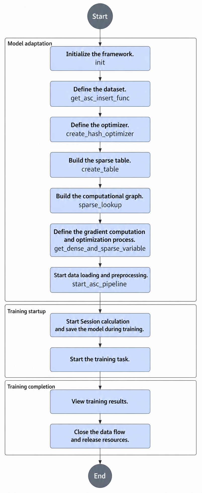
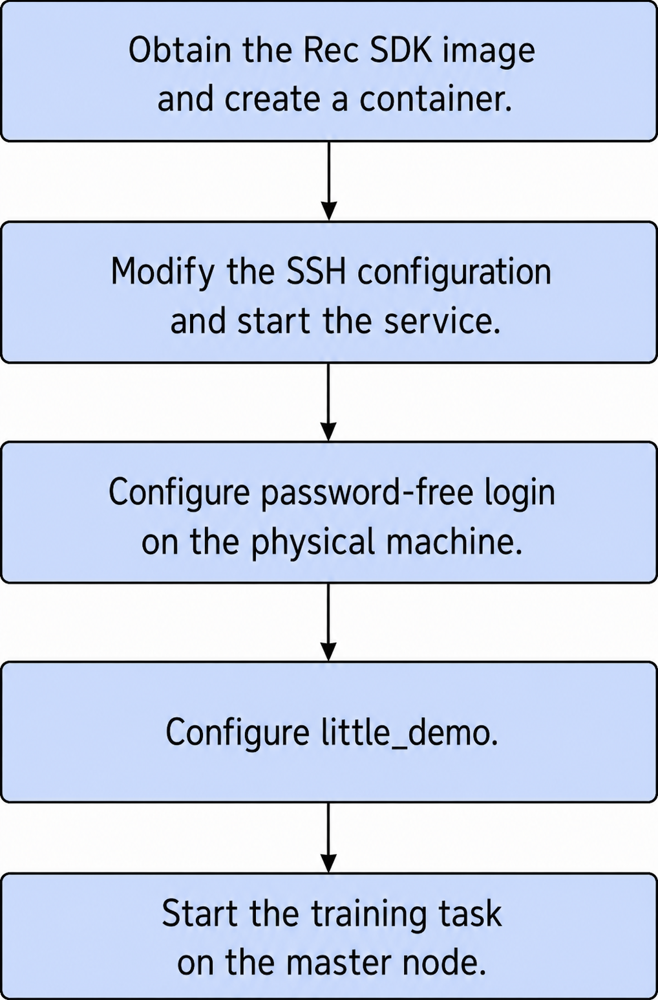

# Quick Start

## Before You Start

This document guides you through the related files and key interface adaptations required for model training using `tf.Session`, based on the `little-demo` sample provided by Rec SDK TensorFlow. `little-demo` is a code example that introduces the logic of calling related interfaces. It does not contain specific models or implement specific functions.

`little-demo` is for reference and learning only. Adapting your own models on `little-demo` is not supported. You can find `little-demo` at the following [link](https://gitcode.com/Ascend/RecSDK/tree/develop_examples_and_tools/examples/demo).

>[!NOTE]
>Multi-round evaluation is not supported in `train_and_evaluate` scenarios.

**Table 1** little-demo file description

|File|Description|
|--|--|
|config.py|Model-related configurations|
|dataset.py|Dataset preprocessing|
|deterministic_loss|Example for deterministic loss calculation|
|main.py|Entry point for model training|
|model.py|Model construction|
|op_impl_mode.ini|Operator configuration file|
|optimizer.py|Optimizer|
|random_data_generator.py|Random dataset generation|
|README.md|Instructions for running the demo model|
|run_deterministic.sh|Script for running deterministic calculation|
|run_model.py|Encapsulation of training and inference processes|
|run.sh|Startup script for model training|
|utils.py|Accuracy detection tool|

## Interface Call Introduction



1. Initialize the framework. In `main.py`, call the `init` interface and pass the parameters required for framework initialization. For details about the parameters, see [init](./api/initialization_and_deinitialization_of_the_training_framework.md#init).

    ```python
    # nbatch function needs to be used together with the prefetch and host_vocabulary_size != 0
    init(max_steps=max_steps,
         train_steps=TRAIN_steps,
         eval_steps=EVAL_STEPS,
         save_steps=SAVE_STEPS,
         use_dynamic=use_dynamic,
         use_dynamic_expansion=use_dynamic_expansion)
    ```

2. Define the dataset. In `main.py`, call the `get_asc_insert_func` interface to create and preprocess the dataset. For details about the parameters, see [Parameter description](./api/data_apis.md#get_asc_insert_func).

    ```python
        if not MODIFY_GRAPH_FLAG:
            insert_fn = get_asc_insert_func(tgt_key_specs=feature_spec_list, is_training=is_training, dump_graph=dump_graph)
            dataset = dataset.map(insert_fn)
        dataset = dataset.prefetch(100)
        iterator = dataset.make_initializable_iterator()
        batch = iterator.get_next()
        return batch, iterator
    ```

3. Define the optimizer. Define the optimizer in `optimizer.py`. For supported optimizer types and related parameters, see [Optimizers](./api/optimizers_apis.md).

    ```python
    # coding: UTF-8
    import logging
    import tensorflow as tf
    from mx_rec.optimizers.lazy_adam import create_hash_optimizer
    from mx_rec.optimizers.lazy_adam_by_addr import create_hash_optimizer_by_address
    from mx_rec.util.initialize import get_use_dynamic_expansion
    def get_dense_and_sparse_optimizer(cfg):
        dense_optimizer = tf.compat.v1.train.AdamOptimizer(learning_rate=cfg.learning_rate)
        use_dynamic_expansion = get_use_dynamic_expansion()
        if use_dynamic_expansion:
            sparse_optimizer = create_hash_optimizer_by_address(learning_rate=cfg.learning_rate)
            logging.info("optimizer lazy_adam_by_addr")
        else:
            sparse_optimizer = create_hash_optimizer(learning_rate=cfg.learning_rate)
            logging.info("optimizer lazy_adam")
        return dense_optimizer, sparse_optimizer
    ```

4. Create a sparse table. In `main.py`, call the `create_table` interface to create a sparse table and a sparse network layer. For details about the parameters, see [Parameter description](./api/model_apis.md#create_table).

    ```python
    user_hashtable = create_table(key_dtype=tf.int64,
                                  dim=tf.Tensorshape([cfg.user_hashtable_dim]),
                                  name='user_table',
                                  emb_initializer=tf.compat.v1.truncated_normal_initializer(),
                                  device_vocabulary_size=cfg.user_vocab_size * 10,
                                  host_vocabulary_size=0)  # cfg.user_vocab_size * 100, # for h2d test
    item_hashtable = create_table(key_dtype=tf.int64,
                                  dim=tf.Tensorshape([cfg.item_hashtable_dim]),
                                  name='item_table',
                                  emb_initializer=tf.compat.v1.truncated_normal_initializer(),
                                  device_vocabulary_size=cfg.item_vocab_size * 10,
                                  host_vocabulary_size=0)  # cfg.user_vocab_size * 100, # for h2d test
    ```

5. Build the computational graph. Pass the sparse network layer and feature list to create the model computational graph. Call `sparse_lookup` in the computational graph for feature lookup and error calculation. For details about the parameters, see [Parameter description](./api/model_apis.md#sparse_lookup).

    ```python
    def model_forward(input_list, batch, is_train, modify_graph, config_dict=None):
        embedding_list = []
        feature_list, hash_table_list, send_count_list = input_list
        for feature, hash_table, send_count in zip(feature_list, hash_table_list, send_count_list):
            access_and_evict_config = None
            if isinstance(config_dict, dict):
                access_and_evict_config = config_dict.get(hash_table.table_name)
            embedding = sparse_lookup(hash_table, feature, send_count, is_train=is_train,
                                      access_and_evict_config=access_and_evict_config,
                                      name=hash_table.table_name + "_lookup", modify_graph=modify_graph, batch=batch)
            reduced_embedding = tf.reduce_sum(embedding, axis=1, keepdims=False)
            embedding_list.append(reduced_embedding)
        my_model = MyModel()
        my_model(embedding_list, batch["label_0"], batch["label_1"])
        return my_model
    ```

6. Define gradient calculation and the optimization process. In `main.py`, call the `get_dense_and_sparse_variable` interface to obtain parameters for the dense and sparse network layers. Calculate gradients and perform optimization through the optimizer. For details about the interface, see [get_dense_and_sparse_variable](./api/model_apis.md#get_dense_and_sparse_variable).

    ```python
    train_iterator, train_model = build_graph([user_hashtable, item_hashtable], is_train=True,
                                                  feature_spec_list=train_feature_spec_list,
                                                  config_dict=ACCESS_AND_EVICT, batch_number=cfg.batch_number)
    eval_iterator, eval_model = build_graph([user_hashtable, item_hashtable], is_train=False,
                                                feature_spec_list=eval_feature_spec_list,
                                                config_dict=ACCESS_AND_EVICT, batch_number=cfg.batch_number)
    dense_variables, sparse_variables = get_dense_and_sparse_variable()
    ```

7. Start data loading and preprocessing. In `main.py`, call the `modify_graph_and_start_emb_cache` (graph modification mode) or `start_asc_pipeline` (non-graph modification mode) interface to start the data pipeline. The sample code uses an `if` statement to check the `MODIFY_GRAPH_FLAG` in the configuration file to determine whether to use the graph modification mode. For details about the interface, see [modify_graph_and_start_emb_cache](./api/data_apis.md#modify_graph_and_start_emb_cache).

    ```python
    saver = tf.compat.v1.train.Saver()
    if MODIFY_GRAPH_FLAG:
        logging.info("start to modifying graph")
        modify_graph_and_start_emb_cache(dump_graph=True)
    else:
        start_asc_pipeline()
    with tf.compat.v1.Session(config=sess_config(dump_data=False)) as sess:
        if MODIFY_GRAPH_FLAG:
            sess.run(get_initializer(True))
        else:
            sess.run(train_iterator.initializer)
        sess.run(tf.compat.v1.global_variables_initializer())
        EPOCH = 0
        if os.path.exists(f"./saved-model/sparse-model-{rank_id}-%d" % 0):
            saver.restore(sess, f"./saved-model/model-{rank_id}-%d" % 0)
        else:
            saver.save(sess, f"./saved-model/model-{rank_id}", global_step=0)
        for i in range(1, 201):
            logging.info(f"################    training at step {i}    ################")
            try:
                sess.run([train_ops, train_model.loss_list])
            except tf.errors.OutOfRangeError:
                logging.info(f"Encounter the end of Sequence for training.")
                break
            else:
                if i % TRAIN_INTERVAL == 0:
                    EPOCH += 1
                    evaluate()
                if i % SAVING_INTERVAL == 0:
                    saver.save(sess, f"./saved-model/model-{rank_id}", global_step=i)
        saver.save(sess, f"./saved-model/model-{rank_id}", global_step=i)
    ```

8. Start `Session` calculation and save the model during training. In `main.py`, call the `saver` interface to start `Session` calculation and save the model during training.

    ```python
    saver = tf.compat.v1.train.Saver()
    if MODIFY_GRAPH_FLAG:
        logging.info("start to modifying graph")
        modify_graph_and_start_emb_cache(dump_graph=True)
    else:
        start_asc_pipeline()
    with tf.compat.v1.Session(config=sess_config(dump_data=False)) as sess:
        if MODIFY_GRAPH_FLAG:
            sess.run(get_initializer(True))
        else:
            sess.run(train_iterator.initializer)
        sess.run(tf.compat.v1.global_variables_initializer())
        EPOCH = 0
        if os.path.exists(f"./saved-model/sparse-model-{rank_id}-%d" % 0):
            saver.restore(sess, f"./saved-model/model-{rank_id}-%d" % 0)
        else:
            saver.save(sess, f"./saved-model/model-{rank_id}", global_step=0)
        for i in range(1, 201):
            logging.info(f"################    training at step {i}    ################")
            try:
                sess.run([train_ops, train_model.loss_list])
            except tf.errors.OutOfRangeError:
                logging.info(f"Encounter the end of Sequence for training.")
                break
            else:
                if i % TRAIN_INTERVAL == 0:
                    EPOCH += 1
                    evaluate()
                if i % SAVING_INTERVAL == 0:
                    saver.save(sess, f"./saved-model/model-{rank_id}", global_step=i)
        saver.save(sess, f"./saved-model/model-{rank_id}", global_step=i)
    ```

9. Close the data stream and release resources. In `main.py`, call `terminate_config_initializer` to close the data stream and release resources. For details about the interface, see [terminate_config_initializer](./api/initialization_and_deinitialization_of_the_training_framework.md#terminate_config_initializer).

    ```python
    terminate_config_initializer()
    logging.info("Demo done!")
    ```

## Model Training Startup

### Single-Node Single-device and Single-Node Multi-device Training

This section describes how to set resource information through environment variables to start training tasks, including single-node single-device and single-node multi-device scenarios.

**Prerequisites**

To start a training task using this solution, set the following environment variables. For details about how to configure environment variables, see the [configuration file for `little-demo`](https://gitcode.com/Ascend/RecSDK/blob/develop_examples_and_tools/examples/demo/little_demo_estimator/run.sh). For descriptions of environment variables, see [Configuring environment variables](recsdk_tf_installation_guide.md#configuring-environment-variables).

```bash
CM_CHIEF_IP={host_ip}
CM_CHIEF_PORT=60000
CM_CHIEF_DEVICE=0
CM_WORKER_IP={host_ip}
CM_WORKER_SIZE=8
```

**Procedure**

1. If you need to customize the number of cards, set `local_rank_size` to the custom number of cards and `CM_WORKER_SIZE` to `local_rank_size` × the number of training nodes.

    >[!NOTE]
    >- The custom number of cards must be less than or equal to the number of cards visible in the container (or process).
    >- If the container is started in privileged mode, the number of visible cards in the container is equal to the total number of cards in the environment. Otherwise, the number of visible cards in the container is equal to the number of cards actually mounted when the container is started.
    >- To further control the number of visible cards in the training process, use the `ASCEND_RT_VISIBLE_DEVICES` environment variable to specify which of the visible cards in the current container are visible to the current process. This environment variable can typically be used to specify the devices involved in training.
    >- If the number of visible cards for the current process is 8, supported custom card numbers include 1, 2, 4, and 8.

    The following example assumes that 8 cards are visible in the environment, with logical ID list [0,1,2,3,4,5,6,7].

    - If `local_rank_size` = 1, `export CM_CHIEF_DEVICE` can be set to any card ID from [0,1,2,3,4,5,6,7].
    - If `local_rank_size` = 2, the value description is as follows:

        <table><tbody><tr id="row19257483262"><th class="firstcol" rowspan="2" valign="top" width="33.3033303330333%" id="mcps1.1.4.1.1"><p id="p92579882615">Continuous Card Usage</p>
        </th>
        <td class="cellrowborder" valign="top" width="33.36333633363336%" headers="mcps1.1.4.1.1 "><p id="p1525811811261"><strong id="b17693541182615">export CM_CHIEF_DEVICE</strong>=0</p>
        </td>
        <td class="cellrowborder" valign="top" width="33.33333333333333%" headers="mcps1.1.4.1.1 "><p id="p13258198">Indicates that cards 0 and 1 participate in training</p>
        </td>
        </tr>
        <tr id="row1510805512616"><td class="cellrowborder" valign="top" headers="mcps1.1.4.1.1 "><p id="p5109175502616"><strong id="b4810175516268">export CM_CHIEF_DEVICE</strong>=4</p>
        </td>
        <td class="cellrowborder" valign="top" headers="mcps1.1.4.1.1 "><p id="p610920554264">Indicates that cards 4 and 5 participate in training</p>
        </td>
        </tr>
        <tr id="row19258589267"><th class="firstcol" rowspan="3" valign="top" width="33.3033303330333%" id="mcps1.1.4.3.1"><p id="p1225813872619">Non-continuous Card Usage</p>
        </th>
        <td class="cellrowborder" valign="top" width="33.36333633363336%" headers="mcps1.1.4.3.1 "><p id="p112587815261"><strong id="b111192026122717">export ASCEND_RT_VISIBLE_DEVICES</strong>=1,3,5,7</p>
        <p id="p13398190172618">If continuous cards are assigned when the container is created, but you want to use non-continuous cards, set this environment variable.</p>
        </td>
        <td class="cellrowborder" valign="top" width="33.33333333333333%" headers="mcps1.1.4.3.1 "><p id="p325838142619">The logical ID list of visible cards in the environment is [1,3,5,7].</p>
        </td>
        </tr>
        <tr id="row34071512281"><td class="cellrowborder" valign="top" headers="mcps1.1.4.3.1 "><p id="p11954144117278"><strong id="b48331245102715">export CM_CHIEF_DEVICE</strong>=0</p>
        </td>
        <td class="cellrowborder" valign="top" headers="mcps1.1.4.3.1 "><p id="p1695494182712">Indicates that cards 1 and 3 participate in training</p>
        </td>
        </tr>
        <tr id="row664071762718"><td class="cellrowborder" valign="top" headers="mcps1.1.4.3.1 "><p id="p9641151732719"><strong id="b13441536132712">export CM_CHIEF_DEVICE</strong>=1</p>
        </td>
        <td class="cellrowborder" valign="top" headers="mcps1.1.4.3.1 "><p id="p10641151711271">Indicates that cards 3 and 5 participate in training</p>
        </td>
        </tr>
        </tbody>
        </table>

    - If `local_rank_size` = 4, the value description is as follows:
        - `export CM_CHIEF_DEVICE=0` (indicates that cards 0, 1, 2, and 3 participate in training)
        - `export CM_CHIEF_DEVICE=4` (indicates that cards 4, 5, 6, and 7 participate in training)

    - If `local_rank_size` = 8, the value description is as follows:

        `export CM_CHIEF_DEVICE=0` (indicates that cards 0, 1, 2, 3, 4, 5, 6, and 7 participate in training)

    >[!NOTE]
    >Rec SDK TensorFlow uses 8 cards for training by default. To enable 16 cards, run the following command.
    >
    >```bash
    >for pdev in `lspci -vvv|grep -E "^[a-f]|^[0-9]|ACSCtl"|grep ACSCtl -B1|grep -E "^[a-f]|^[0-9]"|awk '{print $1}'`
    >do
    >setpci -s $pdev ECAP_ACS+06.w=0000
    >done
    >```

2. Pass the host listening IP address of the master node directly after the startup command. The command format is as follows.

    ```bash
    bash run.sh main.py {host_ip}
    ```

    >[!NOTE]
    >
    >- You can start a training task by setting resource information through environment variables only if you pass a valid and available IP address after the startup command.
    >- If a [resource configuration file](https://www.hiascend.com/document/detail/zh/TensorFlowCommercial/80RC3/migration/tfmigr1/tfmigr1_000030.html) exists in the environment and no IP address is passed or an incorrect IP address is passed, the training task is started through the resource configuration file.
    >- If no [resource configuration file](https://www.hiascend.com/document/detail/zh/TensorFlowCommercial/80RC3/migration/tfmigr1/tfmigr1_000030.html) exists in the environment and no IP address is passed or an incorrect IP address is passed, the system prompts "the rank table file does not exist."

    Example of printed information after successful execution:

    ```bash
    ip: {host_ip} available.
    The ranktable solution is removed.
    CM_CHIEF_IP={host_ip}
    CM_CHIEF_PORT=60000
    CM_CHIEF_DEVICE=0
    CM_WORKER_IP={host_ip}
    CM_WORKER_SIZE=8
    ASCEND_VISIBLE_DEVICES=0-8
    py is main.py
    use horovod to start tasks
    ...
    ```

    Example of log information after execution is complete:

    ```bash
    ASC manager has been destroyed.
    MPI has been destroyed.
    Demo done!
    ```

### Multi-Node Multi-device Training

This section uses dual nodes (8 devices per node) as an example to describe how to set resource information through environment variables and start training tasks in multi-node multi-device scenarios.

**Prerequisites**

- Set the following environment variables. For details about how to configure environment variables, see the [configuration file for `little-demo`](https://gitcode.com/Ascend/RecSDK/blob/develop_examples_and_tools/examples/demo/little_demo/run.sh). For descriptions of environment variables, see [Configuring environment variables](recsdk_tf_installation_guide.md#configuring-environment-variables).

    ```bash
    CM_CHIEF_IP={host_ip}
    CM_CHIEF_PORT=60000
    CM_CHIEF_DEVICE=0
    CM_WORKER_IP={host_ip}
    CM_WORKER_SIZE=8
    ```

- The code path of the `little_demo` model and the NIC name for IP address configuration must be the same across the two nodes.
- Networking configuration within the cluster is complete. For details, see "Networking Overview"in the [Ascend Training Solution Networking Guide](https://support.huawei.com/enterprise/zh/doc/EDOC1100525718/549e2956?idPath=23710424|251366513|22892968|252309113|258915853).
- The training image for Rec SDK TensorFlow has been created according to [Building a Rec SDK TensorFlow Training Image](recsdk_tf_installation_guide.md#building-a-rec-sdk-tensorflow-training-image).
- Basic cluster environment network configuration checks are complete, such as verifying that NPU device IP addresses of multi-node nodes can ping each other and that TLS configurations for NPU devices on multi-node nodes are identical. If cluster communication fails, see [HCCL Cluster Communication Fails in Multi-Node Training](faq.md#hccl-cluster-communication-fails-in-multi-node-training).

**Procedure**

The main steps for multi-node training configuration: download the Rec SDK TensorFlow image and create a container, modify the SSH configuration and start the service, configure password-free login between physical nodes, and finally configure the `little_demo` model to start the training process. Either node can be selected as the master node for dual-node training.



1. Create and configure containers on the two nodes.
    i. Determine the port number for the nodes. All nodes must use the same unoccupied port number. Run the following command on the physical machine to check whether the port is in use. Port 12345 is used as an example.

        ```bash
        ss -tuln | grep 12345
        ```

        >[!NOTE]
        >If the `ss` command does not exist, install the iproute software package.

        - If the result is empty, the port is not in use. Proceed to [1.b](#li9821162384914).
        - If the result is not empty, the port is in use. Repeat the query with other port numbers.

    ii. <a id="li9821162384914"></a>Modify the `sshd_config` file in the container.

        ```bash
        vi /etc/ssh/sshd_config
        ```

        1. Uncomment the line containing `#Port 22` and change the port number to an unused one (for example, `12345`), so that MPI can access containers on other nodes through the specified port. Additionally, ensure the firewall policy on the host side allows access to this port.
        2. Uncomment `#ListenAddress 0.0.0.0` and change `0.0.0.0` to the current node IP address. If you deploy the cluster environment by exporting the latest container image and copying it to other environments, manually modify the SSH service listening IP address in the container to the corresponding node IP address after starting and entering the container on other nodes.

            >[!NOTE]
            >Failure to perform this step will not affect cluster training, but the corresponding port of 0.0.0.0 on the host will be listened to. For security reasons, you are advised to modify it.

    iii. Run the following command in the container to restart the SSH service.

        ```bash
        systemctl restart sshd
        ```

        After the restart, run `systemctl status sshd` to check the status of the SSH service.

        Run `ss -tuln | grep 12345` to check whether the listening port is the configured one.

        To stop the SSH service in the container, run the following command in the container:

        ```bash
        kill -9 `ps -ef | grep sshd | grep -v grep | awk '{print $2}'` > /dev/null 2>&1
        ```

    iv. Set environment variables in the container.

        Set environment variables required before starting training in the `~/.bashrc` file in the container. This ensures the master node can use them directly when logging in to other node containers without a password.

        The following is an example. Set the variables as required.

        3. Open the `~/.bashrc` file.

            ```bash
            vi ~/.bashrc
            ```

        4. Add the following content to the end of the file.

            ```bash
            source /etc/profile
            source /usr/local/Ascend/cann/set_env.sh
            source /usr/local/Ascend/driver/bin/setenv.bash
            export PATH=/usr/local/openmpi/bin:$PATH
            export PATH=/usr/local/python3.7.5/bin:$PATH
            export PATH=/usr/local/gcc7.3.0/bin:$PATH
            export LD_LIBRARY_PATH=/usr/local/python3.7.5/lib:$LD_LIBRARY_PATH
            export LD_LIBRARY_PATH=/usr/local/gcc7.3.0/lib64:$LD_LIBRARY_PATH
            export LD_LIBRARY_PATH=/usr/local/openmpi/lib:$LD_LIBRARY_PATH
            ```

        5. Press `Esc`, type `:wq!`, and press `Enter` to save the file and exit.
        6. Run `source ~/.bashrc` to make the environment variables take effect.

2. Configure the `little_demo` model.
    i. Run the following command to check the device IP addresses of the 8-card chip:

        ```bash
        for i in {0..7}; do hccn_tool -i $i -ip -g ; done
        ```

    ii. Configure resource information.
        - <a id="li488122614226"></a>When training is started in ranktable mode, the `hccl_json_16p_2_host.json` configuration file is required on all nodes, and the file content must be the same. The following is a configuration example for `hccl_json_16p_2_host.json`.

            The example shows the `hccl_json_16p_2_host.json` configuration for dual nodes. The device information of the master node must be configured in the first `device`. `{device_ip}` and `{host_ip}` must be replaced based on the actual environment configuration, and `rank_id` must be in ascending order.

            ```python
            {
                "server_count":"2",
                "server_list":[
                    {
                        "device":[
                            { "device_id":"0", "device_ip":"{device_0_ip}", "rank_id":"0" },
                            { "device_id":"1", "device_ip":"{device_1_ip}", "rank_id":"1" },
                            { "device_id":"2", "device_ip":"{device_2_ip}", "rank_id":"2" },
                            { "device_id":"3", "device_ip":"{device_3_ip}", "rank_id":"3" },
                            { "device_id":"4", "device_ip":"{device_4_ip}", "rank_id":"4" },
                            { "device_id":"5", "device_ip":"{device_5_ip}", "rank_id":"5" },
                            { "device_id":"6", "device_ip":"{device_6_ip}", "rank_id":"6" },
                            { "device_id":"7", "device_ip":"{device_7_ip}", "rank_id":"7" }
                        ],
                        "server_id":"{host_1_ip}"
                    },
                    {
                        "device":[
                            { "device_id":"0", "device_ip":"{device_8_ip}", "rank_id":"8" },
                            { "device_id":"1", "device_ip":"{device_9_ip}", "rank_id":"9" },
                            { "device_id":"2", "device_ip":"{device_10_ip}", "rank_id":"10" },
                            { "device_id":"3", "device_ip":"{device_11_ip}", "rank_id":"11" },
                            { "device_id":"4", "device_ip":"{device_12_ip}", "rank_id":"12" },
                            { "device_id":"5", "device_ip":"{device_13_ip}", "rank_id":"13" },
                            { "device_id":"6", "device_ip":"{device_14_ip}", "rank_id":"14" },
                            { "device_id":"7", "device_ip":"{device_15_ip}", "rank_id":"15" }
                        ],
                        "server_id":"{host_2_ip}"
                    }
                ],
                "status":"completed",
                "version":"1.0"
            }
            ```

        - When training is started without a ranktable, the HCCL JSON file does not need to be configured, but the environment variable must be manually set in `main.py` of the `little_demo` model code on all worker nodes as follows:

            Add the following code on the line below `import os` at the top of `main.py`:

            ```python
            # Set the CM_WORKER_IP environment variable to the current node IP address when no ranktable is used, where {host_ip} is the current node IP address.
            if not os.getenv("RANK_TABLE_FILE", ""):
                os.environ['CM_WORKER_IP'] = "{host_ip}"
            ```

    iii. Modify the `run.sh` script (only on the master node).

        1. Change `num_server` to the actual number of nodes (for example, 2).
        2. Delete the `-mca btl_tcp_if_exclude docker0` string from the value of the `mpi_args` variable.
        3. Change the value of `interface` to the NIC name that configures the current host IP address. Run `ip addr` to query the name.
        4. When training is started in ranktable mode, also change the JSON file name in the `export RANK_TABLE_FILE` variable value to match [the HCCL JSON file name configured for dual nodes](#li488122614226). For example:

            Change

            ```bash
            export RANK_TABLE_FILE="${cur_path}/hccl_json_${local_rank_size}p.json"
            ```

            to:

            ```bash
            export RANK_TABLE_FILE="${cur_path}/hccl_json_16p_2_host.json"
            ```

        5. Specify the port number and modify the `host` parameter through the `horovodrun` startup instruction as follows:

            At the end of the `run.sh` script, change

            ```bash
            xxx --mpi-args "${mpi_args}" --mpi -H localhost:${local_rank_size}
            ```

            to:

            ```bash
            xxx --mpi-args "${mpi_args}" -p 12345 --mpi -H {host_1_ip}:8,{host_2_ip}:8
            ```

            >[!NOTE]
            >- `-p 12345`: listening port number of the SSH server in the container
            >- 8: number of devices participating in training on a single node

3. Configure password-free login between nodes.
    i. Run the following command in the container of each node to set password-free login. `{target_host_user}` is the username of the peer node, and `{target_host_ip}` is the IP address of the peer node.

        ```bash
        ssh-copy-id -i ~/.ssh/id_rsa.pub {target_host_user}@{target_host_ip}
        ```

        >[!NOTE]
        >This command appends the public key to the `~/.ssh/authorized_keys` file of the peer node host by default. You need to copy the `authorized_keys` file on the host to the `~/.ssh` directory in the container.

        If a message indicating that `id_rsa.pub` does not exist is displayed, run the following command to generate it in the container. For security reasons, change the current `umask` value to `0077` before running the command and restore it to the original value after the command is complete. You are also advised to enter a password that meets complexity requirements when "Enter passphrase" is prompted.

        ```bash
        ssh-keygen -t rsa -b 3072 -f ~/.ssh/id_rsa
        ```

        >[!NOTE]
        >The preceding information is an example. Be aware of the risks involved in using and keeping SSH keys and passwords, especially when keys are not encrypted. Configure them according to the security policies of your organization, such as password complexity requirements and security configurations (protocols, cipher suites, key lengths, and whether `ssh-keygen` is allowed).

    ii. Set up an SSH agent to manage SSH keys.

        Commands for setting up an SSH agent are as follows.

        a. Start the `bash` process for `ssh-agent`.

        ```bash
        ssh-agent bash
        ```

        >[!NOTE]
        >Environment variables in the container are reset when this command is run. You are advised to save necessary environment variables in the `~/.bashrc` file in the container and run the `source ~/.bashrc` command to reconfigure them after running this command.

        b. Add the private key to `ssh-agent`.

        ```bash
        ssh-add ~/.ssh/id_rsa
        ```

        Running the preceding command prompts "Enter passphrase for /root/.ssh/id_rsa:". Enter the password set when the `id_rsa` private key was generated.

        c. Check whether the private key is successfully added.

        ```bash
        ssh-add -l
        ```

    iii. Check whether password-free login is successfully configured.

        ```bash
        ssh-keygen -R {target_host_ip}  # Delete the host key cache of the target IP address from the current node.
        ssh-keygen -R "[{target_host_ip}]:12345"  # Delete the host key cache for the port of the target IP address saved on the current host.
        ssh {target_host_user}@{target_host_ip}   # Verify password-free login to the target IP address.
        ssh {target_host_user}@{target_host_ip} -p 12345  # Verify password-free login to the specified port of the target IP address.
        ```

4. Run the following command on the master node to start the model. **You only need to start it on the master node. Manual startup on worker nodes is not required.** MPI will automatically jump to other nodes to start training tasks.
    - Ranktable mode:

        ```bash
        bash run.sh main.py
        ```

    - Non-ranktable mode, where `{host_1_ip}` is the IP address of the master node:

        ```bash
        bash run.sh main.py {host_1_ip}
        ```

        >[!NOTE]
        >After starting the training task, run the `exit` command to exit the `bash` process of the `ssh-agent` to avoid security risks.
