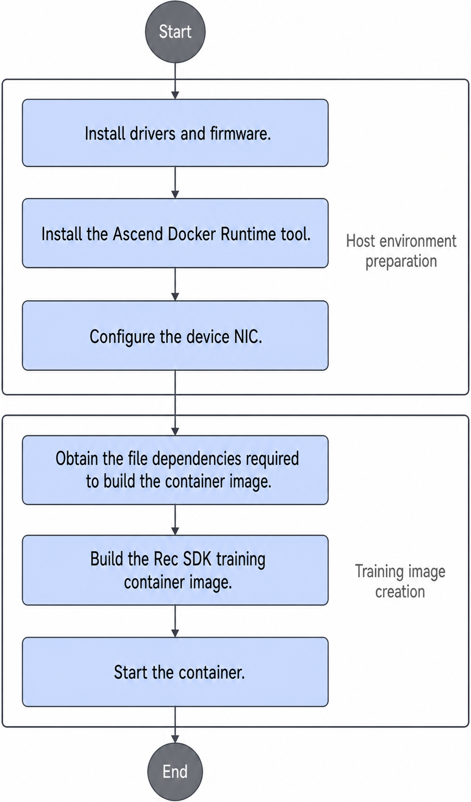

# Installation and Deployment

## Installation Instructions

- Rec SDK TensorFlow supports deployment of a development environment on a physical machine or in a container. You can choose either method based on service requirements.
- You are advised to install and run the software as a common user.

    >[!NOTE]
    >To view the installation history of the Rec SDK TensorFlow, see [Viewing Rec SDK TensorFlow Installation and Uninstallation Records](common_operations.md#viewing-rec-sdk-tensorflow-installation-and-uninstallation-records).

## Installation Prerequisites

Before you install the Rec SDK TensorFlow software package, prepare the following environment dependencies and perform the listed actions. For details, see [Table 1](#table18461141184116).

**Table 1** Rec SDK TensorFlow environment dependencies
<a id="table18461141184116"></a>

|Dependency/Operation|Recommended Version|How to Obtain|
|--|--|--|
|CANN software package and TensorFlow Ascend adaptation plugin|CANN 9.0.0|<li>`Ascend-cann-toolkit_{version}_linux-{arch}.run`: Click [this link](https://www.hiascend.com/developer/download/commercial/result?module=cann), configure the package in **Edit Resource Selection** under supporting resources on the left, filter the required software package, and obtain the package after you confirm the version information.<br>Install it according to the *CANN Software Installation Guide*. </li><li>For the TensorFlow Ascend adaptation plugin, click [this link](https://gitee.com/ascend/tensorflow/releases/tag/tfa_v0.0.44_8.3.RC1). `npu_device-2.6.5*` is for TensorFlow 2.6.5. `npu_bridge-1.15.0*` is for TensorFlow 1.15.0.</li>|
|Ascend hardware product driver and firmware|Ascend HDK 26.0.RC1 and its patch versions|Click [this link](https://www.hiascend.com/developer/download/commercial/result?module=cann), configure the package in **Edit Resource Selection** under supporting resources on the left, filter the required software package, and obtain the package after you confirm the version information. For driver and firmware installation, see the [driver and firmware installation and upgrade guides](https://support.huawei.com/enterprise/en/ascend-computing/ascend-hdk-pid-252764743) that come with the hardware product.|
|Ascend Docker Runtime|MindCluster 7.3.0|See the **Installation** > **Installation Deployment** section of the *MindCluster Cluster Scheduling User Guide* for installation.|
|Configuring the device NIC|-|Refer to the training node configuration example in the parameter network configuration section of the *Ascend Training Solution Networking Guide*, and configure the device IP address of the NPU network port with HCCN_Tool.|
|TensorFlow|TensorFlow 1.15.0 and TensorFlow 2.6.5|Obtain the source code from the [TensorFlow](https://github.com/tensorflow/tensorflow) repository. In Arm environments, TensorFlow does not provide the corresponding official wheel package. If you need to use it in Arm environments, you can obtain the Arm TensorFlow wheel package from [this link](https://ascend-repo.obs.cn-east-2.myhuaweicloud.com/MindX/OpenSource/python/index.html).<br>[!NOTE]<br>If the wheel package fails to be downloaded, copy the link and open it in a new tab page to complete the download.|
|Python 3.7.5|Python 3.7.5|Obtain the dependency software package from the [Python official website](https://www.python.org/).|

>[!NOTE]
>For open-source and third-party software that you integrate, track vulnerabilities and issues in the community and fix them in a timely manner. You can check the [CVE website](https://www.cve.org/) for known vulnerabilities in the corresponding open-source software version, and fix them by upgrading versions or applying patch packages.

## Obtaining the Rec SDK TensorFlow Software Package

Refer to this section to obtain the Rec SDK TensorFlow software and verify the software digital signature.

If you need the Rec SDK TensorFlow source code, you can obtain it from the [source address](https://gitcode.com/Ascend/RecSDK/tree/develop). You can also build it yourself by following the procedure below.

### Installing from Source

Before you build the source code, follow the [CANN Software Installation Guide](https://www.hiascend.com/document/detail/zh/CANNCommunityEdition/900beta1/softwareinst/instg/instg_0000.html?Mode=PmIns&InstallType=local&OS=Ubuntu) to install the CANN development kit software package. Then, follow the [TF Adapter Installation Guide](https://www.hiascend.com/document/detail/zh/TensorFlowCommunity/900beta1/migration/tfmigr1/tfmigr1_000009.html) to install the TensorFlow framework plugin package for Ascend adaptation.

1. Build environment dependencies:
   - Python3.7.5
   - GCC 11.2.0
   - CMake 3.20.6

2. Open-source dependencies:
   - [pybind11](https://github.com/pybind/pybind11/archive/refs/tags/v2.10.3.zip)
   - [securec](https://github.com/huaweicloud/huaweicloud-sdk-c-obs/archive/refs/tags/v3.23.9.zip)
   - [openmpi 4.1.5](https://download.open-mpi.org/release/open-mpi/v4.1/openmpi-4.1.5.tar.gz): Install it in the build environment according to the software documentation.
   - TensorFlow 1.15/2.6.5: Select the corresponding version as required.

   Place the compressed packages of pybind11 (`>= 2.10.3`) and securec (`huaweicloud-sdk-c-obs-3.23.9.zip`) in the same directory as the RecSDK code under the `opensource` subdirectory.

3. Build method:

   > [!NOTE]
   > The `build_wrapper.sh` script is updated with the resource download center. Currently, you are advised to compile and install the Rec SDK .whl package separately.

   Go to the RecSDK code directory.

   To compile and install the software package, refer to the `build/build_wrapper/tf_rec_v1/build_wrapper.sh` script and run the script to build the software package. After the build is successful, the software package is stored in the `build/output` subdirectory.

   ```bash
   # Build the package.
   bash build/build_wrapper/tf_rec_v1/build_wrapper.sh

   # Install the package.
   pip install build/output/tf_rec_v1*.tar.gz
   ```

   To build and install the Rec SDK .whl package for TensorFlow 1.15.0 or TensorFlow 2.6.5 separately (excluding the automatic TensorFlow version identification function and the installation of framework-dependent operators), run the following command:
   - `setup_tf1.py`: Run `python3.7 setup_tf1.py bdist_wheel` to build the wheel package for TensorFlow 1. After the build succeeds, the wheel package is in the `build/mindxsdk-mxrec/tf1_whl` subdirectory.
   - `setup_tf2.py`: Run `python3.7 setup_tf2.py bdist_wheel` to build the wheel package for TensorFlow 2. After the build succeeds, the wheel package is in the `build/mindxsdk-mxrec/tf2_whl` subdirectory.

   To enable the dynamic expansion feature, go to the `RecSDK/cust_op/ascendc_op/ai_core_op/cust_op_by_addr` directory. Run `bash run.sh` to build and install the dynamic expansion operator package.

4. Test cases

   **Python test cases**

   Dependencies required to run the Python test cases:

   - pytest 7.1.1
   - pytest-cov 4.1.0
   - pytest-html

   To run the Python test cases, install the preceding dependencies and verify that the TensorFlow 1 environment can build the source code correctly. Then, go to the `RecSDK/training/tf_rec_v1/python/tests` directory and run the Python test cases with the following command:

   ```shell
   bash run_python_dt.sh
   ```

   **C++ test cases**

   Dependencies required to run the C++ test cases:

   - [googletest 1.8.1](https://github.com/google/googletest/archive/refs/tags/release-1.8.1.zip)
   - [emock 0.9.0](https://github.com/ez8-co/emock/archive/refs/tags/v0.9.0.zip)
   - [pybind11](https://github.com/pybind/pybind11/archive/refs/tags/v2.10.3.zip)
   - [securec](https://github.com/huaweicloud/huaweicloud-sdk-c-obs/archive/refs/tags/v3.23.9.zip)

   Place the compressed packages of googletest (`googletest-release-1.8.1.zip`), emock (`emock-0.9.0.zip`), pybind11 (`>= 2.10.3`) and securec (`huaweicloud-sdk-c-obs-3.23.9.zip`) in the same level as the RecSDK code in the `opensource` directory.

   To run the C++ test cases, install the preceding dependencies. Then, go to the `RecSDK/training/tf_rec_v1/src` directory and run the C++ test cases.

   In the TensorFlow 1 environment, run the following command:

   ```shell
   bash test_ut.sh tf1
   ```

   In the TensorFlow 2 environment, run the following command:

   ```shell
   bash test_ut.sh tf2
   ```

**Downloading the Software Package**

Refer to this section to obtain the required software package and the corresponding digital signature file. By downloading the software, you agree to the terms and conditions of [Huawei Enterprise End User License Agreement (EULA)](https://e.huawei.com/en/about/eula).

> [!NOTE]
> The current release software package is the Rec SDK .whl package. The one-click installation and deployment software package will be updated after the resource download center is launched.

|Component|Software Package|Link|
|--|--|--|
|Rec SDK|Development kit of the recommendation algorithm framework.|[Link](https://www.hiascend.com/zh/developer/download/community/result?module=sdk+cann)|

**Verifying the Software Digital Signature**

To prevent the package from being maliciously tampered with during transmission or storage, download the digital signature file for integrity check while downloading the package.

After downloading the software package, verify its PGP digital signature according to the *OpenPGP Signature Verification Guide*. If the verification fails, do not use the software package, and contact Huawei technical support.

Before you use a software package for installation or upgrade, perform the preceding operations to verify its digital signature to ensure that the software package is not tampered with.

For carrier users, visit [https://support.huawei.com/carrier/digitalSignatureAction](https://support.huawei.com/carrier/digitalSignatureAction).

For enterprise users, visit [https://support.huawei.com/enterprise/zh/tool/software-digital-signature-openpgp-validation-tool-TL1000000054](https://support.huawei.com/enterprise/zh/tool/software-digital-signature-openpgp-validation-tool-TL1000000054).

## Deploying the Development Environment on a Physical Machine

> [!NOTE]
>
> - Currently, the physical machine development environment can be deployed on Ubuntu 20.04 or later. For other OSs, install the software by compiling the source code or by deploying a container.
> - Do not modify any code files in the build directory except for `run.sh`.

1. Install the CANN software package and TensorFlow Ascend adaptation plugin by referring to the *CANN Software Installation Guide*.
2. Configure environment variables.

    The CANN software provides a process-level environment variable setting script for users to reference in processes to automatically set environment variables. They become invalid automatically after the user process ends.

    You can use the following command in the shell script that starts the program to set the relevant CANN environment variables. You can also run the following command from the CLI. The following example uses the default root installation path `/usr/local/Ascend`:

    ```bash
    source /usr/local/Ascend/cann/set_env.sh
    ```

3. Run the following command to install the software package. The software package automatically identifies the TensorFlow version in the current environment. The software package contains framework-dependent operators. The software package automatically identifies the processor type based on the hardware model. You can also specify the processor type.

    ```bash
    # Install the package.
    pip install tf_rec_v1-{version}-{arch}.tar.gz

    # Install the software package with the processor type specified.
    CORE_TYPE=A2 pip install tf_rec_v1-{version}-{arch}.tar.gz
    ```

    (`{version}` indicates the version number, and `{arch}` indicates the OS architecture. Replace them with the actual ones.)

    The software package installs in Python `site-packages` by default. If you specify a directory with the `--target` parameter, add the Rec SDK TensorFlow path to the `PYTHONPATH` environment variable after installation.

    ```bash
    export PYTHONPATH={rec_install_path}:{rec_install_path}/tf_rec_v1:$PYTHONPATH
    ```

4. If you need the dynamic expansion feature, see [(Optional) Installing the On-Chip Memory Dynamic Expansion Operator Package](common_operations.md#optional-installing-the-on-chip-memory-dynamic-expansion-operator-package) to build and install the dynamic expansion operator package.
5. If you need the Hadoop distributed file system, refer to the [Hadoop official documentation](https://hadoop.apache.org/docs/r1.0.4/cn/quickstart.html) for environment deployment and cluster setup. Hadoop 2.7.5 is recommended.

## Deploying the Development Environment in a Container

### Using a Container to Deploy the Development Environment

>[!NOTE]
>
>- If you use CentOS for configuration, including the host and the container, the `libstdc++` version must be later than `libstdc++.so.6.0.24`.
>- For security purposes, only non-root users can start and use containers.

You can deploy the Rec SDK TensorFlow development environment in a container by following the steps in [Figure 1](#fig2687191413442).

**Figure 1** Configuring the development environment in a container and building the training image<a id="fig2687191413442"></a>


**Key steps**

1. Prepare the host environment.

    See [Installation Prerequisites](#installation-prerequisites) to deploy the host environment.

2. Obtain the training image and start the container. Refer to the [Ascend image repository](https://www.hiascend.com/developer/ascendhub) to build the base image and install Rec SDK TensorFlow.
3. If you need the dynamic expansion feature in the container, see [(Optional) Installing the On-Chip Memory Dynamic Expansion Operator Package](common_operations.md#optional-installing-the-on-chip-memory-dynamic-expansion-operator-package) to build and install the dynamic expansion operator package.
4. If you need the Hadoop distributed file system, refer to the [Hadoop official documentation](https://hadoop.apache.org/docs/r1.0.4/cn/quickstart.html) for environment deployment and cluster setup. Hadoop 2.7.5 is recommended.

    >[!NOTE]
    >After you deploy the environment according to the Hadoop official documentation, the owner of the `/usr/local/hadoop-2.7.5/sbin` directory in the environment is 20415, which is a non-root user. That owner can rename and create new files to replace executables in the root user's `PATH` environment variable, which creates a privilege escalation risk.

### Building a Rec SDK TensorFlow Training Image

This section helps you build a Rec SDK TensorFlow training image from an existing base image.

**Prerequisites**

1. You have followed [Installation Prerequisites](#installation-prerequisites) to install the driver and firmware for the corresponding CANN version on the physical machine.
2. Docker has been installed on the physical machine and the Docker network is available.
3. Prepare a base image. You can obtain a base image from the [Ascend image repository](https://www.hiascend.com/developer/ascendhub), or use an existing base image you already have.
    - You are advised to obtain the Rec SDK TensorFlow training image from the Ascend image repository. The Rec SDK TensorFlow training image in the Ascend image repository already includes GCC, CMake, and other basic dependencies, so you do not need to install them again. You only need to update the CANN and Rec SDK software packages.
    - Prepare an image as the base image. You are advised to use the Ubuntu 20.04 image.

4. Run the following command to load the base image into Docker.

    ```bash
    docker load --input xxx.tar
    ```

5. Create a folder for building the image. `build_images` is used as an example.
    1. Place only the files needed for image building in this folder, such as the `Ascend-cann-toolkit_*.run` package for the target architecture, `tf-plugin`, and the Rec SDK software package.
    2. If you need to install the `tf-plugin` package, also copy `/usr/local/Ascend/driver/version.info` and `/etc/ascend_install.info` to the `build_images` directory.

        (Do not place unrelated files in the `build_images` directory. When you build the image, files in this directory are copied into the image.)

6. The image build process uses `docker` commands and file copies from the physical machine. Make sure the user has permission to run commands and access files.

**Building a Training Image from the Rec SDK TensorFlow Base Image**

1. Refer to [Obtaining the Rec SDK TensorFlow Software Package](#obtaining-the-rec-sdk-tensorflow-software-package) to obtain the Rec SDK software package, the matching CANN software package, and the TensorFlow Ascend adaptation plugin.
2. Create a Dockerfile configuration file (`Dockerfile` for example) in the `build_images` directory. Edit the file with `vi Dockerfile` and insert the following content:

    ```bash
    # Modify the base image name and image tag as needed.
    FROM rec_sdk-tf1:7.3.0

    # CANN parameters
    ARG TOOLKIT_PKG=Ascend-cann-toolkit*.run
    ARG KERNEL_PKG=Ascend-cann-*-ops*.run
    ARG TF1_PLUGIN=npu_bridge-1.15.0-*.whl
    ARG TF2_PLUGIN=npu_device-2.6.5-*.whl
    # Rec SDK TensorFlow package
    ARG REC_SDK_PKG=Ascend-mindxsdk-mxrec*.tar.gz

    # Set the installation path environment variable
    ARG ASCEND_BASE=/usr/local/Ascend

    # Remove the old CANN installation.
    RUN rm -rf $ASCEND_BASE/ascend-toolkit
    RUN rm -rf $ASCEND_BASE/cann*

    # Choose the dependencies to copy and install as required. If you do not need to run them, delete the corresponding lines.
    WORKDIR /tmp
    COPY $TOOLKIT_PKG .
    COPY $KERNEL_PKG .
    COPY $TF1_PLUGIN .
    COPY $TF2_PLUGIN .
    COPY $REC_SDK_PKG .
    COPY version.info .
    COPY ascend_install.info .

    # Install ascend-toolkit and the ops operator package.
    RUN umask 0027 && \
        mkdir -p $ASCEND_BASE/driver && \
        /usr/bin/cp -f version.info $ASCEND_BASE/driver/ && \
        /usr/bin/cp -f ascend_install.info /etc/ && \
        chmod +x $TOOLKIT_PKG && \
        echo Y | bash $TOOLKIT_PKG --quiet --install --install-path=$ASCEND_BASE && \
        chmod +x $KERNEL_PKG && \
        echo Y | bash $KERNEL_PKG --quiet --install && \
        source $ASCEND_BASE/cann/set_env.sh && \
        rm -rf /root/.cache/pip && \
        rm -f $TOOLKIT_PKG && \
        rm -f $KERNEL_PKG && \
        rm -rf $ASCEND_BASE/driver && \
        rm -rf /etc/ascend_install.info

    # Install Rec SDK TensorFlow. The following example installs the TensorFlow 1 version. If you need the TensorFlow 2 version, change tf1 to tf2.
    ARG SDK_TF_VERSION=tf1
    RUN pip3.7 install $TF1_PLUGIN --force-reinstall && \
        pip3.7 install $TF2_PLUGIN --force-reinstall && \
    tar -zxvf Ascend-mindxsdk-mxrec*.tar.gz && \
        pip3.7 install mindxsdk-mxrec/${SDK_TF_VERSION}_whl/mx_rec-*.whl --force-reinstall && \
        rm -rf /root/.cache/pip
    ```

3. Go to the `build_images` path and run the following command to build the Rec SDK TensorFlow image.

    ```bash
    docker build -t {image_name}:{image_tag} -f Dockerfile .
    ```

**Building a Training Image from CentOS 7.6.1810 or a User Image**

1. Check whether the image already contains the following dependencies. Download any missing dependency package to the `build_images` directory.

    |Dependency|Download Link|
    |--|--|
    |gcc-7.3.0|[Link](https://mirrors.ustc.edu.cn/gnu/gcc/gcc-7.3.0/gcc-7.3.0.tar.gz)|
    |cmake-3.20.6|[Link](https://cmake.org/files/v3.20/cmake-3.20.6.tar.gz)|
    |ucx|[Link](https://github.com/openucx/ucx/archive/master.zip)|
    |openmpi-4.1.5|[Link](https://download.open-mpi.org/release/open-mpi/v4.1/openmpi-4.1.5.tar.gz)|
    |python-3.7.5|[Link](https://repo.huaweicloud.com/python/3.7.5/Python-3.7.5.tar.xz)|
    |hdf5-1.10.5|[Link](https://support.hdfgroup.org/ftp/HDF5/releases/hdf5-1.10/hdf5-1.10.5/src/hdf5-1.10.5.tar.gz)|
    |CANN software package, TensorFlow Ascend adaptation plugin, and Rec SDK software package|See [Installation Prerequisites](#installation-prerequisites).|
    |TensorFlow (1.15.0/2.6.5)|[Link](https://ascend-repo.obs.cn-east-2.myhuaweicloud.com/MindX/OpenSource/python/index.html)|

2. Create a Dockerfile configuration file (`Dockerfile` for example) in the `build_images` directory. Edit the file with `vi Dockerfile` and insert the following content:

    ```bash
    # Modify the base image name and image tag as needed.
    FROM swr.cn-south-1.myhuaweicloud.com/ascendhub/centos:7.6.1810

    WORKDIR /tmp


    # Select the dependencies to install as required. If some dependencies are not needed, you can delete or comment out the corresponding code. Also make sure the downloaded package names match the package names in the following code.
    # Otherwise, an error may occur because the file cannot be found when you install the corresponding dependency.
    COPY gcc-7.3.0.tar.gz ./
    COPY cmake-3.20.6.tar.gz ./
    COPY ucx-master.zip ./
    COPY openmpi-4.1.5.tar.gz ./
    COPY Python-3.7.5.tar.xz ./
    COPY hdf5-1.10.5.tar.gz ./

    COPY Ascend-cann-toolkit*.run ./
    COPY Ascend-cann-*-ops*.run ./
    COPY version.info ./
    COPY ascend_install.info ./
    COPY ./npu_bridge-1.15.0-*.whl ./
    COPY ./npu_device-2.6.5-*.whl ./
    COPY Ascend-mindxsdk-mxrec*.tar.gz ./

    # 1. Install the build environment.
    RUN yum makecache && \
        yum -y install centos-release-scl && \
        yum -y install devtoolset-7 && \
        yum -y install devtoolset-7-gcc-c++ && \
        yum -y install epel-release && \
        yum -y install wget zlib-devel bzip2 bzip2-devel openssl-devel ncurses-devel openssh-clients openssh-server sqlite-devel openmpi-devel \
        readline-devel tk-devel gdbm-devel db4-devel libpcap-devel xz-devel libffi-devel hdf5-devel patch pciutils lcov vim dos2unix gcc-c++ \
        autoconf automake libtool git net-tools make sudo unzip && \
        yum clean all && \
        rm -rf /var/cache/yum && \
        echo "source /opt/rh/devtoolset-7/enable" >> /etc/profile
    # Note: openssh-server is required for dual-node training examples. You can remove it for single-node training.

    # 2. Install gcc-7.3.0.
    RUN source /etc/profile && \
        tar -zxvf gcc-7.3.0.tar.gz && \
        cd gcc-7.3.0 && \
        wget https://mirrors.huaweicloud.com/gnu/gmp/gmp-6.1.0.tar.bz2 && \
        wget https://mirrors.huaweicloud.com/gnu/mpfr/mpfr-3.1.4.tar.bz2 && \
        wget https://mirrors.huaweicloud.com/gnu/mpc/mpc-1.0.3.tar.gz && \
        wget https://mindx.obs.cn-south-1.myhuaweicloud.com/opensource/isl-0.16.1.tar.bz2 && \
        sed -i "246s/tar -xf "${ar}"/tar --no-same-owner -xf "${ar}"/" contrib/download_prerequisites && \
        ./contrib/download_prerequisites && \
        ./configure --enable-languages=c,c++ --disable-multilib --with-system-zlib --prefix=/usr/local/gcc7.3.0 && \
        make -j && make -j install && cd .. && \
        find gcc-7.3.0/ -name libstdc++.so.6.0.24 -exec cp {} /lib64/ \; && \
        rm -rf gcc-7.3.0*

    ENV LD_LIBRARY_PATH=/usr/local/gcc7.3.0/lib64:$LD_LIBRARY_PATH \
        PATH=/usr/local/gcc7.3.0/bin:$PATH

    # 3. Install CMake.
    RUN source /etc/profile && gcc -v && tar -zxf cmake-3.20.6.tar.gz && \
        cd cmake-3.20.6 && \
        ./bootstrap && make && make install && cd .. && \
        rm -rf cmake-3.20.6*

    # 4. Install UCX.
    RUN source /etc/profile && gcc -v && unzip ucx-master.zip && \
        cd ucx-master && \
        ./autogen.sh && \
        ./contrib/configure-release --prefix=/usr/local/ucx && \
        make && make install && cd .. && \
        rm -rf ucx-master*

    # 5. Install Open MPI. You need to configure UCX.
    RUN source /etc/profile && gcc -v && tar -zxvf openmpi-4.1.5.tar.gz && \
        cd openmpi-4.1.5 && \
        ./configure --enable-orterun-prefix-by-default --prefix=/usr/local/openmpi --with-ucx=/usr/local/ucx && \
        make -j 16 && make install && cd .. && \
        rm -rf openmpi-4.1.5*

    ENV LD_LIBRARY_PATH=/usr/local/openmpi/lib:$LD_LIBRARY_PATH \
        PATH=/usr/local/openmpi/bin:$PATH

    # 6. Install Python 3.7.5.
    RUN source /etc/profile && gcc -v && tar -xvf Python-3.7.5.tar.xz && \
        cd Python-3.7.5 && \
        mkdir -p build && cd build && \
        ../configure --enable-shared --prefix=/usr/local/python3.7.5 && \
        make -j && make install && \
        cd ../../ && rm -rf Python-3.7.5* && \
        ldconfig

    ENV PATH=$PATH:/usr/local/python3.7.5/bin \
        LD_LIBRARY_PATH=$LD_LIBRARY_PATH:/usr/local/python3.7.5/lib

    # Configure the Python package repository.
    RUN mkdir ~/.pip && touch ~/.pip/pip.conf && \
        echo "[global]" > ~/.pip/pip.conf && \
        echo "trusted-host=pypi.douban.com" >> ~/.pip/pip.conf && \
        echo "index-url=http://pypi.douban.com/simple/" >> ~/.pip/pip.conf && \
        echo "timeout=200" >> ~/.pip/pip.conf

    # 7. Install hdf5.
    RUN source /etc/profile && gcc -v && tar -zxvf hdf5-1.10.5.tar.gz && \
        cd hdf5-1.10.5 && \
        ./configure --prefix=/usr/local/hdf5 && \
        make && make install && cd .. && rm -rf hdf5-1.10.5*

    ENV CPATH=/usr/local/hdf5/include/:/usr/local/hdf5/lib/

    RUN ln -s /usr/local/hdf5/lib/libhdf5.so /usr/lib/libhdf5.so && \
        ln -s /usr/local/hdf5/lib/libhdf5_hl.so /usr/lib/libhdf5_hl.so

    # 8. Install Python packages.
    # Use this environment variable when you install mpi4py. Unset it after installation.
    ENV CC=/usr/lib64/openmpi/bin/mpicc

    RUN pip3.7 install -U pip && \
        pip3.7 install numpy && \
        pip3.7 install decorator && \
        pip3.7 install sympy && \
        pip3.7 install cffi && \
        pip3.7 install pyyaml && \
        pip3.7 install pathlib2 && \
        pip3.7 install grpcio && \
        pip3.7 install grpcio-tools && \
        pip3.7 install protobuf==3.20.3 && \
        pip3.7 install scipy && \
        pip3.7 install requests && \
        pip3.7 install mpi4py && \
        pip3.7 install scikit-learn && \
        pip3.7 install easydict && \
        pip3.7 install attrs && \
        pip3.7 install pytest && \
        pip3.7 install pytest-cov && \
        pip3.7 install pytest-html && \
        pip3.7 install Cython && \
        pip3.7 install h5py==3.1.0 && \
        pip3.7 install pandas && \
        pip3.7 install funcsigs && \
        pip3.7 install tqdm && \
        pip3.7 install portalocker && \
        rm -rf /root/.cache/pip

    RUN unset CC

    # 9. Set the driver path environment variable.
    ARG ASCEND_BASE=/usr/local/Ascend
    ENV LD_LIBRARY_PATH=$ASCEND_BASE/driver/lib64:$ASCEND_BASE/driver/lib64/common:$ASCEND_BASE/driver/lib64/driver:$LD_LIBRARY_PATH

    # 10. Set CANN parameters.
    ARG TOOLKIT_PKG=Ascend-cann-toolkit*.run
    ARG KERNEL_PKG=Ascend-cann-*-ops*.run

    # 11. Install ascend-toolkit and the ops operator package.
    RUN umask 0027 && \
        mkdir -p $ASCEND_BASE/driver && \
        /usr/bin/cp -f version.info $ASCEND_BASE/driver/ && \
        /usr/bin/cp -f ascend_install.info /etc/ && \
        chmod +x $TOOLKIT_PKG && \
        echo Y | bash $TOOLKIT_PKG --quiet --install --install-path=$ASCEND_BASE && \
        chmod +x $KERNEL_PKG && \
        echo Y | bash $KERNEL_PKG --quiet --install && \
        source $ASCEND_BASE/cann/set_env.sh && \
        rm -rf /root/.cache/pip && \
        rm -f $TOOLKIT_PKG && \
        rm -f $KERNEL_PKG && \
        rm -rf $ASCEND_BASE/driver && \
        rm -rf /etc/ascend_install.info

    # 12. Install TensorFlow-related Python packages and Rec SDK. By default, the tf1 image is built. Adjust the parameters if you need a tf2 image.
    ARG TF_VER=1.15.0
    ARG TF1_PLUGIN=npu_bridge-1.15.0-*.whl
    ARG TF2_PLUGIN=npu_device-2.6.5-*.whl
    RUN pip3.7 install tensorflow==${TF_VER} && \
        pip3.7 install tf_slim && \
        HOROVOD_WITH_MPI=1 HOROVOD_WITH_TENSORFLOW=1 pip3.7 install horovod --no-cache-dir && \
        pip3.7 install $TF1_PLUGIN --force-reinstall && \
        pip3.7 install $TF2_PLUGIN --force-reinstall && \
        tar -zxvf Ascend-mindxsdk-mxrec*.tar.gz && \
        pip3.7 install mindxsdk-mxrec/{tf1|tf2}_whl/mx_rec-*.whl --force-reinstall && \
        rm -rf /root/.cache/pip

    # 13. Clear the temporary directory.
    RUN rm -rf ./*
    ```

3. Go to the `build_images` path and run the following command to build the Rec SDK TensorFlow image.

    ```bash
    docker build -t {image_name}:{image_tag} -f Dockerfile .
    ```

## Configuring Environment Variables

[Table 1](#table126401659163820) describes the environment variables for Rec SDK TensorFlow. To use C/C++ compilation, such as when you compile operators written in C++, set the compilation environment variables. See [Table 2](#table20242918114315) for details.

**Table 1**  Environment variables
<a id="table126401659163820"></a>

|Environment Variable|Meaning|Mandatory/Optional|Description|
|--|--|--|--|
|MXREC_LOG_LEVEL|Framework log level.|Optional|Value range: `INFO`, `DEBUG`, and `ERROR`. Default value: `INFO`.|
|TF_DEVICE|Indicates whether to perform table merging checks.|Optional|Value range: `NPU`, `GPU`, `CPU`, and `NONE`. Default value: `NONE`. <li>When the value is `GPU`, `CPU`, or `NONE`, table merging checks are not performed. </li><li>When the value is `NPU`, table merging checks are performed.</li>|
|AclTimeout|ACL timeout.|Optional|Value range: -1 to 2147483647 (the maximum value of int32). Default value: -1.|
|HD_CHANNEL_SIZE|Depth of the data channel processed by the CPU.|Optional|Value range: 2 to 8192. Default value: 40.|
|KEY_PROCESS_THREAD_NUM|Number of `KEY_PROCESS` threads.|Optional|Value range: 1 to 10. Default value: 6.|
|MAX_UNIQUE_THREAD_NUM|Maximum number of `UNIQUE` threads.|Optional|Value range: 1 to 8. Default value: 8.|
|FAST_UNIQUE|Indicates whether to use the self-implemented optimized deduplication encoding algorithm.|Optional|Value range: 0 or 1. Default value: 0. Values outside the valid range cause unpredictable behavior. <li>0: Disabled. </li><li>1: Enabled.</li>|
|HOT_EMB_UPDATE_STEP|Hot embedding update step count.|Optional|Value range: 1 to 1000. Default value: 1000.|
|GLOG_stderrthreshold|glog log level.|Optional|Value range: -2 to 2. Default value: 0. <li>-2: TRACE </li><li>-1: DEBUG </li><li>0: INFO </li><li>1: WARNING </li><li>2: ERROR</li>|
|USE_COMBINE_FAAE|Controls whether to count statistics in merged tables.|Optional|Value range: 0 or 1. Default value: 0. Values outside the valid range cause unpredictable behavior. <li>If `USE_COMBINE_FAAE` is set to 0, statistics are counted separately. The count record for each table key is independent. </li><li>If `USE_COMBINE_FAAE` is set to 1, statistics are counted in merged tables. Multiple tables maintain one count record.</li>|
|CM_CHIEF_IP|IP address of the master node.|Optional|This parameter is mandatory when you use the non-ranktable mode.|
|CM_CHIEF_PORT|Listening port of the master node, for example, 60000.|Optional|This parameter is mandatory when you use the non-ranktable mode.<br><li>You can use the following command to specify a set of local reserved ports. The system reserves these ports and does not use them for other applications:<br>`sysctl -w net.ipv4.ip_local_reserved_ports=60000-60015`<br>Then set `CM_CHIEF_PORT` to a port in the range specified by the preceding command. </li><li>Check whether a port is occupied:<br>`netstat -anp \| grep <port_number>` <br>If the port is occupied, the process ID and process name that occupy the port are displayed.</li>|
|CM_CHIEF_DEVICE|Device ID of the master node.|Optional|Specifies the logical Device ID of the statistics server cluster information in the master node.<br>Value range: 0 to (number of visible devices in the environment - 1). This parameter is mandatory when you use the non-ranktable mode.|
|CM_WORKER_IP|Current node IP address.|Optional|This parameter is mandatory when you use the non-ranktable mode.|
|CM_WORKER_SIZE|Number of devices that participate in cluster training.|Optional|Value range: 0 to 512. This parameter is mandatory when you use the non-ranktable mode.|
|RANK_TABLE_FILE|Communication set file used to configure Ascend chips.|Optional|Path of the collective communication file. Default value: `""`. This parameter is mandatory when you use the ranktable mode.|
|ASCEND_VISIBLE_DEVICES|Devices visible to the Ascend processor, which specify that the program uses only some of them.|Mandatory|Use the `ASCEND_VISIBLE_DEVICES` environment variable to specify the NPU devices used for training. You can run `ls /dev/ \| grep davinci*` to query the NPU devices on the host. Specify devices by serial number. Single values, ranges, and mixed forms are supported. For example:<li>`ASCEND_VISIBLE_DEVICES=0` mounts device 0 (`/dev/davinci0`) into the container. </li><li>`ASCEND_VISIBLE_DEVICES=1,3` mounts devices 1 and 3 into the container. </li><li>`ASCEND_VISIBLE_DEVICES=0-2` mounts devices 0 to 2, inclusive, into the container. This has the same effect as `ASCEND_VISIBLE_DEVICES=0,1,2`. </li><li>`ASCEND_VISIBLE_DEVICES=0-2,4` mounts devices 0 to 2 and device 4 into the container. This has the same effect as `ASCEND_VISIBLE_DEVICES=0,1,2,4`.</li>|
|RECORD_KEY_COUNT|Controls whether to record keys and their count values.|Optional|Value range: 0 or 1. Default value: 0. Values outside the valid range cause unpredictable behavior. <li>0: Do not record key and count information. </li><li>1: Record key and count information.</li>|
|LCAL_COMM_ID|Specifies the master node for LCAL metadata exchange.|Optional|Based on socket communication. Format: `ip_address:port`. If you do not specify it, the communication master node defaults to the process corresponding to the smallest rank ID of the current task, and the default port is 10067.|
|LCCL_DETERMINISTIC|Controls whether to enable LCCL deterministic computation.|Optional|Default value: 0, which means LCCL deterministic computation is disabled.<br>If you need deterministic computation, set the value to 1. The GatherUss operator then ensures ordered computation.<br>Values outside the valid range cause unpredictable behavior.|
|USE_SHM_SWAP|PCIe throughput improvement.|Optional|Value range: 0 or 1. Default value: 0. Values outside the valid range cause unpredictable behavior. <li>0: Disables this feature. </li><li>1: Enables this feature.</li>|
|HUGE_TLB_ENABLE|Huge page memory.|Optional|Value range: 0 or 1. Default value: 0. Values outside the valid range cause unpredictable behavior. <li>0: Disables this feature. </li><li>1: Enables this feature.</li>|
|SSD_SAVE_COMPACT_LEVEL|Compression level when data is saved to SSDs.|Optional|Value range: 0 to 2. Default value: 2. <li>0: No compression. </li><li>1: Compresses only files that exceed the threshold. </li><li>2: Compresses all files.</li>|

>[!NOTE]
>Rec SDK TensorFlow depends on the `OMPI_COMM_WORLD_SIZE`, `OMPI_COMM_WORLD_LOCAL_SIZE`, and `OMPI_COMM_WORLD_RANK` environment variables in distributed training and inference scenarios started by OpenMPI. OpenMPI launchers inject these environment variables automatically, so you do not need to inject them manually.

**Table 2** C++ build environment variables
<a name="table20242918114315"></a>

|Environment Variable|Meaning|Mandatory/Optional|Description|
|--|--|--|--|
|CC|C language compiler|Mandatory|Set it to `gcc`.|
|CXX|C++ language compiler|Mandatory|Set it to `g++`.|

## Upgrade

If you need to upgrade the current version of Rec SDK TensorFlow to the latest version, upload the latest Rec SDK software package to the installation environment, then run a command in the directory that contains the software package. See the following commands:

- When you upgrade Rec SDK TensorFlow to a new version, you must uninstall the old version first.

    ```bash
    pip3 uninstall tf_rec_v1 -y
    ```

- Use the `--upgrade` option to upgrade Rec SDK TensorFlow.

    ```bash
    pip3 install --upgrade tf_rec_v1-{version}-{arch}.tar.gz
    ```

`{version}` indicates the version number, and `{arch}` indicates the OS architecture.

## Uninstallation

If you need to remove the Rec SDK TensorFlow software package, run the following command:

```bash
pip3 uninstall tf_rec_v1 -y
```
