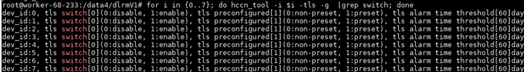
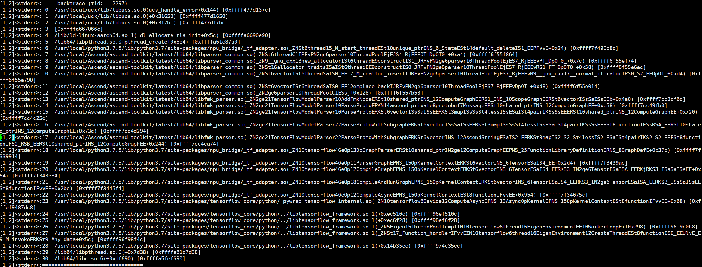

# FAQ

## HCCL Cluster Communication Fails in Multi-Node Training

**Symptom**

HCCL cluster communication fails.

**Possible Causes**

- The NPU device IP addresses in the multi-node cluster cannot be pinged from each other.
- The TLS settings of the NPU devices in the multi-node cluster are different.
- Others.

**Solution**

1. Check whether the NPU device IP addresses in the multi-node cluster can ping each other. The following example uses a two-node cluster with nodes A and B, and each node has eight cards.
    1. Query the device IP addresses on node A:

        ```bash
        for i in {0..7}; do hccn_tool -i $i -ip -g ; done
        ```

    2. Ping the device IP address of node A from node B:

        ```bash
        hccn_tool -i 0 -ping -g address 192.x.x.x
        ```

        `192.x.x.x` is the device IP address of rank 0 on node A. `0` specifies rank 0 on node B as the source device for the ping to the target IP address.

        If the command output contains `0.00% packet loss`, the ping succeeds. If the ping fails, check the network configuration of the environment.

        >[!NOTE]
        >If the device IP address is configured as IPv6, the commands for querying the device IP address and pinging the device IP address differ. Example:
        > - Query the device IP address:
        >
        > ```bash
        > for i in {0..7}; do hccn_tool -i $i -ip -inet6 -g; done
        > ```
        >
        > - Ping a specified device IP address:
        >
        > ```bash
        > hccn_tool -i 0 -ping -inet6 -g ipv6_address x:x:x:x
        > ```
        >

2. Check whether the TLS settings of the NPU devices in the multi-node cluster are the same.

    Run the following command on both nodes and check whether the configurations match:

    ```bash
    for i in {0..7}; do hccn_tool -i $i -tls -g  |grep switch; done
    ```

    If the configurations differ, modify the TLS settings.

    

    For details about setting the TLS status switch and modifying certificate information, see the "HCCL Initialization Fails Due to Inconsistent TLS Information on Servers Involved in Collective Communication" section in the *HCCL User Guide*.

3. For other collective communication issues, see the "Troubleshooting" section in the *HCCL User Guide*.

## An Error Occurs When Rec SDK TensorFlow Is Used to Train a Model in an Arm Environment

**Symptom**

When you use Rec SDK TensorFlow to train a model in an Arm environment and import the `scikit-learn` library, the following error is reported: `ImportError: /usr/local/python3.7.5/lib/python3.7/site-packages/sklearn/__check_build/../../scikit_learn.libs/libgomp-d22c30c5.so.1.0.0: cannot allocate memory in static TLS block`.

**Possible Causes**

Rec SDK TensorFlow is compiled with OpenMP. OpenMP uses Thread Local Storage, which is dynamic TLS memory space. `sklearn` needs static TLS space when it performs some parallel computing. On AArch64 machines, dynamic TLS and static TLS share the same pre-allocated pool. If you import Rec SDK TensorFlow first, it consumes too much of that pool, and `libgomp.so` does not have enough space when `sklearn` is imported.

**Solution**

In the `main.py` file of the model code, place `import sklearn` before importing Rec SDK TensorFlow so that `libgomp.so` has enough static TLS space.

## A Core Dump Occurs When a Model Is Trained with an Image That Uses glibc 2.17

**Symptom**

When you run a recommendation model in an environment whose base image is CentOS 7.6, the following stack issue occurs.



**Possible Causes**

When glibc 2.17 handles thread-local storage (TLS), concurrent execution of a large number of `dlopen`, `dlclose`, and `pthread_create` calls can cause a segmentation fault in the `_dl_allocate_tls_init` segment. For details, see the root cause, test code, and fix code in [this issue](https://sourceware.org/bugzilla/show_bug.cgi?id=19329).

**Solution**

1. glibc 2.34 has fixed this issue. You are advised to use glibc 2.34 or later to train models.
2. Refer to the fix code in [this issue](https://sourceware.org/bugzilla/show_bug.cgi?id=19329) to fix glibc in the training environment.
3. Try running `export LD_PRELOAD=/usr/lib64/libstdc++.so.6`.
