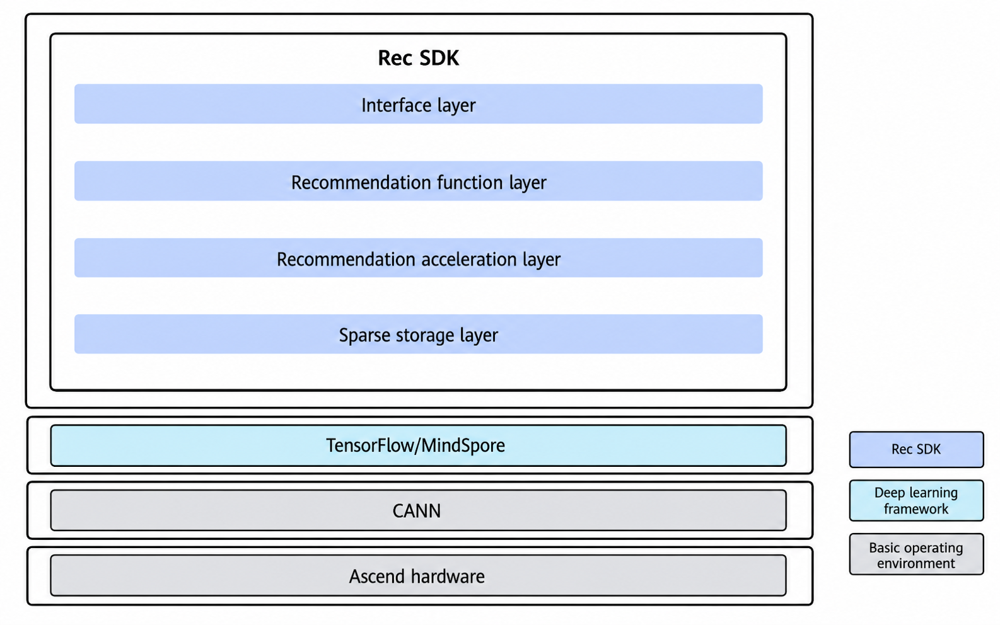

# Introduction

## Overview

Rec SDK TensorFlow provides the following functions:

- Basic model training functions: Rec SDK TensorFlow supports single-server single-device training, and single-server multi-device training, as well as model development based on TensorFlow.
- Recommendation-specific functions: Based on the sparse table solution, Rec SDK TensorFlow provides essential functions such as feature saving and loading, feature admission, and feature eviction.

**Key features**

Rec SDK TensorFlow provides functional features such as sparse table creation, sparse table query, saving and loading, and feature admission and eviction. You can incorporate the desired features into your adapted models.

- Sparse table creation

    Rec SDK TensorFlow supports sparse table creation. You can view the function description and usage examples through the [sparse table creation](api/model_apis.md#get_embedding_table) API.

- Sparse table query

    Rec SDK TensorFlow supports sparse table query. You can view the function description and usage examples through the [sparse table query](api/model_apis.md#embedding_lookup) API.

- Saving and loading

    In deep learning, saving and loading refers to the process of persistently storing trained model parameters and restoring them for use when they are needed. Saving typically includes the model architecture, weights, and optimizer state, while loading restores the model to a usable state, allowing training to resume after interruption or enabling deployment for inference.

    Rec SDK TensorFlow supports sparse table saving and loading. You can view the function description and usage examples through the [saving and loading](api/model_apis.md#embeddingtablesaver) API.

- Feature admission and eviction

    Low-frequency features often do not help training, causing memory waste and overfitting. To address this problem, the feature admission function is designed to filter out the features with low frequency. Features that are not helpful to training need to be eliminated to prevent them from affecting the training effect and to save memory. Rec SDK TensorFlow supports feature admission and eviction. You can find details in the `min_used_times` and `max_cold_secs` parameters of the [feature admission and eviction](api/model_apis.md#get_embedding_table) API.

## Software Architecture

Built upon mainstream recommendation frameworks, CANN, and diverse hardware and network architectures, Rec SDK TensorFlow addresses the specific requirements of search, recommendation, and advertising model training. It provides high-performance, streamlined APIs designed for ease of use, enabling Ascend AI Processors to achieve highly efficient training for search, recommendation, and advertising models.

**Table 1** Modules in the architecture diagram

|Rec SDK TensorFlow Module|Description|
|--|--|
|API layer|Provides easy-to-use APIs to simplify customer access and support service growth.|
|Recommendation function layer|Provides core capabilities to meet customer requirements.|
|Recommendation acceleration layer|Provides core components to build performance competitiveness and offer superb performance for the entire system.|
|Sparse storage layer|Supports large-scale sparse table storage of more than 10 TB.|

## Supported Hardware and OSs

**Table 2**  Supported products

|Product|Architecture|OS Version|
|--|--|--|
|Atlas 800T A2 training server Atlas 200T A2 Box16 heterogeneous subrack|<li>Arm</li><li>x86_64</li>|<li>CentOS 7.6</li><li>openEuler 22.03</li><li>Ubuntu 20.04</li>|
|Atlas 900 A3 SuperPoD|Arm|openEuler 22.03|
