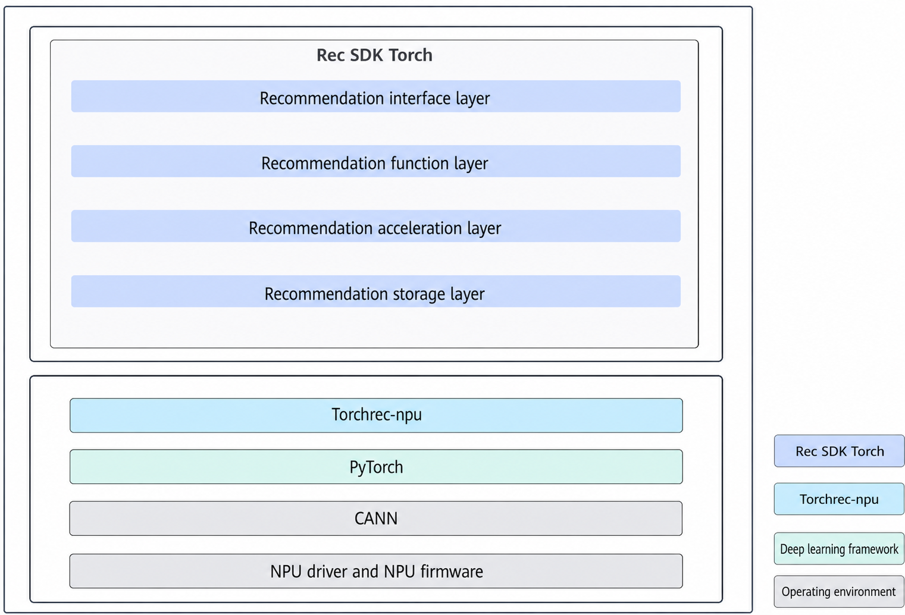

# Introduction

## Overview

Rec SDK Torch provides the following functions:

- Basic model training functions:
    - Rec SDK supports single-node, single-device training and single-node, multi-device distributed training.
    - Models developed based on Torch are supported.

- Recommendation-specific functions:

    Based on the sparse table solution, Rec SDK Torch provides the essential functions required for recommendation, such as non-affine operator offloading and hash mapping.

- Large-scale sparse table functions:

    Rec SDK Torch supports row-wise distributed sparse table sharding.

**Key features**

Rec SDK Torch provides capabilities such as hash mapping, row-wise table sharding, EBC lookup, pipeline lookup, and lookup fusion operators.

- Hash mapping

    Torch provides `nn.Embedding` for dense ID lookup. In recommendation scenarios, most raw feature IDs are discrete, which makes direct lookup inconvenient. A common practice is to convert discrete IDs to table row indexes. To support this, Rec SDK Torch provides hash mapping to map discrete IDs to embedding table row indexes without requiring users to convert IDs in advance.

- EBC lookup

    This corresponds to the native Torch `nn.EmbeddingBag` function. For multiple specified IDs, Rec SDK Torch performs pooling by summing or averaging during lookup.

- Row-wise sharding

    When embeddings are sharded across different tables, Rec SDK Torch partitions embeddings by row and uses a modulo-based bucketing strategy to determine the bucket position of an embedding in the table from the remainder of its ID.

- Pipeline lookup

    A Rec SDK Torch lookup task consists of multiple subtasks, including communication, CPU computation, and NPU computation. Rec SDK Torch provides a pipeline lookup method so that these subtasks can run in parallel and fully use hardware computing power.

- Lookup fusion operator

    Rec SDK Torch provides lookup operators with fused gradient calculation and optimizer logic to improve lookup performance.

## Software Architecture

**Figure 1** Software architecture

Built upon TorchRec, mainstream recommendation frameworks, CANN, and diverse hardware and network architectures, Rec SDK Torch addresses the specific requirements of search, recommendation, and advertising model training. It provides high-performance, streamlined APIs designed for ease of use, enabling Ascend AI Processors to achieve highly efficient training for search, recommendation, and advertising models.

**Table 1** Modules in the architecture diagram

|Rec SDK Torch Module|Description|
|--|--|
|Recommendation API layer|Provides easy-to-use APIs to simplify customer access and support service growth.|
|Recommendation function layer|Provides core capabilities to meet customer requirements.|
|Recommendation acceleration layer|Provides core components to build performance competitiveness and offer superb performance for the entire system.|
|Recommendation storage layer|Supports distributed storage of sparse tables.|
|TorchRec-npu|Ascend adaptation layer for open-source TorchRec.|

## Supported Hardware and OSs

**Table 2** Supported products
<table border="1">
  <tr>
    <th>Product</th>
    <th>Architecture</th>
    <th>OS Version</th>
  </tr>
  <tr>
    <td rowspan="2">
Atlas 800T A2 training server

Atlas 200T A2 Box16 heterogeneous subrack
</td>
    <td>x86_64</td>
    <td>Debian version: 12 CentOS version: 7.6</td>
  </tr>
  <tr>
    <td>Arm</td>
    <td>openEuler version: 22.03</td>
  </tr>
</table>
