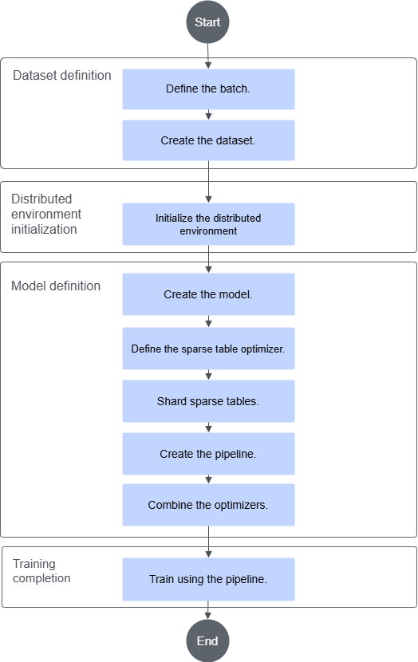

# Quick Start

## Before You Start

This section provides a small demo that guides you through building a model with Rec SDK Torch. The demo is available at [Rec SDK Torch Little Demo Sample](https://gitcode.com/Ascend/RecSDK/tree/develop_examples_and_tools/torch_examples/little_demo).

**Table 1**  little-demo file description

|File|Description|
|--|-----|
|main.py|Entry point for model training|
|dataset.py|Dataset generation|
|model.py|Model file|
|bash.sh|Startup script|
|README.md|Demo model running instructions|

## Interface Call Introduction

**Figure 1** Interface call process


The following steps omit implementation details. For the complete code, see [Rec SDK Torch Little Demo Sample](https://gitcode.com/Ascend/RecSDK/tree/develop_examples_and_tools/torch_examples/little_demo). The key steps are as follows:

1. <a id="li524311501994"></a>Define `Batch`.

    Combine all features required for this training run into a `Batch` class, and implement the `to()`, `pin_memory()`, and `record_stream()` methods.

    ```python
    @dataclass
    class Batch(Pipelineable):
        ......
    ```

2. Create the dataset.

    Implement a `Dataset` that returns the `Batch` type created in [1](#li524311501994).

    ```python
    class RandomRecDataset(IterableDataset[Batch]):
        ......
    ```

3. Initialize the distributed environment.

    ```python
    ......
    device = torch.device("npu")
    dist.init_process_group(backend="hccl")
    host_gp = dist.new_group(backend="gloo")
    host_env = ShardingEnv(world_size=world_size, rank=rank, pg=host_gp)
    ```

4. Create the model.

    Combine the sparse table layer and the dense layer into a single `Module`. The input of this `Module` must be the `Batch` class created in [1](#li524311501994). Return the model loss and the output.

    ```python
    class TestModel(torch.nn.Module):
        def __init__(self, ):
            super().__init__()
            table_configs = ......
            self.ebc = HashEmbeddingBagCollection(device="npu", tables=table_configs)

        def forward(self, batch: Batch):
            return loss, result
    ```

5. Define the optimizer for the sparse table.

    ```python
    test_model = TestModel(...)

    # Optimizer
    embedding_optimizer = torch.optim.Adagrad
    optimizer_kwargs = {"lr": 0.001, "eps": 0.1}
    apply_optimizer_in_backward(
        embedding_optimizer,
        test_model.ebc.parameters(),
        optimizer_kwargs=optimizer_kwargs,
    )
    ```

6. Shard the sparse table.

    Create a sharder, and use `EmbeddingShardingPlanner` to create a sharding plan. Then pass the sharding plan and the sharder to `DistributedModelParallel` to obtain the distributed model.

    ```python
    hybrid_sharder = get_default_hybrid_sharders(host_env=host_env)
    constraints = {......}
    planner = EmbeddingShardingPlanner(......)
    plan = planner.collective_plan(test_model, hybrid_sharder, dist.GroupMember.WORLD)
    logging.info(plan)
    ddp_model = DistributedModelParallel(
        test_model, device=torch.device("npu"), plan=plan, sharders=hybrid_sharder
    )
    ```

7. Combine the optimizers.

    Separate the dense and sparse parameters, and combine them into a new optimizer.

    ```python
    # Optimizer filter
    dense_optimizer = KeyedOptimizerWrapper(
        dict(in_backward_optimizer_filter(ddp_model.named_parameters())),
        lambda params: torch.optim.Adagrad(params, lr=0.1),
    )
    optimizer = CombinedOptimizer([ddp_model.fused_optimizer, dense_optimizer])
    ```

8. Create the pipeline.

    ```python
    pipeline = HybridTrainPipelineSparseDist(
        ddp_model, optimizer, device, execute_all_batches=True
    )
    ```

9. Train using the pipeline.

    ```python
    batched_iterator = iter(data_loader)
    for i in range(...):
        output = pipeline.progress(batched_iterator)
    ```

## Model Training Startup

Model training depends on a container environment. You can quickly start the container and train the model using a prebuilt container image. You can also manually install dependencies and deploy the software in the container image environment.

### Option 1: Starting Model Training Using an Existing Container Image

1. Obtain an existing container image and start the container.

    See the **Image Download** tab page [this link](https://www.hiascend.com/developer/ascendhub/detail/9faeb4847b3e419f81b78a4d0ed574b5). Obtain the latest prebuilt running image. Start the container and enter the container by referring to **Image Overview** > **Container Startup Commands**.

2. Start model training.

    Run the following commands to download the model source code and start model training:

    ```bash
    git clone https://gitcode.com/Ascend/RecSDK.git -b develop_examples_and_tools
    cd RecSDK/torch_examples/little_demo
    export ASCEND_RT_VISIBLE_DEVICES=0,1
    bash bash.sh
    ```

### Option 2: Manually Preparing the Operating Environment and Starting Model Training

1. See the [Install Rec SDK Torch](./recsdk_torch_installation_guide.md#installing-rec-sdk-torch) section to prepare the container environment, then start and enter the container.

2. Start model training.

    Run the following commands to download the model source code and start model training:

    ```bash
    git clone https://gitcode.com/Ascend/RecSDK.git -b develop_examples_and_tools
    cd RecSDK/torch_examples/little_demo
    export ASCEND_RT_VISIBLE_DEVICES=0,1
    bash bash.sh
    ```
