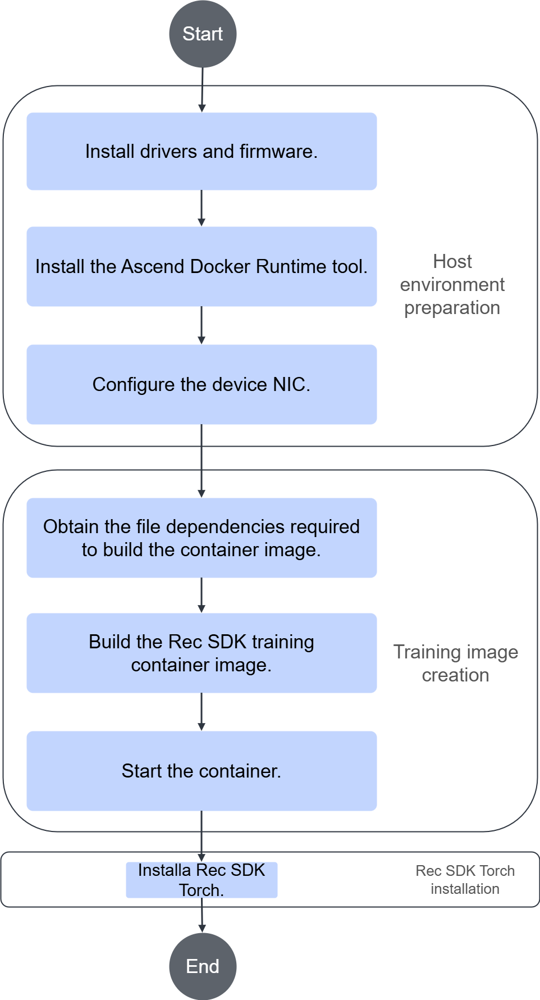

# Installation and Deployment

## Installation Instructions

You are advised to deploy the Rec SDK Torch development environment in a container. To view the historical installation records of Rec SDK Torch, see [Viewing Rec SDK Torch Installation and Uninstallation Records](../../torch/torch_rec_v2/common_operations.md).

**Precautions**

If you need to install third-party software other than the Rec SDK Torch software package, upgrade the software to the latest version in a timely manner and patch its existing vulnerabilities.

## Installation Prerequisites

Before you install the Rec SDK Torch software package, prepare the following environment dependencies and perform the listed actions. For details, see [Table 1](#table18461141184116).

**Table 1** Rec SDK Torch environment dependencies
<a id="table18461141184116"></a>

|Dependency/Operation|Recommended Version|How to Obtain|
|--|--|--|
|Ascend hardware product driver and firmware|Ascend HDK 26.0.RC1 and its patch versions|Click [this link](https://www.hiascend.com/developer/download/commercial/result?module=cann), configure the package in **Edit Resource Selection** under supporting resources on the left, filter the required software package, and obtain the package after you confirm the version information.<br>For driver and firmware installation, see the [driver and firmware installation and upgrade guides](https://support.huawei.com/enterprise/en/ascend-computing/ascend-hdk-pid-252764743) that come with the hardware product.|
|Ascend Docker Runtime|MindCluster 7.3.0|For details, see the **Installation** > **Installation Deployment** section of the [MindCluster Cluster Scheduling User Guide](https://www.hiascend.com/document/detail/zh/mindcluster/730/clustersched/dlug/dlug_installation_017.html).|
|Configuring the device NIC|-|Refer to the training node configuration example in the parameter network configuration section of the [Ascend Training Solution Networking Guide](https://support.huawei.com/enterprise/zh/doc/EDOC1100349028/d9914967), and configure the device IP address of the NPU network port with HCCN_Tool.|
|CANN package|CANN 9.0.0|Click [this link](https://www.hiascend.com/developer/download/commercial/result?module=cann), configure the package in **Edit Resource Selection** under supporting resources on the left, filter the required software package, and obtain the package after you confirm the version information.<br>|
|PyTorch Ascend adaptation plugin|2.7.1|Click [this link](https://pytorch-package.obs.cn-north-4.myhuaweicloud.com/pta/Daily/v2.7.1/20260327.4/pytorch_v2.7.1_py311.tar.gz), obtain the `torch_npu-2.7.1*-cp311-*.whl` package according to the device architecture, and install it in the container.|

> [!NOTE]NOTE
>For open-source and third-party software that you integrate, track vulnerabilities and issues in the community and fix them in a timely manner. You can check the [CVE website](https://www.cve.org/) for known vulnerabilities in the corresponding open-source software version, and fix them by upgrading versions or applying patch packages.

## Obtaining the Rec SDK Torch Software Package

### Installing from Source

> [!NOTE]
> The `build_wrapper.sh` script is updated with the resource download center. Currently, you are advised to install from source by referring to [README](https://gitcode.com/Ascend/RecSDK/blob/develop/training/torch_rec_v2/torchrec_npu/README.md).

Before you build the source code, follow the [CANN Software Installation Guide](https://www.hiascend.com/document/detail/zh/CANNCommunityEdition/900beta1/softwareinst/instg/instg_0000.html?Mode=PmIns&InstallType=local&OS=Ubuntu) to install the CANN development kit software package. Then, follow the [Ascend Extension for PyTorch Installation Guide](https://www.hiascend.com/document/detail/zh/Pytorch/730/configandinstg/instg/docs/zh/installation_guide/installation_via_binary_package.md) to install the PyTorch framework plugin package for Ascend adaptation.

Source packages to build are as follows.

| Name                                      | Description             |
|------------------------------------------|-----------------|
| torch_rec_v2-*.tar.gz     | Rec SDK Torch package, which includes the TorchRec Ascend registration package|
| rec_ops-*.whl | Custom operator package            |
| fbgemm_ascend-*.whl                     | fbgemm custom operator package and the PyTorch framework adaptation layer          |
| HierarchicalKV_ascend                     | HKV operator package          |

1. Set up the build environment.

   Build in the container environment. See [README](../build_torch_rec_v2_images/README.md).

2. Build `torch_rec_v2-*.tar.gz`.

   Go to the `RecSDK` directory.

   To compile and install the software package, refer to the `build/build_wrapper/torch_rec_v2/build_wrapper.sh` script and run the script to build the software package. After the build is successful, the software package is stored in the `build/output` subdirectory.

   ```bash
   # Build the package.
   bash build/build_wrapper/torch_rec_v2/build_wrapper.sh

   # Install the package.
   pip3 uninstall -y torch_rec_v2
   pip3 install build/output/torch_rec_v2*.tar.gz
   ```

   > [!NOTE]
   > The TorchRec Ascend registration package adapts the NPU device based on the TorchRec source code. When you build and install the Rec SDK Torch recommendation framework package, the TorchRec Ascend registration package is installed at the same time.
   > If you need to build and install it separately, you can use the patch file provided by Rec SDK Torch and a fixed branch of the TorchRec source code to build the registration package.
   > See the [README](https://gitcode.com/Ascend/RecSDK/blob/develop/training/torch_rec_v2/torchrec_npu/README.md) for source build and installation.

3. Build custom operators.

   See the corresponding [README](../../../../cust_op/ascendc_op/build/README.md).

4. Build the `fbgemm_ascend` operator and its adaptation layer.

   See the [README](https://gitcode.com/Ascend/fbgemm-ascend/blob/main/README.md) for `fbgemm_ascend` to build and install it from source.

5. Build and install the HKV operator package.

   The `torch_rec_v2-*.tar.gz` package already includes the HKV operator package. If you need to build and install it separately, see the [README](https://gitcode.com/Ascend/HierarchicalKV-ascend/blob/develop/README.md) to install from source.

**Version Mapping<a name="section146113514599"></a>**

The current dynamic sparse table Rec SDK Torch supports the following compatible versions.

|PyTorch|PyTorch Ascend Adaptation Plugin|Rec SDK Torch|
|--|--|--|
|2.7.1|2.7.1|25.09|

For other compatible software version information, see [Building the Base Image](../build_torch_rec_v2_images/README.md).

**Downloading the Software Package**

Refer to this section to obtain the required software package and the corresponding digital signature file. By downloading the software, you agree to the terms and conditions of [Huawei Enterprise End User License Agreement (EULA)](https://e.huawei.com/en/about/eula).

> [!NOTE]
> The current release software package is the Rec SDK .whl package. The one-click installation and deployment software package will be updated after the resource download center is launched.

|Component|Software Package|Link|
|--|--|--|
|Rec SDK|Development kit of the recommendation algorithm framework.|[Link](https://gitcode.com/Ascend/RecSDK/releases)|

>[!NOTE]
>The current development kit package for the Rec SDK recommendation framework is built with Python 3.11. Install and use it in the same Python version environment. If you need to install and use it in a different Python version environment, see [README](https://gitcode.com/Ascend/RecSDK/blob/develop/training/torch_rec_v2/dynamic_emb/README.md) to build from source.

**Verifying the Software Digital Signature**

To prevent malicious tampering during transmission or storage, use the `sha256sum` command after you download the software package to verify the hash value.

**Software Package Contents**

|Component|Software Package|
|--|--|
|torch_rec_v2-*.tar.gz|Rec SDK Torch package|

## Deploying the Development Environment in a Container

### Using a Container to Deploy the Development Environment

You can deploy the Rec SDK Torch development environment in a container by following the steps in [Figure 1](#fig1345216415476).

Figure 1 Development environment configuration and training image build inside the container<a id="fig1345216415476"></a>


**Key steps**

1. Prepare the host machine environment. See [Installation Prerequisites](#installation-prerequisites) to deploy the host environment.
2. Build the base image. See [Creating a training image with Debian 12](../build_torch_rec_v2_images/README.md).
3. Start the container. See [Starting the Container](#section12808621121114).
4. Install Rec SDK Torch. See [Installing Rec SDK Torch](#section182972951211).

### Building a Rec SDK Torch Training Image

**Creating a training image with Debian 12**

Use the Dockerfile and README in [Building the Base Image](../build_torch_rec_v2_images/README.md) to create the image.

**Starting the Container<a id="section12808621121114"></a>**

```bash
#!/bin/bash
container_name=$1
image_name=$2
docker run \
-it \
--name ${container_name} \
--shm-size="300g" \
-m 300g \
-v /etc/localtime:/etc/localtime:ro \
-e ASCEND_VISIBLE_DEVICES=0-7 \
-v /etc/ascend_install.info:/etc/ascend_install.info:ro \
-v /usr/local/Ascend/driver:/usr/local/Ascend/driver:ro \
${image_name} \
/bin/bash
```

>[!NOTE]
>Some parameters are as follows:
>
>- `-m 300g` sets the maximum amount of memory that can be used in the container to 300 GB. Adjust it as required.
>- `-e ASCEND_VISIBLE_DEVICES=0-7` mounts NPU devices `device0` to `device7` from the server into the container. Adjust it as required.

**Installing Rec SDK Torch<a id="section182972951211"></a>**

1. Refer to [Obtaining the Rec SDK Torch Package](#obtaining-the-rec-sdk-torch-software-package) to obtain the Rec SDK Torch package.
2. Copy the package into the container. You can use one of the following methods:
    - Method 1: When you start the container, mount a host machine directory into the container and place the downloaded package in that directory so the container can access it.

        Example Docker parameter for mounting a host machine directory into a container:

        ```bash
        -v /dir1:/dir1
        ```

    - Method 2: On the host machine, use the `docker cp` command to copy the package into the container.

        Example of the `docker cp` command:

        ```bash
        docker cp {host_file_path} {container_name}:{container_file_path}
        ```

        Here, `host_file_path` is the file path on the host machine. `container_name` is the name of the Docker container into which you want to copy the file. `container_file_path` is the file path inside the Docker container.

3. Build and install the package by following these steps.

    1. Install `torch_rec_v2-{version}-{arch}.tar.gz`.

        ```bash
        # Install the Rec SDK Torch package.
        pip3 uninstall -y torch_rec_v2
        pip3 install torch_rec_v2-{version}-{arch}.tar.gz
        ```

        `{version}` indicates the version number, and `{arch}` indicates the OS architecture. Replace them with the actual ones.

    2. Install packages related to custom operators.

       See the [Installation Guide](https://gitcode.com/Ascend/fbgemm-ascend/blob/main/README.md) for `fbgemm_ascend` to obtain the `fbgemm_ascend` operator package.

       > [!NOTE]
       > The `fbgemm_ascend` wheel package and the `rec_ops` wheel package will be updated after the resource download center goes live.

       ```bash
       # # Install the framework dependency operator package fbgemm_ascend.
       pip3 install fbgemm_ascend-*.whl
       # # Install the custom operator package rec_ops.
       pip3 install rec_ops-*.whl
       ```

## Configuring Environment Variables

[Table 1](#table126401659163820) describes the environment variables for Rec SDK Torch.

**Table 1** Environment variables
<a id="table126401659163820"></a>

|Environment Variable|Meaning|Mandatory/Optional|Description|
|--|--|--|--|
|ASCEND_RT_VISIBLE_DEVICES|Devices visible to the Ascend processor, which specify that the program uses only some of them.|Optional|Use the `ASCEND_RT_VISIBLE_DEVICES` environment variable to specify the NPU devices used for training. You can run `ls /dev/ \| grep davinci*` to query the NPU devices on the host. Specify devices by serial number. Single values, ranges, and mixed forms are supported. For example:<ul><li>`ASCEND_RT_VISIBLE_DEVICES=0` mounts device 0 (`/dev/davinci0`) into the container. </li><li>`ASCEND_RT_VISIBLE_DEVICES=1,3` mounts devices 1 and 3 into the container. </li><li>`ASCEND_RT_VISIBLE_DEVICES=0-2` mounts devices 0 to 2, inclusive, into the container. This has the same effect as `ASCEND_RT_VISIBLE_DEVICES=0,1,2`. </li><li>`ASCEND_RT_VISIBLE_DEVICES=0-2,4` mounts devices 0 to 2 and device 4 into the container. This has the same effect as `ASCEND_RT_VISIBLE_DEVICES=0,1,2,4`.</li></ul>|
|ASCEND_CANN_PACKAGE_PATH ASCEND_HOME_PATH|Actual installation path of the CANN package.|Mandatory|The actual installation directory of the CANN package required for operator builds. The default value is `/usr/local/Ascend/ascend-toolkit/latest`.|

## Uninstallation

If you need to remove the Rec SDK Torch software package, run the following command:

```bash
# Uninstall the Rec SDK Torch main package and the TorchRec Ascend registration package together.
pip3 uninstall torch_rec_v2 -y

# Uninstall for installation using a release package.
pip uninstall rec_ops
pip uninstall fbgemm_ascend
```

## Upgrading

If you need to upgrade the current version of Rec SDK Torch to the latest version, upload the latest Rec SDK Torch software package to the installation environment, then run a command in the directory that contains the software package. See the following commands:

1. When you upgrade Rec SDK Torch to a new version, you must uninstall the old version first. For details, see [Uninstallation](#uninstallation).
2. Reinstall Rec SDK Torch by referring to [Installing Rec SDK Torch](#section182972951211).
