# 性能调优<a name="ZH-CN_TOPIC_0000002412005857"></a>

## 性能调优流程<a name="ZH-CN_TOPIC_0000002414255969"></a>

在计算越来越重要的今天，以GPU（Graphics Processing Unit）和NPU（Neural Network Processing Unit）为代表的并行计算设备，在人工智能和其他行业，都扮演着重要角色。计算的效率，或者称之为计算的性能，越来越得到广泛关注。

本章节以性能的含义以及性能工具等基础概念介绍为出发点，介绍了训练模型在昇腾设备上的通用性能调优方法。对应的性能调优流程如[图1](#fig87871647115415)所示。

**图 1**  性能调优流程图<a id="fig87871647115415"></a>  
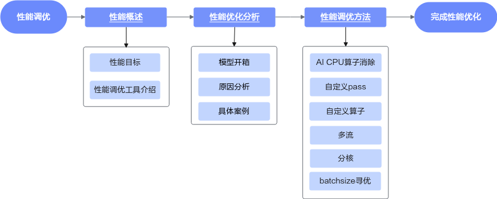


## 性能指标<a name="ZH-CN_TOPIC_0000002414375817"></a>

需要对齐如下关键指标：

-   单卡/多卡场景：单卡场景验证时按照客户配置，在Docker中切分CPU资源进行验证；多卡场景可能会出现CPU bound，前期调试需确认CPU资源是否已满足需求。
-   时延要求：要求某个固定值，或是变化值；以及低负载和高负载的要求标准。
-   batchsize分布情况：要求固定值，或是动态值以及batchsize分布情况。
-   QPS（Queries Per Second，每秒钟请求量）：请求次数是间隔时间内请求的总量，QPS=请求数/秒（req/sec ）。
-   吞吐量：定义为网络模型在单位时间（例如1s）内可以处理的最大样本数据量，吞吐量=QPS\*batchsize。
-   数据类型：float16、float32或者其他类型。

### 性能调优工具介绍<a name="ZH-CN_TOPIC_0000002380656610"></a>

#### msprof工具介绍<a name="ZH-CN_TOPIC_0000002380816482"></a>

##### PyTorch专用的性能采集<a name="ZH-CN_TOPIC_0000002414255973"></a>

PyTorch推荐使用接口进行性能采集，采集完之后会自动解析性能数据，详细请参考《CANN 性能调优工具用户指南》中的“msprof采集通用命令”。

完整示例如下：

```bash
import torch
import torch_npu
device = torch.device("npu")
class DemoModel(torch.nn.Module):
    def forward(self, in0, in1):
        mul0 = in0 * in1
        sub0 = mul0 ** 2 - in0
        sub1 = mul0 ** 2 - in1
        slice0 = sub0[:, :2]
        slice1 = sub1[:, 2:]
        cat0 = torch.cat([slice0, slice1], dim=1)
        return cat0
def main():
    torch.manual_seed(2025)
    in0 = torch.randn(3,5).to(device)
    in1 = torch.randn(3,5).to(device)
    model = DemoModel().to(device)
    output = model(in0, in1)
    print(output.shape)
    print(output.device)
    print(output)
    # perf code
    experimental_config = torch_npu.profiler._ExperimentalConfig(
        export_type=[
            torch_npu.profiler.ExportType.Text,
            torch_npu.profiler.ExportType.Db
            ],
        profiler_level=torch_npu.profiler.ProfilerLevel.Level1,
        msprof_tx=False,
        aic_metrics=torch_npu.profiler.AiCMetrics.AiCoreNone,
        l2_cache=False,
        op_attr=False,
        data_simplification=False,
        record_op_args=False,
        gc_detect_threshold=None
    )
    steps = 10
    with torch_npu.profiler.profile(
        activities=[
            torch_npu.profiler.ProfilerActivity.CPU,
            torch_npu.profiler.ProfilerActivity.NPU
            ],
        schedule=torch_npu.profiler.schedule(wait=3, warmup=0, active=1, repeat=1, skip_first=1),
        on_trace_ready=torch_npu.profiler.tensorboard_trace_handler("./result"),
        record_shapes=False,
        profile_memory=False,
        with_stack=False,
        with_modules=False,
        with_flops=False,
        experimental_config=experimental_config) as prof:
        print("profiling start...")
        for step in range(steps):
            output = model(in0, in1)
            prof.step()
if __name__ == "__main__":
    main()
```


##### TensorFlow和PyTorch的性能采集<a name="ZH-CN_TOPIC_0000002414375821"></a>

TensorFlow下没有接口可以直接调用，需要使用msprof命令进行采集，一般使用动态采集，方便控制采集数据量；详细请参考《CANN 性能调优工具用户指南》中的“动态采集性能数据”。

示例代码如下：

```bash
import npu_device
from npu_device.compat.v1.npu_init import *
import numpy as np
import tensorflow as tf
tf.compat.v1.disable_eager_execution()
session_config = tf.compat.v1.ConfigProto()
custom_op = session_config.graph_options.rewrite_options.custom_optimizers.add()
custom_op.name = "NpuOptimizer"
custom_op.parameter_map["graph_max_parallel_model_num"].i = 1
custom_op.parameter_map["aicore_num"].s = tf.compat.as_bytes("7|10")
session_config.graph_options.rewrite_options.remapping = RewriterConfig.OFF
left_shape = [1, 8000]
right_shape = [800, 1]
x = tf.compat.v1.placeholder(tf.int64, shape=left_shape)
y = tf.compat.v1.placeholder(tf.int64, shape=right_shape)
equal_ret = tf.math.equal(x, y)
inputs_x = np.random.rand(*left_shape)
inputs_x = inputs_x.astype(np.int64)
inputs_y = np.random.rand(*right_shape)
inputs_y = inputs_y.astype(np.int64)
with tf.compat.v1.Session(config=session_config) as sess:
  for i in range(100000):
    result = sess.run(equal_ret, feed_dict={x:inputs_x, y:inputs_y})
    
print(result)
```

1.  需要在循环运行推理，然后再模型开始推理一小段时间后，自行获取运行程序的pid，比如本次为9527，则运行如下命令动态采集命令采集数据

    ```bash
    msprof --dynamic=on --pid=9527 --output=/home/projects/output --model-execution=on --runtime-api=on --aicpu=on
    > start
        
    ...
    > stop
       
    ...
    > quit
    ```

    其中start命令之后，为动态采集的时间窗，到输入stop命令时结束采集；

2.  采集出数据后，还需要手动解析，进入到上一步采集的目录（一般是一个带有时间戳的目录），使用以下命令解析数据

    ```cpp
    // 启用解析并将profiling输出到当前目录
    msprof --parse=on --output=./
    // 启用导出，并将结果以CSV格式保存到当前目录
    msprof --export=on --output=. --summary-format=csv
    ```

    >[!NOTE] 说明 
    >采集时间过长，解析时间会很长，需要适当控制采集时间，一般采集5s就可以进行数据分析。


#### GE DUMP介绍<a name="ZH-CN_TOPIC_0000002380656614"></a>

执行图的分析，要基于GE优化过后的图，需要通过配置相关环境变量dump下来。

涉及的环境变量有DUMP\_GE\_GRAPH、DUMP\_GRAPH\_LEVEL、DUMP\_GRAPH\_PATH，详细请参考《CANN 环境变量参考》中的“图编译”。

常用配置为DUMP\_GE\_GRAPH=2、DUMP\_GRAPH\_LEVEL=2。

在dump图文件夹下，会生成若干张pbtxt/pb，其均为在图优化过程中各个阶段执行完后，按顺序生成。例如ge\_onnx\_00000101\_graph\_0\_Build.pbtxt中00000101为这个序号，后面的graph\_0的0代表rank id，在推荐推理场景恒为0。这里的build图对应的就是执行阶段的图，在需要通过profiling与该图对应的网络结构，分析优化空间。

[msIT工具](https://gitcode.com/Ascend/msit/blob/master/msit/docs/graph/README.md)：dump出GE图，再用工具的msit graph功能，扫描重复结构，重复出现次数多，且占比较大的子结构，可以考虑手写融合pass和融合算子进行优化，其中也有子图抽取功能，比如图太大打不开的场景，可以抽取某块子图打开来分析，推荐使用第三方网络可视化工具：[netron.app](https://netron.app/)。


## 性能优化分析<a name="ZH-CN_TOPIC_0000002380816486"></a>

可能涉及的软件栈主要是PyTorch和TensorFlow，在这两种场景下，也有可能根据客户的实际使用场景，衍生出不同的框架，这里只介绍这套软件栈的基础流程。

### PyTorch技术栈<a name="ZH-CN_TOPIC_0000002414255977"></a>

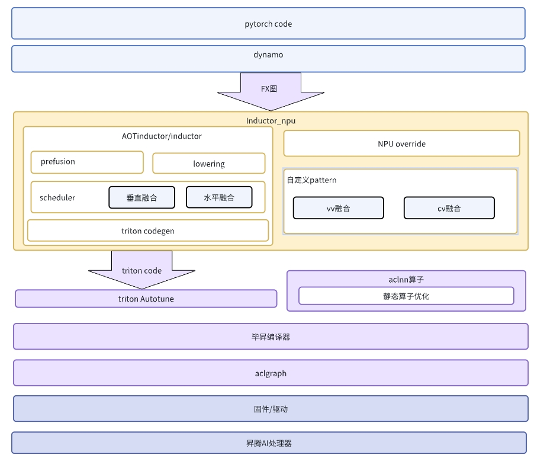


### TensorFlow技术栈<a name="ZH-CN_TOPIC_0000002414375825"></a>

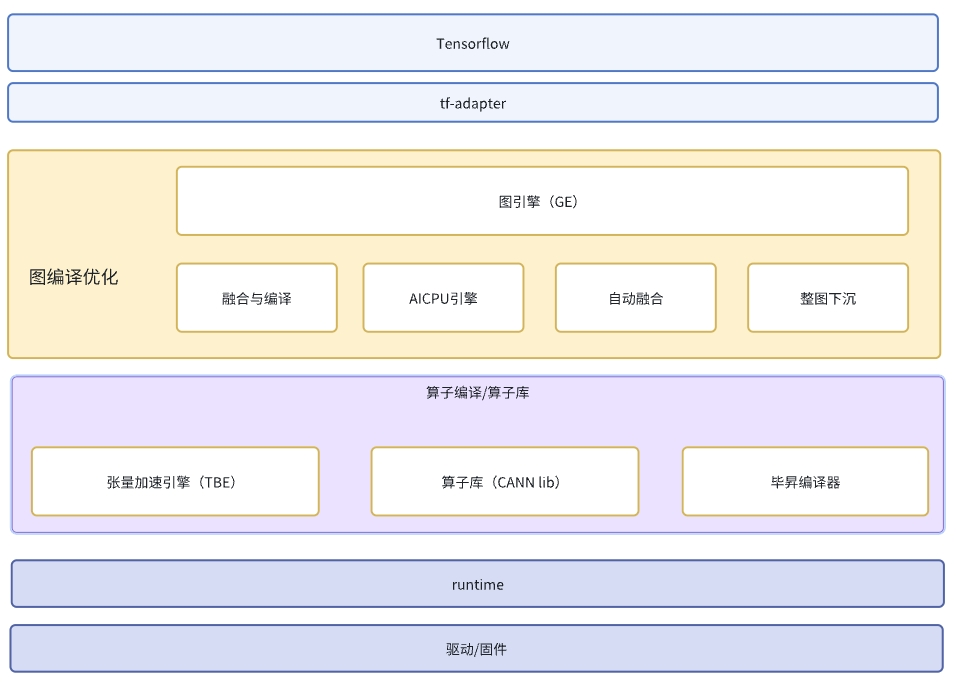


### 开箱<a name="ZH-CN_TOPIC_0000002380656618"></a>

启动客户模型时，具体使用TensorFlow技术栈或是PyTorch技术栈通常取决于客户的需求，开箱软件栈的选择应基于客户的推理框架流程。

-   使用TensorFlow框架，客户通常会提供一个pb文件，可以根据客户的软件栈运行模型，可参考社区上的demo（[TF推理样例参考](https://www.hiascend.com/document/detail/zh/TensorFlowCommunity/82RC1alpha002/migration/tfmigr1/atlastfserv_26_0006.html)）。
-   使用PyTorch路线，可以使用TorchAir套件进行推理，参考社区上的demo\([TorchAir推理样例](https://www.hiascend.com/document/detail/zh/Pytorch/710/modthirdparty/torchairuseguide/torchair_00005.html)\)。
-   使用生态路线，即使用Inductor+Triton这套流程。完成开箱后，可以初步观察到性能基线，并与目标进行对比，同时参考本文前述章节中的profiling采集方法进行后续分析。


### 不同的瓶颈点<a name="ZH-CN_TOPIC_0000002380816490"></a>

下面尝试举例几种理想的场景进行分析，实际中大部分情况是解决完一个bound，又会出现另一个bound，或者混杂到一起的场景；没有出现bound可能是NPU利用率没有打满，可以先构造压力打满的场景（如本地压测脚本，多流大压力跑本模型），再分析瓶颈点。

#### cube/vector<a name="ZH-CN_TOPIC_0000002414255981"></a>

程序性能由计算核心（Kernel）的执行时间主导，可以通过以下几处查看是否bound。

1.  npu-smi info查看利用率，如果利用率很高则很有可能就是bound，也有可能前期跑单个推理利用率比较低，多个推理并行时，利用率超过80%（一般认为这个值就已经很高了）；这种方式查看到的值是cube核上的cycle与时钟频率换算出来的cycle的比值，不包含vector core的占比，所以这个值是个初步查看，具体的需要从profiling里面的cycle自行计算；

    通过profiling计算利用率，以下图为例：

    

2.  按照算子type筛选，比如这里筛选AI\_CORE，就是计算CUBE的利用率。
3.  按照start time排序，计算第一个和最后一个时间戳的差值，就是这一整段的所有耗时。
4.  CUBE的总cycle数就是aic\_total\_cycles数求和。
5.  利用率为③/\(②/1000000\*20\*1650\*1000000\)。其中②的单位是us，所以除以1000000转换成s；20是具体芯片的ai\_core数量；1650是当前芯片的频率，单位为MHz/s，所以需要乘以1000000。

    这里计算出来的利用率是cube整体利用率的78.9%。

6.  计算过程中各流程的占比直接用时间可以算出来。比如mte2耗时占比为ai\_core总耗时的70.18%，可以推断出ai\_core上的耗时内存搬入占大头。

cube/vector bound场景下的优化手段：

-   图优化，比如torch.compile或者TensorFlow的xla。
-   算子融合，可以减少算子启动开销和算子中间读写。
-   数据类型，如本来是float32降低到HF32，相同数据，计算量将减少（可能影响精度，要做好精度测试）。其中，HF32数据类型仅针对Conv类算子与Matmul类算子生效。


#### host<a name="ZH-CN_TOPIC_0000002414375829"></a>

**分析过程<a name="section12759386573"></a>**

profiling的timeline文件，通过chrome://tracing/网页打开，可以看到类似这种的算子下发。

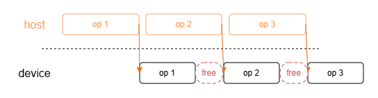

如上图所示，device上存在大量气泡，卡算力未用满。

这种情况一般见于动态图场景或者单算子下发场景，依赖host侧处理计算完成后，再下发单个算子，同时算子执行时间小于host侧处理时间；

host侧有计算工作量的，通过TensorFlow原生的Profiler工具导出，查看host和device耗时占比，以及CPU利用率判断；混合计算开启后（可参考：[www.hiascend.com](https://www.hiascend.com/document/detail/zh/TensorFlowCommunity/82RC1alpha003/migration/tfmigr1/tfmigr1_000074.html)），系统会自动把不能在device侧执行的算子留在host侧执行，也可以根据用户配置指定某些算子不下沉到device上，从而导致host计算量变高。可以通过TensorFlow原生的Profiler工具，抓取整个session-\>run的性能（参考[www.tensorflow.org](https://www.tensorflow.org/guide/profiler?hl=zh-cn#%25E6%25A6%2582%25E8%25A7%2588%25E9%25A1%25B5%25E9%259D%25A2)），分析host侧与device侧耗时占比。

**解决方案<a name="section7313618185710"></a>**

-   单算子下发方案替换成整图下沉。
-   动态图转静态图。
-   增大batchsize，增加算子执行时间，减少free的缝隙时间占比。
-   host侧性能提升，CPU利用率过高的话，则要考虑CPU侧的一些优化。
-   集群方式部署，保证host侧资源足够。
-   单机器部署可以考虑非host bound模型和host bound模型混布。


#### PCIe<a name="ZH-CN_TOPIC_0000002380656622"></a>

最简单就是增大压力，PCIe时间明显变长，其他时间变化不大；

PCIe的耗时在timeline文件中的耗时就是图中的model@inputcopy。

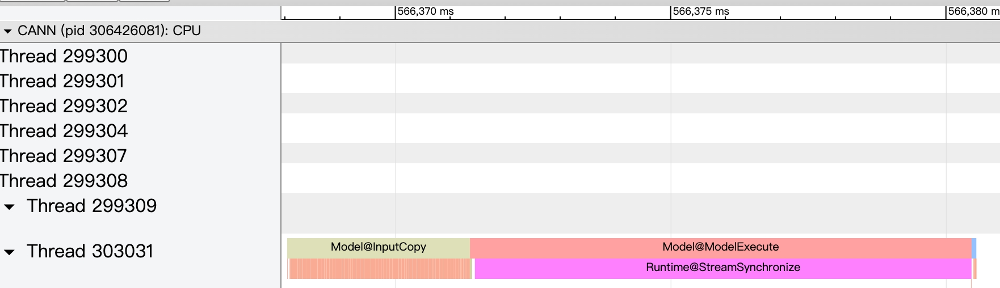

实际速率指标：通过summary信息在pcie\_\*.csv文件汇总（profiling抓PCIe信息，参考：[www.hiascend.com](https://www.hiascend.com/document/detail/zh/canncommercial/82RC1/devaids/Profiling/atlasprofiling_16_0012.html)，相关变量为--sys-interconnection-profiling）；比如下图中的Tx\_p\_avg就是input的数据，平均速率为99.628MB/s。


理论数据计算：假设是PCIe5.0版本，每条PCIe Lane的双向传输速率接近 8GB/s，一般卡是x4的接口，则理论最大速率接近32GB/s，实际根据传输的文件大小不同，速率不一样；一般认为最大能达到80%的理论带宽；实际带宽根据发送数据的shape和大小强相关。

**分析方向<a name="section1960542154611"></a>**

1.  一个CPU对应多少张卡，是否可以通过numa node节点绑定等操作，减少PCIe抢占带来的耗时
2.  增大batchsize，减少PCIe传输头开销的占比
3.  数据格式，从float32降低到float16也能有效解决（需要关注精度是否达标，或者客户接受）
4.  host侧先把数据攒到一起，把小份数据传输转换为大份数据传输（GE框架已自带该功能，如果客户调用aclrt接口需要自己实现）


#### 访存<a name="ZH-CN_TOPIC_0000002380816494"></a>

主要是针对vector算子或者cube算子的内存搬入或者搬出，会存在访存bound。

1.  一般可以通过profiling文件，根据每个算子的数据搬运量和其消耗在搬运上的时间，来计算访存速率，判断是否存在访存bound。

    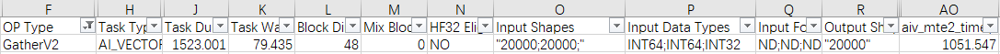

    如上图所示，input的数据量是20000/48\*2\*8=6.5KB。其中，48是因为数据被分配到48个核上、2表示有两个20000的shape、8表示int64、mte2时间为1051us，所以计算其带宽为0.005GB/s。这个带宽远不达理论带宽，肯定是有问题的。

2.  直接通过profiling文件的aiv\_mte2\_ratio字段，判断是否超过0.8。如果有大量超过0.8的算子出现，则这一部分是需要进行优化的，如下图所示：

    

**分析方向<a name="section1559362095619"></a>**

1.  需要分析耗时是否合理
2.  vector算子融合，可以有效减少需要拷贝的数据量，从而释放访存压力
3.  排查搬运的数据量是否非32byte对齐，非对齐场景也会导致带宽低，也需要在算子内做特殊处理


### 案例分享1<a name="ZH-CN_TOPIC_0000002414255985"></a>

**背景描述<a name="section137426914212"></a>**

该客户的数据是从大盘分配固定百分比的流量，到某一个集群中，这个集群中有若干数量的NPU卡来处理这些请求，性能调优以降低这个集群中的卡的数量，且同时保证处理请求的时延不超标为目标。

**分析过程<a name="section1868616174234"></a>**

本地测试数据 ---\> step1：

1.  batching策略是在客户的服务端框架做的，可以通过参数，修改其攒batch时间，和档位；
2.  最大档位意思是从1到该最大档位中间每个bs都配置成档位；
3.  流数则表示一张NPU卡上的实例数，即最大可以几个推理任务同时并行跑；
4.  分核第一个数字是cube数量，第二个数字是vector数量；
5.  最后三列性能均是通过1000/平均时间\*流数算出来的QPS值。

    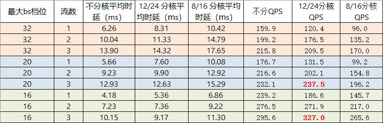

    通过上面数据表格，可以看到最大档位为16bs，流数为3时，QPS最高。需要注意的是，这个数据本身是本地均匀压力测试，bs分布不代表线上真实情况，所以跟线上实际表现，不一定完全一致，只能作为定向的分析手段。

线上bs分布 ---\> step2：

从线上环境抓取的bs数据如下，可以看到大多数bs都很小，90%都是bs 20以下的，86%是bs 16以下。


那么这里结合上面的本地测试性能，我们就可以选择最大档位为16，流数为3。

线上bs性能调优 ---\> step3：

实际数据，在流量高峰的时候，NPU的时延劣化严重，即时延随流量增大而增大，所以怀疑到利用率上面去。

通过本地测试数据（12/24分核的场景），对比当单个batch size为20的请求过来时，NPU卡上的处理情况如下所示：

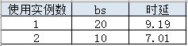

-   如配置最大bs为20，则这个请求可以一次性跑完，耗时9.19ms，硬件资源只需要占用12/24的核数。
-   如配置最大bs为16，则这个请求会被拆分为两个bs 10，两个bs 10并行跑完，耗时7.01ms，时间比直接跑bs 20要少，但是占用的硬件资源是24/48的核数，比直接跑bs 20多一倍，这样就会导致NPU利用率过高。

通过修改最大bs配置，线上实际的平均时延无明显变化，但是NPU利用率平均下降5%，流量高峰时延劣化情况明显改善。


### 案例分享2<a name="ZH-CN_TOPIC_0000002414375833"></a>

**背景描述<a name="section322775392014"></a>**

粗排模型，需要在保持限核的情况下（保证高压场景性能，当前是cube7核，vec10核），将低压下的TP99时延降至5ms之内。

**分析过程<a name="section10234172516217"></a>**

profiling采集：

因为当前主要优化低压场景下时延，故profiling采集采用串行方式采集。直接运行模型跑推理，然后使用msprof --dynamic=on --pid=9527 --output=/home/projects/output --model-execution=on --runtime-api=on --aicpu=on命令动态采集，具体使用可以参考[msprof工具介绍](#msprof工具介绍)。

开箱：在未开启优化的场景（只沿用算子模式的配置，gatherV2高性能，Cube开启HF32），模型单次modelExecute需要51ms，离目标性能差距在10倍。

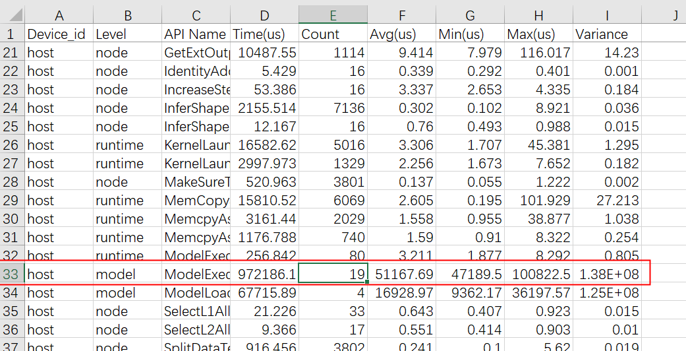

1.  因为串行执行，算子的耗时是稳定的，profiling上可以直接基于op\_name去重后分析单次推理的性能。

    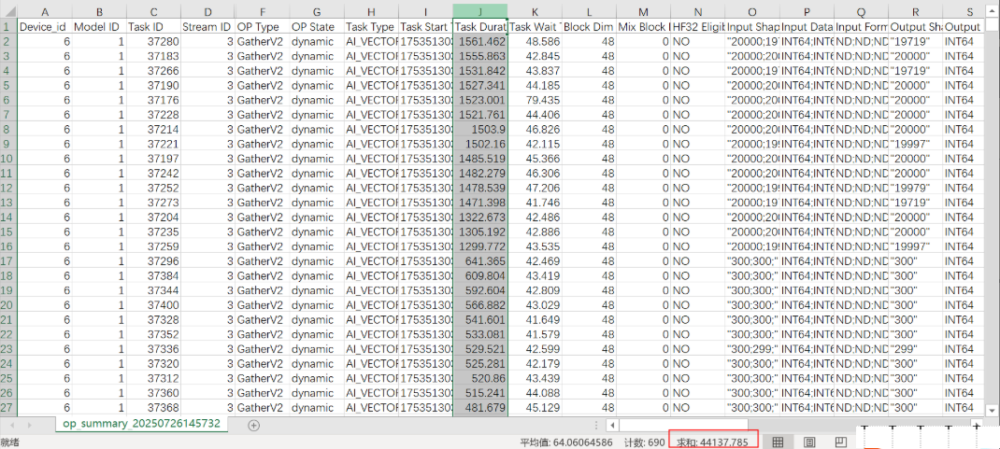

2.  这里通过按task\_duration倒排，可以看到每次推理执行时间在44ms左右，同时因为大量dynamic算子，引入了7ms左右的task\_wait时间（等待host调度）。

    分析这里的Gather算子shape和周遭结构，首先dynamic的Gather算子，使用的是逻辑核，无法通过GE的限核功能限制，在这里不满足需要兼顾高压下性能的前提，同时，步骤1图中Gather算子的index数量只有至多20000，理论上分析不需要ms级别（实际因为数据重复度较高，有较大的核间冲突）。

    从结构上分析，这部分Gather来源于如下结构中第一个Gather。

    

    这段子结构因为引入Where算子，后续算子的shape都不固定，所以引入动态子图，同时由于Where是3类算子（输出shape不固定），会导致动态图执行到Where算子后，将shape信息返回host，才能执行后续算子的shape推导。导致整网出现大量的task\_wait时间。

    从执行逻辑上分析，这段子结构在原始Gather逻辑上扩展了一个遇到<0的索引则返回全0向量的功能。同时，基于重复数据做分析，这里的输入实际上带着很长的一段padding的0，实现一个自定义的Gather算子，同时对部分table在UB内全载之后能解决这段动态子图/Gather动态限核不生效/Gather性能问题。

profiling分析--\>step2：

通过自定义算子解决上述问题后，重新采集profiling进行分析。当前串行执行时间已经降低到9ms左右，同时default\_gather的性能对比原始场景性能有了极大提升。

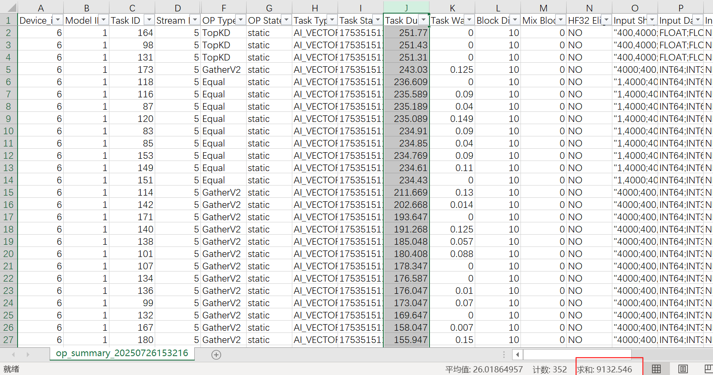

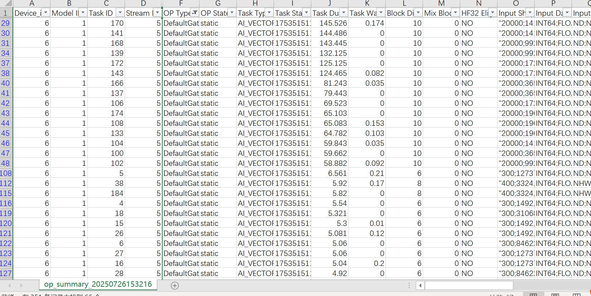

然后这里没有被DefaultGather替代的算子，不在那个动态结构中，但是对于序列长度仅为4000的Gather算子，从理论分析也不需要180us+的时间（这里的问题实际上是因为GatherV2高性能模式在全载场景实现导致的）。从算子设计上，对于shape为400,50的table shape，直接全载之后，性能会有较大提升。

这里通过自定义Gather算子覆盖该场景（同步算子优化需求）。

profiling分析--\>step3：

通过CustomGather实现全载逻辑后替换剩余Gather算子后，模型串行时间来到了6.1ms左右。在这个场景下，就可以针对模型的优化点去全量扫一遍。

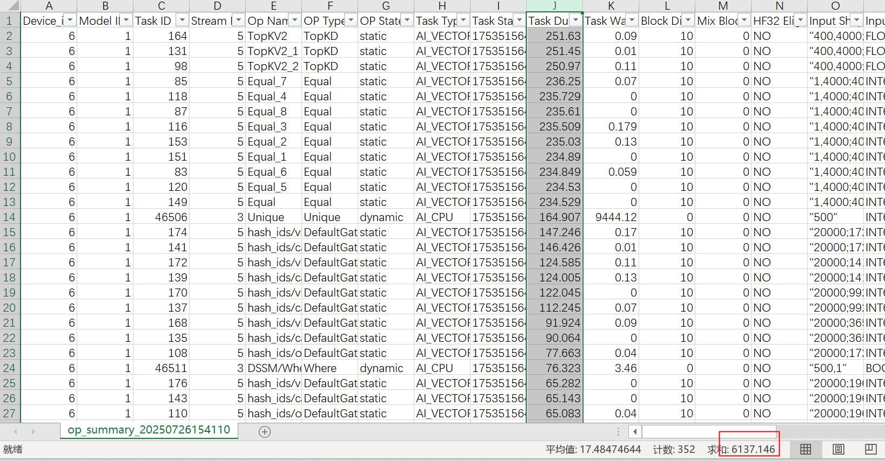

继续分析瓶颈点，top的TopK和Equal，TopK算子因为底层不支持SIMT，所以通过vec上一套较为复杂的算法实现，导致时延很长，从算子上无优化空间。但是基于用户实际业务，这里的TopK的输入，也有包含padding的0，所以设计上如果给TopK算子传入有效长度，能大幅降低TopK算子的平均执行时间（对TP99影响不大，但会影响最大QPS）。这个优化点依赖用户上层框架改动传入实际长度，所以在这个示例中暂未实现。

针对Equal算子，1,4000;400,1的shape执行在230us+，理论上距离vector算子的算力相差很远。这里实际是因为Int64的实现造成的，通过测试，同shape的Int32 Equal算子只需要30us不到，Int64相较于Int32，是线上肯定不可能需要近一个数量级以上的时间。这里针对这种双广播场景，单独设计了一个Equal的Int64实现，可以将Equal算子时延降到75us上下。

同时，我们发现这里还有Unique，Where等AICPU算子，

算子需要依赖上层拆图（当前场景拆图逻辑受用户控制，在示例中未处理）。而Where算子，来源于以下这个结构，可以通过自定义PASS消除Where引入的动态结构。


同时针对这种batchMatmul，将运算逻辑替换为2,400, 300 \* 2, 300, 16后，性能也能有提升。

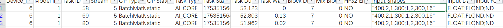

最终模型在通过自定义Equal、消除Where，替换BMM后，串行时延到了4.6ms，基本满足性能需求。

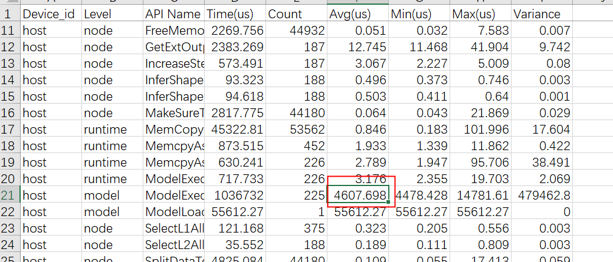


## 性能调优方法<a name="ZH-CN_TOPIC_0000002380656626"></a>

### AI CPU算子消除<a name="ZH-CN_TOPIC_0000002380816498"></a>

**使用背景<a name="section736814187110"></a>**

因为SIMD原因，NPU上的AICPU算子普遍性能很差，对于该类算子，需要想办法消除，或将其切到CPU上执行。

**使用约束<a name="section1042475016118"></a>**

当前都是通过人眼识别，手动修改客户模型代码实现，需要客户配合。

**具体案例<a name="section424121710210"></a>**

**案例一：**

针对topK算子，如果值为int32/int64类型，则只能在AICPU上执行，但如果为fp32类型，则有ai vector实现。基于用户实际场景，如果可以满足int32/int64fp32转换且不损失精度（值<2^24），则可以通过自定义pass将索引为int32/int64的topK转为cast\(int32fp32/int64\) + TopK\(索引fp32\) + cast\(fp32int32/int64\)去执行。

**案例二：**

针对部分在NPU上执行的AICPU算子，没有vector实现，同时上层有其他不好切到CPU侧的算子时，需要考虑通过改图，让AICPU算子不依赖其他NPU算子。如下图，Bucketize算子依赖的Gather算子，索引来源于一大块NPU子图，这张子图本身不可能全部切到CPU执行。如果想把Bucketize算子切到CPU，需要分析Bucketize算子实际只直接依赖Gather算子，而Gather算子作为索引类算子，实际上可以针对Gather的Table做Bucketize而不是对Gather的结果做Bucketize（这里需要有table size 不会远大于gather output size的先验结论），如果将Bucketize挪至Gather的table分支上方，则发现squeeze算子实际上和Bucketize无顺序依赖，故可以将Bucketize挪到input上方，在CPU侧执行。


### 自定义pass<a name="ZH-CN_TOPIC_0000002380816502"></a>

**具体案例<a name="section424121710210"></a>**

**案例一：bmm + tile**

Bmm算子内部本身有广播逻辑，如果周围有算子实现的正好是广播逻辑，则可以将其消除以提高性能。如下图，删掉Tile算子之后，能得到几个性能提升点：

1.  Tile算子本身时间。
2.  Tile算子引入的一块128\*8\*300\*32\*4 = 37.5M的访存，对其他实例的Cache命中率有影响。
3.  BMM算子本身的mte速度，因为广播变快。

    

**案例二：同源concat**

该场景构图时使用concat实际上与Tile算子实现的相同功能，但是tile算子的搬入数据量，只有concat的1/240, 同时，如果尾轴非对齐，concat算子还会有不少性能损失。

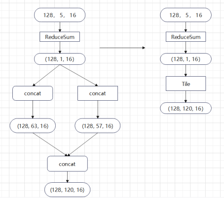

**案例三：广播BMM算子**

可以观察到原始的BMM，做的是 1，32  300, 32的 matmul计算，在npu硬件单元上，只能利用cube矩阵单元1/16的算子，有很大的算力浪费，这里因为首轴有广播，所以通过将广播轴缩到k轴上，将128  8 次  1，32  300, 32 替换为8 次 128, 32  300, 32的矩阵运算，提高整体的Cube利用率. 这里引入的Reshape算子不在NPU上执行，引入的transpose算子影响比不上计算效率带来的提升，整体而言收益非常明显。


**案例四：Tile+Concat**

通过交换tile/concat的执行顺序，将读访存量，从1\*32\*3+128\*32\*3 降到了 1\*32\*3+1\*96, 下降98.5%, 写访存量从128\*32\*3+128\*96下降到1\*96+128\*96, 下降50%。

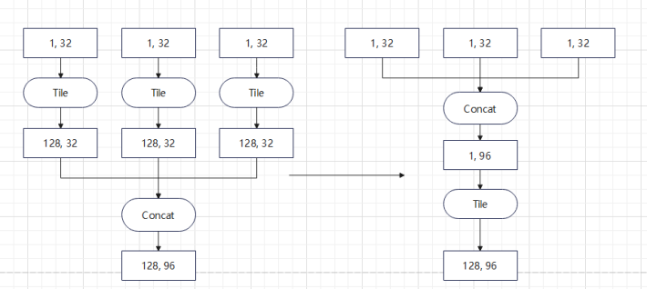


### 自定义算子<a name="ZH-CN_TOPIC_0000002414375841"></a>

**使用背景<a name="section736814187110"></a>**

针对部分算子的性能问题，如果无法通过PASS，优化周围的计算结构规避时，就需要针对这部分算子进行手动优化。但手写算子，如果要保证其泛化性，往往会需要针对不同shape实现不同tiling分支，代码量非常大。在针对模型优化时，优化时间过长往往不能满足用户需求。所以，如果需要手写自定义算子，最优的策略是基于一些特定网络结构，基于模型上带来的先验知识，去实现针对特定网络结构的优化分支。

**具体案例<a name="section81292121776"></a>**

**案例一：带有效数据长度的TopK**

TopK算子在推荐推理如TWINS模型中使用，该算子即使通过1.5.4中的cast方案优化到vector core上，对于序列长度很长的topK，性能还是很差。同时，基于硬件原因，TOPK算子的算法在NPU上很难实现和GPU相同的性能。所以，针对自定义TOPK算子的优化需要上升到模型层面进行分析。从模型上看，TOPK入参的序列源自于一段padding过后的序列，实际上不需要所有数据参与topK，且其中有效数据占比平均只有10%左右。基于此先验条件，只需要实现一个自定义topK算子，新增一个有效长度入参，就能让算子耗时平均下降90%。

**案例二：自定义floormod算子**

模型中，针对部分特征，采取了如下图实现的通过floormod进行分桶的方式处理，这里实现逻辑为0索引作为0，其余索引会针对一个数取余后+1作为分桶后的索引传递给Gather算子。当前，因为NPU实际上底层不直接支持int64的计算，floormod算子针对int64类型实际上是使用的scalar指令做运算，当入参数量多时，性能很差。从数学上，如果要将int64转换为两个int32计算，其计算逻辑和符号位的处理都很复杂。但基于这个结构，可以得到索引从一定\>0的约束（否则Gather报错），同时floormod用于Gather索引分桶，所以除数（桶数）并不需要int64表达。因为底层fmod/除法指令只支持fp32/fp16的计算，分析除数如果转到fp32，在2^24-1（1677万）内不会出现精度损失，这个范围已经满足用户需求（实际上考虑算法需要桶数在2^21-1以内保证性能，也在大部分场景够用）。故设计算子可以设计为int64/fp32, 在vec范围内有实现，可以避免scalar的问题。

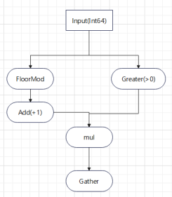

**案例三：自定义Gather算子**

对于部分带有缺省值的特征，通过如下结构实现将<0的索引转为0向量，\>0的索引正常作为索引去Embedding. 该结构中Where算子作为AICPU算子，同时这个结构会被作为动态子图执行，性能很差。这里通过将该逻辑融入Gather算子中，在算子内部对每个索引值进行判断，然后将0向量或者从embedding值搬到目标位置实现这一套逻辑，整体耗时减少3个数量级。

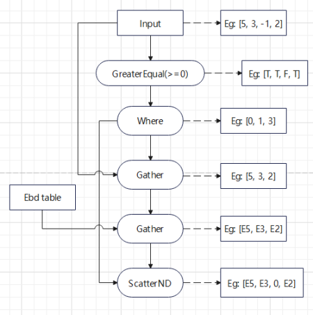


### 多流<a name="ZH-CN_TOPIC_0000002414255997"></a>

**使用背景<a name="section736814187110"></a>**

在推荐推理场景下，模型大多存在算子数量大，算子shape小的特点，且通常会要求单次推理时间在合理范围内尽可能的提高吞吐量（单次推理的数据量\*单位时间内的推理次数）。由于算子shape小，通常会出现算力利用率低从而导致性能不佳的情况，一般需要开启多流并行推理，提升利用率，进而提升吞吐量。

**使用约束<a name="section1042475016118"></a>**

1.  多流并行场景下， 存在资源抢占，比如带宽，计算资源等，单个推理的时延，会比单流场景下单个推理的时延更长，在时延敏感场景使用需要做好时延控制；
2.  多流如果不配合分核，可能会存在计算资源排队严重情况，需不需要配合分核一起使用，需要根据具体实际数据而定；
3.  需要根据模型实际吞吐量，控制流数；流数越大，NPU利用率会越高，实际上卡的吞吐量就会越大，实际上超过流数某个阈值之后，会存在不同流之间刷cache的现象，导致整体吞吐量下降。

**具体案例<a name="section1470014569106"></a>**

-   TensorFlow  demo：可以参考[GitCode.com](https://gitcode.com/Ascend/RecSDK/blob/develop/examples/rec_infer/README.md#%25E5%2590%25AF%25E5%258A%25A8%25E5%25A4%259A%25E6%25B5%2581%25E5%25B9%25B6%25E8%25A1%258C%25E4%25BC%2598%25E5%258C%2596)进行多流功能使能。
-   PyTorch demo：在PyTorch框架中，由于社区对多流没有直接支持，推荐直接使用多进程方式进行推理。


### 分核<a name="ZH-CN_TOPIC_0000002380656642"></a>

**使用背景<a name="section736814187110"></a>**

以A2服务器配置的NPU卡为例，一个卡中包含ai cube core计算单元24个，ai vector core计算单元48个，算子执行时，会根据shape来计算所需要的核数，一般情况下会用满24个cube core或者48个vector core；算子使用的核数越多，算子每个核需要执行的计算量就会越少，导致算子的耗时降低。

针对CTR推理场景，有多实例并发的因素，对于算子的性能分析，不能单看算子的耗时，还需要看算子占用的资源总量，即核数。假设某个cube算子耗时100us，占24个cube core，那么在100us的时间内，NPU单卡只能执行这一个算子。同时，假设在相同算子，限核到12个cube core后，耗时150us，则相当于在150us内实际执行了2个该算子，平均执行时间只有75us，相较于原始场景更优。

这里，限核带来的收益主要有如下几点：

1.  对于us级别小算子，大部分时间在算子启动头开销上，占用的核越多，头开销就会越大。
2.  因为CTR场景，大部分算子shape都不大，在切核后，单核内mini tiling的次数可能不会太多，这些mini tiling可能在尾块造成算力浪费。
3.  NPU核间访问相同地址会有访存冲突，造成访存速率大幅度下降。索引类算子，如Gather，如果数据分布较为集中，核越多，核间的冲突会越严重。

    同时，需要注意，核数也不能限制得太低，一般来说，vec/cube 的限制都分别在6-12核中（因为CV实际上是模型上的不同资源，所以不用保证硬件引入的1:2比例）。

**使用约束<a name="section1042475016118"></a>**

在单流场景下，分核后的推理耗时对比不分核的推理耗时，通常都会有劣化；在时延敏感场景需要根据时延要求把控好时延劣化范围。

**具体案例<a name="section1470014569106"></a>**

-   TensorFlow  demo：修改方法可参考《TF Adapter 接口（1.x）》的“[session配置参数说明](https://www.hiascend.com/document/detail/zh/TensorFlowCommercial/800/API/tfadapter1x/tfmigr1_tfadapi_0020.html)”章节配置aicore\_num参数。
-   PyTorch demo：该特性暂不支持。


### batchsize调优<a name="ZH-CN_TOPIC_0000002414256009"></a>

**使用背景<a name="section736814187110"></a>**

针对部分小算子，增大batchsize可以降低头开销的占比。同时可能增大小算子占用核数以提升整体性能。能更大程度的利用NPU核的计算资源，减少权重的重复搬运。

**使用约束<a name="section1042475016118"></a>**

1.  增大batchsize，会提升算子计算时所需要的核数，与分核功能同时使用时，会导致时延劣化严重，需要具体时延验证最佳的batchsize。
2.  Cache命中率会下降。
3.  batchsize一般由客户业务决定，增大bs可以在本地压测脚本中测试出一个性能，正式推到线上的时候，由于batchsize不固定，也可能存在padding的场景，所以最佳性能会不如本地。

**具体案例<a name="section1470014569106"></a>**

以下为真实模型数据，可以看到吞吐量随batchsize增大而增大。

**表 1**  模型数据

|batchsize|推理耗时（ms）|吞吐量|
|--|--|--|
|86|8.5|10117|
|128|10.4|12258|
|256|14.9|17231|
|512|26.7|19195|


