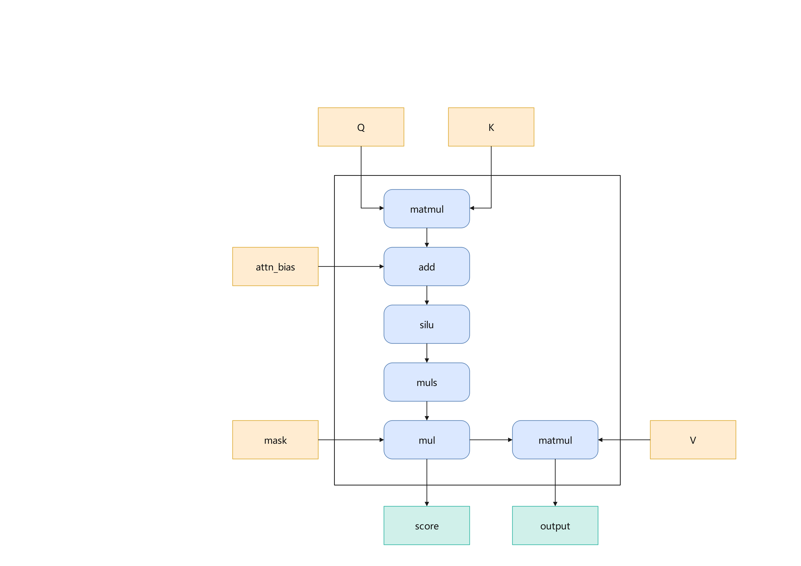

# RecOps 运行案例文档

## 简介

### RecOps 是什么

RecOps 是 Rec SDK 基于 Ascend C 开发的推荐场景自定义算子集，为各框架组件（tf_rec_v1、tf_rec_v2、torch_rec_v1、torch_rec_v2）提供基础算子能力，支持 Atlas A2/A3/A5 设备。

**核心定位：**

- 基于 Ascend C 开发的推荐场景自定义算子集
- 聚焦 Embedding、Attention、Optimizer 等关键计算路径的融合与加速
- 支持 tf_rec、torch_rec 等主流推荐框架

**代码仓地址：** [RecSDK 代码仓（GitCode）](https://gitcode.com/Ascend/RecSDK)

---

## 运行案例

本案例将简单介绍HSTU_V1前向算子hstu_dense_forward，以及如何在NPU环境下编译并运行该算子。

### HSTU_V1前向算子简介

**HSTU（Hierarchical Sparse Transformer Unit）** 是一种面向推荐场景的稀疏注意力机制融合算子，通过将 QK 矩阵乘法、SiLU 激活、缩放、mask 应用以及与 V 的矩阵乘法等多个环节融合为单一融合算子，大幅减少显存访问开销和 kernel 调度开销，从而在昇腾 NPU 上实现高性能的推荐模型训练。

我们在 HSTU_V1 版本中实现了 **hstu_dense_forward** 前向算子，作为 HSTU（Hierarchical Sparse Transformer Unit）融合算子在昇腾 NPU 上的具体落地。其与 NV HSTU_V3 的功能对比如下：

<table border="1" cellpadding="6" cellspacing="0" style="border-collapse: collapse; width: 100%; text-align: center; font-size:14px;">
  <thead>
    <tr>
      <th></th>
      <th>特性点</th>
      <th>功能点</th>
      <th>ASCEND HSTU_V1 (Atlas A2/A3 Ascend950PR/DT)</th>
      <th>NV HSTU_V3 (hopper, Ada, Ampere)<br>Releases/v25.11/7492d4b</th>
      <th>特性描述</th>
    </tr>
  </thead>
  <tbody>
    <tr>
      <td rowspan="13">hstu forward特性</td>
      <td rowspan="6">attention基础功能</td>
      <td>attention机制</td>
      <td>支持</td>
      <td>支持</td>
      <td>实现HSTU Attention核心部分<br>S = Q × K<sup>T</sup><br>P = silu(S)<br>O = P × V</td>
    </tr>
    <tr>
      <td>MHA多头注意力</td>
      <td>支持</td>
      <td>支持</td>
      <td>MHA:query和key的头个数一一对应</td>
    </tr>
    <tr>
      <td>GQA多头注意力</td>
      <td>支持</td>
      <td>支持</td>
      <td>GQA:query和key的头个数多对一</td>
    </tr>
    <tr>
      <td>支持变长序列格式</td>
      <td>支持</td>
      <td>支持</td>
      <td>实现hstu attention对变长序列的支持</td>
    </tr>
    <tr>
      <td>支持浮点计算类型</td>
      <td>支持FP32, FP16, BF16</td>
      <td>支持FP16, BF16</td>
      <td>对标的NV HSTU_V3浮点类型仅支持FP16, BF16</td>
    </tr>
    <tr>
      <td>支持FP8量化类型</td>
      <td>支持cast</td>
      <td>支持cast,<br>per-block,<br>per-head,<br>per-batch,<br>per-tensor</td>
      <td>FP8逐元素, 逐block, 逐head, 逐batch, 逐tensor进行量化</td>
    </tr>
    <tr>
      <td rowspan="2">relative attention bias</td>
      <td>支持rab是否传入</td>
      <td>支持传入rab,<br>不传入rab</td>
      <td>支持传入rab为[b, n, s, s]格式,<br>不传入rab</td>
      <td>实现hstu attention相对偏置的部分</td>
    </tr>
    <tr>
      <td>支持rab广播</td>
      <td>未支持</td>
      <td>支持传入rab为[b, 1, s, s]格式</td>
      <td>实现rab广播功能</td>
    </tr>
    <tr>
      <td rowspan="4">mask</td>
      <td>支持none mask</td>
      <td>支持</td>
      <td>支持</td>
      <td>双向掩码</td>
    </tr>
    <tr>
      <td>支持causal mask</td>
      <td>支持(context+history+target)</td>
      <td>支持(context+history+target)</td>
      <td>causal mask由num_context, num_target,<br>target_group_size进行组合。可以其中某个为none，具体的参数组合参考特性分析</td>
    </tr>
    <tr>
      <td>支持local_mask</td>
      <td>未支持</td>
      <td>支持</td>
      <td>局部掩码</td>
    </tr>
    <tr>
      <td>支持 arbitrary_mask</td>
      <td>未支持</td>
      <td>支持</td>
      <td>用户自定义掩码参数</td>
    </tr>
    <tr>
      <td>page</td>
      <td>支持Page特性</td>
      <td>支持</td>
      <td>支持</td>
      <td>Page特性：一种KV缓存优化机制，通过将Key-Value对按固定大小的页面进行管理，实现高效的显存利用和内存分配</td>
    </tr>
  </tbody>
</table>

### 计算原理

数学表达式为：

$$
HSTU(q, k, v, mask, attn\_bias, silu\_scale) = (Silu(qk_{}^{T} + attn\_bias) \times silu\_scale \times mask)v
$$

其中，`Silu` 为激活函数，`silu_scale` 为缩放系数。计算流程如图所示:



其中，`muls` 表示在 Silu 激活函数之后与缩放系数 `silu_scale` 相乘的操作。

### hstu_dense_forward 算子文件结构

```shell
-- hstu_dense_forward
   |-- c310
      |-- op_kernel                # hstu_dense_forward算子A5的Kernel侧实现
      |-- run.sh                   # hstu_dense_forward算子A5安装脚本
   |-- onnx_plugin                 # hstu_dense_forward支持onnx模型转换
   |-- v220
      |-- op_host                  # hstu_dense_forward算子Host侧实现
      |-- op_kernel                # hstu_dense_forward算子Kernel侧实现
      |-- pic                      # 算子实现原理图
      |-- hstu_dense_forward.json  # 算子原型配置
      |-- run.sh                   # hstu_dense_forward算子A2/A3安装脚本
   |-- README.md                   # hstu_dense_forward算子说明文档
```

### hstu_dense_forward 输入与输出（Atlas A5 训练系列产品）

| 名称                | 输入/输出 | 数据类型                                        | 数据格式                                 | 范围                                                                                                     | 说明                                                                                                              |
|-------------------|-------|---------------------------------------------|--------------------------------------|--------------------------------------------------------------------------------------------------------|-----------------------------------------------------------------------------------------------------------------|
| q                 | 输入    | Tensor[float32/float16/bfloat16/fp8_e4m3fn] | [B, S, N_q, D_q]/<br>[s_b, N_q, D_q] | B∈[1, 2048]<br>S∈[1, 20480]<br>N_q∈[1, 16]<br>D_q∈[1, 512]                                       | B:batch_size,表征批处理大小<br>S:seq_len,表征序列长度<br>N:head_num,表征头个数<br>D:head_dim,表征维度<br>s_b为jagged格式下各batch的实际序列长度之和 |
| k                 | 输入    | Tensor[float32/float16/bfloat16/fp8_e4m3fn]            | [B, S, N_k, D_q]/<br>[s_b, N_k, D_q] | 同q                                                                                                     | GQA（Grouped Query Attention，分组查询注意力机制）支持：K的头数可以小于Q的头数，但必须满足N_q能被N_k整除                                                                          |
| v                 | 输入    | Tensor[float32/float16/bfloat16/fp8_e4m3fn]            | [B, S, N_k, D_v]/<br>[s_b, N_k, D_v] | B∈[1, 2048]<br>S∈[1, 20480]<br>N_q∈[1, 16]<br>D_v∈[16, 512]且是16的倍数                                                                                                     | dim不等支持：本算子支持qk的head_dim与v_dim不相等的场景                                                                                                              |
| mask              | 输入    | Tensor[float32/float16/bfloat16]            | [B, N, S, S]                         | NA                                                                                                     | S为模型最大序列长度max_seq_len<br>不使用mask时传入None，类型需与q一致<br>N与q保持一致                                                      |
| attn_bias         | 输入    | Tensor[float32/float16/bfloat16]            | [B, N, S, S]                         | NA                                                                                                     | S为模型最大序列长度max_seq_len<br>不使用attn_bias时传入None，类型需与q一致 <br>N与q保持一致                                                |
| seq_offsets_q     | 输入    | Tensor[int32_t/int64_t]                     | [B + 1]                              | NA                                                                                                     | 表示每个batch的实际Q序列长度偏移，从0开始递增，需用户自行保证合法性，仅在jagged格式下生效                                                             |
| seq_offsets_k     | 输入    | Tensor[int32_t/int64_t]                     | [B + 1]                              | NA                                                                                                     | 表示每个batch的实际K序列长度偏移，从0开始递增，需用户自行保证合法性，仅在jagged格式下生效                                                             |
| seq_offsets_t     | 输入    | Tensor[int32_t/int64_t]                     | [B + 1]                              | NA                                                                                                     | 目标序列偏移量张量                                                                                                       |
| kv_cache          | 输入    | Tensor[float32/float16/bfloat16]            | [num_pages, 2, page_size, N, D]      | NA                                                                                                     | KV缓存张量，用于存储历史Key-Value对                                                                                         |
| page_offsets      | 输入    | Tensor[int32_t/int64_t]                     | [B + 1]                              | NA                                                                                                     | 页面偏移量张量                                                                                                         |
| page_ids          | 输入    | Tensor[int32_t/int64_t]                     | [page_offsets[-1]]                   | NA                                                                                                     | 页面ID张量                                                                                                          |
| last_page_len     | 输入    | Tensor[int32_t/int64_t]                     | [B]                                  | NA                                                                                                     | 最后一页长度张量                                                                                                        |
| num_context       | 输入    | Tensor[int32_t/int64_t]                     | [B]                                  | [0, 256]                                                                               | 上下文数量张量                                                                                                         |
| num_target        | 输入    | Tensor[int32_t/int64_t]                     | [B]                                  | [0, 512]                                                                               | 目标数量张量                                                                                                          |
| mask_type         | 输入    | int                                         | NA                                   | 0：使用内置下三角mask，不需要传入mask<br>1：使用内置上三角mask，不需要传入mask(当前暂不支持)<br>2：不使用mask<br>3：使用自定义mask，此时mask需要用户定义并传入 | NA                                                                                                              |
| max_seq_len_q     | 输入    | int                                         | NA                                   | [1, 20480]                                                                                             | 表示模型Q序列最大长度                                                                                                     |
| max_seq_len_k     | 输入    | int                                         | NA                                   | [1, 20480]                                                                                             | 表示模型K序列最大长度                                                                                                     |
| silu_scale        | 输入    | float                                       | NA                                   | NA                                                                                                     | 支持用户传入自定义缩放系数，不传入时默认为1/max_seq_len                                                                   |
| layout            | 输入    | string                                      | NA                                   | "normal":代表q,k,v数据格式为[B, S, N, D]<br>"jagged":代表q,k,v数据格式为[s_b, N, D] | NA                                                                                                              |
| target_group_size | 输入    | int                                         | NA                                   | {0, 1, 3}                                   | target区域mask的分组粒度。0：不创建；1：每token独立；3：每3个token为一组，组内互相attend |
| is_delta_qk       | 输入    | int                                         | NA                                   | NA                                                                                                     | QK序列是否等长：0=等长，1=不等长                                                                                             |
| alpha             | 输入    | float                                       | NA                                   | NA                                                                                                     | Alpha缩放参数                                                                                                       |
| attn_output       | 输出    | Tensor[float32/float16/bfloat16]            | [B, S, N_q, D_v]/<br>[s_b, N_q, D_v] | 同v                                                                                                     | 同v                                                                                                              |

注：

* B,S,N,D四个维度数据均不能为0，为0时算子输入为空数据，不会执行算子计算。
* 其中B,S,N参数影响attn_bias、mask占用显存大小，请根据实际内存合理设置参数大小。
* jagged 格式：一种变长序列格式，允许不同 batch 的序列长度不同，q/k/v 形状为 `[s_b, N, D]`，其中 `s_b` 为各 batch 序列长度之和，使用时需配合 `seq_offsets_q/k/t` 参数。

### 运行环境依赖

#### 硬件环境

| 硬件型号 | 是否支持 |
|---------|---------|
| Atlas A2 训练系列产品 | 是 |
| Atlas A3 训练系列产品 | 是 |
| Atlas A5 训练系列产品 | 是 |
| Atlas 推理系列产品 | 是 |

#### 软件依赖

**gcc**：版本建议 11.2.0

**cmake** 版本建议 3.22.6

**Python**：版本建议 3.11.0

**CANN**：昇腾 CANN 工具包 [[下载地址](https://www.hiascend.com/cann/download)]，版本建议9.0.0。需正确设置环境变量：

```shell
source /usr/local/Ascend/ascend-toolkit/set_env.sh
```

当前支持两种 PyTorch 版本配套，调用HSTU_V1前向算子前需完成配套软件及算子的安装。详细配套关系如下：

| 版本 | PyTorch | torch-npu |
|------|---------|-----------|
| 1 | 2.6.0   | 2.6.0     |
| 2 | 2.7.1   | 2.7.1     |

### 单算子使用说明

#### 源码下载

```shell
git clone https://gitcode.com/Ascend/RecSDK.git
cd RecSDK
```

#### 算子编译

进入HSTU_V1前向算子的功能实现目录(cust_op/ascendc_op/ai_core_op/hstu_dense_forward, A5在c310下, A2/A3在v220下)，执行指令对算子进行编译和部署，默认编译安装Atlas A2训练系列产品AI Core类型。

若指定 AI Core 类型编译：

```shell
bash run.sh --ai-core ai_core-(soc_version)
```

若编译成功，终端日志会打印"SUCCESS"，编译好的算子会被存放在"$ASCEND_OPP_PATH/vendors/hstu_dense_forward"下。

> soc_version 获取方式：在安装昇腾AI处理器的服务器执行 `npu-smi info` 命令，查询 `Name` 列的值。若 `Name` 列取值为 `xxxyy`（无 `Ascend` 前缀），则拼接 `Ascend` 前缀后作为 soc_version（例如 `Ascendxxxyy`）；若 `Name` 列取值已带 `Ascend` 前缀，则直接使用。soc_version 格式为 `Ascend` + 芯片型号。

#### 算子适配层编译

进入HSTU_V1前向算子的适配层目录(cust_op/framework/torch_plugin/torch_library/hstu)。执行算子适配层编译。

```shell
bash build_ops.sh
```

执行完在当前 build 目录生成 libhstu_dense_ops.so 文件, 调用算子时执行以下命令进行加载。

```python
import torch
torch.ops.load_library("path/to/build/libhstu_dense_ops.so")  # 替换为libhstu_dense_ops.so文件的绝对路径
```

#### 单算子运行案例

`torch.ops.mxrec.hstu_dense` 是 `hstu_dense_forward` 算子的精简版 torch 接口，在不同 NPU 平台上保持一致，支持 8 个基础参数（q, k, v, mask, attn_bias, mask_type, max_seq_len, silu_scale），数据格式为 normal 格式 `[B, S, N, D]`。

```python
import torch
import torch_npu
torch.ops.load_library("path/to/build/libhstu_dense_ops.so")  # 替换为之前生成的libhstu_dense_ops.so文件的绝对路径

# MHA 模式示例 [B, S, N, D]
batch_size = 2
seq_len = 256
num_heads = 8
head_dim = 64

# 生成数据
q = torch.randn(batch_size, seq_len, num_heads, head_dim, dtype=torch.float16).npu()
k = torch.randn(batch_size, seq_len, num_heads, head_dim, dtype=torch.float16).npu()
v = torch.randn(batch_size, seq_len, num_heads, head_dim, dtype=torch.float16).npu()

output = torch.ops.mxrec.hstu_dense(
    q=q,
    k=k,
    v=v,
    mask=None,
    attn_bias=None,
    mask_type=0,        # 0: 使用内置下三角mask，无需传入 mask
    max_seq_len=256,
    silu_scale=1.0/256  # silu_scale默认为1/max_seq_len，此处显式传入计算值
)

# 输出形状：[batch_size, seq_len, num_heads, head_dim]
print(output.shape)  # torch.Size([2, 256, 8, 64])
```

注：

* hstu_dense_forward算子的详细介绍请见[算子说明文档](../../../cust_op/ascendc_op/ai_core_op/hstu_dense_forward/README.md)
* hstu_dense_forward算子的测试用例请见[测试用例目录](../../../cust_op/test/hstu_dense/torch)
* 多算子编译方法请参见[多算子编译章节](../../../cust_op/README.md)，编译完成后直接调用 `libfbgemm_npu_api.so` 即可

### 常见错误解决办法

| 错误现象 | 可能原因 | 解决方法 |
|----------|----------|----------|
| 编译报错大量的符号未定义和链接器错误 | 未设置CANN环境变量 | 执行命令 `source /usr/local/Ascend/ascend-toolkit/set_env.sh` |
| 编译报错"[ERROR] environment variable ASCEND_CUSTOM_OPP_PATH=... is set and has multiple path in it" | 变量ASCEND_CUSTOM_OPP_PATH指向多个路径 | 执行命令 `unset ASCEND_CUSTOM_OPP_PATH` |
| 运行报错 "Q, K, V shape mismatch" | q/k/v 三个张量的 batch_size、seq_len、head_num 不一致 | 确认 q/k/v 的 B、S、N 维度完全相同 |
| 运行报错 "Normal QKV should have 4 dimensions" | normal 格式下传入了 3 维张量 | normal 格式要求 shape 为 [B, S, N, D]，检查输入张量维度 |
