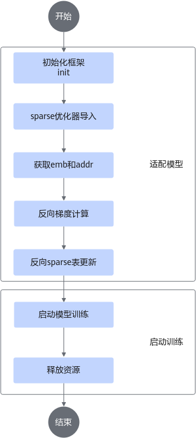
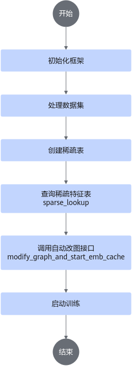
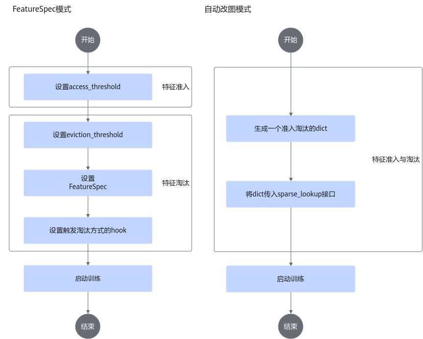

# 附录<a name="ZH-CN_TOPIC_0000001739297990"></a>

## 训练功能特性流程<a name="ZH-CN_TOPIC_0000001580007092"></a>

### 片上内存侧动态扩容模式<a name="ZH-CN_TOPIC_0000001630127049"></a>

TensorFlow对Embedding的支持是通过变量实现的，用户需要预估每个表的大小，再通过[create\_table](./api/model_apis.md#create_table)接口创建变量。Embedding表的大小在一开始就确认，后期无法扩大或者减小，这可能会导致显存的浪费或者空间不足。在推荐场景下，多个稀疏表的大小无法预估，为更好的适配用户场景及需求，增加片上内存稀疏表自动扩容功能，即显存随着模型训练增长。

片上内存侧动态扩容模式下，不支持特征淘汰。

**训练流程介绍<a name="section16875143611297"></a>**

本节介绍如何使用动态扩容模式进行训练，整体操作流程请参见[图1](#fig20224232242)。

**图 1** 片上内存侧动态扩容模式训练流程图<a id="fig20224232242"></a>  


训练流程分为以下部分，整体流程示例代码请参见[示例代码](#section161606482568)。

-   [适配模型](#section16648142213811)
-   [启动训练](#section198289221281)

**适配模型<a id="section16648142213811"></a>**

关键步骤操作参考如下。

1.  初始化框架。

    调用[init](./api/initialization_and_deinitialization_of_the_training_framework.md#init)接口，设置参数<b>use\_dynamic\_expansion = True</b>表示启用动态扩容功能，该参数默认为“False”。

2.  <a id="li91811185710"></a>稀疏优化器导入。

    调用<b>mx\_rec.optimizers</b>包中对应优化器的<b>create\_hash\_optimizer\_by\_address</b>接口来创建稀疏表sparse\_optimizer。具体可用优化器参考如下。

    -   [SGDByAddr](./api/optimizers_apis.md#sgdbyaddr)
    -   [LazyAdamByAddress](./api/optimizers_apis.md#lazyadambyaddress)

3.  <a id="li16991598571"></a>获取嵌入表示结果（emb）和映射地址（addr）。

    使用<b>tf.get\_collection\("ASCEND\_SPARSE\_LOOKUP\_LOCAL\_EMB"\)</b>接口获取训练用的嵌入表示结果，使用<b>tf.get\_collection\("ASCEND\_SPARSE\_LOOKUP\_ID\_OFFSET"\)</b>接口获取训练用的映射地址。

4.  反向梯度计算。

    使用<b>tf.gradients\(loss, emb\)</b>接口对[3](#li16991598571)获取的嵌入表示结果求导，得到梯度（grad）。

5.  反向稀疏表更新。

    使用[稀疏优化器导入](#li91811185710)创建的<b>sparse\_optimizer.apply\_gradients\(\[grad, addr\]\)</b>接口对映射地址对应位置的稀疏表进行更新。

**启动训练<a id="section198289221281"></a>**

1.  启动模型训练。
2.  在模型训练完成后调用[terminate\_config\_initializer](./api/initialization_and_deinitialization_of_the_training_framework.md#terminate_config_initializer)释放资源。

**示例代码<a id="section161606482568"></a>**

1.  初始化框架。

    ```bash
    use_dynamic_expansion = bool(int(os.getenv("USE_DYNAMIC_EXPANSION", 0)))
    init(use_mpi, train_steps=args.train_steps, eval_steps=args.eval_steps, 
    use_dynamic_expansion=use_dynamic_expansion)
    ```

2.  <a id="li91811185710"></a>稀疏优化器导入。

    ```bash
    def get_dense_and_sparse_optimizer(cfg):
        dense_optimizer = tf.compat.v1.train.AdamOptimizer(learning_rate=cfg.learning_rate)
        use_dynamic_expansion = get_use_dynamic_expansion()
        if use_dynamic_expansion:
            sparse_optimizer = create_hash_optimizer_by_address(learning_rate=cfg.learning_rate)
            logging.info("optimizer lazy_adam_by_addr")
        else:
            sparse_optimizer = create_hash_optimizer(learning_rate=cfg.learning_rate)
            logging.info("optimizer lazy_adam")
        return dense_optimizer, sparse_optimizer
    ```

3.  获取嵌入表示结果和映射地址。

    ```bash
    train_emb_list = tf.compat.v1.get_collection(ASCEND_SPARSE_LOOKUP_LOCAL_EMB)
    train_address_list = tf.compat.v1.get_collection(ASCEND_SPARSE_LOOKUP_ID_OFFSET)
    ```

4.  反向梯度计算。

    ```bash
    local_grads = tf.gradients(loss, train_emb_list)  # local_embedding
    ```

5.  反向稀疏表更新。

    ```bash
    grads_and_vars = [(grad, address) for grad, address in zip(local_grads, train_address_list)]
    train_ops.append(sparse_optimizer.apply_gradients(grads_and_vars))
    ```

    >[!NOTE] 说明
    >-   调用sparse\_optimizer.apply\_gradients\(grads\_and\_vars\)更新梯度时，若使用的vars（如address）是tensor而非variable，需要保证vars的维度和grads的第一个维度相等。
    >-   train\_address\_list地址列表需要是有效合法的，需通过[3. 获取映射地址](#li16991598571)获取。若使用非法地址，运行时会抛出AICore Error等错误。


### 动态shape<a name="ZH-CN_TOPIC_0000001630046445"></a>

Rec SDK TensorFlow训练框架支持动态shape，用户可参考使用流程启用动态shape功能。

启用动态shape功能前，需要安装ops算子包，具体操作请参见“《CANN 软件安装指南》的“安装CANN”章节的“安装ops”部分。

**使用流程介绍<a name="section154771936182417"></a>**

如需在Rec SDK TensorFlow训练框架使用动态shape功能，可在初始化框架时，配置[init](./api/initialization_and_deinitialization_of_the_training_framework.md#init)接口的“use\_dynamic”参数为“True”。

**示例代码<a name="section17737110300"></a>**

```bash
init(use_mpi, rank_id=rank_id, rank_size=rank_size, train_steps=train_steps, eval_steps=eval_steps, prefetch_batch_number=1, use_dynamic=True)
```


### 自动改图<a name="ZH-CN_TOPIC_0000001630127065"></a>

**使用流程介绍<a name="section154771936182417"></a>**

本节介绍如何使用自动改图模式进行训练，整体操作流程请参见[图1](#fig1066992151914)。

**图 1**  自动改图使用流程<a id="fig1066992151914"></a>  


正常训练流程一般包含处理数据、创建稀疏表、查表、开始训练，使用自动改图模式和正常训练流程一致，仅需在查表接口设置“modify\_graph”参数为“True”，并且在开始训练之前需要调用自动改图的接口。其中查表和调用自动改图接口操作为关键步骤。

**关键步骤介绍<a name="section1078013392817"></a>**

1.  查询稀疏特征表。

    调用[sparse\_lookup](./api/model_apis.md#sparse_lookup)接口，设置参数**modify\_graph=True**表示在查表时采用自动改图模式，该参数默认为“False”。

2.  调用自动改图接口。

    自动改图接口为[modify\_graph\_and\_start\_emb\_cache](./api/data_apis.md#modify_graph_and_start_emb_cache)，但区分[使用TF.Session训练](migration_and_training.md#使用tfsession训练)和[使用NPUEstimator训练模式](migration_and_training.md#使用estimator训练)。

    1.  使用TF.Session训练模式。

        在tf.Session训练模式下，需要显式调用[modify\_graph\_and\_start\_emb\_cache](./api/data_apis.md#modify_graph_and_start_emb_cache)接口，同时**sess.run\(iterator.initializer\)**也需修改为自动改图的数据集初始化接口**sess.run\([get\_initializer](./api/automatic_graph_modification.md#get_initializer)\(True\)\)**或者**sess.run\(get\_initializer\(False\)\)**，前者用于训练（train）、后者用于评估（eval）。

    2.  使用NPUEstimator训练模式。

        在NPUEstimator模式下，需要在NPUEstimator的多个模式（train、predict、train\_and\_evaluate）中添加自动改图的[GraphModifierHook](./api/class_reference.md#graphmodifierhook)，如当前为训练（train），则在训练的钩子（Hook）中添加**GraphModifierHook**，即可完成自动改图模式的训练。

**示例代码<a name="section17737110300"></a>**

1.  查询稀疏特征表。

    ```bash
    from mx_rec.core.embedding import sparse_lookup
    
    embedding = sparse_lookup(hash_table, feature, send_count, dim=None, is_train=is_train,
                              access_and_evict_config=access_and_evict_config,
                              name=hash_table.table_name + "_lookup", modify_graph=True, batch=batch)
    ```

2.  调用改图接口。
    1.  使用tf.Session训练模式。

        ```bash
        from mx_rec.util.initialize import get_initializer
        from mx_rec.graph.modifier import modify_graph_and_start_emb_cache
        
        if MODIFY_GRAPH_FLAG:
            logging.info("start to modifying graph")
            modify_graph_and_start_emb_cache(dump_graph=True)
        else:
            start_asc_pipeline()
        
        # train
        with tf.compat.v1.Session(config=sess_config()) as sess:
            if MODIFY_GRAPH_FLAG:
                sess.run(get_initializer(True))
            else:
                sess.run(train_iterator.initializer)
        
        # eval
        def evaluate():
            if MODIFY_GRAPH_FLAG:
                sess.run(get_initializer(False))
            else:
                sess.run(eval_iterator.initializer)
        ```

    2.  使用NPUEstimator训练模式。

        ```bash
        from mx_rec.graph.modifier import GraphModifierHook
        
        est.train(input_fn=lambda: input_fn(), hooks=[GraphModifierHook()])   #est为创建的NPUEstimator对象
        ```


### 特征准入与淘汰<a name="ZH-CN_TOPIC_0000001580166512"></a>

**使用流程介绍<a name="section154771936182417"></a>**

本节介绍如何使用特征准入与淘汰进行训练，涉及FeatureSpec模式与自动改图模式。

>[!NOTE] 说明
>开启淘汰功能后，不支持片上内存侧动态扩容。

**图 1**  特征准入与淘汰使用流程<a name="fig457115616"></a>  


**关键步骤介绍<a name="section9385187220"></a>**

-   在FeatureSpec模式下，请参考[FeatureSpec](./api/class_reference.md#featurespec)进行配置。
-   在自动改图模式下，请参考[自动改图](#自动改图)进行配置。
-   环境变量USE\_COMBINE\_FAAE控制是否合表统计次数。
-   提供一个CPU算子[set\_threshold](./api/other_apis.md#import_host_pipeline_ops)支持在训练过程中更改准入阈值。

    >[!NOTE] 说明 
    >如果set\_threshold的第一个入参值为“0”，表示修改对应的emb表为特征不累加模式（准入阈值不变，但是特征计数不再累加，使用历史值）。

**示例代码<a name="section17737110300"></a>**

1.  FeatureSpec模式。

    ```bash
    feature_spec_list = [FeatureSpec("user_ids", feat_count=cfg.user_feat_cnt, table_name="user_table",
                                     access_threshold=access_threshold,
                                     eviction_threshold=eviction_threshold,
                                     faae_coefficient=1),
                         FeatureSpec("item_ids", feat_count=cfg.item_feat_cnt, table_name="item_table",
                                     access_threshold=access_threshold,
                                     eviction_threshold=eviction_threshold,
                                     faae_coefficient=4),
                         FeatureSpec("timestamp", is_timestamp=True)]
    ```

    ```bash
    hook_evict = EvictHook(evict_enable=True, evict_time_interval=24*60*60, evict_step_interval=10000)
    ```

2.  自动改图模式。

    ```bash
    config_for_user_table = dict(access_threshold=cfg.access_threshold, eviction_threshold=cfg.eviction_threshold,
                                faae_coefficient=1)
    ```

    ```bash
    embedding = sparse_lookup(hash_table, feature, send_count, dim=None, is_train=is_train,
                              access_and_evict_config=config_for_user_table ,
                              name=hash_table.table_name + "_lookup", modify_graph=modify_graph)
    hook_evict = EvictHook(evict_enable=True, evict_time_interval=24*60*60, evict_step_interval=10000)
    ```

3.  更改准入阈值。

    ```bash
    from mx_rec.util.ops import import_host_pipeline_ops
    thres_tensor = tf.constant(60, dtype=tf.int32)
    set_threshold_op = import_host_pipeline_ops().set_threshold(thres_tensor,
                                            emb_name=self.table_list[0].table_name,
                                            ids_name=self.table_list[0].table_name + "_lookup")
    with tf.Session() as sess:
        sess.run(set_threshold_op)
    ```


### Hot\_Embedding<a name="ZH-CN_TOPIC_0000002174920898"></a>

Hot\_Embedding功能默认开启，无需配置。

**示例代码<a name="section9419340194014"></a>**

该功能自动开启，无需配置；为了确保使能成功，需要开启GatherV2算子的高性能模式，开启方法如下：

1.  将op\_impl\_mode.ini配置项传入到Session。代码如下：

    ```bash
    import tensorflow as tf
    session_config = tf.compat.v1.ConfigProto(allow_soft_placement=False, log_device_placement=False)
    session_config.gpu_options.allow_growth = True
    custom_op = session_config.graph_options.rewrite_options.custom_optimizers.add()
    # 1. 将算子配置文件路径传入配置项
    custom_op.parameter_map["op_precision_mode"].s = tf.compat.as_bytes("op_impl_mode.ini")
    # 2. 建图
    # 3. 将config配置传入sess初始化中
    with tf.compat.v1.Session(config=sess_config) as sess:
    # 4. 训练
    ```

2.  在模型的路径下创建op\_impl\_mode.ini文件，内容如下：

    ```bash
    GatherV2=high_performance
    ```


### 定制WarmStart<a name="ZH-CN_TOPIC_0000002210441317"></a>

**使用介绍<a name="section1868125213399"></a>**

如需在Rec SDK TensorFlow训练框架使用定制WarmStart功能，需要在模型代码中创建NPUEstimator对象之前创建一个WarmStart的配置tf.estimator.WarmStartSettings，然后将这个配置传给NPUEstimator中warm\_start\_from参数即可。

>[!NOTE] 说明 
>当前定制WarmStart仅支持TensorFlow  1.15.0版本下的HBM模式和DDR模式。

**示例代码<a name="section18481279400"></a>**

定制WarmStart的使用示例如下：

示例1：模型从warm\_start路径中加载稀疏表user\_table。

```bash
import tensorflow as tf
from tf_adapter import NPUEstimator
 
warm_settings=tf.estimator.WarmStartSettings(ckpt_to_initialize_from="./warm_start",vars_to_warm_start ="user_table", var_name_to_vocab_info=None, var_name_to_prev_var_name=None)
est = NPUEstimator(
        model_fn=get_model_fn(create_fs_params, cfg, access_and_evict),
        params=params,
        model_dir=params.model_dir,
        config=run_config,
        warm_start_from=warm_settings 
)
```

**表 1**  tf.estimator.WarmStartSettings参数说明

|参数|参数类型|说明|
|--|--|--|
|ckpt_to_initialize_from|str(path)|指定从哪个检查点开始初始化。|
|vars_to_warm_start|str/正则表达式/list[str]/list[variables]|指定从哪些变量开始初始化。dense层变量的指定方式保持与TF原生一致；Embedding参数支持：正则表达式、str（表名）和list（表名list）。|
|var_name_to_vocab_info|dict|指定词汇表信息，用于恢复嵌入矩阵。|
|var_name_to_prev_var_name|dict|用于存储变量名到WarmStart路径中变量名的映射关系。<div class="note"><span class="notetitle">说明</span><div class="notebody">Embedding表名目前不支持名称映射。</div></div>|


示例2：模型从warm\_start\_1路径中加载所有参数，然后模型从warm\_start\_2路径中加载Embedding表user\_table、item\_table，替代已经加载的warm\_start\_1路径中的稀疏表结果。模型从warm\_start\_3路径中加载mlp\_layer\_w参数，替代warm\_start\_1的加载结果。

```bash
import tensorflow as tf
from tf_adapter import NPUEstimator
 
ckpt_to_initialize_from_list = ["./warm_start_1", "./warm_start_2", "./warm_start_3"]
vars_to_warm_start_list=[".*",  ["user_table", "item_table"], "mlp_layer_w" ]
var_name_to_prev_var_name_list = [{}, {}, {}]
warm_settings=tf.estimator.WarmStartSettings(
        ckpt_to_initialize_from=ckpt_to_initialize_from_list,
        vars_to_warm_start = vars_to_warm_start_list,
        var_name_to_vocab_info=None,
        var_name_to_prev_var_name=var_name_to_prev_var_name_list )
 
 est = NPUEstimator(
        model_fn=get_model_fn(create_fs_params, config, access_and_evict),
        params=params,
        model_dir=params.model_dir,
        config=run_config
        warm_start_from=warm_settings
    )
```

**表 2**  支持多路径WarmStart功能中tf.estimator.WarmStartSettings参数说明

|参数|参数类型|说明|
|--|--|--|
|ckpt_to_initialize_from|List(str(path))|指定从哪个检查点开始初始化|
|vars_to_warm_start|List(str/正则表达式/list[str]/list[variables])|指定从哪些变量开始初始化。<br>dense层变量的指定方式保持与TF原生一致；Embedding参数支持：正则表达式、str（表名）和list（表名list）。|
|var_name_to_vocab_info|List(dict)|指定词汇表信息，用于恢复嵌入矩阵。|
|var_name_to_prev_var_name|List(dict)|用于存储变量名到WarmStart路径中变量名的映射关系。<br>Embedding表名目前不支持名称映射。|


### 增量模型保存与加载<a name="ZH-CN_TOPIC_0000002210326957"></a>

**使用介绍<a name="section1868125213399"></a>**

如需在Rec SDK TensorFlow训练框架使用增量模型保存与加载功能，可在初始化框架时，配置[init接口](./api/initialization_and_deinitialization_of_the_training_framework.md#init)的以下参数：

-   is\_incremental\_checkpoint=True：表示开启增量模型保存与加载功能。
-   save\_checkpoint\_due\_time=xx：表示每隔xx秒保存一次全量模型。
-   save\_delta\_checkpoints\_secs=xx：表示每隔xx秒保存一次增量模型。
-   restore\_model\_version=xx：表示指定加载step=xx的模型，如果不传这个参数则加载最新的模型；如果不需要加载模型可以不设置这个参数。

**示例代码<a name="section9419340194014"></a>**

使用示例如下：

```bash
from mx_rec.util.initialize import init
# set init
init(train_steps=args.train_steps,
     eval_steps=args.eval_steps,
      save_steps=args.save_checkpoints_steps,
      max_steps=args.max_steps,
      use_dynamic=use_dynamic,
      use_dynamic_expansion=use_dynamic_expansion,
      save_checkpoint_due_time=4,
      save_delta_checkpoints_secs=2,
      is_incremental_checkpoint=True,
      restore_model_version=3)
```


## 用户信息列表<a name="ZH-CN_TOPIC_0000002441712122"></a>

请周期性地更新用户的密码，避免长期使用同一个密码带来的风险。

**表 1**  用户列表

|用户名|描述|初始密码|密码修改方法|
|--|--|--|--|
|root|部署Rec SDK TensorFlow|用户自定义|使用**passwd**命令修改|
|HwHiAiUser|安装驱动，运行Demo依赖的用户|用户自定义|使用**passwd**修改|


**centos系统中DockerFile示例的基础镜像用户<a name="section1822811311000"></a>**

|用户|初始密码|密码修改方法|
|--|--|--|
|root|无|-|
|bin|无|-|
|daemon|无|-|
|adm|无|-|
|lp|无|-|
|sync|无|-|
|shutdown|无|-|
|halt|无|-|
|mail|无|-|
|operator|无|-|
|games|无|-|
|ftp|无|-|
|nobody|无|-|
|systemd-network|无|-|
|dbus|无|-|


**centos系统中RecSDK-TensorFlow组件容器内的用户<a name="section1238015439358"></a>**

|用户|描述|初始密码|密码修改方法|
|--|--|--|--|
|sshd|-|无|-|


