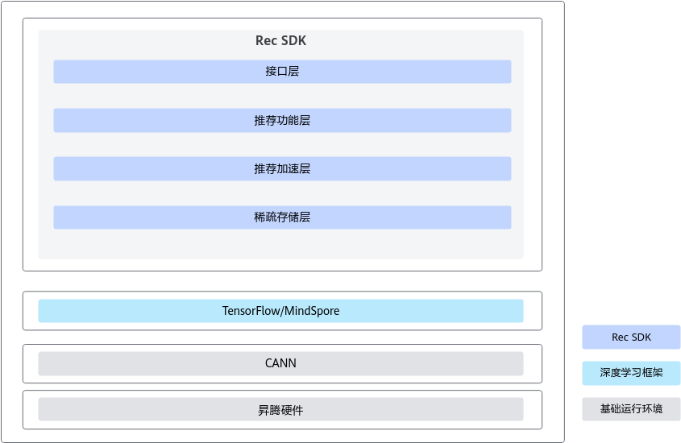

# 简介

## 功能介绍

Rec SDK TensorFlow的功能涉及：

-   模型训练基础功能。支持单机单卡训练、单机多卡和多机多卡分布式训练，支持基于TensorFlow开发模型。
-   推荐场景特有功能。基于Rec SDK TensorFlow的稀疏表方案，Rec SDK TensorFlow提供必备功能，如特征保存和加载、特征准入、特征淘汰、非亲和算子切分等。
-   大规模稀疏表特有功能。支持加速卡内存、主机内存、主机磁盘的多级存储，支持存储，支持动态扩容。规模可超10TB。
-   模型训练定制功能。支持定制WarmStart选项，从多个源域模型进行参数加载，实现连续迁移学习的功能。
-   性能、精度检测工具功能。其中，性能检测工具支持Host侧profiling数据采集，Host侧和Device侧profiling数据融合、耗时排序、可视化，支撑性能问题定位能力；精度看护工具支持端到端算子级精度比对，支撑精度看护、问题定位能力。

**关键功能特性**

Rec SDK TensorFlow为用户提供了动态扩容、动态shape、自动改图、特征准入与淘汰、Hot\_Embedding和定制WarmStart等功能特性，用户可以在适配模型中加入想要使用的功能特性。

-   动态扩容

    TensorFlow对Embedding的支持是通过变量实现的，用户需要预估每个表的大小，再通过接口创建变量。Embedding表的大小在一开始就确认，后期无法扩大或者减小，这可能会导致显存的浪费或者空间不足。在推荐场景下，多个稀疏表的大小无法预估，为更好的适配用户场景及需求，增加稀疏表动态扩容功能。片上内存支持动态扩容和非动态扩容方案，片上内存动态扩容即显存随着模型训练而增长；DDR/SSD仅支持动态扩容，即内存/磁盘随着模型训练增长，显存保持不变。

    流程介绍请参见[片上内存侧动态扩容模式](appendix.md#片上内存侧动态扩容模式)

    可以从[链接](https://gitcode.com/Ascend/RecSDK/tree/branch_v7.2.0-RC1/cust_op/ascendc_op/ai_core_op/cust_op_by_addr/v220)获取稀疏表的算子样例和Readme。

    >[!NOTE] 说明 
    >当开启动态扩容时，请选用动态扩容相关的优化器，如：SGDByAddr、LazyAdamByAddress和AdagradByAddress。

-   动态shape

    Rec SDK TensorFlow训练框架支持动态shape。动态shape指的是TensorFlow的shape依赖于具体的运算，算子输入是动态shape、算子输出也是动态shape。

    流程介绍请参见[动态shape](appendix.md#动态shape)。

-   自动改图

    Rec SDK TensorFlow支持创建特征类FeatureSpec模式和自动修改TensorFlow计算图两种特征训练方式。

    自动改图通过修改TensorFlow计算图的方式，使得用户训练脚本无需创建特征类（FeatureSpec），无需调用嵌入read emb key算子的函数即可开始模型训练。

    流程介绍请参见[自动改图](appendix.md#自动改图)。

    >[!NOTE] 说明 
    >自动改图目前只支持运行在TensorFlow的默认图中，暂不支持用户模型新建tf.Graph来定义计算图。

-   特征准入与淘汰

    当某些特征的频率过低时，对模型的训练效果不会有帮助，还会造成内存浪费以及过拟合的问题。因此需要特征准入功能来过滤掉频率过低的特征。特征准入与淘汰的使用分为在创建FeatureSpec模式和自动改图模式下两种情况。

    对于一些对训练没有帮助的特征，我们需要将其淘汰以免影响训练效果，同时也能节约内存。在Rec SDK TensorFlow中我们支持特征淘汰功能，并提供了两种特征淘汰的触发方式，一是根据global step间隔触发淘汰，二是根据时间间隔触发淘汰。

    流程介绍请参见[特征准入与淘汰](appendix.md#特征准入与淘汰)。

    >[!NOTE] 说明 
    >当前特征准入与淘汰功能仅支持只开启准入功能以及同时开启准入和淘汰功能，不支持只开淘汰功能。

-   Hot\_Embedding

    推荐场景下，Key的重复率较高，Hot\_Embedding将重复度较高的Key放入缓存中来加速查表的速度。

-   定制WarmStart

    在TensorFlow  Estimator模式下，原生的WarmStart选项支持在训练新模型时，从单个模型路径中完成部分或者全部模型参数的加载。该功能提供了更灵活的方式实现模型参数的恢复。WarmStart常用于迁移学习，即在一个任务上训练的模型被用于另一个任务，通过复用模型的某些层或参数来加速新任务的学习过程。Embedding表名目前不支持名称映射。

    定制WarmStart功能描述如下：

    -   兼容原生TF的WarmStart功能，支持指定稀疏表的WarmStart。
    -   支持多路径的WarmStart。提供支持从多个模型路径中完成部分或者全部模型参数的加载，可支撑多模型迁移学习任务的训练。

    >[!NOTE] 说明 
    >当前定制WarmStart仅支持TensorFlow  1.15.0版本下的HBM模式和DDR模式。

-   增量模型保存与加载

    此功能是为了支撑流式训练开发，推荐系统在服务的过程中，会不断产生可用于训练CTR模型的日志数据，这些数据也是不断输入给模型。模型每接收一部分数据，就会利用该部分数据训练模型，同时按一定的频率（时间）保存全量或增量模型。

    在这个背景下，将稀疏的参数仅保存增量模型，会极大的降低频繁保存模型带来的额外开销。同时，在训练进程结束后能尽量通过一个最近的全量的模型配合一系列的增量检查点（模型）恢复最近一次训练完成的模型参数，减少重复计算。

    >[!NOTE] 说明
    >-   当前模型增量保存与加载仅支持片上内存模式、DDR模式、SSD模式和Estimator模式下的train和predict模式，不支持train\_and\_evaluate；仅支持扩容与非扩容场景。
    >-   当前模型增量保存与加载不支持同时开启特征准入与淘汰。

-   一表多查

    将对一张稀疏表的多次查询合并为一次查询。

-   PCIE through

    使用PCIE through流水并行换入换出，以共享内存承载数据交换，提高Host侧和Device侧之间的数据通信吞吐率。

## 软件架构

Rec SDK TensorFlow基于推荐场景主流框架、CANN和各种硬件和网络，对于搜索、推荐、广告模型训练的应用场景需求，提供极简易用、高性能API，助力昇腾AI处理器完成搜索、推荐、广告等模型的高效训练。

**表 1**  结构图模块介绍

|Rec SDK TensorFlow模块|说明|
|--|--|
|接口层|易用性接口，简化用户接入成本，支撑用户规模化上量。|
|推荐功能层|必备核心功能，满足用户使用的要求。|
|推荐加速层|性能竞争力核心组件，为整机系统方案提供更优性能。|
|稀疏存储层|支持超10TB大规模稀疏表存储。|

## 支持的硬件和操作系统

**表 2**  支持的产品列表

|产品型号|产品架构|操作系统版本|
|--|--|--|
|Atlas 800T A2 训练服务器 Atlas 200T A2 Box16 异构子框|<li>ARM</li><li>x86_64</li>|<li>CentOS版本：7.6</li><li>OpenEuler版本：22.03</li><li>Ubuntu版本：20.04</li>|
|Atlas 900 A3 SuperPoD 超节点|ARM|OpenEuler版本：22.03|

