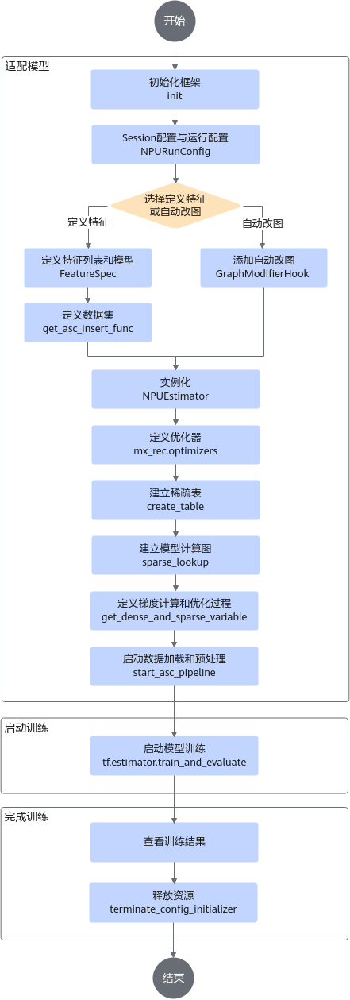
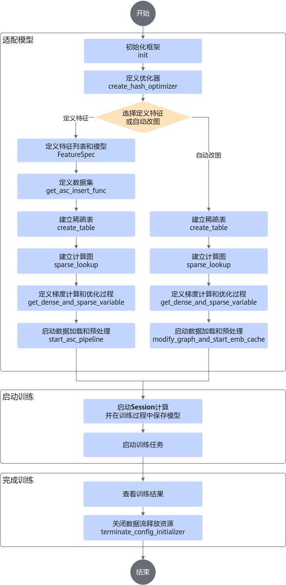
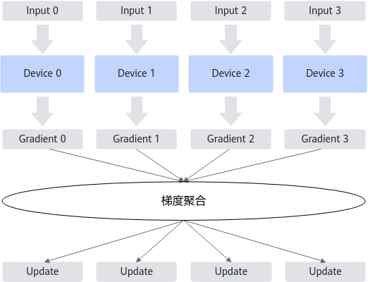
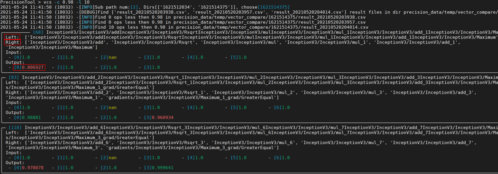
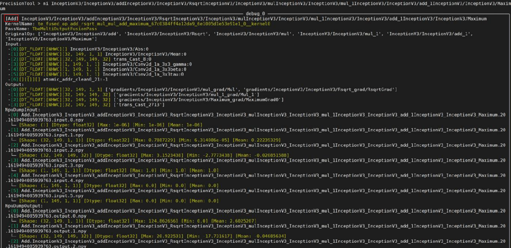
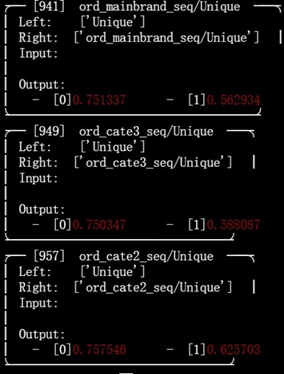
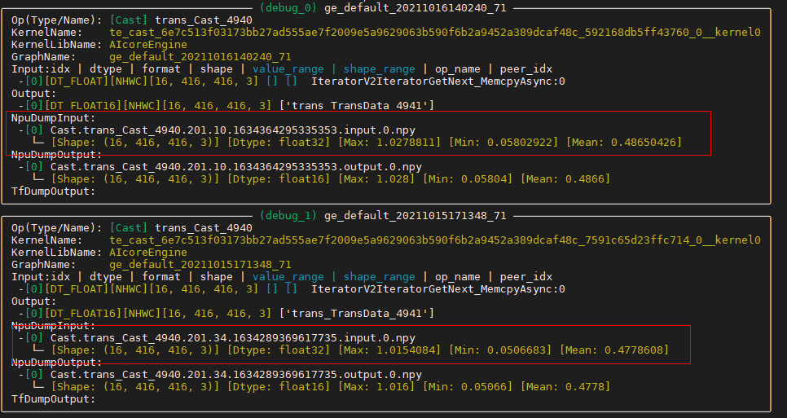

# 迁移与训练<a name="ZH-CN_TOPIC_0000001630127069"></a>

## 训练场景介绍<a name="ZH-CN_TOPIC_0000001580012140"></a>

**训练场景介绍<a name="section16627105015515"></a>**

Rec SDK TensorFlow提供使用tf.Session训练场景和NPUEstimator训练场景两种使用场景。

-   tf.Session训练场景。通过新建的Session实例启动模型运行，返回Tensor示例，进行定制化模型训练。
-   NPUEstimator训练场景。基于对机器学习不同阶段的控制的封装，用户无需不断地为新机器学习任务重复编写训练、评估、预测的代码，可以专注于对网络结构的控制。

>[!NOTE] 说明 
>-   Rec SDK TensorFlow暂时不支持Keras。
>-   Rec SDK TensorFlow目前仅支持使用TensorFlow原生API模型训练脚本迁移，不支持使用第三方框架（tf\_adapter、HugeCTR、DeepRec等）。
>-   Rec SDK TensorFlow目前仅支持模型的输入数据为tf.data.Dataset格式。
>-   启用大小循环的情况下，训练迭代的总次数必须是小循环（即iterations\_per\_loop）的整数倍。

**TensorFlow与Rec SDK TensorFlow接口对应关系<a name="section9248145363514"></a>**

在进行模型迁移时，需要根据实际的模型代码以及代码上下文判断是否使用到稀疏表相关的接口，如果是与稀疏表相关的TensorFlow接口，需要修改为Rec SDK TensorFlow的接口，接口对应关系如[表1](#table16435142101913)所示。

**表 1**  接口对应关系
<a id="table16435142101913"></a>

|TensorFlow接口|Rec SDK TensorFlow接口|接口功能描述|
|--|--|--|
|<li>MutableHashTable</li><li>tf.Variable</li>|create_table|创建稀疏表|
|<li>tf.embedding_lookup</li><li>mutable_hash_table.lookup（mutable_hash_table是MutableHashTable的实例）等</li>|sparse_lookup|查询稀疏表|


接口示例：

-   TensorFlow示例：

    ```bash
    import tensorflow as tf
    from tensorflow.contrib.lookup import MutableHashTable
    # .......
    user_id = features["user_ids"]
    user_emb_table = MutableHashTable(key_dtype=tf.int64, value_dtype=tf.float32, default_value=0.0)
    user_emb = user_emb_table.lookup(user_id)
    ```

-   Rec SDK TensorFlow示例：

    ```bash
    import tensorflow as tf
    from mx_rec.core.embedding import create_table, sparse_lookup
    # .......
    user_emb_table = create_table(key_dtype=tf.int64, value_dtype=tf.float32, name="user_table", dim=tf.Tensorshape([1]),             emb_initializer=tf.compat.v1.truncated_normal_initializer(mean=10), device_vocabulary_size= 800000, host_vocabulary_size=0)
    user_emb = sparse_lookup(user_emb_table, feature_spec_list, batch_size*16, is_train=True, name=user_emb_table.table_name + "_lookup", modify_graph=False)
    ```


## Estimator迁移与训练<a name="ZH-CN_TOPIC_0000001836721073"></a>

### Estimator迁移<a name="ZH-CN_TOPIC_0000001835790349"></a>

若原始TensorFlow网络基于Estimator API构造，可参见本节了解手工迁移全流程。

建议用户直接使用Rec SDK TensorFlow提供的模型训练样例进行其他模型适配，如需使用开源推荐项目，直接进行对应API迁移可能存在兼容性问题。

**Estimator简介<a name="section12840202717412"></a>**

Estimator API属于TensorFlow的高阶API，在2018年发布的TensorFlow  1.10版本中引入，它可极大简化机器学习的编程过程。Estimator有很多优势，例如：对分布式的良好支持、简化了模型的创建工作、有利于模型开发者之间的代码分享等。

使用Estimator进行训练脚本开发的流程为：

1.  数据预处理，创建输入函数input\_fn。
2.  模型构建，构建模型函数model\_fn。
3.  运行配置，实例化Estimator，并传入RunConfig类对象作为运行参数。
4.  执行训练，在Estimator上调用训练方法Estimator.train\(\)，利用指定输入对模型进行固定步数的训练。

下面介绍如何迁移Estimator训练脚本，以便在昇腾AI处理器上进行训练。

**头文件增加<a name="section20907117165512"></a>**

对于以下步骤中涉及修改的Python文件，新增以下头文件引用，用于导入NPU相关库。

```bash
from npu_bridge.npu_init import *
```

>[!NOTE] 说明 
>引入上述头文件后，训练脚本默认在昇腾AI处理器执行。

**数据预处理<a name="section1740155317117"></a>**

一般情况下，此部分代码无需改造。如下情况需要进行适配修改：

当原始网络脚本中使用dataset.batch\(batch\_size\)返回动态形状时，由于数据流中剩余的样本数可能小于batch大小，导致网络中最后一个step的shape与之前的shape不一致，此种场景下会进入动态shape编译流程。为提升网络编译性能，建议将drop\_remainder设置为True，丢弃文件中的最后几个样本，确保网络中每个step的shape一致。

```bash
  dataset = dataset.batch(batch_size, drop_remainder=True)
```

但需要注意的是：推理时，当最后一次迭代的推理数据量小于batch size时，需要补齐空白数据到batch size，因为有些脚本最后会加个断言，验证结果的数量要和验证数据的数量一致。

```bash
 assert num_written_lines == num_actual_predict_examples
```

**模型构建<a name="section182823416115"></a>**

一般情况下，此部分代码无需改造。如下情况需要进行适配修改：

-   对于原始网络中的dropout，建议替换为CANN对应的API实现，以获得更优性能，但需关注对网络精度的影响。
    -   如果存在tf.nn.dropout，建议修改为：

        ```bash
        layers = npu_ops.dropout()
        ```

    -   如果存在tf.layers.dropout/tf.layers.Dropout/tf.keras.layers.Dropout/tf.keras.layers.SpatialDropout1D/tf.keras.layers.SpatialDropout2D/tf.keras.layers.SpatialDropout3D，建议增加头文件引用：

        ```bash
        from npu_bridge.estimator.npu import npu_convert_dropout
        ```

-   对于原始网络中的gelu，建议替换为CANN对应的API实现，以获得更优性能。

    TensorFlow原始代码：

    ```bash
    def gelu(x): 
      cdf = 0.5 * (1.0 + tf.tanh(
         (np.sqrt(2 / np.pi) * (x + 0.044715 * tf.pow(x, 3))))) 
      return x*cdf
    layers = gelu()
    ```

    迁移后的代码：

    ```bash
    layers = npu_unary_ops.gelu(x)
    ```

**运行配置<a name="section53574103217"></a>**

TensorFlow通过RunConfig配置运行参数，用户需要将RunConfig迁移为NPURunConfig。NPURunConfig类继承了RunConfig类，因此我们在迁移时可直接按照如下示例进行脚本修改，大多数参数可不变。

TensorFlow原始代码：

```bash
config=tf.estimator.RunConfig(
  model_dir=FLAGS.model_dir, 
  save_checkpoints_steps=FLAGS.save_checkpoints_steps,
  session_config=tf.ConfigProto(allow_soft_placement=True, log_device_placement=False))
```

迁移后的代码：

```bash
npu_config=NPURunConfig(
  model_dir=FLAGS.model_dir,
  save_checkpoints_steps=FLAGS.save_checkpoints_steps,
  # 如果原始网络中使用了tf.device相关代码，则需要增加session配置“allow_soft_placement=True”，允许TensorFlow自动分配设备。
  session_config=tf.ConfigProto(allow_soft_placement=True, log_device_placement=False) 
  )
```

但是，部分参数（包括train\_distribute/device\_fn/protocol/eval\_distribute/experimental\_distribute）在NPURunConfig中不支持，如果原始脚本使用到了，用户需要进行删除。

如果原始网络中使用了tf.device相关代码，需要增加session配置“allow\_soft\_placement=True”，允许TensorFlow自动分配设备。

同时，我们在NPURunConfig新增了部分参数，从而提升训练性能与精度，例如iterations\_per\_loop、precision\_mode等，详细的参数信息可参见《TF Adapter 接口（1.x）》的“NPURunConfig构造函数”章节。

**创建Estimator对象<a name="section84741636528"></a>**

用户需要将TensorFlow的Estimator对象迁移为NPUEstimator，NPUEstimator类继承了Estimator类，因此我们在迁移时按照如下示例直接更改接口即可，参数可保持不变。

TensorFlow原始代码：

```bash
mnist_classifier=tf.estimator.Estimator(
  model_fn=cnn_model_fn,
  config=config,
  model_dir="/tmp/mnist_convnet_model")
```

迁移后的代码：

```bash
mnist_classifier=NPUEstimator(
  model_fn=cnn_model_fn,
  config=npu_config,
  model_dir="/tmp/mnist_convnet_model"
  )
```

**执行训练<a name="section458813491528"></a>**

利用指定输入对模型进行训练，此部分代码无需改造。

```bash
mnist_classifier.train(
  input_fn=train_input_fn,
  steps=20000,
  hooks=[logging_hook])
```

>[!NOTE] 说明 
>如果在迁移与训练过程中遇到报错，请参考[FAQ](faq.md)进行解决，或者联系技术支持。


### 使用Estimator训练<a name="ZH-CN_TOPIC_0000001580326420"></a>

#### Estimator场景说明<a name="ZH-CN_TOPIC_0000001629887065"></a>

Estimator封装了对机器学习不同阶段的控制，用户无需不断地为新机器学习任务重复编写训练、评估、预测的代码，可以专注于对网络结构的控制。NPUEstimator为基于Estimator的一个封装，支持通过昇腾设备进行模型训练。

**训练流程介绍<a name="section16875143611297"></a>**

本节介绍如何使用NPUEstimator进行模型训练，整体操作流程请参见[图1](#fig91589560296)。

**图 1**  NPUEstimator训练流程图<a id="fig91589560296"></a>  



#### 适配模型<a name="ZH-CN_TOPIC_0000001629887061"></a>

用户需要适配所使用的模型，可以在适配模型过程中加入Rec SDK TensorFlow提供的功能特性。本章节旨在介绍模型适配过程中的一些关键步骤，以及怎样在适配模型过程中加入想要使用的功能特性。

>[!NOTE] 说明 
>功能特性可以叠加使用，用户需在对应的关键步骤中修改适配。如需查看单个功能特性的调用流程，请参考[训练功能特性流程](appendix.md#训练功能特性流程)。
>特征淘汰功能和片上内存侧动态扩容模式不能同时开启。

关键步骤操作参考如下。

1.   初始化框架。

     调用[init](api/initialization_and_deinitialization_of_the_training_framework.md#init)接口初始化Rec SDK TensorFlow模型训练框架。

     如果想要加入功能特性，可在本步骤选择所需功能特性并进行以下相应的修改。

     **表 1**  功能特性

     |特性名称|操作步骤|
     |--|--|
     |动态扩容|设置参数**use_dynamic_expansion = True**表示启用片上内存侧动态扩容功能，该参数默认为False。DDR和SSD模式仅支持内存/磁盘侧的动态扩容。|
     |动态shape|配置[init](api/initialization_and_deinitialization_of_the_training_framework.md#init)接口的**use_dynamic = True**。启用动态shape功能前，需要安装ops算子包，具体操作请参见《CANN 软件安装指南》的“安装CANN”章节的“安装ops”部分。|
     |自动改图|-|
     |特征准入与淘汰|-|

2.   选择[定义特征](#li11146823142217)或[自动改图](#li0861185612173)。
     <ul><li><a id="li11146823142217"></a>定义特征列表和模型。

     使用[FeatureSpec](./api/class_reference.md#featurespec)定义特征列表并配置相应的模型。

     如果想要加入功能特性，可在本步骤选择所需功能特性并进行以下相应的修改。

     **表 2**  功能特性

     |特性名称|操作步骤|
     |--|--|
     |动态扩容|-|
     |动态shape|-|
     |特征准入与淘汰|<ol><li>开启准入功能需要设置准入阈值access_threshold大于或等于0（单位：次），设置阈值小于“-1”时将会报参数错误。</li><li>开启淘汰功能需要依次执行以下步骤：<ul><li>设置淘汰阈值eviction_threshold大于或等于0（单位：秒），设置阈值小于“-1”时将会报参数错误。</li><li>设置index_key索引键为timestamp的FeatureSpec并携带参数**is_timestamp=True**，代表数据集含有时间戳。</li><li>使用**EvictHook**接口为淘汰的触发方式设置hook，接口参数有三个，**evict_enable=True**，**evict_time_interval=24 * 60 * 60**，**evict_step_interval=10000**，分别代表淘汰功能开关、淘汰触发的时间间隔（单位：秒）、global step间隔。evict_time_interval与evict_step_interval参数可选其一。</li></ul><li>特征淘汰功能hook仅在训练模式下使用。</li></ol>|
     </li>
 
     <li><a id="li0861185612173"></a>自动改图

     在NPUEstimator模式下，需要在NPUEstimator的多个模式（train、predict、train\_and\_evaluate）中添加自动改图的[GraphModifierHook](./api/class_reference.md#graphmodifierhook)，如当前为训练（train），则在训练的钩子（Hook）中添加**GraphModifierHook**，即可完成自动改图模式的训练。

     如果想要加入功能特性，可选择所需功能特性并进行以下相应的修改。

     **表 3**  功能特性

     |特性名称|操作步骤|
     |--|--|
     |动态扩容|-|
     |动态shape|-|
     |特征准入与淘汰|在使用[sparse_lookup](./api/model_apis.md#sparse_lookup)接口时，设置access_and_evict_config参数，参数类型dict，该dict由两个key-value对组成，**key**分别为access_threshold和eviction_threshold，**value**为对应的阈值。|
     </li></ul>

3.   定义数据集。选择自动改图模式时无需定义数据集，请跳过本步骤。

     使用FeatureSpec定义特征列表时，根据特征列表创建数据集并对数据集进行预处理，调用[get\_asc\_insert\_func](./api/data_apis.md#get_asc_insert_func)接口得到Rec SDK TensorFlow的数据预处理接口并在数据集上应用该接口。

4.   定义优化器。

     选择mx\_rec.optimizers下的优化器并通过调用优化器对应的接口得到稀疏网络层的优化器对象，当前可选优化器请参见[优化器](./api/optimizers_apis.md)。密集网络层的优化接口可使用TensorFlow内置的优化器。

     如果想要加入功能特性，可在本步骤选择所需功能特性并进行以下相应的修改。

     **表 4**  功能特性

     |特性名称|操作步骤|
     |--|--|
     |动态扩容|片上内存侧动态扩容调用**mx_rec.optimizers**包中对应优化器的**create_hash_optimizer_by_address**接口来创建稀疏表sparse_optimizer。具体可用优化器参考如下。<ul><li>[SGDByAddr](./api/optimizers_apis.md#sgdbyaddr)</li><li>[LazyAdamByAddress](./api/optimizers_apis.md#lazyadambyaddress)</li></ul>|
     |动态shape|-|
     |自动改图|-|
     |特征准入与淘汰|-|

5.   建立稀疏表。

     通过调用[create_table](./api/model_apis.md#create_table)接口创建稀疏网络层，每个稀疏特征都可以创建一个稀疏网络层。

     >[!NOTE] 说明 
     >在Estimator模式下，create\_table接口必须在传入Estimator的model\_fn里面调用，Estimator源码会在调用model\_fn时创建新的图实例，这个和入口函数main所在的默认图不是同一张图。

6.   传入稀疏网络层和特征列表创建模型计算图，在计算图中使用[sparse_lookup](./api/model_apis.md#sparse_lookup)进行特征查询和误差计算。

     **表 5**  功能特性

     |特性名称|操作步骤|
     |--|--|
     |动态扩容|-|
     |动态shape|-|
     |自动改图|查询稀疏特征表。调用[sparse_lookup](./api/model_apis.md#sparse_lookup)接口，设置参数**modify_graph=True**表示在查表时采用自动改图模式，该参数默认为False。|
     |特征准入与淘汰|-|

7.   定义梯度计算和优化过程。

     调用[get\_dense\_and\_sparse\_variable](./api/model_apis.md#get_dense_and_sparse_variable)得到密集网络层和稀疏网络层的参数，通过优化器计算梯度并执行优化。

     如果想要加入功能特性，可在本步骤选择所需功能特性并进行以下相应的修改。

     **表 6**  功能特性

     |特性名称|操作步骤|
     |--|--|
     |动态扩容|片上内存侧动态扩容：<ol><li>获取嵌入表示结果（emb）和映射地址（addr）。<ul><li>使用<b>tf.get_collection("ASCEND_SPARSE_LOOKUP_LOCAL_EMB")</b>接口获取训练用的嵌入表示结果</li><li>使用<b>tf.get_collection("ASCEND_SPARSE_LOOKUP_ID_OFFSET")</b>接口获取训练用的映射地址。</li></ul></li><li>反向梯度计算。使用<b>tf.gradients(loss, emb)</b>接口对上一步骤获取的嵌入表示结果求导，得到梯度（grad）。</li><li>反向稀疏表更新。使用sparse优化器，导入创建的<b>sparse_optimizer.apply_gradients([grad, addr])</b>接口对映射地址对应位置的稀疏表进行更新。</li></ol>|
     |动态shape|-|
     |自动改图|-|
     |特征准入与淘汰|-|


8.   启动数据加载和预处理。选择[自动改图](#li0861185612173)模式时已完成，请跳过本步骤。

     使用FeatureSpec定义特征列表时，调用[start\_asc\_pipeline](./api/data_apis.md#start_asc_pipeline)启动数据流水线。

#### 启动训练<a name="ZH-CN_TOPIC_0000001580326440"></a>

调用tf.estimator.train\_and\_evaluate启动模型训练。

请参考[Estimator迁移](#estimator迁移)章节中的“执行训练”。

>[!NOTE]  说明 
>Estimator场景下执行train\_and\_evaluate时，若未启用片上内存侧动态扩容时会两次建表，当表特别大时可能会导致显存不足，此时可以改成片上内存侧扩容模式进行规避，扩容模式只会建一次表。


#### 完成训练并查看结果<a name="ZH-CN_TOPIC_0000001629887041"></a>

关键步骤操作参考如下。

1.  查看训练结果：
    -   如果要将稀疏表数据导出npy格式，可以调用[export](./api/model_apis.md#export)接口。
    -   如果要导出pb模型文件，可以调用Estimator的export\_saved\_model接口，示例如下：

        ```bash
        import os
        import tensorflow as tf
        if tf.__version__.startswith("1"):
            from npu_bridge.npu_init import NPURunConfig, NPUEstimator
        else:
            from npu_device.compat.v1.npu_init import NPURunConfig, NPUEstimator
        # 可参见Estimator迁移章节的“运行配置”和“创建Estimator对象”
        run_config = NPURunConfig(...)
        est = NPUEstimator(...)
        # 通常在调用完train或train_and_evaluate之后调用export_saved_model接口
        def _serving_input_fn():
            # 根据具体业务模型进行调整，下面以little demo estimator模型的输入为例
            inputs = {
                "user_ids": tf.compat.v1.placeholder(shape=(None, 32), dtype=tf.int64, name="user_ids"),
                "item_ids": tf.compat.v1.placeholder(shape=(None, 8), dtype=tf.int64, name="item_ids"),
                "label_0": tf.compat.v1.placeholder(shape=(None,), dtype=tf.float32, name="label_0"),
                "label_1": tf.compat.v1.placeholder(shape=(None,), dtype=tf.float32, name="label_1"),
            }
            return tf.estimator.export.ServingInputReceiver(features=inputs, receiver_tensors=inputs)
        target_pb_path = os.path.abspath("pb_model_path")
        # 调用estimator的export_saved_model接口进行pb保存
        export_path = est.export_saved_model(target_pb_path, _serving_input_fn).decode("utf-8")
        print(f"The export saved model path is {export_path}.")
        ```

2.  调用[terminate\_config\_initializer](./api/initialization_and_deinitialization_of_the_training_framework.md#terminate_config_initializer)接口关闭数据流释放资源。


## sess.run迁移与训练<a name="ZH-CN_TOPIC_0000001836561129"></a>

### sess.run迁移<a name="ZH-CN_TOPIC_0000001835670309"></a>

若原始TensorFlow网络基于sess.run API构造，可参见本节了解手工迁移全流程。

建议用户直接使用Rec SDK TensorFlow提供的模型训练样例进行其他模型适配，如需使用开源推荐项目，直接进行对应API迁移可能存在兼容性问题。

**sess.run简介<a name="section12840202717412"></a>**

sess.run API属于TensorFlow的低阶API，相对于Estimator来讲，灵活性较高，但模型的实现较为复杂。

使用sess.run API进行训练脚本开发的流程为：

1.  [数据预处理](#section3602537142311)。
2.  [模型搭建/计算Loss/梯度更新](#section177071912713)。
3.  [创建session并初始化资源](#section19387465248)。
4.  [执行训练](#section20549115411413)。

下面介绍如何迁移sess.run训练脚本，以便在昇腾AI处理器上进行训练。

**头文件增加<a name="section20907117165512"></a>**

对于以下步骤中涉及修改的Python文件，新增以下头文件引用，用于导入NPU相关库。

```bash
from npu_bridge.npu_init import *
```

>[!NOTE] 说明 
>引入上述头文件后，训练脚本默认在昇腾AI处理器执行。

**数据预处理<a id="section3602537142311"></a>**

一般情况下，此部分代码无需改造。如下情况需要进行适配修改：

当原始网络脚本中使用dataset.batch\(batch\_size\)返回动态形状时，由于数据流中剩余的样本数可能小于batch大小，导致网络中最后一个step的shape与之前的shape不一致，此种场景下会进入动态shape编译流程。为提升网络编译性能，建议将drop\_remainder设置为True，丢弃文件中的最后几个样本，确保网络中每个step的shape一致。

```bash
  dataset = dataset.batch(batch_size, drop_remainder=True)
```

但需要注意的是：推理时，当最后一次迭代的推理数据量小于batch\_size时，需要补齐空白数据到batch\_size，因为有些脚本最后会加个断言，验证结果的数量要和验证数据的数量一致。

```bash
 assert num_written_lines == num_actual_predict_examples
```

**模型搭建/计算Loss/梯度更新<a id="section177071912713"></a>**

一般情况下，此部分代码无需改造。如下情况需要进行适配修改：

-   对于原始网络中的dropout，请替换为CANN对应的API实现，以获得更优性能，但需关注对网络精度的影响。
    -   如果存在tf.nn.dropout，请修改为：

        ```bash
        layers = npu_ops.dropout()
        ```

    -   如果存在tf.layers.dropout/tf.layers.Dropout/tf.keras.layers.Dropout/tf.keras.layers.SpatialDropout1D/tf.keras.layers.SpatialDropout2D/tf.keras.layers.SpatialDropout3D，请增加头文件引用：

        ```bash
        from npu_bridge.estimator.npu import npu_convert_dropout
        ```

-   对于原始网络中的gelu，请替换为CANN对应的API实现，以获得更优性能。

    TensorFlow原始代码：

    ```bash
    def gelu(x): 
      cdf = 0.5 * (1.0 + tf.tanh(
         (np.sqrt(2 / np.pi) * (x + 0.044715 * tf.pow(x, 3))))) 
      return x*cdf
    layers = gelu()
    ```

    迁移后的代码：

    ```bash
    layers = npu_unary_ops.gelu(x)
    ```

**创建session并初始化资源<a id="section19387465248"></a>**

在昇腾AI处理器上通过sess.run模式执行训练脚本时，相关配置说明：

-   以下配置默认关闭，请勿开启：

    rewrite\_options.disable\_model\_pruning

-   以下配置默认开启，请勿关闭：
    -   rewrite\_options.function\_optimization
    -   rewrite\_options.constant\_folding
    -   rewrite\_options.shape\_optimization
    -   rewrite\_options.arithmetic\_optimization
    -   rewrite\_options.loop\_optimization
    -   rewrite\_options.dependency\_optimization
    -   rewrite\_options.layout\_optimizer

-   以下配置默认开启，必须显式关闭：
    -   rewrite\_options.remapping
    -   rewrite\_options.memory\_optimization

-   如果原始网络中使用了tf.device相关代码，需要增加session配置“allow\_soft\_placement=True”，允许TensorFlow自动分配设备。

TensorFlow原始代码：

```bash
#构造迭代器
iterator=Iterator.from_structure(train_dataset.output_types, train_dataset.output_shapes)

#取batch数据
next_batch=iterator.get_next()

#迭代器初始化
training_init_op=iterator.make_initializer(train_dataset)
 
#变量初始化
init=tf.global_variables_initializer()
sess=tf.Session()
sess.run(init)
 
#Get the number of training/validation steps per epoch
train_batches_per_epoch=int(np.floor(train_size/batch_size))
```

迁移后的代码：

```bash
#构造迭代器
iterator=Iterator.from_structure(train_dataset.output_types, train_dataset.output_shapes)

#取batch数据
next_batch=iterator.get_next()

#迭代器初始化
training_init_op=iterator.make_initializer(train_dataset)
 
#变量初始化
init=tf.global_variables_initializer()

#创建session，如果原始网络中使用了tf.device相关代码，则需要增加session配置“allow_soft_placement=True”，允许TensorFlow自动分配设备。
config = tf.ConfigProto(allow_soft_placement=True)
custom_op = config.graph_options.rewrite_options.custom_optimizers.add()
custom_op.name = "NpuOptimizer"
# 必须显式关闭TensorFlow的remapping、memory_optimization功能，避免与NPU中的功能冲突。
config.graph_options.rewrite_options.remapping = RewriterConfig.OFF  # 显式关闭
config.graph_options.rewrite_options.memory_optimization = RewriterConfig.OFF  # 显式关闭
sess = tf.Session(config=config)
sess.run(init)
 
#Get the number of training/validation steps per epoch
train_batches_per_epoch=int(np.floor(train_size/batch_size))
```

tf.Session原生功能在Ascend平台上全部支持。

另外，Ascend平台还支持自动混合精度等功能，如果用户需要进行相关使能，可以参考《TF Adapter 接口（1.x）》的“session配置”章节。

**执行训练<a id="section20549115411413"></a>**

此部分代码无需改造，例如：

```bash
#开始循环迭代
for epoch in range(num_epochs):
  ##Initialize iterator with the training dataset
  sess.run(training_init_op)
  for step in range(train_batches_per_epoch):  
    #get next batch of data
    img_batch,label_batch=sess.run(next_batch)
    #run the training op
    _,train_loss = sess.run([train_op, loss],feed_dict={x:img_batch, y_:label_batch, is_training:True})
```

tf.Session创建的session对象使用后需显式调用session.close\(\)，或使用with创建session（通过上下文自动调用close\(\)）。详情参考示例：

示例1：显式调用sess.close\(\)

```bash
sess = tf.Session(config=config)
sess.run(...)
sess.close()
```

示例2：使用with创建session

```bash
with tf.Session(config=config) as sess:
    sess.run(...)
```

>[!NOTE] 说明
>如果在迁移与训练过程中遇到报错，请参考[FAQ](faq.md)进行解决，或者联系技术支持。


### 使用tf.Session训练<a name="ZH-CN_TOPIC_0000001580166508"></a>

#### sess.run场景说明<a name="ZH-CN_TOPIC_0000001630246493"></a>

用户需要通过定义占位符、变量和算子等构成一张完整的计算图（Graph）。使用新建的Session实例启动模型运行，Session实例会分布式执行Graph，输入数据并根据优化算法更新变量，返回执行结果，即Tensor实例。使用tf.Session进行模型训练的定制化更强，用户可根据模型实际使用的训练方式进行适配修改。

**训练流程介绍<a name="section1612572313373"></a>**

**图 1**  tf.Session训练流程图<a name="fig38480567583"></a>  



#### 适配模型<a name="ZH-CN_TOPIC_0000001630127081"></a>

用户需要适配所使用的模型，可以在适配模型过程中加入Rec SDK TensorFlow提供的功能特性。本章节旨在介绍模型适配过程中的一些关键步骤，以及怎样在适配模型过程中加入想要使用的功能特性。

>[!NOTE] 说明 
>功能特性可以叠加使用，用户需在对应的关键步骤中修改适配。如需查看单个功能特性的调用流程，请参考[训练功能特性流程](appendix.md#训练功能特性流程)。
>特征淘汰功能和片上内存侧动态扩容模式不能同时开启。

关键步骤操作参考如下。

1.  初始化框架。

    调用[init](./api/initialization_and_deinitialization_of_the_training_framework.md#init)接口初始化Rec SDK TensorFlow模型训练框架。

    如果想要加入功能特性，可在本步骤选择所需功能特性并进行以下相应的修改。

    **表 1**  功能特性

    |特性名称|操作步骤|
    |--|--|
    |动态扩容|设置参数**use_dynamic_expansion = True**表示启用片上内存侧动态扩容功能，该参数默认为False。DDR和SSD模式仅支持内存/磁盘侧的动态扩容。|
    |动态shape|配置[init](./api/initialization_and_deinitialization_of_the_training_framework.md#init)接口的**use_dynamic = True**。启用动态shape功能前，需要安装ops算子包，具体操作请参见《CANN 软件安装指南》的“安装CANN”章节的“安装ops”部分。|
    |自动改图|-|
    |特征准入与淘汰|-|


2.  定义优化器。

    选择mx\_rec.optimizers下的优化器并通过调用优化器对应的接口得到稀疏网络层的优化器对象，当前可选优化器请参见[优化器](./api/optimizers_apis.md)。密集网络层的优化接口可使用TensorFlow内置的优化器。

    如果想要加入功能特性，可在本步骤选择所需功能特性并进行以下相应的修改。

    **表 2**  功能特性

    |特性名称|操作步骤|
    |--|--|
    |动态扩容|片上内存侧动态扩容调用**mx_rec.optimizers**包中对应优化器的**create_hash_optimizer_by_address**接口来创建稀疏表sparse_optimizer。具体可用优化器参考如下。<ul><li>[SGDByAddr](./api/optimizers_apis.md#sgdbyaddr)</li><li>[LazyAdamByAddress](./api/optimizers_apis.md#lazyadambyaddress)</li></ul>|
    |动态shape|-|
    |自动改图|-|
    |特征准入与淘汰|-|


3.  选择定义特征或自动改图。
    -   定义特征列表和模型

        使用[FeatureSpec](./api/class_reference.md#featurespec)定义特征列表并配置相应的模型。

        如果想要加入功能特性，可在本步骤选择所需功能特性并进行以下相应的修改。

        **表 3**  功能特性

        |特性名称|操作步骤|
        |--|--|
        |动态扩容|-|
        |动态shape|-|
        |特征准入与淘汰|在FeatureSpec模式下，请参考[FeatureSpec](./api/class_reference.md#featurespec)进行配置。<ol><li>开启准入功能需要设置准入阈值access_threshold大于或等于0（单位：次），设置阈值小于-1时将会报参数错误。</li><li>开启淘汰功能需要依次执行以下步骤：<ol><li>设置淘汰阈值eviction_threshold大于或等于0（单位：秒），设置阈值小于-1时将会报参数错误。</li><li>设置index_key索引键为timestamp的FeatureSpec并携带参数**is_timestamp=True**，代表数据集含有时间戳。</li><li>使用**EvictHook**接口为淘汰的触发方式设置hook，接口参数有三个，**evict_enable=True**，**evict_time_interval=24 * 60 * 60**，**evict_step_interval=10000**，分别代表淘汰功能开关、淘汰触发的时间间隔（单位：秒）、global step间隔。evict_time_interval与evict_step_interval参数可选其一。</li></ol></li><li>特征淘汰功能hook仅在训练模式下使用。</li></ol>|


    -   自动改图

        选择自动改图模式时无需进行配置，请跳过本步骤。

4.  定义数据集。选择自动改图模式时无需定义数据集，请跳过本步骤。

    使用FeatureSpec定义特征列表，根据特征列表创建数据集并对数据集进行预处理，调用[get\_asc\_insert\_func](./api/data_apis.md#get_asc_insert_func)接口得到Rec SDK TensorFlow的数据预处理接口并在数据集上应用该接口。

5.  建立稀疏表。

    通过调用[create\_table](./api/model_apis.md#create_table)接口创建稀疏网络层，每个稀疏特征都可以创建一个稀疏网络层。

6.  建立模型计算图。

    传入稀疏网络层和特征列表创建模型计算图，在计算图中使用[sparse\_lookup](./api/model_apis.md#sparse_lookup)进行特征查询和误差计算。

    如果想要加入功能特性，可在本步骤选择所需功能特性并进行以下相应的修改。

    **表 4**  功能特性

    |特性名称|操作步骤|
    |--|--|
    |动态扩容|-|
    |动态shape|-|
    |自动改图|查询稀疏特征表时调用[sparse\_lookup](./api/model_apis.md#sparse_lookup)接口，设置参数modify_graph=True表示在查表时采用自动改图模式，该参数默认为False。|
    |特征准入与淘汰|在自动改图模式下，需要在使用[sparse\_lookup](./api/model_apis.md#sparse_lookup)接口时，设置access_and_evict_config参数，参数类型dict，该dict由两个key-value对组成，**key**分别为access_threshold和eviction_threshold，**value**为对应的阈值。|


7.  定义梯度计算和优化过程。

    调用[get\_dense\_and\_sparse\_variable](./api/model_apis.md#get_dense_and_sparse_variable)得到密集网络层和稀疏网络层的参数，通过优化器计算梯度并执行优化。

    如果想要加入功能特性，可在本步骤选择所需功能特性并进行以下相应的修改。

    **表 5**  功能特性

    |特性名称|操作步骤|
    |--|--|
    |动态扩容|片上内存侧动态扩容：<ol><li><a name="li16991598571"></a>获取嵌入表示结果（emb）和映射地址（addr）。<ul><li>使用<b>tf.get_collection("ASCEND_SPARSE_LOOKUP_LOCAL_EMB")</b>接口获取训练用的嵌入表示结果。</li><li>使用<b>tf.get_collection("ASCEND_SPARSE_LOOKUP_ID_OFFSET")</b>接口获取训练用的映射地址。</li></ul><li>反向梯度计算。使用<b>tf.gradients(loss, emb)</b>接口对[1](#li16991598571)获取的嵌入表示结果求导，得到梯度（grad）。</li><li>反向稀疏表更新。使用sparse优化器，导入创建的<b>sparse_optimizer.apply_gradients([grad, addr])</b>接口对映射地址对应位置的稀疏表进行更新。</li></ol>|
    |动态shape|-|
    |自动改图|-|
    |特征准入与淘汰|-|


8.  启动数据加载和预处理。
    -   定义特征类FeatureSpec模式

        调用[start\_asc\_pipeline](./api/data_apis.md#start_asc_pipeline)启动数据流水线。

    -   自动改图模式

        调用[modify\_graph\_and\_start\_emb\_cache](./api/data_apis.md#modify_graph_and_start_emb_cache)，同时<b>sess.run\(iterator.initializer\)</b>也需修改为自动改图的数据集初始化接口<b>sess.run\([get\_initializer](./api/automatic_graph_modification.md#get_initializer)\(True\)\)</b>或者<b>sess.run\(get\_initializer\(False\)\)</b>，前者用于训练（train）、后者用于评估（eval）。


#### 启动训练<a name="ZH-CN_TOPIC_0000001630246485"></a>

关键步骤操作参考如下。

1.  定义Saver用于训练过程中模型的保存和加载，启动Session计算并在训练过程中保存（[tf.compat.v1.train.Saver.save](./api/tensorflow_apis.md#tfcompatv1trainsaversave)）或加载（[tf.compat.v1.train.Saver.restore](./api/tensorflow_apis.md#tfcompatv1trainsaverrestore)）模型。
2.  启动训练任务。可参见[单机单卡和单机多卡训练](quick_start.md#单机单卡和单机多卡训练)。


#### 完成训练并查看结果<a name="ZH-CN_TOPIC_0000001579847260"></a>

关键步骤操作参考如下。

1.  查看训练结果。
2.  调用[terminate\_config\_initializer](./api/initialization_and_deinitialization_of_the_training_framework.md#terminate_config_initializer)接口关闭数据流释放资源。

>[!NOTE] 说明 
>如需将基于Rec SDK TensorFlow保存下来的NPU格式的模型，转换为可被GPU、CPU加载使用的模型，请参考[模型转换工具使用说明](https://gitcode.com/Ascend/RecSDK/blob/develop_examples_and_tools/reference-tools/model_convert/README.md)。


## 分布式训练脚本迁移<a name="ZH-CN_TOPIC_0000001788871148"></a>

### 支持数据并行（Allreduce）<a name="ZH-CN_TOPIC_0000001835670317"></a>

Allreduce是主流的数据并行架构，各个节点按照算法协同工作，适用于对训练算力要求高、设备规模大的场景。本节介绍如何将TensorFlow训练脚本在昇腾AI处理器上通过Allreduce架构进行分布式训练。

**Allreduce实现原理<a name="section87591042174619"></a>**

大规模AI训练集群中，通常采用数据并行的方式完成训练。数据并行即每个设备使用相同的模型、不同的训练样本，每个Device计算得到的梯度数据需要聚合之后进行参数更新。

**图 1**  数据并行方式训练的示意图<a name="fig086734164810"></a>  


如果按照梯度聚合方式进行分类，数据并行的主流实现有**PS-workers架构**和**Allreduce架构**两种。在**Allreduce架构**中，每个参与训练的Device形成一个环，没有中心节点来聚合所有计算梯度。Allreduce算法将参与训练的Device放置在一个逻辑环路（logical ring）中。每个Device从上行的Device接收数据，并向下行的Device发送数据，可充分利用每个Device的上下行带宽。

Allreduce架构是为了解决了PS-workers架构无法线性扩展问题而提出的改良架构。各个节点按照算法协同工作，算法的目标是减少传输数据量，并充分利用硬件通信带宽。一般适合训练算力要求高、设备规模大的场景。Allreduce架构的实现原理如下图所示。

**图 2**  Allreduce模式<a id="fig1321114115499"></a>  


以Ring算法为例介绍Allreduce模式（称为Ring-Allreduce），如[图2](#fig1321114115499)所示，在Ring-Allreduce架构下，每个设备都是worker，并且形成一个环，不需要中心节点来聚合所有worker计算的梯度。在一个迭代过程中，每个worker完成一份mini-batch样本数据的前向计算、反向计算，得到梯度数据，然后使用Ring-Allreduce算法完成梯度数据的同步。Ring-Allreduce算法包括scatter-reduce和allgather两部分，梯度数据分多个步骤传递给环中的下一个worker，同时它也多次接收上一个worker的梯度数据。对于一个包含N个worker的环，每个worker需要从其它worker接收2\*（N-1）次梯度数据（每次接收1/N的数据），并向其他节点发送2\*（N-1）次梯度数据（每次发送1/N的数据）。

**使用的接口<a name="section291012110287"></a>**

在TensorFlow中，一般使用tf.distribute.Strategy进行分布式训练，具体请参考[链接](https://www.tensorflow.org/guide/distributed_training)。而昇腾AI处理器暂不支持上述分布式策略，TF Adapter提供了分布式接口npu\_distributed\_optimizer\_wrapper，对传入的optimizer梯度函数添加NPU的Allreduce操作，最终返回输入的优化器，从而支持单机多卡、多机多卡等组网形式下，各个Device之间计算梯度后执行梯度聚合操作。用户调用该函数后，在生成的训练图中，梯度计算和更新算子之间插入了Allreduce算子节点。

**图 3**  使用的接口<a name="fig1792101713010"></a>  


因此，对于原始TensorFlow训练脚本，需要经过修改后，才可在昇腾AI处理器上支持分布式训练。

**数据集切分<a name="section949271371011"></a>**

分布式训练时，用户可以使用TensorFlow接口进行数据集切分。如果数据集切分时需要获取处理器资源信息，用户可以通过集合通信接口get\_rank\_size获取昇腾AI处理器数量，通过get\_rank\_id获取处理器id，例如：

```bash
  dataset = dataset.shard(get_rank_size(),get_rank_id())
```

**Estimator模式下脚本迁移<a name="section89561928184711"></a>**

1.  TensorFlow会将策略对象传递到Estimator的Runconfig中，但是TF Adapter暂不支持这种方式，用户需要将相关代码删除。例如：

    迁移前：

    ```bash
    mirrored_strategy = tf.distribute.MirroredStrategy()
    config = tf.estimator.RunConfig(
        train_distribute=mirrored_strategy, 
        eval_distribute=mirrored_strategy,
        session_config=session_config,
        save_checkpoints_secs=60*60*24)
    ```

    迁移后：

    ```bash
    config = tf.estimator.NPURunConfig(
        session_config=session_config,
        save_checkpoints_secs=60*60*24)
    ```

1.  然后调用npu\_distributed\_optimizer\_wrapper（函数介绍可参考《TF Adapter 接口（1.x）》的“npu\_distributed\_optimizer\_wrapper”章节），对传入的optimizer梯度函数添加NPU的Allreduce操作，最终返回输入的优化器，从而在昇腾AI处理器上实现分布式计算。具体方法为：

    ```bash
    def cnn_model_fn(features,labels,mode):    
      #搭建网络   
      xxx    
      #计算loss
      xxx    
    
      #Configure the TrainingOp(for TRAIN mode)    
      if mode == tf.estimator.ModeKeys.TRAIN:      
        optimizer = tf.train.GradientDescentOptimizer(learning_rate=0.001) # 使用SGD优化器
        optimizer = npu_distributed_optimizer_wrapper(optimizer) # 使用NPU分布式计算，更新梯度
        train_op=optimizer.minimize(loss=loss,global_step=tf.train.get_global_step()) # 最小化loss
        return tf.estimator.EstimatorSpec(mode=mode,loss=loss,train_op=train_op)
    ```

    >[!NOTE] 说明 
    >-   NPUDistributedOptimizer分布式优化器在当前版本依然兼容。
    >-   Estimator模式下，使用npu\_distributed\_optimizer\_wrapper实现Allreduce功能时，由于NPUEstimator中自动添加了NPUBroadcastGlobalVariablesHook，因此无需手写实现broadcast功能。

    如果原始脚本使用TensorFlow接口计算梯度，例如grads = tf.gradients\(loss, tvars\)，需要在计算完梯度之后，调用npu\_allreduce接口对梯度进行Allreduce。

    迁移前：

    ```bash
    grads = tf.gradients(a + b, [a, b], stop_gradients=[a, b])
    ```

    迁移后：

    ```bash
    grads = npu_allreduce(tf.gradients(a + b, [a, b], stop_gradients=[a, b]))
    ```

**sess.run模式下脚本迁移<a name="section1177815188519"></a>**

Estimator模式下，使用npu\_distributed\_optimizer\_wrapper实现Allreduce功能时，由于NPUEstimator中自动添加了NPUBroadcastGlobalVariablesHook，因此无需手写实现broadcast功能。但sess.run模式的训练脚本还需要用户手写实现broadcast功能。具体方法为：

1.  在变量初始化之后，训练之前，通过集合通信接口broadcast进行变量广播，关于broadcast接口的详细介绍请参见《HCCL集合通信库接口参考》。

    ```bash
    from npu_bridge.npu_init import *
    
    def broadcast_global_variables(root_rank, index):
        """Broadcasts all global variables from root rank to all other processes.
        Arguments:
        root_rank: rank of the process from which global variables will be broadcasted
        to all other processes. 
        index: rank_id
        """
        op_list = []
        for var in tf.trainable_variables():
            # the input and out tensor of HCOMBroadcast interface are list
            if "float" in var.dtype.name:
                inputs = [var]
                outputs=hccl_ops.broadcast(tensor=inputs,root_rank=root_rank)
            if outputs is not None:
                op_list.append(outputs[0].op)
                op_list.append(tf.assign(var, outputs[0]))
    
        return tf.group(op_list)
    
    ...
    bcast_op = broadcast_global_variables(root_rank, index)
    sess = tf.Session()
    ...
    sess.run(bcast_op)
    ```

    此外，broadcast接口中有改图的操作，如果图无法修改（例如冻结了图或者使用tf.train.Supervisor创建session等），则需要先取消图冻结：

    ```bash
    with sv.managed_session() as sess:
      sess.graph._unsafe_unfinalize() # 取消冻结的Graph
      sess.run(bcast_op)
    ```

2.  执行训练时，在使用梯度优化器计算完各Device数据后，直接调用npu\_distributed\_optimizer\_wrapper进行梯度数据聚合：

    ```bash
    from npu_bridge.npu_init import *
    optimizer = tf.train.GradientDescentOptimizer(learning_rate=0.001) # 使用SGD优化器
    distributedOptimizer=npu_distributed_optimizer_wrapper(optimizer) # 使用NPU分布式计算，更新梯度
    ```

    >[!NOTE] 说明
    >NPUDistributedOptimizer分布式优化器在当前版本依然兼容。

    如果原始脚本使用TensorFlow接口计算梯度，例如grads = tf.gradients\(loss, tvars\)，需要在计算完梯度之后，调用npu\_allreduce接口对梯度进行Allreduce：

    ```bash
    grads = npu_allreduce(tf.gradients(a + b, [a, b], stop_gradients=[a, b]))
    ```


### 支持数据并行（PS-Worker）<a name="ZH-CN_TOPIC_0000001789030812"></a>

在推荐网络中，特征数据通过Embedding table保存，数据量最大可能达到TB（Terabyte，太字节，是一种信息计量单位，1TB=10<sup>12</sup>字节）级别，无法在Device侧保存，因此需要通过PS-Worker方式将数据保存在Host侧的内存中。本节介绍如何将TensorFlow训练脚本在昇腾AI处理器上通过PS-Worker架构进行分布式训练。

**PS-Worker实现原理<a name="section1464316265102"></a>**

**图 1**  PS-Worker模式<a name="fig42561512148"></a>  


在PS-Worker架构中，集群中的节点被分为两类：参数服务器（parameter server）和工作服务器（worker）。其中参数服务器存放模型的参数，而工作服务器负责计算参数的梯度。在每个迭代过程，工作服务器从参数服务器中获得参数，然后将计算的梯度返回给参数服务器，参数服务器聚合从工作服务器传回的梯度，然后更新参数，并将新的参数广播给工作服务器。

下面介绍基于TensorFlow的Python API开发的训练脚本，如何在昇腾AI处理器通过PS-Worker架构进行分布式训练。

**配置集群信息<a name="section644513616218"></a>**

>[!NOTICE] 须知 
>-   在昇腾AI处理器通过PS-Worker架构进行分布式训练当前仅支持NPUEstimator模式。
>-   当前仅支持一个worker进程对应在一个device上执行。
>-   PS-Worker集群场景下，建议用户选择高速率网卡。

PS-Worker架构下通过环境变量TF\_CONFIG配置集群信息，TF\_CONFIG里包括了两个部分：cluster和task。cluster提供了关于整个集群的信息，也就是集群中的工作服务器和参数服务器。task提供了关于当前任务的信息，详细使用说明请参考[TensorFlow官网](https://www.tensorflow.org/tutorials/distribute/multi_worker_with_estimator)。

下面以两台Server，每台Server上各1个ps，8个worker为例进行说明。

1.  设置TF\_CONFIG信息。

    ```bash
    os.environ['TF_CONFIG'] = json.dumps({
            'cluster': {
                #'chief':chief_hosts, # 可不设置
                'worker': worker_hosts,
                'ps': ps_hosts,
                'evaluator':evaluator_hosts, # 不做评估的话，可不设置
            },
            'task': {'type': job_name, 'index': task_index}
    })
    ```

2.  ps\_hosts、worker\_hosts信息可以采用Flags方式配置，配置如下：

    ```bash
    ps_hosts = FLAGS.ps_hosts.split(',')
    worker_hosts = FLAGS.worker_hosts.split(',')
    evaluator_hosts = FLAGS.evaluator_hosts.split(',')
    task_index = FLAGS.task_index
    job_name = FLAGS.job_name
    flags.DEFINE_string("ps_hosts", '192.168.1.100:2222,192.168.1.200:2222',) 
    flags.DEFINE_string("worker_hosts",
                        '192.168.1.100:2223,192.168.1.100:2224,192.168.1.100:2225,192.168.1.100:2226,'
                        '192.168.1.100:2227,192.168.1.100:2228,192.168.1.100:2229,192.168.1.100:2230,'
                        '192.168.1.200:2223,192.168.1.200:2224,192.168.1.200:2225,192.168.1.200:2226,'
                        '192.168.1.200:2227,192.168.1.200:2228,192.168.1.200:2229,192.168.1.200:2230',)
    flags.DEFINE_string("evaluator_hosts", '192.168.1.100:2231',)
    flags.DEFINE_string("job_name", '', "One of 'ps', 'worker', 'evaluator', chief")
    flags.DEFINE_integer("task_index", 0, "Index of task within the job")
    ```

    配置说明：

    -   worker\_hosts/ps\_hosts：每条信息用“,”分开，“,”后不能加空格。
    -   chief\_hosts：只能有一个，也可像当前示例一样不设置。若chief不设置，则默认第一个worker为chief，chief与其他worker一样，也进行模型训练。chief worker除了进行模型训练，还管理一些其它work（例如：checkpoint保存/恢复，写入summary信息等）。
    -   evaluator\_hosts：只能有一个，如果不做评估，可以不设置。

        下面需要做的就是正确地设置所有worker的环境变量TF\_CONFIG。

**定义ParameterServerStrategy实例<a name="section475154714210"></a>**

为支持PS-Worker架构下的分布式训练，需要先定义tf.distribute.experimental.ParameterServerStrategy实例，该策略的更多细节请参考[链接](https://www.tensorflow.org/api_docs/python/tf/distribute/experimental/ParameterServerStrategy)。

```bash
strategy = tf.distribute.experimental.ParameterServerStrategy()
```

**训练和评估模型<a name="section186744420393"></a>**

我们需要在NPURunConfig中，通过distribute参数为NPUEstimator指明分布式策略，然后调用tf.estimator.train\_and\_evaluate训练和评估模型。

另外，请确保所有worker的NPURunConfig.model\_dir设置为相同的目录，例如一个所有worker都可以读写的共享文件系统，即如果worker1设置了某个目录，则worker2上要挂载worker1上这个共享目录，且两者的NPURunConfig.model\_dir值也要一致。

```bash
from npu_bridge.npu_init import *

run_config = NPURunConfig(
            model_dir=flags_obj.model_dir,
            session_config=session_config,
            keep_checkpoint_max=5,
            save_summary_steps=1,
            log_step_count_steps=1,
            save_checkpoints_steps=100,
            enable_data_pre_proc=True,
           mix_compile_mode=True, # PS模式下只能是混合计算模式
           iterations_per_loop=1, # 混合计算模式下一定为1。
            precision_mode='allow_mix_precision',
            distribute=strategy)

classifier = tf.estimator.NPUEstimator(
    model_fn=model_fn, 
    model_dir='/tmp/multiworker', 
    config=run_config)

tf.estimator.train_and_evaluate(
    classifier,
    train_spec=tf.estimator.TrainSpec(input_fn=input_fn),
    eval_spec=tf.estimator.EvalSpec(input_fn=input_fn))
```

>[!NOTICE] 须知
>**评估**进程可以在Device执行，也可以在Host侧的CPU执行，但各有利弊，用户可以根据实际情况使用。
>以1机8卡场景举例，一共需要1个ps进程和8个worker进程，其中8个worker进程在Device侧执行。
>-   如果**在训练的同时进行评估**，要求evaluator和worker同时启动的进程数不能超出当前Server上最大的Device数（当前是8），由于Device已经被worker进程占用，因此需要通过Host侧的CPU进行评估，此时虽然能达到训练的同时进行评估的目的，但评估时无法利用昇腾AI处理器的性能优势，但可以与训练并行执行；建议使用此方式评估时，配置checkpoint的保存时长要大于评估的执行时长。
>    <br>要实现Host侧的评估，需要直接使用TensorFlow的原生Estimator进行评估（不能转成NPUEstimator，否则需要Device资源，会因为已被训练占用而失败）。
>-   如果**在训练完成后再进行评估**，此时用户只需要保证worker训练结束后再执行evaluator，这种情况下，训练和评估进程都可以在Device上执行，可以达到较优的性能。

**脚本运行<a name="section13115183161016"></a>**

若按python脚本内的ps\_hosts，worker\_hosts等信息运行（python脚本内未定义chief）：

```bash
python resnet50_ps_strategy.py --job_name=ps --task_index=0 
python resnet50_ps_strategy.py --job_name=ps --task_index=1 
python resnet50_ps_strategy.py --job_name=worker --task_index=0 
python resnet50_ps_strategy.py --job_name=worker --task_index=1
python resnet50_ps_strategy.py --job_name=worker --task_index=2
python resnet50_ps_strategy.py --job_name=worker --task_index=3
python resnet50_ps_strategy.py --job_name=worker --task_index=4 
python resnet50_ps_strategy.py --job_name=worker --task_index=5
python resnet50_ps_strategy.py --job_name=worker --task_index=6
python resnet50_ps_strategy.py --job_name=worker --task_index=7
```

若需要重新定义ps\_hosts，worker\_hosts等信息（python脚本内未定义chief）：

```bash
python resnet50_ps_strategy.py \
       --ps_hosts=192.168.1.79:2222,192.168.1.80:2222 \       
       --worker_hosts=192.168.1.79:2223,192.168.1.79:2224,192.168.1.79:2225,192.168.1.79:2226,192.168.1.79:2227,192.168.1.79:2228,192.168.1.79:2229,192.168.1.79:2230,192.168.1.80:2223,192.168.1.80:2224,192.168.1.80:2225,192.168.1.80:2226,192.168.1.80:2227,192.168.1.80:2228,192.168.1.80:2229,192.168.1.80:2230 \
       --job_name=ps \
       --task_index=0
```

若需运行chief和evaluator，将job\_name更改为定义的类型值即可，即：

```bash
python resnet50_ps_strategy.py --job_name=chief --task_index=0
python resnet50_ps_strategy.py --job_name=evaluator --task_index=0
```

>[!NOTE] 说明 
>脚本运行依赖的环境变量请参考《TensorFlow 1.15模型迁移指南》的“执行单Device训练”章节。


### Horovod脚本迁移<a name="ZH-CN_TOPIC_0000001835790373"></a>

Horovod是基于TensorFlow、Keras、PyTorch以及MXNet的分布式训练框架，目的是提升分布式训练的性能。不同于传统的TensorFlow分布式训练采用PS-Worker架构，Horovod使用Allreduce进行聚合梯度，能够更好地利用带宽，解决PS worker的瓶颈问题。本节介绍如何迁移基于Horovod开发的分布式训练脚本，使其在昇腾AI处理器进行分布式训练。

关于Horovod的介绍，可参见[Horovod](https://horovod.readthedocs.io/en/stable/tensorflow.html)官网。

Horovod原始代码：

```bash
import tensorflow as tf
import horovod.tensorflow as hvd

# Initialize Horovod
hvd.init()

# Pin GPU to be used to process local rank (one GPU per process)
config = tf.ConfigProto()
config.gpu_options.visible_device_list = str(hvd.local_rank())

# Build model...
loss = ...
opt = tf.train.AdagradOptimizer(0.01 * hvd.size())

# Add Horovod Distributed Optimizer
opt = hvd.DistributedOptimizer(opt)

# Add hook to broadcast variables from rank 0 to all other processes during
# initialization.
hooks = [hvd.BroadcastGlobalVariablesHook(0)]

# Make training operation
train_op = opt.minimize(loss)

# Save checkpoints only on worker 0 to prevent other workers from corrupting them.
checkpoint_dir = '/tmp/train_logs' if hvd.rank() == 0 else None

# The MonitoredTrainingSession takes care of session initialization,
# restoring from a checkpoint, saving to a checkpoint, and closing when done
# or an error occurs.
with tf.train.MonitoredTrainingSession(checkpoint_dir=checkpoint_dir,
                                       config=config,
                                       hooks=hooks) as mon_sess:
  while not mon_sess.should_stop():
    # Perform synchronous training.
    mon_sess.run(train_op)
```

迁移后的代码：

```bash
# 导入NPU库
import tensorflow as tf
from npu_bridge.npu_init import *

# 本示例调用了HCCL的group管理接口，因此需要另起session进行HCCL初始化，更多介绍请参考《TensorFlow 1.15模型迁移指南》的“集合通信初始化”章节
npu_int = npu_ops.initialize_system()
npu_shutdown = npu_ops.shutdown_system()
config = tf.ConfigProto()
custom_op =  config.graph_options.rewrite_options.custom_optimizers.add()
custom_op.name =  "NpuOptimizer"
config.graph_options.rewrite_options.remapping = RewriterConfig.OFF
config.graph_options.rewrite_options.memory_optimization = RewriterConfig.OFF  
init_sess = tf.Session(config=config)
init_sess.run(npu_int)

# Pin GPU to be used to process local rank (one GPU per process)
config.gpu_options.visible_device_list = str(get_local_rank_id())  # "hvd.local_rank"修改为"get_local_rank_id"

# Build model...
loss = ...
opt = tf.train.AdagradOptimizer(0.01 * get_rank_size())   # "hvd.size"修改为"get_rank_size"

# NPU Allreduce
# 将"hvd.DistributedOptimizer"修改为"npu_distributed_optimizer_wrapper"
opt = npu_distributed_optimizer_wrapper(opt)   
# Add hook to broadcast variables from rank 0 to all other processes during initialization.
hooks = [NPUBroadcastGlobalVariablesHook(0)]

# 在session run模式下调用集合通信接口broadcast进行变量广播：
input = tf.trainable_variables()
bcast_global_variables_op = hccl_ops.broadcast(input, 0)

# Make training operation
train_op = opt.minimize(loss)

# Save checkpoints only on worker 0 to prevent other workers from corrupting them.
checkpoint_dir = '/tmp/train_logs' if get_rank_id() == 0 else None  # "hvd.rank"修改为"get_rank_id"

# The MonitoredTrainingSession takes care of session initialization,
# restoring from a checkpoint, saving to a checkpoint, and closing when done
# or an error occurs.
with tf.train.MonitoredTrainingSession(checkpoint_dir=checkpoint_dir,
                                       config=config,
                                       hooks=hooks) as mon_sess:
  # 变量广播
  mon_sess.run(bcast_global_variables_op)  
  while not mon_sess.should_stop():
    # Perform synchronous training.
    mon_sess.run(train_op) 
  
# 训练结束后执行shutdown_system，同时关闭session
init_sess.run(npu_shutdown)
init_sess.close()
```

>[!NOTE] 说明 
>NPUDistributedOptimizer分布式优化器在当前版本依然兼容。


## 精度看护<a name="ZH-CN_TOPIC_0000001980207106"></a>

**精度看护介绍<a name="section54146111184"></a>**

推荐领域模型精度至关重要，但特定开源模型精度指标AUC无法充分反映潜在功能问题（AUC降低一定有问题，但是AUC达标不代表功能实现完全正确），同时AUC作为端到端指标，无法精确反映出现问题的具体环节，造成精度问题定位困难，且责任边界不清晰。

对现有Little demo模型的各个环节进行打点并提供工具进行自动化看护，将有效提高精度看护能力，并确定问题引入的具体环节，加快精度问题定位速度。

**工具获取<a name="section122751845171916"></a>**

模型获取：[链接](https://gitcode.com/Ascend/RecSDK/tree/develop_examples_and_tools/examples/demo/little_demo)

工具获取：[链接](https://gitcode.com/Ascend/RecSDK/tree/develop_examples_and_tools/reference-tools/precrec-python)

**运行Little demo精度看护模式<a name="section209001951182019"></a>**

在Little demo训练脚本中（如run.sh）设置环境变量PRECISION\_CHECK，0表示关闭精度看护，1表示开启精度看护。默认为0。

```bash
export PRECISION_CHECK=0
```

或者

```bash
export PRECISION_CHECK=1
```

精度对齐开启后将会在run.sh脚本的同级目录生成一个precision\_check的数据文件，用于后续比对。

详细的生成文件请参考[代码仓](https://gitcode.com/Ascend/RecSDK/blob/develop_examples_and_tools/examples/demo/little_demo/README.md)中的“开启精度对齐模式”部分内容。

**使用Precrec-python工具进行解析对比<a name="section194792643310"></a>**

使用little demo精度对齐模式运行两次任务并生成对应打点文件之后，使用precision\_check.py比对路径即可：

举例：

```bash
/home/little_demo/precision_check/20240807_091347
/home/little_demo/precision_check/20240807_101855  //运行两次任务生成对应打点文件
python precision_check.py /home/little_demo/precision_check/20240807_091347 /home/little_demo/precision_check/20240807_101855  //使用precision_check.py比对路径
```

precrec-python精度比对工具详细使用说明请参考[链接](https://gitcode.com/Ascend/RecSDK/blob/develop_examples_and_tools/reference-tools/precrec-python/README.md)。


## 精度调优<a name="ZH-CN_TOPIC_0000002210421029"></a>

### 精度调优场景<a name="ZH-CN_TOPIC_0000002210306641"></a>

模型从GPU/CPU迁移到NPU训练，或者在NPU训练版本迭代的过程中，如果出现精度不达标的场景，例如loss曲线不符合预期或者验证精度不符合预期，可参考本章内容进行精度调优，找出存在问题的算子或者组件。

当前精度不达标的场景主要分为四类：

-   模型从GPU/CPU迁移到NPU训练，出现精度不达标的情况，可以参考[GPU/CPU与NPU整网比对](#gpucpu与npu整网比对)进行精度调优；
-   模型在NPU上持续迭代训练的过程中，软件版本或者配置发生变化后，出现精度不达标的情况，可以参考[NPU与NPU整网比对](#npu与npu整网比对)进行精度调优；
-   模型在NPU上训练出现模型输出值为NaN的情况，可以参考[NaN溢出定位](#nan溢出定位)进行精度调优；
-   模型在NPU上训练出现随机精度误差，即多次训练，可能随机出现精度不达标的情况，可以参考[随机误差定位](#随机误差定位)进行精度调优。

若在调优过程中发现任何问题或在操作时遇到困难，建议访问[GitCode社区](https://gitcode.com/Ascend/RecSDK)提交反馈或寻求帮助。


### 调优前准备<a name="ZH-CN_TOPIC_0000002175060302"></a>

#### 迁移检查<a name="ZH-CN_TOPIC_0000002174900594"></a>

对于模型从GPU/CPU迁移到NPU训练的场景，需要做以下检查，排除迁移过程中可能存在的问题。

1.  检查模型多次训练精度一致性。

    在GPU/CPU下多次训练，并且在NPU下多次训练；如果多次训练的结果中，GPU/CPU的精度和NPU的精度均在相同范围内波动，那么不能认为NPU训练存在精度问题；如果GPU/CPU多次训练的平均精度明显高于NPU多次训练的平均精度，并且超出正常波动范围，可以认为NPU训练存在精度异常。

2.  检查迁移后的模型配置。
    -   确保NPU下的混合精度模式和GPU下相同，使用“precision\_mode\_v2”选项，取值为“origin”。具体可参考《TF Adapter 接口（1.x）》的“[session配置参数说明](https://www.hiascend.com/document/detail/zh/TensorFlowCommercial/800/API/tfadapter1x/tfmigr1_tfadapi_0020.html)”章节。
    -   确保NPU下正确使能Loss Scale功能，如果GPU/CPU下使用了LossScaleManager进行动态LossScale计算，在NPU下需要迁移为NPULossScaleOptimizer。具体可参考《TensorFlow 1.15模型迁移指南》的“Loss Scale”章节。
    -   确保除迁移过程中涉及到的接口修改外，GPU/CPU训练和NPU训练使用的数据集，数据预处理方式，模型超参等配置相同。

3.  使用高精度模式。

    如果以上检查完成后仍然存在精度问题，可以打开NPU训练的高精度模式后再次训练，检查是否是由算子精度模式引入的问题。

    session.run模式训练配置示例：

    ```bash
    custom_op.parameter_map["op_select_implmode"].s = tf.compat.as_bytes("high_precision")
    ```

    具体可参考《TF Adapter 接口（1.x）》的“[session配置参数说明](https://www.hiascend.com/document/detail/zh/TensorFlowCommercial/800/API/tfadapter1x/tfmigr1_tfadapi_0020.html)”章节。

    Estimator模式训练配置示例：

    ```bash
    config = NPURunConfig(op_select_implmode="high_precision")
    ```

    具体可参考《TF Adapter 接口（1.x）》的“NPURunConfig配置参数说明”章节。


#### 去除固定随机性<a name="ZH-CN_TOPIC_0000002210421033"></a>

##### 去除数据随机性<a name="ZH-CN_TOPIC_0000002210306645"></a>

如果读取数据时首先使用os.listdir接口或其他接口获取到文件列表，调用sort接口对文件列表进行排序，保证不同设备或多次运行时获取到的文件顺序相同。

如果数据集中使用了dataset.shuffle操作对数据集进行随机打乱操作，将该行代码注释。

其他随机性的数据处理同样进行去除或者确定性修改。


##### 去除初始化随机性<a name="ZH-CN_TOPIC_0000002175060306"></a>

-   如果代码中使用了random模块的随机初始化，需要在随机初始化之前调用random.seed设置固定随机种子，推荐直接改为固定值初始化。
-   如果代码中使用了numpy的随机初始化，例如random初始化，需要在初始化之前调用numpy.random.seed函数设定固定的随机种子，推荐直接将random初始化改为固定值初始化，例如numpy.full填充固定值。
-   如果代码中使用了TensorFlow的随机初始化，例如tf.truncated\_normal\_initializer等，需要在初始化之前调用tf.set\_random\_seed\(TF1\)函数或者tf.random.set\_seed\(TF2\)函数设定固定的随机种子，推荐直接将随机初始化改为固定值初始化，例如tf.constant\_initializer填充固定值。
-   如果代码中加载了预训练模型进行初始化，确保不同设备或多次运行时加载的是相同的预训练模型。
-   其他随机性的初始化同样进行去除或者确定性修改。


##### 去除网络结构中的随机性<a name="ZH-CN_TOPIC_0000002174900598"></a>

如果网络中使用了dropout，例如tf.nn.dropout函数，将函数入参中的rate改为0，如果调用了slim.dropout函数，将函数入参中的keep\_prob入参改为1。

如果网络中调用了tf的random随机模块，例如tf.random\_uniform等函数，建议直接使用常数tf.constant等替代该随机生成值。

其他随机性的网络结构同样进行去除或者确定性修改。


##### 开启确定性计算<a name="ZH-CN_TOPIC_0000002210421037"></a>

在GPU/NPU设备下训练时，多次执行的结果可能不同。这个差异的来源，一般是因为在算子实现中，存在异步的多线程执行，会导致浮点数累加的顺序变化。NPU下可以开启确定性计算，保证多次执行结果相同，提高精度比对的准确性，但算子执行时间会变慢，导致性能下降，可根据实际情况选择是否开启。

-   session.run模式训练配置示例：

    ```bash
    custom_op.parameter_map["deterministic"].i = 1
    ```

    具体可参考《TF Adapter 接口（1.x）》的“[session配置参数说明](https://www.hiascend.com/document/detail/zh/TensorFlowCommercial/800/API/tfadapter1x/tfmigr1_tfadapi_0020.html)”章节。

-   Estimator模式训练配置示例：

    ```bash
    config = NPURunConfig(deterministic=1)
    ```

    具体可参考《TF Adapter 接口（1.x）》的“NPURunConfig配置参数说明”章节。


##### 固定随机性检验<a name="ZH-CN_TOPIC_0000002210306649"></a>

为判断随机性是否消除，可以进行以下验证：

-   相同模型多次训练后，自身与自身进行loss对比，第一步loss完全相同，后续loss差异存在细微差异，但差异值明显小于未消除随机性的情况，例如loss差异小于0.001，则可认为随机性消除。
-   如果CPU训练，或者NPU开启确定性计算训练，自身多次训练的多步loss对比需要完全相同；如果loss差异较大，则网络中可能还存在随机性，需要继续排查随机性是否完全固定。


#### 工具部署<a name="ZH-CN_TOPIC_0000002175060314"></a>

对于需要进行整网比对的场景，需要部署精度分析工具进行精度分析。将[Ascend](https://gitee.com/ascend/tools)项目中的precision\_tool文件夹上传到训练工作目录下，训练精度数据采集以及训练完成后的精度比对分析均需要用到该工具。


### GPU/CPU与NPU整网比对<a name="ZH-CN_TOPIC_0000002174900602"></a>

#### GPU/CPU数据dump<a name="ZH-CN_TOPIC_0000002210421041"></a>

1.  安装dump工具依赖。

    ```bash
    pip3 install gnureadline pexpect
    ```

2.  修改训练脚本，插入dump配置。

    -   session.run模式训练配置示例：

        ```bash
        import precision_tool.tf_config as npu_tf_config
        sess = npu_tf_config.sess_dump(sess=sess)
        ```

    -   Estimator模式训练配置示例：

        ```bash
        import precision_tool.tf_config as npu_tf_config
        estim_specs = tf.estimator.EstimatorSpec(training_hooks=[npu_tf_config.estimator_dump()])
        ```

    >[!NOTE] 说明 
    >-   session.run模式下，不支持dump配置和Rec SDK TensorFlow模型保存功能同时使用。
    >-   多卡训练时，仅需在某一张卡的训练中增加dump配置，否则多卡同时保存会导致数据冲突。

3.  执行训练。

    将训练最大步数修改为1后执行训练，会在“precision\_data/tf/tf\_debug/“目录生成dump数据。

4.  解析dump数据。

    执行python3 precision\_tool/cli.py tf\_dump后，会在“precision\_data/tf/dump/“目录生成解析好的dump数据。如果需要重新生成dump数据，将已生成的数据删除再重新执行训练和解析操作即可。


#### NPU数据dump<a name="ZH-CN_TOPIC_0000002210306653"></a>

1.  修改训练脚本，插入dump配置。

    -   session.run模式训练配置示例：

        ```bash
        import precision_tool.tf_config as npu_tf_config
        config = npu_tf_config.session_dump_config(config, action='dump')
        sess = tf.Session(config)
        ```

    -   Estimator模式训练配置示例：

        ```bash
        import precision_tool.tf_config as npu_tf_config
        dump_config=npu_tf_config.estimator_dump_config(action='dump')
        npu_config = NPURunConfig(dump_config=dump_config)
        ```

    >[!NOTE] 说明 
    >-   session.run模式下，不支持dump配置和Rec SDK TensorFlow模型保存功能同时使用。
    >-   多卡训练时，仅需在某一张卡的训练中增加dump配置，否则多卡同时保存会导致数据冲突。

2.  执行训练。

    将训练最大步数修改为1后执行训练。Dump数据文件会生成在“precision\_data/npu/debug\_0/”指定的目录下，即precision\_data/npu/debug\_0/dump/\{time\}/\{deviceid\}/\{model\_name\}/\{model\_id\}/\{data\_index\}目录下。文件目录结构示例：

    ```bash
    precision_data/npu/debug_0/dump/20240125153144/0/ge_default_20240125153322_41/6/0/
    ```

    **表 1**  dump数据文件路径格式说明

    |路径key|说明|备注|
    |--|--|--|
    |dump_path|dump数据存放路径（如果设置的是相对路径，则为拼接后的全路径）。|-|
    |time|dump数据文件落盘的时间。|格式为：YYYYMMDDHHMMSS|
    |deviceid|Device设备ID号。|-|
    |model_name|子图名称。|model_name层可能存在多个文件夹，dump数据取计算图名称对应目录下的数据。<br>如果model_name出现了“.”、“/”、“\”以及空格时，转换为下划线表示。|
    |model_id|子图ID号。|-|
    |data_index|迭代数，用于保存对应迭代的dump数据。|如果指定了dump_step，则data_index和dump_step一致；如果不指定dump_step，则data_index序号从0开始计数，每dump一个迭代的数据，序号递增1。|


#### Dump数据对比<a name="ZH-CN_TOPIC_0000002175060318"></a>

**数据准备<a name="section109541144122610"></a>**

将precision\_tool和precision\_data（包括GPU/CPU标杆数据和NPU的精度数据）文件夹上传到Toolkit安装环境的任意目录下，目录结构示例：

```bash
├── precision_tool
│    ├── cli.py
│    ├── ...
├── precision_data
│    ├── npu
│    │    ├── debug_0  // 存放NPU dump数据
│    ├── tf
│    │    ├── dump     // 存放GPU/CPU dump数据
│    ├── ...
```

**安装依赖<a name="section1894611032716"></a>**

```bash
# graphviz为可选依赖，只有当需要绘制算子子图时才需要安装
pip3 install rich graphviz
# ubuntu/Debian
sudo apt-get install graphviz
# fedora/CentOS
sudo yum install graphviz
修改工具precision_tool/lib/config目录下的config.py
# 依赖Toolkit包中的atc和msaccucmp.py工具，配置为Toolkit包安装目录
# 默认Toolkit包安装在/usr/local/Ascend，可以不用修改，指定目录安装则需要修改
CMD_ROOT_PATH = '/usr/local/Ascend'
```

**数据对比<a name="section106461849142715"></a>**

1.  启动PrecisionTool交互命令行：

    ```bash
    python3 ./precision\_tool/cli.py
    ```

2.  进入交互命令行界面（如需退出，可执行Ctrl + c）。

    ```bash
    PrecisionTool \>
    ```

3.  执行<b>ac -l \[limit\_num\] \(-c\)</b>命令进行整网精度比对，具体可参考《TensorFlow 1.15模型迁移指南》的“precision\_tool命令参考”章节。

    ```bash
    PrecisionTool > ac -c
    ```

    根据数据量大小，比对过程需要时间不同。

    对比结果会以csv的格式存放在“precision\_data/temp/vector\_compare“目录中。

**精度分析<a name="section1599411334298"></a>**

打开precision\_data/temp/vector\_compare目录下的csv文件，从上向下查找第一个输出余弦相似度小于0.98的算子，具体可参考《TensorFlow 1.15模型迁移指南》的“整网精度比对结果文件说明”章节；或者使用<b>vcs -f \[file\_name\] -c \[cos\_sim\_threshold\] -l \[limit\]</b>命令（可参考《TensorFlow 1.15模型迁移指南》的“precision\_tool命令参考”章节）筛选比对结果，vcs命令默认筛选余弦相似度小于0.98的结果，找到输出的第一个算子。如果阈值0.98无法筛选出结果，可以提高阈值继续筛选。

下图为vcs命令结果举例：



-   Left：表示基于NPU运行生成的dump数据的算子名。
-   Right：表示基于GPU/CPU运行生成的npy或dump数据的算子名。
-   Input和Output：表示该算子各输入输出的余弦相似度算法比对结果，范围是\[-1,1\]，比对的结果如果越接近1，表示两者的值越相近，越接近-1意味着两者的值越相反。

从上图的比对结果可以看到，算子的输入基本一致，但第一个输出与标杆存在明显差异（余弦相似度为0.806927，小于0.98），说明该算子可能存在精度问题；如果算子的输入就存在明显差异，需要继续找输入节点的比对结果。

>[!NOTE] 说明 
>执行<b>ni \(-n\) \[op\_name\] -g \[graph\] -a \[attr\] -s \[save sub graph depth\]</b>命令，可以查询算子的输入输出节点信息，具体可参考《TensorFlow 1.15模型迁移指南》的“precision\_tool命令参考”章节。
><br>
><br>ni命令可以根据传入的算子名称，得到如下关键信息：
><br>\[ \]内部为算子类型，以上图为例，算子类型为Add，如果包含PassName，表示该算子为融合算子，对应值表示融合规则名称，OriginOp为融合前的算子。


#### 问题来源定界<a name="ZH-CN_TOPIC_0000002174900606"></a>

1.  使用以上命令找到首个输入相似，输出存在差异的算子后，可以确定是该算子存在问题。示例如下：

    **图 1**  vcs命令输出中Unique算子输出存在差异<a name="fig74041256134714"></a>  
    

2.  如果该算子为融合算子，表明是由于算子融合导致精度问题，可以关闭该融合后重新进行精度比对，确定是否还存在其他问题。示例如下：

    **图 2**  vcs命令输出中AutomaticBufferFusionOp输出存在差异<a name="fig4431239174810"></a>  
    

3.  如果定位到算子的输入或输出中包含embedding variable，并且embedding variable存在差异，表明是Rec SDK TensorFlow查表存在精度问题。示例如下：

    **图 3**  vcs命令生成的csv文件中Rec SDK TensorFlow查表算子输出存在差异<a name="fig14804312114920"></a>  
    


### NPU与NPU整网比对<a name="ZH-CN_TOPIC_0000002210421045"></a>

#### NPU数据dump<a name="ZH-CN_TOPIC_0000002210306657"></a>

参考[NPU数据dump](#npu数据dump)执行，该数据默认保存在“precision\_data/npu/debug\_0”目录下。将以上数据转存到“precision\_data/npu/debug\_1”目录下（转存命令：**mv precision\_data/npu/debug\_0/ precision\_data/npu/debug\_1**），再次在NPU环境执行训练，采集dump数据，该数据默认保存在“precision\_data/npu/debug\_0”目录下。


#### Dump数据对比<a name="ZH-CN_TOPIC_0000002175060322"></a>

1.  启动PrecisionTool交互命令行：

    ```bash
    python3 ./precision_tool/cli.py
    ```

2.  进入交互命令行界面（如需退出，可执行ctrl + c）：

    ```bash
    PrecisionTool >
    ```

3.  使用<b>vc -lt \[left\_path\] -rt \[right\_path\] -g \[graph\]</b>命令进行整网数据比对：

    ```bash
    vc -lt precision_data/npu/debug_1/dump/20211016164504/1/ge_default_20211016164504_1/1/0 -rt precision_data/npu/debug_0/dump/20211016180613/1/ge_default_20211016180613_1/1/0
    ```

    在out\_dir目录生成精度比对结果，可参考《TensorFlow 1.15模型迁移指南》的“整网精度比对结果文件说明”章节进行数据分析，打开目录下的csv文件，从上向下查找第一个输出余弦相似度小于0.98的算子。

4.  针对以上结果，还可以使用precision\_tool的<b>ni \(-n\) \[op\_name\] -g \[graph\] -a \[attr\] -s \[save sub graph deep\]</b>命令进行单层数据比对分析，具体可参考《TensorFlow 1.15模型迁移指南》的“precision\_tool命令参考”章节。
5.  当precision\_data/npu/目录下同时存在debug\_0和debug\_1的时候，ni命令会同时解析两个文件夹下相同算子名的dump文件，从该解析结果中，可以比较直观的看出数据差异。

    

    Op为算子类型，以上图为例，算子名为trans\_Cast\_4940。


#### 问题来源定界<a name="ZH-CN_TOPIC_0000002174900610"></a>

1.  找到首个输入相似，输出存在差异的算子后，可以确定是该算子存在问题；
2.  如果该算子为融合算子，表明是由于算子融合导致精度问题，可以关闭该融合后重新进行精度比对，确定是否还存在其他问题；
3.  如果定位到算子的输入或输出中包含embedding variable，并且embedding variable存在差异，表明是Rec SDK TensorFlow查表存在精度问题。


### NaN溢出定位<a name="ZH-CN_TOPIC_0000002210421049"></a>

#### 确认溢出步数<a name="ZH-CN_TOPIC_0000002210306661"></a>

溢出定位依赖于精度数据dump，如果固定随机性后，能够在训练某一步迭代稳定复现模型输出NaN问题，那么可以指定dump步数进行训练：

1.  修改工具precision\_tool/lib/config目录下的config.py，指定需要dump数据的step。

    ```bash
    # dump特定step的数据，一般对比分析dump首层即可，即保持默认值，如需指定特定step可以修改，例如 '0|5|10'
    TF_DUMP_STEP = '0'
    ```

2.  将TF\_DUMP\_STEP修改为出现NaN的步数，需要注意TF\_DUMP\_STEP=0对应dump模型训练的第1步。

    如果loss nan问题无法稳定复现在训练的某一步迭代，可根据实际情况修改TF\_DUMP\_STEP为一定范围，或者多次执行，保证dump到了对应步数的精度数据后才能进行下一步分析。由于dump数据占用内存较大，需要注意不要dump过多数据，并且及时删除无用的dump数据。


#### NPU数据dump<a name="ZH-CN_TOPIC_0000002175060326"></a>

参考[NPU数据dump](#npu数据dump)执行，该数据默认保存在“precision\_data/npu/debug\_0”目录下。


#### 解析dump数据<a name="ZH-CN_TOPIC_0000002174900614"></a>

1.  执行命令将原始的dump二进制数据文件解析为numpy可读取的npy文件。

    ```bash
    find precision_data/npu/debug_0 -type f -name "*" | xargs -i python3 /usr/local/Ascend/ascend-toolkit/latest/tools/operator_cmp/compare/msaccucmp.py convert -d {} -out dump_data_npy/ -v 2
    ```

    该命令将“precision\_data/npu/debug\_0”目录下的文件通过msaccucmp.py脚本进行格式转换，并保存到dump\_data\_npy目录下。其中“/usr/local/Ascend/ascend-toolkit/”目录为CANN安装目录，可根据实际修改，msaccucmp.py脚本命令使用可参考《CANN 精度调试工具用户指南》中“dump数据文件Format转换”章节。

2.  从npy文件中查找NaN来源。

    转换后的npy数据保存在“dump\_data\_npy”目录下，包含网络中所有算子的输入和输出数据，文件按照“.”分割后的5个位置是时间戳，将所有文件按照时间戳从小到大排序，依次判断文件中是否存在NaN，从中找到最先出现NaN的数据文件，如果存在则打印文件名称，并终止循环；如果没有打印，说明文件中不存在NaN，需要检查dump步骤是否正确执行。文件的命名格式说明可参考《CANN 精度调试工具用户指南》中“数据格式要求”章节。

    执行**python3 find\_nan.py**命令，find\_nan.py内容如下：

    ```bash
    import glob 
    import numpy as np  
    
    files = glob.glob("dump_data_npy/*") 
    files.sort(key = lambda x : int(x.split(".")[4])) 
    for i in files:     
          f = np.load(i)     
          if np.isnan(f).any():         
          print(i)         
          break
    ```


#### 问题来源定界<a name="ZH-CN_TOPIC_0000002210421053"></a>

找到最先出现NaN的算子dump数据文件后，根据情况判断问题根源：

1.  如果NaN出现在某个算子的输出数据中，取对应算子的输入数据，在CPU下用相同的算子逻辑执行，得到CPU算子输出，如果CPU算子输出和NPU算子输出不匹配，那么说明NaN是该算子错误执行产生，可以定界为该算子问题；如果CPU算子输出和NPU算子输出匹配，那么说明NaN是算子正常执行产生，需要继续向上找到该算子的上游算子，判断是否上游算子存在执行问题或其他问题；
2.  如果NaN出现在某个算子的输入数据中，需要继续向上找该算子的上游算子，找到NaN的来源；如果上游算子的输出正常，而当前算子的输入异常，那么定界为上游算子执行到当前算子的间隔时间中出现了内存踩踏；否则继续找上游算子是否存在其他问题。
3.  如果NaN出现在embedding variable中，那么定界为Rec SDK TensorFlow查表存在问题。


### 随机误差定位<a name="ZH-CN_TOPIC_0000002210306665"></a>

#### 定位思路<a name="ZH-CN_TOPIC_0000002175060330"></a>

在NPU训练过程中偶现误差导致精度不达标的场景，例如在某一次训练中的某一轮迭代步数出现loss突变，由于无法稳定复现，并且dump数据的时间消耗和内存占用较高，难以通过dump数据的方案进行精度比对，可以采取对比模型文件的思路进行排查。对比发生异常时的模型文件和正常训练的模型文件中的所有变量，找到余弦相似度最低的变量，如果其余弦相似度低于一定值后，例如0.98，可以认为问题由该输出该变量的算子引入。


#### 模型训练和保存<a name="ZH-CN_TOPIC_0000002174900618"></a>

按照[去除固定随机性](#去除固定随机性)（可不开启确定性计算）执行后，尽量缩小模型的保存步数间隔，例如间隔5步保存一次，保证能够在合理的时间内复现精度异常问题，取得loss异常发生后的最近一步的模型文件，和正常训练时相同步数的模型文件进行对比。


#### 模型对比<a name="ZH-CN_TOPIC_0000002210421057"></a>

修改ckpt\_compare.py文件（内容如下面代码块所示）中的checkpoint\_path1为异常的模型文件路径，checkpoint\_path2为正常的模型文件路径后，在TensorFlow  1.15环境中执行如下python ckpt\_compare.py脚本后，会按照余弦相似度从低到高输出变量名和余弦相似度。

```bash
from tensorflow.python import pywrap_tensorflow
import numpy as np
checkpoint_path1 = "path1/model-200"
checkpoint_path2 = "path2/model-200"
reader1 = pywrap_tensorflow.NewCheckpointReader(checkpoint_path1)
reader2 = pywrap_tensorflow.NewCheckpointReader(checkpoint_path2)
var_to_shape_map = reader1.get_variable_to_shape_map()
key_cos = {}
for key in var_to_shape_map:
     tensor1 = reader1.get_tensor(key).reshape(-1)
     tensor2 = reader2.get_tensor(key).reshape(-1)
     key_cos[key] = np.dot(tensor1,tensor2)/(np.linalg.norm(tensor1)*np.linalg.norm(tensor2))
key_cos = list(key_cos.items())
key_cos.sort(key = lambda x : x[1])
for key, cos in key_cos:
     print(key, cos)
```


#### 问题来源定界<a name="ZH-CN_TOPIC_0000002210306669"></a>

1.  找到第一个变量名，如果该变量的余弦相似度较低，那么可以认为精度问题由输出为该变量的算子引入。
2.  如果该算子为融合算子，表明是由于算子融合导致精度问题，可以关闭该融合后重新进行精度比对，确定是否还存在其他问题；
3.  如果定位到该变量涉及的算子和Rec SDK TensorFlow查表组件相关，表明是Rec SDK TensorFlow查表存在精度问题。


### 相关参考<a name="ZH-CN_TOPIC_0000002175060334"></a>

[精度调优流程](https://www.hiascend.com/document/detail/zh/TensorFlowCommercial/800/migration/tfmigr1/tfmigr1_tfprecision_0002.html)

[precision\_tool命令参考](https://www.hiascend.com/document/detail/zh/TensorFlowCommercial/800/migration/tfmigr1/tfmigr1_tfprecision_0050.html)

[整网精度比对结果文件说明](https://www.hiascend.com/document/detail/zh/TensorFlowCommercial/800/migration/tfmigr1/tfmigr1_tfprecision_0051.html)


## 性能优化<a name="ZH-CN_TOPIC_0000002174900590"></a>

### Host算子介绍<a name="ZH-CN_TOPIC_0000002175685805"></a>

#### 总体说明<a name="ZH-CN_TOPIC_0000002177276853"></a>

在推理业务中，推荐模型中，部分算子（如where等）在NPU上亲和性差，会存在切分到CPU上进行运算的场景，所以针对TF的CPU算子，用SVE指令集进行性能优化。SVE相关资料可以查看[Introduction to SVE](https://developer.arm.com/documentation/102476/0100?lang=en)和[ARM C Language Extensions for SVE](https://developer.arm.com/documentation/100987/0000/?lang=en)。

本章节用SVE指令集优化了TF CPU侧的4个算子，分别是less、greater、floormod和where。

可在Rec SDK TensorFlow的[源码地址](https://gitcode.com/Ascend/RecSDK/tree/branch_v7.2.0-RC1)获取组件源码，具体安装使用方法可参考源码中的“cust\_op/tf\_cpu\_op/README.md”文件。


#### less<a name="ZH-CN_TOPIC_0000002175767405"></a>

<a name="table149063259414"></a>
<table><tbody><tr id="row19541172317518"><th class="firstcol" valign="top" width="14.14%" id="mcps1.1.3.1.1"><p id="p1393062512417"><a name="p1393062512417"></a><a name="p1393062512417"></a>功能介绍</p>
</th>
<td class="cellrowborder" valign="top" width="85.86%" headers="mcps1.1.3.1.1 "><p id="p19313251245"><a name="p19313251245"></a><a name="p19313251245"></a>返回(x &lt; y) element-wise的真值。</p>
</td>
</tr>
<tr id="row197094579493"><th class="firstcol" valign="top" width="14.14%" id="mcps1.1.3.2.1"><p id="p37101357144910"><a name="p37101357144910"></a><a name="p37101357144910"></a>函数原型</p>
</th>
<td class="cellrowborder" valign="top" width="85.86%" headers="mcps1.1.3.2.1 "><a name="screen1855814465116"></a><a name="screen1855814465116"></a><pre class="screen" codetype="Python" id="screen1855814465116">less(
    x, y, name=None
)</pre>
</td>
</tr>
<tr id="row129318251844"><th class="firstcol" valign="top" width="14.14%" id="mcps1.1.3.3.1"><p id="p189317252041"><a name="p189317252041"></a><a name="p189317252041"></a>用法</p>
</th>
<td class="cellrowborder" valign="top" width="85.86%" headers="mcps1.1.3.3.1 "><p id="p1124391913512"><a name="p1124391913512"></a><a name="p1124391913512"></a>用法同tf原生的less算子，同样支持广播。特定类型入参（<strong id="b18920131451312"><a name="b18920131451312"></a><a name="b18920131451312"></a>tf.int32</strong><span>和</span><strong id="b17764192121316"><a name="b17764192121316"></a><a name="b17764192121316"></a>tf.int64</strong>）会执行SVE优化后的算子；其他类型入参则执行原生的less算子。</p>
<p id="p129312251949"><a name="p129312251949"></a><a name="p129312251949"></a>具体安装方法可参考<span id="ph370062120391"><a name="ph370062120391"></a><a name="ph370062120391"></a>Rec SDK TensorFlow</span>源码中的<span class="filepath" id="filepath67381030559"><a name="filepath67381030559"></a><a name="filepath67381030559"></a>“cust_op/tf_cpu_op/README.md”</span></p>
</td>
</tr>
<tr id="row19317251548"><th class="firstcol" valign="top" width="14.14%" id="mcps1.1.3.4.1"><p id="p6931102518414"><a name="p6931102518414"></a><a name="p6931102518414"></a>约束说明</p>
</th>
<td class="cellrowborder" valign="top" width="85.86%" headers="mcps1.1.3.4.1 "><a name="ul189311725543"></a><a name="ul189311725543"></a><ul id="ul189311725543"><li>仅支持1维Tensor入参。</li><li>x与入参类型一致。</li></ul>
</td>
</tr>
</tbody>
</table>


#### greater<a name="ZH-CN_TOPIC_0000002140328240"></a>

<a name="table373115516419"></a>
<table><tbody><tr id="row16758655843"><th class="firstcol" valign="top" width="14.14%" id="mcps1.1.3.1.1"><p id="p675820553415"><a name="p675820553415"></a><a name="p675820553415"></a>功能介绍</p>
</th>
<td class="cellrowborder" valign="top" width="85.86%" headers="mcps1.1.3.1.1 "><p id="p575816551641"><a name="p575816551641"></a><a name="p575816551641"></a>返回(x &gt; y) element-wise的真值。</p>
</td>
</tr>
<tr id="row488615593553"><th class="firstcol" valign="top" width="14.14%" id="mcps1.1.3.2.1"><p id="p37101357144910"><a name="p37101357144910"></a><a name="p37101357144910"></a>函数原型</p>
</th>
<td class="cellrowborder" valign="top" width="85.86%" headers="mcps1.1.3.2.1 "><a name="screen1473313141566"></a><a name="screen1473313141566"></a><pre class="screen" codetype="Python" id="screen1473313141566">greater(
    x, y, name=None
)</pre>
</td>
</tr>
<tr id="row875810553418"><th class="firstcol" valign="top" width="14.14%" id="mcps1.1.3.3.1"><p id="p375885511414"><a name="p375885511414"></a><a name="p375885511414"></a>用法</p>
</th>
<td class="cellrowborder" valign="top" width="85.86%" headers="mcps1.1.3.3.1 "><p id="p1364912379518"><a name="p1364912379518"></a><a name="p1364912379518"></a>用法同tf原生的greater算子，同样支持广播。特定类型入参（<strong id="b192651320125713"><a name="b192651320125713"></a><a name="b192651320125713"></a>tf.int32</strong>和<strong id="b175254227576"><a name="b175254227576"></a><a name="b175254227576"></a>tf.int64</strong>）会执行SVE优化后的算子；其他类型入参则执行原生的greater算子。</p>
<p id="p107585551844"><a name="p107585551844"></a><a name="p107585551844"></a>具体安装方法可参考<span id="ph370062120391"><a name="ph370062120391"></a><a name="ph370062120391"></a>Rec SDK TensorFlow</span>源码中的<span class="filepath" id="filepath54641045155"><a name="filepath54641045155"></a><a name="filepath54641045155"></a>“cust_op/tf_cpu_op/README.md”</span>。</p>
</td>
</tr>
<tr id="row475813554417"><th class="firstcol" valign="top" width="14.14%" id="mcps1.1.3.4.1"><p id="p275810554416"><a name="p275810554416"></a><a name="p275810554416"></a>约束说明</p>
</th>
<td class="cellrowborder" valign="top" width="85.86%" headers="mcps1.1.3.4.1 "><a name="ul675895511411"></a><a name="ul675895511411"></a><ul id="ul675895511411"><li>仅支持1维Tensor入参。</li><li>x与y入参类型一致。</li></ul>
</td>
</tr>
</tbody>
</table>


#### floormod<a name="ZH-CN_TOPIC_0000002140486312"></a>

<a name="table9918150856"></a>
<table><tbody><tr id="row79351901356"><th class="firstcol" valign="top" width="14.14%" id="mcps1.1.3.1.1"><p id="p99352018517"><a name="p99352018517"></a><a name="p99352018517"></a>功能介绍</p>
</th>
<td class="cellrowborder" valign="top" width="85.86%" headers="mcps1.1.3.1.1 "><p id="p1793618017517"><a name="p1793618017517"></a><a name="p1793618017517"></a>返回除法的元素方向余数。</p>
</td>
</tr>
<tr id="row13111931175717"><th class="firstcol" valign="top" width="14.14%" id="mcps1.1.3.2.1"><p id="p5111203125711"><a name="p5111203125711"></a><a name="p5111203125711"></a>函数原型</p>
</th>
<td class="cellrowborder" valign="top" width="85.86%" headers="mcps1.1.3.2.1 "><a name="screen8966104317573"></a><a name="screen8966104317573"></a><pre class="screen" codetype="Python" id="screen8966104317573">floormod(
    x, y, name=None
)</pre>
</td>
</tr>
<tr id="row2936150254"><th class="firstcol" valign="top" width="14.14%" id="mcps1.1.3.3.1"><p id="p19361101555"><a name="p19361101555"></a><a name="p19361101555"></a>用法</p>
</th>
<td class="cellrowborder" valign="top" width="85.86%" headers="mcps1.1.3.3.1 "><p id="p19517152357"><a name="p19517152357"></a><a name="p19517152357"></a>用法同tf原生的floormod算子，同样支持广播。特定类型入参（<strong id="b11615711175819"><a name="b11615711175819"></a><a name="b11615711175819"></a>tf.float32</strong><span>和</span><strong id="b9597713185818"><a name="b9597713185818"></a><a name="b9597713185818"></a>tf.float64</strong>）会执行SVE优化后的算子；其他类型入参则执行原生的floormod算子。</p>
<p id="p193640954"><a name="p193640954"></a><a name="p193640954"></a>具体安装方法可参考<span id="ph370062120391"><a name="ph370062120391"></a><a name="ph370062120391"></a>Rec SDK TensorFlow</span>源码中的<span class="filepath" id="filepath18979598516"><a name="filepath18979598516"></a><a name="filepath18979598516"></a>“cust_op/tf_cpu_op/README.md”</span>。</p>
</td>
</tr>
<tr id="row79365011516"><th class="firstcol" valign="top" width="14.14%" id="mcps1.1.3.4.1"><p id="p139361504519"><a name="p139361504519"></a><a name="p139361504519"></a>约束说明</p>
</th>
<td class="cellrowborder" valign="top" width="85.86%" headers="mcps1.1.3.4.1 "><a name="ul1936801453"></a><a name="ul1936801453"></a><ul id="ul1936801453"><li>仅支持1维Tensor入参。</li><li>x与y入参类型一致。</li></ul>
</td>
</tr>
</tbody>
</table>


#### where<a name="ZH-CN_TOPIC_0000002175685813"></a>

<a name="table155115455"></a>
<table><tbody><tr id="row19711255517"><th class="firstcol" valign="top" width="14.14%" id="mcps1.1.3.1.1"><p id="p9721151055"><a name="p9721151055"></a><a name="p9721151055"></a>功能介绍</p>
</th>
<td class="cellrowborder" valign="top" width="85.86%" headers="mcps1.1.3.1.1 "><p id="p572195655"><a name="p572195655"></a><a name="p572195655"></a>根据条件返回x或y中的元素。</p>
</td>
</tr>
<tr id="row119591623145810"><th class="firstcol" valign="top" width="14.14%" id="mcps1.1.3.2.1"><p id="p596014239584"><a name="p596014239584"></a><a name="p596014239584"></a>函数原型</p>
</th>
<td class="cellrowborder" valign="top" width="85.86%" headers="mcps1.1.3.2.1 "><a name="screen889311341589"></a><a name="screen889311341589"></a><pre class="screen" codetype="Python" id="screen889311341589">where(
    condition, x, y, name=None
)</pre>
</td>
</tr>
<tr id="row13721351154"><th class="firstcol" valign="top" width="14.14%" id="mcps1.1.3.3.1"><p id="p16722519512"><a name="p16722519512"></a><a name="p16722519512"></a>用法</p>
</th>
<td class="cellrowborder" valign="top" width="85.86%" headers="mcps1.1.3.3.1 "><p id="p18162555412"><a name="p18162555412"></a><a name="p18162555412"></a>用法同TF原生的where算子，condition为bool类型，x和y为特定类型入参（<strong id="b161301841594"><a name="b161301841594"></a><a name="b161301841594"></a>tf.int64</strong>）会执行SVE优化后的算子；其他类型入参则执行原生的where算子。</p>
<p id="p127217518513"><a name="p127217518513"></a><a name="p127217518513"></a>具体安装方法可参考<span id="ph370062120391"><a name="ph370062120391"></a><a name="ph370062120391"></a>Rec SDK TensorFlow</span>源码中的<span class="filepath" id="filepath540149560"><a name="filepath540149560"></a><a name="filepath540149560"></a>“cust_op/tf_cpu_op/README.md”</span>。</p>
</td>
</tr>
<tr id="row17721554518"><th class="firstcol" valign="top" width="14.14%" id="mcps1.1.3.4.1"><p id="p572145154"><a name="p572145154"></a><a name="p572145154"></a>约束说明</p>
</th>
<td class="cellrowborder" valign="top" width="85.86%" headers="mcps1.1.3.4.1 "><a name="ul1272356510"></a><a name="ul1272356510"></a><ul id="ul1272356510"><li>仅支持1维Tensor入参。</li><li>x与y入参类型一致。</li><li>condition、x和y的长度需要一致。</li></ul>
</td>
</tr>
</tbody>
</table>


## Rec SDK TensorFlow迁移样例<a name="ZH-CN_TOPIC_0000001941855729"></a>

Rec SDK TensorFlow支持TensorFlow开源推荐模型迁移适配，迁移步骤可以参考如下：

-   [xDeepFM样例](https://gitcode.com/Ascend/RecSDK/blob/develop_examples_and_tools/examples/xDeepFM/README.md)
-   [WideDeep样例](https://gitcode.com/Ascend/RecSDK/blob/develop_examples_and_tools/examples/WideDeep/README.md)
-   [mmoe样例](https://gitcode.com/Ascend/RecSDK/blob/develop_examples_and_tools/examples/mmoe/README.md)


