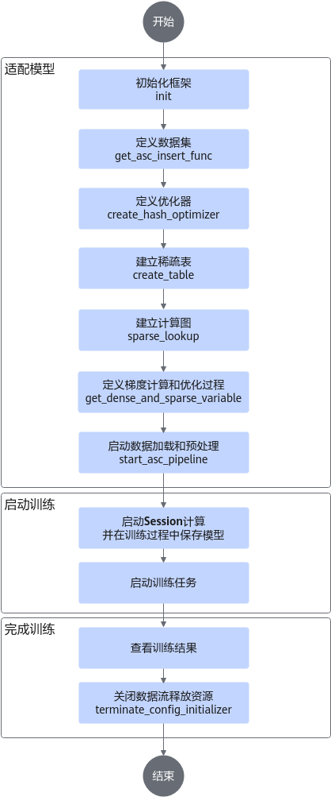
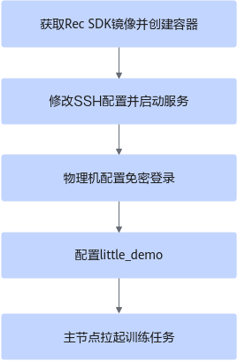

# 快速入门<a name="ZH-CN_TOPIC_0000001580166524"></a>

## 使用前说明<a name="ZH-CN_TOPIC_0000001848119673"></a>

本章节指导用户基于Rec SDK TensorFlow为用户提供的little-demo样例，快速理解一个使用tf.Session进行模型训练需要准备的相关文件和关键接口适配。little-demo仅是一个代码示例，并介绍了调用相关接口的逻辑，不包含具体的模型，没有实现具体的功能。

little-demo仅作参考学习，不支持在little-demo上适配用户自己的模型。little-demo存放路径为：[链接](https://gitcode.com/Ascend/RecSDK/tree/develop_examples_and_tools/examples/demo)。

>[!NOTE] 说明 
>在train\_and\_evaluate场景下不支持多轮eval。

**表 1**  little-demo文件说明

|文件名|说明|
|--|--|
|config.py|模型相关配置。|
|dataset.py|数据集预处理。|
|deterministic_loss|确定性计算loss样例。|
|main.py|模型训练入口。|
|model.py|模型搭建。|
|op_impl_mode.ini|算子配置文件。|
|optimizer.py|优化器。|
|random_data_generator.py|数据集随机生成。|
|README.md|demo模型运行说明。|
|run_deterministic.sh|运行确定性计算的脚本。|
|run_model.py|训练、推理流程封装。|
|run.sh|模型训练启动脚本。|
|utils.py|精度检测工具。|


## 接口调用介绍<a name="ZH-CN_TOPIC_0000001801480550"></a>



1.  初始化框架。在main.py中调用init接口，传入初始化框架需要的相关参数。相关参数请参见[init](./api/initialization_and_deinitialization_of_the_training_framework.md#init)。

    ```bash
    # nbatch function needs to be used together with the prefetch and host_vocabulary_size != 0
    init(max_steps=max_steps,
         train_steps=TRAIN_steps,
         eval_steps=EVAL_STEPS,
         save_steps=SAVE_STEPS,
         use_dynamic=use_dynamic,
         use_dynamic_expansion=use_dynamic_expansion)
    ```

2.  定义数据集。在main.py中调用get\_asc\_insert\_func接口，创建数据集并对数据集进行预处理。相关参数请参见[参数说明](./api/data_apis.md#get_asc_insert_func)。

    ```bash
        if not MODIFY_GRAPH_FLAG:
            insert_fn = get_asc_insert_func(tgt_key_specs=feature_spec_list, is_training=is_training, dump_graph=dump_graph)
            dataset = dataset.map(insert_fn)
        dataset = dataset.prefetch(100)
        iterator = dataset.make_initializable_iterator()
        batch = iterator.get_next()
        return batch, iterator
    ```

3.  定义优化器。在optimizer.py中定义优化器，支持的优化器类型和相关参数请参见[优化器](./api/optimizers_apis.md)。

    ```bash
    # coding: UTF-8
    import logging
    import tensorflow as tf
    from mx_rec.optimizers.lazy_adam import create_hash_optimizer
    from mx_rec.optimizers.lazy_adam_by_addr import create_hash_optimizer_by_address
    from mx_rec.util.initialize import get_use_dynamic_expansion
    def get_dense_and_sparse_optimizer(cfg):
        dense_optimizer = tf.compat.v1.train.AdamOptimizer(learning_rate=cfg.learning_rate)
        use_dynamic_expansion = get_use_dynamic_expansion()
        if use_dynamic_expansion:
            sparse_optimizer = create_hash_optimizer_by_address(learning_rate=cfg.learning_rate)
            logging.info("optimizer lazy_adam_by_addr")
        else:
            sparse_optimizer = create_hash_optimizer(learning_rate=cfg.learning_rate)
            logging.info("optimizer lazy_adam")
        return dense_optimizer, sparse_optimizer
    ```

4.  建立稀疏表。在main.py中调用create\_table接口，建立稀疏表，创建稀疏网络层。相关参数请参见[参数说明](./api/model_apis.md#create_table)。

    ```bash
    user_hashtable = create_table(key_dtype=tf.int64,
                                  dim=tf.Tensorshape([cfg.user_hashtable_dim]),
                                  name='user_table',
                                  emb_initializer=tf.compat.v1.truncated_normal_initializer(),
                                  device_vocabulary_size=cfg.user_vocab_size * 10,
                                  host_vocabulary_size=0)  # cfg.user_vocab_size * 100, # for h2d test
    item_hashtable = create_table(key_dtype=tf.int64,
                                  dim=tf.Tensorshape([cfg.item_hashtable_dim]),
                                  name='item_table',
                                  emb_initializer=tf.compat.v1.truncated_normal_initializer(),
                                  device_vocabulary_size=cfg.item_vocab_size * 10,
                                  host_vocabulary_size=0)  # cfg.user_vocab_size * 100, # for h2d test
    ```

5.  建立计算图。传入稀疏网络层和特征列表，创建模型计算图，在计算图中调用sparse\_lookup进行特征查询和误差计算。相关参数请参见[参数说明](./api/model_apis.md#sparse_lookup)。

    ```bash
    def model_forward(input_list, batch, is_train, modify_graph, config_dict=None):
        embedding_list = []
        feature_list, hash_table_list, send_count_list = input_list
        for feature, hash_table, send_count in zip(feature_list, hash_table_list, send_count_list):
            access_and_evict_config = None
            if isinstance(config_dict, dict):
                access_and_evict_config = config_dict.get(hash_table.table_name)
            embedding = sparse_lookup(hash_table, feature, send_count, is_train=is_train,
                                      access_and_evict_config=access_and_evict_config,
                                      name=hash_table.table_name + "_lookup", modify_graph=modify_graph, batch=batch)
            reduced_embedding = tf.reduce_sum(embedding, axis=1, keepdims=False)
            embedding_list.append(reduced_embedding)
        my_model = MyModel()
        my_model(embedding_list, batch["label_0"], batch["label_1"])
        return my_model
    ```

6.  定义梯度计算和优化过程。在main.py中调用get\_dense\_and\_sparse\_variable接口，得到密集网络层和稀疏网络层的参数，通过优化器计算梯度并执行优化。接口说明请参见[get\_dense\_and\_sparse\_variable](./api/model_apis.md#get_dense_and_sparse_variable)。

    ```bash
    train_iterator, train_model = build_graph([user_hashtable, item_hashtable], is_train=True,
                                                  feature_spec_list=train_feature_spec_list,
                                                  config_dict=ACCESS_AND_EVICT, batch_number=cfg.batch_number)
    eval_iterator, eval_model = build_graph([user_hashtable, item_hashtable], is_train=False,
                                                feature_spec_list=eval_feature_spec_list,
                                                config_dict=ACCESS_AND_EVICT, batch_number=cfg.batch_number)
    dense_variables, sparse_variables = get_dense_and_sparse_variable()
    ```

7.  启动数据加载和预处理。在main.py中调用modify\_graph\_and\_start\_emb\_cache（改图模式）/start\_asc\_pipeline（非改图模式）接口，启动数据流水线（示例代码中使用**if**判断配置文件中的**MODIFY\_GRAPH\_FLAG**来控制是否使用改图模式）。接口说明请参见[modify\_graph\_and\_start\_emb\_cache](./api/data_apis.md#modify_graph_and_start_emb_cache)。

    ```bash
    saver = tf.compat.v1.train.Saver()
    if MODIFY_GRAPH_FLAG:
        logging.info("start to modifying graph")
        modify_graph_and_start_emb_cache(dump_graph=True)
    else:
        start_asc_pipeline()
    with tf.compat.v1.Session(config=sess_config(dump_data=False)) as sess:
        if MODIFY_GRAPH_FLAG:
            sess.run(get_initializer(True))
        else:
            sess.run(train_iterator.initializer)
        sess.run(tf.compat.v1.global_variables_initializer())
        EPOCH = 0
        if os.path.exists(f"./saved-model/sparse-model-{rank_id}-%d" % 0):
            saver.restore(sess, f"./saved-model/model-{rank_id}-%d" % 0)
        else:
            saver.save(sess, f"./saved-model/model-{rank_id}", global_step=0)
        for i in range(1, 201):
            logging.info(f"################    training at step {i}    ################")
            try:
                sess.run([train_ops, train_model.loss_list])
            except tf.errors.OutOfRangeError:
                logging.info(f"Encounter the end of Sequence for training.")
                break
            else:
                if i % TRAIN_INTERVAL == 0:
                    EPOCH += 1
                    evaluate()
                if i % SAVING_INTERVAL == 0:
                    saver.save(sess, f"./saved-model/model-{rank_id}", global_step=i)
        saver.save(sess, f"./saved-model/model-{rank_id}", global_step=i)
    ```

8.  启动Session计算并在训练过程中保存模型。在main.py中调用saver接口，启动Session计算并在训练过程中保存模型。

    ```bash
    saver = tf.compat.v1.train.Saver()
    if MODIFY_GRAPH_FLAG:
        logging.info("start to modifying graph")
        modify_graph_and_start_emb_cache(dump_graph=True)
    else:
        start_asc_pipeline()
    with tf.compat.v1.Session(config=sess_config(dump_data=False)) as sess:
        if MODIFY_GRAPH_FLAG:
            sess.run(get_initializer(True))
        else:
            sess.run(train_iterator.initializer)
        sess.run(tf.compat.v1.global_variables_initializer())
        EPOCH = 0
        if os.path.exists(f"./saved-model/sparse-model-{rank_id}-%d" % 0):
            saver.restore(sess, f"./saved-model/model-{rank_id}-%d" % 0)
        else:
            saver.save(sess, f"./saved-model/model-{rank_id}", global_step=0)
        for i in range(1, 201):
            logging.info(f"################    training at step {i}    ################")
            try:
                sess.run([train_ops, train_model.loss_list])
            except tf.errors.OutOfRangeError:
                logging.info(f"Encounter the end of Sequence for training.")
                break
            else:
                if i % TRAIN_INTERVAL == 0:
                    EPOCH += 1
                    evaluate()
                if i % SAVING_INTERVAL == 0:
                    saver.save(sess, f"./saved-model/model-{rank_id}", global_step=i)
        saver.save(sess, f"./saved-model/model-{rank_id}", global_step=i)
    ```

9.  关闭数据流释放资源。在main.py中调用terminate\_config\_initializer，关闭数据流释放资源。接口说明请参见[terminate\_config\_initializer](./api/initialization_and_deinitialization_of_the_training_framework.md#terminate_config_initializer)。

    ```bash
    terminate_config_initializer()
    logging.info("Demo done!")
    ```


## 启动模型训练<a name="ZH-CN_TOPIC_0000002255637701"></a>

### 单机单卡和单机多卡训练<a name="ZH-CN_TOPIC_0000001801320778"></a>

本章节介绍通过环境变量设置资源信息，启动训练任务，包含单机单卡和单机多卡场景。

**前提条件<a name="section16252115164"></a>**

使用该方案启动训练任务，需要设置如下环境变量。详细的配置环境变量的方法可参考[little-demo的配置文件](https://gitcode.com/Ascend/RecSDK/blob/develop_examples_and_tools/examples/demo/little_demo_estimator/run.sh)；关于环境变量的说明可参见[配置环境变量](recsdk_tf_installation_guide.md#配置环境变量)。

```bash
CM_CHIEF_IP={host_ip}
CM_CHIEF_PORT=60000
CM_CHIEF_DEVICE=0
CM_WORKER_IP={host_ip}
CM_WORKER_SIZE=8
```

**操作步骤<a name="section7534163120565"></a>**

1.  如果需要自定义卡的数量，需要修改**local\_rank\_size=**_自定义卡的数量_，**CM\_WORKER\_SIZE**=_local\_rank\_size \* 训练节点数_。

    >[!NOTE] 说明 
    >-   自定义卡的数量≤容器（或进程）中可见的卡的数量。
    >-   若是以特权模式启动的容器，容器中可见卡的数量=环境中卡的总数；若是以非特权模式启动的容器，容器中可见卡的数量 = 启动容器时实际挂卡的数量。
    >-   若是要进一步控制训练进程中可见卡的数量，可通过环境变量**ASCEND\_RT\_VISIBLE\_DEVICES**来指定当前容器中可见的卡哪些对当前进程可见。该环境变量通常可指定参与训练的Device。
    >-   若是当前进程可见卡的数量为8，支持的自定义卡数量包括1、2、4、8。

    下面的示例以环境中可见8卡为例，卡逻辑ID列表为\[0,1,2,3,4,5,6,7\]

    -   local\_rank\_size = 1，则**export CM\_CHIEF\_DEVICE=**\[0,1,2,3,4,5,6,7\]的任一卡号。
    -   local\_rank\_size = 2，取值说明如下：

        <a name="table12571887269"></a>
        <table><tbody><tr id="row19257483262"><th class="firstcol" rowspan="2" valign="top" width="33.3033303330333%" id="mcps1.1.4.1.1"><p id="p92579882615"><a name="p92579882615"></a><a name="p92579882615"></a>连续用卡</p>
        </th>
        <td class="cellrowborder" valign="top" width="33.36333633363336%" headers="mcps1.1.4.1.1 "><p id="p1525811811261"><a name="p1525811811261"></a><a name="p1525811811261"></a><strong id="b17693541182615"><a name="b17693541182615"></a><a name="b17693541182615"></a>export CM_CHIEF_DEVICE</strong>=0</p>
        </td>
        <td class="cellrowborder" valign="top" width="33.33333333333333%" headers="mcps1.1.4.1.1 "><p id="p1325819818263"><a name="p1325819818263"></a><a name="p1325819818263"></a>表示0、1卡参与训练</p>
        </td>
        </tr>
        <tr id="row1510805512616"><td class="cellrowborder" valign="top" headers="mcps1.1.4.1.1 "><p id="p5109175502616"><a name="p5109175502616"></a><a name="p5109175502616"></a><strong id="b4810175516268"><a name="b4810175516268"></a><a name="b4810175516268"></a>export CM_CHIEF_DEVICE</strong>=4</p>
        </td>
        <td class="cellrowborder" valign="top" headers="mcps1.1.4.1.1 "><p id="p610920554264"><a name="p610920554264"></a><a name="p610920554264"></a>表示4、5卡参与训练</p>
        </td>
        </tr>
        <tr id="row19258589267"><th class="firstcol" rowspan="3" valign="top" width="33.3033303330333%" id="mcps1.1.4.3.1"><p id="p1225813872619"><a name="p1225813872619"></a><a name="p1225813872619"></a>非连续用卡</p>
        </th>
        <td class="cellrowborder" valign="top" width="33.36333633363336%" headers="mcps1.1.4.3.1 "><p id="p112587815261"><a name="p112587815261"></a><a name="p112587815261"></a><strong id="b111192026122717"><a name="b111192026122717"></a><a name="b111192026122717"></a>export ASCEND_RT_VISIBLE_DEVICES</strong>=1,3,5,7</p>
        <p id="p13398190172618"><a name="p13398190172618"></a><a name="p13398190172618"></a>如果创建容器的时候是连续卡，要使用非连续卡，此时需要设置该环境变量。</p>
        </td>
        <td class="cellrowborder" valign="top" width="33.33333333333333%" headers="mcps1.1.4.3.1 "><p id="p325838142619"><a name="p325838142619"></a><a name="p325838142619"></a>此时环境可见卡的逻辑ID列表[1,3,5,7]</p>
        </td>
        </tr>
        <tr id="row34071512281"><td class="cellrowborder" valign="top" headers="mcps1.1.4.3.1 "><p id="p11954144117278"><a name="p11954144117278"></a><a name="p11954144117278"></a><strong id="b48331245102715"><a name="b48331245102715"></a><a name="b48331245102715"></a>export CM_CHIEF_DEVICE</strong>=0</p>
        </td>
        <td class="cellrowborder" valign="top" headers="mcps1.1.4.3.1 "><p id="p1695494182712"><a name="p1695494182712"></a><a name="p1695494182712"></a>表示1、3卡参与训练</p>
        </td>
        </tr>
        <tr id="row664071762718"><td class="cellrowborder" valign="top" headers="mcps1.1.4.3.1 "><p id="p9641151732719"><a name="p9641151732719"></a><a name="p9641151732719"></a><strong id="b13441536132712"><a name="b13441536132712"></a><a name="b13441536132712"></a>export CM_CHIEF_DEVICE</strong>=1</p>
        </td>
        <td class="cellrowborder" valign="top" headers="mcps1.1.4.3.1 "><p id="p10641151711271"><a name="p10641151711271"></a><a name="p10641151711271"></a>表示3、5卡参与训练</p>
        </td>
        </tr>
        </tbody>
        </table>

    -   local\_rank\_size = 4，取值说明如下：
        -   **export CM\_CHIEF\_DEVICE**=0（表示0、1、2、3卡参与训练）
        -   **export CM\_CHIEF\_DEVICE**=4（表示4、5、6、7卡参与训练）

    -   local\_rank\_size = 8，取值说明如下：

        **export CM\_CHIEF\_DEVICE**=0（表示0、1、2、3、4、5、6、7、8卡参与训练）

    >[!NOTE] 说明 
    >Rec SDK TensorFlow默认使用8卡训练，16卡使能需要执行以下命令。
    >```bash
    >for pdev in `lspci -vvv|grep -E "^[a-f]|^[0-9]|ACSCtl"|grep ACSCtl -B1|grep -E "^[a-f]|^[0-9]"|awk '{print $1}'` 
    >do
    >setpci -s $pdev ECAP_ACS+06.w=0000 
    >done
    >```

2.  直接在启动命令后传入配置Master节点的Host侦听IP，命令格式如下。

    ```bash
    bash run.sh main.py {host_ip}  
    ```

    >[!NOTE] 说明 
    >-   只有在启动命令后传入合法可用的IP地址，才可通过环境变量设置资源信息的方式启动训练任务。
    >-   若环境中同时存在[资源配置文件](https://www.hiascend.com/document/detail/zh/TensorFlowCommercial/80RC3/migration/tfmigr1/tfmigr1_000030.html)，此时不传IP或者IP错误，则会通过资源配置文件的方式，启动训练任务。
    >-   若环境中不存在[资源配置文件](https://www.hiascend.com/document/detail/zh/TensorFlowCommercial/80RC3/migration/tfmigr1/tfmigr1_000030.html)，此时不传IP或者IP错误，系统会提示“the rank table file does not exist”，此时用户可以通过配置资源文件或者传入符合要求的IP后，重新启动训练任务。

    正常开始执行，打印信息参考如下。

    ```bash
    ip: {host_ip} available.
    The ranktable solution is removed.
    CM_CHIEF_IP={host_ip}  
    CM_CHIEF_PORT=60000
    CM_CHIEF_DEVICE=0
    CM_WORKER_IP={host_ip}  
    CM_WORKER_SIZE=8
    ASCEND_VISIBLE_DEVICES=0-8
    py is main.py
    use horovod to start tasks
    ...
    ```

    执行完成，日志信息显示参考如下。

    ```bash
    ASC manager has been destroyed.
    MPI has been destroyed.
    Demo done!
    ```


### 多机多卡训练<a name="ZH-CN_TOPIC_0000002255557825"></a>

本章节以双机（单节点8卡）为示例，介绍通过环境变量设置资源信息，在多机多卡场景下启动训练任务。

**前提条件<a name="section148281112515"></a>**

-   设置如下环境变量。详细的配置环境变量的方法可参考[little-demo的配置文件](https://gitcode.com/Ascend/RecSDK/blob/develop_examples_and_tools/examples/demo/little_demo/run.sh)；关于环境变量的说明可参见[配置环境变量](recsdk_tf_installation_guide.md#配置环境变量)。

    ```bash
    CM_CHIEF_IP={host_ip}
    CM_CHIEF_PORT=60000
    CM_CHIEF_DEVICE=0
    CM_WORKER_IP={host_ip}
    CM_WORKER_SIZE=8
    ```

-   双机节点little\_demo模型代码路径和配置IP的网卡名称需要保持一致。
-   已完成集群内的组网配置。详细方法可参见《[Ascend Training Solution 组网指南](https://support.huawei.com/enterprise/zh/doc/EDOC1100525718/549e2956?idPath=23710424|251366513|22892968|252309113|258915853)》的“组网介绍”章节。
-   已经根据[制作Rec SDK TensorFlow训练镜像](recsdk_tf_installation_guide.md#制作rec-sdk-tensorflow训练镜像)，制作Rec SDK TensorFlow的训练镜像。
-   已完成基础集群环境的网络配置检查，例如确认多机节点的NPU device IP能互相ping通，多机节点的NPU device的TLS配置相同等。如果集群通信失败，可参考[多机训练HCCL集群通信失败](faq.md#多机训练hccl集群通信失败)解决。

**操作步骤<a name="section4206609112"></a>**

多机训练的配置的主要步骤为：下载Rec SDK TensorFlow镜像并创建容器后，修改SSH配置并启动服务，然后配置物理机节点之间的免密登录，最后配置little\_demo模型，进而拉起训练进程，实现多机训练。双机时可任选一节点为主节点。



1.  双机节点创建并配置容器。
    1.  确定节点需要使用的端口号。所有节点都需要用同一未被占用的端口号。可在物理机上执行以下命令，查询端口是否使用。以端口12345为例。

        ```bash
        ss -tuln | grep 12345
        ```

        >[!NOTE] 说明 
        >若ss指令不存在需安装iproute软件包。

        -   结果为空，表示端口未使用 =\> 继续执行[1.b](#li9821162384914)
        -   结果不为空，表示端口已使用 =\> 重复查询其他端口号

    2.  <a id="li9821162384914"></a>在容器内修改sshd\_config文件。

        ```bash
        vi /etc/ssh/sshd_config
        ```

        1.  取消“\#Port 22”所在行的注释，并将端口号修改为未使用的端口号（如“12345”），便于mpi通过指定端口进入其他节点容器。同时，Host侧防火墙策略中需允许访问该端口。
        2.  取消“\#ListenAddress 0.0.0.0”的注释，并将“0.0.0.0”修改为当前节点IP。如果采用导出最新容器镜像并复制到其他环境的方式部署集群环境，在其他节点启动并进入容器后，需手动修改容器内SSH服务侦听IP为对应节点IP。

            >[!NOTE] 说明 
            >如果不执行该步骤，不会影响集群训练，但是会侦听宿主机全零IP的对应端口。出于安全考虑，建议进行修改。

    3.  在容器内执行以下命令重启SSH服务。

        ```bash
        systemctl restart sshd
        ```

        重启后，执行**systemctl status sshd**命令查看SSH服务的状态。

        可执行**ss -tuln | grep** _12345_查看侦听端口是否为配置的端口。

        如需停止容器内SSH服务，可在容器内执行：

        ```bash
        kill -9 `ps -ef | grep sshd | grep -v grep | awk '{print $2}'` > /dev/null 2>&1
        ```

    4.  设置容器内环境变量。

        将启动训练前需要配置的环境变量设置到容器内的\~/.bashrc文件，便于主节点免密登录到其他节点容器内时能直接使用，无需配置环境变量。

        示例如下，按需配置：

        1.  打开“\~/.bashrc”文件。

            ```bash
            vi ~/.bashrc
            ```

        2.  在文件末尾添加以下内容。

            ```bash
            source /etc/profile
            source /usr/local/Ascend/cann/set_env.sh
            source /usr/local/Ascend/driver/bin/setenv.bash
            export PATH=/usr/local/openmpi/bin:$PATH
            export PATH=/usr/local/python3.7.5/bin:$PATH
            export PATH=/usr/local/gcc7.3.0/bin:$PATH
            export LD_LIBRARY_PATH=/usr/local/python3.7.5/lib:$LD_LIBRARY_PATH
            export LD_LIBRARY_PATH=/usr/local/gcc7.3.0/lib64:$LD_LIBRARY_PATH
            export LD_LIBRARY_PATH=/usr/local/openmpi/lib:$LD_LIBRARY_PATH
            ```

        3.  按“Esc”键，输入<b>:wq!</b>，按“Enter”保存并退出编辑。
        4.  执行**source \~/.bashrc**使环境变量配置生效。

2.  配置little\_demo模型。
    1.  使用以下命令查看8卡芯片的device IP，命令参考如下。

        ```bash
        for i in {0..7}; do hccn_tool -i $i -ip -g ; done
        ```

    2.  配置资源信息。
        -   <a id="li488122614226"></a>ranktable方式启动时，所有节点中均需要“hccl\_json\_16p\_2\_host.json”配置文件，且文件内容一样。“hccl\_json\_16p\_2\_host.json”文件配置样例参考如下。

            示例为双机节点“hccl\_json\_16p\_2\_host.json”配置，主节点的device信息需配置在第一个device中。\{device\_ip\}和\{host\_ip\}需要根据真实环境配置进行替换，rank\_id需要保持升序。

            ```bash
            {
                "server_count":"2",
                "server_list":[
                    {
                        "device":[
                            { "device_id":"0", "device_ip":"{device_0_ip}", "rank_id":"0" },
                            { "device_id":"1", "device_ip":"{device_1_ip}", "rank_id":"1" },
                            { "device_id":"2", "device_ip":"{device_2_ip}", "rank_id":"2" },
                            { "device_id":"3", "device_ip":"{device_3_ip}", "rank_id":"3" },
                            { "device_id":"4", "device_ip":"{device_4_ip}", "rank_id":"4" },
                            { "device_id":"5", "device_ip":"{device_5_ip}", "rank_id":"5" },
                            { "device_id":"6", "device_ip":"{device_6_ip}", "rank_id":"6" },
                            { "device_id":"7", "device_ip":"{device_7_ip}", "rank_id":"7" }
                        ],
                        "server_id":"{host_1_ip}"
                    },
                    {
                        "device":[
                            { "device_id":"0", "device_ip":"{device_8_ip}", "rank_id":"8" },
                            { "device_id":"1", "device_ip":"{device_9_ip}", "rank_id":"9" },
                            { "device_id":"2", "device_ip":"{device_10_ip}", "rank_id":"10" },
                            { "device_id":"3", "device_ip":"{device_11_ip}", "rank_id":"11" },
                            { "device_id":"4", "device_ip":"{device_12_ip}", "rank_id":"12" },
                            { "device_id":"5", "device_ip":"{device_13_ip}", "rank_id":"13" },
                            { "device_id":"6", "device_ip":"{device_14_ip}", "rank_id":"14" },
                            { "device_id":"7", "device_ip":"{device_15_ip}", "rank_id":"15" }
                        ],
                        "server_id":"{host_2_ip}"
                    }
                ],
                "status":"completed",
                "version":"1.0"
            }
            ```

        -   no ranktable启动时，不需要配置hccl json文件，但需要在所有备节点little\_demo模型代码的main.py中手动设置环境变量，修改如下：

            在main.py顶部import os的下一行添加如下代码：

            ```bash
            # no ranktable时设置CM_WORKER_IP环境变量为当前节点ip，{host_ip}为当前节点ip。
            if not os.getenv("RANK_TABLE_FILE", ""):
                os.environ['CM_WORKER_IP'] = "{host_ip}"
            ```

    3.  修改run.sh脚本（仅需修改主节点）。
        1.  num\_server修改为实际节点数（比如2）。
        2.  删除mpi\_args变量值中的“-mca btl\_tcp\_if\_exclude docker0”字符串。
        3.  将“interface“的值修改为配置当前host ip的网卡名。可通过**ip addr**进行查询。
        4.  使用ranktable启动方案时，还需修改export RANK\_TABLE\_FILE变量值中的json文件名称，使其与[•ranktable方式启动时，所有节点中均需要...](#li488122614226)中配置的双机的hccl json文件名一致，例如：

            将

            ```bash
            export RANK_TABLE_FILE="${cur_path}/hccl_json_${local_rank_size}p.json"
            ```

            修改为：

            ```bash
            export RANK_TABLE_FILE="${cur_path}/hccl_json_16p_2_host.json"  
            ```

        5.  通过horovodrun启动指令指定端口号并修改host参数，修改如下内容：

            在run.sh脚本末尾，将

            ```bash
            xxx --mpi-args "${mpi_args}" --mpi -H localhost:${local_rank_size} 
            ```

            修改为：

            ```bash
            xxx --mpi-args "${mpi_args}" -p 12345 --mpi -H {host_1_ip}:8,{host_2_ip}:8
            ```

            >[!NOTE] 说明 
            >-   -p 12345：容器内ssh server侦听端口号。
            >-   8：单节点参与训练的device数。

3.  在每个节点上互相设置免密登录。
    1.  在每个节点的容器内执行以下命令，设置免密登录。其中\{target\_host\_user\}为对端节点的用户名，\{target\_host\_ip\}为对端节点的IP。

        ```bash
        ssh-copy-id -i ~/.ssh/id_rsa.pub {target_host_user}@{target_host_ip}
        ```

        >[!NOTE] 说明 
        >该命令默认将公钥追加到对端节点宿主机的\~/.ssh/authorized\_keys文件中，需要用户将宿主机上的authorized\_keys文件拷贝到容器内的\~/.ssh目录下。

        若提示没有id\_rsa.pub，可以使用如下命令在容器内生成。为了安全起见，在执行命令前需将当前umask值改为0077，执行完后再恢复为原值；并建议在提示“Enter passphrase”时输入符合复杂度要求的密钥密码。

        ```bash
        ssh-keygen -t rsa -b 3072 -f ~/.ssh/id_rsa
        ```

        >[!NOTE] 说明  
        >以上为示例，请注意SSH密钥和密钥密码在使用和保管过程中的风险，特别是密钥未加密时的风险，用户应按照所在组织的安全策略进行相关配置，如口令复杂度要求、安全配置（协议、加密套件、密钥长度、是否允许使用ssh-keygen等）。

    2.  设置SSH代理管理SSH密钥。

        设置SSH代理命令如下：

        a. 开启ssh-agent的bash进程。

        ```bash
        ssh-agent bash
        ```

        >[!NOTE] 说明  
        >执行此命令时容器内的环境变量会被重置。建议将必要的环境变量保存到容器内的\~/.bashrc文件中，并在执行完该命令后使用**source \~/.bashrc**命令重新配置。

        b. 向ssh-agent添加私钥。

        ```bash
        ssh-add ~/.ssh/id_rsa
        ```

        执行如上命令会提示“Enter passphrase for /root/.ssh/id\_rsa:”，此时需要输入生成id\_rsa私钥时设置的密码。

        c. 验证私钥是否添加成功。

        ```bash
        ssh-add -l 
        ```

    3.  检查免密登录是否设置成功。

        ```bash
        ssh-keygen -R {target_host_ip}  # 删除当前节点中目标ip的host key缓存
        ssh-keygen -R "[{target_host_ip}]:12345"  # 删除当前host上保存的目标ip对应端口的host key缓存
        ssh {target_host_user}@{target_host_ip}   # 验证免密登录目标ip
        ssh {target_host_user}@{target_host_ip} -p 12345  # 验证免密登录目标ip指定端口
        ```

4.  在主节点执行以下命令，拉起模型。**只需要在主节点拉起即可，备节点不需要手动拉起训练任务**，mpi会自动跳转过去拉起训练任务。
    -   rank table模式：

        ```bash
        bash run.sh main.py
        ```

    -   去rank table模式，其中\{host\_1\_ip\}为主节点IP。

        ```bash
        bash run.sh main.py {host_1_ip}
        ```

        >[!NOTE] 说明  
        >执行完拉起训练任务后，请使用**exit**命令退出ssh-agent的bash进程，避免安全风险。


