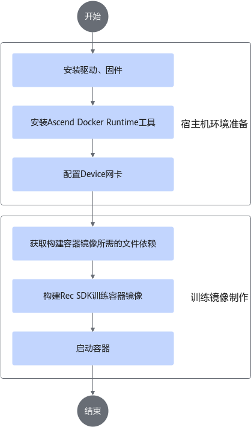

# 安装部署<a name="ZH-CN_TOPIC_0000001580166488"></a>

## 安装说明<a name="ZH-CN_TOPIC_0000001579847264"></a>

-   Rec SDK TensorFlow支持物理机部署开发环境或通过容器部署开发环境，用户可根据实际业务情况选择其中一种进行部署。
-   建议通过普通用户进行安装、运行。

    >[!NOTE] 说明 
    >如果需要查看Rec SDK TensorFlow的历史安装记录，请参见[查看Rec SDK TensorFlow安装与卸载记录](common_operations.md#查看rec-sdk-tensorflow安装与卸载记录)。


## 安装依赖<a name="ZH-CN_TOPIC_0000001580007100"></a>

安装Rec SDK TensorFlow软件包前需准备以下环境依赖及操作，请参见[表1](#table18461141184116)准备安装环境。

**表 1** Rec SDK TensorFlow环境依赖
<a id="table18461141184116"></a>

|依赖名称/操作|推荐版本|获取方式|
|--|--|--|
|CANN软件包和TensorFlow适配昇腾插件|CANN 8.5.0|<li>Ascend-cann-toolkit_{version}_linux-{arch}.run：单击[获取链接](https://www.hiascend.com/developer/download/commercial/result?module=cann)，在左侧配套资源的“编辑资源选择”中进行配置，筛选配套的软件包，确认版本信息后获取所需软件包。<br>请参见《CANN 软件安装指南》进行安装。</li><li>TensorFlow适配昇腾插件单击[获取链接](https://gitee.com/ascend/tensorflow/releases/tag/tfa_v0.0.44_8.3.RC1)。npu_device-2.6.5\*适配TensorFlow 2.6.5的版本；npu_bridge-1.15.0\*适配TensorFlow 1.15.0的版本。</li>|
|昇腾硬件产品驱动和固件|Ascend HDK 25.5.0|单击[获取链接](https://www.hiascend.com/developer/download/commercial/result?module=cann)，在左侧配套资源的“编辑资源选择”中进行配置，筛选配套的软件包，确认版本信息后获取所需软件包。安装驱动与固件请参见相关硬件产品配套的[《驱动和固件安装升级指南》](https://support.huawei.com/enterprise/zh/ascend-computing/ascend-hdk-pid-252764743)。|
|Ascend Docker Runtime|MindCluster 7.3.0|请参见《MindCluster 集群调度用户指南》的“安装 > 安装部署”章节进行安装。|
|配置Device网卡|-|请参考《Ascend Training Solution 组网指南》的参数面网络配置示例配置示例配置训练节点章节，通过HCCN_Tool配置NPU网口的Device IP。|
|TensorFlow|TensorFlow 1.15.0和TensorFlow 2.6.5|请从[TensorFlow](https://github.com/tensorflow/tensorflow)仓库获取源码。Arm环境下TensorFlow官方未提供对应的whl包，如需在Arm环境下使用，可以从[链接](https://ascend-repo.obs.cn-east-2.myhuaweicloud.com/MindX/OpenSource/python/index.html)获取Arm的TensorFlow whl包。<br>[!NOTE] 说明<br>若whl包下载受阻，可复制其链接并在新标签页中打开，即可顺利完成下载。|
|Python 3.7.5|Python 3.7.5|请从[Python官网](https://www.python.org/)获取依赖软件包。|


>[!NOTICE] 须知 
>对于用户集成的开源和第三方软件，漏洞和问题请自行跟踪社区并及时进行修复；可以但不限于通过[CVE（通用漏洞字典）官网](https://www.cve.org/)确认对应开源软件版本的已知漏洞，并通过版本升级、使用patch补丁包更新等方式修复。


## 获取Rec SDK TensorFlow软件包<a name="ZH-CN_TOPIC_0000001630127085"></a>

可参见本章节获取Rec SDK TensorFlow的软件，并进行软件数字签名验证。

如果用户需要了解Rec SDK TensorFlow的源码，则可在[源码地址](https://gitcode.com/Ascend/RecSDK/tree/branch_v7.2.0-RC1)获取组件源码；也支持用户自行编译源码，具体操作可参考编译源码指导。

**下载软件包<a name="section1852417242717"></a>**

请参考本章获取所需软件包和对应的数字签名文件，下载本软件即表示您同意[华为企业业务最终用户许可协议（EULA）](https://e.huawei.com/cn/about/eula)的条款和条件。

|组件名称|软件包|获取链接|
|--|--|--|
|Rec SDK|推荐算法框架开发套件包|[获取链接](https://www.hiascend.com/zh/developer/download/community/result?module=sdk+cann)。|


**软件数字签名验证<a name="section10830205518487"></a>**

为了防止软件包在传递过程中或存储期间被恶意篡改，下载软件包时请下载对应的数字签名文件用于完整性验证。

在软件包下载之后，请参考《OpenPGP签名验证指南》，对下载的软件包进行PGP数字签名校验。如果校验失败，请勿使用该软件包并联系华为技术支持工程师解决。

使用软件包安装/升级前，也需要按照上述过程，验证软件包的数字签名，确保软件包未被篡改。

运营商客户请访问：[https://support.huawei.com/carrier/digitalSignatureAction](https://support.huawei.com/carrier/digitalSignatureAction)

企业客户请访问：[https://support.huawei.com/enterprise/zh/tool/software-digital-signature-openpgp-validation-tool-TL1000000054](https://support.huawei.com/enterprise/zh/tool/software-digital-signature-openpgp-validation-tool-TL1000000054)


## 使用物理机部署开发环境<a name="ZH-CN_TOPIC_0000001630046437"></a>

>[!NOTICE] 须知 
>-   当前支持在Ubuntu  20.04、CentOS  7系统中进行物理机开发环境部署。
>-   用户请勿修改编译目录下除run.sh文件外的其他文件代码。

1.  参考《CANN 软件安装指南》安装CANN软件包和TensorFlow适配昇腾插件。
2.  配置环境变量。

    CANN软件提供进程级环境变量设置脚本，供用户在进程中引用，以自动完成环境变量设置。用户进程结束后自动失效。

    可在程序启动的Shell脚本中使用如下命令设置CANN的相关环境变量，也可通过命令行执行如下命令（以root用户默认安装路径“/usr/local/Ascend”为例）：

    ```bash
    source /usr/local/Ascend/cann/set_env.sh
    ```

3.  通过如下命令解压软件包，若未指定具体路径，默认解压到当前目录下，解压命令中需要添加--no-same-owner参数。

    ```bash
    # 解压到当前目录下
    tar -xf Ascend-mindxsdk-mxrec-{version}_linux-{arch}.tar.gz --no-same-owner
    # 解压到特定目录下
    tar -xf Ascend-mindxsdk-mxrec-{version}_linux-{arch}.tar.gz --no-same-owner -C 指定路径
    ```

4.  解压完后的目录结构参见如下。

    ```bash
    mindxsdk-mxrec/
    |-- tf1_whl
    |   `-- mx_rec-{version}-py3-none-linux_{arch}.whl    #适用于TensorFlow 1.15.0版本的mx_rec框架Wheel包
    |-- tf2_whl
    |   `-- mx_rec-{version}-py3-none-linux_{arch}.whl    #适用于TensorFlow 2.6.5版本的mx_rec框架Wheel包
    `-- version.info
    ```

5.  安装软件包中的Wheel包。（请根据实际需求，选取对应TensorFlow版本匹配的Wheel包。）

    ```bash
    pip3 install mx_rec-{version}-py3-none-linux_{arch}.whl 
    ```

    Wheel包默认安装在Python的“site-packages”路径，若通过“--target”参数指定目录，在安装完成后需要将Rec SDK TensorFlow路径加入“PYTHONPATH”环境变量。

    ```bash
    export PYTHONPATH={rec_install_path}:{rec_install_path}/mx_rec:$PYTHONPATH
    ```

6.  安装依赖，若未构建镜像，直接在物理机上进行开发，则须安装以下Python依赖。

    ```bash
    pip3.7 install numpy decorator sympy==1.4 cffi==1.12.3 pyyaml pathlib2 grpcio grpcio-tools protobuf==3.20.0 scipy requests mpi4py easydict scikit-learn==0.20.0 attrs
    ```

    horovod依赖安装前需配置“HOROVOD\_WITH\_MPI”、“HOROVOD\_WITH\_TENSORFLOW”，依赖安装命令参考如下。

    ```bash
    HOROVOD_WITH_MPI=1 HOROVOD_WITH_TENSORFLOW=1 pip3.7 install horovod --no-cache-dir
    ```

7.  如需使用动态扩容功能，请参见[（可选）片上内存侧动态扩容算子包安装](common_operations.md#可选片上内存侧动态扩容算子包安装)，编译安装动态扩容算子包。
8.  如需使用Hadoop分布式文件系统，请参考[Hadoop官方文档](https://hadoop.apache.org/docs/r1.0.4/cn/quickstart.html)进行环境部署和集群搭建。推荐使用Hadoop-2.7.5版本。


## 部署容器内的开发环境<a name="ZH-CN_TOPIC_0000002175060298"></a>

### 使用容器部署开发环境<a name="ZH-CN_TOPIC_0000001579847292"></a>

>[!NOTICE] 须知 
>-   如需使用CentOS系统进行配置（包括宿主机及容器），libstdc++版本需要高于libstdc++.so.6.0.24。
>-   出于安全保护，用户仅能使用非root用户启动容器进行使用。

基于容器部署Rec SDK TensorFlow开发环境，可参考如[图1](#fig2687191413442)步骤完成配置。

**图 1**  配置容器内的开发环境及训练镜像构建<a id="fig2687191413442"></a>  


**关键步骤说明<a name="section15488921175211"></a>**

1.  宿主机环境准备。

    请参见[安装依赖](#安装依赖)完成宿主机环境的部署。

2.  获取训练镜像，启动容器。可参考[昇腾镜像仓库](https://www.hiascend.com/developer/ascendhub)完成基础镜像的制作，以及Rec SDK TensorFlow的安装。
3.  如需在容器中使用动态扩容功能，请参见[（可选）片上内存侧动态扩容算子包安装](common_operations.md#可选片上内存侧动态扩容算子包安装)，编译安装动态扩容算子包。
4.  如需使用Hadoop分布式文件系统，请参考[Hadoop官方文档](https://hadoop.apache.org/docs/r1.0.4/cn/quickstart.html)进行环境部署和集群搭建。推荐使用Hadoop-2.7.5版本。

    >[!NOTE] 说明 
    >根据Hadoop官方文档部署环境之后，环境中/usr/local/hadoop-2.7.5/sbin文件属主为20415（非root用户），该属主有重命名、创建新文件来替换root用户的PATH环境变量中的可执行文件的权限，存在越权风险。


### 制作Rec SDK TensorFlow训练镜像<a name="ZH-CN_TOPIC_0000001787827420"></a>

本章节旨在指导用户根据已有基础镜像制作Rec SDK TensorFlow的训练镜像。

**前提条件<a name="section9622175114313"></a>**

1.  已经参考[安装依赖](#安装依赖)，在物理机上安装对应CANN版本的驱动和固件。
2.  物理机上已经安装Docker，并且Docker网络可用。
3.  准备基础镜像。可以从[昇腾镜像仓库](https://www.hiascend.com/developer/ascendhub)获取基础镜像，或者使用用户已有的基础镜像。
    -   （推荐）从昇腾镜像仓库获取Rec SDK TensorFlow训练镜像。昇腾镜像仓库上的Rec SDK TensorFlow训练镜像中已经安装gcc、cmake等基础依赖，无需再次安装；只需更新其中的CANN和Rec SDK软件包即可使用。
    -   从昇腾镜像仓库获取CentOS 7.6.1810镜像。如果不从昇腾镜像仓库获取基础镜像，用户自己准备一个镜像作为基础镜像，建议以CentOS 7.6.1810镜像为基础。

4.  执行如下命令，将基础镜像加载到docker中。

    ```bash
    docker load --input xxx.tar
    ```

5.  创建一个制作镜像使用的文件夹（以build\_images为例）。
    1.  仅将制作镜像过程中要使用到的文件放至该文件夹中，如对应架构的Ascend-cann-toolkit\_\*.run、tfplugin、Rec SDK软件包。
    2.  若需安装tfplugin软件包，还需将/usr/local/Ascend/driver/version.info和/etc/ascend\_install.info两个文件拷贝到build\_images目录下。

        （请勿在build\_images目录下放入无关文件，制作镜像时会将该目录下文件拷贝到镜像内。）

6.  制作镜像过程中需使用docker指令及从物理机拷贝文件，请确保用户有执行指令和访问文件权限。

**使用Rec SDK TensorFlow基础镜像制作训练镜像<a name="section1373503012391"></a>**

1.  参考[获取Rec SDK TensorFlow软件包](#获取rec-sdk-tensorflow软件包)，获取Rec SDK软件包，以及配套的CANN软件包和TensorFlow适配昇腾插件。
2.  在build\_images目录下创建Dockerfile配置文件（以Dockerfile名称为例），使用vi Dockerfile命令编辑文件，插入如下内容。

    ```bash
    # 请根据实际情况修改基础镜像名称及镜像tag
    FROM rec_sdk-tf1:7.3.0
    
    # CANN相关参数
    ARG TOOLKIT_PKG=Ascend-cann-toolkit*.run
    ARG KERNEL_PKG=Ascend-cann-*-ops*.run
    ARG TF1_PLUGIN=npu_bridge-1.15.0-*.whl
    ARG TF2_PLUGIN=npu_device-2.6.5-*.whl
    # Rec SDK TensorFlow包
    ARG REC_SDK_PKG=Ascend-mindxsdk-mxrec*.tar.gz
    
    # 设置安装路径环境变量
    ARG ASCEND_BASE=/usr/local/Ascend
    
    # 删除旧的CANN
    RUN rm -rf $ASCEND_BASE/ascend-toolkit
    RUN rm -rf $ASCEND_BASE/cann*
    
    # 请根据实际情况选择安装需要拷贝和安装的依赖，若无需执行可将指令行删除
    WORKDIR /tmp
    COPY $TOOLKIT_PKG .
    COPY $KERNEL_PKG .
    COPY $TF1_PLUGIN .
    COPY $TF2_PLUGIN .
    COPY $REC_SDK_PKG .
    COPY version.info .
    COPY ascend_install.info .
    
    # 安装ascend-toolkit和ops算子包
    RUN umask 0027 && \
        mkdir -p $ASCEND_BASE/driver && \
        /usr/bin/cp -f version.info $ASCEND_BASE/driver/ && \
        /usr/bin/cp -f ascend_install.info /etc/ && \
        chmod +x $TOOLKIT_PKG && \
        echo Y | bash $TOOLKIT_PKG --quiet --install --install-path=$ASCEND_BASE && \
        chmod +x $KERNEL_PKG && \
        echo Y | bash $KERNEL_PKG --quiet --install && \
        source $ASCEND_BASE/cann/set_env.sh && \
        rm -rf /root/.cache/pip && \
        rm -f $TOOLKIT_PKG && \
        rm -f $KERNEL_PKG && \
        rm -rf $ASCEND_BASE/driver && \
        rm -rf /etc/ascend_install.info
    
    # 安装Rec SDK TensorFlow，以安装tf1版本为例。（如需安装tf2版本Rec SDK包，将tf1修改为tf2即可）
    ARG SDK_TF_VERSION=tf1
    RUN pip3.7 install $TF1_PLUGIN --force-reinstall && \
        pip3.7 install $TF2_PLUGIN --force-reinstall && \
    tar -zxvf Ascend-mindxsdk-mxrec*.tar.gz && \
        pip3.7 install mindxsdk-mxrec/${SDK_TF_VERSION}_whl/mx_rec-*.whl --force-reinstall && \
        rm -rf /root/.cache/pip
    ```

3.  进入build\_images路径，执行如下指令构建Rec SDK TensorFlow镜像。

    ```bash
    docker build -t {镜像名称}:{镜像tag} -f Dockerfile .
    ```

**使用CentOS 7.6.1810或用户镜像制作训练镜像<a name="section104919392501"></a>**

1.  确认镜像中是否已经安装以下依赖，将未安装的依赖软件包下载到build\_images目录下。

    |依赖名称|下载链接|
    |--|--|
    |gcc-7.3.0|[链接](https://mirrors.ustc.edu.cn/gnu/gcc/gcc-7.3.0/gcc-7.3.0.tar.gz)|
    |cmake-3.20.6|[链接](https://cmake.org/files/v3.20/cmake-3.20.6.tar.gz)|
    |ucx|[链接](https://github.com/openucx/ucx/archive/master.zip)|
    |openmpi-4.1.5|[链接](https://download.open-mpi.org/release/open-mpi/v4.1/openmpi-4.1.5.tar.gz)|
    |python-3.7.5|[链接](https://repo.huaweicloud.com/python/3.7.5/Python-3.7.5.tar.xz)|
    |hdf5-1.10.5|[链接](https://support.hdfgroup.org/ftp/HDF5/releases/hdf5-1.10/hdf5-1.10.5/src/hdf5-1.10.5.tar.gz)|
    |CANN软件包、TensorFlow适配昇腾插件以及Rec SDK软件包|参见[安装依赖](#安装依赖)|
    |TensorFlow（1.15.0/2.6.5）|[链接](https://ascend-repo.obs.cn-east-2.myhuaweicloud.com/MindX/OpenSource/python/index.html)|


2.  在build\_images目录下创建Dockerfile配置文件（以Dockerfile名称为例），使用vi Dockerfile命令编辑文件，插入如下内容。

    ```bash
    # 请根据实际情况修改基础镜像名称及镜像tag
    FROM swr.cn-south-1.myhuaweicloud.com/ascendhub/centos:7.6.1810
    
    WORKDIR /tmp
    
    
    # 根据实际情况选择安装需要的依赖，如果一些依赖不需要可以将对应代码去掉或注释；同时，确保下载的依赖的包名与如下代码中的包名一致，
    # 否则在安装对应的依赖时可能出现找不到文件的错误。
    COPY gcc-7.3.0.tar.gz ./
    COPY cmake-3.20.6.tar.gz ./
    COPY ucx-master.zip ./
    COPY openmpi-4.1.5.tar.gz ./
    COPY Python-3.7.5.tar.xz ./
    COPY hdf5-1.10.5.tar.gz ./
    
    COPY Ascend-cann-toolkit*.run ./
    COPY Ascend-cann-*-ops*.run ./
    COPY version.info ./
    COPY ascend_install.info ./
    COPY ./npu_bridge-1.15.0-*.whl ./
    COPY ./npu_device-2.6.5-*.whl ./
    COPY Ascend-mindxsdk-mxrec*.tar.gz ./
    
    # 1.安装编译环境
    RUN yum makecache && \
        yum -y install centos-release-scl && \
        yum -y install devtoolset-7 && \
        yum -y install devtoolset-7-gcc-c++ && \
        yum -y install epel-release && \
        yum -y install wget zlib-devel bzip2 bzip2-devel openssl-devel ncurses-devel openssh-clients openssh-server sqlite-devel openmpi-devel \
        readline-devel tk-devel gdbm-devel db4-devel libpcap-devel xz-devel libffi-devel hdf5-devel patch pciutils lcov vim dos2unix gcc-c++ \
        autoconf automake libtool git net-tools make sudo unzip && \
        yum clean all && \
        rm -rf /var/cache/yum && \
        echo "source /opt/rh/devtoolset-7/enable" >> /etc/profile
    # 注：openssh-server为双机训练样例需要，仅单机训练时可去掉
    
    # 2.安装gcc-7.3.0
    RUN source /etc/profile && \
        tar -zxvf gcc-7.3.0.tar.gz && \
        cd gcc-7.3.0 && \
        wget https://mirrors.huaweicloud.com/gnu/gmp/gmp-6.1.0.tar.bz2 && \
        wget https://mirrors.huaweicloud.com/gnu/mpfr/mpfr-3.1.4.tar.bz2 && \
        wget https://mirrors.huaweicloud.com/gnu/mpc/mpc-1.0.3.tar.gz && \
        wget https://mindx.obs.cn-south-1.myhuaweicloud.com/opensource/isl-0.16.1.tar.bz2 && \
        sed -i "246s/tar -xf "${ar}"/tar --no-same-owner -xf "${ar}"/" contrib/download_prerequisites && \
        ./contrib/download_prerequisites && \
        ./configure --enable-languages=c,c++ --disable-multilib --with-system-zlib --prefix=/usr/local/gcc7.3.0 && \
        make -j && make -j install && cd .. && \
        find gcc-7.3.0/ -name libstdc++.so.6.0.24 -exec cp {} /lib64/ \; && \
        rm -rf gcc-7.3.0*
    
    ENV LD_LIBRARY_PATH=/usr/local/gcc7.3.0/lib64:$LD_LIBRARY_PATH \
        PATH=/usr/local/gcc7.3.0/bin:$PATH
    
    # 3.安装cmake
    RUN source /etc/profile && gcc -v && tar -zxf cmake-3.20.6.tar.gz && \
        cd cmake-3.20.6 && \
        ./bootstrap && make && make install && cd .. && \
        rm -rf cmake-3.20.6*
    
    # 4.安装ucx
    RUN source /etc/profile && gcc -v && unzip ucx-master.zip && \
        cd ucx-master && \
        ./autogen.sh && \
        ./contrib/configure-release --prefix=/usr/local/ucx && \
        make && make install && cd .. && \
        rm -rf ucx-master*
    
    # 5.安装openmpi，需要配置ucx
    RUN source /etc/profile && gcc -v && tar -zxvf openmpi-4.1.5.tar.gz && \
        cd openmpi-4.1.5 && \
        ./configure --enable-orterun-prefix-by-default --prefix=/usr/local/openmpi --with-ucx=/usr/local/ucx && \
        make -j 16 && make install && cd .. && \
        rm -rf openmpi-4.1.5*
    
    ENV LD_LIBRARY_PATH=/usr/local/openmpi/lib:$LD_LIBRARY_PATH \
        PATH=/usr/local/openmpi/bin:$PATH
    
    # 6.安装python3.7.5
    RUN source /etc/profile && gcc -v && tar -xvf Python-3.7.5.tar.xz && \
        cd Python-3.7.5 && \
        mkdir -p build && cd build && \
        ../configure --enable-shared --prefix=/usr/local/python3.7.5 && \
        make -j && make install && \
        cd ../../ && rm -rf Python-3.7.5* && \
        ldconfig
    
    ENV PATH=$PATH:/usr/local/python3.7.5/bin \
        LD_LIBRARY_PATH=$LD_LIBRARY_PATH:/usr/local/python3.7.5/lib
    
    # 配置python源
    RUN mkdir ~/.pip && touch ~/.pip/pip.conf && \
        echo "[global]" > ~/.pip/pip.conf && \
        echo "trusted-host=pypi.douban.com" >> ~/.pip/pip.conf && \
        echo "index-url=http://pypi.douban.com/simple/" >> ~/.pip/pip.conf && \
        echo "timeout=200" >> ~/.pip/pip.conf
    
    # 7.安装hdf5
    RUN source /etc/profile && gcc -v && tar -zxvf hdf5-1.10.5.tar.gz && \
        cd hdf5-1.10.5 && \
        ./configure --prefix=/usr/local/hdf5 && \
        make && make install && cd .. && rm -rf hdf5-1.10.5*
    
    ENV CPATH=/usr/local/hdf5/include/:/usr/local/hdf5/lib/
    
    RUN ln -s /usr/local/hdf5/lib/libhdf5.so /usr/lib/libhdf5.so && \
        ln -s /usr/local/hdf5/lib/libhdf5_hl.so /usr/lib/libhdf5_hl.so
    
    # 8.安装python包
    # 安装mpi4py时使用该环境变量，安装完成后取消
    ENV CC=/usr/lib64/openmpi/bin/mpicc
    
    RUN pip3.7 install -U pip && \
        pip3.7 install numpy && \
        pip3.7 install decorator && \
        pip3.7 install sympy==1.4 && \
        pip3.7 install cffi==1.12.3 && \
        pip3.7 install pyyaml && \
        pip3.7 install pathlib2 && \
        pip3.7 install grpcio && \
        pip3.7 install grpcio-tools && \
        pip3.7 install protobuf==3.20.0 && \
        pip3.7 install scipy && \
        pip3.7 install requests && \
        pip3.7 install mpi4py && \
        pip3.7 install scikit-learn && \
        pip3.7 install easydict && \
        pip3.7 install attrs && \
        pip3.7 install pytest==7.1.1 && \
        pip3.7 install pytest-cov==4.1.0 && \
        pip3.7 install pytest-html && \
        pip3.7 install Cython && \
        pip3.7 install h5py==3.1.0 && \
        pip3.7 install pandas && \
        pip3.7 install funcsigs && \
        pip3.7 install tqdm && \
        pip3.7 install portalocker && \
        rm -rf /root/.cache/pip
    
    RUN unset CC
    
    # 9.设置驱动路径环境变量
    ARG ASCEND_BASE=/usr/local/Ascend
    ENV LD_LIBRARY_PATH=$ASCEND_BASE/driver/lib64:$ASCEND_BASE/driver/lib64/common:$ASCEND_BASE/driver/lib64/driver:$LD_LIBRARY_PATH
    
    # 10.CANN相关参数
    ARG TOOLKIT_PKG=Ascend-cann-toolkit*.run
    ARG KERNEL_PKG=Ascend-cann-*-ops*.run
    
    # 11.安装ascend-toolkit和ops算子包
    RUN umask 0027 && \
        mkdir -p $ASCEND_BASE/driver && \
        /usr/bin/cp -f version.info $ASCEND_BASE/driver/ && \
        /usr/bin/cp -f ascend_install.info /etc/ && \
        chmod +x $TOOLKIT_PKG && \
        echo Y | bash $TOOLKIT_PKG --quiet --install --install-path=$ASCEND_BASE && \
        chmod +x $KERNEL_PKG && \
        echo Y | bash $KERNEL_PKG --quiet --install && \
        source $ASCEND_BASE/cann/set_env.sh && \
        rm -rf /root/.cache/pip && \
        rm -f $TOOLKIT_PKG && \
        rm -f $KERNEL_PKG && \
        rm -rf $ASCEND_BASE/driver && \
        rm -rf /etc/ascend_install.info
    
    # 12.安装tf相关的Python包以及Rec SDK# 默认构建tf1的镜像，构建tf2镜像自行修改参数
    ARG TF_VER=1.15.0
    ARG TF1_PLUGIN=npu_bridge-1.15.0-*.whl
    ARG TF2_PLUGIN=npu_device-2.6.5-*.whl 
    RUN pip3.7 install tensorflow==${TF_VER} && \
        pip3.7 install tf_slim && \
        HOROVOD_WITH_MPI=1 HOROVOD_WITH_TENSORFLOW=1 pip3.7 install horovod --no-cache-dir && \
        pip3.7 install $TF1_PLUGIN --force-reinstall && \
        pip3.7 install $TF2_PLUGIN --force-reinstall && \
        tar -zxvf Ascend-mindxsdk-mxrec*.tar.gz && \
        pip3.7 install mindxsdk-mxrec/{tf1|tf2}_whl/mx_rec-*.whl --force-reinstall && \
        rm -rf /root/.cache/pip
    
    # 13.清理临时目录
    RUN rm -rf ./*
    ```

3.  进入build\_images路径，执行如下指令构建Rec SDK TensorFlow镜像。

    ```bash
    docker build -t {镜像名称}:{镜像tag} -f Dockerfile .
    ```


## 配置环境变量<a name="ZH-CN_TOPIC_0000001580326424"></a>

Rec SDK TensorFlow环境变量的说明如[表1](#table126401659163820)所示。在需要使用C/C++编译时，需要设置编译环境变量，如C++语言编写的算子编译等，具体请参见[表2](#table20242918114315)。

**表 1**  环境变量
<a id="table126401659163820"></a>

|环境变量名|含义|可选/必选|说明|
|--|--|--|--|
|MXREC_LOG_LEVEL|框架日志等级。|可选|取值范围：INFO、DEBUG或者ERROR，默认值为INFO。|
|TF_DEVICE|是否进行合表判断。|可选|取值范围：NPU、GPU、CPU或者NONE，默认值为NONE。<li>当取值为GPU、CPU、NONE时，不进行合表判断。</li><li>当取值为NPU时，进行合表判断。</li>|
|AclTimeout|Acl超时时间。|可选|取值范围：[-1,int32的最大值2147483647]，默认值为-1。|
|HD_CHANNEL_SIZE|CPU处理的数据通道深度。|可选|取值范围：[2,8192]，默认值为40。|
|KEY_PROCESS_THREAD_NUM|KEY_PROCESS线程数量。|可选|取值范围：[1,10]，默认值为6。|
|MAX_UNIQUE_THREAD_NUM|最大UNIQUE线程数。|可选|取值范围：[1,8]，默认值为8。|
|FAST_UNIQUE|是否自实现的优化去重编码算法。|可选|取值范围：0或者1，默认值为0。取值范围以外的值，将产生不可预期的行为。<li>0：表示不生效。</li><li>1：表示生效。</li>|
|HOT_EMB_UPDATE_STEP|Hot Embedding更新步数。|可选|取值范围：[1,1000]，默认值为1000。|
|GLOG_stderrthreshold|glog日志等级。|可选|取值范围：[-2,2]，默认值为0。<li>-2：表示TRACE。</li><li>-1：表示DEBUG。</li><li>0：表示INFO。</li><li>1：表示WARNING。</li><li>2：表示ERROR。</li>|
|USE_COMBINE_FAAE|控制是否合表统计次数。|可选|取值范围：0或者1，默认值为0。取值范围以外的值，将产生不可预期的行为。<li>如果USE_COMBINE_FAAE=0，表示分表统计，每张表key的count记录是独立的。</li><li>如果USE_COMBINE_FAAE=1，表示合表统计，多张表维护一个count记录。</li>|
|CM_CHIEF_IP|主节点IP。|可选|当使用去rank table方案时为必选。|
|CM_CHIEF_PORT|主节点侦听端口，比如60000。|可选|当使用去rank table方案时为必选。<br>[!NOTE] 说明<li>可使用如下命令指定一组本地保留端口，这些端口将被系统保留，不会被其他应用程序使用：<br>``` sysctl -w net.ipv4.ip_local_reserved_ports=60000-60015```<br>然后将CM_CHIEF_PORT设置为上述命令指定范围的端口。</li><li>检查端口是否被占用：<br>``` netstat -anp \| grep 端口号 ``` <br>如果端口号被占用，会显示出占用该端口的进程ID和进程名称。</li>|
|CM_CHIEF_DEVICE|主节点Device ID。|可选|指定Master节点中统计Server端集群信息的Device逻辑ID。<br>取值范围：[0,环境可见Device数量<b>-1</b>]。当使用去rank table方案时为必选。|
|CM_WORKER_IP|当前节点IP。|可选|当使用去rank table方案时为必选。|
|CM_WORKER_SIZE|参与集群训练的device数量。|可选|取值范围：[0,512]。当使用去rank table方案时为必选。|
|RANK_TABLE_FILE|用于配置昇腾芯片的通信集合文件。|可选|集合通信文件路径，默认为""。当使用rank table方案时为必选。|
|ASCEND_VISIBLE_DEVICES|昇腾处理器可见的设备，来指定程序只使用其中的部分设备。|必选|使用ASCEND_VISIBLE_DEVICES环境变量指定训练中的NPU设备（用户可执行ls /dev/ \| grep davinci\*命令查询宿主机的NPU设备），使用设备序号指定设备，支持单个和范围指定且支持混用。例如：<li>ASCEND_VISIBLE_DEVICES=0表示将0号设备（/dev/davinci0）挂载入容器中。</li><li>ASCEND_VISIBLE_DEVICES=1,3表示将1、3号设备挂载入容器中。</li><li>ASCEND_VISIBLE_DEVICES=0-2表示将0号至2号设备（包含0号和2号）挂载入容器中，效果同ASCEND_VISIBLE_DEVICES=0,1,2。</li><li>ASCEND_VISIBLE_DEVICES=0-2,4表示将0号至2号以及4号设备挂载入容器，效果同ASCEND_VISIBLE_DEVICES=0,1,2,4。</li>|
|RECORD_KEY_COUNT|控制是否记录key及key出现的数量count的开关。|可选|取值范围：0或者1，默认值为0。取值范围以外的值，将产生不可预期的行为。<li>0：表示不开启记录key及count信息。</li><li>1：表示开启记录key及count信息。</li>|
|LCAL_COMM_ID|指定LCAL元信息交换主节点|可选|基于socket通信，格式为ip:port。不指定时，则默认通信主节点为当前任务最小rank id对应的进程，默认端口为10067。|
|LCCL_DETERMINISTIC|开启LCCL确定性计算|可选|默认值为0，表示关闭LCCL确定性计算。<br>需要确定性计算时，可配置值为1。GatherUss算子将确保计算有序。<br>取值范围以外的值，将产生不可预期的行为。|
|USE_SHM_SWAP|PCIE through性能提升|可选|取值范围：0或者1，默认值为0。取值范围以外的值，将产生不可预期的行为。<li>0：表示关闭该特性。</li><li>1：表示开启该特性。</li>|
|HUGE_TLB_ENABLE|大页内存|可选|取值范围：0或者1，默认值为0。取值范围以外的值，将产生不可预期的行为。<li>0：表示关闭该特性。</li><li>1：表示开启该特性。</li>|
|SSD_SAVE_COMPACT_LEVEL|SSD保存时的压缩等级|可选|取值范围：[0,2]，默认值为2。<li>0：表示不压缩。</li><li>1：表示仅压缩超阈值文件。</li><li>2：表示压缩所有文件。</li>|
>[!NOTE] 说明
>Rec SDK TensorFlow在OpenMPI启动的分布式训练和推理场景中需要依赖OMPI_COMM_WORLD_SIZE、OMPI_COMM_WORLD_LOCAL_SIZE、和OMPI_COMM_WORLD_RANK环境变量。这些环境变量由OpenMPI启动器自动注入，用户无需手动注入。


**表 2**  C++编译环境变量
<a name="table20242918114315"></a>

|环境变量名|含义|可选/必选|说明|
|--|--|--|--|
|CC|C语言编译器|必选|设置为gcc|
|CXX|C++语言编译器|必选|设置为g++|


## 升级<a name="ZH-CN_TOPIC_0000001723715541"></a>

用户如需将当前版本的Rec SDK TensorFlow升级至最新版本，可将最新的Rec SDK软件包上传至安装环境后，在软件包所在目录下使用命令进行版本升级，具体命令参见如下。

-   升级Rec SDK TensorFlow新版本时，需要先手动卸载旧版本。

    ```bash
    pip3 uninstall mx_rec -y
    ```

-   使用<b>--upgrade</b>命令升级Rec SDK TensorFlow。

    ```bash
    pip3 install --upgrade mx_rec-{version}-py3-none-{arch}.whl
    ```

\{version\}为版本号，\{arch\}为操作系统架构。


## 卸载<a name="ZH-CN_TOPIC_0000001629887081"></a>

用户如需移除Rec SDK TensorFlow软件包部署，可参考以下命令进行卸载。

```bash
pip3 uninstall mx_rec -y
```


