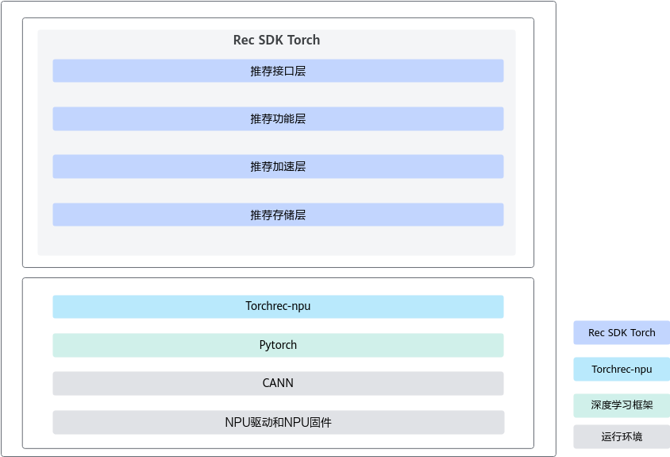

# 简介

## 功能介绍

Rec SDK Torch涉及功能如下：

-   模型训练基础功能
    -   支持单机单卡训练、单机多卡分布式训练。
    -   支持基于Torch开发的模型。

-   推荐场景特有功能。

    基于Rec SDK Torch的稀疏表方案，Rec SDK Torch提供推荐的必备功能，如非亲和算子卸载，哈希映射功能等。

-   大规模稀疏表特有功能。

    支持按照Row-wise的分布式稀疏表切分方式。

**关键功能特性**

Rec SDK Torch为用户提供了哈希映射、Row-wise分表、EBC查表功能、流水查表、查表融合算子等特性。

-   哈希映射

    Torch提供了用于稠密ID查表的nn.Embedding。但在推荐场景，大部分原始特征ID都是离散型，查表时不便于直接使用，常见的做法是将离散ID转为表的行号。为此Rec SDK Torch提供了哈希映射功能，用于将离散ID映射为Embedding表的行号，不需要用户提前做ID转换。

-   EBC查表

    对标原生Torch的nn.EmbeddingBag功能，对指定的多个IDs，在查表时进行求和或者取平均的Pooling操作。

-   Row-wise分表

    在将Embedding切分到不同表时，按行对Embedding进行分表，使用取余分桶策略，按照ID取余的余数确定Embedding在表上的分桶位置。

-   流水查表

    Rec SDK Torch查表任务由通讯、CPU、NPU计算等多个子任务构成。Rec SDK Torch提供了流水查表方法让子任务之间可以并行以充分发挥硬件算力。

-   查表融合算子

    Rec SDK Torch提供了梯度计算和优化器融合的查表算子以优化查表性能。

## 软件架构

**图 1**  软件架构图  

Rec SDK Torch基于TorchRec、推荐场景主流框架、CANN和各种硬件和网络，对于搜索、推荐、广告模型训练的应用场景需求，提供极简易用、高性能API，助力昇腾AI处理器完成搜索、推荐、广告等模型的高效训练。

**表 1**  结构图模块介绍

|Rec SDK Torch模块|说明|
|--|--|
|推荐接口层|提供易用性接口、简化用户接入和迁移成本。支持用户规模化上量。|
|推荐功能层|核心功能实现层，满足用户的使用要求。|
|推荐加速层|性能竞争力核心组件，为整机系统提供更优性能。|
|推荐存储层|支持稀疏表的分布式存储。|
|Torchrec-npu|开源TorchRec的昇腾适配层。|

## 支持的硬件和操作系统

**表 2**  支持的产品列表
<table border="1">
  <tr>
    <th>产品型号</th>
    <th>产品架构</th>
    <th>操作系统版本</th>
  </tr>
  <tr>
    <td rowspan="2">
Atlas 800T A2 训练服务器

Atlas 200T A2 Box16 异构子框
</td>
    <td>x86_64</td>
    <td><li>Debian版本：12</li><li>CentOS版本：7.6</li></td>
  </tr>
  <tr>
    <td>ARM</td>
    <td>OpenEuler版本：22.03</td>
  </tr>
</table>

