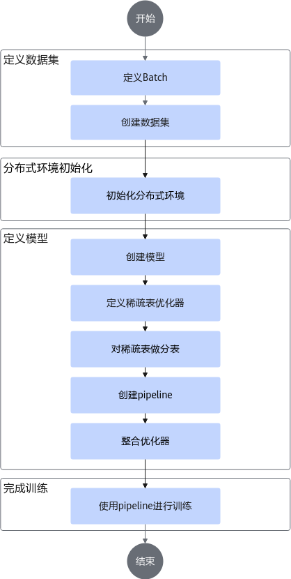

# 快速入门<a name="ZH-CN_TOPIC_0000002302229552"></a>

## 使用前说明<a name="ZH-CN_TOPIC_0000002336268801"></a>

本章节提供一个little-demo用例指导用户基于Rec SDK Torch搭建模型。little-demo存放路径为：[Rec SDK Torch Little Demo样例](https://gitcode.com/Ascend/RecSDK/tree/develop_examples_and_tools/torch_examples/little_demo)。

**表 1**  little-demo文件说明

|文件名|说明|
|--|--|
|main.py|模型训练入口|
|dataset.py|数据集生成|
|model.py|模型文件|
|bash.sh|启动脚本|
|README.md|demo模型运行说明|


## 接口调用介绍<a name="ZH-CN_TOPIC_0000002336148917"></a>

**图 1**  接口调用流程<a name="fig55046491373"></a>  


以下步骤省略了具体实现，如需完整代码，请参考[Rec SDK Torch Little Demo样例](https://gitcode.com/Ascend/RecSDK/tree/develop_examples_and_tools/torch_examples/little_demo)。关键步骤如下：

1.  <a id="li524311501994"></a>定义Batch。

    将本次训练需要的所有特征整合为一个Batch类，并实现to\(\)、pin\_memory\(\)、record\_stream\(\)方法。

    ```cpp
    @dataclass
    class Batch(Pipelineable):
          ......
    ```

2.  创建数据集。

    实现一个返回[1](#li524311501994)中创建的Batch类型的Dataset。

    ```cpp
    class RandomRecDataset(IterableDataset[Batch]):
        ......
    ```

3.  初始化分布式变量。

    ```cpp
    ......
    device = torch.device("npu")
    dist.init_process_group(backend="hccl")
    host_gp = dist.new_group(backend="gloo")
    host_env = ShardingEnv(world_size=world_size, rank=rank, pg=host_gp)
    ```

4.  定义模型。

    将稀疏表层和Dense层的模型整合为一个Module。该Module的输入必须为[1](#li524311501994)中创建的Batch类。返回为模型的loss和输出。

    ```cpp
    class TestModel(torch.nn.Module):
        def __init__(self, ):
            super().__init__()
            table_configs = ......
            self.ebc = HashEmbeddingBagCollection(device="npu", tables=table_configs)
         
        def forward(self, batch: Batch):
            return loss, result
    ```

5.  定义稀疏表的优化器。

    ```bash
    test_model = TestModel(...)
    
     # Optimizer
     embedding_optimizer = torch.optim.Adagrad
     optimizer_kwargs = {"lr": 0.001, "eps": 0.1}
     apply_optimizer_in_backward(
         embedding_optimizer,
         test_model.ebc.parameters(),
         optimizer_kwargs=optimizer_kwargs,
     )
    
    ```

6.  对稀疏表做分表。

    创建sharder，并使用EmbeddingShardingPlanner创建分表计划，将分表计划和sharder传入DistributedModelParallel中获得分布式模型。

    ```cpp
    hybrid_sharder = get_default_hybrid_sharders(host_env=host_env)
    constraints = {......}
    planner = EmbeddingShardingPlanner(......)
    plan = planner.collective_plan(test_model, hybrid_sharder, dist.GroupMember.WORLD)
    logging.info(plan)
    ddp_model = DistributedModelParallel(
     test_model, device=torch.device("npu"), plan=plan, sharders=hybrid_sharder
    )
    ```

7.  整合优化器。

    分离dense和sparse的参数，并组合成一个新的优化器。

    ```bash
    # Optimizer filter
    dense_optimizer = KeyedOptimizerWrapper(
     dict(in_backward_optimizer_filter(ddp_model.named_parameters())),
     lambda params: torch.optim.Adagrad(params, lr=0.1),
    )
    optimizer = CombinedOptimizer([ddp_model.fused_optimizer, dense_optimizer])
    ```

8.  创建pipeline。

    ```cpp
    pipeline = HybridTrainPipelineSparseDist(
     ddp_model, optimizer, device, execute_all_batches=True
    )
    ```

9.  使用pipeline进行训练。

    ```cpp
    batched_iterator = iter(data_loader)
    for i in range(...):
     pipeline.progress(batched_iterator)
    ```


## 启动模型训练<a name="ZH-CN_TOPIC_0000002302229704"></a>

在容器中执行以下命令启动训练：

```cpp
export ASCEND_RT_VISIBLE_DEVICES=0,1 
torchx run -s local_cwd dist.ddp -j 2 --script main.py
```


