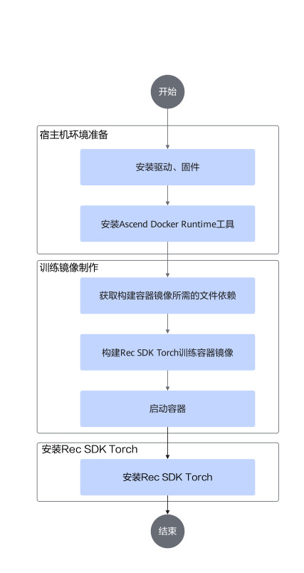

# 安装部署<a name="ZH-CN_TOPIC_0000002336148865"></a>

## 安装说明<a name="ZH-CN_TOPIC_0000002302229632"></a>

推荐Rec SDK Torch基于容器部署开发环境。如果需要查看Rec SDK Torch的历史安装记录，请参见[查看Rec SDK Torch安装与卸载记录](../../torch/torch_rec_v1/common_operations.md)。

**注意事项<a name="section1297475493911"></a>**

如需安装Rec SDK Torch软件包以外的第三方软件，请注意及时升级最新版本，关注并修补存在的漏洞。


## 安装依赖<a name="ZH-CN_TOPIC_0000002302389236"></a>

安装Rec SDK Torch软件包前需准备以下环境依赖及操作，请参见[表1](#table18461141184116)准备安装环境。

**表 1** Rec SDK Torch环境依赖
<a id="table18461141184116"></a>

|依赖名称/操作|推荐版本|获取方式|
|--|--|--|
|昇腾硬件产品驱动和固件|Ascend HDK 25.1.RC1|单击[获取链接](https://www.hiascend.com/developer/download/commercial/result?module=cann)，在左侧配套资源的“编辑资源选择”中进行配置，筛选配套的软件包，确认版本信息后获取所需软件包。<br>安装驱动与固件请参见相关硬件产品配套的《[驱动和固件安装升级指南](https://support.huawei.com/enterprise/zh/ascend-computing/ascend-hdk-pid-252764743)》。|
|Ascend Docker Runtime|MindCluster 7.1.RC1|请参见《MindCluster 集群调度用户指南》的“安装 > 安装部署”章节进行安装。|
|配置Device网卡|-|请参考《Ascend Training Solution 23.0.0 组网指南》的参数面网络配置示例配置示例配置训练节点章节，通过HCCN_Tool配置NPU网口的Device IP。|
|CANN软件包|CANN 8.5.0|单击[获取链接](https://www.hiascend.com/developer/download/commercial/result?module=cann)，在左侧配套资源的“编辑资源选择”中进行配置，筛选配套的软件包，确认版本信息后获取所需软件包。<br>根据设备架构获取Ascend-cann-toolkit_<i>{version}</i>_linux-<i>{arch}</i>.run和Ascend-cann-<i>{chip_type}</i>-ops-<i>{version}</i>_linux-<i>{arch}</i>.run，并参考《CANN 软件安装指南》的“安装CANN”章节在容器内进行安装。|
|PyTorch昇腾适配插件|2.6.0/2.7.1|根据[配套版本](#section146113514599)，可通过下述方式安装对应版本插件。<li>单击[链接](https://gitcode.com/Ascend/pytorch/releases/v7.1.0.2-pytorch2.6.0)，根据设备架构获取torch_npu-2.6.0*-cp311-\*.whl软件包并在容器内安装。</li><li>单击[链接](https://gitcode.com/Ascend/pytorch/releases/v7.2.0-pytorch2.7.1)，根据设备架构获取torch_npu-2.7.1*-cp311-*.whl软件包并在容器内安装。</li>|


> [!NOTICE]须知 
>对于用户集成的开源和第三方软件，漏洞和问题请自行跟踪社区并及时进行修复；可以并且不限于通过[CVE（通用漏洞字典）官网](https://www.cve.org/)确认对应开源软件版本的已知漏洞，并通过版本升级、使用patch补丁包更新等方式修复。


## 获取Rec SDK Torch软件包<a name="ZH-CN_TOPIC_0000002336148981"></a>

**配套版本<a name="section146113514599"></a>**

当前Rec SDK Torch支持两种配套版本，可根据需要获取对应配套版本包。

|配套版本|PyTorch|PyTorch昇腾适配插件|Rec SDK Torch|
|--|--|--|--|
|方案一|2.6.0|2.6.0|1.1.0|
|方案二|2.7.1|2.7.1|1.2.0|


其他软件配套版本信息请参考[基础镜像构建](../build_torch_rec_images/README.md)。

**下载软件包<a name="section1852417242717"></a>**

请参考本章获取所需软件包和对应的数字签名文件，下载本软件即表示您同意[华为企业业务最终用户许可协议（EULA）](https://e.huawei.com/cn/about/eula)的条款和条件。

|组件名称|软件包|获取链接|
|--|--|--|
|Rec SDK|推荐算法框架开发套件包|获取链接（待更新）|


>[!NOTE]说明 
>当前提供的Rec SDK推荐算法框架开发套件包基于Python 3.11版本编译，请在相同的Python版本环境下安装使用。若需要在其他Python版本环境下安装使用，请参见[README](https://gitcode.com/Ascend/RecSDK/blob/develop/training/torch_rec_v1/hybrid_torchrec/README.md)进行源码编译。

**软件数字签名验证<a name="section10830205518487"></a>**

为了防止软件包在传递过程中或存储期间被恶意篡改，在软件包下载之后请使用**sha256sum**命令校验Hash值。

**软件包内容<a name="section635921752112"></a>**

|组件名称|软件包|
|--|--|
|Ascend-mindxsdk-hybrid-torchrec-*.tar.gz|Rec SDK Torch功能包|


## 部署容器内的开发环境<a name="ZH-CN_TOPIC_0000002336148877"></a>

### 使用容器部署开发环境<a name="ZH-CN_TOPIC_0000002302229684"></a>

基于容器部署Rec SDK Torch开发环境，可参考如[图1](#fig1345216415476)完成配置。

**图 1**  配置容器内的开发环境及训练镜像构建<a id="fig1345216415476"></a>  


**关键步骤说明<a name="section15488921175211"></a>**

1.  准备宿主机环境。请参见[安装依赖](#安装依赖)完成宿主机环境的部署。
2.  构建基础镜像，请参见[使用Debian 12制作训练镜像](../build_torch_rec_images/README.md)。
3.  启动容器，请参见[启动容器](#section12808621121114)。
4.  安装Rec SDK Torch，请参见[安装Rec SDK Torch](#section182972951211)。


### 制作Rec SDK Torch训练镜像<a name="ZH-CN_TOPIC_0000002336268705"></a>

**使用Debian 12制作训练镜像<a id="section104919392501"></a>**

参考[基础镜像构建](../build_torch_rec_images/README.md)里的DockerFile和Readme制作镜像。

**启动容器<a id="section12808621121114"></a>**

```bash
#!/bin/bash
container_name=$1
image_name=$2
docker run \
-it \
--name ${container_name} \
--shm-size="300g" \
-m 300g \
-v /etc/localtime:/etc/localtime:ro \
-e ASCEND_VISIBLE_DEVICES=0-7 \
-v /etc/ascend_install.info:/etc/ascend_install.info:ro \
-v /usr/local/Ascend/driver:/usr/local/Ascend/driver:ro \
${image_name} \
/bin/bash
```

>[!NOTE]说明 
>部分参数说明如下：
>-   -m 300g表示设置容器内可以使用的内存大小上限为300G，可根据实际情况进行配置。
>-   -e ASCEND\_VISIBLE\_DEVICES=0-7表示将服务器上编号为device0-device7的NPU设备挂载到容器内。可根据实际情况进行配置。

**安装Rec SDK Torch<a id="section182972951211"></a>**

1.  参考[获取Rec SDK Torch软件包](#获取rec-sdk-torch软件包)获取Rec SDK Torch软件包。
2.  将软件包拷贝到容器中。可通过以下方式：
    -   在启动容器时，指定一个宿主机目录挂载到容器内，并将下载的软件包放在其中，使容器可以访问到下载的软件包。

        宿主机目录挂载到容器的docker参数示例：

        ```bash
        -v /dir1:/dir1
        ```

    -   在宿主机上，使用**docker cp**指令将软件包拷贝到容器内。

        **docker cp**指令示例：

        ```bash
        docker cp host_file_path container_name:container_file_path
        ```

        其中，host\_file\_path为宿主机文件路径，container\_name为待拷入的docker容器名称，container\_file\_path为待拷入的docker容器内的文件路径。

3.  按照如下步骤进行编译和安装包。

    1.  安装TorchRec昇腾注册包

        TorchRec昇腾注册包是基于TorchRec源码做的NPU设备适配。可通过Rec SDK Torch提供的patch文件和TorchRec源码的固定分支编译出该注册包。

        具体的源码编译和安装可参考[README](https://gitcode.com/Ascend/RecSDK/blob/develop/training/torch_rec_v1/torchrec_npu/README.md)（该包的源码编译不区分PyTorch版本）。

    2.  安装Ascend-mindxsdk-hybrid-torchrec-\*-linux-\*.tar.gz

        ```bash
        # 安装Ascend-mindxsdk-hybrid-torchrec-*-linux-*.tar.gz
        tar zxvf Ascend-mindxsdk-hybrid-torchrec-*-linux-*.tar.gz
        pip3 install hybrid_torchrec-*-py3-none-linux_*.whl
        pip3 install torchrec_embcache-*-py3-none-linux_*.whl
        ```

    3.  安装算子相关包

        下载仓库源码https://gitcode.com/Ascend/RecSDK，进入源代码目录，按如下指令进行算子相关包的编译和安装（算子包的编译不区分PyTorch版本）：

        ```bash
        # 注：编译算子前，需使能CANN环境变量。默认路径安装CANN包时，使能CANN环境变量指令如下：
        source /usr/local/Ascend/cann/set_env.sh
        unset ASCEND_CUSTOM_OPP_PATH
         
        cd cust_op/ascendc_op/build
        # 注：部分算子编译依赖外部组件，请参考build文件夹下README文件下载依赖，否则会编译失败。
        # 编译算子包（编译时会自动安装，若仅安装部分，可在其他容器内编译，再拷贝到当前环境安装）
        bash build_ai_core_op.sh A2
         
        # 可选：安装指定算子包
        #   方式1：批量安装算子包。如下指令表示安装非"310p.run/A3.run"结尾的所有算子包，可根据设备环境修改匹配关键字。
        find . -name "*.run" ! -name "*310p.run" ! -name "*A3.run" -exec bash {} \;
        #   方式2：自行选择需要的算子包安装，指令示例：
        bash mxrec_opp_split_embedding_codegen_forward_unweighted.run
         
        # 安装算子适配层 libfbgemm_npu_api.so
        cd ../../../../framework/torch_plugin/torch_library/common/
        bash build_ops.sh
        ```

        安装算子的参数如[表1](#table14435173717221)所示。

        **表 1**  参数说明
        <a id="table14435173717221"></a>

        |输入参数|说明|
        |--|--|
        |--help \| -h|查询帮助信息。|
        |--info|查询安装包的信息。|
        |--list|查询安装包的文件列表。|
        |--check|查询压缩包完整性。|
        |--quiet|静默安装方式。|
        |--nox11|不启动xterm终端。|
        |--noexec|不执行嵌入的安装脚本。|
        |--extract=\<path>|直接解压到目标目录，通常与--noexec配合使用，仅解压文件而不运行脚本。|
        |--tar arg1 [arg2 ...]|通过**tar**命令访问压缩包内容。|
        |--install-path|安装到指定目录路径。|


>[!NOTICE]须知
>安装算子后，/usr/local/Ascend/cann/opp/vendors/目录下会生成split\_embedding\_codegen\_forward\_unweighted、backward\_codegen\_adagrad\_unweighted\_exact、asynchronous\_complete\_cumsum、permute2d\_sparse\_data等文件夹。如果没有相关文件夹，请使用**unset ASCEND\_CUSTOM\_OPP\_PATH**取消环境变量后重新安装算子。


## 配置环境变量<a name="ZH-CN_TOPIC_0000002336268805"></a>

Rec SDK Torch环境变量的说明如[表1](#table126401659163820)所示。

**表 1**  环境变量
<a id="table126401659163820"></a>

|环境变量名|含义|可选/必选|说明|
|--|--|--|--|
|INPUT_DIST_THREADS|Rec SDK Torch使用分桶任务的线程池并发数量。|可选|整数，默认为6，取值范围：[1, 12]。|
|POST_INPUT_THREADS|Rec SDK Torch使用哈希去重任务的线程池并发数量。|可选|整数，默认为6，取值范围：[1, 12]。|
|MASTER_ADDR|用于指定分布式训练中主节点的IP地址。|可选|IPv4地址，推荐使用127.0.0.1。|
|MASTER_PORT|用于指定分布式训练中的侦听端口。|可选|整数，取值范围：[0，65520]。|
|LOCAL_RANK|当前进程在本机上的NPU编号。|可选|整数，取值范围：[0，world_size -1]。|
|WORLD_SIZE|参与训练的device数量。|可选|整数，取值范围：[1，8]。|
|ASCEND_VISIBLE_DEVICES|昇腾处理器可见的设备，来指定程序只使用其中的部分设备。|必选|使用ASCEND_VISIBLE_DEVICES环境变量指定训练中的NPU设备（用户可执行ls /dev/ \| grep davinci*命令查询宿主机的NPU设备），使用设备序号指定设备，支持单个和范围指定且支持混用。例如：<ul> <li>ASCEND_VISIBLE_DEVICES=0：表示将0号设备（/dev/davinci0）挂载入容器中。</li><li>ASCEND_VISIBLE_DEVICES=1,3：表示将1、3号设备挂载入容器中。</li><li>ASCEND_VISIBLE_DEVICES=0-2：表示将0号至2号设备（包含0号和2号）挂载入容器中，效果同ASCEND_VISIBLE_DEVICES=0,1,2。</li><li>ASCEND_VISIBLE_DEVICES=0-2,4：表示将0号至2号以及4号设备挂载入容器，效果同ASCEND_VISIBLE_DEVICES=0,1,2,4。</li></ul>|
|ASCEND_OPP_PATH|算子库根目录。|必选|执行CANN环境变量配置脚本时设置，不建议用户修改。默认为/usr/local/Ascend/cann/opp。|
|GLOO_SOCKET_IFNAME|gloo通信网卡配置。|可选|使用**ifconfig**或**ip a**命令查看服务器网卡名称，推荐配置为lo。|
|ENABLE_FAST_HASHMAP|是否启用快速哈希表|可选|字符串，支持"true"、"yes"、"1"表示启用，其他值表示不启用，默认为false。|
|EMB_MEMORY_POOL_SIZE|快速哈希表的embedding内存池大小|可选|整数，默认为102400，取值范围：[1, 200000]。|
|FAST_HASHMAP_RESERVE_BUCKET_NUM|快速哈希表预留桶数量|可选|整数，默认为2097152，取值范围：[128, 4294967291]。|
|EMB_MEMORY_POOL_THREAD_NUM|快速哈希表embedding内存池处理线程数|可选|整数，默认为4，取值范围：[1, 1024]。|
|EMBCACHE_SIZE_ON_DEVICE_MEM|HBM embedding缓存大小（单位：字节）|可选|整数，默认为17179869184（16GB），取值范围：[1, 设备可用内存]。|
|DO_EC_LOCAL_UNIQUE|多级缓存是否启用EC local unique|可选|字符串，支持"true"、"1"、"yes"表示启用，其他值表示不启用。默认为false。|
|LOCAL_UNIQUE_PARALLEL_BATCH_NUM|EmbCacheTrainPipelineSparseDist中Local unique并行处理批次数|可选|整数，默认为2，取值范围：[1, 24]。|
|ENABLE_PARALLEL_GLOBAL_UNIQUE|是否启用并行Global Unique处理|可选|字符串，1表示启用，其他值表示不启用。默认为0，表示不启用。|
|GLOG_stderrthreshold|设置多级缓存C++模块的日志级别。|可选|整数，默认为0。取值范围：<li>-2：TRACE</li><li>-1：DEBUG</li><li>0：INFO</li><li>1：WARN</li><li>2：ERROR</li>|


## 卸载<a name="ZH-CN_TOPIC_0000002302389376"></a>

用户如需移除Rec SDK Torch软件包，可参考以下命令进行卸载。

```bash
# 卸载hybrid_torchrec
pip3 uninstall hybrid_torchrec -y
# 卸载 torchrec_embcache
pip3 uninstall torchrec_embcache -y
# 卸载torchrec
pip3 uninstall torchrec -y
```

用户如需移除Rec SDK Torch自定义算子相关包，可参考以下命令进行卸载。其中，

-   自定义算子在CANN中的默认安装路径为/usr/local/Ascend/cann/opp/vendors/
-   卸载自定义算子时，删除vendors路径下自定义算子名称对应的文件夹即可。可以通过[ai\_core\_op](https://gitcode.com/Ascend/RecSDK/tree/develop/cust_op/ascendc_op/ai_core_op)查看Rec SDK的自定义算子目录。

```bash
# 卸载算子指令示例
rm -rf /usr/local/Ascend/cann/opp/vendors/asynchronous_complete_cumsum
rm -rf /usr/local/Ascend/cann/opp/vendors/backward_codegen_adagrad_unweighted_exact
rm -rf /usr/local/Ascend/cann/opp/vendors/permute2d_sparse_data
rm -rf /usr/local/Ascend/cann/opp/vendors/split_embedding_codegen_forward_unweighted
# 卸载libfbgemm_npu_api.so
PACKAGE_PATH=$(python3 -c "import sysconfig; print(sysconfig.get_path('purelib'))")
if [ -d "$PACKAGE_PATH" ]; then
  cd ${PACKAGE_PATH}
  rm -rf libfbgemm_npu_api.so
else
  echo "no site-package"
fi
```

部分自定义算子安装到CANN的vendors文件夹下时，原自定义算子名称与安装路径不同，卸载时需删除安装后的路径。存在差异的自定义算子如下表。

|自定义算子名称|安装到vendors文件夹下的名称|
|--|--|
|cust_op_by_addr|customize|
|pcie_through|customize|
|fused_lazy_adam|mxrec_fused_lazy_adam|
|fused_sgd|mxrec_sgd|


>[!NOTE]说明
>用户自定义算子在未配置安装文件夹名称时，默认安装在CANN的vendors/customize文件夹下。当删除的customize文件夹中存在用户自定义算子时，则对应算子需重新安装。


## 升级<a name="ZH-CN_TOPIC_0000002302389340"></a>

用户如需将当前版本的Rec SDK Torch升级至最新版本，可将最新的Rec SDK Torch软件包上传至安装环境后，在软件包所在目录下使用命令进行升级，具体命令如下。

1.  升级Rec SDK Torch新版本时，需要先手动卸载旧版本。具体操作请参考[卸载](#卸载)。
2.  参考[安装Rec SDK Torch](#section182972951211)重新安装Rec SDK Torch。


