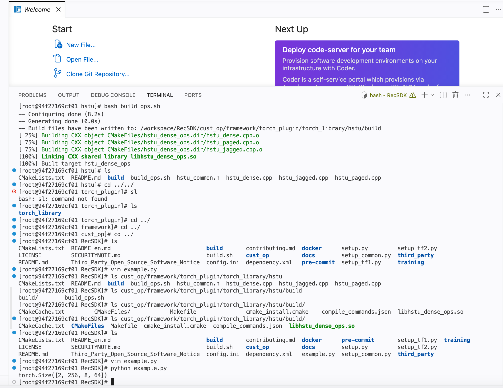

# Rec SDK 算子调用样例：生成式推荐核心attention算子HSTU的编译运行

## 任务名称

Rec SDK 算子调用样例：生成式推荐核心attention算子HSTU的编译运行

## IDE 环境

昇腾910B3，rec_sdk-torch_26.0.0，2NPUs 64G内存 128核CPU 300G存储

## 操作文档

https://gitcode.com/Ascend/RecSDK/blob/develop/docs/zh/rec_ops/rec_ops_example.md

## 测试结果

按照上述文档做相关命令/步骤的执行，没有出现报错问题，包括源码下载、算子编译、算子适配层编译、单算子运行案例运行

## 运行成功截图

