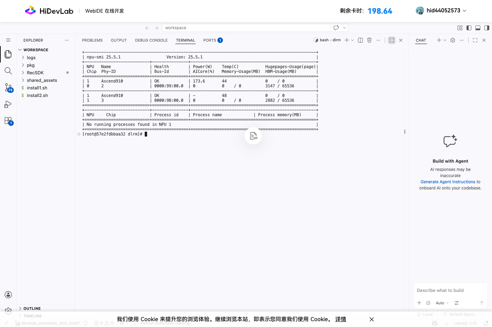
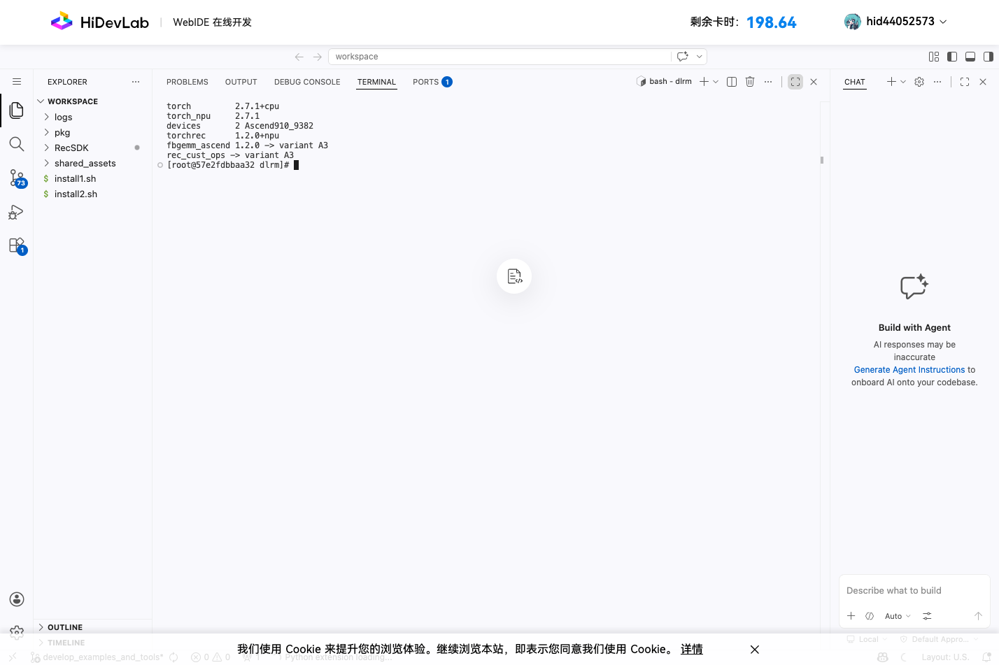
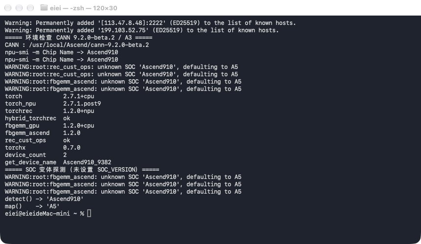
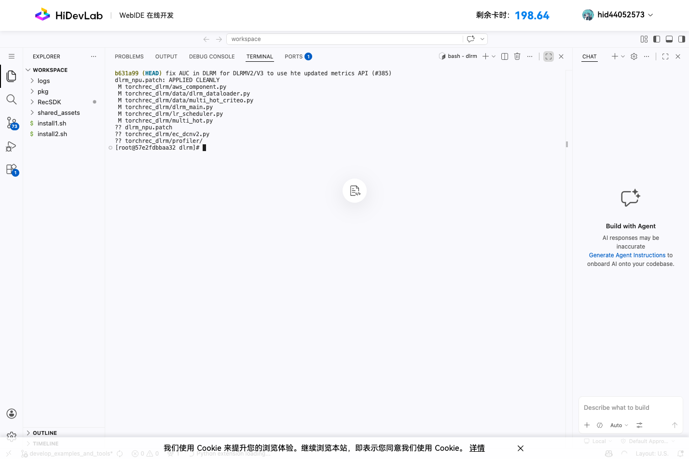
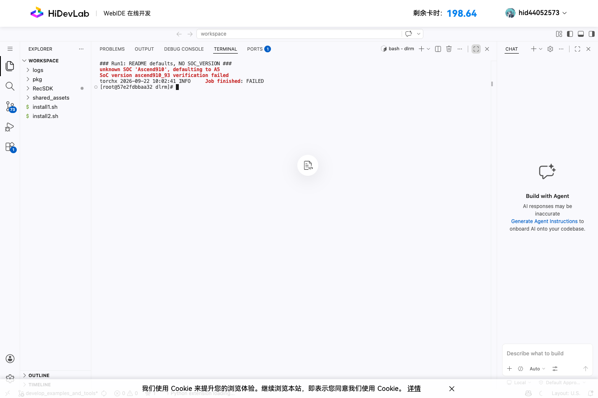
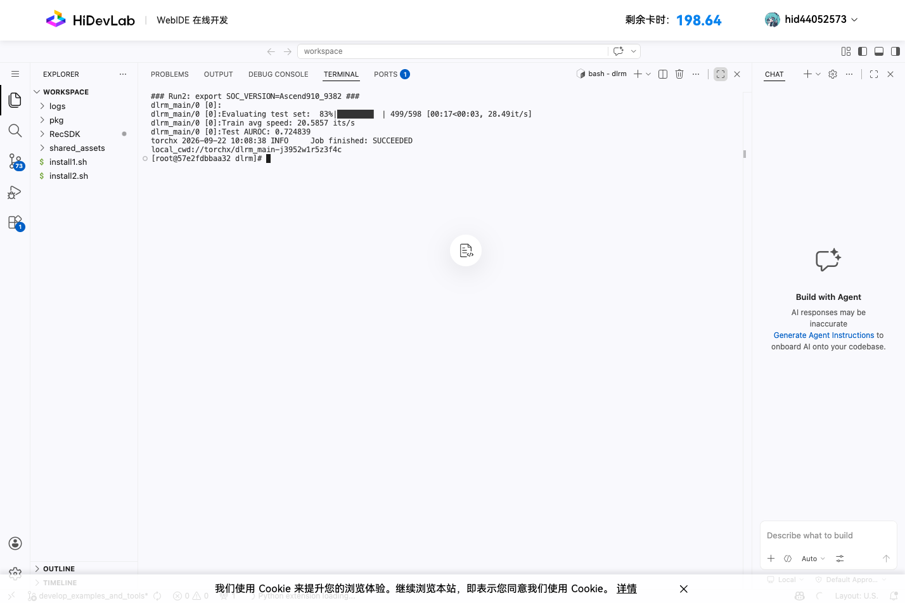
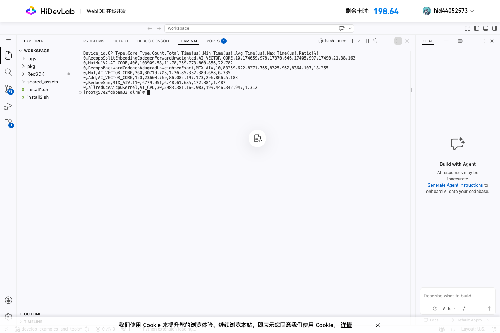
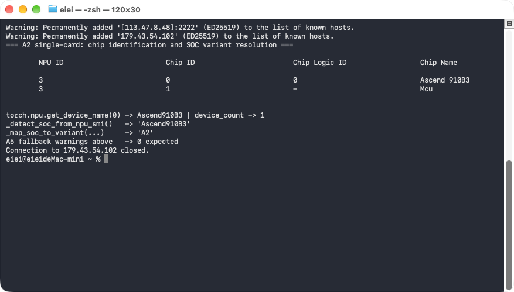
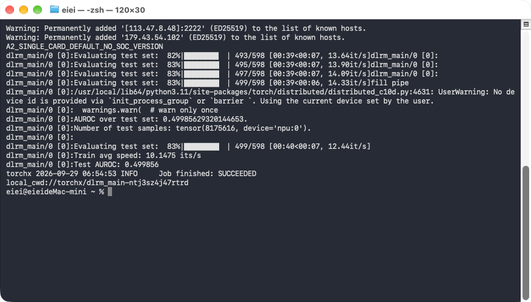
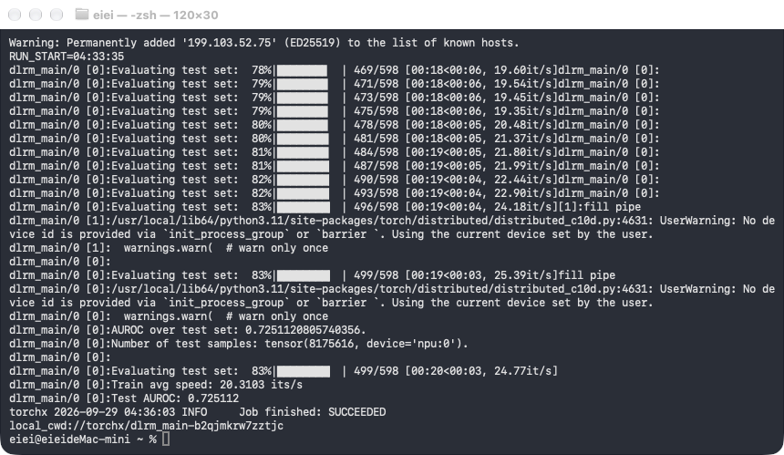

# 【版本众测】迁移并训练 Pytorch 推荐模型 DCN-V2 复现总结

## 任务名称

[【版本众测】迁移并训练Pytorch推荐模型DCN-V2](https://gitcode.com/Ascend/RecSDK/issues/1248)

## 文档信息

| 项目 | 内容 |
| --- | --- |
| 文档名称 | 【版本众测】迁移并训练 Pytorch 推荐模型 DCN-V2 复现总结 |
| 文档类型 | 测试验证报告（对应「测试验证文档模板」） |
| 任务编号 | issue [#1248](https://gitcode.com/Ascend/RecSDK/issues/1248) |
| 交付 PR | [!3198](https://gitcode.com/Ascend/RecSDK/pull/3198) |
| 提交人 | GitCode ID：`wsnidie1` |
| 文档版本 / 日期 | v5 / 2026-09-29 |
| 适用对象 | RecSDK Maintainer / Committer 评审，及后续在 A3 上复现该样例的同学 |
| 变更性质 | 纯文档（`experimental/wsnidie1/` 下 11 个文件：1 份总结 + 10 张运行截图），不含产品代码与样例代码改动 |

### 与「测试验证文档模板」的章节对照

本报告按评审意见沿用已合入的
[#3008](https://gitcode.com/Ascend/RecSDK/pull/3008) 行文骨架，同时对照
「测试验证文档模板」补齐各章，对应关系如下：

| 模板章节 | 本报告位置 |
| --- | --- |
| 1 文档信息 | 本小节 |
| 2 关联任务与代码（任务信息 / 关联 PR） | 「任务名称」、「文档信息」、各节内链接 |
| 3 软硬件要求 | 「IDE 环境」 |
| 4 环境准备（系统 / 依赖安装 / 配置步骤 / 检查结果） | 「环境准备」 |
| 5 测试用例列表 | 「测试用例与判定标准」用例表 |
| 6 测试执行过程（目标 / 内容与范围 / 步骤 / 判定标准） | 「操作文档」+「测试用例与判定标准」 |
| 7 测试结果（汇总 / 明细 / 失败项与问题记录） | 「基础功能跑通结果」、「性能数据采集与分析」、「换节点复测」、「发现的问题」 |
| 8 测试总结（总体结论 / 遗留问题及影响 / 建议） | 「总结」及各问题的「期望」 |

## IDE 环境

| 项目 | 配置 |
| --- | --- |
| 算力环境 | HiDevLab `DevEnv_437470`（在线开发 WebIDE） |
| 设备 | 昇腾 A3，`npu-smi` 呈现 2 个 NPU 芯片（Phy-ID 2/3），单芯片 HBM 64 GB |
| 芯片标识 | 见下方「芯片标识说明」，三处接口返回值不一致 |
| OS / 架构 | openEuler 24.03 (LTS-SP3) / aarch64，内核 5.10.0-216 |
| Driver / 固件 / npu-smi | 25.5.1 / 7.8.0.6.201 / 25.5.1 |
| CANN | 9.1.0 |
| HOST 资源 | 2013 GB 内存、640 核 CPU、300 GB 本地盘（`/workspace`） |
| Python / PyTorch | 3.11.6 / 2.7.1+cpu |
| torch_npu | 2.7.1 |
| TorchRec / Hybrid TorchRec | 1.2.0+npu / 1.2.0（由 `torch_rec_v1` 一键包提供） |
| fbgemm_gpu / fbgemm_ascend / rec_cust_ops | 1.2.0+cpu / 1.2.0 / 2.7.1 |
| torchx | 0.7.0 |
| 数据 | 官方 `generate_data.py` 生成的 Criteo 格式随机数据，mmap 读取 |

芯片标识说明（三处接口返回值不一致，是后文 SOC 问题的直接背景）：

- `npu-smi info -m` 的 Chip Name：`Ascend910`（不带子型号后缀）
- `npu-smi info -t board -i <id>`（NPU 级查询）的 Product Name：`IT22HMDA_2_S`
- `torch.npu.get_device_name()`：`Ascend910_9382`

> [!NOTE]
> 上述 Product Name 仅在首测节点有值；复测节点同一查询返回 `NA`，
> 该字段不可依赖，详见「发现的问题」第 1 项的期望部分。
>
> 任务书要求把模型迁移到 **Atlas 800T A2**，`torch_examples/README.md` 的
> 「版本配套说明」也写明样例「仅支持昇腾平台（Atlas A2 训练系列产品）」——两者
> 一致。本次实际分配到的算力以昇腾 **A3**（2 芯片）为主，A3 上的成功运行共 6 次；
> 后期补做了一台 **A2（910B3）单卡**节点的端到端跑通（见「A2 上的对照」），
> 因此平台偏离已在「A2 系列芯片」这一层闭合，但卡数与 A3 各轮不同、配置不可直接
> 比较。这是**本交付相对任务书指定配置的偏离**，不是文档缺陷；偏离的原因与影响
> 见「遗留问题及影响」第 1 行。「发现的问题」第 1 项（SOC 静默回退）是
> **A3 特有**、A2 上不存在。

设备与芯片信息：



软件栈与算子包变体（`SOC_VERSION` 已修正为 A3）：



## 环境准备

首测环境（HiDevLab）自带 `/opt/buildtools/torch_v1_pt2.7.1` 内置虚拟环境，
按 `quick_start.md` 激活即可；后续三个节点均为**裸镜像从零安装**，
过程与踩到的坑一并记录如下，这也是「发现的问题」第 3、5、6、9 项的实操来源。

### 操作系统与硬件要求

| 项 | 要求 | 依据 |
| --- | --- | --- |
| 芯片 | 昇腾 A3（`NPU Name` 为 `9382`/`9362`），双 die 且 `npu-smi info -t health` 均为 OK | 样例默认 `WORLD_SIZE=2` |
| 架构 | aarch64 | Release 包为 `linux_aarch64` |
| **glibc** | **>= 2.34** | glibc 2.31 环境上 `fbgemm_ascend`/`rec_cust_ops` 报 `GLIBC_2.32 not found`、`hybrid_torchrec`/`torchrec_embcache` 报 `GLIBC_2.34 not found`；2.38 正常（见问题 6） |
| Python | 3.11 | 一键包按 Python 3.11 编译（安装指南注明须在相同版本下安装） |
| CANN | 9.1.0 或 9.2.0-beta.2 均已验证 | 两版本缺陷行为一致 |
| 磁盘 | >= 200 GB 空闲 | 数据集 71 GB |
| **容器内存配额** | >= 24 × 3.5 GB ≈ **90 GB** | `generate_data.py` 固定并发 24、单 day 峰值 RSS 3.5 GB（见问题 8，#1402） |
| 镜像 SoC 字段 | tag 中的 SoC 必须等于设备芯片家族（A3→`a3`，910B→`910b`） | 选错时设备枚举正常、首次算子调用才失败（见问题 9） |

### 依赖安装步骤

以下命令在 `DevEnv_802122`（CANN 9.1.0）与 `DevEnv_390993`（CANN 9.2.0-beta.2）
两台裸镜像节点上逐条执行成功，命令顺序即文档顺序：

```bash
# 0) 官方 CANN devel 镜像内没有 pip3，需先为 python3.11 引导 pip（文档未提）
/usr/bin/python3.11 -m ensurepip --upgrade

# 1) 安装指南「离线安装」新增的构建依赖前置步骤（!3203）
python3.11 -m pip install wheel "setuptools<70.0.0"

# 2) 框架层：PyTorch 2.7.1 + torch_npu（配套方案二）
python3.11 -m pip install numpy "torch==2.7.1"        # 华为镜像源，装出即 2.7.1+cpu
python3.11 -m pip install \
  torch_npu-2.7.1.post9-cp311-cp311-manylinux_2_28_aarch64.whl
python3.11 -m pip install "fbgemm_gpu==1.2.0+cpu" \
  -i https://download.pytorch.org/whl/cpu

# 3) Rec SDK Torch 一键包（!3203 更新后的文档命令）
python3.11 -m pip install ./torch_rec_v1-26.2.0-linux_aarch64.tar.gz \
  -v --no-build-isolation

# 4) 自定义算子层
python3.11 -m pip install ./fbgemm_ascend-1.2.0-cp311-cp311-linux_aarch64.whl
python3.11 -m pip install ./rec_cust_ops-2.7.1-cp311-cp311-linux_aarch64.whl
```

三条实测注意事项：

1. **`fbgemm_gpu` 的 aarch64 CPU 轮子只有 `download.pytorch.org` 有**，
   华为 PyPI 镜像上仅 x86_64。该域名在某些节点只解析出 AAAA 记录，
   无 IPv6 出口时 pip 会静默卡在连接阶段（`ss` 里看不到任何已建连接），
   需确认走 IPv4。索引路径要用连字符 `whl/cpu/fbgemm-gpu/`，下划线形式返回 403。
2. **wheel 文件名必须保持 PEP 427 全名**，改名（如 `tn.whl`）会被 pip 拒绝，
   且失败信息在只 `tail` 日志尾部时极易被漏看。
3. **`--no-build-isolation` 与 `wheel` 是配套的**：省略第 1 步会得到
   `error: invalid command 'bdist_wheel'`；而 torch 对钩子可见时，
   文档原命令不加该参数在 pip 23.3.2 与 25.0.1 上也能成功（见问题 3）。

### 环境配置

```bash
source /usr/local/Ascend/ascend-toolkit/set_env.sh
# 样例 run.sh 内部已包含上述 set_env 与下列变量，无需额外配置：
#   WORLD_SIZE / ASCEND_RT_VISIBLE_DEVICES / PYTORCH_NPU_ALLOC_CONF
# A3 上必须额外显式设置（本报告问题 1 的规避手段）：
export SOC_VERSION=Ascend910_9382
```

`ASCEND_CUSTOM_OPP_PATH` 保持未设置；`ASCEND_OPP_PATH` 由 `set_env.sh` 给出，
指向对应 CANN 版本的 `opp` 目录。

### 环境检查结果

| 检查项 | 命令 | 期望 | 实测（9.2.0-beta.2 节点） |
| --- | --- | --- | --- |
| 设备数量 | `torch.npu.device_count()` | 2 | `2` |
| 芯片型号 | `torch.npu.get_device_name(0)` | `Ascend910_9382` | 一致 |
| 算子包与设备匹配 | 统计 `<tbe>/kernel/ascend910_93` 下的 json 文件数 | 数千量级 | `9,612` |
| 标准算子可运行 | `zeros` / `matmul` / `embedding` 最小探针 | 全部成功 | 全部 OK |
| torch_npu 完整性 | `sha256sum` 比对官方 `.sha256` | 逐位一致 | `1945a875…ae54783` 一致 |
| fbgemm_ascend 完整性 | 同上 | 逐位一致 | `5a386ad3…31ee882` 一致 |
| 组件版本 | `import` 后读 `__version__` | 配套方案二 | `torch 2.7.1+cpu` / `torch_npu 2.7.1.post9` / `torchrec 1.2.0+npu` / `fbgemm_gpu 1.2.0+cpu` / `fbgemm_ascend 1.2.0` / `rec_cust_ops 2.7.1` / `torchx 0.7.0` |
| SOC 变体探测 | `_map_soc_to_variant(_detect_soc_from_npu_smi())` | 应为 `A3` | **`A5`（缺陷，见问题 1）** |

最后一项即本任务的核心结论：其余全部满足时，仅 SOC 变体选择错误。

终端实况输出（CANN 9.2.0-beta.2 / A3 节点）：



## 操作文档

- 入口：[快速入门 - 进阶开发](https://gitcode.com/Ascend/RecSDK/blob/develop/docs/zh/torch/torch_rec_v1/03_quick_start/quick_start.md#%E8%BF%9B%E9%98%B6%E5%BC%80%E5%8F%91)
- 样例：[DLRM（DCNv2）模型迁移样例](https://gitcode.com/Ascend/RecSDK/blob/develop_examples_and_tools/torch_examples/dlrm/README.md)

严格按样例 README 执行，未修改样例代码（性能采集按 README 指引使用 `run.sh`
的副本 `run_prof.sh`，原始 `run.sh` 未改动）：

```shell
# 1. 取样例（GitHub 不可达，按 README FAQ 使用 GitCode 镜像仓克隆开源模型）
git clone -b develop_examples_and_tools https://gitcode.com/Ascend/RecSDK.git
cd RecSDK/torch_examples/dlrm
git clone -b main https://gitcode.com/gh_mirrors/dl/dlrm.git
cd dlrm && git checkout b631a99
cp -f ../dlrm_npu.patch ./
git apply dlrm_npu.patch

# 2. 生成随机数据集（约 71 GB）
mkdir generate_data && cp generate_data.py generate_data
cd generate_data && python3 generate_data.py

# 3. 运行训练（默认 hybrid_torchrec 模式，2 卡）
cp run.sh dlrm/torchrec_dlrm
cd dlrm/torchrec_dlrm && bash run.sh
```

`dlrm_npu.patch` 在 `b631a99` 上可干净应用，改动 6 个文件并新增
`torchrec_dlrm/ec_dcnv2.py`；`generate_data.py` 生成 72 个 `day_*.npy`
（目录内共 73 个文件，另一个是拷贝进去的脚本自身）、共 71 GB，无报错。
`run.sh` 保持默认：`WORLD_SIZE=2`、`ASCEND_RT_VISIBLE_DEVICES=0,1`、
`GLOBAL_BATCH_SIZE=16384`、`LIMIT_TRAIN_BATCHES=2000`、`LIMIT_TEST_BATCHES=500`、
`MODES="hybrid_torchrec"`；因 `WORLD_SIZE<4`，`MAX_FEATURE_NUM` 自动取 2000 万，
`FEATURE_NUM` 为 500 万。



## 测试用例与判定标准

### 判定标准

1. **功能通过判据**：`torchx` 输出 `Job finished: SUCCEEDED`，且训练、测试、
   AUROC 三段链路均有输出、无异常栈。
2. **`Test AUROC` 不作为通过判据**：随机数据加上未播种的模型初始化，使其逐次
   不可复现（同一份数据、同一配置三次得到 0.748229 / 0.763932 / 0.695619，
   极差 0.0683），详见问题 7。本任务中它只用于确认评估链路可执行。
3. **性能判据**：按 `dlrm_main.py:465` 的 `islice(..., limit - 1)` 修正后的样本
   吞吐（而非日志 `its/s` 直接乘全局 batch）。一致性以「同配置多次运行的均值差
   ≤ 1%」判定，单次值之间不可直接比较——实测机内重复极差就有 0.62%～0.72%，
   六次单跑的总极差为 1.34%（见 TC-06、TC-13）。
4. **缺陷定级**：README 默认配置无法成功执行 = 阻塞级；仅影响安装体验或排查
   效率 = 一般级。

### 测试用例列表

| 编号 | 用例 | 操作 | 预期 | 实测 | 结论 |
| --- | --- | --- | --- | --- | --- |
| TC-01 | 适配补丁可应用 | `git apply dlrm_npu.patch`（dlrm `b631a99`） | 干净应用 | 改动 6 文件 + 新增 `ec_dcnv2.py`，5 个节点（4×A3 + 1×A2）一致 | 通过 |
| TC-02 | 随机数据集生成 | `python3 generate_data.py`（容器配额 ≥ 90 GB） | 约 71 GB | 72 个 `day_*.npy`（目录内共 73 个文件，含脚本副本）、71 GB，18 s | 通过 |
| TC-03 | 受限内存下生成数据集 | 同上，容器配额 32 GiB | 成功或明确报错 | **rc=0、零输出、0 个 npy**；cgroup `oom_kill 8` | **不通过**（问题 8 / #1402） |
| TC-04 | README 默认训练 | `bash run.sh`（不设 `SOC_VERSION`） | `SUCCEEDED` | `FAILED`，8 条 `defaulting to A5`，`EZ1009 / SoC version ascend910_93 verification failed` | **不通过**（问题 1，阻塞级） |
| TC-05 | 规避后训练 | `export SOC_VERSION=Ascend910_9382 && bash run.sh` | `SUCCEEDED` | `SUCCEEDED`，回退告警 0 条 | 通过 |
| TC-06 | 吞吐口径核算 | `elapsed = limit/speed`，`(limit-1)*GBS/elapsed` | 可与日志对账 | 六次运行 332,598～337,107 samples/s，总极差 1.34%；机内重复极差 0.62%（节点3）/ 0.72%（节点4） | 通过 |
| TC-07 | Profiling 采集 | `run_prof.sh`（`ENABLE_PROF=1`、`PROF_START=50`、`PROF_STEP=10`、limit 80/10） | 两 rank 产出分析产物 | `op_statistic.csv`、`communication.json`、`memory_record.csv` 等，单次 76～244 个文件 | 通过 |
| TC-08 | 算子瓶颈分布 | 解析 `op_statistic.csv` | 与 #3008 可比 | embedding 前向 + Adagrad 反向 = 56.06%～56.53%（6 组 rank 统计）；#3008 为 56.62% | 通过 |
| TC-09 | SOC 探测机制 | 直接调用 `_detect_soc_from_npu_smi()` / `_map_soc_to_variant()` | 定位根因 | `'Ascend910' → 'A5'`；`'Ascend910_9382' → 'A3'`；`aclrtGetSocName()` 返回 `Ascend910_9382` | 通过（根因与修复入口均已验证） |
| TC-10 | A2 对照 | 910B3 单卡上探测 + 按默认配置端到端训练 | 确认影响范围 | `'Ascend910B3' → 'A2'`，无回退告警，`SUCCEEDED` × 2 | 通过 |
| TC-11 | 镜像变体与设备匹配 | 交叉使用 `a3` 镜像 + 910B 设备、`910b` 镜像 + A3 设备 | 可运行或明确报错 | 两次均设备枚举正常、首次 kernel launch 报 `561103 / EZ1013` | **不通过**（问题 9） |
| TC-12 | !3203 文档命令一致性 | 逐字执行更新后的离线安装命令 | 一次装成 | rc=0；但镜像内无 `pip3` 需先 `ensurepip`，省略 `wheel` 前置步骤则 `invalid command 'bdist_wheel'` | 通过（附 3 条注意事项） |
| TC-13 | 重复运行一致性 | 同数据同配置重复多次（节点3 × 3、节点4 × 2） | 关键指标稳定 | 吞吐均值稳定（六次 CV 0.47%，节点3 内 `its/s` CV 0.32%）；AUROC 六次极差 0.0683 | 部分通过（暴露问题 7） |

## 基础功能跑通结果

首次按 README 默认配置运行**失败**，在补齐 `SOC_VERSION` 后**跑通**。

| 运行 | 配置 | 结果 |
| --- | --- | --- |
| Run 1 | README 默认，未设置 `SOC_VERSION` | `Job finished: FAILED` |
| Run 2 | `export SOC_VERSION=Ascend910_9382` | `Job finished: SUCCEEDED` |

Run 2 关键输出：

```text
AUROC over test set: 0.724839448928833.
Number of test samples: tensor(8175616, device='npu:0').
Train avg speed: 20.5857 its/s
Test AUROC: 0.724839
torchx ... INFO     Job finished: SUCCEEDED
```

按 `GLOBAL_BATCH_SIZE=16384` 折算训练样本吞吐时需注意上游计数偏差：
`dlrm_main.py` 实际以 `itertools.islice(..., min(limit_train_batches, len) - 1)`
取数（即 1999 个 batch），但 `all_its` 取的是 `limit_train_batches`（2000），
`avg_speed = all_its / elapsed`，因此日志 `its/s` 虚高 1/2000。
按 [#3008](https://gitcode.com/Ascend/RecSDK/pull/3008) 的修正方法还原实际吞吐：

```text
elapsed            = 2000 / 20.5857 = 97.155 s
名义吞吐           = 20.5857 × 16384            = 337,276 samples/s
修正后实际吞吐     = 1999 × 16384 / 97.155      = 337,107 samples/s
```

Run 1（README 默认，未设置 `SOC_VERSION`）失败关键行：



Run 2（`export SOC_VERSION=Ascend910_9382`）跑通关键行：



随机数据的 `Test AUROC` 仅用于确认训练与评估链路完整，不代表生产数据精度。

> [!NOTE]
> 本节与下一节的数字、截图均来自首测节点（HiDevLab `DevEnv_437470`）。
> 全部结论已在第二台独立物理节点上重做，对照结果见「换节点复测」小节。

## 性能数据采集与分析

按 README「性能数据采集并分析」章节，复制 `run.sh` 为 `run_prof.sh` 并设置
`ENABLE_PROF=1`、`PROF_START=50`、`PROF_STEP=10`；同时把
`LIMIT_TRAIN_BATCHES`/`LIMIT_TEST_BATCHES` 降为 80/10 以缩短采集耗时。
性能数据落在 `torchrec_dlrm/profiler/`，2 个 rank 共 260 个文件、65 MB，
含 `op_statistic.csv`、`communication.json`、`memory_record.csv` 等分析产物。

rank0 在 10 个采集步内的算子耗时（设备总耗时 456,101 us），按占比排序：

- `RecopsSplitEmbeddingCodegenForwardUnweighted`
  （AI_VECTOR_CORE，10 次）174,060 us，占 **38.2%**
- `MatMulV2`（AI_CORE，400 次）103,910 us，占 22.8%
- `RecopsBackwardCodegenAdagradUnweightedExact`
  （MIX_AIV，10 次）83,260 us，占 **18.3%**
- `Mul`（AI_VECTOR_CORE，360 次）30,720 us，占 6.7%
- `Add`（AI_VECTOR_CORE，120 次）23,661 us，占 5.2%



稀疏 embedding 的前向查表与 Adagrad 反向更新合计占设备耗时 **56.5%**，
且均落在向量核（AI_VECTOR_CORE / MIX_AIV），是首要瓶颈；
稠密侧 `MatMulV2` 占 22.8%。该结论与
[#3008](https://gitcode.com/Ascend/RecSDK/pull/3008) 在双卡 A3 上独立测得的
38.01% + 18.61% = 56.62% 高度吻合，可互为交叉验证；
主要瓶颈同为稀疏 embedding 前向及 Adagrad 更新的 HBM 访问。

双卡通信（`communication.json`，10 个采集步内）：

| 集合通信 | 调用次数 | 每次调用均值 | 每步均值 |
| --- | ---: | ---: | ---: |
| hcom_reduceScatter | 10 | 1.001 ms | 1.001 ms |
| hcom_allGather | 10 | 0.882 ms | 0.882 ms |
| hcom_allReduce | 30 | 0.657 ms | 1.971 ms |

> [!NOTE]
> 本表初版把「每次调用均值」整体标成了「平均每步耗时」。`reduceScatter`
> 与 `allGather` 每步各 1 次，两种口径数值相同；`allReduce` 每步 3 次，
> 按每步口径应为 1.971 ms 而非 0.657 ms。复测数据同时给出两种口径
> （见「换节点复测」小节）后暴露了这一标注错误，已更正。

按每步口径合计约 3.9 ms/步（按每次调用口径为 2.5 ms），相对单步设备耗时
（约 45.6 ms）占比 6%～9%，仍显著小于稀疏 embedding 的 56.5%，
「瓶颈在卡内 HBM 访存而非卡间通信」的结论不变。

## 换节点复测

首次复现所用的 HiDevLab 环境在 9/29 停机窗口前已不可用，为验证上述结论
不是单台机器的偶发现象，在另一台**独立物理节点**上把安装、数据生成、A/B
运行、Profiling 全链路重做了一遍。

复测节点与首测节点的差异（VDie ID、PCIe Bus、npu-smi 版本均不同，
确认不是同机换容器）：

| 项目 | 首测 | 复测 |
| --- | --- | --- |
| 芯片 Phy-ID | 2 / 3 | 4 / 5 |
| npu-smi / 固件 | 25.5.1 / 7.8.0.6.201 | **26.1.1 / 9.0.0.9.220** |
| OS | openEuler 24.03 (LTS-SP3) | openEuler 24.03 (LTS-SP3) |
| CANN | 9.1.0 | 9.1.0 |
| Python / PyTorch | 3.11.6 / 2.7.1+cpu | 3.11.6 / 2.7.1+cpu |
| torch_npu | 2.7.1 | 2.7.1.post9 |
| TorchRec / fbgemm_gpu | 1.2.0+npu / 1.2.0+cpu | 1.2.0+npu / 1.2.0+cpu |
| fbgemm_ascend / rec_cust_ops | 1.2.0 / 2.7.1 | 1.2.0 / 2.7.1 |

复测的 fbgemm_ascend 已按文档要求校验哈希，与官方 `.sha256sum` 一致：

```text
expect 5a386ad39d3282d9811c19c8604abf794a1383ac09c6de096014d125c31ee882
actual 5a386ad39d3282d9811c19c8604abf794a1383ac09c6de096014d125c31ee882
```

复测同样未修改样例代码：`dlrm_npu.patch` 在 `b631a99` 干净应用（改动 6 个
文件 + 新增 `torchrec_dlrm/ec_dcnv2.py`，`git apply --check` 通过），
`generate_data.py` 生成 72 个 `day_*.npy`（目录内 73 个文件，含脚本副本）、
71 GB（`df` 实际用量从 6.0 GB 增至 77 GB，非稀疏文件），
`run.sh` 保持默认 2 卡 / `GLOBAL_BATCH_SIZE=16384` /
2000+500 步，`FEATURE_NUM` 仍为 500 万。

### A/B 复现结果

| 运行 | 配置 | 结果 |
| --- | --- | --- |
| Run 1 | README 默认，未设置 `SOC_VERSION` | `Job finished: FAILED` |
| Run 2 | `export SOC_VERSION=Ascend910_9382` | `Job finished: SUCCEEDED` |

Run 1 的失败链路与首测逐字一致——先是 8 条变体回退告警
（`unknown SOC 'Ascend910', defaulting to A5`），随后在第一个 embedding
查表算子上报 `EZ1009`，两个 rank 各一条：

```text
RuntimeError: call aclnnRecopsSplitEmbeddingCodegenForwardUnweighted failed,
detail: Execution_Error(EZ1009): Failed to execute operator
RecopsSplitEmbeddingCodegenForwardUnweighted_0.
Reason: 1.SoC version ascend910_93 verification failed. ...
```

Run 2 关键输出：

```text
AUROC over test set: 0.7482293844223022.
Number of test samples: tensor(8175616, device='npu:0').
Train avg speed: 20.4777 its/s
Test AUROC: 0.748229
```

按首测相同的口径修正（`dlrm_main.py:465` 用 `islice(..., limit - 1)` 取数、
`:532/:534` 以 `limit / elapsed` 输出速度，两处行号在复测机上完全相同）：

| | 日志 it/s | elapsed | 名义吞吐 | 修正后实际吞吐 |
| --- | ---: | ---: | ---: | ---: |
| 首测 | 20.5857 | 97.155 s | 337,276 | **337,107 samples/s** |
| 复测 | 20.4777 | 97.667 s | 335,507 | **335,339 samples/s** |

两次独立节点的训练吞吐相差 **-0.53%**，可认为一致。
`Test AUROC` 在这台机器上重复波动很大，且**不是**数据重新生成造成的：
下面三次训练共用同一份 `generate_data` 数据、同一 `run.sh` 配置、同一
`SOC_VERSION`，结果依次为

| 次序 | `Train avg speed` | `Test AUROC` |
| --- | ---: | ---: |
| 复测 run1 | 20.4777 its/s | 0.748229 |
| 复测 run2 | 20.3936 its/s | 0.763932 |
| 复测 run3 | 20.5214 its/s | 0.695619 |

同一数据、同一配置下 AUROC 极差达 **0.0683**（0.6956 ~ 0.7639）；把首测的
0.7248 一并计入，四点极差仍是 0.0683（首测值落在区间之内）。
这说明该指标在此样例里**逐次运行本身就不可复现**，
因此不能把 AUROC 当作精度回归的判据；本样例只应以
`Job finished: SUCCEEDED` 与链路完整作为通过条件。
首版报告把这一波动归因于「随机数据集每次重新生成」，该说法已被上述
同数据重复运行证伪，在此更正。

波动的来源也查了，与直觉相反——**数据侧其实是播种的，模型侧才是裸的**：

| 位置 | 播种情况 |
| --- | --- |
| `multi_hot.py:138` | `np.random.seed(0)`，注释明确写「所有 rank 必须产生相同查表值」 |
| `data/multi_hot_criteo.py:86` | `np.random.seed(shuffle_training_set_random_seed)`，默认 0；且 `shuffle_batches` / `shuffle_training_set` 默认均为 `False` |
| 模型与 embedding 初始化 | 无任何播种 |
| `dlrm_main.py:222` | 声明了 `--seed`（help 写着 "Random seed for reproducibility."），但**全文除声明外无任何消费点**，`run.sh` 也未传 |

即：样例目录里唯一的播种在数据通路，随机性实际来自未播种的模型初始化；
而 `--seed` 这个参数即使传了也不会生效——它是上游 `b631a99` 就存在的死参数
（上游同名文件里同样只有声明与 help 两行，`dlrm_npu.patch` 未改动相关代码）。
因此若希望把 AUROC 用于回归比对，需要样例自己补播种逻辑，仅靠现有 CLI 参数做不到。

训练吞吐则相当稳定：三次修正后吞吐 335,338.9 / 333,961.7 / 336,054.5
samples/s，均值 **335,118**、极差 2,093（**0.62%**），`its/s` 的变异系数
0.32%；三次均值相对首测 337,107.5 为 **-0.59%**，可认为两台节点一致。

### SOC 探测缺陷的机制级证据

复测机上直接调用两个函数，并把 wheel 内的变体文件列出：

```text
_detect_soc_from_npu_smi()            -> 'Ascend910'
_map_soc_to_variant('Ascend910')      -> 'A5'      # 落到未知分支
_map_soc_to_variant('Ascend910_9382') -> 'A3'      # 正确取值本可命中
_map_soc_to_variant('Ascend910_9362') -> 'A3'
_map_soc_to_variant('Ascend910B')     -> 'A2'
env SOC_VERSION                       -> None

.../site-packages/fbgemm_ascend/
    fbgemm_ascend_py_a2a3.so          # A3 二进制随包发布且就在盘上
    fbgemm_ascend_py_a5.so
```

即 A3 的算子二进制**本来就在发布包内**，问题只出在前缀匹配没有覆盖裸
`Ascend910`，排除了「A3 支持未随包发布」这一种解释。复测机 npu-smi 已升到
26.1.1、固件 9.0.0.9.220，Chip Name 仍是裸 `Ascend910`，说明该缺陷不随
npu-smi 版本消失。

### Profiling 复测

两个 rank 各自独立统计，`op_statistic.csv` 的 `Ratio(%)` 列与按
`Total Time(us)` 重算的结果一致：

| 算子 | 核类型 | 次数 | 首测 rank0 | 复测 rank0 | 复测 rank1 |
| --- | --- | ---: | ---: | ---: | ---: |
| `RecopsSplitEmbeddingCodegenForwardUnweighted` | AI_VECTOR_CORE | 10 | 38.2% | 37.94% | 37.98% |
| `MatMulV2` | AI_CORE | 400 | 22.8% | 22.85% | 22.86% |
| `RecopsBackwardCodegenAdagradUnweightedExact` | MIX_AIV | 10 | 18.3% | 18.12% | 18.13% |
| `Mul` | AI_VECTOR_CORE | 360 | 6.7% | 6.79% | 6.77% |
| `Add` | AI_VECTOR_CORE | 120 | 5.2% | 5.19% | 5.19% |
| 设备总耗时 | — | — | 456,101 us | 454,463 us | 453,645 us |

稀疏 embedding 前向 + Adagrad 反向合计：首测 56.5%、复测 rank0 **56.06%** /
rank1 **56.10%**；在同一节点再跑一轮 profiling 得 rank0 **56.37%** /
rank1 **56.15%**（设备总耗时 455,253 / 456,428 us），加上
[#3008](https://gitcode.com/Ascend/RecSDK/pull/3008) 独立测得的 56.62%，
五个来源全部落在 56.0%～56.7% 区间，首要瓶颈结论成立。

> [!NOTE]
> 第二次采集 profiling 时我第一次误用了未设置 `SOC_VERSION` 的脚本，该次
> `Job finished: FAILED`，补上环境变量后重跑才得到上述数据。此处记录以免
> 读者看到中间产物时误判为样例不稳定。

复测通信数据同时给出两种口径（采集窗口内 rank0 有 9 步、rank1 有 8 步含
集合通信记录，故每步均值需按实际步数折算）：

| 集合通信 | 调用次数 | 每次调用均值 | 每步均值 |
| --- | ---: | ---: | ---: |
| hcom_reduceScatter | 10 | 1.328 ms | 1.476 ms |
| hcom_allGather | 10 | 0.878 ms | 0.975 ms |
| hcom_allReduce | 30 | 0.676 ms | 2.253 ms |
| **合计（rank0）** | 50 | 2.88 ms | **4.70 ms** |

复测的每次调用均值（1.328 / 0.878 / 0.676 ms）与首测更正后的每次调用均值
（1.001 / 0.882 / 0.657 ms）在同一量级，`allGather` 与 `allReduce` 几乎重合。
按每步口径通信合计 4.70 ms、单步设备耗时 45.4 ms，占比约 10%，仍远小于
稀疏 embedding 的 56%，结论不变。
注：`allReduce` 的每次调用均值在两 rank 间不对称（rank0 0.676 ms、
rank1 0.243 ms），符合 rank 间等待关系，未作进一步拆分。

### A2 上的对照：缺陷范围可收窄，且端到端跑通

一台 910B3（Atlas A2 系列，单卡）节点上，同一套探测代码**工作正常**：

```text
npu-smi info -m  >>  Ascend 910B3          # 注意原始串里带空格
_detect_soc_from_npu_smi()          -> 'Ascend910B3'
_map_soc_to_variant('Ascend910B3')  -> 'A2'   ✅ 命中 Ascend910B* 分支
```



更重要的是**端到端**：在该节点按 README 默认方式（不设置任何 `SOC_VERSION`）
执行训练，脚本只把 `run.sh` 的 `WORLD_SIZE=2` 与
`ASCEND_RT_VISIBLE_DEVICES=0,1` 两处改成单卡，其余参数一律不动。两次均
`Job finished: SUCCEEDED`，全程 **0 条** `unknown SOC ... defaulting to A5`
告警（同样的 import 在 A3 上固定出现 4~8 条，且训练必然失败）：

| 次序 | `Train avg speed` | `Test AUROC` | 测试样本 |
| --- | ---: | ---: | ---: |
| run1 | 10.1371 its/s | 0.499776 | 8,175,616 |
| run2 | 10.1475 its/s | 0.499856 | 8,175,616 |



因此本缺陷不是「探测逻辑普遍不可靠」，而是**仅当 Chip Name 为不带子型号后缀的
`Ascend910`（A3）时才落入 default 分支**；修复无需担心影响 A2。
同时记一笔脆弱性：`Ascend 910B3` 能匹配是因为解析过程恰好吃掉了空格，
这属于运气而非设计，建议改用 `aclrtGetSocName()`（A3 返回 `Ascend910_9382`、
A2 返回 `Ascend910B3`，两者都能命中各自分支）而不是继续解析表格文本。

> [!NOTE]
> A2 两次的 `Test AUROC` 稳定在 0.4998，明显低于 A3 的 0.6956～0.7639，
> 但这**不能读作「A2 精度差」**：`run.sh` 中
> `FEATURE_NUM = MAX_FEATURE_NUM × WORLD_SIZE / 8`，1 卡时五张大表由 5,000,000
> 行自动减半为 2,500,000 行，同时 `--batch_size = GLOBAL_BATCH_SIZE / WORLD_SIZE`
> 由 8192 变为 16384 —— 与本报告 A3 各轮**不是同一份配置**。差异来自表容量、
> 批量还是单卡形态，本次未做单变量拆解，仅作为观察记录，不下结论。

另外补齐一项证据：`rec_cust_ops` 包内是**三个**变体，A3 独占一个：

```text
.../rec_cust_ops/rec_cust_ops_py_a2.so
.../rec_cust_ops/rec_cust_ops_py_a3.so     # A3 独立发布
.../rec_cust_ops/rec_cust_ops_py_a5.so
```

### 文档一致性验证（CANN 9.2.0-beta.2 环境）

!3203 合入后，离线安装章节的正式命令已改为
`pip3 install wheel "setuptools<70.0.0"` +
`pip3 install torch_rec_v1-{version}-{arch}.tar.gz -v --no-build-isolation`。
在一台 CANN 9.2.0-beta.2 的 aarch64 / Python 3.11.6 环境上按该命令逐字执行（仅替换
`{version}`/`{arch}`），结果：

| 步骤 | 结果 |
| --- | --- |
| `pip3 install wheel "setuptools<70.0.0"` | 成功，`wheel 0.48.0` + `setuptools 68.0.0` |
| `pip3 install torch_rec_v1-26.2.0-linux_aarch64.tar.gz -v --no-build-isolation` | **rc=0**，产物仍为 `torch_rec_v1-26.1.0`（问题 4 在第三个环境复现） |
| `torch_npu-2.7.1.post9`（`v26.2.0-beta.1-pytorch2.7.1` 系列，2.7.1 唯一可用发布） | 安装成功、`.sha256` 逐位一致，在 CANN 9.2.0-beta.2 上可 `import` 并枚举设备 |
| `fbgemm_gpu==1.2.0+cpu` / `torchrec` / `torchx` / `hybrid_torchrec` | 均安装并 import 成功 |

两点需要单列：其一，该镜像内**不存在 `pip3`**，文档所有 `pip3 install ...`
无法照抄执行，必须先 `python3.11 -m ensurepip`（见问题 5 与问题 9）；
其二，`torch_rec_v1` 安装过程伴随多条 pip 依赖冲突提示
（`asc-op-compile-base` 缺 `attrs`/`psutil`、`ms-service-profiler` 缺
`pandas`/`pydantic` 等），退出码仍为 0，本次训练链路未受影响，故只如实记录、
不下结论。

补充一条对 !3203 新增前置步骤的验证：在同一环境上**省略**
`pip3 install wheel "setuptools<70.0.0"`、直接执行
`pip install <tar.gz> -v --no-build-isolation`，会得到

```text
error: invalid command 'bdist_wheel'
error: metadata-generation-failed
```

装上 `wheel 0.48.0` + `setuptools 68.0.0` 后同一条命令 rc=0。
即 `--no-build-isolation` 与 `wheel` 是配套的——去掉构建隔离就必须显式提供构建工具，
!3203 把两步一起写进文档是正确的做法。

### CANN 9.2.0-beta.2 + A3 的运行验证（第四节点）

上表的安装一致性是在 910B3 节点上完成的（该节点芯片与镜像变体不匹配，见问题 9），
无法执行训练。为拿到 **CANN 9.2.0-beta.2 上的真机运行数据**，另在一台芯片与
镜像一致的 A3 节点上完整重跑：

| 项目 | 值 |
| --- | --- |
| 设备 | 昇腾 A3，NPU Name `9382`，2 die（Phy-ID 6/7），两颗 health 均 OK |
| VDie ID | `6EDEF66C 010…` / `6EDEF664 004…`（与前三个节点均不同） |
| CANN / OS / glibc / Python | **9.2.0-beta.2** / openEuler 24.03 SP4 / 2.38 / 3.11.6 |
| 容器内存配额 | 240 GiB |
| `npu-smi info -m` Chip Name | **`Ascend910`**（仍无子型号后缀） |
| `kernel/ascend910_93` 算子配置 | 9,612 份（与设备匹配，标准算子探针 `zeros`/`matmul`/`embedding` 全 OK） |

装栈完成后 import 两个算子包即出现回退告警，机制级结果与 CANN 9.1.0 完全一致：

```text
_detect_soc_from_npu_smi()        -> 'Ascend910'
_map_soc_to_variant(该值)         -> 'A5'
WARNING:root:fbgemm_ascend: unknown SOC 'Ascend910', defaulting to A5
WARNING:root:rec_cust_ops:   unknown SOC 'Ascend910', defaulting to A5
```

A/B 与性能数据（`run.sh` 默认 2 卡、`GLOBAL_BATCH_SIZE=16384`、2000+500 步）：

| 运行 | 结果 |
| --- | --- |
| Run A（不设 `SOC_VERSION`） | `Job finished: FAILED`，8 条 A5 告警，`EZ1009 / SoC version ascend910_93 verification failed` |
| Run B（`SOC_VERSION=Ascend910_9382`） | `Job finished: SUCCEEDED`，`Train avg speed: 20.4566 its/s`，`Test AUROC: 0.718796`，测试样本 8,175,616 |
| Run B 重复一次 | `SUCCEEDED`，`20.3103 its/s`，`Test AUROC: 0.725112`，测试样本 8,175,616 |

三个吞吐来源节点、六次 A3 运行的修正后吞吐（均按 `limit-1` 口径）：

| 来源 | `its/s` | 修正后吞吐 | 相对首测 |
| --- | ---: | ---: | ---: |
| 首测（HiDevLab，CANN 9.1.0） | 20.5857 | 337,107 | — |
| 复测 run1（CANN 9.1.0，npu-smi 26.1.1） | 20.4777 | 335,339 | -0.52% |
| 复测 run2 | 20.3936 | 333,962 | -0.93% |
| 复测 run3 | 20.5214 | 336,055 | -0.31% |
| **本节点（CANN 9.2.0-beta.2）run1** | 20.4566 | **334,993** | **-0.63%** |
| **本节点 run2** | 20.3103 | **332,598** | **-1.34%** |

六次运行的修正后吞吐均值 335,009、变异系数 0.47%；本节点两次均值相对首测
**-0.98%**。首测只有单次样本，因此上述 -1.34% 无法与机内 ~0.7% 的重复波动区分，
不能读作性能回归（判据见「测试用例与判定标准」第 3 条）。

Profiling（同机两个 rank）：

| 算子 | 核类型 | 次数 | rank0 | rank1 |
| --- | --- | ---: | ---: | ---: |
| `RecopsSplitEmbeddingCodegenForwardUnweighted` | AI_VECTOR_CORE | 10 | 38.24% | 37.92% |
| `MatMulV2` | AI_CORE | 400 | 22.69% | 22.80% |
| `RecopsBackwardCodegenAdagradUnweightedExact` | MIX_AIV | 10 | 18.29% | 18.32% |
| `Mul` | AI_VECTOR_CORE | 360 | 6.70% | 6.75% |
| `Add` | AI_VECTOR_CORE | 120 | 5.14% | 5.17% |
| 设备总耗时 | — | — | 457,921 us | 454,675 us |

稀疏 embedding 前向 + Adagrad 反向合计 **56.53% / 56.23%**，与前三轮
（56.5% / 56.06% / 56.10% / 56.37% / 56.15%）及
[#3008](https://gitcode.com/Ascend/RecSDK/pull/3008) 的 56.62% 全部落在
56.0%～56.7%。**结论：SOC 静默回退与瓶颈分布在 CANN 9.1.0 与 9.2.0-beta.2 上
没有差异**，本缺陷不随 CANN 版本变化。

`Test AUROC` 六次值 0.7248 / 0.7482 / 0.7639 / 0.6956 / 0.7188 / 0.7251，
极差 0.0683（区间 0.6956～0.7639），与本小节「AUROC 逐次不可复现」的结论一致。

本节点 Run B 的终端实况输出（含 `Job finished: SUCCEEDED`）：



## 发现的问题

### 1. A3 上 SOC 自动探测失败，算子包静默回退 A5，导致样例必然运行失败

`fbgemm_ascend/__init__.py` 与 `rec_cust_ops/__init__.py` 通过
`_detect_soc_from_npu_smi()` 执行 `npu-smi info -m`，取含 `Ascend` 的行的
Chip Name 作为 SOC 标识。昇腾 A3 的 Chip Name 为不带子型号后缀的
`Ascend910`，而 `_map_soc_to_variant()` 只匹配 `Ascend95*`→A5、
`Ascend910B*`→A2、`Ascend910_93*`→A3 三个前缀，`Ascend910` 三不沾，
于是只打一条 WARNING 后返回 `A5`，把 950PR/950DT 的算子二进制加载到 A3 上：

```text
WARNING:root:fbgemm_ascend: unknown SOC 'Ascend910', defaulting to A5
WARNING:root:rec_cust_ops:   unknown SOC 'Ascend910', defaulting to A5
```

A5 算子二进制不含 `ascend910_93` 的 SoC 配置，训练在第一个 embedding
查表算子处失败，报错位于算子执行层、无法反推到算子包变体选择：

```text
RuntimeError: call aclnnRecopsSplitEmbeddingCodegenForwardUnweighted failed,
detail: Execution_Error(EZ1009): Failed to execute operator
RecopsSplitEmbeddingCodegenForwardUnweighted_0.
Reason: 1.SoC version ascend910_93 verification failed. This SoC is not
configured through the AddConfig API of the OpDef class.
```

实测 `export SOC_VERSION=Ascend910_9382` 后两个包均正确返回 A3 变体，
样例随即跑通；亦可用 `FBGEMM_ASCEND_FORCE_BUILD_VER=A3` /
`RECSDK_FORCE_BUILD_VER=A3` 显式覆盖。

期望：SOC 探测在 A3 上能取到带子型号的名字。**复测中已实测到两个可用来源，
两者拼出的串都能正确命中 A3 分支**：

```text
acl/acl_base_rt.h:371  const char *aclrtGetSocName();
  → aclInit(0) + aclrtSetDevice(0) 后调用，返回 'Ascend910_9382'
  → _map_soc_to_variant('Ascend910_9382') == 'A3'

npu-smi info -t board -i <id> -c <chip>
  Chip Name 'Ascend910' + NPU Name '9382' 拼接 -> 'Ascend910_9382' -> 'A3'
```

首版此处写的是「改用 `npu-smi info -t board` 的 Product Name」。复测发现该字段
**只在 NPU 级查询里存在**（`npu-smi info -t board -i <id>`，不带 `-c`；芯片级
查询里没有此字段），且**在本复测节点上取值为 `NA`**（同屏的 `Model` 也为 `NA`，
只有 `Manufacturer` 是 `Huawei`），因此不能当作可靠的 SOC 来源。以下为实测可用来源：

```text
acl/acl_base_rt.h:371  const char *aclrtGetSocName();
  → aclInit(0) + aclrtSetDevice(0) 后调用，返回 'Ascend910_9382'
  → _map_soc_to_variant('Ascend910_9382') == 'A3'

npu-smi info -t board -i <id> -c <chip>
  Chip Name 'Ascend910' + NPU Name '9382' 拼接 -> 'Ascend910_9382' -> 'A3'
```

推荐优先用 `aclrtGetSocName()`：无需解析外部命令的表格输出，且与算子编译期
使用的 SOC 名同源。未知 SOC 时应 fail-fast 报错并提示 `SOC_VERSION` 用法，
而非静默按 A5 加载。

已提交 issue：[#1394](https://gitcode.com/Ascend/RecSDK/issues/1394)（含本小节
全部根因定位、A/B 验证与规避方案；本报告问题 2「文档未覆盖 A3 取值」
一并收录在该 issue 的「期望」第 3 条中）。

### 2. 文档未覆盖 A3 的 `SOC_VERSION` 取值

`02_torch_installation_guide` 仅说明「自动探测失败时默认加载 Ascend
950PR&950DT 系列产品，可通过 `export SOC_VERSION=Ascend910B` 指定」，
未给出 A3 取值，`torch_examples/dlrm/README.md` 与 `run.sh` 中也完全没有
`SOC_VERSION` 相关内容。A3 用户按文档操作没有可行路径。

### 3. 一键包的 torch 版本探测依赖调用方环境，探测不到时报错信息误导

按离线安装章节执行 `pip3 install torch_rec_v1-26.2.0-linux_aarch64.tar.gz`
时，构建钩子通过 `pip show torch` 探测 PyTorch 版本，探测不到就直接判定不支持：

```text
Warning: Failed to detect torch version via pip show:
Command '['<某个 python>', '-m', 'pip', 'show', 'torch']'
returned non-zero exit status 1.
Error: Unsupported PyTorch version: UNKNOWN.
```

首版报告把这条归因为「pip 默认构建隔离导致钩子看不到 torch」，并给出
「加 `--no-build-isolation` 后转为 `invalid command 'bdist_wheel'`、需先装
`wheel`」这条绕法。**该归因不能作为通用结论**（在本机两个 pip 版本下均
未能复现，见下），复测做了单变量对照
（同一台机器、同一个 tar 包、两边都用 pip 默认的隔离构建，唯一变量是哪个
解释器发起安装）：

| 执行方式 | torch 是否在该解释器环境内 | 结果 |
| --- | --- | --- |
| `python3.12 -m pip install <tar.gz>` | 否 | `Unsupported PyTorch version: UNKNOWN`（逐字复现） |
| `python3.11 -m pip install <tar.gz>` | 是 | `Preparing metadata: done`、`Would install torch_rec_v1-26.1.0` |

两行都是**默认构建隔离**，只有「环境里有没有 torch」这一个变量在变，
第二行用的还是**文档原命令、不加任何额外参数**。`--no-build-isolation`
是巧合生效的绕法，真正的共同点是**钩子执行 `pip show torch` 时所处环境
看不到 torch**。首测那台的报错解释器是 `/usr/bin/python3.11` 而 torch 只装在
`/opt/buildtools/torch_v1_pt2.7.1` venv 内，同样落在这条上。

为排除「是不是 pip 版本差异导致隔离环境行为不同」（首测 pip 为 25.0.1，
复测机原本 23.3.2），在同一环境把 pip 升到 25.0.1 复跑，torch 始终在环境内：

| pip | 默认隔离 | `--no-build-isolation` |
| --- | --- | --- |
| 23.3.2 | `Preparing metadata: done`、`Would install` | 同左 |
| 25.0.1 | `Preparing metadata: done`、`Would install` | 同左 |

即两个 pip 版本下，只要 torch 对钩子可见，**默认隔离构建都成功**。
因此首版「失败仅发生在 pip 的隔离构建子环境中」这一机制说明在本机上
**未能复现**，本文不再断言隔离是否参与，只保留可复现的判据：
钩子所处环境能否看到 torch。首测那台未能复现的具体差异（venv 与
`sys.executable` 的对应关系）已随环境停机无法回查，如实记录为未定论。

由此需要区分类别：一是 `python3`/`pip3`/venv 三者不对应（见问题 5），
这条实测可复现；二是首版归因的隔离环境，未复现。两者都会撞到同一句
`UNKNOWN`，而报错文本不输出任何定位信息才是这条 issue 的实质。

期望：钩子失败时报出「用的是哪个解释器、其环境内未找到 torch」并提示先激活
对应 venv，而不是笼统的 `Unsupported PyTorch version: UNKNOWN`；安装文档把命令
统一写成 `python3.11 -m pip install ...`，避免依赖 `pip3` 的指向。

已提交 issue：[#1395](https://gitcode.com/Ascend/RecSDK/issues/1395)。

### 4. Release 资产版本号与实际包版本不一致

Release `v26.2.0-beta.1` 的资产名为 `torch_rec_v1-26.2.0-linux_aarch64.tar.gz`，
但实际构建产物为 `torch_rec_v1-26.1.0-py3-none-any.whl`，
`pip list` 显示 `torch-rec-v1 26.1.0`，易造成版本核对困扰。

本次复测再次得到同样的产物（资产名 `26.2.0`、构建出
`torch_rec_v1-26.1.0-py3-none-any.whl`），说明所用发布包仍未修好。
维护者已在 [#1396](https://gitcode.com/Ascend/RecSDK/issues/1396) 下回复
「该问题已在 !3148 中修复，后续新 release 版本中版本号会正常更新」
（2026-09-24）。按时间线核对一致：
[#3148](https://gitcode.com/Ascend/RecSDK/pull/3148) 于 9/14 合入 develop，
改动 `build/build_wrapper/torch_rec_v1/build_wrapper.sh`、`resources/setup.py`
并新增 `_version_utils.sh`；而 `v26.2.0-beta.1` 发布于 9/9，早于该修复，
因此本次复测用的仍是修复前的包，需等下一个 Release 才能验证修复效果。

已提交 issue：[#1396](https://gitcode.com/Ascend/RecSDK/issues/1396)
（标签 `triaged`，已确认在 develop 修复、待发新 Release）。

### 5. 样例环境准备文档默认镜像内已装好依赖，与裸 CANN 镜像场景脱节

`quick_start.md` 与 `torch_examples/README.md` 均假设使用
`/opt/buildtools/torch_v1_pt2.7.1` 内置虚拟环境。云开发容器若基于裸 CANN
镜像，则无该 venv、无 torch，且镜像内 `python3` 指向 3.11.6 而 `pip3`
指向 3.12、`python3.11` 无 pip，需先 `ensurepip` 并统一解释器版本。
建议补充「容器内从零安装」的最小步骤清单。

已提交 issue：[#1397](https://gitcode.com/Ascend/RecSDK/issues/1397)。

### 6. Release 二进制包的 glibc 下限未在文档中量化

`recsdk_torch_installation_guide.md` 在源码安装与离线安装两处都只写了
「若使用的 Docker 容器镜像不是参考基础镜像构建制作，**可能存在 cmake、glibc
等基础软件版本不兼容**，需自行处理」，没有给出版本下限，用户在低版本 glibc
镜像上往往是装完之后才在 `import` 阶段发现失败。实测边界：

| 环境 glibc | 结果 |
| --- | --- |
| 2.31（Ubuntu 20.04） | `fbgemm_ascend` / `rec_cust_ops` 报 `GLIBC_2.32 not found`；`hybrid_torchrec` / `torchrec_embcache` 报 `GLIBC_2.34 not found` |
| 2.38（openEuler 24.03 SP3） | 安装与训练全链路正常 |

即这批 `linux_aarch64` wheel 的实际下限是 **glibc >= 2.34**。建议在
「容器内训练框架依赖」表中直接标注该下限，并说明失败发生在 `import` 阶段
而非 `pip install` 阶段（安装本身不会报错）。

已收录于 [#1394](https://gitcode.com/Ascend/RecSDK/issues/1394) 的补充评论
（第 5 条），未单独开 issue。

### 7. 样例的 `--seed` 是死参数，导致 AUROC 无法复现却不作说明

`torch_examples/dlrm` 的 `run.sh` 与 README 都把 `Test AUROC` 作为跑通输出展示，
但没有任何地方说明它逐次运行会变。实测（同一份数据、同一配置、同一节点）
三次分别为 0.748229 / 0.763932 / 0.695619，极差 0.0683。

原因在代码里可以直接定位：

- `dlrm_main.py:222` 声明了 `--seed`，help 写着 "Random seed for reproducibility."，
  但该文件除声明与 help 两行外**没有任何消费点**，`run.sh` 也没有传；
  即使用户主动加 `--seed` 也不会生效。
- 上游 `b631a99` 的 `dlrm_main.py` 同样只有声明（191/193 行），
  `dlrm_npu.patch` 未改动相关代码——所以这是上游遗留，不是适配引入的。
- 样例目录内唯一的播种在数据侧：`multi_hot.py:138` 的 `np.random.seed(0)`
  与 `data/multi_hot_criteo.py:86`（默认 seed 0，且两个 shuffle 开关默认 `False`）；
  模型与 embedding 初始化完全没有播种，随机性正来自这里。

期望：要么让 `--seed` 真正生效（在读参后设置 torch / numpy / npu 的种子），
要么在 README 与样例输出里明确写「随机数据下的 AUROC 仅供链路自检，
逐次运行会有 0.0x 量级波动，不可用作精度回归判据」。当前状态是参数存在但不
起作用，容易让人误以为加上就能复现。

已提交 issue：[#1394](https://gitcode.com/Ascend/RecSDK/issues/1394)（作为该 issue 的第 6 条补充）。

### 8. `generate_data.py` 在内存受限容器里静默失败：退出码 0、不产出任何数据

样例脚本末尾以 `ProcessPoolExecutor(DAYS)`（`DAYS = 24`）提交任务后
**既不 `shutdown(wait=True)` 也不取 `future.result()`**：

```python
thrad_pool = ProcessPoolExecutor(DAYS)
for a_day in range(DAYS):
    thrad_pool.submit(generate_data, a_day)
```

子进程里的异常只有 `result()` 才会抛到父进程，因此一旦子进程被杀死，
脚本仍会走到文件末尾并**以 0 退出、不打印任何东西**，目录里一个 `.npy` 都没有；
用户要等到执行 `run.sh` 才看到一条与数据生成毫无关联样子的

```text
FileNotFoundError: [Errno 2] No such file or directory:
'../../generate_data/day_0_dense.npy'
```

实测的量化关系（容器 cgroup 上限 32 GiB 的环境）：

| 量 | 实测值 |
| --- | --- |
| 单个 day 峰值 RSS | 3.5 GB（父进程同步跑 `generate_data(0)`，25.2 s，产物约 3.0 GB） |
| 脚本并发子进程数 | 24（固定取 `DAYS`，与容器配额无关） |
| 合计需求 | ≈ 84 GB > 32 GiB |
| `/sys/fs/cgroup/memory/memory.oom_control` | `oom_kill 8` |
| 用自建池 + `result()` 逼出异常 | `BrokenProcessPool: A process in the process pool was terminated abruptly` |

把并发按可用内存折算（6）并逐个检查结果后，同机 **94 s 产出 72 个 npy / 71 GB**，
与 README「约 71GB」一致。即失败不是环境不支持，而是脚本没有把并发与内存关联、
也没有传播异常。宿主机内存（2014 GB）远大于容器配额（32 GiB）时尤其容易误判。

期望：`shutdown(wait=True)` + `result()` 让异常上抛、并发按可用内存折算、
README 补上峰值内存约为 `并发数 × 3.5GB` 的说明。

已提交 issue：[#1402](https://gitcode.com/Ascend/RecSDK/issues/1402)。

### 9. CANN 镜像 tag 的 SoC 字段选错时，设备照常枚举、错误只在首次算子调用时才炸

`quay.io/ascend/cann:<版本>-<SoC>-<OS>-<py>-devel` 里的 `<SoC>` 决定镜像预置
**哪颗芯片**的算子二进制。选错时不会有任何前置提示：`torch.npu.device_count()`
返回正确值、`get_device_name()` 也正常，直到第一次 kernel launch 才失败。
三个节点踩坑，覆盖两个相反方向：

| 镜像 SoC 字段 | 实际设备 | `kernel/<目标 SoC>` 下 json 数 | 结果 |
| --- | --- | --- | --- |
| `a3` | 910B3（A2） | `ascend910b` 仅 9 个（`ascend910_93` 有 9,612） | 训练在标准算子上失败 |
| `910b`（CANN 9.2.0-beta.2） | A3（9382） | `ascend910_93` 仅 9 个（`ascend910b` 有 9,619） | 连标准算子都跑不动 |
| `910b`（CANN 9.1.0） | A3（9382，双 die 均 OK） | `ascend910_93` 仅 9 个（`ascend910b` 有 9,538） | 上一行症状独立复现第 2 次 |

第二台的报错（`zeros` / `arange` / `matmul` / `full` 四个最小探针全部失败）：

```text
RuntimeError: zero_: .../ZerosLikeKernelNpuOpApi.cpp:25 NPU function error:
call aclnnInplaceZero failed, error code is 561103
Config_Error(EZ1013): In the dynamic shape scenario, the JSON configuration file
of operator aclnnInplaceZero_55_ZerosLikeAiCore cannot be found.
  Possible Cause: 1.The operator package of the corresponding SoC version is not
  correctly installed. 2. ... ASCEND_CUSTOM_OPP_PATH ... 3. ... ASCEND_OPP_PATH ...
Failed to ParseDynamicKernels.  AclOpKernelInit failed, opType: ZerosLike.
```

`ASCEND_OPP_PATH` 其实配置正常（`/usr/local/Ascend/cann-9.2.0-beta.2/opp`），
提示把排查方向带到了环境变量上，而真实原因是**镜像变体与设备不匹配**，
报错里没有出现设备名或期望的 SoC 目录名。

期望：`quick_start.md` / 安装指南在「选择镜像」处明确一句——镜像的 SoC 字段必须与
`npu-smi info -t board` 的 `NPU Name` 一致，选错时设备枚举正常、只在首次算子调用
报 `561103 / EZ1013`；并建议 CANN 侧在该错误里直接输出「当前设备 SoC = X，
已加载算子包 SoC = Y」。

## 总结

1. 官方 DLRM（DCNv2）复现链路完整可用：`dlrm_npu.patch` 在 `b631a99`
   干净应用，随机数据集与 `run.sh` 默认参数均可用，最终
   `Job finished: SUCCEEDED`，训练/测试/AUROC 链路完整。
2. 昇腾 A3 上必须显式设置 `SOC_VERSION=Ascend910_9382`，否则算子包静默
   回退 A5 并使训练必然失败——这是本次复现唯一的阻塞点。
3. Profiling 表明瓶颈在稀疏 embedding 的向量核算子（前向 38.2% +
   Adagrad 反向 18.3% = 56.5%），卡间通信占比很小，与既有众测结论一致。
4. 在第二台独立物理节点（npu-smi 26.1.1 / 固件 9.0.0.9.220）上重做全链路，
   并额外重复了三次训练、两轮 Profiling：A/B 结论、失败报错文本、
   A5 回退告警条数（8 条）、`dlrm_main.py` 行号、吞吐（三次均值 335,118
   samples/s，相对首测 -0.59%，机内极差 0.62%）与算子占比
   （四轮 56.06% / 56.10% / 56.37% / 56.15%）均复现；
   `fbgemm_ascend_py_a2a3.so` 确认随包存在，排除了「A3 支持未发布」的解释；
   `aclrtGetSocName()` 实测返回 `Ascend910_9382`，可直接作为修复数据源。
   详见「换节点复测」。
5. 复测共更正了本报告的四处表述：吞吐口径的 `limit - 1` 修正、
   集合通信「每步 / 每次调用」标注混用、问题 3 的根因（「必须加
   `--no-build-isolation`」的结论在同 pip 版本下未能复现，判据应为钩子
   所处环境能否看到 torch）、以及把 AUROC 波动归因于「数据重新生成」——
   同一份数据、同一配置的三次重复运行即已证伪。
6. 对照实验把缺陷范围钉死：**A2（910B3 单卡）上探测与端到端训练均正常**
   （`Ascend910B3 → A2`、0 条回退告警、`SUCCEEDED` × 2），
   **CANN 9.2.0-beta.2 + A3 上仍然回退 A5**，四个产生 A3 运行数据的独立物理节点
   （npu-smi 25.5.1 / 25.5.5 / 26.1.1 / 25.5.0，CANN 9.1.0 与 9.2.0-beta.2）
   全部一致；`aclrtGetSocName()` 实测可作为替换数据源。
7. 本报告列出的 9 项问题均已登记：问题 1、2、6、7 合并收录于
   [#1394](https://gitcode.com/Ascend/RecSDK/issues/1394)（阻塞级，
   标签 `bug` + `triaged`，维护者已加 `resolved`，但 SOC 回退本身在
   CANN 9.2.0-beta.2 上仍复现，已在该 issue 下补充说明），
   问题 3、4、5 分别为
   [#1395](https://gitcode.com/Ascend/RecSDK/issues/1395)、
   [#1396](https://gitcode.com/Ascend/RecSDK/issues/1396)、
   [#1397](https://gitcode.com/Ascend/RecSDK/issues/1397)（三者均已 closed，
   其中 3、4 由 [!3203](https://gitcode.com/Ascend/RecSDK/pull/3203) 处理），
   问题 8 为
   [#1402](https://gitcode.com/Ascend/RecSDK/issues/1402)；
   问题 9（镜像 SoC 变体与设备不匹配时静默失败）记录于本报告，未单独开 issue。
   问题 3 的根因更正同时贴在
   [#1394](https://gitcode.com/Ascend/RecSDK/issues/1394) 与
   [#1395](https://gitcode.com/Ascend/RecSDK/issues/1395) 下。

## 遗留问题及影响

| 项 | 状态 | 影响 |
| --- | --- | --- |
| 任务书指定平台为 Atlas 800T A2，主要数据在 A3 上采集 | 已部分补救 | 任务书与样例文档均要求 A2；本报告 6 次成功运行在 A3，另在 **A2（910B3）单卡**上按 README 默认配置端到端跑通 2 次（`SUCCEEDED`、0 条回退告警），故「迁移到 A2 并跑通」这一条交付项已完成，问题 1 的 A2 对照也从探测层升级到训练层。**残留**：A2 侧只有单卡，与 A3 的 2 卡配置不可直接比较（`run.sh` 会随 `WORLD_SIZE` 改变表容量与批量） |
| A2 单卡的 `Test AUROC` 稳定在 0.4998 | 未解释 | 两次运行极差 0.00008，不是随机波动；但因表容量减半、单卡批量翻倍两个变量同时变化，无法归因，也**不主张**任何结论。若需澄清，只需在 A2 上把 `--num_embeddings_per_feature` 提到与 A3 相同的 5,000,000 再跑一次 |
| 跑通截图覆盖 | 已补齐两类平台 | 任务书明确要求「提供模型迁移跑通截图」。`01_`~`06_` 来自首测 HiDevLab 节点，`07_`/`08_` 为 CANN 9.2.0-beta.2 + A3 的环境检查与 `SUCCEEDED` 实况，`09_`/`10_` 为 A2 单卡的芯片识别与 `SUCCEEDED` 实况。中间复测节点（`DevEnv_802122`）仍只有日志引用，其环境已不可回连 |
| `Test AUROC` 是否可通过固定种子复现 | 未验证 | 已确认 `--seed` 是死参数（问题 7），但未验证「补齐播种后能否稳定」，因而不主张具体修复方案，只提出「让它生效或明确说明其不可复现」两条路 |
| `torch_rec_v1` 安装时 pip 报出的依赖冲突 | 仅记录 | `asc-op-compile-base` 缺 `attrs`/`psutil`、`ms-service-profiler` 缺 `pandas`/`pydantic` 等，退出码仍为 0 且训练链路未受影响，未判断是否为真实问题 |
| 首测环境的 venv 与 `sys.executable` 关系 | 无法回查 | 问题 3 最初的隔离构建归因来自该环境，HiDevLab 停机后不可复现，已在报告中降级为「未复现」而非「已否证」 |

## 建议

1. **给 A3 用户最短的可执行修复**：`fbgemm_ascend` / `rec_cust_ops` 的 SOC 探测
   改用 `aclrtGetSocName()`（已实测在 A3 返回 `Ascend910_9382`、A2 返回
   `Ascend910B3`），并在无法识别时 fail-fast 提示 `SOC_VERSION`，
   避免把 950PR 的二进制静默加载到 A3。
2. **资料层面**：在安装指南中补 A3 的 `SOC_VERSION` 取值；把离线安装命令写成
   `python3.11 -m pip install ...` 而非 `pip3`；为 Release 二进制包标注
   `glibc >= 2.34`；在镜像选择处标注「tag 的 SoC 字段须与设备一致」。
3. **样例层面**：`generate_data.py` 增加 `shutdown(wait=True)` + `result()`
   并按可用内存折算并发（#1402）；`dlrm_main.py` 让 `--seed` 真正生效，
   或在 README 声明 `Test AUROC` 不可用于精度回归。
4. **众测流程层面**：`resolved` 标签与实测状态不一致时，建议在 issue 中留下
   修复所在版本号，便于众测同学判断是否需要重测（本次已就此在 #1394 下留言）。
