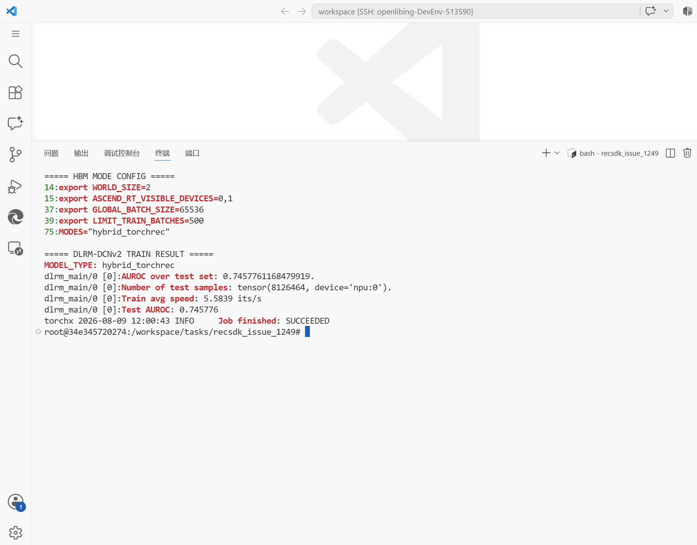
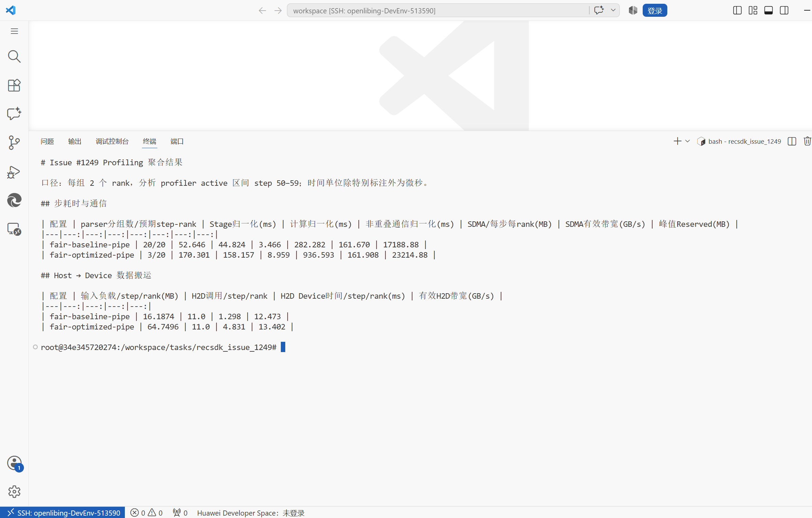
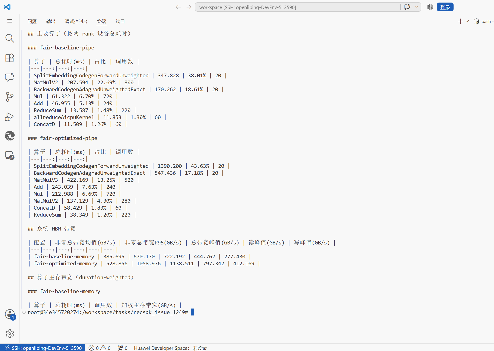

# 基于 RecSDK TorchRec-V1 的 DLRM-DCNv2 HBM 训练与性能优化

## 任务名称

[【版本众测】基于 RecSDK TorchRec-V1 开发并优化推荐模型 DCNv2](https://gitcode.com/Ascend/RecSDK/issues/1249)

## IDE 环境

| 项目 | 配置 |
| --- | --- |
| 算力环境 | Huawei Developer Space `DevEnv_513590` |
| 设备 | Ascend A3，2 NPU |
| OS / 架构 | Ubuntu 22.04 / aarch64 |
| Driver / CANN | 25.5.1 / 9.1 beta1 |
| Python / PyTorch | 3.11.15 / 2.6.0 |
| torch_npu | 2.6.0.post5 |
| TorchRec / Hybrid TorchRec | 1.1+npu / 1.1 |
| 数据 | 官方脚本生成的 Criteo 1TB 格式随机数据，mmap 读取 |

## 操作文档

[DLRM（DCNv2）TorchRec-V1 样例](https://gitcode.com/Ascend/RecSDK/blob/develop_examples_and_tools/torch_examples/dlrm/README.md)

按照样例应用 `dlrm_npu.patch`，使用默认的 `hybrid_torchrec` HBM 模式运行
DLRM-DCNv2。模型包含 26 张稀疏表，`embedding_dim=128`，DCN 为 3 层，
low-rank 维度为 512，优化器为 Adagrad。

## HBM 模式训练结果

运行配置为 `WORLD_SIZE=2`、`ASCEND_RT_VISIBLE_DEVICES=0,1`，模型完成训练、
测试和 AUROC 计算，最终输出 `Job finished: SUCCEEDED`。



随机数据的 AUROC 仅用于确认训练和评估链路完整，不代表生产数据精度。

## 性能优化与公平对比

基线采用官方快速验证默认配置。优化方案保持模型、数据、双卡拓扑、优化器和
学习率不变，仅调整全局 batch、开启 HF32，并增加 Hybrid TorchRec 流水深度。

| 配置 | 全局 batch | 本地 batch/rank | 训练 limit | HF32 | 流水深度 |
| --- | ---: | ---: | ---: | --- | ---: |
| 基线 | 16,384 | 8,192 | 2,000 | 关闭 | 6（默认） |
| 优化 | 65,536 | 32,768 | 500 | 开启 | 12 |

两组名义训练样本数均为 32,768,000。上游训练代码实际使用
`islice(..., limit - 1)` 取数，但以 `limit / elapsed` 输出速度，因此使用实际
batch 数恢复样本吞吐：

```text
elapsed = limit / logged_it_per_second
samples_per_second = (limit - 1) * global_batch / elapsed
```

| 配置 | run1 (samples/s) | run2 (samples/s) | 两次均值 (samples/s) |
| --- | ---: | ---: | ---: |
| 基线 | 331,749.31 | 330,891.21 | 331,320.26 |
| 优化 | 366,267.60 | 365,214.58 | 365,741.09 |

```text
性能提升 = 365741.09 / 331320.26 - 1 = 10.389%
```

两次配对提升分别为 10.405% 和 10.373%，均超过 10% 挑战目标。

## Profiling 数据与瓶颈分析

使用 `torch_npu.profiler` 在训练稳定后的 active step 50～59 采集数据。基线和
优化配置均分别采集 `AiCMetrics.PipeUtilization` 与 `AiCMetrics.Memory`，且两个
rank 均生成 `ASCEND_PROFILER_OUTPUT`。

### 时延与通信

| 配置 | Stage/step/rank | Compute/step/rank | 非重叠通信 | SDMA 带宽 |
| --- | ---: | ---: | ---: | ---: |
| 基线 | 52.646 ms | 44.824 ms | 3.466 ms | 161.670 GB/s |
| 优化 | 170.301 ms | 158.157 ms | 8.959 ms | 161.908 GB/s |

Host→Device 每 step/rank 的逻辑输入量分别约为 16.1874 MB 和 64.7496 MB；
根据 profiler 测得的 copy device 时间估算，有效 H2D 带宽分别约为
12.47 GB/s 和 13.40 GB/s。该带宽为逻辑输入量除以实测 copy 时间的估算值，
不是 profiler 直接输出的传输字节带宽。



### HBM 带宽与主要算子

每 NPU 的非零 HBM 采样统计如下，数值不是两卡带宽求和：

| 配置 | HBM 非零均值 | HBM P95 | HBM 峰值 | 峰值 Reserved/rank |
| --- | ---: | ---: | ---: | ---: |
| 基线 | 385.695 GB/s | 670.170 GB/s | 722.192 GB/s | 17,188.88 MB |
| 优化 | 528.856 GB/s | 1,058.976 GB/s | 1,138.511 GB/s | 23,214.88 MB |

基线中 `SplitEmbeddingCodegenForwardUnweighted` 占设备时间 38.01%，
`BackwardCodegenAdagradUnweightedExact` 占 18.61%，二者合计 56.62%。
因此主要瓶颈是稀疏 embedding 前向及 Adagrad 更新的 HBM 访问；MatMul 是第二类
主要负载。增大 batch 后，embedding 前向占比升至 43.63%，表明固定调度开销被
摊薄后，瓶颈进一步集中到 embedding 访存。



优化配置使用更深的流水线，profiler 将 20 个 step-rank 合并为 3 个 parser
分组。上述时延均采用分组总量除以实际 20 个 step-rank 归一化，未对 3 个分组
直接求均值。最终训练吞吐只使用未开启 Profiling 的完整训练日志计算。

## 总结

1. DLRM-DCNv2 已在双 NPU 的 `hybrid_torchrec` HBM 模式完成训练和评估。
2. 全局 batch、HF32 和流水深度联合调优后，修正样本吞吐提升 10.389%。
3. 双卡通信链路有效带宽在优化前后基本稳定，收益主要来自更高的设备和 HBM
   利用率，而不是通信链路变快。
4. 后续优化应优先关注 embedding kernel 融合、索引访问局部性和临时张量复用。
