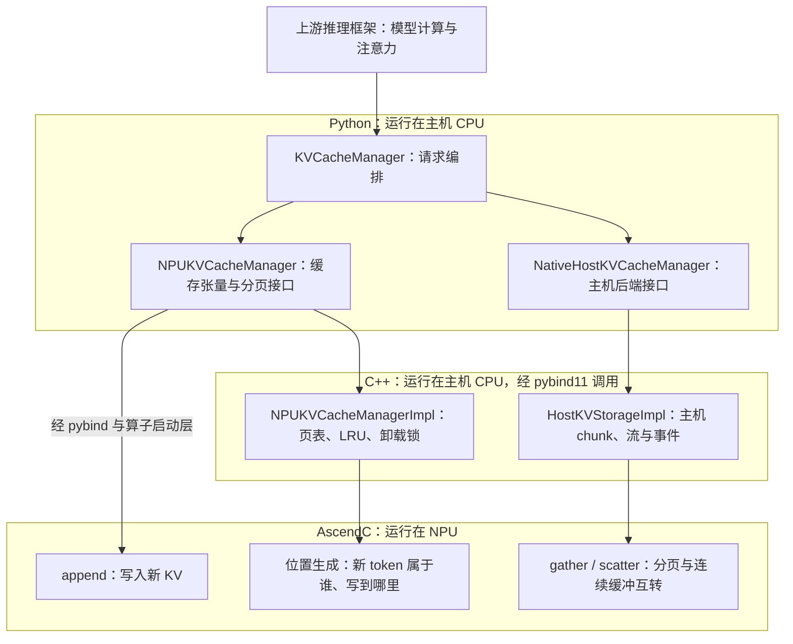

# recsys_kvcache_manager_npu 代码

## 1. 整体代码结构

### 1.1 解决的问题

推理中，同一个用户会反复携带增长的历史序列发起请求。复用历史 token 的 K/V，可以减少重复计算，但所有用户的历史 KV 无法一直占着 NPU 显存。这个库把 KV 分成两级存放：**NPU 保存当前可供推理读取的分页缓存，主机锁页内存保存可供后续换入的历史前缀。** 推理框架仍负责模型计算与注意力；本库负责定位缓存、分配空间、写入新 KV，以及在两级存储间搬运数据。

### 1.2 文件结构

```text
inference/kvcache_manager/
├── recsys_kvcache_manager_npu/       Python 接入与编排
│   ├── kvcache_manager.py           总入口：KVCacheManager
│   ├── npu_kvcache_manager.py       NPU 分页缓存组件
│   ├── native_host_kvcache_manager.py  主机存储与搬运组件
│   ├── host_kvstorage_manager.py    主机后端抽象接口、任务句柄
│   └── kvcache_config.py、kvcache_metadata.py、kvcache_utils.py  配置与共享数据结构
├── src/                            C++ 状态管理与设备调度
│   ├── npu_kvcache_manager_impl.{h,cpp}     页表、回收、卸载锁
│   ├── native_host_kvcache_manager_impl.{h,cpp}  主机存储、搬运流水线
│   ├── pybind.cpp                  Python ↔ C++ 绑定
│   ├── gather_scatter.cpp          设备算子启动入口
│   └── kernels/                    AscendC：append / gather / scatter / 位置生成
├── setup.py、CMakeLists.txt、cmake/ 构建与打包
├── test/                           单元测试与完整生命周期测试
└── docs/                           设计说明
```

第一条线是 **Python 的请求流程**，从 `kvcache_manager.py` 进入；第二条线是 **两个 C++ 实现的资源管理**；第三条线是 **AscendC 算子的实际读写**。现场先沿前两条线讲清设计，算子只说明用途。

## 2. 分层架构

### 2.1 一层编排、两个并列组件



图中实线表示主要调用关系。三个 Python 类之间是**组合关系**：`KVCacheManager` 持有两个组件；`NativeHostKVCacheManager` 继承的是 `HostKVStorageManagerBase`。两个组件不互相继承，也不直接调用对方的管理方法。

“NPU 管理器”表示它管理的资源在 NPU 上。页分配、LRU 和任务编排仍由主机 CPU 执行；AscendC 算子才在设备上运行。CANN ACL 提供流、事件和异步拷贝，`torch_npu` 提供张量及当前设备、当前流的接入。

| 层次           | 核心责任                                       | 交给下一层的内容                     |
| -------------- | ---------------------------------------------- | ------------------------------------ |
| Python 编排层  | 决定查询、分配、换入、卸载的顺序，管理任务状态 | 用户、长度、查询结果和任务请求       |
| Python 组件层  | NPU 侧持有缓存张量；主机侧封装后端协议         | 张量、页号、配置与句柄               |
| C++ 实现层     | 管理页和主机块，安排流与事件                   | 内存地址、页索引、算子参数、拷贝任务 |
| AscendC 算子层 | 按索引写入、聚集、散布数据，生成 token 位置    | NPU 上的缓存内容与位置元数据         |

### 2.2 区分“调用关系”和“数据关系”

虽然两个组件不互相调用，它们会访问**同一份 NPU 缓存**。初始化时，顶层执行：

```python
host.register_npu_cache_tables(npu.get_cache_tables())
```

这段代码来自 `KVCacheManager.__init__`：把 NPU 组件持有的每层缓存视图注册给主机后端。主机后端的 C++ 实现保存这些表的地址，之后通过 gather/scatter 直接读写它们。注册传递的是地址，初始化时不会因此复制整份 KV。

```text
卸载 offload：NPU 分页缓存 → gather → NPU 连续中转缓冲 → D2H → 主机锁页内存
换入 onboard：主机锁页内存 → H2D → NPU 连续中转缓冲 → scatter → NPU 分页缓存
```

其中 H2D 是主机到设备，D2H 是设备到主机。代码在 Python 接口中常用 `onboard`，C++ 实现中常用 `onload`，这里都表示“换入”。

### 2.3 跨层三份信息

| 信息              | 回答的问题                                        | 主要去向             |
| ----------------- | ------------------------------------------------- | -------------------- |
| `KVIndexMeta`     | 这一批有哪些用户，每个用户的目标总长度是多少？    | 顶层与两个组件       |
| `KVLookupResult`  | 两级缓存分别已有哪段历史，合并后能复用多少？      | 页分配与换入决策     |
| `KVCacheMetadata` | NPU 页在哪里，新 token 应写到哪里，换入如何等待？ | 写入算子与上游注意力 |

元数据中的页号列表、每个用户的页表边界、尾页有效长度，足以把逻辑序列映射到物理页。`kv_cache_table[layer]` 则是实际缓存张量的视图。**元数据负责描述位置，缓存张量负责保存数值。**

**过渡：分层的结果，是上游可以用一组稳定接口驱动请求，而不用自己管理页表、主机块和搬运流。**

## 3. 上层核心接口

### 3.1 每个接口作用

| 接口                                  | 什么时候调用               | 作用与大致流程                                         |
| ------------------------------------- | -------------------------- | ------------------------------------------------------ |
| `KVCacheManager.from_config(cfg)`     | 启动时一次                 | 创建 NPU 与主机组件，再注册每层缓存表                  |
| `lookup_kvcache(uids, seq_lens)`      | 一批请求开始               | 分别查 NPU 与主机，合并可复用区间，返回索引和查询结果  |
| `allocate_kvcache(index, lookup)`     | 查询之后                   | 复用已有页、为换入和新增内容补页，返回页表及写入元数据 |
| `onboard_launch(index, lookup, meta)` | 分配之后                   | 启动主机到 NPU 的换入，把句柄放入`meta`                |
| `offload_launch(index)`               | 本批各层 KV 写入已提交之后 | 选择可卸载内容、锁住相关用户的页、启动异步卸载         |
| `offload_try_wait()`                  | 后续批次或调度循环         | 非阻塞检查卸载任务，完成后登记主机长度并释放卸载锁     |
| `evict` / `evict_all`                 | 按需清理                   | 按开关释放 NPU 或主机缓存，两个开关默认均为 False      |

还需要一个位于任务句柄上的关键接口：`meta.kv_onload_handle.stream_wait_layer(layer)`。它在当前推理流上插入等待，保证该层读缓存前，换入数据已经写好。

### 3.2 把调用连成一条主线

以下是**接入示意**；`model` 的计算函数、注意力函数与 `cfg` 由上游提供。

```python
mgr = KVCacheManager.from_config(cfg)             # 启动时创建一次

# 每批：uids 为 CPU int64；seq_lens 为 CPU int32，表示目标总长度
mgr.offload_try_wait()                           # 收尾此前已完成的卸载
index, lookup = mgr.lookup_kvcache(uids, seq_lens)
meta = mgr.allocate_kvcache(index, lookup)
mgr.onboard_launch(index, lookup, meta)

for layer in range(cfg.num_layers):
    meta.kv_onload_handle.stream_wait_layer(layer)
    k_new, v_new = model.compute_new_kv(layer, ...)  # 上游计算新增 KV
    mgr.npu_kvcache_mgr.put(k_new, v_new, layer, meta)
    model.paged_attention(layer, meta, ...)         # 上游读取分页缓存

mgr.offload_launch(index)                        # 所有层写入均已提交
# 后续批次或调度循环继续调用 offload_try_wait()，直至任务收尾
```

`KVCacheManager` 是生命周期的主入口，逐层写入仍需调用 NPU 组件或底层 append 接口。这里用测试中的 `put` 便于说明；源码将它标为调试封装，正式接入可参考它调用 `kvcache_npu_cpp.append_kvcache`。新 K/V 按批内用户顺序拼接，形状为 `[新增 token 总数, heads, head_dim]`。

讲到这里强调三个时序即可：

1. **分配后再换入。** 先确定目的页，才能把主机数据写回正确位置；分配返回时元数据已就绪，待换入和新增的 KV 内容还要后续写入。
2. **逐层等待后再使用缓存。** Native 后端以 `stream_wait_layer` 同步；不能把 `onboard_wait()` 当作整批换入完成的保证，其 Native 实现返回 `SKIPPED`。
3. **写入提交后再卸载，并持续收尾。** 卸载流通过事件等待当前推理流，后续 `offload_try_wait()` 才会完成登记和解锁。

**过渡：接口顺序已经明确，接下来解释三个类为何能把这条流程协作完成。**

## 4. 核心类的设计与交互

### 4.1 KVCacheManager：统一编排入口

它持有 NPU 组件、主机后端、进行中的卸载任务列表和失败处理配置。它掌握一批请求的全流程，因此适合承担两侧之间的协调：查询时合并结果，分配时把主机长度交给 NPU 组件，换入时把目的页交给主机后端，卸载完成后把成功结果反馈给 NPU 组件。

卸载时最能看出它的作用：

```text
NPU 组件选择用户 → 主机后端复查已保存长度 → NPU 组件锁住用户并给出待卸载页
    → 主机后端启动搬运 → 顶层保存任务句柄
    → 后续查询任务完成 → 主机登记有效数据 → NPU 更新已卸载长度并解锁
```

需要把“发起搬运”和“登记成功”分开：异步任务刚提交时，数据未必已经到达主机，NPU 侧还不能把这些页当作已有可靠主机副本来回收。任务句柄把发起时的信息带到完成阶段。

### 4.2 NPUKVCacheManager：管理固定页池与用户映射

**第一项设计：预先分配固定大小的分页张量。** Python 组件持有形如 `[层数, 页数, 2, 页大小, 头数, head_dim]` 的缓存，`2` 对应 K 和 V。运行时的“分配页”主要是分配这块张量中的物理页号、更新用户映射，无需每批重新申请整块 KV 存储。一个用户的逻辑页可以落在不连续的物理页上。

**第二项设计：由 C++ 维护资源状态。** `NPUKVCacheManagerImpl` 记录空闲页、用户页表、缓存起点与长度、已卸载长度、LRU 和卸载锁。每次分配把用户需要的页按“待换入前缀、现有部分、新增部分”组织起来，并生成上游需要的元数据。新增 token 也可能写进已有尾页的空位。

**第三项设计：优先回收已有主机副本的前缀。** 当空闲页不足时，先从其他用户中回收已经卸载的前缀页，让用户的后缀继续留在 NPU；仍不够时，再按 LRU 选择整户驱逐。正常容量条件下，自动回收会避开本批用户和正在卸载的用户。

这里有两个不同的动作：**卸载成功让页具备可回收条件；之后的分配压力才触发实际回收。** `release_offload_pages` 释放的是卸载锁并更新记录，不会立即把这批物理页全部释放。

### 4.3 NativeHostKVCacheManager：主机存储与搬运流水线

这个 Python 类实现 `HostKVStorageManagerBase`，把统一的查询、换入、卸载、完成接口转交给 C++ 的 `HostKVStorageImpl`。当前工厂实现的主机后端是 `native_host`。

**存储设计：主机按 chunk 管理历史前缀。** NPU 以 page 为分配单位；主机以多个 page 组成的 chunk 分配锁页内存。比如 page 是 32 个 token、chunk 是 128 个 token，则每个 chunk 容纳 4 页。主机记录各用户已保存的有效长度，最后一个 chunk 可以尚未填满，后续继续写入。主机容量不足时也会按自己的 LRU 回收用户存储。

**搬运设计：连续中转缓冲连接分页缓存与主机内存。** 页号可能离散，所以卸载先用 gather 把指定页聚集到连续缓冲，再做 D2H；换入先 H2D 到连续缓冲，再用 scatter 写到目的页。

底层使用 4 条流：H2D、scatter、gather、D2H。换入和卸载各有 2 块 NPU 中转缓冲，按层交替复用；一层在 scatter 时，下一层可以进行 H2D。这样以有限的中转空间安排层间流水线。

**同步设计：换入按层等，卸载在后台收尾。** 模型计算到第几层，就让推理流等待该层 scatter 完成的事件，有机会把后续层搬运与当前层计算重叠。卸载则检查最后一层 D2H 的完成事件，再由顶层调用完成接口登记主机数据。这里的异步主要依靠设备流与事件推进。

### 4.4 用一个用户把三者串起来

下面是按源码规则推演的讲解例子。设 `page_size=32`、`offload_chunksize=128`，容量充足、没有其他未完成任务。用户此前有 300 个 token 的有效 KV，前 288 个已在主机登记，NPU 因先前空间压力只保留最后 12 个 token。

```text
本次请求前：Host [0, 288)；NPU [288, 300)
本次目标：  序列增长到 440，需要新计算 [300, 440)，共 140 个 token
```

| 步骤       | 三个类如何分工                                        | 本例的结果                                                 |
| ---------- | ----------------------------------------------------- | ---------------------------------------------------------- |
| 查找       | 顶层分别查询两个组件并合并                            | 可复用的历史为`[0,300)`                                    |
| 分配       | NPU 组件补齐目的页、生成页表                          | 共 14 页：9 页待换入、1 页原有、4 页新申请                 |
| 换入       | 顶层把页表交给主机后端，后端逐层 H2D + scatter        | 主机的 288 个 token 回到前 9 个逻辑页                      |
| 写入与计算 | 上游逐层等待，计算新 KV，通过 append 写入并执行注意力 | 新增 140 个 token；先填原尾页的 20 个空位，再写后续 120 个 |
| 发起卸载   | 顶层协调取页加锁，主机后端 gather + D2H               | 从主机已存终点 288 开始，卸载整页区间`[288,416)`           |
| 完成登记   | 顶层查询完成，主机登记，NPU 更新记录并解锁            | Host 有效前缀变成`[0,416)`；NPU 仍持有 `[0,440)`           |
| 后续回收   | 其他批次需要空间时，NPU 分配器可回收该用户已卸载前缀  | 可留下 NPU 后缀`[416,440)`，等待用户下次回来               |

本例的未卸载内容为 `440−288=152` 个 token，达到 128 的选择门槛；待卸载页取完整页，因此本次新增 128 个有效 token 的主机副本，最后不足一页的 24 个仍只在 NPU。主机按 chunk 申请容量，有效长度仍按实际保存的整页记录。

这个例子把三个时间点分开了：**分配完成时有目的位置；换入和写入完成后才有可用内容；卸载完成登记后，相关前缀才可在后续回收中让出 NPU 空间。**

## 5. 怎么构建，怎么运行

### 5.1 构建的是“Python 包 + 两个动态库”

```text
setup.py 调用 CMake
  ├─ AscendC 编译 src/kernels/ → libkvcache_kernel.so
  └─ C++ + pybind11 编译 src/*.cpp → kvcache_npu_cpp.cpython-*.so
Python 包加载 kvcache_npu_cpp，扩展再链接算子库
```

运行环境是带目标昇腾 NPU 的 Linux：先准备相互兼容的驱动、CANN Toolkit、PyTorch 与 `torch_npu`，再安装 Python 构建依赖。源码要求 Python ≥ 3.9、CMake ≥ 3.16，默认 SoC 是 `Ascend950PR_9579`；还需要 CANN 提供 `ASC`/AscendC 工具链、支持 C++20 的编译器，以及 ABI 与源码中 `_GLIBCXX_USE_CXX11_ABI=1` 一致的 PyTorch。仓库未固定一套完整的依赖版本组合。

### 5.2 在目标机器上构建

以下为 Bash 命令，工作目录必须是包含 `setup.py` 的 `inference/kvcache_manager` 根目录；先激活已经装好匹配版本 `torch` 与 `torch_npu` 的环境。

```bash
cd /path/to/RecSDK/inference/kvcache_manager

# 按目标机器的安装位置调整；加载 CANN 官方环境脚本
source /usr/local/Ascend/ascend-toolkit/set_env.sh
export ASCEND_CANN_PACKAGE_PATH=/usr/local/Ascend/ascend-toolkit/latest
export ASCEND_HOME="$ASCEND_CANN_PACKAGE_PATH"
export SOC_VERSION=Ascend950PR_9579   # 本仓库默认目标，需与实际硬件匹配
export MAX_COMPILE_THREADS=8

python -c 'import torch, torch_npu; print(torch.__version__, torch_npu.__version__); print(torch.npu.is_available())'
python -m pip install setuptools wheel pybind11 pytest
python -m pip install --no-build-isolation --no-deps .

# 确认扩展与 Python 包均能加载
python -c 'import torch, torch_npu, kvcache_npu_cpp; from recsys_kvcache_manager_npu import KVCacheManager; print("import OK")'
```

`--no-build-isolation` 让构建使用当前已配置好的 Python 环境，`--no-deps` 保留事先匹配好的依赖。CANN 环境脚本需让 CMake 能找到 `ASC`，单独设置库路径不能代替完整工具链初始化。开发时也可用 `python setup.py build_ext --inplace`，随后从源码根目录运行。

如果导入提示缺少 `libkvcache_kernel.so`，检查算子库是否与扩展一起部署；扩展使用 `$ORIGIN` 查找同目录动态库。就地构建时也要检查 `build/lib.*` 中的算子库是否已放到源码根目录的扩展旁。具体构建文件为 `setup.py` 和 `CMakeLists.txt`，由前置 PR 提供。

### 5.3 先跑一条完整生命周期，再按模块验证

本库作为 Python 库被调用。演示入口选择 `test_native.py`，它通过顶层管理器完成五个阶段：首次写入卸载、增量复用、NPU 驱逐后换入、新用户触发回收、旧用户返回并清理。

```bash
# 在 inference/kvcache_manager 根目录执行，让脚本也能找到本地 Python 包与就地构建的扩展
export PYTHONPATH="$PWD${PYTHONPATH:+:$PYTHONPATH}"

# 完整生命周期演示：成功时依次打印五个阶段 Passed
python test/test_native.py

# 按需运行组件与集成测试
python -m pytest -q test/test_npu_kvcache_manager.py
python -m pytest -q test/test_native_host_unit.py
python -m pytest -q test/test_kvcache_manager.py
```

`test_kvcache_manager.py` 的五个用例各自通过共享的 `_step_01..05` helper 显式重放它依赖的前序阶段，可以用 `-k` 单独运行任意一个，不再要求整文件按顺序执行。演示脚本与该集成测试覆盖相近的五阶段流程，讲解时选演示脚本即可。

接入模型时，沿用第 3 节的调用顺序，通过 `KVCacheConfig` 配置模型维度、NPU 页数、主机每层容量、批大小和序列长度上限。当前数据通路使用 BF16，`head_dim` 分派支持 64/128/256/512，chunk 大小必须是 page 大小的整数倍；初次验证可直接采用演示中的 `head_dim=128`、page=32、chunk=128。显存预算还需计入主机后端的四块 NPU 中转缓冲。
