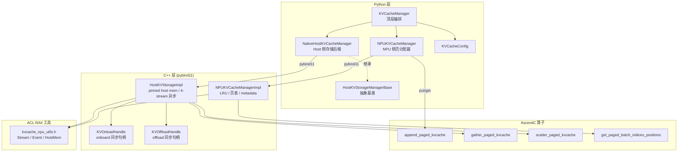
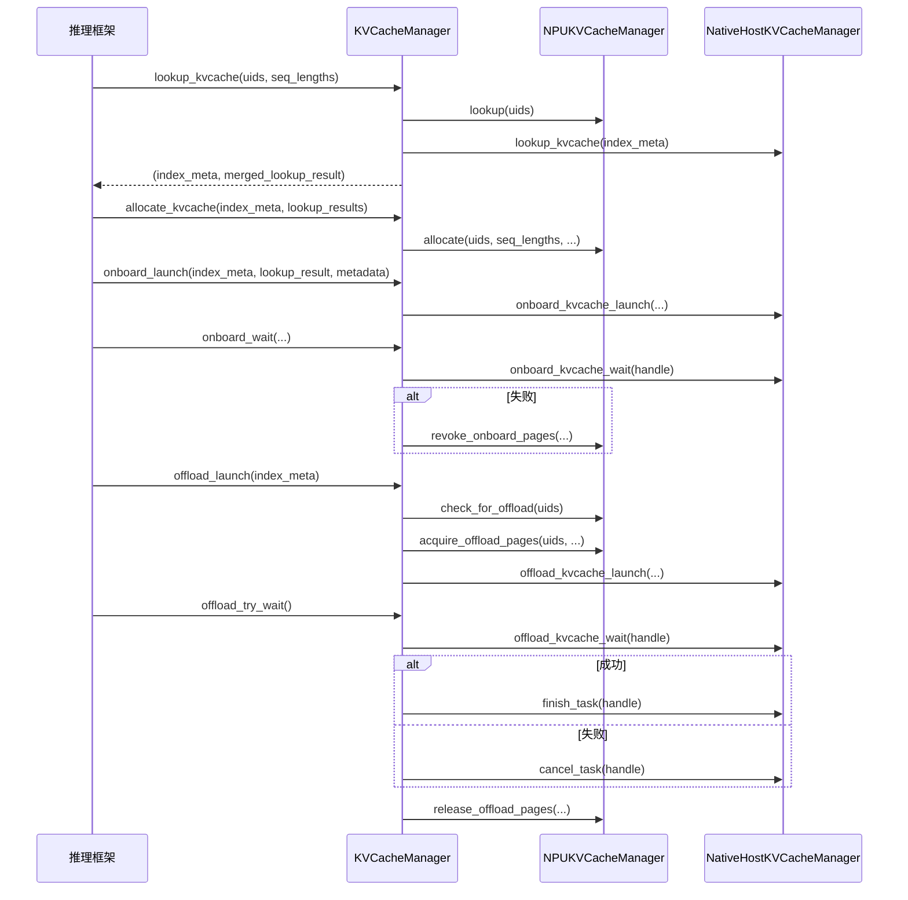
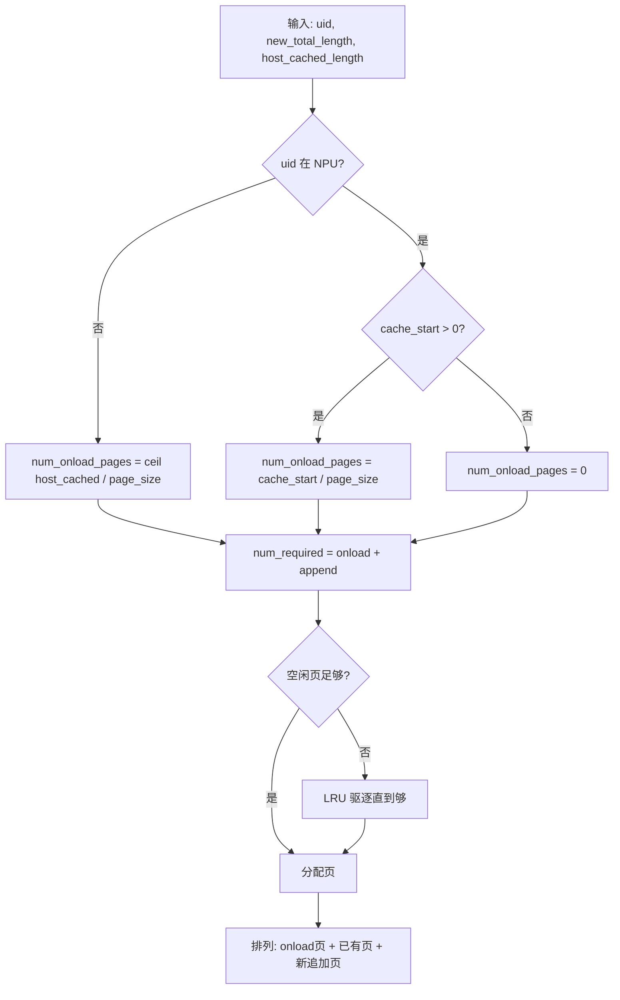
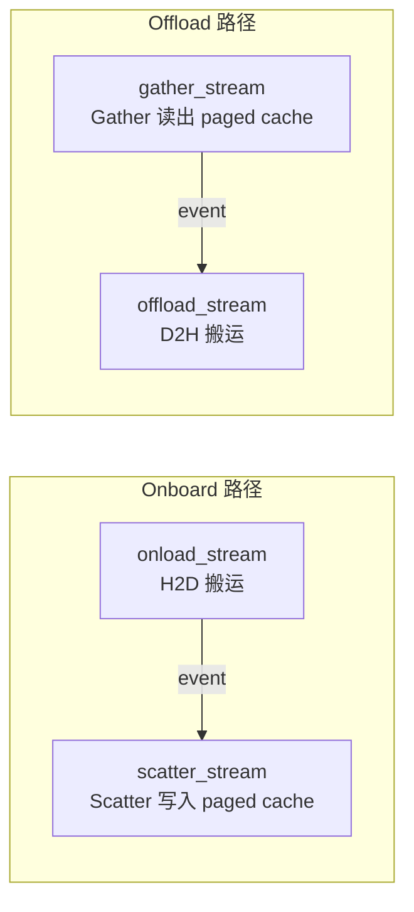
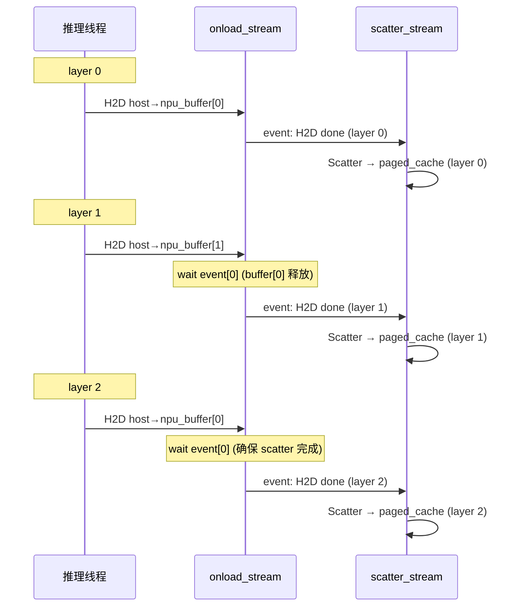
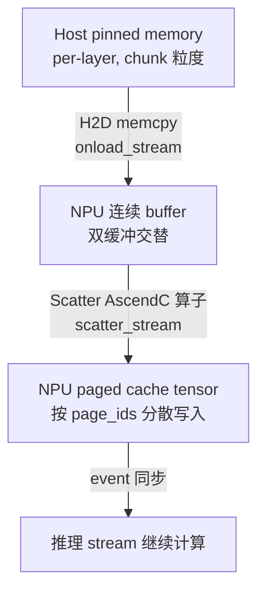
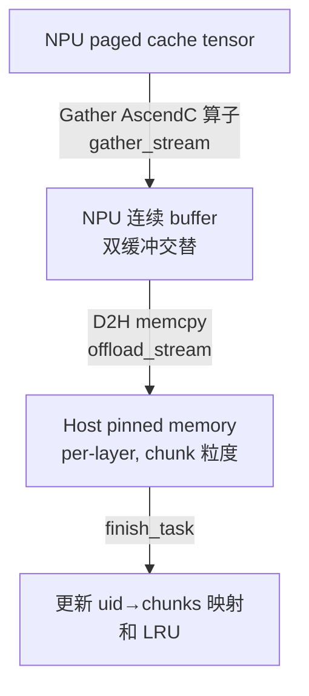

# recsys_kvcache_manager_npu 设计文档

> 版本 0.3.0 | 昇腾 A5 KVCache Manager

## 1. 项目定位与核心问题

### 1.1 解决什么问题

在 HSTU 等大模型推荐推理框架中，KV cache 是推理延迟和显存占用的关键瓶颈。推理框架通常采用 **paged KV cache** 方案——将 KV cache 按页分配、按用户（request）管理生命周期——来支持变长序列和前缀共享。

GPU 上的 paged KV cache 方案（如 vLLM、FlashAttention）已相对成熟，但昇腾 A5 NPU 缺乏对应的实现。核心痛点：

1. **NPU 侧页分配与换入换出**：GPU 上的 `GPUKVCacheManagerImpl` 管理页表、LRU 驱逐、offload 锁定，这套逻辑在 NPU 上需要用 CANN ACL API 重新实现
2. **Host 侧存储与异步搬运**：GPU 用 CUDA pinned memory + cudaMemcpyAsync，NPU 需要用 `aclrtMallocHost` + `aclrtMemcpyAsync` + 多 stream 流水
3. **AscendC 算子**：GPU 的 gather/scatter/append 用 CUDA kernel 实现，NPU 需要用 AscendC 编程模型重写

### 1.2 设计哲学

**结构对齐，API 适配**——Python 层的类结构和 API 签名与 GPU 包 (`recsys_kvcache_manager`) 保持 1:1 镜像，C++ 层将 CUDA 调用逐个替换为 CANN ACL 等价物。这不是简单的文本替换，而是要处理 CUDA 和 CANN 之间的语义差异（如 stream 语义、event 同步模型、kernel launch 方式）。

---

## 2. 架构总览



### 2.1 三层架构

| 层 | 职责 | 技术 |
|----|------|------|
| **Python 编排层** | 顶层生命周期协调、配置构建、跨模块数据流 | Python + PyTorch |
| **C++ 实现层** | 页分配算法、LRU 驱逐、4-stream 异步搬运、元数据计算 | C++ + CANN ACL + pybind11 |
| **AscendC 算子层** | paged cache 的 gather/scatter/append | AscendC (昇腾设备端编程) |

---

## 3. 核心模块深度分析

### 3.1 KVCacheManager — 顶层编排

> 文件：`recsys_kvcache_manager_npu/kvcache_manager.py`

KVCacheManager 是推理系统与 KV cache 子系统的唯一交互入口。它协调 NPU 侧页分配器与 Host 侧存储后端，提供完整的推理生命周期。



**关键设计决策：**

- **NPU+Host 双层查询合并**：`lookup_kvcache` 同时查询两侧，通过 `KVLookupResult.merge()` 合并结果。合并逻辑处理三种情况：两侧都没缓存、仅 NPU 有、仅 Host 有、两侧都有（NPU 缓存是 Host 的尾部子集）
- **失败策略 (`fail_open` / `fail_close`)**：onboard/offload 失败时，`fail_open` 打印警告继续推理（KV 缺失但不崩溃），`fail_close` 直接抛异常。推荐系统场景优先可用性，默认 `fail_open`
- **offload 两阶段锁定**：`acquire_offload_pages` 锁定 NPU 页（防止推理写入），offload 完成后 `release_offload_pages` 释放。如果 Host 拒绝 offload（过载），立即释放锁

### 3.2 NPUKVCacheManager — NPU 侧页分配器

> 文件：`recsys_kvcache_manager_npu/npu_kvcache_manager.py`、`src/npu_kvcache_manager_impl.{h,cpp}`

管理 NPU 设备上的 paged KV cache tensor 和页表元数据。

**Paged Cache Tensor 布局：**

```text
npu_kvcache_tensor: [num_layers, num_pages, 2(K/V), page_size, num_heads, head_dim]
                                      ↑ page_id 索引   ↑ K 和 V 拼在一起
```

这是一个 6D tensor，page_id 作为第二维索引。K 和 V 在第三维拼接，每个 page 包含 `page_size` 个 token 的 K 和 V 数据。

**页分配核心算法 (`alloc_single_sequence`)：**



**为什么 onload 页排在最前面？** Host 侧的 KV cache 总是从序列头部开始存储。onboard 时需要将 Host 数据写入 NPU 的前部页，已有的 NPU 数据后移。这种排列让 onboard 只需顺序写入，不需要搬移 NPU 上的已有数据。

**LRU 驱逐策略细节：**

- 驱逐优先级：先尝试 `evict_offloaded`（只释放已 offload 到 Host 的页，保留 NPU 上的热数据），再全量 `evict`
- 锁定保护：`_uid_offload_lock` 防止正在 offload 的页被驱逐；推理期间的保护由调用方保证（`_uid_inference_lock` 已预留但当前未接入）
- `_uid_to_offloaded_length` 追踪每个 user 已 offload 到 Host 的长度，用于增量 offload

**元数据缓冲区布局：**

```text
metadata_npu_buffer: [5 * batch_size + 4 + 2 * num_new_tokens]
  ├─ [0, batch_size + 1)            → kv_indptr (page 指针)
  ├─ [batch_size+1, 2*batch_size+1) → kv_last_page_len
  ├─ [2*batch_size+1, 3*batch_size+1) → total_history_lengths
  ├─ [3*batch_size+1, 4*batch_size+2) → total_history_offsets
  ├─ [4*batch_size+2)               → new_history_nnz (标量)
  ├─ [4*batch_size+3, 5*batch_size+4) → new_history_offsets
  ├─ [5*batch_size+4, 5*batch_size+4+num_new_tokens) → batch_indices
  └─ [5*batch_size+4+num_new_tokens, ...) → positions
```

这个布局将所有推理所需的元数据打包到一块连续 NPU 内存中，通过 `narrow` 切片共享底层存储，避免多次 `aclrtMalloc`。`batch_indices` 和 `positions` 由 `GetPagedBatchIndicesPositions` AscendC 算子填充，其余字段由 C++ 在 host 端计算后通过 `aclrtMemcpyAsync` H2D 传输。

### 3.3 NativeHostKVCacheManager — Host 侧存储后端

> 文件：`recsys_kvcache_manager_npu/native_host_kvcache_manager.py`、`src/native_host_kvcache_manager_impl.{h,cpp}`

这是最复杂的模块，负责在 Host pinned memory 中存储 KV cache，并通过 CANN ACL 的多 stream 异步搬运实现 NPU ↔ Host 数据传输。

**4-stream 流水设计：**



**为什么需要 4 条独立 stream？**

1. **onload_stream + scatter_stream**：onboard 时，先在 `onload_stream` 上做 H2D 将数据搬到 NPU 连续 buffer，再在 `scatter_stream` 上用 AscendC 算子将连续 buffer 分散写入 paged cache。两条 stream 通过 event 串联，允许 H2D 和 scatter 流水
2. **gather_stream + offload_stream**：offload 时，先在 `gather_stream` 上用 AscendC 算子从 paged cache gather 到连续 buffer，再在 `offload_stream` 上做 D2H 搬到 Host。同样两条 stream 流水
3. 四条 stream 相互独立，onboard 和 offload 可以并发（不同 user 的数据不冲突）

**onboard 逐层流水：**



onload 只分配 2 个 NPU buffer（双缓冲），通过 `layer_idx % 2` 交替使用。从 layer 2 开始，onload_stream 需要 wait 上一轮同 buffer 的 scatter 完成事件，避免写冲突。这样 L 层 onboard 只需要 2 个 buffer 而非 L 个，显存占用从 O(L) 降到 O(2)。

**offload 逐层流水同理**，gather_stream 和 offload_stream 双缓冲交替，从 layer 2 开始 wait 前两层的完成事件。

**Host 侧存储布局 — Chunk 粒度管理：**

Host pinned memory 按 **chunk**（由 `num_tokens_per_chunk` 决定）粒度分配，chunk 是 page 的整数倍。一个 user 的 KV cache 可能跨越多个不连续的 chunk：

```text
_uid_to_chunks: uid → (vector<offset>, vector<psize>)
  每个 pair 表示一段 chunk 的起始偏移和页数
  例: uid=42 → offsets=[0, 512KB, 1MB], psizes=[4, 4, 2]
  表示 3 段 chunk: 第一段 4 页, 第二段 4 页, 第三段 2 页
```

**为什么 chunk 而非 page？** Host 内存分配开销大，按 page 粒度分配会导致大量碎片和管理开销。chunk 是 page 的 4 倍（通常 128 tokens / 32 tokens per page = 4 pages），减少分配次数同时保持对 page 的对齐。但代价是 offload 非对齐时的 chunk 复用逻辑更复杂（见 `get_empty_pinned_chunks` 中的 start_pos 未对齐处理）。

**LRU 驱逐 + 容量检查：** Host 侧也有独立的 LRU 列表。当空闲 chunk 不足时，从 LRU 尾部驱逐不在当前 offload 集合中的 user，释放 chunk。

### 3.4 同步机制 — KVOnloadHandle / KVOffloadHandle

> 文件：`src/native_host_kvcache_manager_impl.h:28-88`

这两个 handle 类是 NPU-Host 异步搬运的同步原语。

**KVOnloadHandle** 使用 **mutex + condition_variable** 实现 host 端同步：

- `complete_host(layer_idx, stream)`：scatter 完成后，record event 并设置 `host_complete[layer_idx] = 1`，notify CV
- `wait_layer(layer_idx)`：推理线程阻塞在 CV 上等待 host_complete，然后 `aclrtStreamWaitEvent` 让推理 stream 等待 scatter event

**为什么用 mutex+CV 而非纯 event polling？** Onboard 的 host 端 H2D 拷贝是异步的，推理线程需要知道何时 NPU 端数据就绪。纯 event polling 会浪费 CPU，mutex+CV 让推理线程在数据未就绪时真正睡眠。

**KVOffloadHandle** 使用 **atomic + event query** 实现非阻塞检查：

- `complete_host(layer_idx, stream)`：record event 并 `atomic_store(host_ready, 1, memory_order_release)`
- `try_wait_layer(layer_idx)`：先检查 `atomic_load(acquire)` 是否为 1，再 `aclrtQueryEventStatus` 查询 event 是否完成

**为什么 offload 用非阻塞？** Offload 是后台任务，推理循环不应被阻塞。`offload_try_wait` 在每次推理迭代中非阻塞检查，就绪则释放页，未就绪继续推理。

### 3.5 ACL RAII 工具

> 文件：`src/kvcache_npu_utils.h`

三个 RAII 包装类，确保 CANN 资源在异常路径下也能正确释放：

| 类 | 包装资源 | 释放函数 |
|----|---------|---------|
| `ACLStreamPtr` | `aclrtStream` | `aclrtDestroyStream` |
| `ACLEventPtr` | `aclrtEvent` | `aclrtDestroyEvent` |
| `ACLHostMemPtr` | `void*` (pinned) | `aclrtFreeHost` |

三者都禁用拷贝、支持移动语义，析构时自动释放。工厂函数 `make_acl_stream()`、`make_acl_event()`、`make_acl_host_mem(bytes)` 封装创建+错误检查。

**`ACL_CHECK` / `ACL_CHECK_NOEXCEPT` 宏**：前者抛 `runtime_error`（包含文件名+行号+ACL 错误消息），后者用于析构函数等 noexcept 上下文，仅打 stderr 日志。

### 3.6 AscendC 算子

> 目录：`src/kernels/`

四个 AscendC 设备端算子，通过 `ACLRT_LAUNCH_KERNEL` 宏从 host 端启动：

| 算子 | 方向 | 功能 |
|------|------|------|
| `append_paged_kvcache` | 连续 → paged | 将新 token 的 KV 写入 paged cache（推理时每步调用） |
| `gather_paged_kvcache` | paged → 连续 | 从 paged cache 按 page_ids 读出到连续 buffer（offload 时 gather） |
| `scatter_paged_kvcache` | 连续 → paged | 从连续 buffer 按 page_ids 写入 paged cache（onboard 时 scatter） |
| `get_paged_batch_indices_positions` | 计算 | 为每个新 token 计算 batch_index 和 position |

**fastdiv 优化**：gather/scatter/append 内部需要频繁除以 `page_size`（计算页内偏移）。昇腾 A5 的 AscendC 指令集没有硬件整数除法，因此使用 **算法除法（Barrett reduction / magic number）** 将除法转化为乘法+移位。`get_uint_fastdiv_msa()` 在 host 端预计算 magic number `(m, s, a)`，传入设备端算子用于快速除法。

**dispatch_head_dim 模板**：append/gather/scatter 按 `head_dim` 的四个受支持值（64, 128, 256, 512）模板特化，避免运行时分支。昇腾 A5 的 AI Core 是标量+向量协处理器，循环展开和分支消除对性能至关重要。传入其余 `head_dim` 会落入 `default:` 空分支，既不报错也不回落，静默跳过——接入新模型维度前务必确认已在这四个值内。

### 3.7 HostKVStorageManagerBase — 抽象基类

> 文件：`recsys_kvcache_manager_npu/host_kvstorage_manager.py`

定义 Host 侧存储后端的接口契约。当前唯一实现是 `NativeHostKVCacheManager`，后续计划接入 FlexKV。

**关键接口：**

| 方法 | 阶段 | 说明 |
|------|------|------|
| `register_npu_cache_tables` | 初始化 | 注册 NPU cache tensor 指针，用于 gather/scatter |
| `lookup_kvcache` | 查询 | 返回 Host 侧已缓存长度 |
| `onboard_kvcache_launch` / `_wait` | 搬入 | 异步 H2D + scatter |
| `offload_kvcache_launch` / `_wait` | 搬出 | 异步 gather + D2H |
| `finish_task` / `cancel_task` | 完成/取消 | 释放或回收资源 |

**HostKVTaskHandle** 携带任务状态（`LAUNCHED` → `READY` / `TIMEOUT` / `FAILED` / `CANCELLED`），支持 layer-wise 同步（`is_layerwise=True` 时 `wait_layer(layer_idx)` 仅等待特定层）。

---

## 4. 数据流全链路

### 4.1 Onboard（Host → NPU）数据流



1. 推理调用 `onboard_launch`，Host 侧根据 `lookup_result` 计算哪些 user 需要搬入、搬入哪些页
2. C++ `onload_kvcache` 逐层执行：
   - `onload_stream`：从 Host pinned mem H2D 拷贝到 NPU 连续 buffer
   - `scatter_stream`：AscendC `scatter_paged_kvcache` 按 page_ids 写入 paged cache
3. 每层 scatter 完成后 `complete_host(layer_idx)` 通知推理线程
4. 逐层完成由调用方驱动：每层 scatter 完成后通过 `stream_wait_layer` 让推理 stream 等待 scatter event 再使用该层数据；`onboard_wait` 只做整批状态检查，Native 实现返回 `SKIPPED`，不能当作换入完成的保证

### 4.2 Offload（NPU → Host）数据流



1. 推理完成后调用 `offload_launch`
2. NPU 侧 `check_for_offload` 找出有足够未 offload 数据的 user
3. `acquire_offload_pages` 锁定页并返回 page_ids
4. C++ `offload_kvcache` 逐层执行：
   - `gather_stream`：AscendC `gather_paged_kvcache` 按 page_ids 读到连续 buffer
   - `offload_stream`：D2H 拷贝到 Host pinned mem
5. `offload_try_wait` 非阻塞检查，就绪后 `finish_task` 更新 chunk 映射

### 4.3 at::cat Stream Bug

> 提交 `b0983b8`、`e2f6dc6`

昇腾 `torch_npu` 的 `at::cat` 在非默认 NPU stream 上可能产生零填充输出。这是一个昇腾 CANN 的已知行为——某些 ATen 操作只在默认 stream 上正确执行。

**解决策略**：在 `onload_kvcache` 中，先在默认 PyTorch stream 上执行 `at::cat`（合并 page indices），record event 标记 cat 完成，再进入 onload stream guard 并 wait 该 event。这样 cat 的结果在 onload stream 开始时保证可见。

---

## 5. GPU → NPU 迁移映射

| 概念 | GPU (CUDA) | NPU (CANN ACL) |
|------|-----------|---------------|
| Stream | `cudaStream_t` | `aclrtStream` |
| Stream 创建 | `cudaStreamCreateWithFlags` | `aclrtCreateStream` |
| Event | `cudaEvent_t` | `aclrtEvent` |
| Event 查询 | `cudaEventQuery` | `aclrtQueryEventStatus` |
| Pinned 内存 | `cudaMallocHost` / `cudaFreeHost` | `aclrtMallocHost` / `aclrtFreeHost` |
| 异步拷贝 | `cudaMemcpyAsync` | `aclrtMemcpyAsync` |
| 设备守卫 | `c10::cuda::OptionalCUDAGuard` | `c10_npu::OptionalNPUGuard` |
| 当前 stream | `c10::cuda::getCurrentCUDAStream` | `c10_npu::getCurrentNPUStream` |
| 核心数 | `cudaDeviceProp.multi_processor_count` | `PlatformAscendCManager::GetCoreNumAiv()` |
| Kernel 启动 | `<<<grid, block>>>` 或 `cudaLaunchKernel` | `ACLRT_LAUNCH_KERNEL` |
| 整数除法 | 硬件 `__div32` | 软件 Barrett reduction (fastdiv) |
| 占用率查询 | `cudaOccupancyMaxActiveBlocksPerSM` | 无等价物，用 `max_cores` 估算 |

---

## 6. 关键设计权衡

### 6.1 LRU 驱逐：O(1) 实现 vs. 近似最优

LRU 用 `std::list` + `unordered_map` 实现经典 O(1) 驱逐。严格 LRU 在某些场景下不如 LRU-K 或 ARC（如扫描式工作负载），但推荐推理中 user 的访问模式相对稳定（热点 user 频繁访问），LRU 是合理的近似。实现简单性在这里的价值超过理论最优性。

### 6.2 双缓冲 vs. 逐层缓冲

Onboard/Offload 逐层处理时，只分配 2 个 NPU buffer 交替使用（`layer_idx % 2`）。从 layer 2 开始，当前层需要 wait 两层前同一 buffer 的操作完成。

**权衡**：2 个 buffer 的显存代价是 `O(max_batch * max_seq * per_token_numel)`，逐层缓冲则是 `O(L * ...)`。在 L=32 时，双缓冲相比逐层缓冲把中转显存从 O(32) 降到 O(2)，约 16 倍。代价是每层多一次 event wait，但 ACL stream wait 的开销极低（~1μs），远小于 H2D/D2H 传输时间。

### 6.3 Chunk 粒度 vs. Page 粒度存储

Host 侧用 chunk（4 pages）而非 page 粒度管理存储。Chunk 减少分配/释放次数和管理元数据量，但引入了 offload start_pos 非对齐时的复用复杂性（需要检查并复用最后一个未满 chunk）。这是管理开销和内存利用率的权衡——chunk 越大管理越简单，但内部碎片率越高。

### 6.4 fail_open vs. fail_close

推荐推理对延迟敏感，KV cache 缺失导致推荐质量下降但不致命。`fail_open` 策略允许系统在 onboard/offload 失败时继续推理（只是少了一些历史上下文），保证可用性。如果未来用于需要严格一致性的场景，`fail_close` 可作为备选。

---

## 7. 并发与线程安全

| 组件 | 线程安全 | 机制 |
|------|---------|------|
| `NPUKVCacheManagerImpl` | 单线程 | 由 Python GIL + 推理循环单线程假设保护 |
| `HostKVStorageImpl` | 部分多线程 | 4 条 ACL stream 并发执行，但 host 端调用序列由单线程驱动 |
| `KVOnloadHandle` | 多线程 | `mutex + condition_variable` 保护 `host_complete`，推理线程和 scatter 完成回调并发 |
| `KVOffloadHandle` | 多线程 | `atomic<int>` + `memory_order_acq_rel` 保护 `host_ready`，无锁 |

---

## 8. 配置参数一览

| 参数 | 含义 | 典型值 |
|------|------|--------|
| `num_layers` | 模型层数 | 3-32 |
| `num_heads` | KV head 数 | 4-8 |
| `head_dim` | 每个 head 的维度 | 128 |
| `page_size` | 每页 token 数 | 32 |
| `offload_chunksize` | offload chunk 的 token 数（须是 page_size 的倍数） | 128 |
| `num_primary_cache_pages` | NPU 上主 cache 页数 | 1024 |
| `num_buffer_pages` | 缓冲页数（用于 offload 过渡） | 64 |
| `host_capacity_per_layer` | 每层 Host 存储容量（字节） | 视可用内存 |
| `max_batch_size` | 最大 batch 大小 | 32 |
| `max_seq_len` | 最大序列长度 | 4096 |
| `offload_mode` | offload 触发模式 | `lazy`（`eager` 尚未接入，见 §10） |
| `host_kvstorage_fail_policy` | 失败策略 | `fail_open` / `fail_close` |
| `onload_timeout_ms` | onboard 超时 | 0（不超时） |
| `offload_timeout_ms` | offload 超时 | 1000 |

---

## 9. 目录结构与文件职责

```text
inference/kvcache_manager/
├── recsys_kvcache_manager_npu/       # Python 包
│   ├── __init__.py                   # 公开 API 导出
│   ├── kvcache_manager.py            # KVCacheManager 顶层编排
│   ├── npu_kvcache_manager.py        # NPUKVCacheManager Python wrapper
│   ├── native_host_kvcache_manager.py # NativeHostKVCacheManager Python wrapper
│   ├── host_kvstorage_manager.py     # HostKVStorageManagerBase 抽象基类
│   ├── kvcache_config.py             # KVCacheConfig 数据类
│   ├── kvcache_metadata.py           # KVCacheMetadata + metadata buffer 分配
│   └── kvcache_utils.py              # KVIndexMeta / KVLookupResult / KVCacheOffloadMode
├── src/                               # C++ 扩展
│   ├── pybind.cpp                     # pybind11 模块绑定
│   ├── npu_kvcache_manager_impl.{h,cpp}  # NPU 侧页分配 C++ 实现
│   ├── native_host_kvcache_manager_impl.{h,cpp}  # Host 侧存储 C++ 实现
│   ├── kvcache_npu_utils.h            # ACL RAII 工具 (Stream/Event/HostMem)
│   ├── gather_scatter.cpp             # gather/scatter/append/batch_indices 入口
│   └── kernels/                       # AscendC 算子
│       ├── common/                    # dispatch_head_dim.h, fastdiv.h, vec_dtypes.h
│       ├── append_paged_kvcache/      # append 算子
│       ├── gather_paged_kvcache/      # gather 算子
│       ├── scatter_paged_kvcache/     # scatter 算子
│       └── get_paged_batch_indices_positions/  # batch/position 计算算子
├── cmake/                             # CMake 配置
├── test/                              # 测试
└── docs/                              # 文档
```

---

## 10. 后续规划

- **FlexKV 后端**：接入 FlexKV 作为 Host 侧存储替代，支持分布式 KV cache 共享
- **HSTU 端到端集成**：将本库集成到 HSTU 推理框架，替换 GPU paged KV cache
- **性能调优**：当前 stream 流水和 chunk 管理是保守设计，可基于 A5 实测数据优化 buffer 大小和并发度
- **eager offload 模式**：当前主要使用 lazy offload（推理后按需 offload），eager 模式（推理同时立即 offload）可降低峰值显存
